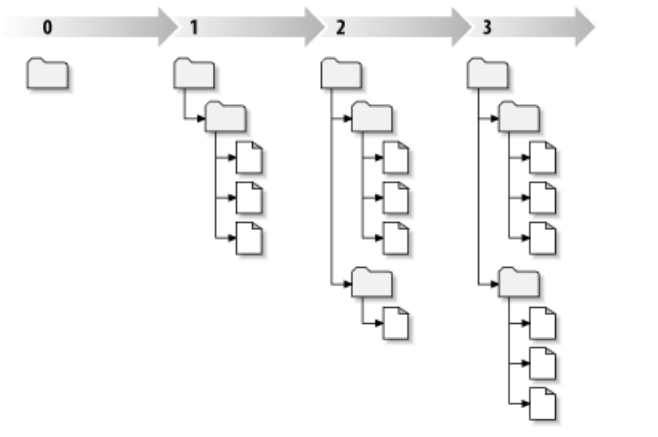
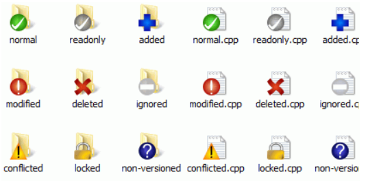

<!--
 * @Author: JohnJeep
 * @Date: 2020-11-20 10:59:05
 * @LastEditTime: 2022-05-20 23:16:16
 * @LastEditors: DESKTOP-0S33AUT
 * @Description: SVN学习笔记
-->

<!-- TOC -->

- [1. 概念](#1-概念)
- [2. 目录约定](#2-目录约定)
- [3. 图标](#3-图标)
- [4. svn冲突](#4-svn冲突)
- [5. Git与SVN的区别](#5-git与svn的区别)
- [6. subversion 常用流程](#6-subversion-常用流程)
- [7. 常用命令](#7-常用命令)
  - [7.1. add](#71-add)
  - [7.2. checkout](#72-checkout)
  - [7.3. commit](#73-commit)
  - [7.4. lock/unlock](#74-lockunlock)
  - [7.5. update](#75-update)
  - [7.6. status](#76-status)
  - [7.7. delete](#77-delete)
  - [7.8. cat](#78-cat)
  - [7.9. list](#79-list)
  - [7.10. diff](#710-diff)
  - [7.11. copy](#711-copy)
  - [7.12. merge](#712-merge)
  - [7.13. log](#713-log)
  - [7.14. info](#714-info)
  - [7.15. resolved](#715-resolved)
  - [7.16. switch](#716-switch)
  - [7.17. revert](#717-revert)
- [8. 参考](#8-参考)

<!-- /TOC -->

# 1. 概念

什么是Subversion?
 
> Subversion的版本库是一种特别的文件版本库，它会记录每一次改变：每个文件的改变，甚至是目
录树本身的改变。

文件共享
- 一般的文件共享采用的是 `lock-modify-unlock` 的方式
- Subversion、VS和一些版本控制系统使用  `copy-modify-merge`模型。
  > 在这种模型里，每一个客户联系项目版本库建立一个个人工作拷贝—版本库中文件和目录的本地映射。用户并行工作，修改各自的工作拷贝，最终，各个私有的拷贝合并在一起，成为最终的版本，这种系统通常可以辅助合并操作，但是最终要靠人工去确定正误。

工作副本

>  `.svn `为名的文件夹，也被叫做工作副本的管理目录，这个目录里的文件能够帮助 Subversion 识别哪些文件做过修改，哪些文件相对于别人的工作已经过期。


修订版本

> 每当版本库接受了一个提交，文件系统进入了一个新的状态，叫做一次修订`(revision)`，每一个修订版本被赋予一个独一无二的自然数，一个比一个大，初始修订号是0，只创建了一个空目录，没有任何内容。版本库每一次的提交，保存的是工作副本中改变的快照，并不是整个工作副本的快照。



工作副本怎样跟踪版本库？
- 工作副本基于的修订版本
- 时间戳：记录了工作副本从版本库中最后一次的拷贝。   
-  工作副本中的四中状态
   - 未修改且是当前的。文件在工作目录里没有修改，在工作修订版本之后没有修改提交到版本库。
   - 本地已修改且是当前的。文件在工作目录里已经修改，在工作修订版本之后没有修改提交到版本库。
   - Unchanged, and out of date。这个文件在工作目录没有修改，但在版本库中已经修了。这个文件最终将更新到最新版本，成为当时的公共修订版本。
   - Locally changed, and out of date。这个文件在工作目录和版本库都得到修改。一个svn commit将会失败，这个文件必须首先更新，svn update命令会合并公共和本地修改，如果Subversion不可以自动完成，将会让用户解决冲突。


# 2. 目录约定
- /trunk：开发主线
- /branches：支线副本
- /tags：标签副本，一旦创建，不允许修改。


# 3. 图标
- normal：状态正常
- modified：对本地的副本做了修改，需要提交到服务器
- conflicted：有冲突
- readonly：文件是只读的，要修改必须先获取锁
- locked：获得锁
- deleted：计划从版本库中删除
- added：已被计划纳入版本控制
- non-versioned：未纳入版本控制


图形化版本中各个图标表示含义
- 绿色：当前文件没有被修改过
- 红色：已修改，没有提交
- 蓝色：不属于版本库的未知文件，未知文件不能提交
- 蓝色加号：新增加的版本库文件
- 蓝色：提交一个修改。
- 紫色：提交一个新增项。
- 深红：提交一个删除或是替换。
- 黑色：所有其他项。



# 4. svn冲突
解决冲突有三种选择：
- A、放弃自己的更新，使用svn revert（回滚），然后提交。在这种方式下不需要使用svn resolved（解决）
- B、放弃自己的更新，使用别人的更新。使用最新获取的版本覆盖目标文件，执行resolved filename并提交(选择文件—右键—解决)。
- C、手动解决：冲突发生时，通过和其他用户沟通之后，手动更新目标文件。然后执行resolved filename来解除冲突，最后提交。


如何降低冲突解决的复杂度？
- 1、当文档编辑完成后，尽快提交，频繁的提交/更新可以降低在冲突发生的概率，以及发生时解决冲突的复杂度。
- 2、在提交时，写上明确的message，方便以后查找用户更新的原因，毕竟随着时间的推移，对当初更新的原因有可能会遗忘
- 3、养成良好的使用习惯，使用SVN时每次都是先提交，后更新。每天早上打开后，首先要从版本库获取最新版本。每天下班前必须将已经编辑过的文档都提交到版本库。


# 5. Git与SVN的区别
- Git是分布式，svn是集中式
- svn只有一个中央版本库，而git有无限个
- svn有全局的版本号，git没有
- git不必联网就可以看到所有的log，svn必须联网
- git保存的是元数据，svn是复制整个文档
- git强调分支，svn只是不同的文件目录，就是copy


# 6. subversion 常用流程
1. 拷贝版本库中的项目到本地工作环境中
   - `svn checkout xxxx`
2. 更新你的工作拷贝
   - `svn update`
3. 做出修改
   - `svn add`
   - `svn delete`
   - `svn copy`
    - `svn move`
4. 检查修改
  - `svn status`
  - `svn diff`
5. 撤销一些修改
   - `svn revert`
6. 解决冲突(合并别人的修改)
   - `svn update`
   - `svn resolved`
7. 提交你的修改
   - `svn commit`


# 7. 常用命令
最重要的是帮助命令，遇见不会的命令，需要自己查看帮助文档：`svn help subcommand`，其中 subcommand 为 subversion 的内建命令。

## 7.1. add
- 往版本库中添加新的文件 
- `svn add *.php` 添加当前目录下所有后缀名为 `.php` 的文件。

## 7.2. checkout
- 将从SVN版本库中拷贝项目到本地工作目录中，得到一个本地拷贝，这个拷贝包括了命令行指定版本库中的HEAD(最新的)版本。
-  例如：`svn checkout svn://192.168.1.131/45dian/brand`


## 7.3. commit
- 将本地版本库中改变的文件提交到SVN版本库中
- `svn commit -m “LogMessage“ [-N] [--no-unlock] PATH` (如果选择了保持锁，就使用–no-unlock开关)
 - 例如：`svn commit -m “add test file for my test“ test.php`


## 7.4. lock/unlock
lock/unlock 表示 加锁  与解锁。

- `svn lock -m “LockMessage“ [--force] PATH`
 - 例如：`svn lock -m “lock test file“ test.php`


## 7.5. update
更新你的工作拷贝 

- `svn update`： 会把版本库的修改带到工作拷贝,如果没有给定修订版本,它会把你的工作拷贝更新到 HEAD 修订版本,否则,它会把工作拷贝更新到你用 `--revision` 指定的修订版本。为了保持同步, `svn update` 也会删除所有在工作拷贝发现的无效锁定
- 每个更新的项目开头都有一个表示所做动作的字符
  - A: add
  - B: Broken lock (third column only)
  - D: delete
  - U: update
  - C: conflict
  - G: merge
  - E: existed
  - R: replace
  - M: modified
  - `?`: 未添加到工程中的文件。
  - `!`: 工程中没有该文件，但并没有从版本库中删除。

>  `.svn` 目录记录着文件的修改日期和原始内容。


- 用法
  - `svn update` 后面没有加目录，表示默认更新当前目录及子目录的所有文件到最新版本。
  - `svn update -r 200 test.php` 将版本库中的 test.php 文件还原到 200 版本。

- update命令还可以进行文件恢复。
  - 不小心写错了很多东西，想撤销所写的东西（已经把修改提交到服务器）`svn update -r 版本号`
  - 不小心删错了文件，想把文件恢复回来（已经把删除提交到服务器）`svn update -r 版本号` 


## 7.6. status
- `svn status`: 打印所有本地修改的文件，默认情况下，不会联系版本库.
-  `svn status -v`: 显示所有版本控制下的文件。

## 7.7. delete
- `svn delete aa.txt` 删除工作区远程库中的 aa.txt 文件；若只是在工程中删除 `aa.txt` 文件，不使用 `svn delete` 指令，则远程版本库中还存在 `aa.txt` 文件，使用 `svn update` 命令后，原先已存在 `aa.txt` 文件会再次更新到工作区中。


## 7.8. cat
- `svn cat`: 检查一个过去的版本而不希望察看它们的区别
```
$ svn cat -r 2 rules.txt
Be kind to others
Freedom = Chocolate Ice Cream
Everything in moderation
Chew with your mouth open
```

## 7.9. list
- `svn list`  可以在不下载文件到本地目录的情况下来察看服务器远程库目录中的文件
```
$ svn list http://svn.collab.net/repos/svn
README
branches/
clients/
tags/
trunk/
```


## 7.10. diff
- `svn diff file` 将修改的 file 文件与基础版本比较。
  - 例如：`svn diff test.php`

- `svn diff -r m:n path`: 对版本m和版本n比较差异
  - 例如：`svn diff -r 200:201 test.php`
  - 简写：svn di

## 7.11. copy
- 从主干上创建分支: `svn cp -m "create branch"  http://svn_server/xxx_repository/trunk  http://svn_server/xxx_repository/branches/br_feature001 `

- 获得分支: `svn checkout http://svn_server/xxx_repository/branches/br_feature001`


## 7.12. merge
- `svn merge -r m:n path`
- 例如：`svn merge -r 200:205 test.cpp`（将版本200与205之间的差异合并到当前文件，但是一般都会产生冲突，需要处理一下）


## 7.13. log 
- `svn log -l 10`: 查看最近提交的10条记录
- `svn log test.cpp`: 显示这个文件的所有修改记录，及其版本号的变化。
- `svn log -r {2018-07-03}:{2018-07-09}`: 查看一段时间的日志
- `svn log -r r196674 -v`: 查看某一版本所修改的文件列表及说明


## 7.14. info
- `svn info test.cpp`：查看test.cpp文件的详细信息。
  ```
  Path: xxx.cpp
  Name: xxx.cpp
  Working Copy Root Path: /home/john/development/GMP2000
  URL: https://112.17.80.221/svn/xxx.cpp
  Relative URL: ^/branches/xxx.cpp
  Repository Root: https://112.17.80.221/svn/xxx
  Repository UUID: d9902de0-23ea-1e4c-b6e9-eed385be7707
  Revision: 3485
  Node Kind: file
  Schedule: normal
  Last Changed Author: xxxx
  Last Changed Rev: 3482
  Last Changed Date: 2021-02-25 10:52:10 +0800 (Thu, 25 Feb 2021)
  Text Last Updated: 2021-02-23 11:46:24 +0800 (Tue, 23 Feb 2021)
  Checksum: fa59dd9a5472e6ad5cdd17968c9b8952dcf107c5
  ```

## 7.15. resolved
- `svn resolved`: 移除工作副本的目录或文件的“冲突”状态。
- 用法: `svn resolved PAT`
- 注意: 本命令不会依语法来解决冲突或是移除冲突标记，它只是移除冲突的相关文件，然后让 PATH 可以再次提交。


## 7.16. switch
- `svn switch (sw)`: 更新工作副本至不同的URL。
  - 1、更新你的工作副本，映射到一个新的URL，其行为跟“svn update”很像，也会将服务器上文件与本地文件合并。这是将工作副本对应到同一仓库中某个分支或者标记的方法。
  - 2、改写工作副本的URL元数据，以反映单纯的URL上的改变。当仓库的根URL变动(比主机名称变动)，但是工作副本仍旧对映到同一仓库的同一目录时使用这个命令更新工作副本与仓库的对应关系

## 7.17. revert
- 本地文件发生改变后，想要恢复到未改变之前的状态，可以用 `svn revert` 命令。
- `svn revert files` 将 files 恢复到未改变之前的状态。
- `svn revert --recursive build/xxx/file` 将 build/xxx/ 路径下的多个 file 恢复到未改变之前的状态。
- 注意: 此命令只改变本地工作区的内容，对远程库不行，文件已被 `svn delete` 指令删除，则不会被恢复。


# 8. 参考
- [linux下svn命令使用大全](http://blog.chinaunix.net/uid-22566367-id-1965771.html)
- [Linux下常用svn命令](https://www.cnblogs.com/jaspersong/p/9277720.html)
- [SVN的安装和使用手册](https://blog.csdn.net/sinat_37812785/article/details/80243207)    
- [SVN简介](https://blog.csdn.net/weixin_37654790/article/details/85367741)
- [windows下使用SVN命令行](https://www.cnblogs.com/ysk123/p/9910461.html)
- [版本控制器：SVN教程](http://www.flyne.org/article/851)
- [SVN教程](https://easydoc.top/s/78711005/uSJD1CDg/60815798)