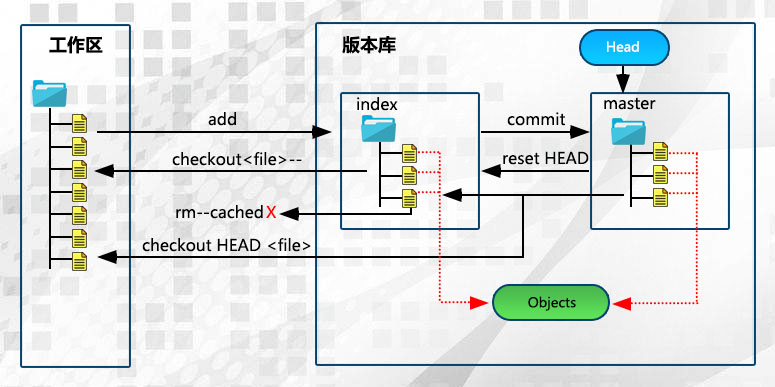
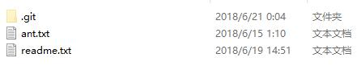

```
 * @Author: JohnJeep
 * @Date: 2020-04-04 23:28:59
 * @LastEditTime: 2020-05-19 21:11:11
 * @LastEditors: JohnJeep
 * @Description: git基础命令学习
```

<!-- TOC -->

- [Git基础](#git%e5%9f%ba%e7%a1%80)
  - [Git常用命令](#git%e5%b8%b8%e7%94%a8%e5%91%bd%e4%bb%a4)
  - [Git log](#git-log)
  - [Git标签](#git%e6%a0%87%e7%ad%be)
  - [Git别名](#git%e5%88%ab%e5%90%8d)
  - [Git branch](#git-branch)
  - [Git checkout](#git-checkout)
  - [Git rebase](#git-rebase)
  - [Git commit](#git-commit)
  - [Git diff](#git-diff)
- [提交代码总结](#%e6%8f%90%e4%ba%a4%e4%bb%a3%e7%a0%81%e6%80%bb%e7%bb%93)
- [分支管理](#%e5%88%86%e6%94%af%e7%ae%a1%e7%90%86)
  - [基础原理](#%e5%9f%ba%e7%a1%80%e5%8e%9f%e7%90%86)
  - [Git冲突](#git%e5%86%b2%e7%aa%81)
  - [Git Bug](#git-bug)
- [远程仓库](#%e8%bf%9c%e7%a8%8b%e4%bb%93%e5%ba%93)
  - [命令](#%e5%91%bd%e4%bb%a4)
  - [Git pull与Git fetch区别](#git-pull%e4%b8%8egit-fetch%e5%8c%ba%e5%88%ab)
  - [远程仓库与本地的关联](#%e8%bf%9c%e7%a8%8b%e4%bb%93%e5%ba%93%e4%b8%8e%e6%9c%ac%e5%9c%b0%e7%9a%84%e5%85%b3%e8%81%94)
- [Git删除与恢复](#git%e5%88%a0%e9%99%a4%e4%b8%8e%e6%81%a2%e5%a4%8d)
  - [删除指定文件](#%e5%88%a0%e9%99%a4%e6%8c%87%e5%ae%9a%e6%96%87%e4%bb%b6)
  - [恢复删除的文件](#%e6%81%a2%e5%a4%8d%e5%88%a0%e9%99%a4%e7%9a%84%e6%96%87%e4%bb%b6)
  - [Git Reset](#git-reset)
- [Git工作区、暂存区、Git仓库](#git%e5%b7%a5%e4%bd%9c%e5%8c%ba%e6%9a%82%e5%ad%98%e5%8c%bagit%e4%bb%93%e5%ba%93)
  - [工作区](#%e5%b7%a5%e4%bd%9c%e5%8c%ba)
  - [暂存区](#%e6%9a%82%e5%ad%98%e5%8c%ba)
  - [Git版本库](#git%e7%89%88%e6%9c%ac%e5%ba%93)

<!-- /TOC -->

学习参考：
- [廖雪峰官方网站](https://www.liaoxuefeng.com/wiki/0013739516305929606dd18361248578c67b8067c8c017b000)
- [GitWeb上模拟训练](https://learngitbranching.js.org/)
- [蚂蚁部落](http://www.softwhy.com/article-8535-1.html)
- [**图解Git**](http://marklodato.github.io/visual-git-guide/index-zh-cn.html)
- [**高质量的Git中文教程 git-recipes**](https://github.com/geeeeeeeeek/git-recipes)


## Git基础
### Git常用命令
- `git init`初始化一个Git仓库 
- 添加文件到Git仓库，分两步：
  - `git add <file>` 添加文件到暂存区
  - `git commit -m <message>` 给添加到暂存区的文件增加注释，`-m` 代表是提交信息
- `git status` 查看当前工作区的状态
- `git diff` 比较工作区中当前文件和暂存区快照之间的差异
- `git diff --stage` 查看已暂存的将要添加到下次提交里的内容
- `git difftool` 使用图像化工具查看工作区与暂存区之间的差异
- `git reflog` 查看引用日志。每次提交或改变分支都会改变引用日志(reflog) 
- `git reset --hard HEAD^` 回退到 `HEAD^`版本
- `git config --list` 列出所有 Git 当时能找到的配置
- `git help <verb>` 查看帮助，verb为Git的关键字


### Git log
- `git log` 查看历史记录。按提交时间列出所有的更新，最近的更新排在最上面。显示的有HASH散列码、提交日期、提交的注释等。
  - `HEAD` 表示当前版本，下标从零开始。
  - `HEAD^` 上一个版本就是，`HEAD^^` 上上一个版本就是,当然往上100个版本写100个^比较容易数不过来，所以写成`HEAD~100`
- `git log -g`: 按照标准日志的格式输出引用日志（reflog）
- `git log -p` 打印提交更新的所有内容，包括文件的内容
- `git log -p -2` 显示最近两次提交的内容
- `git log --stat` 每次提交的简略的统计信息，包括多少个文件改变、HASH码、日期、提交的注释等信息。
- `git log --pretty=keyword` 指定使用不同于默认格式的方式展示提交历史。keyword 有以下内建的子选项
  - online：将每个提交放在一行显示，查看的提交数很大时非常有用。
  - format：定制自己要显示的记录格式。
- `git log --graph`：显示 ASCII 图形表示的分支合并历史，常与`--pretty=format`结合使用。例如：`git log --pretty=format:"%h %s" --graph`
- `gir log --name-status` 显示新增、修改、删除的文件清单。
- `git log --since=2.weeks` 列出所有最近两周内的提交。since与until按照时间对提交的内容做筛选，后面可以直接跟特定的时间。`--since=2020-01-07`
- `git log -S 筛选内容`  列出那些添加或移除了某些字符串的提交。
- `git fsck --full`: 显示出所有没有被其他对象指向的对象。`git fsck` 检查所有数据库的完整性。


### Git标签
- 两种类型
  - 轻量标签（lightweight）：很像一个不会改变的分支——它只是一个特定提交的引用。
    - 本质上是将提交校验和存储到一个文件中——没有保存任何其他信息。 
    - `git tag 标签名`创建标签
  - 附注标签（annotated）：存储在 Git 数据库中的一个完整对象
    - `git tag -a v1.0 -m "first commit"` 创建标签;`-m`选项指定了一条将会存储在标签中的信息。
    - `git show 标签名`看到标签信息与对应的提交信息
- `git tag -a 标签号 HASH码`后期给指定文件打标签
- `git push origin(仓库别名) 标签名`将标签共享到远程仓库上
- `git push origin --tags`将所有不在远程仓库服务器上的标签全部推送到上面。
- `git tag -d <tagname>`删除掉本地仓库上的标签
- `git push <remote> :refs/tags/<tagname> ` 更新并删除远程仓库标签
- `git tag` 查看历史tag记录
- `git checkout v1.0` 切换到某个tag，查看某个标签所指向的文件版本。
  > 注意： 会导致仓库处于分离头指针(detacthed HEAD)状态.在“分离头指针”状态下，如果你做了某些更改然后提交它们，标签不会发生变化，但你的新提交将不属于任何分支，并且将无法访问，除非确切的提交哈希。


### Git别名
- `git config --global alias.unstage 'reset HEAD --'`  给取消暂存取一个别名


### Git branch
- 本地仓库分支
  - `git branch` 查看本地仓库分支
  - `git branch -v` 查看每个分支最后一次提交的内容
  - `git reflog show --date=iso master`  查看指定分支的历次更改记录
  - `git branch --merge` 查看哪些分支已经合并到当前分支
  - `git branch --no-merged` 查看所有包含未合并工作的分支
  - `git branch branch_name` 创建一个分支，且不会自动切换到新分支中去
  - `git merge`合并分支：在分支`a`下写代码，与分支`master`上的代码合并
    - 第一步，切换到分支`master`下`git chechout master`
    - 第二步，与分支`a`合并`git merge a`
  - `git branch -d a` 删除指定分支 a 
  - `git branch -D a` 强制把未合并的分支删除
  - `git log --oneline --decorate --graph --all` 查看提交历史、各个分支的指向以及项目的分支分叉情况
  - `git stash save` 切换分支之前保存要修改的文件，不想提交之前的工作
  - `git stash list` 查看存储在栈上的文件
  - `git stash apply` 将最近存储的文件重新使用
  - `git stash apply stash_name`使用之前某次存储的文件


- 远程仓库分支
  - `git branch --remote` 查看远程仓库分支


- 常用分支命名：
<font color="red"> <br>
develop <br>
topic <br>
proposed <br>
hotfix(紧急分支) <br>
iss534  <br>
experiment <br>
</font>


### Git checkout
- 切换或者新建分支
  - `git checkout  branch_name`   切换到branch_name分支下
  - `git branch Develop`  新建Develop分支
  - `git checkout -b newBr2`   新建newBr2分支，并切换到当前分支

- 用暂存区或者指定commit提交内容覆盖工作区内容
  -  用暂存区内容覆盖工作区内容 
     - `git checkout readme.txt` 将暂存区中的`readme.txt`文件还原到工作区，如果要还原多个文件，使用**空格**分隔
     - 还原所有文件 `git checkout .`
     - 特别说明：如果checkout后面是文件名称，以下写法更为稳妥：`git checkout -- readme.txt`
       - 文件名称前面有两个**横杠**，并且中间采用**空格**分隔（否则报错）。此种方式可以防止Git出现误判，加入暂存区有一个文件名为`ant`（没有后缀名），恰好当前项目也有有个名为`ant`的分支，这个时候Git会优先将`ant`当做分支处理，于是就有可能导致错误 
  - 指定commit提交的内容覆盖工作区 
    - `git checkout Develop -- readme.txt`  将对应分支中的文件(readme.txt)还原到当前分支(Develop)的工作区


### Git rebase
- `pick` 使用这个参数，commit信息什么都不用做。
- `reword` 修改commit信息。
- `edit`  修改commit提交的内容。但是使用这个命令的时候，rebase 操作会停在commit提交处，等待修改完毕，使用`git add .` 和 `git commit --amend` 修改提交，`git rebase --continue`继续 rebase 进程。
- `squash` 将当前需要改变的commit信息与之前commit提交的信息进行合并，把融合的信息保存到融合后的提交中。
- `fixup` 放弃融合后提交的提交信息。
- `exec` 在新的一行使用shell来运行commit信息。
- `drop` 删除commit 提交信息。


### Git commit
参考：
- [Git 修改已提交的commit注释](https://www.jianshu.com/p/098d85a58bf1)
- [Commit message 和 Change log 编写指南](http://www.ruanyifeng.com/blog/2016/01/commit_message_change_log.html)
- [git rebase vs git merge详解](https://www.cnblogs.com/kidsitcn/p/5339382.html)

1. 修改最近一次的注释
   - `git commit --amend` 修改最后一次提交的注释 
   - `git rebase --continue` 执行修改的commit
   - push到远程GitHub，若有冲突，需要将远程repository的代码pull到本地，然后再push到远程repository。

2. 修改历史提交的注释
   - `git log -n 4` 查看最近4次操作的日志
   - `git rabase -i HEAD~n` 修改倒数第n次的commit
   - 将`pick`修改为`edit`
   - `git commit --amend`修改commit的内容
   - `git rebase --continue` 执行修改的commit
   - push到远程GitHub，若有冲突，需要将远程repository的代码pull到本地，然后再push到远程repository。
  

### Git diff
- `git diff` 比较工作区和暂存区之间的差异
- `git diff HEAD` 比较工作区与最新本地仓库之间的差异
- `git diff --cached`比较暂存区与最新本地仓库的差异 
- `git diff master origin/master `  查看本地仓库中分支为 `master` 的文件与Github远程仓库中别名为`origin`下 `master` 分支文件的差异。


## 提交代码总结
第一次提交：
- `git init`  初始化
- `git add README.md`   提交到暂存库
- `git commit -m "first commit"`   为提交的文件添加注释说明
- `git remote add origin git@github.com:michaelliao/learngit.git`  本地Git库与远程的仓库关联
- `git push -u origin master`      本地库的所有内容推送到远程库上


不是第一次提交：
- `git add README.md`              提交到暂存库
- `git commit -m "first commit"`   为提交的文件添加注释说明
- `git push origin master`         本地库的所有内容推送到远程库上


## 分支管理
### 基础原理
- 概念
  - <font color="red">Git分支本质：指向提交对象的可变指针</font>
   > 包含所指对象校验和（长度为 40 的 SHA-1 值字符串）的文件，所以它的创建和销毁都异常高效。 创建一个新分支就相当于往一个文件中写入 41 个字节（40 个字符和 1 个换行符）
  - <font color="red">HEAD指针指向的当前所在分支，HEAD 分支随着提交操作自动向前移动。</font>
  - Git合并分支很快！就改改指针，工作区内容也不变！


- 每次提交，Git都把它们串成一条时间线，这条时间线就是一个分支。`HEAD` 不是指向提交，而是**指向** `master`，`master` 才是**指向**提交的，所以`HEAD` 指向当前所在分支。
- 一开始的时候，`master`分支是一条线，Git用`master`指向最新的提交，再用`HEAD`**指向**`master`，就能确定当前分支，以及当前分支的提交点：
<div align="center"> </div>

- 每次提交，`master` 分支都会向前移动一步，这样，随着你不断提交，`master`分支的线也越来越长。当创建一个新的分支 `dev`时，Git新建了一个指针叫`dev`，指向与`master` 相同的提交，再把 `HEAD` 指向 `dev`，就表示当前分支在`dev`上:
<div align="center"> </div>

- Git创建一个分支很快，因为除了增加一个`dev`指针，改改`HEAD`的指向，工作区的文件都没有任何变化！不过，从现在开始，对工作区的修改和提交就是针对`dev`分支了，比如新提交一次后，`dev`指针往前移动一步，而`master`指针不变：
<div align="center"> </div>

- 假如我们在`dev`上的工作完成了，就可以把`dev`合并到`master`上。Git怎么合并呢？最简单的方法，就是直接把`master`指向`dev`的当前提交，就完成了合并：
<div align="center"> </div>

- 合并完分支后，甚至可以删除`dev`分支。删除`dev`分支就是把`dev`指针给删掉，删掉后，我们就剩下了一条`master`分支：
<div align="center"> </div>


### Git冲突
- 参考：
  - [彻底搞懂 Git-Rebase](http://jartto.wang/2018/12/11/git-rebase/)
  - [Git冲突与解决方法](https://www.cnblogs.com/gavincoder/p/9071959.html) 
  - [Git分支合并冲突解决](https://www.cnblogs.com/shuimuzhushui/p/9022549.html)


- 为什么会产冲突？
  - 两个分支中修改了相同的文件。**注意：** 两个分支中分别修改了不同文件中的部分，不会产生冲突，可以直接将这两部分合并。
  - 两个分支中修改了同一个文件的名称 


-  采用`Git rebase(变基)`与`git merge`进行解决
  - 什么时候用`rebase`？
    - 本质是先取消自己的提交，临时保存，然后把当前分支更新到最新的origin分支，最后应用自己的提交。
    - 合并多次提交纪录: 例如：合并前4次提交的记录`git rebase -i HEAD~4`，合并的 commit 不能是已经 push 到远程仓库的记录。
    - 合并分支
    - <font color="red"> 注意: </font> 已经推送到github远程仓库的文件（多人开发的重要分支）不要，使用 `git rebase`，否则远程仓库的分支记录会被修改，别人就不能正常的提交了。


  - 什么时候用`merge`?
    - 默认情况下，Git执行"快进式合并"（fast-farward merge），会直接将Master分支指向Develop分支。使用`--no-ff`  参数，用普通模式合并，在master主分支上生成一个新的节点。可以在分支历史上看哪些曾经做过哪些的合并；而`fast forward`合并，则没有合并操作的记录，会丢掉分支信息。`git merge --no-ff -m "merge with   no-ff" dev` 
    - 将两个分支进行合并提交。将一个分支的变更集成到另一个分支的变更。 


### Git Bug
- Git还提供了一个stash功能，可以把当前工作现场“储藏”起来，等以后恢复现场后继续工作：`git stash`,去解决Bug问题
- `git stash list`命令查看存储的工作现场 
- Git把`stash`内容存在某个地方了，但是需要恢复一下，有两个办法
  - 一是用`git stash apply`恢复，但是恢复后，stash内容并不删除，你需要用`git stash drop`来删除
  - 另一种方式是用`git stash pop`,恢复的同时把`stash`内容也删了。


## 远程仓库
### 命令
- `git remote -v` 显示GitHub远程仓库上使用 Git 保存的别名和对应的 URL
- `git remote show remote_name` 查看某个远程仓库
- `git remote rename old_name new_name` 重命名原仓库名字
- `git remote rm remote_name` 移除一个远程仓库
- `git remote add <alias_name> <url>` 添加一个新的远程 Git 仓库，同时给远程仓库起个别名 alias_name


### Git pull与Git fetch区别
1. `Git pull`: 查找当前分支所跟踪的服务器与服务器上的分支，从服务器上抓取数据，然后自动合并远程分支与本地仓库的分支(相当于 `git fetch` 和`git merge`两者的叠加)
2. `git fetch`: 从服务器上抓取本地没有的数据时，它并不会修改工作目录中的内容。它只会获取数据然后让你自己合并。


### 远程仓库与本地的关联
1. `git remote add origin   git@github.com:michaelliao/learngit.git` 将本地仓库添加到远程Git仓库，默认别名为 `origin`
2. 当前分支的内容就会被推送给远程仓库`origin` 的`master` 分支:`git push -u origin master`
   - **-u** 参数可以在推送的同时，将`origin` 仓库的`master` 分支设置为本地仓库当前分支的**upstream（上游）**。添加了这个参数，将来运行`git pull`命令从远程仓库获取内容时，本地仓库的这个分支就可以直接从`origin`的`master` 分支获取内容，省去了另外添加参数的麻烦。 
   - Git支持多种协议，包括`https`，但通过`ssh`支持的原生git协议速度最快。
3. 把当前分支`master`推送到远程。由于远程库是空的，我们第一次推送`master`分支时，加上了`-u`参数，Git不但会把本地的`master`分支内容推送的远程新的`master`分支，还会把本地的`master`分支和远程的`master`分支关联起来，在以后的推送或者拉取时就可以简化命令。
4. `git push origin master` 本地仓库推送到远程仓库
5. `git clone URL` 克隆一个仓库


## Git删除与恢复
### 删除指定文件
1. 使用`linux`命令`rm`删除
   - 删除本地目录文件，但是提交到暂存区的文件不会删除 `rm filename`  
   - 纯粹的linux命令删除一个文件需要三个步骤：
     - `rm` 删除文件。
     - 将此种改变提交暂存区。
     - 最后进行`commit`提交
2. 使用`git rm`命令删除
   - 不但将暂存区中的内容删除，并且工作区中对应的文件也会  被删除 `git rm filename`
   - `git rm --cache filename` 删除暂存区文件
   - **特别说明**：处于未跟踪状态只是没有存在于暂存区，历史提交记录中的记录依然存在。
3. 删除暂存区
   - git rm filename
   - git commit -m "comment content"
   - git push origin master
4. 删除暂存区并更新远程仓库
   - git rm --cached filename
   - git commit -m "comment content"
   - git push origin master --force


### 恢复删除的文件
1. 恢复`rm`删除的文件:
     - rm只是将工作区中的文件删除，暂存区相应的文件依然存在，只要将暂存区内容恢复到工作区即可
     - `git checkout filename`
2. 恢复使用`git rm`删除的文件
    - 被`git rm`命令删除，对应暂存区的文件已经不存在，那么只能从`commit`提交记录中恢复 
    - `git checkout HEAD readme.txt`  将最后一次`commit`提交中的`readme.txt`文件恢复
3. <font color="red">任何情况都可以恢复吗? </font>
  > 当然不是，如果你把`.gti`目录删除了，那肯定是无法再恢复。实质上，之所以能将删除的文件恢复，因为在`.git`目录中有备份，`Git`会将**暂存区**或者**历史提交**中内容来恢复


### Git Reset
1. `git reset`命令是Git提供的后悔药之一，它可以帮我们把内容恢复到指定的`commit`提交版本。
2. `reset`翻译成中文有**重置**的意思，恰如起名，`git reset`命令可以重置当前分支所指向提交的位置，很多教程说此命令的作用是删除分支或者提交，其实这是完全错误的，`commit`提交依然存在，只是当前分支所指向的`commit`提交进行了重置，分支所指向的新`commit`提交之后的提交就像消失了一样（`git log`无法查询到）
3. 命令后面紧跟参数
   - `git reset`后面紧跟的参数是指定`commit`提交的标识 `git reset 5609309 --hard`
   - 标识可以是`sha-1`值或者`HEAD`、`HEAD^`或者分支名称等形式
     - `git reset HEAD^ --hard`
     - `HEAD`表示执行当前分支
   - 最后的参数`--hard`
   - `^`当前分支所指向提交的前一个提交，`^^`表示当前分支所指向提交的前一个分支的前一个分支，以此类推；`^^`过多自然不太方便，可以使用`HEAD~2`表示
   - 使用分支名称作为参数`git reset master^ --hard`
4. **mixed**、**soft**和**hard**区别
    - `--mixed`：默认值，当重置分支所指向`commit`提交位置时，暂存区中的内容会被新指向的`commit`提交内容所替换，工作区内容不变。
    - `--soft`：暂存区和工作区的内容都保持原样，不会被替换。
    - `--hard`：暂存区和工作区的内容都会被新指向的`commit`提交内容所替换；`git reset --hard`只影响被跟踪的文件，如果工作区有新增的文件，并不会被影响。
5. 最后说明
   - 假如`commit`已经被`push`到远程仓库上，那么其他开发人员可能会基于对应的`commit`提交进行开发产生新的`commit`，如果此时进行`reset`操作，会造成其他开发人员的提交历史丢失，这可能会产生严重后果。


## Git工作区、暂存区、Git仓库
[参考文章--版本库](http://www.softwhy.com/article-8494-1.html)
<div align="center"> </div>

1. Git不是存储每个文件与初始版本的差异，而是把数据看作是对小型文件系统的一组快照。
   > 每次你提交更新，或在 Git 中保存项目状态时，它主要对当时的全部文件制作一个快照并保存这个快照的索引。 为了高效，如果文件没有修改，Git 不再重新存储该文件，而是只保留一个链接指向之前存储的文件。  
2. 几乎所有操作都是本地执行
3. Git保证了数据的完整性。所有数据在存储前都计算校验和(SHA-1 散列)，然后以校验和来引用。Git 数据库中保存的信息都是以文件内容的哈希值来索引，而不是文件名。
4. Git文件三种状态
   - 已提交(committed)：表示数据已经安全的保存在本地数据库中。
   - 已修改(modified)：表示修改了文件，但还没保存到数据库中。 
   - 已暂存(staged)：表示对一个已修改文件的当前版本做了标记，存储到暂存区中。


### 工作区
- 概念
   - 工作区就是执行`git init`命令所在的目录，我们要修改的文件就在此目录，但是并不包括`.git`目录。
<div align="center"> </div>

- 工作区目录下的每一个文件只有两种状态：已跟踪（添加到暂存区）或未跟踪（没有添加都暂存区）。


### 暂存区
1. 概念
   - **暂存区**仅仅是`.git`目录下的一个`index`文件，这也是为什么被称为index（索引）,是**指向**文件的索引。真正的文件存储在`.git/objects`目录中
   - 当删除**暂存区**内容的时候，其实就是删除`index`文件中的内容，`.git/objects`目录中的内容不会被删除。
<div align="center"> </div>


2. Git清空暂存区
   - 暂存区实质是`.git`目录下的`index`文件，只要将此文件删除，那么就可以认为暂存区被清空`rm .git /index`
3. 暂存区存在的必要性
   - 有些朋友感觉暂存区多余，其实并非如此，通过这个过渡性区域可以使提交更加条理，避免无用琐碎提交
4. `git ls-files` 查看暂存区内容
  - `--cached(-c)` 显示暂存区中的文件，`git ls-files`命令默认的参数
  - `--deleted(-d)` 显示删除的文件
  - `--modified(-m)` 显示修改过的文件
  - `--other(-o)` 显示没有被git跟踪的文件
  - `--stage(-s)` 显示mode以及文件对应的`Blob`对象，可以获取暂存区中对应文件里面的内容。

 
### Git版本库
1. 概念
   - 是 Git 用来保存项目的元数据和对象数据库的地方。从其它计算机克隆仓库时，拷贝的就是这里的数据。
   - 工作区根目录下有一个默认隐藏的目录`.git`，它并不属于工作区，而是版本库（Repository）。版本库中内容很多，并且都很重要，有两个是我们实际操作中经常要遇到的，那就是暂存区（也可以称之为`stage`或者`index`）和分支。
2. 将文件最终提交到版本库基本流程如下：
   - `git add`    将工作区未跟踪和修改文件提交到暂存区。
   - `git commit` 将暂存区内容提交到版本库中。暂存区就如同一个临时性仓库，可以将来自工作区的新文件或者修改文件暂时存放起来，然后统一提交到分支中的版本库中。
3. Git清空版本库
   - `rm -rf .git` 删除当前目录下的版本库（`.git`目录）
   - `git init`    重新初始化一个全新的版本库