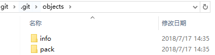

<!--
 * @Author: your name
 * @Date: 2020-05-01 16:22:04
 * @LastEditTime: 2020-05-14 21:49:46
 * @LastEditors: Please set LastEditors
 * @Description: In User Settings Edit
 * @FilePath: \Learning-Computer-Journey\Git\2-Git提高.md
 -->
```
 * @Author: JohnJeep
 * @Date: 2020-05-01 16:22:04
 * @LastEditTime: 2020-05-13 20:01:44
 * @LastEditors: JohnJeep
 * @Description: In User Settings Edit
```
<!-- TOC -->

- [Git协议](#git%e5%8d%8f%e8%ae%ae)
  - [SSH(Secure Shell)协议](#sshsecure-shell%e5%8d%8f%e8%ae%ae)
- [Git内部原理](#git%e5%86%85%e9%83%a8%e5%8e%9f%e7%90%86)
- [Git数据存储的位置](#git%e6%95%b0%e6%8d%ae%e5%ad%98%e5%82%a8%e7%9a%84%e4%bd%8d%e7%bd%ae)

<!-- /TOC -->

## Git协议
- 四种协议传输资料
  - 本地(Local)协议
  - Git协议
  - HTTP协议
  - SSH(Secure Shell)协议


### SSH(Secure Shell)协议
1. 概念
   - SSH 协议支持口令与密钥两种安全验证模式，但无论那种模式，最终都需要使用密钥来加密数据以确保安全，而 SSH 密钥通常使用的算法为 RSA 和 DSA。


2. 命令　
   - SSH1：只支持RSAS算法
   - SSH2：支持RSA和DSA算法  
   - `ssh -T git@github.com`查看SSHkey
   - `sssh-keygen -t rsa` 使用RSA算法创建密钥
   - `id_rsa` 密钥 和 `id_rsa.pub` 公钥


3. 为什么要用SSH？
   - 是保证本机(当前电脑)与GitHub服务器连接的有效凭证
   - 因为GitHub需要识别出你推送的提交确实是你推送的，而不是别人冒充的，而Git支持SSH协议，所以，GitHub只要知道了你的公钥，就可以确认只有你自己才能推送。
   - GitHub允许你添加多个Key，只要把每台电脑的Key都添加到GitHub，就可以在每台电脑上往GitHub推送了。


## Git内部原理
- Git仓库中5个对象
  - 三个数据对象(blob object)：保存着文件快照
  - 一个树对象(tree object)：记录着目录结构和 blob 对象索引
  - 一个提交对象(commit object)：包含着指向树对象的指针和所有提交信息


- `hooks` 目录包含客户端或服务端的钩子脚本（hook scripts）
- `objects` 目录存储所有数据内容
- `refs` 目录存储指向数据（分支、远程仓库和标签等）的提交对象的指针
- `HEAD` 文件指向目前被检出的分支
- `index` 文件保存暂存区信息


## Git数据存储的位置
1. `.git`目录中的`objects`子目录就是用来存储数据的，其中两个子目录是系统自动创建的，可以看到当前并没有存储任何数据。
<center>  </center>


2. `git hash -object -w --stdin`  
   - `git hash-object`命令用来存储数据对象
   - `-w`表示不仅计算出内容的`sha-1`值，而且会将数据存储，否则只会给出`sha-1`值。
   - `--stdin`表示内容是通过标准输入设备获取的，比如我通过键盘输入


3. 内容存储位置总结如下：
   - 存储于`.git/objects`目录中。
   - 以`sha-1`值的前**2**作为子目录名称，存储内容的文件名字为`sha-1`值的后**38**位。
   - 查看`sha-1`值 里面的内容 `git cat-file -p`


