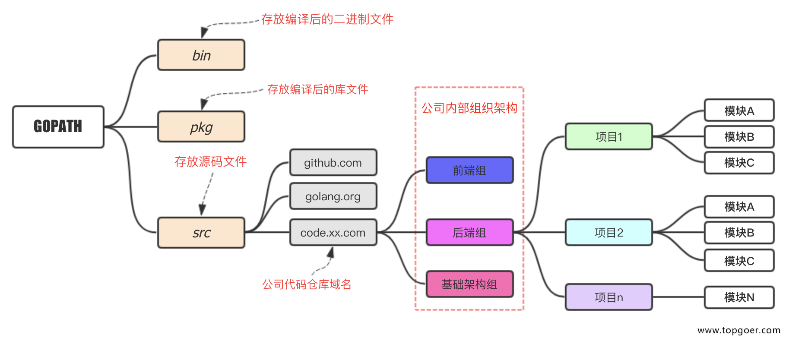

<!--
 * @Author: johnjeep
 * @Date: 2020-09-05 23:49:23
 * @LastEditors: johnjeep
 * @LastEditTime: 2022-12-27 22:38:35
 * @Description: Go语言学习
 * Copyright (c) 2022 by johnjeep, All Rights Reserved. 
-->

- [学习方法](#学习方法)
- [基本概念](#基本概念)
- [Golang特点](#golang特点)
  - [拥有特性](#拥有特性)
  - [不支持的特性](#不支持的特性)
- [Go 基础](#go-基础)
  - [代理](#代理)
  - [编译](#编译)
  - [内置类型](#内置类型)
    - [值类型](#值类型)
    - [引用类型](#引用类型)
  - [内置函数](#内置函数)
    - [append](#append)
    - [copy](#copy)
    - [make](#make)
    - [new](#new)
  - [内置接口](#内置接口)
    - [Error()](#error)
  - [声明](#声明)
    - [变量声明](#变量声明)
    - [类型声明](#类型声明)
  - [Unicode](#unicode)
  - [Basic Data Types(基础数据类型)](#basic-data-types基础数据类型)
    - [Constant 常量](#constant-常量)
    - [String](#string)
  - [Composite Types 复合类型](#composite-types-复合类型)
    - [Array](#array)
    - [Slice](#slice)
    - [Map](#map)
    - [Struct](#struct)
- [语言特性](#语言特性)
  - [Function 函数](#function-函数)
    - [Panic 异常](#panic-异常)
    - [defer](#defer)
    - [Recover](#recover)
  - [面向对象](#面向对象)
    - [Method 方法](#method-方法)
    - [面向对象编程的步骤](#面向对象编程的步骤)
    - [Encapsulation 封装](#encapsulation-封装)
    - [继承](#继承)
    - [多态](#多态)
    - [Interface 接口](#interface-接口)
    - [类型断言](#类型断言)
- [Concurrency 并发](#concurrency-并发)
  - [Goroutine](#goroutine)
    - [概念](#概念)
    - [特点](#特点)
    - [MPG模式](#mpg模式)
  - [Channel](#channel)
    - [声明 channel](#声明-channel)
    - [创建 channel](#创建-channel)
    - [关闭 channel](#关闭-channel)
    - [遍历 channel](#遍历-channel)
    - [注意事项](#注意事项)
- [Package 包](#package-包)
  - [包的作用](#包的作用)
  - [注意事项](#注意事项-1)
  - [项目构建](#项目构建)
  - [包之间调用](#包之间调用)
  - [打包](#打包)
  - [导入包](#导入包)
- [Testing 测试](#testing-测试)
- [Reflection 反射](#reflection-反射)
  - [概念](#概念-1)
  - [反射注意事项](#反射注意事项)
- [参考](#参考)

<!-- /TOC -->


# 学习方法
- 先知道怎么做，再知道为什么？
- 对知识有一个整体的框架，然后再学习具体的内容。

# 基本概念
GO语言的吉祥物：樱花鼠。

学习一门新的语言，需要掌握语言的变量、常量、表达式、控制流和函数等基本语法，这些都是每门语言通用的特性。


# Golang特点

## 拥有特性
1. 自动立即回收。
2. 更丰富的内置类型。
3. 函数多返回值。
4. 错误处理。
5. 匿名函数和闭包。
6. 包（package）。必须恰当导入需要的包，缺少了必要的包或者导入了不需要的包，程序都无法编译通过。这项严格要求避免了程序开发过程中引入未使用的包
7. 类型和接口。方法不仅可以定义在结构体上，而且，可以定义在任何用户自定义的类型上；具体类型和抽象类型（接口）之间的关系是隐式的，所以很多类型的设计者可能并不知道该类型到底实现了哪些接口。
8. 并发编程。
9. 反射。
10. 语言交互性。
11. 只读的 UTF8 字符串
12. 静态编译，编译好后，扔服务器直接运行。

## 不支持的特性
1. 没有隐式的数值转换。
2. 没有构造函数和析构函数。
3. 没有运算符重载。
4. 没有默认参数。
5. 没有继承、类、多态。仅仅通过组合简单的对象来构建复杂的对象。
6. 没有泛型。
7. 没有异常。
8. 没有宏。
9. 没有函数修饰。
10. 没有线程局部存储。

Go语言有足够的类型系统以避免动态语言中那些粗心的类型错误。

# Go 基础

## 代理

设置代理

七牛云

```
go env -w GOPROXY=https://goproxy.cn,direct
go env -w GOSUMDB=goproxy.cn/sumdb/sum.golang.org
```


## 编译

Go是一门编译型语言，Go语言的工具链将源代码及其依赖转换成计算机的机器指令。Go语言提供的工具都通过一个单独的命令`go`调用，`go`命令有一系列子命令。最简单的一个子命令就是 run。这个命令编译一个或多个以 `.go`结尾的源文件，链接库文件，并运行最终生成的可执行文件。

```go
go run xxx.go
```

Go 编译使用 `go build`, `go install` 命令。

Go build 编译参数

```go
-w 去掉调试信息
-s 去掉符号信息
-a 强制编译所有依赖包
-race 协程竞争关系
```

示例

```go
go build -ldflags "-s -w" -o main-ldflags main.go 
```

## 内置类型

### 值类型

```go
bool
int(32 or 64), int8, int16, int32, int64
uint(32 or 64), uint8(byte), uint16, uint32, uint64
float32, float64
string
complex64, complex128
array    -- 固定长度的数组
```

### 引用类型

```go
slice     -- 序列数组，也叫切片(最常用)
map       -- 映射
chan      -- 管道
interface --接口
```

## 内置函数

Go 语言拥有一些不需要进行导入操作就可以使用的内置函数。

```go
append          -- 用来追加元素到数组、slice中,返回修改后的数组、slice
close           -- 主要用来关闭channel
delete            -- 从map中删除key对应的value
panic            -- 停止常规的goroutine  （panic和recover：用来做错误处理）
recover         -- 允许程序定义goroutine的panic动作
real            -- 返回complex的实部   （complex、real imag：用于创建和操作复数）
imag            -- 返回complex的虚部
make            -- 用来分配内存，返回Type本身(只能应用于slice, map, channel)
new                -- 用来分配内存，主要用来分配值类型，比如int、struct。返回指向Type的指针
cap                -- capacity是容量的意思，用于返回某个类型的最大容量（只能用于切片和 map）
copy            -- 用于复制和连接slice，返回复制的数目
len                -- 来求长度，比如string、array、slice、map、channel ，返回长度
print、println     -- 底层打印函数，在部署环境中建议使用 fmt 包
```

官方英文文档：https://pkg.go.dev/builtin@go1.19.4

### append

函数原型 

```go
func append(slice []Type, elems ...Type) []Type
```

功能：在原slice的末尾添加元素，返回修改后的 slice

```go
s1 := []int{2, 3, 5, 7}
s1 = append(s1, 10)
```

### copy

函数原型：`func copy(dst, src []Type) int`

功能：将一个slice复制另一个相同类型的slice。 

参数：

- copy函数的第一个参数是要复制的目标slice，
- 第二个参数是源slice， 目标和源的位置顺序和 `dst = src` 赋值语句是一致的。 

两个slice可以共享同一个底层数组， 甚至有重叠也没有问题。 

返回值：返回成功复制的元素的个数， 等于两个slice中较小的长度， 所以我们不用担心覆盖会超出目标slice的范围。  

### make

make也是用于内存分配的，区别于new，它只用于slice、map以及chan的内存创建，而且它返回的类型就是这三个类型本身，而不是他们的指针类型，因为这三种类型就是引用类型，所以就没有必要返回他们的指针了。

用法

```go
var b map[string]int
b = make(map[string]int, 10)

// 等价于
b := make(map[string]int, 10)
```

用内置的make函数创建一个指定元素类型、 长度和容量的slice。 容量部分可以省略， 在这种情况下， 容量将等于长度。  

```go
make([]T, len)
make([]T, len, cap)
```

在底层， make创建了一个匿名的数组变量， 然后返回一个slice； 只有通过返回的slice才能引用底层匿名的数组变量。 在第一种语句中， slice是整个数组的view。 在第二个语句中， slice只引用了底层数组的前len个元素， 但是容量将包含整个的数组。 额外的元素是留给未来的增长用的。  

### new

new 是Go语言内置的一个函数，用于内存的分配。

用法

```go
// 函数签名
func new(Type) *Type

// 示例
a := new(int)

1. Type表示类型，new函数只接受一个参数，这个参数是一个类型
2. *Type表示类型指针，new函数返回一个指向该类型内存地址的指针。
```

**new 与make的区别**

1. 二者都是用来做内存分配的。
2. make只用于slice、map以及channel的初始化，返回的还是这三个引用类型本身；
3. 而new用于类型的内存分配，并且内存对应的值为类型零值，返回的是指向类型的指针。


## 内置接口

### Error()

```
//只要实现了Error()函数，返回值为String的都实现了err接口
type error interface { 
	Error()    String
}
```


## 声明

Go 语言有四种主要声明方式：

```
var（声明变量）, const（声明常量）, type（声明类型） ,func（声明函数）。
```

Go的程序是保存在多个`.go`文件中，文件的第一行就是 `package XXX` 声明，用来说明该文件属于哪个包(package)，package声明下来就是`import`声明，再下来是类型，变量，常量，函数的声明。

### 变量声明

Go 变量声明以关键字 `var`开头，变量类型放在变量的后面，行尾无需分号。

其标准声明格式如下：

```go
var 变量名 变量类型

var name string
var age int
var isOk bool
```

其中，变量类型名可以省略，就变成了隐式类型定义，因为编译器可以根据变量的值来推断其类型。

```go
var name 
var age 
var isOk
```

批量声明。每声明一个变量就需要写`var`关键字会比较繁琐，go语言中还支持批量变量声明：

```go
var (
    a string
    b int
    c bool
    d float32
)
```

Go语言在声明变量的时候，会自动对变量对应的内存区域进行初始化操作。每个变量会被初始化成其类型的默认值，例如： 整型和浮点型变量的默认值为0。 字符串变量的默认值为空字符串。 布尔型变量默认为`false`。 切片、函数、指针变量的默认为`nil`。

简短变量声明。用于声明和初始化局部变量。 它以`名字:= 表达式`形式声明变量， 变量的类型根据表达式来自动推导。  

```go
a := 10 // a为 int
b := "boy" // b为string
```

变量分为局部变量和全局变量。

**局部变量**：只在 `{}` 范围内定义的变量有效，离开了此作用域就失效了。

**全部变量**：定义在函数的外部的变量。

### 类型声明

类型声明通用格式

```go
type 类型名字 底层类型
```

一个类型声明语句创建了一个新的类型名称， 和现有类型具有相同的底层结构。 新命名的类型提供了一个方法， 用来分隔不同概念的类型， 这样即使它们底层类型相同也是不兼容的。  type 声明的类型是原类型的一个别名。

```go
type Celsius float64 // 摄氏温度
type Fahrenheit float64 // 华氏温度
```


## Unicode

在很久以前， 世界还是比较简单的， 起码计算机世界就只有一个ASCII字符集： 美国信息交换标准代码。 ASCII， 更准确地说是美国的ASCII， 使用7bit来表示128个字符： 包含英文字母的大小写、 数字、 各种标点符号和设备控制符。 对于早期的计算机程序来说， 这些就足够了，但是这也导致了世界上很多其他地区的用户无法直接使用自己的符号系统。   

Go 语言中的 Unicode 编码为 `rune`，即`int32`类型。

`unicode` 包提供了 `IsDigit`、 `IsLetter`、 `IsUpper`和`IsLower`等类似功能， 它们用于给字符分类。 每个函数有一个单一的`rune`类型的参数， 然后返回一个布尔值  。

## Basic Data Types(基础数据类型)

数据类型的作用：告诉编译器变量以多大的内存去存储。

### Constant 常量

常量表达式的值在编译期计算， 而不是在运行期。 每种常量的潜在类型都是基础类型：boolean、 string或数字。
一个常量的声明语句定义了常量的名字和变量的声明语法类似， 常量的值不可修改， 这样可以防止在运行期被意外或恶意的修改。  

```go
// 定义常量
const pi = 3.14
```

注意点

- 定义后，不能再修改
- 在定义的时候必须初始化
- 常量名也通过首字母的大小写来控制常量的访问范围。

批量声明常量。除了第一个外其它的常量右边的初始化表达式都可以省略， 如果省略初始化表达式则表示使用前面常量的初始化表达式写法， 对应的常量类型也一样的。  

```go
// 多个常量声明
const (
	// 同时声明多个常量时，如果省略了值则表示和上面一行的值相同
	// n1 n2 n3 的值都为 100
	n1 = 100
	n2
	n3
)
```

#### iota

常量声明可以使用 `iota` 常量生成器初始化， 它用于生成一组以相似规则初始化的常量， 但是不用每行都写一遍初始化表达式。 在一个`const`声明语句中， 在第一个声明的常量所在的行，iota将会被置为0， 然后在每一个有常量声明的行加一。  

```go
// 常量中的iota，go 中的常量计数器
// 位于内部第一行被置为0，每新增一行 iota 引用次数加 1
// 常用于枚举中
const (
	t1 = iota // 0
	t2        // 1
	_         // 跳过 2
	t4        // 3
	t5 = iota // 中间插入 iota，4
	t6        // 5
)

func PrintConstIota() {
	fmt.Println(t1, t2, t4, t5, t6)
}

// 定义数量级
const (
	_  = iota
	KB = 1 << (10 * iota)
	MB = 1 << (10 * iota)
	GB = 1 << (10 * iota)
	TB = 1 << (10 * iota)
	PB = 1 << (10 * iota)
)

func PrintConstIotaShift() {
	fmt.Println(KB, MB, GB, TB, PB)
}

// 多个iot定义在一行
const (
	a, b = iota + 1, iota + 2 // a=0+1, b=0+2
	c, d                      // c=1+1, c=1+2
	e, f                      // e=2+1, f=2+2
)

func PrintConstIotaMulti() {
	fmt.Println(a, b, c, d, e, f)
}
```

### String

标准库中有四个包对字符串处理尤为重要： `bytes`、 `strings`、 `strconv`和`unicode`包。

-  strings包提供了许多如字符串的查询、 替换、 比较、 截断、 拆分和合并等功能。
- `bytes` 包也提供了很多类似功能的函数， 但是针对和字符串有着相同结构的`[]byte`类型。 因为字符串是只读的， 因此逐步构建字符串会导致很多分配和复制。 在这种情况下， 使用 `bytes.Buffer` 类型将会更有效。
- `strconv` 包提供了布尔型、 整型数、 浮点数和对应字符串的相互转换， 还提供了双引号转义相关的转换。
- `path` 和 `path/filepath`包提供了关于文件路径名更一般的函数操作。  

Strings 包中常用 API：

```go
func Contains(s, substr string) bool
func Count(s, sep string) int
func Fields(s string) []string
func HasPrefix(s, prefix string) bool
func Index(s, sep string) int
func Join(a []string, sep string) string
```

bytes 包中常用 API：  

```go
func Contains(b, subslice []byte) bool
func Count(s, sep []byte) int
func Fields(s []byte) [][]byte
func HasPrefix(s, prefix []byte) bool
func Index(s, sep []byte) int
func Join(s [][]byte, sep []byte) []byte
```


## Composite Types 复合类型

### Array

数组是一个由固定长度的特定类型元素组成的序列， 一个数组可以由零个或多个元素组成。因为数组的长度是固定的， 因此在Go语言中很少直接使用数组。 和数组对应的类型是Slice（ 切片） ， 它是可以增长和收缩动态序列， slice功能也更灵活， 但是要理解slice工作原	理的话需要先理解数组。  

### Slice

Slice(切片)是一个可变的数组，一个slice类型一般写作[]T， 其中T代表slice中元素的类型。slice的语法和数组很像， 只是没有固定长度而已。  切片是数组的一个引用，因此切片是引用类型。但自身是结构体，值拷贝传递。

一个slice是一个轻量级的数据结构，提供了访问数组子序列（或者全部）元素的功能，而且slice的底层确实引用一个数组对象。一个slice由三个部分构成：指针、长度和容量。指针指向第一个slice元素对应的底层数组元素的地址，要注意的是slice的第一个元素并不一定就是数组的第一个元素。长度对应slice中元素的数目；长度不能超过容量，容量一般是从slice的开始位置到底层数据的结尾位置。内置的len和cap函数分别返回slice的长度和容量。

- 切片遍历方式和数组一样，可以用len()求长度。表示可用元素数量，读写操作不能超过该限制。
-  cap可以求出slice最大扩张容量，不能超出数组限制。0 <= len(slice) <= len(array)，其中array是slice引用的数组。
- 切片的定义：var 变量名 []类型，比如 var str []string  var arr []int。
- 如果 slice == nil，那么 len、cap 结果都等于 0。

注意：

- slice之间不能比较， 因此我们不能使用==操作符来判断两个slice是否含有全部相等元素。 不过标准库提供了高度优化的bytes.Equal函数来判断两个字节型slice是否相等（ []byte） ， 但是对于其他类型的slice， 我们必须自己展开每个元素进行比较  
- 判断一个 slice 值是否为空，使用 `len(0) == 0` 来判断，不应该使用 `s = nil` 去判断。


### Map

在Go语言中， 一个map就是一个哈希表的引用， map类型可以写为map[K]V， 其中K和V分别对应key和value。 map中所有的key都有相同的类型， 所有的value也有着相同的类型， 但是key和value之间可以是不同的数据类型。 其中K对应的key必须是支持 `==` 比较运算符的数据类型， 所以map可以通过测试key是否相等来判断是否已经存在。对于V对应的value数据类型则没有任何的限制。

内置的make函数可以创建一个map：

```go
m := make(map[string]int)
```

map 字面值创建map，并为map赋初值。

```go
m := map[string]int {
	"John": 10,
	"Anna": 20
} 
```

注意：

- map 中的key：**切片、函数不能作为key。** 
- map 中没有 `cap()`函数，只有 `len()` 函数。
- map 是无序的，无法决定返回值的顺序，每次打印的返回值的结果可能不一样。


### Struct

结构体声明

```go
type 结构体名称 struct {
	field1 type
	field2 type
} 

// 示例
type Stu struct {
    Name string
    Id int
}
```

结构体中的属性名首字母大写，外部的包可以访问结构体中的变量，若属性的首字母是小写，只能在当前的包中可以访问。

创建一个结构体后，若没有给结构体赋初值，编译器会默认给结构中的字段一个零值。布尔类型是 false，整型是 0，字符串是 `""`，指 针、slice、map 的零值都是 `nil`，即还没有分配空间；数组的默认值和它的元素类型有关。

如果结构体没有任何成员的话就是空结构体， 写作 `struct{}`， 它的大小为0， 不包含任何信息。

**注意**

- 结构体数据拷贝默认是**值拷贝**的。

- 结构体中所有字段在内存中都是连续分配的。

- 结构体是用户单独定义的类型，结构体之间相互转换时，需要结构体完全一样，即结构体的名字、字段个数、类型。

  ```go
  // 结构体A 可以转化为结构体B
  type A struct {
  	Num int
  }
  
  type B type {
  	Num int
  }
  
  ```

- 结构体进行 type 重定义（相当于取别名），Golang 认为是新的数据类型，二者之间可以强转。

  ```go
  type Teacher struct {
  	ID   int
  	Name string
  }
  
  type YuanDing Teacher // Golang 认为 YuanDing 是一种新的数据类型
  var t1 Teacher
  var y1 YuanDing
  // t1 = y1 // error：y1 与 t1 之间不能互转
  t1 = Teacher(y1) // 强转
  
  fmt.Println("t1:", t1, "y1:", y1)
  ```

- struct 的每个字段上，可以写一个 tag，该 tag 可以通过**反射机制**获取，常见的场景就是序列化和反序列化。

# 语言特性

## Function 函数

函数声明包括函数名、 形式参数列表、 返回值列表（ 可省略） 以及函数体  

```go
func name(parameter-list) (result-list) {
	body
}
```

当调用一个函数的时候， 函数的每个调用参数将会被赋值给函数内部的参数变量， 所以**函数参数变量接收的是一个复制的副本， 并不是原始调用的变量。** 因为函数参数传递的机制导致传递大的数组类型将是低效的， 并且对数组参数的任何的修改都是发生在复制的数组上， 并不能直接修改调用时原始的数组变量。  

### Panic 异常

Golang 的类型系统会在编译时捕获很多错误， 但有些错误只能在运行时检查， 如数组访问越界、空指针引用等。 这些运行时错误会引起 `painc` 异常。

一般而言， 当 `panic` 异常发生时， 程序会中断运行，并立即执行在该`goroutine`中被延迟的函数（defer 机制）。 随后， 程序崩溃并输出日志信息。 日志信息包括 `panic value` 和函数调用的堆栈跟踪信息。 `panic value` 通常是某种错误信息。 

对于每个 goroutine（协程），日志信息中都会有与之相对的， 发生 panic 时的函数调用堆栈跟踪信息。 通常， 我们不需要再次运行程序去定位问题， 日志信息已经提供了足够的诊断依据。 因此， 在我们填写问题报告时， 一般会将panic异常和日志信息一并记录。

错误处理策略

1. 传播错误
2. 重新尝试失败的操作。如果错误的发生是偶然性的， 或由不可预知的问题导致的。 一个明智的选择是重新尝试失败的操作。 在重试时， 我们需要限制重试的时间间隔或重试的次数， 防止无限制的重试。  
3. 输出错误信息并结束程序。 需要注意的是， 这种策略只应在main中执行。 对库函数而言， 应仅向上传播错误， 除非该错误意味着程序内部包含不一致性， 即遇到了bug， 才能在库函数中结束程序  。
4. 只需要输出错误信息，不需要中断程序的运行。   
5. 直接忽略掉错误信息。

自定义错误

Go 语言中也支持自定义错误，使用内置的 `errors.New()` 和 内置的 `panic()` 函数即可。

- `errors.New("错误说明")`：返回一个 error 类型的值，表示一个错误。内置的 error 是接口类型。可能是 nil 或者 non-nil。 nil 表示函数运行成功， non-nil 表示失败。
-  `panic()` 函数：接收一个 `error` 类型的的变量，输出错误信息，并退出程序。因为 `panic(v interface{})` 函数的参数类型为空接口（`interface{}`），任何一个变量都可以赋值给空接口。

### defer

`defer` 是 Go 中的一个关键字，用于延迟调用。

为什么要使用 `defer`?

> 在函数中程序员经常要创建资源（比如：数据库连接、文件句柄、锁），在函数结束时，及时的释放申请的资源，这时就要用到 defer。

在调用普通函数或方法前加上关键字 defer， 就完成了defer所需要的语法。 当defer语句被执行时， 跟在defer后面的函数会被延迟执行。 直到包含该defer语句的函数执行完毕时，defer后的函数才会被执行， 不论包含defer语句的函数是通过 `return` 正常结束， 还是由于`panic`导致的异常结束。 你可以在一个函数中执行多条defer语句， 它们的执行顺序与声明顺序相反  。

- 多个defer语句执行顺序：按**先进后出**的方式。

- defer语句中的变量，在 defer 声明时就决定了。

  ```go
  func Test() {
  var n1, n2 = 10, 20
     defer fmt.Println(n1) // 10
     defer fmt.Println(n2) // 20
     n1++
     n2++
     sum := n1 + n2     // sum= 11 + 21
     defer fmt.Println(sum)
  }
  ```

- 只能放在函数或方法的内部。

### Recover

`recover` 是 Go 语言内置的一个函数。如果在 `defer` 函数中调用了内置函数 `recover`， 并且定义该 defer语句的函数发生了panic 异常， recover 会使程序从 panic中恢复， 并返回 panic value。 导致 panic 异常的函数不会继续运行， 但能正常返回。 在未发生panic时调用recover， recover会返回nil。  

**注意**：recover 只有在 defer 调用的函数中有效。

Golang 对错误处理的方式，引入了 `Panic`、`defer`、`recover` 机制，而不再使用传统的  `try...catch...finally` 机制去处理异常，Go 语言追求简洁优雅。

使用的方式：Go 抛出一个 `Panic` 异常，在 `defer` 中用内置函数 `recover`() 去捕获异常，然后再正常处理，。

## 面向对象

Golang 中没有类（class），只有结构体 struct。Golang 是基于 struct 来实现面向对象的。

Golang 面向对象编程非常简洁，去掉了传统面向对象的继承、方法重载、构造函数、析构函数、隐藏的this指针。

Golang 中仍然有面向对象编程的继承、封装、多态的特性，只是实现的方式和其它的语言不一样。比如，Golang 中的**继承**是通过 **匿名字段**来实现的。


### Method 方法

在函数声明时，在函数名字之前放了一个变量，就是一个方法。这个变量叫接收者，可以是普通类型或者是结构体。

```go
// 函数
func functionName(参数列表)(返回值列表){

}

// 方法
func (recevier type) methodName(参数列表)(返回值列表){
	方法体
    return 返回值
}
```

Go语言的面向对象机制与一般语言不同。它没有类层次结构，甚至可以说没有类；仅仅通过组合（而不是继承）简单的对象来构建复杂的对象。

注意

- 方法作用在指定的类型上。这个类型可以是**结构体**，也可以**任何用户自定义的类型**；并且，具体类型和抽象类型（接口）之间的关系是隐式的，所以很多类型的设计者可能并不知道该类型到底实现了哪些接口。

- 一般方法中的类型与结构体绑定，采用**传指针**的方式，这样做的效率高。

- 方法的访问范围的控制规则和函数一样，方法名首字母大写，可在本包和其它包访问，二方法名小写，只能在本包中访问。

- 自定义实现了 `String()` 方法，用 `fmt.Printf()` 函数调用时，优先执行自己定义实现的  `String()` 方法，而不是去执行 Go 中自带的  `String()` 方法。

  ```go
  // 重写 String() 方法
  type Student struct {
  	Name  string
  	Score int
  }
  
  func (stu *Student) String() string {
  	str := fmt.Sprintf("Name=%s, Score=%d", stu.Name, stu.Score)
  	return str
  }
  ```


### 面向对象编程的步骤

1. 声明结构体，确定结构体的名字。
2. 编写结构体的字段。
3. 编写结构体的方法。


### Encapsulation 封装

封装就是把抽象的**字段和对字段的操作封装在一起**，数据被保护在内部，程序的其它包只有通过授权的操作，才能对字段进行访问。

如何体现封装的特性.

1. 对结构体中的属性进行封装
2. 通过方法、包实现封装。

说明：Golang 中没有特别强调封装，对面向对象的特性做了简化。

### 继承

为什么需要继承？

> 类似功能的代码冗余，不利于维护，不利于功能的扩展。

继承的实现

> 通过嵌入一个匿名结构体来实现继承。也就是说，在 Golang 中，如果一个 struct 嵌套了另一个匿名结构体，那么这个结构体可以直接访问匿名结构体的字段和方法，从而实现了继承特性。

基本语法

```go
type Goods struct {
	Name  string
	Price float64
}

type Books struct {
	Goods // 嵌套的匿名结构体
	Color string
}
```

注意点

- 新的结构体可以使用嵌套匿名结构体中所有的字段和方法，无论是这个匿名结构体中字段、方法的首字母是否是大小写。

- 匿名结构体字段访问可以简化结构体的名字。

  ```go
  type A struct {
      Name string
      Age int
  }
  
  type B struct {
      A
      Score int
  }
  
  // 调用
  var b1 B
  b1.Name = "Xue"  // 等价于 b1.A.Name = "Xue"
  b1.Age = 66
  b1.Score  // 调用B结构体中自己的字段
  ```

- 当结构体和匿名结构体有相同的字段或者方法时，编译器采用**就近访问**原则；若希望访问匿名结构体中的字段和方法，则要通过匿名结构体名字来区分，这时不能省略匿名结构体的名字。

  ```go
  type A struct {
      Name string
      Age int
  }
  
  type B struct {
      A
      Name string
  }
  
  // 调用
  var b1 B
  b1.Name = "Xue"  // 调用的是B自己的字段 Name
  b1.Age = 66      // 调用匿名结构体A中的字段
  b1.A.Name = "Good"  // 调用匿名结构体A中的字段 Name，此时结构体名A不能省略 
  ```

- 结构体嵌入两个或者多个匿名结构体，例如，两个匿名结构体有相同的字段和方法（新的结构体本身没有同名的字段和方法），在访问时，必须明确指定匿名结构体的名字，否则编译器报错。

  ```go
  type A struct {
      Name string
      Age int
  }
  
  type B struct {
      Name string
      Score int
  }
  
  type C struct {
      A 
      B
      //没有Name
      // name string 
  }
  
  // 调用
  var c1 C
  c1.A.Name = "wangyi"
  c2.B.Name = "lier"
  ```

- 如果一个struct嵌套了一个有名的结构体，这种模式就是组合，那么在访问有名的结构体的字段或方法时，必须带上结构体的名字。

  ```go
  type A struct {
      Name string
      Age int
  }
  
  type B struct {
      a A
  }
  
  // 调用
  var b2 B
  b2.a.Name = "Mike"
  be.a.Age = 20
  ```

- 如果一个 struct 中嵌套了多个匿名结构体，那么该结构体直接可以访问匿名结构体中的字段和方法，从而实现了**多重继承**。在 Golang 开发中，为了代码的简洁性，尽量不使用多重继承。

### 多态

接口体现多态的两种方式

1. 多态参数
2. 多态数组

### Interface 接口

在Go语言中接口（interface）是一种抽象的**类型**。interface 是一组 method 的集合，是 duck-type programming的一种体现。接口做的事情就像是定义一个协议（规则），不关心属性，只关心方法。

**为什么要有接口？**

> 降低代码的耦合性。

接口声明的通用形式：

```go
type 接口类型名 interface{
    // 声明的方法不需要实现，在外部去实现所有的方法
	方法名1( 参数列表1 ) 返回值列表1
	方法名2( 参数列表2 ) 返回值列表2
	…
}
```

每个接口由数个方法组成。

```go
// 示例
type usb interface {
	// 两个方法
	Start()
	Stop()
}
```


注意：

- 接口里的方法都没有方法体，即接口中的方法是没有实现的。接口体现了程序设计的多态和高内聚低耦合的思想。

- Golang 中的接口不需要显示的实现，即不需要指定结构体或者变量具体实现了哪些接口。只需要将 接口中的所有方法都实现就可以了。

- Golang 的接口里面不能有任何的变量。

  ```go
  type Say interface {
  	MyPrint() // ok
  	Name string // error
  }
  ```

- 一个接口（A）可以继承多个接口（B、C），如果要实现接口A，也必须把接口B、C也实现。注意：接口B、C中不能有相同的方法。

  ```go
  type A interface {
      Test01()
  }
  
  type B interface {
      Test02()
  }
  
  // C 接口中继承了两个接口
  type C interface {
      Test03()
      A
      B 
  }
  ```

- **interface 类型默认是一个指针（引用类型）**，若没有初始化 interface 就是用，那么默认值为 `nil`。

- **空接口中没有任何的方法，所有的类型都实现了空接口**。即任何一个变量都可以赋值给空接口。（**很常用**）

  ```go
  type Stu struct {
  	Name string
  }
  
  // 空接口
  type T interface {
  }
  
  // 调用
  var stu = Stu
  var t1 T = stu   // 赋结构体类型
  
  f := 3.14
  var t2 interface{} = f // 赋基础类型
  ```


### 类型断言

类型断言是一个使用在接口值上的操作。 语法上它看起来像 `x.(T)` 被称为断言类型， 这里 `x` 表示一个接口的类型，`T` 表示一个类型。 一个类型断言检查它操作对象的动态类型是否和断言的类型匹配。  

接口是一般的类型，不知道具体类型，要将接口转化为具体的类型，就需要使用断言。

```go
package main

import "fmt"

type Point struct {
	x int
	y int
}

func main() {
	var a interface{}
	var p1 Point = Point{10, 20}
	a = p1 // ok
	var p2 Point
	// p2 = a // error
	p2 = a.(Point) // 使用类型断言
	fmt.Println(p2)
}
```

# Concurrency 并发

Go 并发采用 goroutines 和 channel 去处理并发编程。

## Goroutine

### 概念

在Go语言中， 每一个并发的执行单元叫作一个 `goroutine`。 设想这里的一个程序有两个函数，一个函数做计算， 另一个输出结果， 假设两个函数没有相互之间的调用关系。 一个线性的程序会先调用其中的一个函数， 然后再调用另一个。 如果程序中包含多个`goroutine`， 对两个函数的调用则可能发生在同一时刻。 

如果你使用过操作系统或者其它语言提供的线程， 那么你可以简单地把`goroutine`类比作一个线程， 这样你就可以写出一些正确的程序了。 

当一个程序启动时， 其主函数即在一个单独的 `goroutine` 中运行， 我们叫它`main goroutine`。 新的 `goroutine` 会用go语句来创建。 在语法上， go语句是一个普通的函数或方法调用前加上**关键字 go**。 go语句会使其语句中的函数在一个新创建的`goroutine`中运行， 而go语句本身会迅速地完成。  

```go
func gt() {
	// 函数体
	...
}

//调用
go gt() // 创建一个协程去调用函数 gt()
```

**简而言之：协程就是一个轻量级的线程（编译器做了优化），一个Go主线程，可以起多个协程，很轻松的开启上万个协程。**

**并发**：多线程在单核上运行。从微观上看，同一时间上只有一个任务在执行，这个时间点很短，短的肉眼无法分辨。

**并行**：多线程在多核上运行。从微观上看，同一时间点，有多个任务在同时执行。

### 特点

- 有独立的栈空间
- 共享程序堆空间
- 调度由用户控制

### MPG模式

- M(Machine)：操作系统的主线程，也叫工作线程。
- P(Processor)：协程执行需要的上下文。
- G(Goroutine)：协程。

参考：https://golang.design/under-the-hood/zh-cn/part2runtime/ch06sched/mpg/

## Channel

一个 channel 是一个通信机制， 它可以让一个 goroutine 通过它给另一个 goroutine 发送值信息。 每个 channel 都有一个特殊的类型， 也就是channels可发送数据的类型。  

### 声明 channel

```go
// 通用用法
var 变量名 chan type

// 示例，声明一个int类型的channel
var flow chan int
```

注意点

- channel 是引用类型
- channel 必须初始化后才能写入数据，即必须使用 `make` 创建之后才能用。

### 创建 channel

```go
ch := make(chan int, cap)  // 发送 int 类型数据
// cap 可以省略
```

注意点：

- channel 的本质就是一个数据结构 **队列**。
- channel 本身是线程安全的，多个协程同时访问时，不需要加锁。
- channel 是有类型的，指定了管道的类型，管道中就只能存放该类型。
- channel 的容量是在 make 时就指定了，不能自动增长，超过容量时，会报错。
- 在没有使用协程的情形下，若管道中的数据已全部取出，再取就报 `deadlock` 错误。

### 关闭 channel

使用内置的函数 `close()` 可以关闭 channel，当管道关闭后，就不能向管道中**写（write）数据**了，但是仍然可以从管道中**读（read）数据**。

### 遍历 channel

channel 支持 `for ... range`的方式进行遍历。不能用普通的 `for` 循环，因为在遍历时，管道的长度是动态变化的。

遍历时请注意下面的细节：

- 遍历时，若 channel 没有关闭，返回时则出现 `deadlock`错误。
- 遍历时，若 channel 已经关闭，则会正常遍历数据，遍历完后，退出循环。

### 注意事项

1. 默认情况下，管道是双向的。

   ```go
   // 声明双向管道
   var c1 chan int
   ```

2. 声明为只读的管道，不能往管道中写入数据。

   ```go
   //声明只读管道
   var c2 <-chan int 
   ```

3. 声明为只写的管道，不能从管道中读数据。

   ```go
   // 声明只写的管道
   var c3 chan<- int
   ```

4. 使用 `select `解决从管道中取（read）数据阻塞的问题。在实际的开发中，可能遇见比较复杂的需求，无法确定什么时候关闭 `channel`？若不关闭就会导致 `deadlock` 问题，这时 `select` 就派上用场了。

   语法格式：

   ```go
   select {
       case v1 := <-管道1:
       ...
       case v2 := <-管道2:
       ....
       case v3 := <-管道3:
       ...
       default:
       ...
   }
   
   // 示例
   intChan := make(chan int, 10) // 定义一个int类型的管道，其容量为10，并创建
   stringChan := make(chan string, 10)
   select {
       case v1 := <-intchan:
      		fmt.Println(v1)
       case v2 := <-stringchan:
       	fmt.Println(v2)
       default:
       	fmt.Println("nothing...")
   }
   ```

5. 协程（goroutine）中使用 `recover` ，解决协程中出现异常（`Panic`）导致程序崩溃的问题。一个协程出现了问题导致其它的协程不能工作，致使整个程序崩溃掉。这时我们就可以在出现问题的协程中使用 `recover` 来捕获异常（Panic），进行处理，即使这个协程发生问题，其它的协程也不会有影响，程序照样正常运行。


# Package 包

利用Go自带的工具，使用单个命令完成编译、测试、基准测试、代码格式化、文档以及其他诸多任务。

Go 以包的形式来管理文件和项目目录结构的。

## 包的作用

- 区分相同名字的函数、变量等标识符。
- 当项目的文件很多时，可以很好的管理项目。
- 控制函数、变量等访问的范围。

## 注意事项

- **一个 package 对应一个文件夹。** 文件的 package 名通常与文件所在的文件名字一致，一般为小写字母。
- 在 import 包时，路径从 `$GOPATH` 的 src 下开始，不用带 src，编译器自动从 src 下开始引入。
- 为了让其它的包文件，可以访问到本包的函数，该函数名的是字母必须大写，类似其它语言中的 `public`，这样才能挎包访问。若函数名的首字母是小写，函数只能在当前的包中使用，类似于其它语言的 `private`。
- 访问其它的包函数或变量时，其语法格式是：`包名.函数名`、`包名.变量名`。
- 在同一个包下不能有相同的两个函数名，否则会报重复定义。


## 项目构建

在进行 `Go` 语言开发的时候，我们的代码总是会保存在 `$GOPATH/src` 目录下。在工程经过 `go build`、`go install` 或 `go get` 等指令后，会将下载的第三方包源代码文件放在 `$GOPATH/src`目录下， 产生的二进制可执行文件放在 `$GOPATH/bin `目录下，生成的中间缓存文件会被保存在 `$GOPATH/pkg` 下。

建立Go的工作空间（workspace，也就是GOPATH环境变量指向的目录）

GO代码必须在工作空间内。工作空间是一个目录，其中包含三个子目录：

- `src`：源代码目录。里面每一个子目录，就是一个包。
- `pkg`： 存放编译后生成的库文件，如 go module。
- `bin`：存放编译后生成的二进制文件（目标文件）。



自动生成 `pkg`、`bin` 目录文件，需用 `go install` 命令即可，还需在 go 的环境变量中配置 `GOBIN` 路径。

## 包之间调用

1、不同包之间是同一级目录

- 同一个目录时，包1 去调用 包2，包2 中的包名必须和包1中一样。
- 包1 去调用 包2 中的函数，包1 中直接调用 包2 中函数即可，不需要引用包2名中的包名。

2、不同包之间是不同的目录

- 一个包去调用另外一个包，先导入另一个包，函数调用格式：`包名.函数名`
- 另一个包中的函数名称的首字母必须大写，若是小写字母，调用的包不能识别当前包中的函数。

## 打包

打包基本语法

```go
package 包名
```

## 导入包

每个包是由一个全局唯一的字符串所标识的导入路径定位。  

导入包的基本语法

```go
import "包路径"
```

多种方式导入包

```go
// 导入单个包
import "fmt"

// 导入多个包
import (
	"fmt"
    "os"
)

// 给导入的包起一个别名
import io "fmt"
io.Println("调用包别名")

// 忽略导入的包。目的：为了调用包里面的 init 函数
import _ "fmt"
```

# Testing 测试
Go语言的工具和标准库中集成了轻量级的测试功能，避免了强大但复杂的测试框架。测试库提供了一些基本构件，必要时可以用来构建复杂的测试构件。

go test 命令是一个按照一定的约定和组织来测试代码的程序。 在包目录内， 所有以 `_test.go` 为后缀名的源文件在执行 go build时不会被构建成包的一部分， 它们是 go test 测试的一部分。  

## 测试用例规范

- 测试用例文件名必须以 `_test.go` 结尾，例如：`socket_test.go`

- 测试用例中的函数名必须以 `Test` 开头，常见的命名原则：`Test + 被测试的函数名`。比例：`TestSocket()`

- 测试用例函数 `TestSocket(t *testing.T)` 的形参必须是 `*testing.T`

- 一个测试用例文件中可以有多个测试用例函数，比如：`TestAdd()`、`TestSub()` 等。

- 测试用例运行指令：

  ```go
  // 若运行正确，则无日志；若运行错误，则有日志
  go test 
  
  // 无论运行是正确还是错误，都有日志输出
  go test -v
  
  // 测试单个文件
  go test -v socket_test.go socket.go
  
  // 测试单个方法
  go test -v -test.run TestAdd
  ```

- 当出现错误时，用 `t.Fatalf` 来格式化输出错误信息，并退出程序。

- `t.Logf` 可在测试用例中输出日志。

- 测试用例函数，并没有放在 `main` 函数中，但用例程序也执行。因为在导入测试用例的包时，Golang 的测试框架中有 `main` 开始执行，然后再加载 测试用例程序`xxx_test.go` 和 业务程序 `xxx.go`。

- 测试用例程序执行完全后，显示的结果是 `PASS` 或者 `FAIL`。其中：`PASS` 表示测试用例运行成功；`FAIL` 表示测试用例执行失败。测试用例文件中的函数都执行成功，才显示 `PASS`；若发现有一个执行不成功，也会显示 `FAIL`.


# Reflection 反射

反射是一个强大的编程工具，是一种程序在运行期间审视自己的能力。

## 概念

Go 语言提供了一种机制， 能够在运行时更新变量和检查它们的值、 调用它们的方法和它们支持的内在操作， 而不需要在编译时就知道这些变量的具体类型， 这种机制被称为反射。   

## 重要API函数

- `reflect.TypeOf(变量名)`：获取变量的类型，返回 `reflect.Type` 类型。

- `reflect.ValueOf(变量名)`：获取变量的值，返回 `reflect.Value` 类型，`reflect.Value`是一个结构体类型。

  ```go
  type Value struct {
      // 内含隐藏或非导出字段
  }
  ```

- `reflect.Value.Elem()`：Elem返回v持有的接口保管的值的Value封装，或者v持有的指针指向的值的Value封装。

  ```go
  num := 100
  rval := reflect.Value(&num) // 传入的时 num 地址
  rval.Elem().SetInt(200) // 改变传入的int类型的值
  fmt.Println("value": num)  // num=200
  ```


例子：利用发射去获取结构体的字段、方法、标签。

## 反射注意事项

1. 基于反射的代码是比较脆弱的。 对于每一个会导致编译器报告类型错误的问题， 在反射中都有与之相对应的误用问题， 不同的是编译器会在构建时马上报告错误， 而反射则是在真正运行到的时候才会抛出panic异常， 可能是写完代码很久之后了， 而且程序也可能运行了很长的时间。  
2. 即使对应类型提供了相同文档， 但是反射的操作不能做静态类型检查， 而且大量反射的代码通常难以理解。   
3. 基于反射的代码通常比正常的代码运行速度慢一到两个数量级。   


参考：https://halfrost.com/go_reflection/

# Reference

- [Go 官方英文文档](https://go.dev/)

- [Go **教程**](https://www.topgoer.com/)：非常详细，值得学习。

- [Go**语言圣经中文教程**](https://books.studygolang.com/gopl-zh/)

- [Golang 标准库中文文档](https://studygolang.com/pkgdoc)

- [Go 中文文档教程](https://tour.go-zh.org/list)

- [LeetCode-Go](https://github.com/halfrost/LeetCode-Go): GO语言题解LeetCode，比较全面，使用GO语言时值得参考。

- [Halfrost-Field 冰霜之地](https://github.com/halfrost/Halfrost-Field)：Github上的一位作者记录了学习GO语言的一些方法和经验。

- [Go 语言问题集(Go Questions)](https://www.bookstack.cn/read/qcrao-Go-Questions/README.md)：作者学习Go语言的笔记

- [Go 语言设计与实现 ](https://draveness.me/golang/)：这位作者是个大牛，开源作品很多，该项目讲解了Go语言的一些基础知识，值得学习

- <font color="red">[JavaGuide](https://github.com/Snailclimb/JavaGuide)：「Java学习+面试指南」一份涵盖大部分 Java 程序员所需要掌握的核心知识。作者该项目跟新的频率很高，写得文章很好，值得向人家学习写开源项目。</font>

- [Github：Go 开发者成长路线图](https://github.com/Alikhll/golang-developer-roadmap)

  


