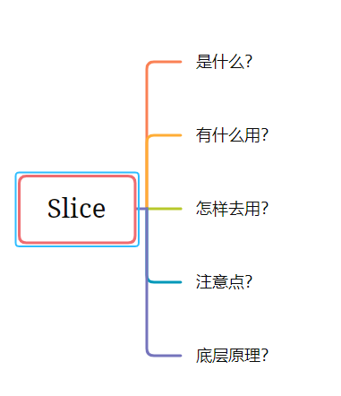

# Slice(切片)

今天给大家介绍的是 Golang 语言中的 Slice，也就是切片。自己学习 Golang 很久了，但有时候，对一些问题点很模糊，不是特别的清楚和熟悉，没有形成系统化，因此根据我自己学习的经验，把这部分的知识分享出来。

一般学习一门知识大脑中要有框架思维，有从整体到局部的脉络。我一般在脑海里会想一下几个问题：

1. **是什么**？

   这个知识点讲解的是什么。

2. **有什么用？**

   花费了时间学习这个知识点有什么用？能解决哪些问题？

3. 怎样去用？

   明白了前两个问题后，一个新的知识点最简单、最直观的是知道该怎么去使用它，快速上手。

4. **注意点？**

   学习这个知识点有哪些地方需要注意的，哪些地方会犯错、容易踩坑的，这些在学习完后，仔细想想，多留心。

5. **底层原理？**

   这个知识点的底层原理是什么？这个是比较高的层次了，想要把知识点掌握牢固，不想只做一个调参侠，了解和学习一定的底层原理知识是有必要的。

方法已经介绍完了，下面开始进入正题：**Go 中 Slice 的用法。**



## Slice 是什么？

为了一个主观的印象，下文中的 Slice就不翻译为切片了，个人认为直接说 Slice 直观，英文就是 Slice，按照外国人的思维来。

Slice 是一种数据结构，这种数据结构便于使用和管理数据集合。Slice 是围绕动态数组的概念构建的，可以根据需要自动增长（grow）和收缩（shrink）。Slice 的动态增长是通过内置函数 `append` 来实现的。这个函数可以快速且高效地增长 Slice。还可以通过对 slice 再次 slice 来缩小一个切片的大小。因为 slice 的底层内存也是在连续块中分配的，所以 slice 还能获得索引、迭代以及为垃圾回收优化的好处。

一个 `slice` 类型一般写作 `[]T`， 其中 `T` 代表 `slice` 中元素的类型。slice 的语法和数组很像， 只是没有固定长度而已。  切片是数组的一个引用，因此切片是引用类型。但自身是结构体，按照**值拷贝**传递。


Slice 的声明

```go
// 格式
var 变量名 [] 类型

// 比如:
var str []string  // 声明一个string类型的切片
var arr []int     // 声明一个int类型的切片
```


### 怎么去用 Slice？

Go 语言中有多种方法可以创建和初始化 slice，是否提前知道 slice 的容量通常决定了如何去创建 slice。

创建一个Slice

使用内置的 `make` 函数去创建 slice。当使用 `make` 函数时，需要指定 slice 的长度。

```go
// Create a slice of strings. Use build-in function make()
// Contains a length and capacity of 5 elements.
slice := make([]string, 5)
```

若只指定 length，那么 slice 的 length 和 capacity 是相等的。也可以分别指定 capacity 和 length。

```go
// Create a slice of integers.
// Contains a length of 3 and has a capacity of 5 elements.
slice := make([]int, 3, 5)
```

上面的实例，在创建 slice 时分别指定了长度和容量，而 slice 底层数组的长度是指定的 capacity

```go


// Create a slice of integers.
// Make the length larger than the capacity.
slice := make([]int, 5, 3)
Compiler Error:
len larger than cap in make([]int)

// Create a slice of strings.
// Contains a length and capacity of 5 elements.
slice := []string{"Red", "Blue", "Green", "Yellow", "Pink"}

// Create a slice of integers.
// Contains a length and capacity of 3 elements.
slice := []int{10, 20, 30}

// Create a nil slice of integers.
var slice []int
```


## Slice 有什么用？


## 注意点

- slice 之间不能比较， 因此我们不能使用等号`==` 操作符来判断两个 slice 是否含有全部相等元素。 不过标准库提供了高度优化的 `bytes.Equal` 函数来判断两个字节型 slice 是否相等 ，但是对于其他类型的 slice， 我们必须自己展开每个元素进行比较
- 判断一个 slice 值是否为空，使用 `len(0) == 0` 来判断，不应该使用 `s = nil` 去判断。


## 底层原理

一个 slice 是一个轻量级的数据结构，提供了访问数组子序列（或者全部）元素的功能，而且 `slice` 的底层确实引用一个数组对象。一个 slice 由三个部分构成：**指针（addr pointer）、长度（length）和容量（capacity）**。

- pointer：指针指向第一个 slice 元素对应的底层数组元素的地址，要注意的是 slice 的第一个元素并不一定就是数组的第一个元素。长度对应 slice 中元素的数目。
- length：长度不能超过容量。切片遍历方式和数组一样，可以用 `len()` 求长度。表示可用元素数量，读写操作不能超过该限制。
- capacity：一般是从 slice 的开始位置到底层数据的结尾位置。内置的 `len()` 和 `cap()` 函数分别返回 slice 的长度和容量。
  - `cap()` 可以求出 `slice` 最大扩张容量，不能超出数组限制。`0 <= len(slice) <= len(array)`，其中 array 是 slice 引用的数组。
  - 如果 `slice == nil`，那么 len、cap 结果都等于 0。