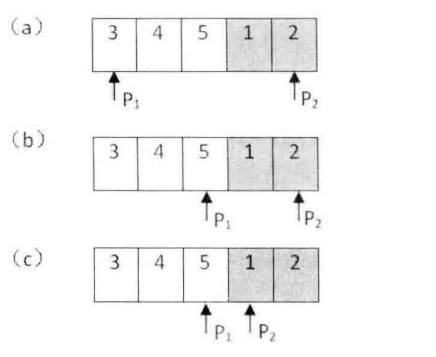
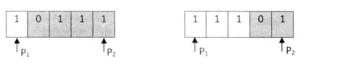

<!--
 * @Author: JohnJeep
 * @Date: 2021-01-14 23:31:33
 * @LastEditTime: 2021-01-14 23:38:41
 * @LastEditors: Please set LastEditors
 * @Description: In User Settings Edit
 * 
    -->
# 第11题：旋转数组的最小数字

>   题目描述：把一个数组最开始的若干个元素搬到数组的末尾，我们称之为数组的旋转。输入一个非递减排序的数组的一个旋转，输出旋转数组的最小元素。NOTE：给出的所有元素都大于0，若数组大小为0，请返回0。
>
>   示例1：输入 `[3,4,5,1,2]`，返回值为 `1`

## 思路

### 最直观的解法

-   从头到尾遍历一遍数组，就能找出最小的元素，这种思路的时间复杂度是 $\Omicron(n)$，这种思路，显然没有利用输入的旋转数组的特性，肯定达不到面试官的要求。

### 利用二分法查找的思想实现。

-   定义三个指针，一个指针指向数组的第一个元素 $p_1$，一个指针指向数组的最后一个元素 $p_2$，一个指针指向数组的中间元素 $p_m$。

-   以输入的 `[3,4,5,1,2]` 为例子，先把指针 $p1$ 指向第 0 个元素，把指针 $p2$ 指向第 4 个元素，如下图a所示。位于指针中间的数字是 5，它大于指针 $p1$ 指向的数字，因此中间数字 5，一定位于第一个递增的子数组，并且最小的数字一定位于它的后面。因此可移动指针 $p1$ ，让它指向数组的中间，如图b所示。

-   此时位于这两个中间的数字为1，它小于指针 $p2$ 指向的数字，因此这个中间数字 1 一定位于第二个递增数组，并且最小的数字一定位于它的前面或者它自己就是最小的数字。因此我们可以移动指针 $p2$ ，让它指向两个指针中间的元素，如图c所示。

-   此时两个指针的距离是 1 ，表明指针 $p1$ 已经指向第一个递增子数组的末尾，而指针 $p2$ 指向第二个递增子数组的开头。第二个子数组的第一个数字就是最小的数字，所以指针 $p2$ 指向的数字就是我们要查找的结果。

    

-   **考虑特殊情况**

    -   当$p_1$, $p_2$, $p_m$ 这三个指针指向的数据都相同时，那么该如何处理了？出现的情况如下图所示

        

    -   从上面的图片中看出，指针 p1 和指针 p2指向的数字都是 1，并且这两个指针中间的数字也是 1，这 3 个数字相同。在第一种情况中，中间数字位于后面的子数组；第二种情况下，中间数字位于前面的子数组。当这三个指针指向的数字都相同时，我们无法判断中间的数字是位于前面的子数组还是位于后面的子数组，也就无法移动两个指针来缩小查找的范围，得到想要的结果。因此我们只能采用顺序查找的方法去实现。

## 代码实现

```c++
class Solution {
public:
    int minNumberInRotateArray(vector<int> rotateArray) {
        if (rotateArray.size() == 0) {
            return 0;
        }
        int low = 0;
        int high = rotateArray.size() - 1;
        while (low < high) {
            // 处理特殊的情况，两边不是递增的序列
            if (rotateArray[low] < rotateArray[high]) {
                return rotateArray[low];
            }
            
            int mid = (low + high) / 2;
            if (rotateArray[mid] > rotateArray[low]) {  
                low = mid + 1;   // 左边是递增的序列，取右边的第一个值
            }
            else if (rotateArray[mid] < rotateArray[high]) { 
                high = mid;      // 右边有序列，取右边最小值
            }
            else {               // 前面两个相等的时候，low加一继续
                low++;
            }
        }
        return rotateArray[low];
    }
};
```

