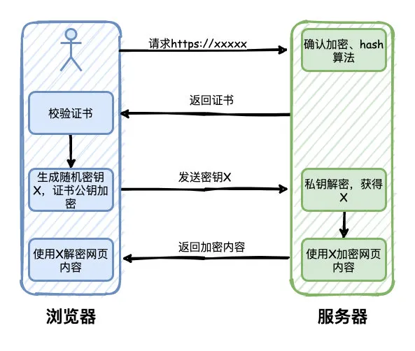

<!--
 * @Author: JohnJeep
 * @Date: 2025-04-15 09:19:50
 * @LastEditors: JohnJeep
 * @LastEditTime: 2025-11-17 09:19:56
 * @Description: HTTP 面试题
 * Copyright (c) 2025 by John Jeep, All Rights Reserved. 
-->

- [1. 说说http协议有哪些常见状态码，403代表什么意思？](#1-说说http协议有哪些常见状态码403代表什么意思)
- [2. 解释下HTTPS的工作原理吗](#2-解释下https的工作原理吗)
- [3. Http 建立过程](#3-http-建立过程)
- [4. 什么是https？是如何保证安全的？](#4-什么是https是如何保证安全的)
- [5. https的加密方式？](#5-https的加密方式)
- [6. https加密为什么要服务器发送一次密钥，客户端再向服务器发送？](#6-https加密为什么要服务器发送一次密钥客户端再向服务器发送)
- [7. https相比http有哪些区别?](#7-https相比http有哪些区别)
- [8. HTTP/1.1、HTTP/2、HTTP/3的核心差异](#8-http11http2http3的核心差异)
- [9. 如何使用https 和调试](#9-如何使用https-和调试)

### 1. 说说http协议有哪些常见状态码，403代表什么意思？

```
2XX 成功
· 200 OK，表示从客户端发来的请求在服务器端被正确处理
· 204 No content，表示请求成功，但响应报文不含实体的主体部分
· 206 Partial Content，进行范围请求
3XX 重定向
· 301 moved permanently，永久性重定向，表示资源已被分配了新的 URL
· 302 found，临时性重定向，表示资源临时被分配了新的 URL
· 303 see other，表示资源存在着另一个 URL，应使用 GET 方法丁香获取资源
· 304 not modified，表示服务器允许访问资源，但因发生请求未满足条件的情况
· 307 temporary redirect，临时重定向，和302含义相同
4XX 客户端错误
· 400 bad request，请求报文存在语法错误
· 401 unauthorized，表示发送的请求需要有通过 HTTP 认证的认证信息
· 403 forbidden，表示对请求资源的访问被服务器拒绝
· 404 not found，表示在服务器上没有找到请求的资源
5XX 服务器错误
· 500 internal sever error，表示服务器端在执行请求时发生了错误
· 503 service unavailable，表明服务器暂时处于超负载或正在停机维护，无法处理请求
```


### 2. 解释下HTTPS的工作原理吗

1. 用户通过浏览器请求https网站，服务器收到请求，选择浏览器支持的加密和hash算法，同时返回数字证书给浏览器，包含颁发机构、网址、公钥、证书有效期等信息。
2. 浏览器对证书的内容进行校验，如果有问题，则会有一个提示警告。否则，就生成一个随机数X，同时使用证书中的公钥进行加密，并且发送给服务器。
3. 服务器收到之后，使用私钥解密，得到随机数X，然后使用X对网页内容进行加密，返回给浏览器
4. 浏览器则使用X和之前约定的加密算法进行解密，得到最终的网页内容




### 3. Http 建立过程


### 4. 什么是https？是如何保证安全的？


### 5. https的加密方式？


### 6. https加密为什么要服务器发送一次密钥，客户端再向服务器发送？


### 7. https相比http有哪些区别?


### 8. HTTP/1.1、HTTP/2、HTTP/3的核心差异


### 9. 如何使用https 和调试

