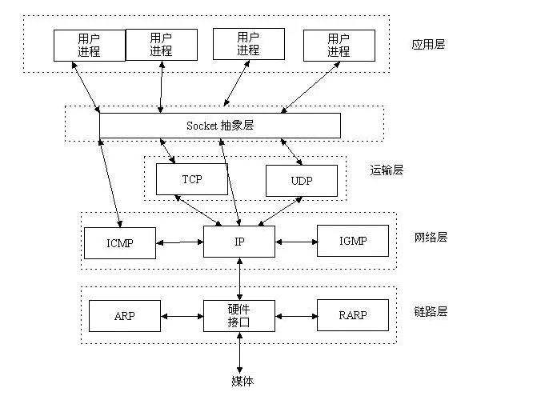
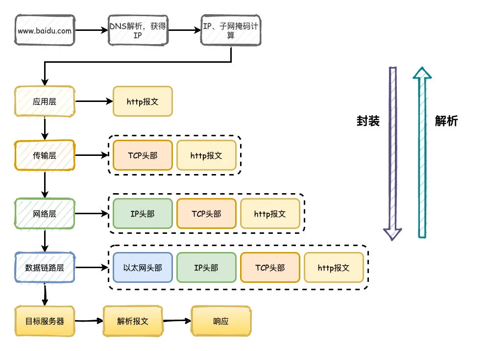

<!--
 * @Author: JohnJeep
 * @Date: 2021-04-06 14:05:57
 * UpdateTime: 2021-04-06 14:05
 * @LastEditTime: 2025-11-20 10:57:05
 * @LastEditors: JohnJeep
 * @Description: 网络基础
    -->

- [1. client-server 模型](#1-client-server-模型)
  - [1.1. 关闭client端，服务器端如何处理？](#11-关闭client端服务器端如何处理)
  - [1.2. 建立网络链接时，客户端和服务器的过程？](#12-建立网络链接时客户端和服务器的过程)
- [2. epoll 问题](#2-epoll-问题)
  - [2.1. epoll和select的区别是什么](#21-epoll和select的区别是什么)
  - [2.2. epoll，select实现的功能，聊一聊多路复用的理解；](#22-epollselect实现的功能聊一聊多路复用的理解)
  - [2.3. 解释下 epoll 边沿触发和水平触发是用来干嘛的？](#23-解释下-epoll-边沿触发和水平触发是用来干嘛的)
- [3. TIME\_WAIT 问题](#3-time_wait-问题)
  - [3.1. tcp四次挥手，time\_wait状态](#31-tcp四次挥手time_wait状态)
  - [3.2. TIME\_WAIT的两个作用？](#32-time_wait的两个作用)
  - [3.3. TIME\_WAIT和CLOSE\_WAIT的区别？](#33-time_wait和close_wait的区别)
- [4. TCP UDP 问题](#4-tcp-udp-问题)
  - [4.1. 简单说一下TCP的三次握手，并说说三次握手做了什么事情，每次通讯包发了什么](#41-简单说一下tcp的三次握手并说说三次握手做了什么事情每次通讯包发了什么)
  - [4.2. 简单说下TCP四次挥手，它当时状态是怎么样的？](#42-简单说下tcp四次挥手它当时状态是怎么样的)
  - [4.3. TCP如何保证可靠性传输？](#43-tcp如何保证可靠性传输)
- [5. 讲一下TCP和UDP有什么区别？](#5-讲一下tcp和udp有什么区别)
  - [5.1. 什么时候应该使用TCP](#51-什么时候应该使用tcp)
  - [5.2. 什么时候用UDP](#52-什么时候用udp)
  - [5.3. TCP有哪些定时器，都用来做什么？](#53-tcp有哪些定时器都用来做什么)
- [6. ARP](#6-arp)
  - [6.1. 解释下 ARP是什么？协议是怎么实现的？](#61-解释下-arp是什么协议是怎么实现的)
  - [6.2. 协议作用在那一层](#62-协议作用在那一层)
- [7. ARP是怎么找到MAC地址的？](#7-arp是怎么找到mac地址的)
- [8. Socket](#8-socket)
  - [8.1. Listen accept bind调用时，内核层面发生了什么？](#81-listen-accept-bind调用时内核层面发生了什么)
  - [8.2. socket与UDP的区别？](#82-socket与udp的区别)
- [9. 发送数据时阻塞和非阻塞的区别？](#9-发送数据时阻塞和非阻塞的区别)
- [10. recv调用成功是已经正确收到数据了吗？](#10-recv调用成功是已经正确收到数据了吗)
- [11. 介绍下拥塞控制](#11-介绍下拥塞控制)
- [12. 场景题，输入www.baidu.com后，如何得到返回界面的？](#12-场景题输入wwwbaiducom后如何得到返回界面的)

# 1. client-server 模型

## 1.1. 关闭client端，服务器端如何处理？

## 1.2. 建立网络链接时，客户端和服务器的过程？

# 2. epoll 问题

## 2.1. epoll和select的区别是什么

## 2.2. epoll，select实现的功能，聊一聊多路复用的理解；

## 2.3. 解释下 epoll 边沿触发和水平触发是用来干嘛的？

# 3. TIME_WAIT 问题

## 3.1. tcp四次挥手，time_wait状态

## 3.2. TIME_WAIT的两个作用？

## 3.3. TIME_WAIT和CLOSE_WAIT的区别？

# 4. TCP UDP 问题

## 4.1. 简单说一下TCP的三次握手，并说说三次握手做了什么事情，每次通讯包发了什么

## 4.2. 简单说下TCP四次挥手，它当时状态是怎么样的？

## 4.3. TCP如何保证可靠性传输？

超时重传、确认机制、流量控制（滑动窗口协议）、按序重排、拥塞控制。

# 5. 讲一下TCP和UDP有什么区别？

TCP的优点：
	• 可靠，稳定
TCP的可靠体现在TCP在传递数据之前，会有三次握手来建立连接，而且在数据传递时，有确认、窗口、重传、拥塞控制机制，在数据传完后，还会断开连接用来节约系统资源。

TCP的缺点：
	

• 慢，效率低，占用系统资源高，易被攻击
TCP在传递数据之前，要先建连接，这会消耗时间，而且在数据传递时，确认机制、重传机制、拥塞控制机制等都会消耗大量的时间，而且要在每台设备上维护所有的传输连接，事实上，每个连接都会占用系统的CPU、内存等硬件资源。
而且，因为TCP有确认机制、三次握手机制，这些也导致TCP容易被人利用，实现DOS、DDOS、CC等攻击。
UDP的优点：
	

• 快，比TCP稍安全
UDP没有TCP的握手、确认、窗口、重传、拥塞控制等机制，UDP是一个无状态的传输协议，所以它在传递数据时非常快。没有TCP的这些机制，UDP较TCP被攻击者利用的漏洞就要少一些。但UDP也是无法避免攻击的，比如：UDP Flood攻击……

UDP的缺点：
	

• 不可靠，不稳定
因为UDP没有TCP那些可靠的机制，在数据传递时，如果网络质量不好，就会很容易丢包。

## 5.1. 什么时候应该使用TCP

当对网络通讯质量有要求的时候，比如：整个数据要准确无误的传递给对方，这往往用于一些要求可靠的应用，比如HTTP、HTTPS、FTP等传输文件的协议，POP、SMTP等邮件传输的协议。
在日常生活中，常见使用TCP协议的应用如下：
	• 浏览器，用的HTTP
	• FlashFXP，用的FTP
	• Outlook，用的POP、SMTP
	• Putty，用的Telnet、SSH
	• QQ文件传输
		

## 5.2. 什么时候用UDP

当对网络通讯质量要求不高的时候，要求网络通讯速度能尽量的快，这时就可以使用UDP。
比如，日常生活中，常见使用UDP协议的应用如下：
QQ 语音，QQ 视频，TFTP 
总结：
	1、TCP 面向连接（如打电话要先拨号建立连接）; UDP 是无连接的，即发送数据之前不需要建立连接。
	2、TCP 提供可靠的服务。也就是说，通过 TCP 连接传送的数据，无差错，不丢失，不重复，且按序到达；UDP 尽最大努力交付，即不保证可靠交付。
	3、TCP 面向字节流，实际上是 TCP 把数据看成一连串无结构的字节流；UDP 是面向报文的。UDP 没有拥塞控制，因此网络出现拥塞不会使源主机的发送速率降低（对实时应用很有用，如IP电话，实时视频会议等）
	4、每一条 TCP 连接只能是点到点的；UDP支持一对一，一对多，多对一和多对多的交互通信。
	5、TCP 首部开销 20 字节；UDP 的首部开销小，只有 8 个字节。
	6、TCP 的逻辑通信信道是全双工的可靠信道，UDP 则是不可靠信道。

## 5.3. TCP有哪些定时器，都用来做什么？

# 6. ARP

## 6.1. 解释下 ARP是什么？协议是怎么实现的？

## 6.2. 协议作用在那一层

# 7. ARP是怎么找到MAC地址的？

# 8. Socket

## 8.1. Listen accept bind调用时，内核层面发生了什么？

Linux给socket套接字在内核里面分配了两个缓冲区，分别为read缓冲区和write缓冲区，通过文件描述符的指向来实现不同的传输。

## 8.2. socket与UDP的区别？

Socket是应用层与网络层中TCP/IP协议族通信的一个中间软件抽象层，它是一组接口。它把复杂的TCP/IP协议族隐藏在Socket接口后面，让Socket去组织数据，以符合指定的协议。Socket是对TCP/IP协议的封装，Socket本身并不是协议，而是一个调用接口（API），通过Socket，我们才能使用TCP/IP协议。

实际上，Socket跟TCP/IP协议没有必然的联系。Socket编程接口在设计的时候，就希望也能适应其他的网络协议。所以说，Socket的出现只是使得程序员更方便地使用TCP/IP协议栈而已，是对TCP/IP协议的抽象，从而形成了我们知道的一些最基本的函数接口，比如create、 listen、connect、accept、send、read和write等等。

> TCP和UDP：传输层协议；
> HTTP：应用层协议；
> SOCKET：TCP/IP网络的API。
> TCP/IP代表传输控制协议/网际协议，指的是一系列协议。

# 9. 发送数据时阻塞和非阻塞的区别？

# 10. recv调用成功是已经正确收到数据了吗？

# 11. 介绍下拥塞控制

# 12. 场景题，输入www.baidu.com后，如何得到返回界面的？

1. 首先通过DNS服务器把域名解析成IP地址，通过IP和子网掩码判断是否属于同一个子网

2. 构造应用层请求http报文，传输层添加TCP/UDP头部，网络层添加IP头部，数据链路层添加以太网协议头部

3. 数据经过路由器、交换机转发，最终达到目标服务器，目标服务器同样解析数据，最终拿到http报文，按照对应的程序的逻辑响应回去。

   

