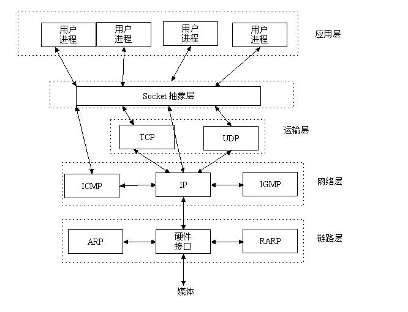
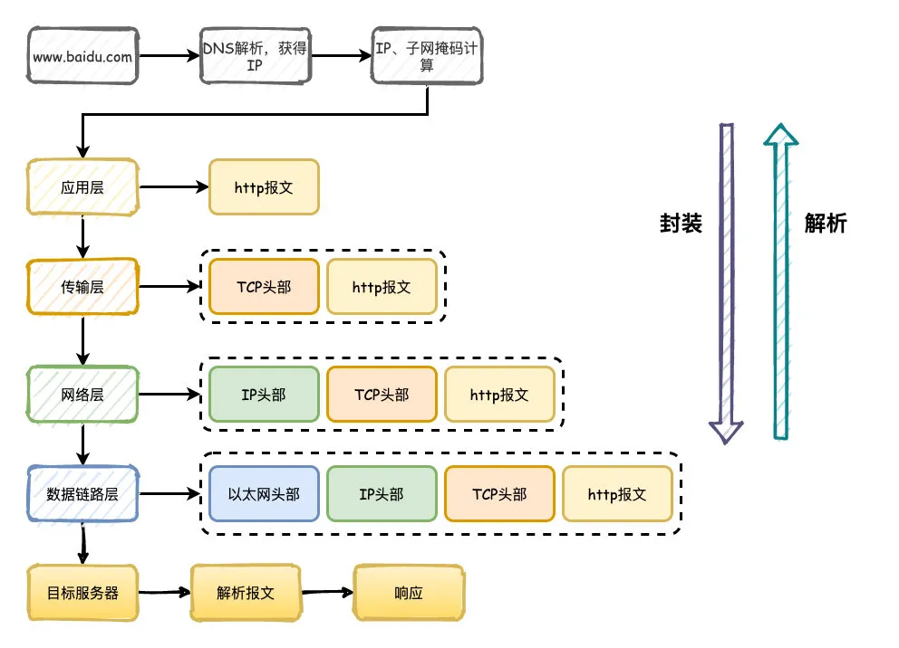

<!--
 * @Author: JohnJeep
 * @Date: 2021-04-06 14:05:57
 * @LastEditors: JohnJeep
 * @LastEditTime: 2026-05-31 20:33:04
 * @Description: 网络基础
 * Copyright (c) 2026 by John Jeep, All Rights Reserved. 
-->

- [1. client-server 模型](#1-client-server-模型)
  - [1.1. 关闭 client 端，服务器端如何处理？](#11-关闭 client 端服务器端如何处理)
  - [1.2. 建立网络链接时，客户端和服务器的过程？](#12-建立网络链接时客户端和服务器的过程)
- [2. epoll 问题](#2-epoll-问题)
  - [2.1. epoll 和 select 的区别是什么](#21-epoll 和 select 的区别是什么)
  - [2.2. epoll，select 实现的功能，聊一聊多路复用的理解；](#22-epollselect 实现的功能聊一聊多路复用的理解)
  - [2.3. 解释下 epoll 边沿触发和水平触发是用来干嘛的？](#23-解释下-epoll-边沿触发和水平触发是用来干嘛的)
- [3. TIME\_WAIT 问题](#3-time_wait-问题)
  - [3.1. tcp 四次挥手，time\_wait 状态](#31-tcp 四次挥手 time_wait 状态)
  - [3.2. TIME\_WAIT 的两个作用？](#32-time_wait 的两个作用)
  - [3.3. TIME\_WAIT 和 CLOSE\_WAIT 的区别？](#33-time_wait 和 close_wait 的区别)
- [4. TCP UDP 问题](#4-tcp-udp-问题)
  - [4.1. 简单说一下 TCP 的三次握手，并说说三次握手做了什么事情，每次通讯包发了什么](#41-简单说一下 tcp
    的三次握手并说说三次握手做了什么事情每次通讯包发了什么)
  - [4.2. 简单说下 TCP 四次挥手，它当时状态是怎么样的？](#42-简单说下 tcp 四次挥手它当时状态是怎么样的)
  - [4.3. TCP 如何保证可靠性传输？](#43-tcp 如何保证可靠性传输)
- [5. 讲一下 TCP 和 UDP 有什么区别？](#5-讲一下 tcp 和 udp 有什么区别)
  - [5.1. 什么时候应该使用 TCP](#51-什么时候应该使用 tcp)
  - [5.2. 什么时候用 UDP](#52-什么时候用 udp)
  - [5.3. TCP 有哪些定时器，都用来做什么？](#53-tcp 有哪些定时器都用来做什么)
- [6. ARP](#6-arp)
  - [6.1. 解释下 ARP 是什么？协议是怎么实现的？](#61-解释下-arp 是什么协议是怎么实现的)
  - [6.2. 协议作用在那一层](#62-协议作用在那一层)
- [7. ARP 是怎么找到 MAC 地址的？](#7-arp 是怎么找到 mac 地址的)
- [8. Socket](#8-socket)
  - [8.1. Listen accept bind 调用时，内核层面发生了什么？](#81-listen-accept-bind 调用时内核层面发生了什么)
  - [8.2. socket 与 UDP 的区别？](#82-socket 与 udp 的区别)
- [9. 发送数据时阻塞和非阻塞的区别？](#9-发送数据时阻塞和非阻塞的区别)
- [10. recv 调用成功是已经正确收到数据了吗？](#10-recv 调用成功是已经正确收到数据了吗)
- [11. 介绍下拥塞控制](#11-介绍下拥塞控制)
- [12. 场景题，输入 www.baidu.com 后，如何得到返回界面的？](#12-场景题输入 wwwbaiducom 后如何得到返回界面的)

# 1. client-server 模型

## 1.1. 关闭 client 端，服务器端如何处理？

## 1.2. 建立网络链接时，客户端和服务器的过程？

# 2. epoll 问题

## 2.1. epoll 和 select 的区别是什么

## 2.2. epoll，select 实现的功能，聊一聊多路复用的理解；

## 2.3. 解释下 epoll 边沿触发和水平触发是用来干嘛的？

# 3. TIME_WAIT 问题

## 3.1. tcp 四次挥手，time_wait 状态

## 3.2. TIME_WAIT 的两个作用？

## 3.3. TIME_WAIT 和 CLOSE_WAIT 的区别？

# 4. TCP UDP 问题

## 4.1. 简单说一下 TCP 的三次握手，并说说三次握手做了什么事情，每次通讯包发了什么

## 4.2. 简单说下 TCP 四次挥手，它当时状态是怎么样的？

## 4.3. TCP 如何保证可靠性传输？

超时重传、确认机制、流量控制（滑动窗口协议）、按序重排、拥塞控制。

# 5. 讲一下 TCP 和 UDP 有什么区别？

TCP 的优点：
	• 可靠，稳定
TCP 的可靠体现在 TCP 在传递数据之前，会有三次握手来建立连接，而且在数据传递时，有确认、窗口、重传、拥塞控制机制，在数
据传完后，还会断开连接用来节约系统资源。

TCP 的缺点：
	

• 慢，效率低，占用系统资源高，易被攻击
TCP 在传递数据之前，要先建连接，这会消耗时间，而且在数据传递时，确认机制、重传机制、拥塞控制机制等都会消耗大量的时间，
而且要在每台设备上维护所有的传输连接，事实上，每个连接都会占用系统的 CPU、内存等硬件资源。
而且，因为 TCP 有确认机制、三次握手机制，这些也导致 TCP 容易被人利用，实现 DOS、DDOS、CC 等攻击。
UDP 的优点：
	

• 快，比 TCP 稍安全
UDP 没有 TCP 的握手、确认、窗口、重传、拥塞控制等机制，UDP 是一个无状态的传输协议，所以它在传递数据时非常快。没有 TCP
的这些机制，UDP 较 TCP 被攻击者利用的漏洞就要少一些。但 UDP
也是无法避免攻击的，比如：UDP Flood 攻击……

UDP 的缺点：
	

• 不可靠，不稳定
因为 UDP 没有 TCP 那些可靠的机制，在数据传递时，如果网络质量不好，就会很容易丢包。

## 5.1. 什么时候应该使用 TCP

当对网络通讯质量有要求的时候，比如：整个数据要准确无误的传递给对方，这往往用于一些要求可靠的应用，比如
HTTP、HTTPS、FTP 等传输文件的协议，POP、SMTP 等邮件传输的协议。
在日常生活中，常见使用 TCP 协议的应用如下：
	• 浏览器，用的 HTTP
	• FlashFXP，用的 FTP
	• Outlook，用的 POP、SMTP
	• Putty，用的 Telnet、SSH
	• QQ 文件传输
		

## 5.2. 什么时候用 UDP

当对网络通讯质量要求不高的时候，要求网络通讯速度能尽量的快，这时就可以使用 UDP。
比如，日常生活中，常见使用 UDP 协议的应用如下：
QQ 语音，QQ 视频，TFTP 
总结：
	1、TCP 面向连接（如打电话要先拨号建立连接）; UDP 是无连接的，即发送数据之前不需要建立连接。
	2、TCP 提供可靠的服务。也就是说，通过 TCP 连接传送的数据，无差错，不丢失，不重复，且按序到达；UDP
	尽最大努力交付，即不保证可靠交付。
	3、TCP 面向字节流，实际上是 TCP 把数据看成一连串无结构的字节流；UDP 是面向报文的。UDP
	没有拥塞控制，因此网络出现拥塞不会使源主机的发送速率降低（对实时应用很有用，如 IP 电话，实时视频会议等）
	4、每一条 TCP 连接只能是点到点的；UDP 支持一对一，一对多，多对一和多对多的交互通信。
	5、TCP 首部开销 20 字节；UDP 的首部开销小，只有 8 个字节。
	6、TCP 的逻辑通信信道是全双工的可靠信道，UDP 则是不可靠信道。

## 5.3. TCP 有哪些定时器，都用来做什么？

# 6. ARP

## 6.1. 解释下 ARP 是什么？协议是怎么实现的？

## 6.2. 协议作用在那一层

# 7. ARP 是怎么找到 MAC 地址的？

# 8. Socket

## 8.1. Listen accept bind 调用时，内核层面发生了什么？

Linux 给 socket 套接字在内核里面分配了两个缓冲区，分别为 read 缓冲区和 write
缓冲区，通过文件描述符的指向来实现不同的传输。

## 8.2. socket 与 UDP 的区别？

Socket 是应用层与网络层中 TCP/IP 协议族通信的一个中间软件抽象层，它是一组接口。它把复杂的 TCP/IP 协议族隐藏在 Socket
接口后面，让 Socket 去组织数据，以符合指定的协议。Socket 是对
TCP/IP 协议的封装，Socket 本身并不是协议，而是一个调用接口（API），通过 Socket，我们才能使用 TCP/IP 协议。

实际上，Socket 跟 TCP/IP 协议没有必然的联系。Socket 编程接口在设计的时候，就希望也能适应其他的网络协议。所以说，Socket
的出现只是使得程序员更方便地使用 TCP/IP 协议栈而已，是对 TCP/IP
协议的抽象，从而形成了我们知道的一些最基本的函数接口，比如 create、 listen、connect、accept、send、read 和 write
等等。

> TCP 和 UDP：传输层协议；
> HTTP：应用层协议；
> SOCKET：TCP/IP 网络的 API。
> TCP/IP 代表传输控制协议/网际协议，指的是一系列协议。

# 9. 发送数据时阻塞和非阻塞的区别？

# 10. recv 调用成功是已经正确收到数据了吗？

# 11. 介绍下拥塞控制

# 12. 场景题，输入 www.baidu.com 后，如何得到返回界面的？

1. 首先通过 DNS 服务器把域名解析成 IP 地址，通过 IP 和子网掩码判断是否属于同一个子网

2. 构造应用层请求 http 报文，传输层添加 TCP/UDP 头部，网络层添加 IP 头部，数据链路层添加以太网协议头部

3. 数据经过路由器、交换机转发，最终达到目标服务器，目标服务器同样解析数据，最终拿到 http
   报文，按照对应的程序的逻辑响应回去。

   

