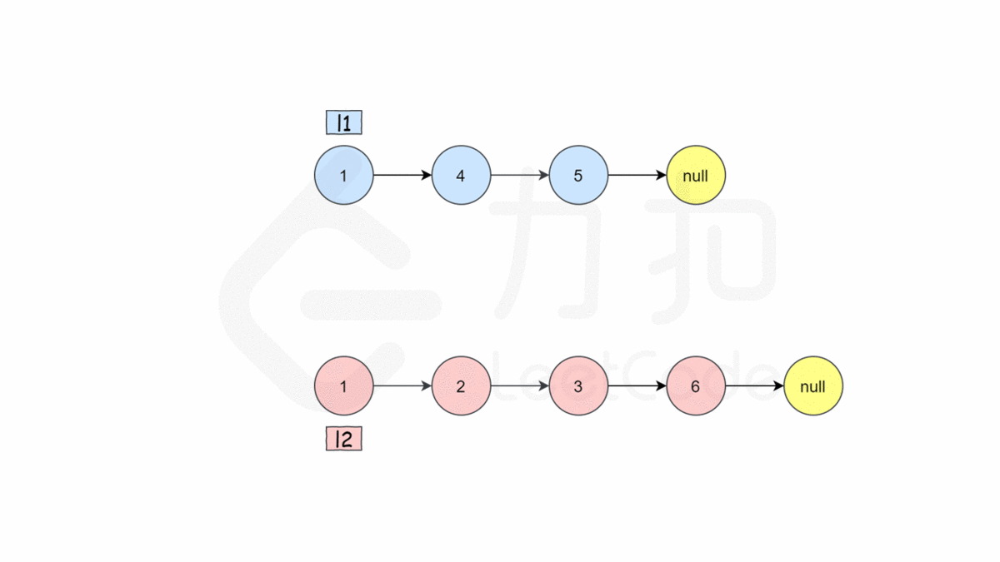

<!--
 * @Author: JohnJeep
 * @Date: 2021-04-20 21:37:13
 * @LastEditTime: 2021-04-20 22:36:07
 * @LastEditors: Please set LastEditors
 * @Description: In User Settings Edit
-->
# 21-合并两个有序链表

# 题目描述
将两个升序链表合并为一个新的 升序 链表并返回。新链表是通过拼接给定的两个链表的所有节点组成的。 
 

示例 1：

```
输入：l1 = [1,2,4], l2 = [1,3,4]
输出：[1,1,2,3,4,4]
```

示例 2：
```
输入：l1 = [], l2 = []
输出：[]
```

示例 3：
```
输入：l1 = [], l2 = [0]
输出：[0]
```

# 思路

**法一：递归法**
如果 l1 或者 l2 一开始就是空链表 ，那么没有任何操作需要合并，所以我们只需要返回非空链表。否则就要判断 l1 和 l2 头结点哪个最小，然后递归的决定下一个将要添加到 mergeList中的结点。如果两个链表有一个为空，递归结束。


- 代码实现
```cpp
class Solution {
public:
    ListNode* mergeTwoLists(ListNode* l1, ListNode* l2) {
        if (l1 == nullptr) {
            return l2;
        }
        if (l2 == nullptr) {
            return l1;
        }
        if (l1->val  < l2->val) {
            l1->next = mergeTwoLists(l1->next, l2);
            return l1;
        }
        else {
            l2->next = mergeTwoLists(l1, l2->next);
            return l2;
        }
    }
};
```

- 复杂度分析
时间复杂度：O(n + m)，其中 n 和 m 分别为两个链表的长度。因为每次调用递归都会去掉 l1 或者 l2 的头节点（直到至少有一个链表为空），函数 mergeTwoList 至多只会递归调用每个节点一次。因此，时间复杂度取决于合并后的链表长度，即 O(n+m)。

空间复杂度：O(n + m)，其中 n 和 m 分别为两个链表的长度。递归调用 mergeTwoLists 函数时需要消耗栈空间，栈空间的大小取决于递归调用的深度。结束递归调用时 mergeTwoLists 函数最多调用 n+m 次，因此空间复杂度为 O(n+m)。


**法二：迭代法**
我们可以用迭代的方法来实现上述算法。当 l1 和 l2 都不是空链表时，判断 l1 和 l2 哪一个链表的头节点的值更小，将较小值的节点添加到结果里，当一个节点被添加到结果里之后，将对应链表中的节点向后移一位。

首先，我们设定一个哨兵节点 prehead ，这可以在最后让我们比较容易地返回合并后的链表。我们维护一个 prev 指针，我们需要做的是调整它的 next 指针。然后，我们重复以下过程，直到 l1 或者 l2 指向了 null ：如果 l1 当前节点的值小于等于 l2 ，我们就把 l1 当前的节点接在 prev 节点的后面同时将 l1 指针往后移一位。否则，我们对 l2 做同样的操作。不管我们将哪一个元素接在了后面，我们都需要把 prev 向后移一位。

在循环终止的时候， l1 和 l2 至多有一个是非空的。由于输入的两个链表都是有序的，所以不管哪个链表是非空的，它包含的所有元素都比前面已经合并链表中的所有元素都要大。这意味着我们只需要简单地将非空链表接在合并链表的后面，并返回合并链表即可。

下图展示了 1->4->5 和 1->2->3->6 两个链表迭代合并的过程：



- **代码实现**
```cpp
class Solution {
public:
    ListNode* mergeTwoLists(ListNode* l1, ListNode* l2) {
        ListNode* preHead = new ListNode(-1);
        ListNode* prev = preHead;
        while (l1 != nullptr && l2 != nullptr) {
            if (l1->val < l2->val) {
                prev->next = l1;  // 把 l1 当前的节点接在 prev 节点的后面
                l1 = l1->next;    //将 l1 指针往后移一位
            } else {
                prev->next = l2;
                l2 = l2->next;
            }
            prev = prev->next;  // 移动prev指针
        }

        // 合并后 l1 和 l2 最多只有一个还未被合并完，我们直接将链表末尾指向未合并完的链表即可
        prev->next = l1 == nullptr ? l2 : l1;

        return preHead->next;  // 返回合并后的链表
    }
};
```

- 复杂度分析
时间复杂度：O(n + m)，其中 n 和 m 分别为两个链表的长度。因为每次循环迭代中，l1 和 l2 只有一个元素会被放进合并链表中， 因此 while 循环的次数不会超过两个链表的长度之和。所有其他操作的时间复杂度都是常数级别的，因此总的时间复杂度为 O(n+m)。

空间复杂度：O(1)。我们只需要常数的空间存放若干变量。

# 参考
[合并两个有序链表](https://leetcode-cn.com/problems/merge-two-sorted-lists/solution/he-bing-liang-ge-you-xu-lian-biao-by-leetcode-solu)
