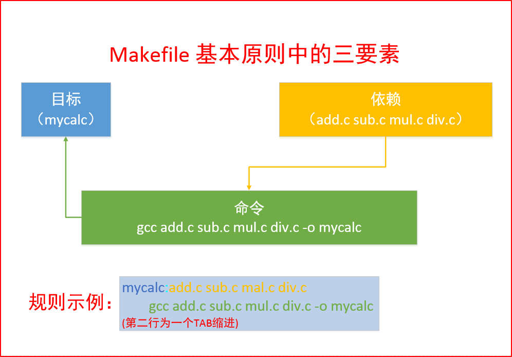
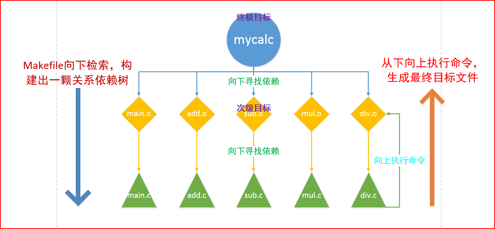
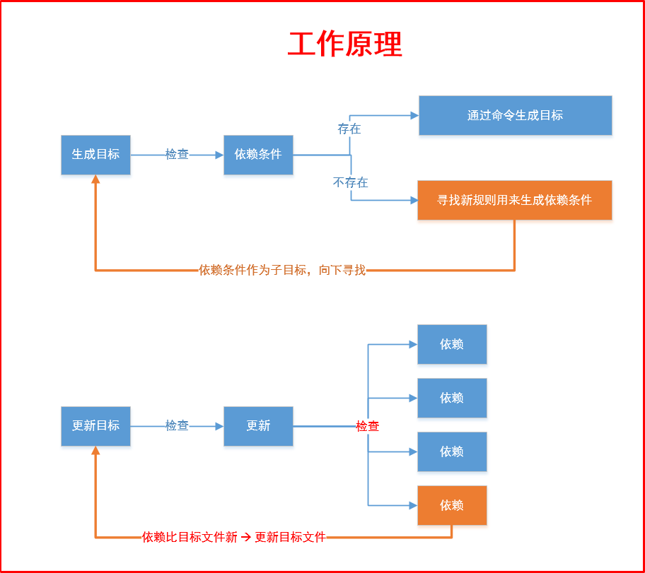

<!--

 * @Author: JohnJeep
 * @Date: 2021-04-07 23:25:09
 * @LastEditTime: 2026-01-01 15:22:01
 * @LastEditors: JohnJeep
 * @Description: Makefile usage
-->

- [1. 什么是 Makefile](#1-什么是-makefile)
- [2. 什么是 Make 和 configure](#2-什么是-make-和-configure)
- [3. 检测程序会检测哪些内容？](#3-检测程序会检测哪些内容)
- [4. 源码下载](#4-源码下载)
- [5. 操作步骤](#5-操作步骤)
- [6. 三个基本要素](#6-三个基本要素)

## 1. 什么是 Makefile

它是记录编译记录的文件。有两种命名的方式：全小写 makefile 或首字母大写 Makefile。

## 2. 什么是 Make 和 configure

make 是一个程序，会去找 Makefile ，那 Makefile 怎么写？ 

通常软件开发商都会写一个检测程序来侦测使用户的操作环境， 以及操作环境是否有软件开发商所需要的其他功能，该检测程序检测完毕后， 就会主动的建立这个 Makefile 的规则文件， 通常这个检测程序的文件名为 configure 或者是 config 。


## 3. 检测程序会检测哪些内容？

- 是否有合适的编译可以编译本软件的代码
- 是否存在有本软件所需要的函数库，或其它的所需的依赖软件
- 操作系统是否适合本软件，包括 Linux 的内核
- 内核的头文件（header include）是否存在，驱动程序必须要的检测


## 4. 源码下载

同一个软件在不同的平台上执行，需要重新编译，这就是为什么在下载类 Linux 的软件程序时，会提供源码下载。


## 5. 操作步骤

- 直接使用 `make` 指令，会生成 Makefile 文件中定义的最终目标文件。
- 使用 `make 自定义变量名`，会执行自定义变量名下面定义的规则指令。


## 6. 三个基本要素

- 目标
- 依赖
- 命令

<div align="center"> 
  
</div>
<div align="center">
  
</div>
<div align="center"> 
  
</div>


- 一个规则
  **Makefile 对缩进极其敏感**：目标下的命令必须以 Tab 开头，不能使用 空格 进行缩进，否则 Makefile 是执行不过。

  可用 `cat -A Makefile` 检查文件
  - 制表符会显示为 `^I`
  - 行尾会显示 `$`

- 两个函数。每个函数都有返回值
  - `src= $(wildcard ./*c)` 查找指定目录 `./` 下所有 `.c` 的文件，并将函数的返回值赋值给 src 变量
  - 匹配替换函数  `obj = $(patsubst ./%.c, ./%.o, $(src))` 将指定目录 `./` 下所有的 `.c` 替换为 `.o`文件
- 三个变量
  - 自定义变量
  - 自动变量
    - `$<` 规则中的第一个依赖
    - `$@` 规则中的目标
    - `$^` 规则中的所有依赖
  - 系统维护的变量(一般为大写字符) 
    - `CPPFLAGS` 预处理所需要的的选项。如：`-I`
    - `CFLAGS  ` 编译时使用的参数。`-Wall, -g, -c`
    - `LDFLAGS ` 链接库使用的选项。`-L -l(小写)`
    - `CC` 等于gcc
- 伪目标 `.PHONY` 。它只是一个标签，并不生成实际的文件。
  ```makefile
  # 显示的告诉 make clean 是一个伪目标
  .PHONY: clean
  
  clean
  	rm *.o -rf
  ```
  `-` 表示当前指令执行不成功则忽略当前指令。
- 模式规则
  ```makefile
  // 给相同的命令指定一个规则
  %.o: %c
      gcc -c $< -o $@
  ```

## Makefile template

Makefile 常用内容。

```makefile
# Thanks to Job Vranish (https://spin.atomicobject.com/2016/08/26/makefile-c-projects/)
TARGET_EXEC := final_program

BUILD_DIR := ./build
SRC_DIRS := ./src

# Find all the C and C++ files we want to compile
# Note the single quotes around the * expressions. The shell will incorrectly expand these otherwise, but we want to send the * directly to the find command.
SRCS := $(shell find $(SRC_DIRS) -name '*.cpp' -or -name '*.c' -or -name '*.s')

# Prepends BUILD_DIR and appends .o to every src file
# As an example, ./your_dir/hello.cpp turns into ./build/./your_dir/hello.cpp.o
OBJS := $(SRCS:%=$(BUILD_DIR)/%.o)

# String substitution (suffix version without %).
# As an example, ./build/hello.cpp.o turns into ./build/hello.cpp.d
DEPS := $(OBJS:.o=.d)

# Every folder in ./src will need to be passed to GCC so that it can find header files
INC_DIRS := $(shell find $(SRC_DIRS) -type d)
# Add a prefix to INC_DIRS. So moduleA would become -ImoduleA. GCC understands this -I flag
INC_FLAGS := $(addprefix -I,$(INC_DIRS))

# The -MMD and -MP flags together generate Makefiles for us!
# These files will have .d instead of .o as the output.
CPPFLAGS := $(INC_FLAGS) -MMD -MP

# The final build step.
$(BUILD_DIR)/$(TARGET_EXEC): $(OBJS)
	$(CXX) $(OBJS) -o $@ $(LDFLAGS)

# Build step for C source
$(BUILD_DIR)/%.c.o: %.c
	mkdir -p $(dir $@)
	$(CC) $(CPPFLAGS) $(CFLAGS) -c $< -o $@

# Build step for C++ source
$(BUILD_DIR)/%.cpp.o: %.cpp
	mkdir -p $(dir $@)
	$(CXX) $(CPPFLAGS) $(CXXFLAGS) -c $< -o $@


.PHONY: clean
clean:
	rm -r $(BUILD_DIR)

# Include the .d makefiles. The - at the front suppresses the errors of missing
# Makefiles. Initially, all the .d files will be missing, and we don't want those
# errors to show up.
-include $(DEPS)
```


## References

- Learn Makefiles With the tastiest examples: https://makefiletutorial.com/
- What is a Makefile and how does it work?: https://opensource.com/article/18/8/what-how-makefile
- GNU Make: https://www.gnu.org/software/make/manual/make.html
