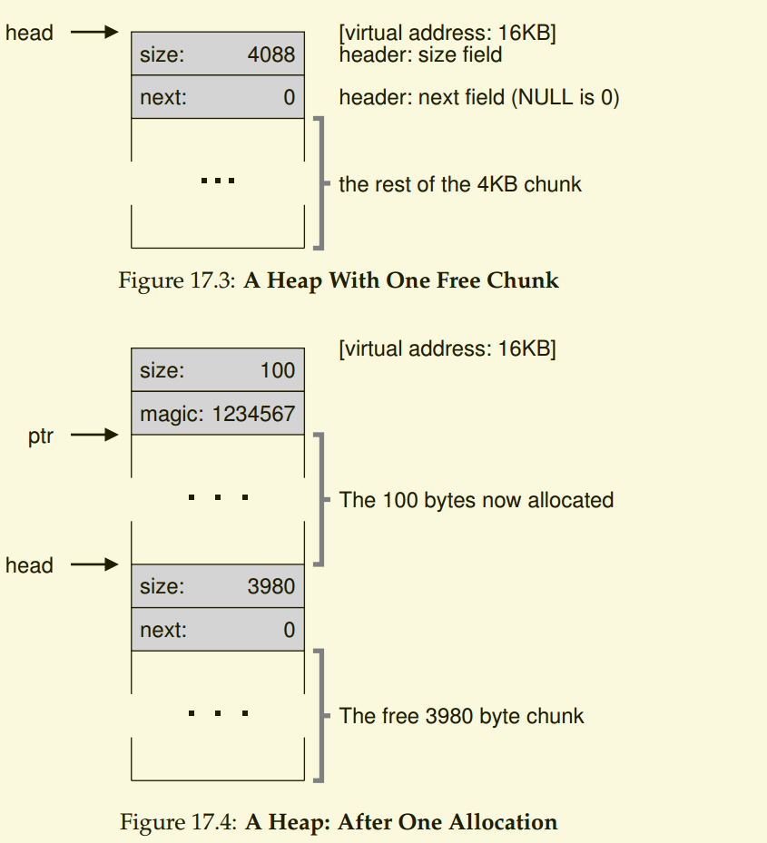
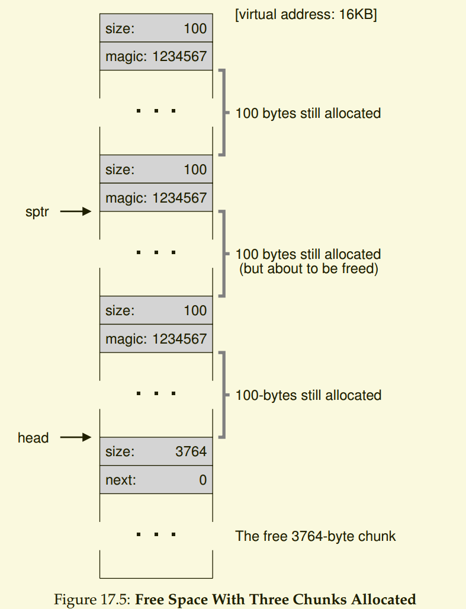

<h1>Table of Contents<span class="tocSkip"></span></h1>
<div class="toc"><ul class="toc-item"><li><span><a href="#CPU-Virtualization" data-toc-modified-id="CPU-Virtualization-1"><span class="toc-item-num">1&nbsp;&nbsp;</span>CPU Virtualization</a></span></li><li><span><a href="#Memory-Virtualization" data-toc-modified-id="Memory-Virtualization-2"><span class="toc-item-num">2&nbsp;&nbsp;</span>Memory Virtualization</a></span><ul class="toc-item"><li><span><a href="#抽象的地址空间-(Abstraction-Address-Space)" data-toc-modified-id="抽象的地址空间-(Abstraction-Address-Space)-2.1"><span class="toc-item-num">2.1&nbsp;&nbsp;</span>抽象的地址空间 (Abstraction Address Space)</a></span><ul class="toc-item"><li><span><a href="#问题？" data-toc-modified-id="问题？-2.1.1"><span class="toc-item-num">2.1.1&nbsp;&nbsp;</span>问题？</a></span></li><li><span><a href="#基础" data-toc-modified-id="基础-2.1.2"><span class="toc-item-num">2.1.2&nbsp;&nbsp;</span>基础</a></span></li><li><span><a href="#命令" data-toc-modified-id="命令-2.1.3"><span class="toc-item-num">2.1.3&nbsp;&nbsp;</span>命令</a></span></li></ul></li><li><span><a href="#内存操作API" data-toc-modified-id="内存操作API-2.2"><span class="toc-item-num">2.2&nbsp;&nbsp;</span>内存操作API</a></span></li><li><span><a href="#地址转换（Address-Translation）" data-toc-modified-id="地址转换（Address-Translation）-2.3"><span class="toc-item-num">2.3&nbsp;&nbsp;</span>地址转换（Address Translation）</a></span><ul class="toc-item"><li><span><a href="#问题" data-toc-modified-id="问题-2.3.1"><span class="toc-item-num">2.3.1&nbsp;&nbsp;</span>问题</a></span></li><li><span><a href="#基础" data-toc-modified-id="基础-2.3.2"><span class="toc-item-num">2.3.2&nbsp;&nbsp;</span>基础</a></span></li></ul></li><li><span><a href="#分段(segmentation)" data-toc-modified-id="分段(segmentation)-2.4"><span class="toc-item-num">2.4&nbsp;&nbsp;</span>分段(segmentation)</a></span><ul class="toc-item"><li><span><a href="#思考？" data-toc-modified-id="思考？-2.4.1"><span class="toc-item-num">2.4.1&nbsp;&nbsp;</span>思考？</a></span></li></ul></li><li><span><a href="#空间管理(free-space-management)" data-toc-modified-id="空间管理(free-space-management)-2.5"><span class="toc-item-num">2.5&nbsp;&nbsp;</span>空间管理(free space management)</a></span><ul class="toc-item"><li><span><a href="#问题？" data-toc-modified-id="问题？-2.5.1"><span class="toc-item-num">2.5.1&nbsp;&nbsp;</span>问题？</a></span></li><li><span><a href="#底层机制" data-toc-modified-id="底层机制-2.5.2"><span class="toc-item-num">2.5.2&nbsp;&nbsp;</span>底层机制</a></span></li><li><span><a href="#管理空间的基本策略(Basic-Strategies)" data-toc-modified-id="管理空间的基本策略(Basic-Strategies)-2.5.3"><span class="toc-item-num">2.5.3&nbsp;&nbsp;</span>管理空间的基本策略(Basic Strategies)</a></span></li></ul></li></ul></li><li><span><a href="#分页介绍" data-toc-modified-id="分页介绍-3"><span class="toc-item-num">3&nbsp;&nbsp;</span>分页介绍</a></span><ul class="toc-item"><li><span><a href="#问题(THE-CRUX)？" data-toc-modified-id="问题(THE-CRUX)？-3.1"><span class="toc-item-num">3.1&nbsp;&nbsp;</span>问题(THE CRUX)？</a></span></li><li><span><a href="#基础" data-toc-modified-id="基础-3.2"><span class="toc-item-num">3.2&nbsp;&nbsp;</span>基础</a></span></li></ul></li></ul></div>


Operating System Three Easy Pieces

## CPU Virtualization

两种CPU模式
- 特权模式(privileged mode)，也叫内核模式(kernel mode)
- 用户模式(user mode)


## Memory Virtualization

### 抽象的地址空间 (Abstraction Address Space)

#### 问题？
1. 如何管理可用空间？
2. 空间不足时哪些页面该释放？


#### 基础
1. 概念
   - 操作系统需要提供一个易于使用的物理内存抽象，叫做地址空间（正在运行的程序在系统中的内存视图）。
   - 一个进程的地址空间包含运行程序的所有状态。


2. 虚拟化内存的三个作用
   - 透明(transparency): 操作系统提供的假象不应该被应用程序看破。程序不应该感知到内存被虚拟化，让它自认为拥有自己的私有物理内存。
   - 效率(efficiency): 在时间和空间上提高效率
   - 保护(protection): 确保进程受到保护，不受其它进程的影响，操作系统本身也不受进程影响。保护能够在进程之间提供隔离(isolation)，使之每个进程都能在自己独立的环境中运行，避免出错或恶意进程的影响。


3. **注意** 
   - 虚拟地址只提供地址如何在内存中分布的假象，只有操作系统（和硬件）才知道物理地址。
   - 从用户的角度（程序员）看到内存中的所有地址都是**虚拟地址**


4. 总结
   - 虚拟内存系统为程序提供一个巨大的、稀疏的、私有的地址空间的假象，保存了程序的所有指令和数据。
   - 操作系统在专门硬件的帮助下，通过每一个虚拟内存的索引，将其转化为物理地址，物理内存根据获得的物理地址去获取所需的信息。 
   
#### 命令
- free: 显示系统中的可用和已用内存量
- pmap: 查看进程的内存映像信息
> 参数 解释
  - Address：进程所占的地址空间
  - Kbytes：该虚拟段的大小
  - RSS：设备号（主设备：次设备）
  - Anon：设备的节点号，0表示没有节点与内存相对应
  - Locked：是否允许swapped
  - Mode 权限：r=read, w=write, x=execute, s=shared, p=private(copy on write)
  - Mapping：bash 对应的映像文件名 
  - Resident ：表示在内存中驻留的段的空间   
  - shared ：表示这些北分配的内存是被系统中其他进程共享的。    
  - private ：表示只能被该进程使用的空间大小。你可以发现share的空间不具有 private的属性。
  - Prstat －LP 的输出的意义是：
  - size：就是该进程占用的地址空间。
  - RSS：实际被分配的内存的大小
- 查看进程PID
  - pgep
  - ps aux | grep ...   
   


### 内存操作API

1. 动态分配内存常见误区
   - 忘记分配内存（Forgetting To Allocate Memory）
   ```
    char *src = "hello";
    char *dst; // oops! unallocated
    strcpy(dst, src); // segfault and die
   ```
   - 没有足够的内存，也称为缓冲溢出
   ```
    为字符串声明空间：采用 malloc(strlen(src) + 1) 用法，一边为字符串结束符留出空间。
    char *src = "hello";
    char *dst = (char *) malloc(strlen(src) + 1);
    strcpy(dst, src); // work properly
   ```
   - 忘记初始化分配的内存。忘记在新申请的数据类型中填充一些值，导致程序最终会遇到未初始化的读取，从堆中读取一些未知的数据。
        
   - 忘记释放内存，即内存泄露（memory leak）。如果仍然拥有对某块内存的引用，那么垃圾收集器就不会释放它。
   - 在用完之前释放内存，这种错误称为悬挂指针（dangling pointer）。可能会导致程序崩溃或者覆盖有效的内存。
   - 反复释放内存（Freeing Memory Repeatedly），也被称为重复释放（double free）。导致结果未定义。
   - 错误的调用free()。


2. 查看内存泄露工具
   - Purify：现在是商业产品
   - valgrind：开源工具。（参考：[应用 Valgrind 发现 Linux 程序的内存问题](https://www.ibm.com/developerworks/cn/linux/l-cn-valgrind/index.html)）


3. 底层操作系统支持
   - malloc()与free()函数不是系统调用，而是库调用。malloc库管理虚拟地址空间内的空间。
   - malloc()与free()基于**brk**或**sbrk**系统调用之上。**brk**作用：改变程序分段的位置，堆结束的位置。
   - 调用mmap()，从操作系统获取内存。mmap()在程序中创建一个匿名内存区域，这个区域不与任何特定文件相关联，而是与交换空间（swap space）相关联。


### 地址转换（Address Translation）

#### 问题
1. 怎样在内存中重定位运行的进程，同时对该进程透明（tansparent）?
2. 怎样提供一种虚拟地址从零开始的假象，而实际上地址空间位于另外某个物理地址？


#### 基础
1. 实现CPU虚拟化遵循的准则：受限直接访问（limited direct execution, LDE）。
> 原理：让程序运行的大部分指令直接访问硬件，只在一些关键点（如何发起系统调用或发生时钟中断）由操作系统干预，确保“在正确的时间，正确的地点，做正确的事”。


2. 如何高效、灵活地虚拟化内存？
   - 采用基于硬件的地址转换（hardware-based address translation），简称地址转换。
   - 灵活性：程序能以任何的方式去访问自己的地址空间，让系统更容易编程。
   - 高效性：利用硬件的支持，快速的将所有内存访问操作中的虚拟地址转化为物理地址。
 
 
3. 地址转换
   - 硬件对每次内存访问进行处理（eg: an instruction fetch, load, or store），将指令中的虚拟地址转化为数据实际存储的物理地址。因此，每次内存引用时，硬件都会进行地址转换，将应用程序的内存引用重定向到内存中的实际位置。
   - 虚拟地址：进程自己看到的地址。
   - 物理地址：实际中内存的地址。


4. 动态重定位（dynamic reloction）也称为基址加界限机制（base and bound）
   - CPU需要两个硬件寄存器：基址寄存器和界限寄存器。 
     - 基址寄存器: 将虚拟地址转化为物理地址。
     - 界限寄存器也叫限制寄存器(limit register)：确保虚拟地址在进程地址空间的范围内。
       - 界限寄存器记录地址空间的大小，硬件在将虚拟地址与基址寄存器内容求和之前，需检查这个界限。
       - 界限寄存器中记录地址空间结束的物理地址，硬件在转化虚拟地址到物理地址之后才去检查这个界限。
     - 基址寄存器与界限寄存器组成的结构称为内存管理单元(memory management unit, MMU)，只有在内核模式下才能修改这两个寄存器。
   - 操作系统中有记录哪些空闲物理内存没有使用的**空闲列表(free list)**，以便能够为其它进程分配内存。    
   - 进程产生的所有内存引用，怎样转化为物理地址？
   
   ```
   virtual address也可叫偏移量(offset)。

   physical address = virtual address + base
   ```

   > 采用静态重定位（static reloction）的缺点
   - 不提供访问保护，进程中的错误地址可能导致对其他进程或操作系统内存的非法访问。
   - 一旦完成，很难将内存空间**重定位**到其它位置。  
  
  - 动态重定位的缺点：会造成内存块中大量的空间被浪费，即称为内部碎片。
    > 内部碎片(internal fragmentation): 指已经分配的内存单元内部有未使用的空间，造成了浪费。

### 分段(segmentation)

#### 思考？
1. 为什么要使用分段？

  使用动态重定向，导致在堆和栈之间有一大块“空闲”空间没有被进程使用，但却依然占据了物理内存空间，致使了内存浪费。另外，如果剩余的的物理内存空间无法提供连续区域去放置完整的地址空间（进程的地址空间），那么进程变无法运行。因此，需要支持更大的地址空间，便有了分段的概念。


2. 概念
   - 段：只是地址空间里的一个连续定长的区域。
   - 稀疏地址空间(sparse address spaces)：内存中大量未使用的地址空间。
   - 段错误(segmentation fault)：在支持分段的机器上发生非法的内存访问。也称为段违规(segmentation violation) 。
   - 保护位(protection bit): 为每个段增加了几个位，标识程序是否能够读写该段，或者能否执行该段的代码。
   - 细粒度(fine-grained): 将地址空间划分为大量较小的块。
   - 粗粒度(coarse-grained): 将地址空间分成较大的、粗粒的块。
   - 外部碎片(external fragmentation): 物理内存中充满了许多空闲空间的小洞，很难分配给新的段。


3. 硬件在地址转换是使用段寄存器，是如何知道段内偏移量？虚拟地址引用了哪几个段？
   - 显式方法(explicit approach): 用虚拟地址的开头几位来标识不同的段。
   前两位告诉硬件引用了哪个段，后12位表示段内偏移。
   - 隐式方法( implicit approach)：硬件通过地址产生的方式来确定段。例如：地址由程序计数器产生，那么地址在代码段。


4. 分段的基本原理：系统运行时，地址空间中的不同段被重定位到物理空间中。即堆和栈之间没有使用的区域就不需要分配物理内存，从而能够将更多的地址空间放进物理地址。


5. 操作系统在上下文切换时应该做什么？
   - 各个段寄存器中的内容必须保存和恢复。
   - 管理物理内存的空闲空间。
　
 
6.　使用分段的方式会产生外部碎片，怎样去解决这个难题？
   - 方案一：紧凑物理内存(compact physical memory)，重新安排原有的段。但是，使内存紧凑的成本很高，拷贝段是内存密集型的，会占用大量的处理器时间。
   - 方案二：利用空闲列表管理算法(free-list management algorithm)。
     - 最优匹配(best-fit)
     - 最坏匹配(worst-fit)
     - 伙伴算法(buddy algorithm)
 
  上面采取的两种方案都无法完全消除外部碎片，只是尝试减小外部碎片。最好的方案是：**永远不要分配不同大小的内存块。**


7. 分段的优缺点
   - 优点
     - 要求的算法很容易
     - 很适合硬件完成，地址转换的开销小。
     - 代码共享。
   - 缺点
     - 产生外部碎片
     - 不足以支持更一般化的稀疏空间。

### 空间管理(free space management)

#### 问题？
1. 如果空闲空间是由大小不同的单元构成，如何管理空间？
2. 什么策略可以让碎片最小化?
3. 不同的方法在时间和空间上的开销如何？


#### 底层机制
1. 空间分割与合并(basics of splitting and coalescing)
   - 空闲的空间可以被分割成许多空闲的小块，但是遇到申请大于内存中剩余空闲的块时，则不会成功，虽然有空闲的块空间。
   - 将内存中散碎的剩余空间结合在一起，因此有了合并机制。在归还一块内存时，查看要归还的内存地址以及邻近的空闲空间块，如果新归还的空间与一个原有空间块相邻，它们就合并为一个较大的空闲空间。


2. 追踪已分配空间的大小(track the size of allocated regions)
   - 内存用完后，实际释放的空间为：头块的大小加上分配给用户空间的大小。


3. 如何利用空闲的内部空间维护一个简单的列表，来追踪空闲和已分配的空间(build a simple list inside the free space to keep track of what is free and what isn’t)
   - 嵌入一个空闲列表(free list)
   - 在堆的空闲空间中建立一个列表，将空闲的内存合并。采用遍历列表，合并相邻块。(go through the list and merge　neighboring chunks)




4. 让堆增长(growing the heap)
   - 堆中的内存耗尽了怎么办？
     - 最简单的是返回NULL
     - 另一个是申请更大的堆。分配程序从很小的堆开始，当空间耗尽时，再向操作系统中申请更大的空间。在大多数UNIX系统中，执行sbrk系统调用，找到空闲的内存页，将他们映射到请求进程的地址空间中去，并返回新的堆的末尾地址。


#### 管理空间的基本策略(Basic Strategies)
1. 最优匹配(best fit)
   - 原理：遍历整个空闲列表，找到和请求一样大小或最大的空闲块，然后返回该组候选组中最小的块
   - 优点：避免了空间的浪费。
   - 缺点：遍历整个列表，开销较大。
2. 最差匹配(worst fit)
   - 原理：尝试找到最大的空闲块，分割满足用户的需求后，将剩余中很大块加入空闲列表。
   - 缺点：遍历整个列表，开销较大，导致过量碎片。
3. 首次匹配(first fit)
   - 原理：找到第一个足够大的块，将请求的空间返回给用户，将剩余的空闲空间留给后续的请求。
   - 优点：速度很快，不需要遍历整个列表。
   - 缺点：让空闲列表的开头部分有很多的小块。
4. 下次匹配(next fit)
   - 原理：将指针指向上一次查找结束的位置。
   - 优点：速度很快，不需要遍历整个列表，避免了对列表头部的频繁分割。


5. 分离空闲列表(Segregated Lists)
   - 应用程序经常申请一种或几种大小的内存空间，用一个独立的列表，管理这样的对象，其它大小的请求都交给更通用的内存分配程序。
   - 典型应用：厚块分配程序(slab allocator)，它避免了频繁的对数据结构的初始化和销毁，显著的降低了开销。
6. Buddy Allocation
   - 核心思想采用二分法去分割与合并。


## 分页介绍

### 问题(THE CRUX)？
   - 如何通过分页来实现虚拟内存，避免分段产生的问题？
   - 基本技术是什么？
   - 如何让这些技术运行良好，尽可能减少时间和空间的开销？
   - 页表在哪里存储？
   - 页表的典型内容是什么？
   - 表有多大？
   - 分页是否会使系统变慢？

### 基础
2. 页表(page table)
   - 为什么要用页表？
     - 为了记录地址空间的每个虚拟地址页放在物理内存中的位置，操作系统为每个进程保存一个数据结构，称为页。
   - 作用
     - 为虚拟地址空间的每个虚拟页保存地址转换(adderss translation)，让我们知道每个页在物理内存中的位置。
   - 一般来讲，系统中的每个进程都有一个页表，页表的确切结构要么由硬件决定 (older systems)，要么由操作系统灵活的管理 (modern systems)。


3. 重要概念
   -　swap(交换): 允许操作系统将很少使用的页面转移到磁盘上，从而释放物理内存。
   - 虚拟页号(VPN: virtual page number):检索页表
   - 物理帧号(PFN: physical page number)，也称为物理页号(PPN: physical page number)
   - 页表项(PTE: page table entry)。由许多重要的位(bits)构成。
     - 有效位(vaid bit): 用于指示特定地址转换是否有效。对于支持稀疏地址空间很重要。
     - 保护位(protection bit): 表明页是否可以读取(read)、写入(write)或执行(execute).
     - 存在位(present bit)：表明该页是在物理存储器上还是在磁盘上。
     - 脏位(dirty bit)：表明page被带进内存后是否被修改。
     - 参考位(reference bit)也被称为访问位(accessed bit):有时用于追踪页是否被访问，也用于确定哪些页应该保存子在内存中。
      <p align="center"> </p>
  
  
4. 分页很慢(Paging: Also Too Slow)

   对于每个内存引用，分页都需要我们执行一个额外的内存引用，以便首先从页表中获取地址转换。


5. 地址转过程

```
例如一个64bytes进程的虚拟地址空间在访问内存的过程。
movl <virtual address>, %eax
```

- 需要将虚拟地址划分为两个部分：VPN和页内偏移量(offset)
<div align="center"></div>
- 通过PFN替换VPN来转换虚拟地址，然后将载入发给物理内存。注意：偏移量保持不变，它只是告诉我们页面中的那个字节使我们想要的。
<div align="center"></div>


2. 分页的优缺点
   - 优点
     - 灵活性：支持稀疏地址空间。通过完善的分页方法，操作系统能高效的提供地址空间的抽象，不管进程怎样使用虚拟地址空间。
     - 不会导致外部碎片。因为分页将内存划分为固定大小的单元。
   - 缺点
     - 会导致机器变慢（有许多额外的内存来访问页表）和内存浪费（内存被页表塞满，而不是有用的应用程序）。


```

```


```

```


```

```


```

```


```

```
