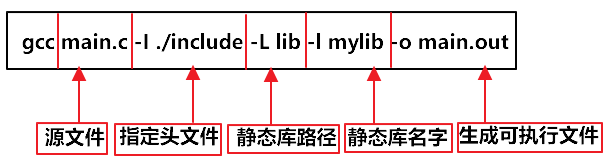
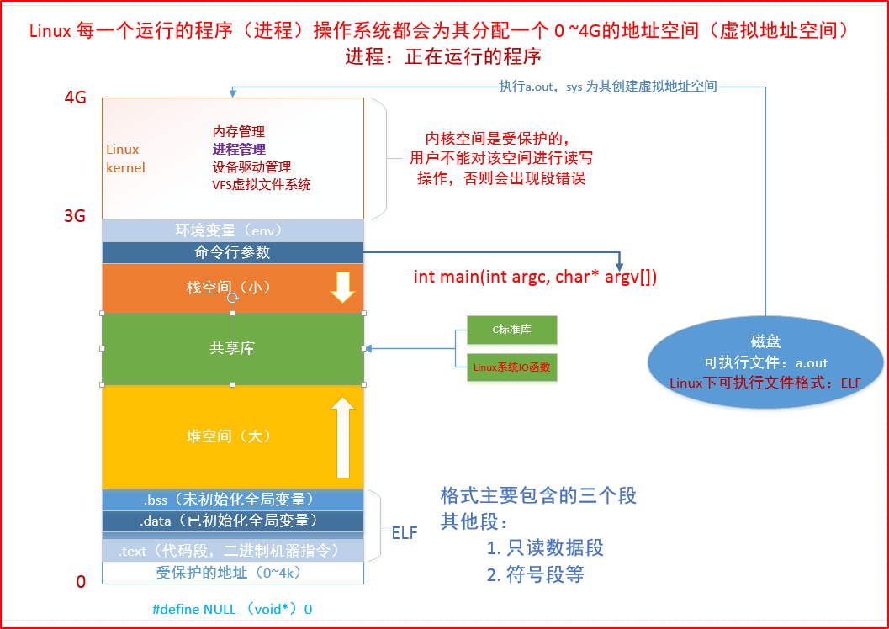

```
 * @Author: JohnJeep
 * @Date: 2020-05-21 19:19:20
 * @LastEditTime: 2020-05-21 19:19:20
 * @LastEditors: Please set LastEditors
 * @Description: 预处理、编译、汇编、链接过程
```
### 处理过程
- 预处理(Preprocessing): 处理C、C++源代码 `#include` 文件生成预处理文件 `.i` 或者 `.ii` 文件
- 编译(Compile): 将预处理文件编译成汇编代码 `.s` 文件
- 汇编(Assemble): 汇编代码生成目标文件(`.o` 或者 `.obj`)
- 链接(Linking): 将库文件(`.lib` 或 `.a`)和二进制文件(`.o` 或 `obi`)通过链接器(ld: linker directive)生成可执行文件(`.out`  output file)
  - 静态连接(static linking): 将外部函数库拷贝到可执行文件
  - 动态链接(dynamic linking)：外部函数库不进入安装包，只在运行时动态引用
  > 例如执行流程：hello.cpp->>hello.ii(预处理)->>hello.s(汇编)->>hello.o(目标文件)->>hello.exe(可执行)
<center></center>


### gcc 常用参数
- `-g(gdb)` 生成调试信息
- `-Wall`   编译时生成调试信息
- `-o(output 小写)` 生成可执行的二进制文件(类似于Windows中的.exe文件)
- `-E(prEprocessed)`      源文件文件 `.c` 生成 预处理文件 `.i`
- `-S(aSsembler)`      预处理文件 `.i` 生成汇编文件 `.s`
- `-c(compile小写)` 汇编文件 `.s` 生成可执行文件 `.o` 
- `-O(Optimizations 大写)` 优化代码
- `-I(dIr)`      指定include头文件
  > `gcc test.c -I ./include -o test.out`  使用 `-I` 链接指定目录下（`./include`）的头文件进行编译生成可执行文件。
- `-D(Defn macro)`      指定相关的宏文件
  > `gcc test.c -I ./include -o test.out -D DEBUG`  链接指定目录下（`./include`）的头文件进行编译生成可执行文件，并使用 `-D` 链接定义的 `DEBUG` 宏，生成调试信息。
- `-L(link)` 链接库路径


### 静态库
- 命名规则
  - Linux中以 `.a` 结尾。形如：`lib + 库的名字 + .a` 
  - `libtest.a` 静态库为test
- 制作步骤
  - 由`.c` 文件生成 `.o` 文件
  - 将 `.o` 文件打包。使用 `ar` 命令，参数为 `rcs`。基本格式为  `ar rcs 静态库的名字(libtest.a) 所有的.o文件 `
  - 例子：`gcc main.c -I ./include -L lib -l mylib -o main.out`
<center></center>


- `nm` 查看静态库或可执行文件里面的内容（list symbols from object files. 列出一个函数库文件中的符号表）
  - `nm main.out`
  - `nm mylib.a` 
- 优缺点
  - 优点：加载速度快。发布程序的时候不需要对应的库(include)文件.
  - 缺点：打包的程序占用很大的空间。程序发生改变时，需要重新编译静态库。


### 动态库也叫共享库(share library)
> 只有在程序执行的过程中才会加载动态链接库。
<center></center>


- 命名规则
  - Linux中以 `.so` 结尾。形如：`lib + 库的名字 + .so`
  - 例如：`libtest.so`
- 制作步骤
  - 生成与位置无关的 `.o` 文件。使用的命令 `gcc -fPIC -c *.c -I ./include`  将当前目录下所有的 `.c` 文件都生成 `.o` 文件，其中包括的头文件在 `./include` 路径下。
  - 将 `.o` 文件打包。 `gcc -shared -o libmytest.so *o -I ./include`  将当前目录下所有的 `.o` 文件打包为共享库 `libmytest.so`


- 共享库的调用
  - `gcc main.c ./lib/libmytest.so -o main.out -I ./include`  源文件 ` main.c` 与`./lib/libmytest.so` 目录下的动态库文件链接生成可执行的 `main.out` 文件
  - `gcc main.c -L ./lib -l mytest -o main.out -I ./include`    这种方式实现，需要在系统中配置动态链接库的环境变量。


- `ldd` 查看可执行文件在动态执行过程中所依赖的所有动态库。
  - 在 ldd 执行的结果中，`=>` 左边的表示该程序需要连接的共享库之 so 名称，右边表示由 Linux 的共享库系统找到的对应的共享库在文件系统中的具体位置。


程序加载动态库是从系统的环境变量中去查找的。
- ① 开发过程中临时使用的一种方法，不是永久生效。
  - 系统提供的动态链接库环境变量 `LD_LIBRARY_PATH`
  - 将自己制作的动态链接库路径导入到 `LD_LIBRARY_PATH` 路径中。`export  LD_LIBRARY_PATH = 制作的动态链接库路径`
- ② 直接在 `.bashrc`文件中去配置 `export  LD_LIBRARY_PATH = 制作的动态链接库路径`。每次打开终端都会去读取配置的文件。
- ③ 比较常用的方法 
  - 查找动态连接器的配置文件。查找 `/etc` 目录下的 `ld.so.conf`文件
  - 将自己制作的动态链接库路径写到配置文件中
  - 更新配置文件。`sudo ldconfig -v`


- 优缺点
  - 优点
    - 执行程序的体积较小。
    - 在程序的接口没有发生改变之前，不需要重新编译程序。 
  - 缺点 
    - 发布程序的时候，需要将动态库发布给用户。
    - 加载的速度相对静态库比较慢。 
