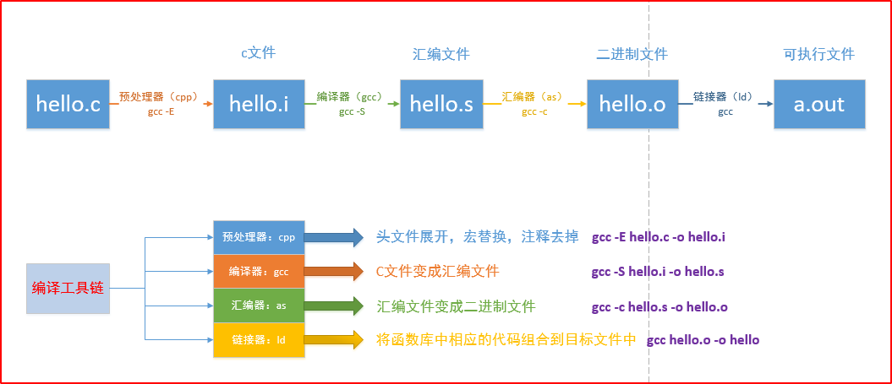

<!--

 * @Author: JohnJeep
 * @Date: 2020-05-21 19:19:20
 * @LastEditTime: 2021-12-01 23:35:48
 * @LastEditors: Windows10
 * @Description: 预处理、编译、汇编、链接过程
-->


<!-- TOC -->

- [1. 缩写](#1-缩写)
- [2. 程序处理过程](#2-程序处理过程)
- [3. 内存四区](#3-内存四区)
- [4. 函数库](#4-函数库)
- [5. 静态库](#5-静态库)
- [6. 动态库](#6-动态库)
  - [6.1. Linux平台](#61-linux平台)
  - [6.2. Windows平台](#62-windows平台)
- [7. ELF relocatable](#7-elf-relocatable)
- [8. GCC](#8-gcc)
  - [8.1. binutils](#81-binutils)
  - [8.2. glibc](#82-glibc)
  - [8.3. libstdc++](#83-libstdc)
  - [8.4. libc++](#84-libc)
- [9. 编译三部曲](#9-编译三部曲)
- [10. 包管理](#10-包管理)
  - [10.1. 软件仓库](#101-软件仓库)
  - [10.2. RPM](#102-rpm)
  - [10.3. Epel](#103-epel)
  - [10.4. Yun](#104-yun)
  - [10.5. apt](#105-apt)
  - [10.6. dpkg](#106-dpkg)
- [11. 工具](#11-工具)
- [12. 构建](#12-构建)
- [13. 参考](#13-参考)

<!-- /TOC -->

# 1. 缩写

- EXE(Executable)：可执行文件
- PE(Portable Executable)：可移植可执行。
- ELF(Executable Linkable Format)：可执行可链接格式。
- DLL(Dynamic ALinking Library): windows下的以 `.dll` 方式命名，Linux下的以 `.so` 方式命名。
- SLL(Static ALinking Library): windows下的以 `.lib` 方式命名，Linux的以 `.a` 方式命名。
- BSS(Block Started by Symbol): 未初始化的全局变量和局部静态变量的区域。


# 2. 程序处理过程 

程序处理的流程：源代码→预处理→编译→汇编→目标文件→链接→可执行文件

预处理(Preprocessing)

- 处理C、C++源代码 `#include` 文件生成预处理文件 `.i` 或者 `.ii` 文件

编译(Compile)

- 将预处理文件编译成汇编代码 `.s` 文件

汇编(Assemble)

- 汇编代码生成目标文件(`.o` 或者 `.obj`)

目标文件(Object file)

- 编译器编译源码后生成的文件叫做目标文件。

链接(Linking)

- 将库文件(`.lib` 或 `.a`)和二进制文件(`.o` 或 `obi`)通过链接器(ld: linker directive)生成可执行文件(`.out`  output file)。通俗的讲：将各种代码和数据片段收集并组合成为一个单一文件的过程，这个文件可以被加载到内存并执行。链接可以执行于编译时、加载时、运行时。
- Windows中启动程序由 CRT、DLL 提供，Linux中由 glibc(libs-start.c) 提供。
- 静态连接(static linking): 将外部函数库拷贝到可执行文件
- 动态链接(dynamic linking)：外部函数库不进入安装包，只在运行时动态引用
- 链接器必须完成的两个任务
  - 符号解析(symbol resolution)：将每个符号引用正好和一个符号定义关联起来。
  - 重定位：链接器通过把每个符号定义于一个内存位置关联起来，从而重定位这些细节，然后修改所有对这些符号的引用，使它们指向这个内存位置。


例如执行流程：hello.cpp->>hello.ii(预处理)->>hello.s(汇编)->>hello.o(目标文件)->>hello.exe(可执行)

<div align="center">
	
</div>

可执行文件


- 加载器
  - 运行程序时，加载器首先加载程序到内存中，<font color=red> 被加载程序称为进程 </font>，并由操作系统加载。
  - 主要作用：
    - 验证
    - 从硬盘复制可执行文件到主存中
    - 配置栈
    - 配置寄存器
    - 跳转到程序入口点(_start)
  - 加载器加载可执行文件时，操作系统使用的步骤
    1. 加载器请求操作系统创建一个新进程
    2. 操作系统为新进程建立页表
    3. 用无效入口标记页表
    4. 开始执行程序，生成即时页面错误异常

<div align="center">
	
</div>


# 3. 内存四区

首先了解基本的几个概念。
- 全局变量（外部变量）：出现在代码块 `{}` 之外的变量就是全局变量。
- 局部变量（自动变量）：一般情况下，代码块 `{}` 内部定义的变量就是自动变量，也可使用 `auto` 显示定义。
- static 变量：是指内存位置在程序执行期间一直不改变的变量，用关键字 `static` 修饰。代码块内部的静态变量只能被这个代码块内部访问，代码块外部的静态变量只能被定义这个变量的文件访问。

源代码编译后在内存中被分成五个主要部分：代码区、数据区、BSS、栈、堆。

- 代码区(code segment/text segment)
  - 用来存放程序执行代码的一块内存区域，里面装的是 CPU 执行的机器指令。
  - 程序加载到内存的时候由操作系统分配，程序结束时由操作系统释放。这部分区域的大小在程序运行前就已经确定，这块内存在程序运行期间是不变的，通常属于只能读，不能写，因为防止程序被指令意外的修改。
  - 代码区是共享的，共享的目的是为了频繁执行的程序，在内存中仅有一份代码的拷贝。
  - 函数也是代码的一部分，故函数都被放在代码区，包括main函数。 

- 数据段(data segment)
  - 用来存放程序中已初始化的 global 变量和static 变量的一块内存区域。
  - 分配优先于main函数，生存期与程序共存亡。
  - 程序一开始就分配了，直到结束才释放。
  - 可读可写。

- 栈(stack)
  - 栈(stack)是一种先进后出的内存结构，存储局部变量、函数形参和返回地址。
  - 栈是从高地址向低地址方向增长。
  - 在C语言中，函数参数的入栈顺序是从右到左。
  - C语言中形参和实参之间是值传递。
  - 每个线程都有自己专属的栈。
  - 栈的最大尺寸固定，超出则引起栈溢出。
  - 变量离开作用域后，栈上的内存会由系统自动释放，释放速度很快。
  - 栈分配与释放消耗CPU资源，只能存储少量的数据。

- 堆(heap)
  - 堆区由操作系统分配给每个进程，动态内存从堆中获取，调用 malloc()、calloc()、realloc()函数分配动态内存。
  - 堆区分配的内存仅能通过指针访问。 
  - 调用 free()函数将内存还给堆。
  - 堆内存用完不释放，可能会导致内存泄漏。
  - `malloc` 和 `free` 函数底层函数是采用全局指针实现的。

- BSS段
  - BSS(Block Started by Symbol): 以符号开始的块，用来存放程序中未初始化的全局变量和局部静态变量的一块区域。
  - 包括所有未初始化的全局变量、用static关键字声明且未初始化的静态全局变量
  - 运行所需空间记录在目标文件中，不在目标文件中占用实际空间
  - 程序启动过程中需要初始化的任意变量都可以存放在BSS段中。


什么时候用堆和栈？
- 如果明确知道数据占用多少内存，那么数据量较小时用栈，较大时用堆 
- 如果不知道数据量大小(可能需要占用较大内存)，最好用堆(因为这样保险些)
- 如果需要动态创建数组，则用堆

Linux 下内存分配管理如下图所示
<div align="center">
  
</div>

--------------------------

常见的内存错误
- 内存分配未成功，却使用了它。编程新手常犯这种错误，因为他们没有意识到内存分配会不成功。常用解决办法是，在使用内存之前检查指针是否为NULL。
- 内存分配虽然成功，但是尚未初始化就引用它。犯这种错误主要有两个起因：一是没有初始化的观念；二是误以为内存的缺省初值全为零，导致引用初值错误（例如数组）。 内存的缺省初值究竟是什么并没有统一的标准，尽管有些时候为零值，我们宁可信其无不可信其有。所以无论用何种方式创建数组，都别忘了赋初值，即便是赋零值也不可省略，不要嫌麻烦。
- 内存分配成功并且已经初始化，但操作越过了内存的边界。
- 忘记了释放内存，造成内存泄露。
- 释放了内存却继续使用它。
  - 程序中的对象调用关系过于复杂，实在难以搞清楚某个对象究竟是否已经释放了内存，此时应该重新设计数据结构，从根本上解决对象管理的混乱局面。
  - 函数的return语句写错了，注意不要返回指向“栈内存”的“指针”或者“引用”，因为该内存在函数体结束时被自动销毁。
  - 使用free或delete释放了内存后，没有将指针设置为NULL。导致产生“野指针”。


# 4. 函数库

函数库是可以被调用来执行的一段功能函数。函数库分为静态库和动态库。

Linux 内核提供的库函数大多数放在 `/usr/include`、`/usr/lib`、`/usr/lib64` 里面。


# 5. 静态库

所有编译器都提供一种机制，将所有相关的目标模块打包成一个单独的文件，成为静态库(static library)，它可作为链接器的输入。Linux 系统下以 `.a` 后缀，而 Windows 下以 `.lib` 后缀。


命名规则
- Linux中以 `.a` 结尾。形如：`lib + 库的名字 + .a` 
- `libtest.a` 静态库为 test


制作步骤
- 由`.c` 文件生成 `.o` 文件。   例如：`gcc *.c -Wall -I ./include/`
- 将 `.o` 文件打包。使用 `ar` 命令，参数为 `rcs`。基本格式为  `ar rcs 静态库的名字(libtest.a) 所有的.o文件 `
  - `ar rcs libstatic_1.a *.o` 
- 另外一种写法：例子：`gcc main.c -I ./include -L lib -l mylib -o main.out`
<div align="center"></div>


优缺点
- 优点：加载速度快。发布程序的时候不需要对应的库(include)文件.
- 缺点：打包的程序占用很大的空间。程序发生改变时，需要重新编译静态库。


# 6. 动态库

动态库也叫共享库(share library)，它是一个目标模块，在运行或加载时，能加载到任意的内存地址，并链接一个内存中的程序，这个过程就叫动态链接(dynamic linking)，它是由一个叫动态链接器(dynamic linker)的程序来执行的。Linux 系统下以 `.so` 后缀，而 Windows 下以 `.dll` 后缀。

> 只有在程序执行的过程中才会加载动态链接库。


## 6.1. Linux平台

- 命名规则
  - Linux中以 `.so` 结尾。形如：`lib + 库的名字 + .so`
  - 例如：`libtest.so`
- 制作步骤
  - 生成与位置无关的 `.o` 文件。使用的命令 `gcc -fPIC -c *.c -I ./include`  将当前目录下所有的 `.c` 文件都生成 `.o` 文件，其中包括的头文件在 `./include` 路径下。
  - 将 `.o` 文件打包。 `gcc -shared -o libmytest.so *o -I ./include`  将当前目录下所有的 `.o` 文件打包为共享库 `libmytest.so`


- 共享库的调用
  - `gcc main.c ./lib/libmytest.so -o main.out -I ./include`  源文件 ` main.c` 与`./lib/libmytest.so` 目录下的动态库文件链接生成可执行的 `main.out` 文件
  - `gcc main.c -L ./lib -l mytest -o main.out -I ./include`    这种方式实现，需要在系统中配置动态链接库的环境变量。


- `ldd` 查看可执行文件 (.out) 在动态执行过程中所依赖的所有动态库。
  
  在 `ldd` 执行的结果中，`=>` 左边的表示该程序需要连接共享库的名称，右边表示由 Linux 的共享库系统找到对应的共享库，在文件系统中的具体位置。
  
  ```sh
  [root@redis_181 lib64]# ldd libselinux.so.1
          linux-vdso.so.1 =>  (0x00007ffe5ec63000)
          libpcre.so.1 => /lib64/libpcre.so.1 (0x00007faf6fbb0000)
          libdl.so.2 => /lib64/libdl.so.2 (0x00007faf6f9ac000)
          libc.so.6 => /lib64/libc.so.6 (0x00007faf6f5de000)
          /lib64/ld-linux-x86-64.so.2 (0x00007faf70039000)
          libpthread.so.0 => /lib64/libpthread.so.0 (0x00007faf6f3c2000)
  ```


程序加载动态库是从系统的环境变量中去查找的。

① 开发过程中临时使用的一种方法，不是永久生效。每次关闭终端，都会将配置的环境变量清除。
- 系统提供的动态链接库环境变量 `LD_LIBRARY_PATH`
- 将自己制作的动态链接库路径导入到 `LD_LIBRARY_PATH` 路径中。`export  LD_LIBRARY_PATH = 制作的动态链接库路径`

② 直接在 `.bashrc`文件中去配置 `export  LD_LIBRARY_PATH = 制作的动态链接库路径`。每次打开终端都会去读取配置的文件。

③ 比较常用的方法 
- 查找动态连接器的配置文件。查找 `/etc` 目录下的 `ld.so.conf`文件
- 将自己制作的动态链接库路径写到配置文件中。要使用绝对路径，完整的动态库位置。
- 更新配置文件。`sudo ldconfig -v`

优点
- 执行程序的体积较小。
- 在程序的接口没有发生改变之前，不需要重新编译程序。 

缺点 
- 发布程序的时候，需要将动态库发布给用户。
- 加载的速度相对静态库比较慢。 


## 6.2. Windows平台

C++ 在调用 Dll 中的函数的时候，如果是企业内部的话，肯定是希望三件套的方式(.h .lib .dll)。这样做的话，编写方可以在头文件中写入很多信息，方便调用方的调用。但是，一旦是给其他公司的人使用，而不想让别人看到的话，那编写方肯定是不想让别人看到过多的信息的，你只管调用。
还有一点是 dll 是在调试的时候使用的，lib 是编译的时候使用的，两者是不同时期使用的工具。


# 7. ELF relocatable


查看符号表内容
```
readlf -s main.o
```

# 8. GCC

GCC 原名为GNU C语言编译器（GNU C Compiler），只能处理C语言。但其很快扩展，变得可处理C++，后来又扩展为能够支持更多编程语言，如Fortran、Pascal、Objective -C、Java、Ada、Go以及各类处理器架构上的汇编语言等，所以改名GNU编译器套件（GNU Compiler Collection）

```sh
常用参数项
-g(gdb)                生成调试信息
-Wall                  编译时生成调试信息
-E(prEprocessed)       源文件文件 .c 生成 预处理文件 .i
-S(aSsembler)          预处理文件 .i 生成汇编文件 .s
-c(compile小写)         汇编文件 .s 生成可执行文件 .o 
-o(output 小写)         生成可执行的二进制文件(类似于Windows中的.exe文件)
-L(link)                链接库路径
-O(Optimizations 大写)  优化代码

-I(dIr)                 指定include头文件
  gcc test.c -I ./include -o test.out  使用 -I 链接指定目录下(./include)的头文件进行编译生成可执行文件。

-D(Defn macro)           指定相关的宏文件(控制日志log输出)
  gcc test.c -I ./include -o test.out -D DEBUG  链接指定目录下(./include)的头文件进行编译生成可执行文件，并使用 -D 链接定义的 DEBUG 宏，生成调试信息。
```

- [GCC 包下载：fedoraproject.org](https://archives.fedoraproject.org/pub/)
- [gun.org](http://ftp.gnu.org/gnu/)
- [清华大学 GNU 源镜像](https://mirrors.tuna.tsinghua.edu.cn/gnu/)

## 8.1. binutils

GNU Binary Utilities 或 binutils 是一整套的编程语言工具程序，用来处理许多格式的目标文件。它提供了一系列用来创建、管理和维护二进制目标文件的工具程序，如下表。通常，binutils 与 gcc 是紧密相集成 的，没有 binutils 的话，gcc 是不能正常工作的。

| `as`        | [汇编器](https://zh.wikipedia.org/wiki/組譯器)               |
| ----------- | ------------------------------------------------------------ |
| `ld`        | [链接器](https://zh.wikipedia.org/wiki/链接器)               |
| `gprof`     | [性能分析](https://zh.wikipedia.org/wiki/性能分析)工具程序   |
| `addr2line` | 从目标文件的虚拟地址获取文件的行号或符号                     |
| `ar`        | 可以对[静态库](https://zh.wikipedia.org/w/index.php?title=Archive_file&action=edit&redlink=1)做创建、修改和取出的操作。 |
| `c++filt`   | [解码](https://zh.wikipedia.org/wiki/Name_mangling#Name_mangling_in_C++) [C++](https://zh.wikipedia.org/wiki/C%2B%2B) 的符号 |
| `dlltool`   | 创建Windows [动态库](https://zh.wikipedia.org/wiki/動態函式庫) |
| `gold`      | 另一种链接器                                                 |
| `nlmconv`   | 可以转换成[NetWare Loadable Module](https://zh.wikipedia.org/w/index.php?title=NetWare_Loadable_Module&action=edit&redlink=1)目标文件格式 |
| `nm`        | 显示目标文件内的符号                                         |
| `objcopy`   | 复制目标文件，过程中可以修改                                 |
| `objdump`   | 显示目标文件的相关信息，亦可反汇编                           |
| `ranlib`    | 产生静态库的索引                                             |
| `readelf`   | 显示[ELF](https://zh.wikipedia.org/wiki/可執行與可鏈接格式)文件的内容 |
| `size`      | 列出总体和section的大小                                      |
| `strings`   | 列出任何二进制档内的可显示字符串                             |
| `strip`     | 从目标文件中移除符号                                         |
| `windmc`    | 产生Windows消息资源                                          |
| `windres`   | Windows [资源](https://zh.wikipedia.org/wiki/资源_(Windows))档编译器 |


## 8.2. glibc

glibc 是 gnu 发布的 libc 库，也即 c 运行库，又称 GNU C 库。glibc是linux系统中最底层的api（应用程序开发接口），几乎其它任何的运行库 都会倚赖于glibc。glibc除了封装linux操作系统所提供的系统服务外，它本身也提供了许多其它一些必要功能服务的实现，主要的如下：
 （1）string，字符串处理
 （2）signal，信号处理
 （3）dlfcn，管理共享库的动态加载
 （4）direct，文件目录操作
 （5）elf，共享库的动态加载器，也即interpreter
 （6）iconv，不同字符集的编码转换
 （7）inet，socket接口的实现
 （8）intl，国际化，也即gettext的实现
 （9）io
 （10）linuxthreads
 （11）locale，本地化
 （12）login，虚拟终端设备的管理，及系统的安全访问
 （13）malloc，动态内存的分配与管理
 （14）nis
 （15）stdlib，其它基本功能

使用一张图表示


[官网解释 glibc](https://www.gnu.org/software/libc/libc.html)


glibc 和 libc 的区别？

libc 是 Linux 下的 ANSI C 的函数库；glibc 是 Linux 下的 GUN C 函数库；

> ANSI C是基本的C语言函数库，包含了C语言最基本的库函数。这个库可以根据 头文件划分为 15 个部分，其中包括：字符类型 (<ctype.h>)、错误码 (<errno.h>)、 浮点常数 (<float.h>)、数学常数 (<math.h>)、标准定义 (<stddef.h>)、 标准 I/O (<stdio.h>)、工具函数 (<stdlib.h>)、字符串操作 (<string.h>)、 时间和日期 (<time.h>)、可变参数表 (<stdarg.h>)、信号 (<signal.h>)、 非局部跳转 (<setjmp.h>)、本地信息 (<local.h>)、程序断言 (<assert.h>) 等等

> GNU C函数库是一种类似于第三方插件的东西，由于Linux是用Ｃ语言写的，所以Linux的一些操作是用Ｃ语言实现的，所以GNU组织开发了一个Ｃ语言的库 用于我们更好的利用C语言开发基于Linux操作系统的程序。其实我们可以把它理解为类似于Qt是一个C++的第三方函数库一样。

glibc 版本查看：

```c
[root@CentOS7 ~]# ldd --version
ldd (GNU libc) 2.17
Copyright (C) 2012 Free Software Foundation, Inc.
This is free software; see the source for copying conditions.  There is NO
warranty; not even for MERCHANTABILITY or FITNESS FOR A PARTICULAR PURPOSE.
Written by Roland McGrath and Ulrich Drepper.
```

参考
- [glibc 官方源码地址](http://ftp.gnu.org/gnu/glibc/)
- [glibc源码分析-1:构建过程](https://magus0219.me/zh-cn/glibc%E6%BA%90%E7%A0%81%E5%88%86%E6%9E%90-1-%E6%9E%84%E5%BB%BA%E8%BF%87%E7%A8%8B/)


## 8.3. libstdc++

libstdc++ 是 gcc 的标准 C++ 库。

## 8.4. libc++

libc++ 是针对 clang 编译器重写的 C++ 标准库。


-----------------------------------------

高版本 GCC 编译器编译 C++11 之下的代码，可能出现的问题？

许多c++ 11功能都需要C++标准库的新libc++实现。但是libc++与旧的libstdc++不兼容，但目前大多数软件通常都与旧的libstdc++链接。

```
libc++使用内联 namespace 来帮助确保ABI不兼容类型不会被误认为是彼此之间的错误。如果接口(interface)直接使用libc++ std::string，则期望libstdc++ std::string的库将不会链接到该接口(interface)，因为实际的符号是不同的:std::string与std::__1::string。
```


# 9. 编译三部曲

第一步：执行脚本 configure 文件，设置指定的参数，建立 Makefile 文件。

```sh
./configure --prefix=指定软件路径
例如：../configure --prefix=/usr/local/gcc-4.9.4 -enable-checking=release -enable-languages=c,c++ -disable-multilib

CentOS7 4.8.4 默认安装时的配置
../configure --prefix=/usr --mandir=/usr/share/man --infodir=/usr/share/info --with-bugurl=http://bugzilla.redhat.com/bugzilla --enable-bootstrap --enable-shared --enable-threads=posix --enable-checking=release --with-system-zlib --enable-__cxa_atexit --disable-libunwind-exceptions --enable-gnu-unique-object --enable-linker-build-id --with-linker-hash-style=gnu --enable-languages=c,c++,objc,obj-c++,java,fortran,ada,go,lto --enable-plugin --enable-initfini-array --disable-libgcj --with-isl=/builddir/build/BUILD/gcc-4.8.5-20150702/obj-x86_64-redhat-linux/isl-install --with-cloog=/builddir/build/BUILD/gcc-4.8.5-20150702/obj-x86_64-redhat-linux/cloog-install --enable-gnu-indirect-function --with-tune=generic --with-arch_32=x86-64 --build=x86_64-redhat-linux

参数项
  --prefix：指定安装路径。
  --enable-threads=posix：启用POSIX标准的线程支持。要让程序能在符合POSIX规范的linux发布版上正确运行，就应该启用该选项。这里取决于目标操作系统的类型，其它可用值有：aix、dec、solaris、win32等。
  --disable-checking：不对编译时生成的代码进行一致性检查（检查的话一般设置为：--enable-checking=release）。建议机器硬件配置较低以及不愿等待太久编译时间的童鞋，可以设置为disable，但是这会增加产生未预期的错误的风险。
  --disable-multilib：如果你的操作系统是32位，默认就已经设置为disable，这意味着gcc仅能生成32位的可执行程序。如果你的操作系统是64位，默认设置为enable，这意味着用gcc编译其它源文件时可以通过-m32选项来决定是否生成32位机器代码。由于我们这里是64位系统上，所以要禁止生成32位代码。
  --enable-languages=c,c++：支持的高级语言类型和运行时库，可以设置的所有语言还包括ada、Fortran、java、objc、obj-c++、GO等语言。这里只开启了c和c++，因为支持的语言越多，就需要安装越多的相应静态与动态库，等待的时间也越久。
```

第二部：执行 make 命令

```
执行 make 命令进行 编译。
```

第三步：执行 make install

```
安装软件到第一步 ./configure 后面指定的路径下。
```


```sh
CentOS7 安装高版本 gcc8/g++8

  1、安装软件仓库包 scl: yum install centos-release-scl
  2、安装 gcc/g++，数字 8 对应的是 gcc/g++8: yum install devtoolset-8-gcc devtoolset-8-gcc-c++
  3、shell 终端临时设置默认版本，重启后失效: scl enable devtoolset-8 -- bash；
     长期有效设置：vim /etc/profile 文件中的最后一行加入: source /opt/rh/devtoolset-8/enable
```


```sh
拓展知识点
  GCC4.8 支持 C++11
  GCC 4.8.1 will be C++11 feature-complete [2013-04-01]
Support for C++11 ref-qualifiers was added to the GCC 4.8 branch, making G++ the first C++ compiler to implement all the major language features of the C++11 standard. This functionality will be available in GCC 4.8.1.


GCC5.3 支持 C++14
  GCC 5 C++14 language feature-complete [2014-12-23]
  Support for all C++14 language features has been added to the development sources for GCC, and will be available when GCC 5 is released next year. Contributed by Jason Merrill, Braden Obrzut, Adam Butcher, Edward Smith-Rowland, and Jakub Jelinek.
  
  
查看libstdc++.so的版本
  strings /usr/lib/libstdc++.so.6 | grep GLIBCXX  
 
```

- [离线 GCC 安装教程](https://cloud.tencent.com/developer/article/1176706)
- [Linux编译安装GNU gcc 4.9.4](https://blog.csdn.net/dhy012345/article/details/89642421)
- [【推荐】CentOS安装gcc-4.9.4+更新环境+更新动态库)](https://www.cnblogs.com/brishenzhou/p/8820237.html)

# 10. 包管理

[RedHat/CentOS8 【国内/本地/私有 Yum 源】制作和使用](https://www.jianshu.com/p/68db74388600)

Debian/Ubuntu 采用 `dpkg` 进行软件包的管理，使用 `apt` 进行在线软件的升级。

CentOS/Red Hat/Fedora 采用 `rpm` 进行软件包的管理，使用 `yum` 进行在线软件的升级。


## 10.1. 软件仓库

Windows

- 常有文件程序自解压、选定安装组件和安装路径（个别不让选择路径）、添加注册表项等等，完成以后双击启动运行，卸载时找安装路径下的uninstall或者控制面板里卸载

Linux 或 Unix

- 软件包组织方式上，是将可执行程序、程序库、手册页等多种类型文件打包压缩提供，内容上一般分为预先编译好的二进制包和程序源码包两种；
- 软件包管理方式上，不同开发者开发的软件，被打包集中统一存放在官方维护的软件仓库中，这个软件仓库就是一个软件源，和iOS/Android系统上的AppStore/应用市场等概念很像，Windows也开始使用“Windows Store”；除此外，第三方在遵守相关协议的前提下镜像（mirror）官方软件仓库成为镜像源，系统提供专门的软件包管理器用于从软件源下载、安装和卸载软件包。


## 10.2. RPM

rpm（RPM Package Manager）叫RPM包管理器。

**rpm包**：把二进制程序文件、配置文件以和帮助文档等程序资源打包在一起形成的文件。安装软件需要手动解决依赖关系。

仓库源位置：`/etc/yum.repos.d/`，查看中重点关注是基础的 `CentOS-Base.repo`

RPM 包安装包的格式，下面以 `autoconf-2.63-5.1.el6.noarch.rpm` 安装包为例子。


```sh
# 参数项
-q|--query  
-V|--verify
-i|--install
-U|--upgrade
-e|--erase


# 常见命令
rpm -ql  列出软件中安装的软件包
rpm -e xxx 卸载 xxx 包
rpm -qa xxx 查询安装包
rpm -ivh --force --nodeps *rpm  一次性安装多个软件包

```


## 10.3. Epel 

EPEL (Extra Packages for Enterprise Linux), 是由 Fedora Special Interest Group 维护的 Enterprise Linux（RHEL、CentOS）中经常用到的包。


- 官方主页：https://fedoraproject.org/wiki/EPEL
- [阿里云 epel 镜像配置](https://developer.aliyun.com/mirror/epel?spm=a2c6h.13651102.0.0.540e1b11JdpQPV)


## 10.4. Yun

**yum源（rpm软件仓库）**：集中存储rpm包的服务器，通常以http、nfs、ftp、file等协议提供rpm包下载安装服务。互联网中的yum源一般分为发行方和第三方提供。CentOS默认使用发行方yum源。安装软件时会自动解决依赖关系。

**yum配置文件**：CentOS中用于定义yum源位置和使用协议的配置文件，存放在 `/etc/yum.repo.d`目录下的 `*.repo` 文件，为所有仓库提供公共配置。

CentOS8默认开启的yum配置文件有：CentOS-AppStream.repo、CentOS-Base.repo、CentOS-Extras.repo；

CentOS7及以下版本默认开启的yum配置文件有：CentOS-Base.repo、CentOS-Extras.repo、CentOS-Updates.repo。

- **dnf/yum命令**：CentOS中用于从yum源下载rpm包、自动处理包依赖关系，并且能够一次安装所有所依赖rpm包的命令工具。CentOS8建议使用dnf工具，CentOS7及以下只能使用yum工具。两个工具的用法、参数一致。
- **reposync**：用于同步互联网yum源的rpm包到本地磁盘中的命令工具。通过yum源下载yum-utils安装。
- **createrepo**：用于扫描本地磁盘中的rpm包并生成元数据文件，建立本地yum源的命令工具。建成本地yum源后，服务器可以通过file协议使用本地yum源。
- **modifyrepo：**用于导入yum源模块文件的命令工具。

```sh
参数项
repolist

grouplist   可用组

```


## 10.5. apt

- apt-cache search # ------(package 搜索包)
- apt-cache show #------(package 获取包的相关信息，如说明、大小、版本等)
- apt-get install # ------(package 安装包)
- apt-get install # -----(package --reinstall 重新安装包)
- apt-get -f install # -----(强制安装, "-f = --fix-missing")
- apt-get remove #-----(package 删除包)
- apt-get remove --purge # ------(package 删除包，包括删除配置文件等)
- apt-get autoremove --purge # ----(package 删除包及其依赖的软件包+配置文件等
- `apt-get update`  更新源(软件列表)
- `apt-get upgrade` 更新已安装的包
- `apt-get clean && apt-get autoclean`  清理下载文件的缓存和只清理过时的包
- apt-get dist-upgrade # ---------升级系统
- apt-get dselect-upgrade #------使用 dselect 升级
- apt-cache depends #-------(package 了解使用依赖)
- apt-cache rdepends # ------(package 了解某个具体的依赖,当是查看该包被哪些包依赖吧...)
- apt-get build-dep # ------(package 安装相关的编译环境)
- apt-get source #------(package 下载该包的源代码)
- apt-get check #-------检查是否有损坏的依赖
- `dpkg -S filename` -----查找filename属于哪个软件包
- apt-file search filename -----查找filename属于哪个软件包
- apt-file list packagename -----列出软件包的内容
- apt-file update --更新apt-file的数据库
- 找到安装的软件
  - dpkg -S softwarename 显示包含此软件包的所有位置
  - dpkg -L softwarename 显示安装路径
  - dpkg -l softwarename 查看软件版本
  - 用 find 或 whereis 命令查找文件位置
- 卸载软件
  -  apt-get remove softname1 softname2 …;              移除式卸载
  -  apt-get purge sofname1 softname2…;                       卸载软件同时清除配置文件


## 10.6. dpkg 

- dpkg --info "软件包名" --列出软件包解包后的包名称.
- dpkg -l --列出当前系统中所有的包.可以和参数less一起使用在分屏查看. (类似于rpm -qa)
- dpkg -l |grep -i "软件包名" --查看系统中与"软件包名"相关联的包.
- dpkg -s 查询已安装的包的详细信息.
- dpkg -L 查询系统中已安装的软件包所安装的位置. (类似于rpm -ql)
- dpkg -S 查询系统中某个文件属于哪个软件包. (类似于rpm -qf)
- dpkg -I 查询deb包的详细信息,在一个软件包下载到本地之后看看用不用安装(看一下呗).
- dpkg -i 手动安装软件包(这个命令并不能解决软件包之前的依赖性问题),如果在安装某一个软件包的时候遇到了软件依- 赖的问题,可以用apt-get -f install在解决信赖性这个问题.
- dpkg -r 卸载软件包.不是完全的卸载,它的配置文件还存在.
- dpkg -P 全部卸载(但是还是不能解决软件包的依赖性的问题)
- dpkg -reconfigure 重新配置


# 11. 工具

- readelf
  
  读取 ELF(Executable and Linking Format) 文件中信息
  
- size
  
   查看object文件或者链接库文件中的object文件的各个段(section)的大小及其总的大小。
   
- nm
  
  查看静态库或可执行文件里面的内容(list symbols from object files：列出一个函数库文件中的符号表)

  例如：`nm main.out`， `nm mylib.a` 
  
- objdump
  
  是Linux下的反汇编目标文件或者可执行文件的命令，它以一种可阅读的格式让你更多地了解二进制文件可能带有的附加信息。
  
  ```sh
  常用符号表字段
  
  .text：   已编译程序的机器代码。
  
  .rodata： 只读数据，比如printf语句中的格式串和开关(switch)语句的跳转表。
  
  .data：   已初始化的全局C变量。局部C变量在运行时被保存在栈中，既不出现在.data中，也不出现在.bss节中。
  
  .bss：    未初始化的全局C变量。在目标文件中这个节不占据实际的空间，它仅仅是一个占位符。目标文件格式区分初始化和未初始化变量是为了空间效率在：在目标文件中，未初始化变量不需要占据任何实际的磁盘空间。
  
  .symtab： 一个符号表(symbol table)，它存放在程序中被定义和引用的函数和全局变量的信息。一些程序员错误地认为必须通过-g选项来编译一个程序，得到符号表信息。实际上，每个可重定位目标文件在 `.symtab` 中都有一张符号表。然而，和编译器中的符号表不同，.symtab符号表不包含局部变量的表目。
  
  .rel.text：当链接噐把这个目标文件和其他文件结合时，`.text` 中的许多位置都需要修改。一般而言，任何调用外部函数或者引用全局变量的指令都需要修改。另一方面调用本地函数的指令则不需要修改。注意，可执行目标文件中并不需要重定位信息，因此通常省略，除非使用者显式地指示链接器包含这些信息。
  
  .rel.data：被模块定义或引用的任何全局变量的信息。一般而言，任何已初始化全局变量的初始值是全局变量或者外部定义函数的地址都需要被修改。
  
  .debug：  一个调试符号表，其有些表目是程序中定义的局部变量和类型定义，有些表目是程序中定义和引用的全局变量，有些是原始的C源文件。只有以-g选项调用编译驱动程序时，才会得到这张表。
  
  .line：  原始C源程序中的行号和 `.text` 中机器指令之间的映射。只有以 `-g` 选项调用编译驱动程序时，才会得到这张表。
  
  .strtab：一个字符串表，其内容包括 `.symtab` 和 `.debug` 中的符号表，以及节头部中的节名字。字符串表就是以 `null` 结尾的字符串序列。
  ```
  
  
  
  ```sh
  参数选项
  
  -a  --archive-headers       显示档案库的成员信息,类似ls -l将lib*.a的信息列出。 
  -b bfdname --target=bfdname 指定目标码格式。这不是必须的，objdump能自动识别许多格式，比如： 
  
  objdump -b oasys -m vax -h fu.o 
  显示fu.o的头部摘要信息，明确指出该文件是Vax系统下用Oasys编译器生成的目标文件。objdump -i将给出这里可以指定的目标码格式列表。 
  
  -C  --demangle              将底层的符号名解码成用户级名字，除了去掉所开头的下划线之外，还使得C++函数名以可理解的方式显示出来。 
  -g --debugging              显示调试信息。企图解析保存在文件中的调试信息并以C语言的语法显示出来。仅仅支持某些类型的调试信息。有些其他的格式被readelf -w支持。 
  
  -e  --debugging-tags        类似 -g 选项，但是生成的信息是和ctags工具相兼容的格式。 
  -d --disassemble            从 objfile 中反汇编那些特定指令机器码的 section。 
  -D  --disassemble-all       与 -d 类似，但反汇编所有section. 
  --prefix-addresses          反汇编的时候，显示每一行的完整地址。这是一种比较老的反汇编格式。 
  
  -EB 
  -EL 
  --endian={big|little}       指定目标文件的小端。这个项将影响反汇编出来的指令。在反汇编的文件没描述小端信息的时候用。例如S-records. 
  
  -f --file-headers           显示 objfile 中每个文件的整体头部摘要信息。 
  -h --section-headers --headers 显示目标文件各个section的头部摘要信息。 
  -H --help 简短的帮助信息。 
  -j name  --section=name      仅仅显示指定名称为name的section的信息 
  -l --line-numbers            用文件名和行号标注相应的目标代码，仅仅和 -d、 -D 或者 -r 一起使用使用 -ld 和使用 -d 的区别不是很大，在源码级调试的时候有用，要求编译时使用了 -g 之类的调试编译选项。 
  
  -m machine --architecture=machine 指定反汇编目标文件时使用的架构，当待反汇编文件本身没描述架构信息的时候(比如 S-records)，这个选项很有用。可以用 -i 选项列出这里能够指定的架构. 
  
  -r --reloc                  显示文件的重定位入口。如果和-d或者-D一起使用，重定位部分以反汇编后的格式显示出来。 
  -R  --dynamic-reloc         显示文件的动态重定位入口，仅仅对于动态目标文件意义，比如某些共享库。 
  -s  --full-contents         显示指定 section 的完整内容。默认所有的非空section都会被显示。 
  -S --source                 尽可能反汇编出源代码，尤其当编译的时候指定了 -g 这种调试参数时，效果比较明显。隐含了 -d 参数。
  --show-raw-insn             反汇编的时候，显示每条汇编指令对应的机器码，如不指定 --prefix-addresses，这将是缺省选项。 
  --no-show-raw-insn          反汇编时，不显示汇编指令的机器码，如不指定 --prefix-addresses，这将是缺省选项。 
  --start-address=address     从指定地址开始显示数据，该选项影响 -d、 -r 和 -s 选项的输出。 
  --stop-address=address      显示数据直到指定地址为止，该项影响-d、-r和-s选项的输出。 
  -t --syms                   显示文件的符号表入口。类似于 nm -s 提供的信息 
  -T --dynamic-syms           显示文件的动态符号表入口，仅仅对动态目标文件意义，比如某些共享库。它显示的信息类似于 nm -D|--dynamic 显示的信息。 
  -V --version                版本信息 
  --all-headers -x            显示所可用的头信息，包括符号表、重定位入口。 -x 等价于 -a -f -h -r -t 同时指定。 
  -z --disassemble-zeroes     一般反汇编输出将省略大块的零，该选项使得这些零块也被反汇编。 
  @file                       可以将选项集中到一个文件中，然后使用这个 @file 选项载入。
  ```


# 12. 构建

两种编译构建方式。

- 原生(native)编译构建，即编译构建命令所运行(host)的系统环境和编译构建输出目标(target)的系统环境一致；
- 交叉(cross)编译构建，上述target和host不一致，即在A系统环境构建出在B系统上运行的目标，这在嵌入式开发中尤为多见。
  
  > 系统环境：GNU的构建工具链中使用CPU指令集架构、厂商、系统内核的三元组合来指示系统环境


# 13. 参考
- [C++ Dll 编写入门](https://www.cnblogs.com/daocaoren/archive/2012/05/30/2526495.html)
- [编译器的工作过程](http://www.ruanyifeng.com/blog/2014/11/compiler.html)
- [内存管理(详细版)](https://www.cnblogs.com/yif1991/p/5049638.html)：详细的解释了内存四区的相关内容。


