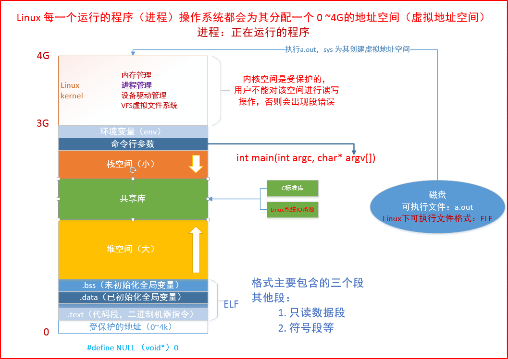

<!--
 * @Author: JohnJeep
 * @Date: 2020-05-21 19:19:20
 * @LastEditTime: 2020-11-26 08:34:24
 * @LastEditors: Please set LastEditors
 * @Description: 预处理、编译、汇编、链接过程
-->

<!-- TOC -->

- [0.1. 缩写](#01-缩写)
- [0.2. 程序处理过程](#02-程序处理过程)
  - [0.2.1. 程序运行的过程](#021-程序运行的过程)
  - [编译](#编译)
  - [内存四区](#内存四区)
  - [0.2.2. gcc 常用参数](#022-gcc-常用参数)
  - [0.2.3. 静态库](#023-静态库)
  - [0.2.4. 动态库也叫共享库(share library)](#024-动态库也叫共享库share-library)
- [0.3. 工具](#03-工具)
- [0.4. 两种编译构建方式](#04-两种编译构建方式)

<!-- /TOC -->

## 0.1. 缩写
- PE(Portable Executable)：可移植可执行
- ELF(Executable Linkable Format)：可执行可链接格式
- DLL(Dynamic ALinking Library): windows的 `.dll`，Linux的 `.so`
- SLL(Static ALinking Library): windows的 `.lib`，Linux的 `.a`
- BSS(Block Started by Symbol): 未初始化的全局变量和局部静态变量的区域。


## 0.2. 程序处理过程 

### 0.2.1. 程序运行的过程
- 预处理(Preprocessing): 处理C、C++源代码 `#include` 文件生成预处理文件 `.i` 或者 `.ii` 文件

- 编译(Compile): 将预处理文件编译成汇编代码 `.s` 文件

- 汇编(Assemble): 汇编代码生成目标文件(`.o` 或者 `.obj`)

- 链接(Linking): 将库文件(`.lib` 或 `.a`)和二进制文件(`.o` 或 `obi`)通过链接器(ld: linker directive)生成可执行文件(`.out`  output file)
  > linking:：将各种代码和数据片段收集并组合成为一个单一文件的过程，这个文件可以被加载到内存并执行。链接可以执行于编译时、加载时、运行时。
  - 静态连接(static linking): 将外部函数库拷贝到可执行文件
  - 动态链接(dynamic linking)：外部函数库不进入安装包，只在运行时动态引用
  > 例如执行流程：hello.cpp->>hello.ii(预处理)->>hello.s(汇编)->>hello.o(目标文件)->>hello.exe(可执行)

-  链接器必须完成的两个任务
   -  符号解析(symbol resolution  )：将每个符号引用正好和一个符号定义关联起来。
   -  重定位：链接器通过把每个符号定义于一个内存位置关联起来，从而重定位这些细节，然后修改所有对这些符号的引用，使它们指向这个内存位置。

<div align="center"></div>


### 编译
参考文章：[编译器的工作过程](http://www.ruanyifeng.com/blog/2014/11/compiler.html)
- 编译过程

- 源代码→预处理→编译→汇编→目标文件→链接→可执行文件
- 预处理
- 编译
- 汇编
- 目标文件
- 链接
  - Windows中启动程序由CRT、DLL提供，Linux中由glibc(libs-start.c)提供。
- 可执行文件
  - 加载器
    - 运行程序时，加载器首先加载程序到内存中，<font color=red> 被加载程序称为进程 </font>，并由操作系统加载。
    - 主要作用：
      - 验证
      - 从硬盘复制可执行文件到主存中
      - 配置栈
      - 配置寄存器
      - 跳转到程序入口点(_start)
    - 加载器加载可执行文件时，操作系统使用的步骤
      1. 加载器请求操作系统创建一个新进程
      2. 操作系统为新进程建立页表
      3. 用无效入口标记页表
      4. 开始执行程序，生成即时页面错误异常
    


### 内存四区
参考文章
- [内存管理（详细版）](https://www.cnblogs.com/yif1991/p/5049638.html)：详细的解释了内存四区的相关内容。


源代码编译后被分成五个主要部分：代码段、数据段、BSS段、栈区、堆区。
- 代码区（Code Area）
  - 程序加载到内存的时候由操作系统分配，程序结束时由操作系统释放。
  - 所有的可执行代码（程序代码指令、常量字符串等）都加载到代码区，这块内存在程序运行期间是不变的。只能读，不可以写。
  - 代码区是平行的，里面装的是一堆指令，在程序运行期间是不能改变的。
  - 函数也是代码的一部分，故函数都被放在代码区，包括main函数。 


- 数据区
  - 存放程序中所有的全局变量、静态变量和非零值初始化变量。
  - 分配优先于main函数，生存期与程序共存亡。
  - 程序一开始就分配了，直到结束才释放。
  - 可读可写。


- 栈区（stack）
  - 栈（stack）是一种先进后出的内存结构，存储局部变量、函数形参和返回地址。
  - 栈是从高地址向低地址方向增长
  - 在C语言中，函数参数的入栈顺序是从右到左
  - C语言中形参和实参之间是值传递
  - 每个线程都有自己专属的栈；
  - 栈的最大尺寸固定，超出则引起栈溢出；
  - 变量离开作用域后，栈上的内存会由系统自动释放，释放速度很快。
  - 栈分配与释放消耗CPU资源，只能存储少量的数据。


- 堆区（heap）
  - 堆区由操作系统分配给每个进程，动态内存从堆中获取，调用malloc()、calloc()、realloc()函数分配动态内存。
  - 堆区分配的内存仅能通过指针访问。 
  - 调用free()函数将内存还给堆。
  - 堆内存用完不释放，可能会导致内存泄漏。
  - `malloc` 和 `free` 函数底层函数是采用全局指针实现的。


- BSS段(以符号开始的块)
  - 包括所有未初始化的全局变量、用static关键字声明且未初始化的静态全局变量
  - 运行所需空间记录在目标文件中，不在目标文件中占用实际空间
  - 程序启动过程中需要初始化的任意变量都可以存放在BSS段中。


- 什么时候用堆和栈？
  - 如果明确知道数据占用多少内存，那么数据量较小时用栈，较大时用堆 
  - 如果不知道数据量大小（可能需要占用较大内存），最好用堆（因为这样保险些）
  - 如果需要动态创建数组，则用堆


### 0.2.2. gcc 常用参数
- `-g(gdb)` 生成调试信息
- `-Wall`   编译时生成调试信息
- `-E(prEprocessed)`      源文件文件 `.c` 生成 预处理文件 `.i`
- `-S(aSsembler)`      预处理文件 `.i` 生成汇编文件 `.s`
- `-c(compile小写)` 汇编文件 `.s` 生成可执行文件 `.o` 
- `-o(output 小写)` 生成可执行的二进制文件(类似于Windows中的.exe文件)
- `-O(Optimizations 大写)` 优化代码
- `-I(dIr)`      指定include头文件
  > `gcc test.c -I ./include -o test.out`  使用 `-I` 链接指定目录下（`./include`）的头文件进行编译生成可执行文件。
- `-D(Defn macro)`      指定相关的宏文件（控制日志log输出）
  > `gcc test.c -I ./include -o test.out -D DEBUG`  链接指定目录下（`./include`）的头文件进行编译生成可执行文件，并使用 `-D` 链接定义的 `DEBUG` 宏，生成调试信息。
- `-L(link)` 链接库路径


### 0.2.3. 静态库
- 命名规则
  - Linux中以 `.a` 结尾。形如：`lib + 库的名字 + .a` 
  - `libtest.a` 静态库为test
- 制作步骤
  - 由`.c` 文件生成 `.o` 文件。   例如：`gcc *.c -Wall -I ./include/`
  - 将 `.o` 文件打包。使用 `ar` 命令，参数为 `rcs`。基本格式为  `ar rcs 静态库的名字(libtest.a) 所有的.o文件 `
    - `ar rcs libstatic_1.a *.o` 


  - 另外一种写法：例子：`gcc main.c -I ./include -L lib -l mylib -o main.out`
<div align="center"></div>

- 优缺点
  - 优点：加载速度快。发布程序的时候不需要对应的库(include)文件.
  - 缺点：打包的程序占用很大的空间。程序发生改变时，需要重新编译静态库。


### 0.2.4. 动态库也叫共享库(share library)
> 只有在程序执行的过程中才会加载动态链接库。

- BSS段(Block Started by Symbol)：属于静态内存分配，用来存放程序中未初始化的全局变量的一块内存区域。
- 数据段(data segment): 通常是指用来存放程序中已初始化的全局变量的一块内存区域。数据段属于静态内存分配。
- 代码段(code segment/text segment): 通常是指用来存放程序执行代码的一块内存区域。这部分区域的大小在程序运行前就已经确定，并且内存区域通常属于只读, 某些架构也允许代码段为可写，即允许修改程序。在代码段中，也有可能包含一些只读的常数变量，例如字符串常量等。 
<div align="center"></div>


- 命名规则
  - Linux中以 `.so` 结尾。形如：`lib + 库的名字 + .so`
  - 例如：`libtest.so`
- 制作步骤
  - 生成与位置无关的 `.o` 文件。使用的命令 `gcc -fPIC -c *.c -I ./include`  将当前目录下所有的 `.c` 文件都生成 `.o` 文件，其中包括的头文件在 `./include` 路径下。
  - 将 `.o` 文件打包。 `gcc -shared -o libmytest.so *o -I ./include`  将当前目录下所有的 `.o` 文件打包为共享库 `libmytest.so`


- 共享库的调用
  - `gcc main.c ./lib/libmytest.so -o main.out -I ./include`  源文件 ` main.c` 与`./lib/libmytest.so` 目录下的动态库文件链接生成可执行的 `main.out` 文件
  - `gcc main.c -L ./lib -l mytest -o main.out -I ./include`    这种方式实现，需要在系统中配置动态链接库的环境变量。


- `ldd` 查看可执行文件(.out)在动态执行过程中所依赖的所有动态库。
  - 在 `ldd` 执行的结果中，`=>` 左边的表示该程序需要连接共享库的名称，右边表示由 Linux 的共享库系统找到对应的共享库，在文件系统中的具体位置。


程序加载动态库是从系统的环境变量中去查找的。
- ① 开发过程中临时使用的一种方法，不是永久生效。每次关闭终端，都会将配置的环境变量清除。
  - 系统提供的动态链接库环境变量 `LD_LIBRARY_PATH`
  - 将自己制作的动态链接库路径导入到 `LD_LIBRARY_PATH` 路径中。`export  LD_LIBRARY_PATH = 制作的动态链接库路径`
- ② 直接在 `.bashrc`文件中去配置 `export  LD_LIBRARY_PATH = 制作的动态链接库路径`。每次打开终端都会去读取配置的文件。
- ③ 比较常用的方法 
  - 查找动态连接器的配置文件。查找 `/etc` 目录下的 `ld.so.conf`文件
  - 将自己制作的动态链接库路径写到配置文件中。要使用绝对路径，完整的动态库位置。
  - 更新配置文件。`sudo ldconfig -v`


- 优缺点
  - 优点
    - 执行程序的体积较小。
    - 在程序的接口没有发生改变之前，不需要重新编译程序。 
  - 缺点 
    - 发布程序的时候，需要将动态库发布给用户。
    - 加载的速度相对静态库比较慢。 


## 0.3. 工具
- readelf命令
  - 读取 ELF(Executable and Linking Format) 文件中信息

- size命令
   - 查看object文件或者链接库文件中的object文件的各个段(section)的大小及其总的大小。

- nm命令
  - 查看静态库或可执行文件里面的内容（list symbols from object files：列出一个函数库文件中的符号表）
  - `nm main.out`， `nm mylib.a` 

- objdump命令
  - 是Linux下的反汇编目标文件或者可执行文件的命令，它以一种可阅读的格式让你更多地了解二进制文件可能带有的附加信息。
  - 常用符号表字段
    - `.text`： 已编译程序的机器代码。
    - `.rodata`：只读数据，比如printf语句中的格式串和开关（switch）语句的跳转表。
    - `.data`：已初始化的全局C变量。局部C变量在运行时被保存在栈中，既不出现在.data中，也不出现在.bss节中。
    - `.bss`：未初始化的全局C变量。在目标文件中这个节不占据实际的空间，它仅仅是一个占位符。目标文件格式区分初始化和未初始化变量是为了空间效率在：在目标文件中，未初始化变量不需要占据任何实际的磁盘空间。
    - `.symtab`：一个符号表（symbol table），它存放在程序中被定义和引用的函数和全局变量的信息。一些程序员错误地认为必须通过-g选项来编译一个程序，得到符号表信息。实际上，每个可重定位目标文件在 `.symtab` 中都有一张符号表。然而，和编译器中的符号表不同，.symtab符号表不包含局部变量的表目。
    - `.rel.text`：当链接噐把这个目标文件和其他文件结合时，`.text` 中的许多位置都需要修改。一般而言，任何调用外部函数或者引用全局变量的指令都需要修改。另一方面调用本地函数的指令则不需要修改。注意，可执行目标文件中并不需要重定位信息，因此通常省略，除非使用者显式地指示链接器包含这些信息。
    - `.rel.data`：被模块定义或引用的任何全局变量的信息。一般而言，任何已初始化全局变量的初始值是全局变量或者外部定义函数的地址都需要被修改。
    - `.debug`：一个调试符号表，其有些表目是程序中定义的局部变量和类型定义，有些表目是程序中定义和引用的全局变量，有些是原始的C源文件。只有以-g选项调用编译驱动程序时，才会得到这张表。
    - `.line`：原始C源程序中的行号和 `.text` 中机器指令之间的映射。只有以 `-g` 选项调用编译驱动程序时，才会得到这张表。
    - `.strtab`：一个字符串表，其内容包括 `.symtab` 和 `.debug` 中的符号表，以及节头部中的节名字。字符串表就是以 `null` 结尾的字符串序列。
 
   - 参数选项
      ```
      --archive-headers 
      -a 
      显示档案库的成员信息,类似ls -l将lib*.a的信息列出。 
      
      -b bfdname 
      --target=bfdname 
      指定目标码格式。这不是必须的，objdump能自动识别许多格式，比如： 
      
      objdump -b oasys -m vax -h fu.o 
      显示fu.o的头部摘要信息，明确指出该文件是Vax系统下用Oasys编译器生成的目标文件。objdump -i将给出这里可以指定的目标码格式列表。 
      
      -C 
      --demangle 
      将底层的符号名解码成用户级名字，除了去掉所开头的下划线之外，还使得C++函数名以可理解的方式显示出来。 
      
      --debugging 
      -g 
      显示调试信息。企图解析保存在文件中的调试信息并以C语言的语法显示出来。仅仅支持某些类型的调试信息。有些其他的格式被readelf -w支持。 
      
      -e 
      --debugging-tags 
      类似-g选项，但是生成的信息是和ctags工具相兼容的格式。 
      
      --disassemble 
      -d 
      从objfile中反汇编那些特定指令机器码的section。 
      
      -D 
      --disassemble-all 
      与 -d 类似，但反汇编所有section. 
      
      --prefix-addresses 
      反汇编的时候，显示每一行的完整地址。这是一种比较老的反汇编格式。 
      
      -EB 
      -EL 
      --endian={big|little} 
      指定目标文件的小端。这个项将影响反汇编出来的指令。在反汇编的文件没描述小端信息的时候用。例如S-records. 
      
      -f 
      --file-headers 
      显示objfile中每个文件的整体头部摘要信息。 
      
      -h 
      --section-headers 
      --headers 
      显示目标文件各个section的头部摘要信息。 
      
      -H 
      --help 
      简短的帮助信息。 
      
      -i 
      --info 
      显示对于 -b 或者 -m 选项可用的架构和目标格式列表。 
      
      -j name
      --section=name 
      仅仅显示指定名称为name的section的信息 
      
      -l
      --line-numbers 
      用文件名和行号标注相应的目标代码，仅仅和-d、-D或者-r一起使用使用-ld和使用-d的区别不是很大，在源码级调试的时候有用，要求编译时使用了-g之类的调试编译选项。 
      
      -m machine 
      --architecture=machine 
      指定反汇编目标文件时使用的架构，当待反汇编文件本身没描述架构信息的时候(比如S-records)，这个选项很有用。可以用-i选项列出这里能够指定的架构. 
      
      --reloc 
      -r 
      显示文件的重定位入口。如果和-d或者-D一起使用，重定位部分以反汇编后的格式显示出来。 
      
      --dynamic-reloc 
      -R 
      显示文件的动态重定位入口，仅仅对于动态目标文件意义，比如某些共享库。 
      
      -s 
      --full-contents 
      显示指定section的完整内容。默认所有的非空section都会被显示。 
      
      -S 
      --source 
      尽可能反汇编出源代码，尤其当编译的时候指定了-g这种调试参数时，效果比较明显。隐含了-d参数。 
      
      --show-raw-insn 
      反汇编的时候，显示每条汇编指令对应的机器码，如不指定--prefix-addresses，这将是缺省选项。 
      
      --no-show-raw-insn 
      反汇编时，不显示汇编指令的机器码，如不指定--prefix-addresses，这将是缺省选项。 
      
      --start-address=address 
      从指定地址开始显示数据，该选项影响-d、-r和-s选项的输出。 
      
      --stop-address=address 
      显示数据直到指定地址为止，该项影响-d、-r和-s选项的输出。 
      
      -t 
      --syms 
      显示文件的符号表入口。类似于nm -s提供的信息 
      
      -T 
      --dynamic-syms 
      显示文件的动态符号表入口，仅仅对动态目标文件意义，比如某些共享库。它显示的信息类似于 nm -D|--dynamic 显示的信息。 
      
      -V 
      --version 
      版本信息 
      
      --all-headers 
      -x 
      显示所可用的头信息，包括符号表、重定位入口。-x 等价于-a -f -h -r -t 同时指定。 
      
      -z 
      --disassemble-zeroes 
      一般反汇编输出将省略大块的零，该选项使得这些零块也被反汇编。 
      
      @file 
      可以将选项集中到一个文件中，然后使用这个@file选项载入。
      ``` 


## 0.4. 两种编译构建方式
- ①原生（native）编译构建，即编译构建命令所运行（host）的系统环境和编译构建输出目标（target）的系统环境一致；
- ②交叉（cross）编译构建，上述target和host不一致，即在A系统环境构建出在B系统上运行的目标，这在嵌入式开发中尤为多见。
  > 系统环境：GNU的构建工具链中使用CPU指令集架构、厂商、系统内核的三元组合来指示系统环境

