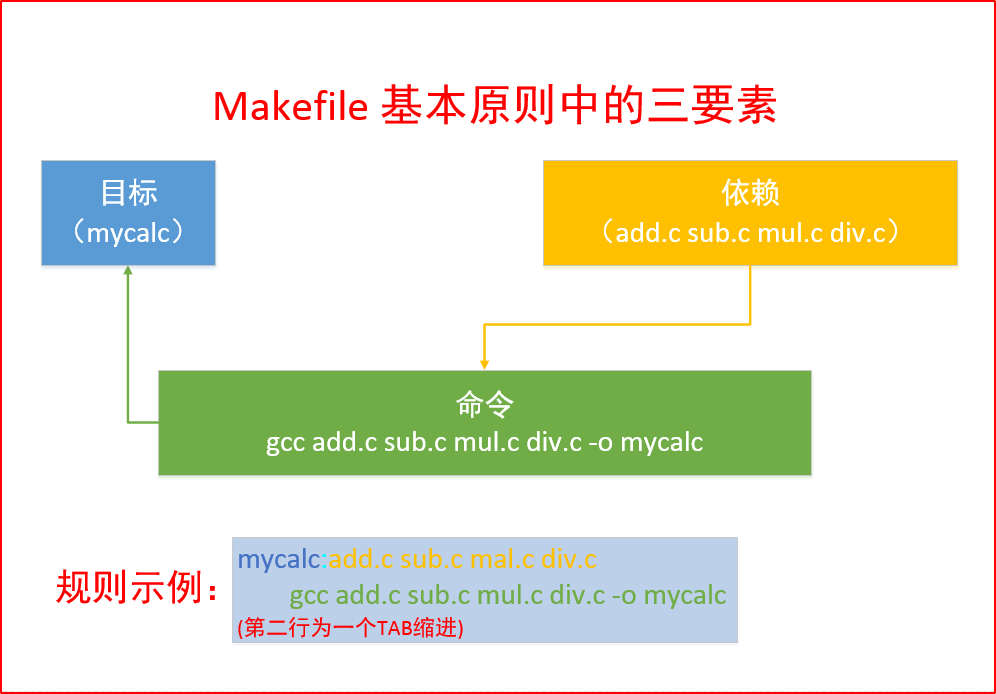
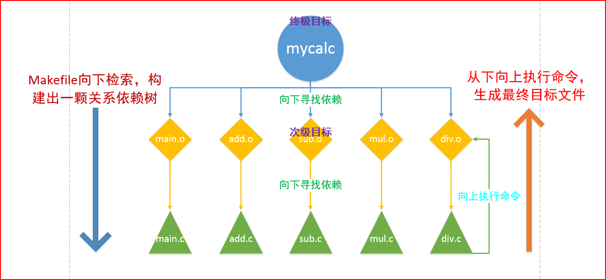
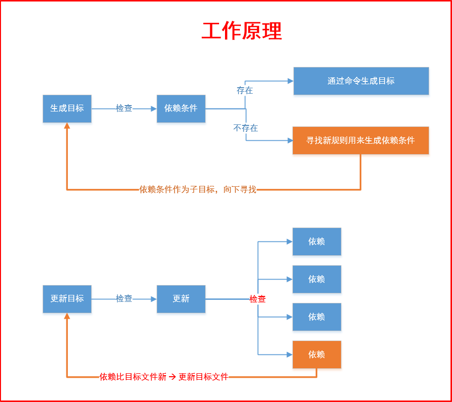

<!--
 * @Author: JohnJeep
 * @Date: 2020-04-23 20:37:04
 * @LastEditTime: 2020-06-01 21:53:47
 * @LastEditors: your name
 * @Description: GDB使用剖析
--> 

<!-- TOC -->

- [0.1. GDB调试](#01-gdb调试)
- [0.2. 内存相关](#02-内存相关)
- [0.3. makefile](#03-makefile)

<!-- /TOC -->

## 0.1. GDB调试
在进行GDB调试之前需要先打断点。

- `gcc xxx.c -g -o xxx.out` 使用 gdb 调试程序之前,必须使用 `-g` 或 `–ggdb`编译选项编译源文件。
- `gdb a.out` 启动GDB，其中 `a.out` 是带有调试信息的可执行文件
- `list(l)`  默认查看`10行` 程序代码
- `enter键` 执行上一次输入过的命令
- `l xxx.c: zz(或行号)` 查看 `xxx.c` 文件中的 `zz` 函数
- `break(b) main(或行号)`   在main函数处设置断点。  `break 20`   在 `20行` 处设置断点。
- `b 22 if i==10`  设置条件断点。在22行处，当 `i==10` 时设置一个断点。
  > 注意: 有循环体的时候，断点应设置在循环体的内部。在循环体(for、while等语句)的时候程序不会停。
- `info(i) break`  查看设置的断点信息内容


- 启动GDB
  - `start` 程序只运行一次就停止了
  - `run(r)`


- 调试程序
  - `next(n)    ` 单步执行程序，但不进入子函数内部
  - `step(s)    ` 单步执行程序，进入子函数内部
  - `continue(c)` 继续执行程序
  - `print（p）  `变量名: 查看指定变量值
  - `ptype 变量名` 查看变量的类型
  - `display 变量名` 在循环的时候实时追踪变量的值。 `display i`  追踪变量 `i` 的值
  - `undisplay 变量名的编号`  不追踪某个变量的值。首先查看不需要追踪变量的编号 `i(info) display` ，然后使用 `undisplay 变量名的编号` 去掉不用追踪的变量。
  - `u` 跳出单次循环，然后跳到循环后面的语句。
  - `finish` 从函数体内部跳出去。如果该函数体内部打的有断点，首先需要把断点删除，然后再跳出函数体
  - `del(d) 断点编号N` 删除当前编号为 N 的断点
  - `set var=value` 设置变量的值
  - `ni` 单步执行汇编指令，不进入子函数内部
  - `si` 单步执行汇编指令，进入子函数内部
- `quit(q)` 退出gdb


- `ctrl x a` 进入调试图形界面，再按同样的快捷键，退出调试图形化窗口。
- `ctrl x 1` 进入汇编调试图形界面。
- `ctrl x 2` 退出汇编调试图形化窗口。


## 0.2. 内存相关
- `back trace(bt)` 打印当前函数调用栈的所有信息
- `examine(x)` 查看内存地址中的值
  - `n` 是一个正整数，表示显示内存的长度，也就是说从当前地址向后显示几个地址的内容。 
  - `f` 按浮点数格式显示变量。  
  - `u` 从当前地址往后请求的字节数，如果不指定的话，GDB默认是4个bytes。b表示单字节，h表示双字节，w表示四字节，g表示八字节。


## 0.3. makefile
- 参考
  - [CMake 入门实战](https://www.hahack.com/codes/cmake/)
  - [CMake教程](https://blog.csdn.net/fan_hai_ping/article/details/42524205)
  - [在 linux 下使用 CMake 构建应用程序](https://www.ibm.com/developerworks/cn/linux/l-cn-cmake/index.html)
  - [CMake官网](http://www.cmake.org/)
  - [cmake常用命令](https://cmake.org/cmake/help/v2.8.8/cmake.html#section_Commands)
  - [Cmake大型项目设置指南](https://oldpan.me/archives/cmake-meta-project-use)
  - [CLoin与CMake详细教程](https://www.jetbrains.com/help/clion/quick-tutorial-on-configuring-clion-on-windows.html)
  - [VSCode运行多文件C++教程：使用CMake](https://blog.csdn.net/frostime/article/details/86756983)


- 记录编译记录的文件。
- 名称两种规则：全小写（makefile）或首字母大写（Makefile）
- 直接使用 `make` 指令，会生成Makefile文件中定义的最终目标文件。
- 使用 `make 自定义变量名`，会执行自定义变量名下面定义的规则指令。


- 三个基本要素
  - 目标
  - 依赖
  - 命令
<div align="center"> </div>
<div align="center"> </div>
<div align="center"> </div>


- 一个规则
- 两个函数。每个函数都有返回值
  - `src= $(wildcard ./*c)` 查找指定目录 `./` 下所有 `.c` 的文件，并将函数的返回值赋值给 src 变量
  - 匹配替换函数  `obj = $(patsubst ./%.c, ./%.o, $(src))` 将指定目录 `./` 下所有的 `.c` 替换为 `.o`文件


- 三个变量
  - 自定义变量
  - 自动变量
    - `$<` 规则中的第一个依赖
    - `$@` 规则中的目标
    - `$^` 规则中的所有依赖
  - 系统维护的变量(一般为大写字符) 
    - `CPPFLAGS` 预处理所需要的的选项。如：`-I`
    - `CFLAGS  ` 编译时使用的参数。`-Wall, -g, -c`
    - `LDFLAGS ` 链接库使用的选项。`-L -l(小写)`
    - `CC` 等于gcc


- 伪目标 `.PHONY` 
  - `.PHONY: clean`
  - `-` 表示当前指令执行不成功则忽略当前指令。


- 模式规则
    ```
    给相同的命令指定一个规则
    %.o: %c
        gcc -c $< -o $@
    ```


