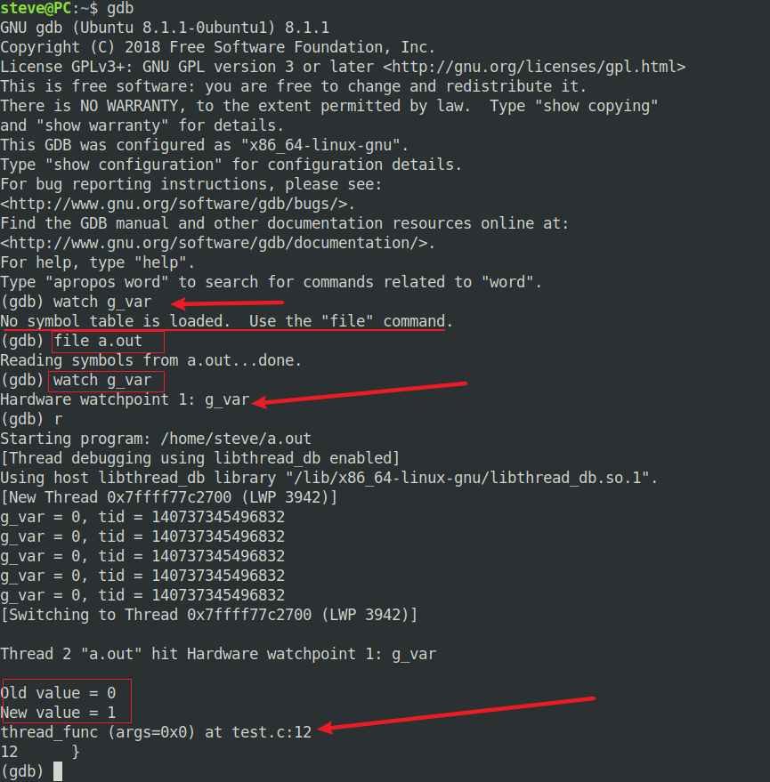
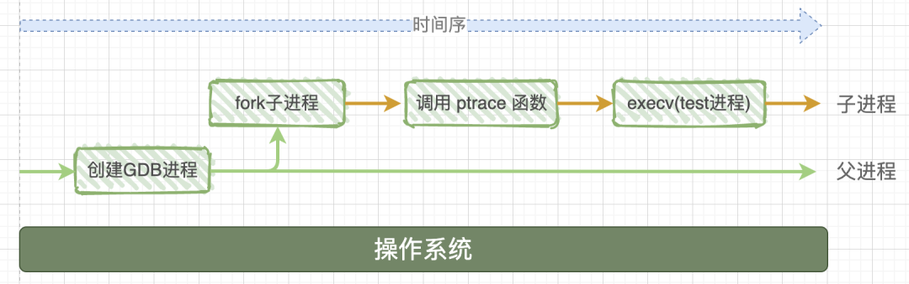

<!--
 * @Author: JohnJeep
 * @Date: 2020-04-23 20:37:04
 * @LastEditTime: 2021-11-30 01:15:40
 * @LastEditors: Windows10
 * @Description: GDB、Makefile使用剖析
--> 

<!-- TOC -->

- [1. 启动 GDB 打普通断点](#1-启动-gdb-打普通断点)
- [2. 调试程序](#2-调试程序)
- [3. TUI模式](#3-tui模式)
- [4. 调试多进程](#4-调试多进程)
- [5. 调试多线程](#5-调试多线程)
- [6. 查看内存](#6-查看内存)
- [7. Hardware watchpoint(硬件断点)](#7-hardware-watchpoint硬件断点)
- [8. 调试正在运行的程序](#8-调试正在运行的程序)
- [9. 设置动态库](#9-设置动态库)
- [10. GDB 反方向调试](#10-gdb-反方向调试)
- [11. 底层原理](#11-底层原理)
- [12. 参考](#12-参考)

<!-- /TOC -->

# 1. 启动 GDB 

启动 GDB

```sh
(gdb)  start 程序只运行一次就停止了
(gdb) run(r) 启动后运行到断点处
1. 使用 gdb 调试程序之前，必须使用 -g 或 –ggdb 编译选项编译源文件：gcc xxx.c -g -o xxx.out 
2. 直接启动可执行文件，其中 a.out 是带有调试信息的可执行文件
   gdb a.out   
3. 启动调试程序名后带参数的程序：
  gdb --args a.out  ini/hello.ini
  
  另外一种运行方式：先启动可执行文件，后面不带参数，然后再 GDB 里面设置参数项
    gdb b.out
    set args  ini/hello.ini
```

# 2. 常用命令

## list

`list` 查看源码中指定的行和函数，默认查看`10 行` 程序代码。命令后面可跟参数，指定查看的范围。

```
// 示例：
l xxx.c:func 查看 xxx.c 文件中的 func 函数
l xxx.c:100 从第 100 行开始查看 xxx.c 文件中内容
```

- `enter` 键执行上一次输入过的命令

## break

break 命令用来设置断点，缩写为 `b` 。

在进行GDB调试之前需要先打断点。GDB中的断点分为：普通断点、观察断点、捕捉断点，一般使用 `break` 打的断点称为普通断点，使用 `watch` 打的断点称为硬件断点，使用 `catch` 打的断点称为捕捉断点。

```
// 示例
break mian 在 main 函数处设置断点。  
break 20   在 20行 处设置断点。

// 设置条件断点
b 22 if i==10   在22行处，当 i==10 时设置一个断点。可以直接在某个文件的某个函数打断点，然后运行查看，多文件可以设置断点。

```

> 注意: 有循环体的时候，断点应设置在循环体的内部。在循环体(for、while等语句)的时候程序不会停。

- `next(n)    ` 单步执行程序，但不进入子函数内部
- `u` 跳出单次循环，然后跳到循环后面的语句。
- `step(s)    ` 单步执行程序，进入子函数内部
- `finish` 从函数体内部跳出去。如果该函数体内部打的有断点，首先需要把断点删除，然后再跳出函数体。
- `continue(c)` 继续执行程序
- `print(p) 变量名` 查看指定变量值
- `ptype 变量名` 查看变量的类型
- `display 变量名` 在循环的时候实时追踪变量的值。 `display i` 追踪变量 `i` 的值
- `undisplay 变量名的编号`  不追踪某个变量的值。首先查看不需要追踪变量的编号 `i(info) display` ，然后使用 `undisplay 变量名的编号` 去掉不用追踪的变量。
- `del(d) 断点编号N` 删除当前编号为 N 的断点
- `set var=value` 设置变量的值
- `quit(q)` 退出gdb
- `ni` 单步执行汇编指令，不进入子函数内部
- `si` 单步执行汇编指令，进入子函数内部

```
(gdb) bt：查看函数堆栈

(gdb) finish：退出函数

(gdb) shell 命令行：执行shell命令行

(gdb) show paths:查看程序运行路径

(gdb) cd 相当于shell的cd

(gdb)pwd 显示当前所在目录

(gdb)info program 来查看程序的是否在运行，进程号，被暂停的原因。

(gdb)clear 行号n：清除第n行的断点

(gdb)delete 断点号n：删除第n个断点

(gdb)disable 断点号n：暂停第n个断点

(gdb)enable 断点号n：开启第n个断点

(gdb)step：单步调试如果有函数调用，则进入函数；与命令 n 不同，n 是不进入调用的函数的
```


## dir

使用`directory`（或`dir`)命令设置源文件的查找目录。如果希望在gdb启动时，加载code的位置，避免每次在gdb中再次输入命令，可以使用gdb的`-d` 参数

```
// -q 为 quiet 的缩写
gdb -q a.out -d /search/code/some
```


## args

`args` 命令用来设置被调试程序的参数。有三种方式来指定。

```
// 语法
(gdb) set args 参数:指定运行时的参数
(gdb) show args：查看设置好的参数
```

第一种：

```
在启动GDB时，程序后面直接参数。
 gdb --args a.out  ini/hello.ini
```

第二种

```
先启动可执行文件，后面不带参数，然后再 GDB 里面设置参数项
gdb b.out
(gdb) set args  ini/hello.ini
```

第三种

```
在运行程序时，直接指定
(gdb) run  ini/hello.ini
```

## info

显示正在调试程序的通用命令。info 是通用命令，简写为 `i` 后面还要跟具体要显示的子命令（subcommands），这些子命令可以是 `args`，`registers` 等等，描述当前程序的命令。

```
// 语法
info subcommands

// 示例
(gdb) info files
Symbols from "/home/John/IOV/Server/HttpClient".
Local exec file:
        `/home/John/IOV/Server/HttpClient', file type elf64-x86-64.
        Entry point: 0x400840
        0x0000000000400200 - 0x000000000040021c is .interp
        0x000000000040021c - 0x000000000040023c is .note.ABI-tag
        0x0000000000400240 - 0x0000000000400298 is .hash
        0x0000000000400298 - 0x0000000000400430 is .dynsym
        0x0000000000400430 - 0x0000000000400697 is .dynstr
        0x0000000000400698 - 0x00000000004006ba is .gnu.version

//  查看设置的断点信息内容
info break
```

## show

显示 GDB 本身内部的信息，像 `version`，`environment`，`user` 等等。语法同 `info` 命令一样。

```
// 语法
show subcommands

(gdb) show version
GNU gdb (GDB) Red Hat Enterprise Linux (7.2-60.el6)
Copyright (C) 2010 Free Software Foundation, Inc.
License GPLv3+: GNU GPL version 3 or later <http://gnu.org/licenses/gpl.html>
This is free software: you are free to change and redistribute it.
There is NO WARRANTY, to the extent permitted by law.  Type "show copying"
and "show warranty" for details.
This GDB was configured as "x86_64-redhat-linux-gnu".
For bug reporting instructions, please see:
<http://www.gnu.org/software/gdb/bugs/>.
```

官方参考：https://sourceware.org/gdb/onlinedocs/gdb/Help.html

## help

help 命令查看 GDB 的帮助信息。 帮助手册是学习 GDB 最权威、最好的资料，需要仔细研磨，但是常常被大多数人给遗忘了，去网上搜索各种各样的资料。

1. `help`命令后面不加任何参数，得到 GDB 所有命令，而这些命令按照不同的功能分为几大类。

```
(gdb) help
List of classes of commands:

aliases -- Aliases of other commands
breakpoints -- Making program stop at certain points
data -- Examining data
files -- Specifying and examining files
internals -- Maintenance commands
obscure -- Obscure features
running -- Running the program
stack -- Examining the stack
status -- Status inquiries
support -- Support facilities
tracepoints -- Tracing of program execution without stopping the program
user-defined -- User-defined commands

Type "help" followed by a class name for a list of commands in that class.
Type "help all" for the list of all commands.
Type "help" followed by command name for full documentation.
Type "apropos word" to search for commands related to "word".
Command name abbreviations are allowed if unambiguous.
```

2. 查看某个命令的具体用法，`help` 后面跟需要查询的命令。

   ```
   // 查看 break 命令帮助信息
   (gdb) help break
   Set breakpoint at specified line or function.
   break [LOCATION] [thread THREADNUM] [if CONDITION]
   LOCATION may be a line number, function name, or "*" and an address.
   If a line number is specified, break at start of code for that line.
   If a function is specified, break at start of code for that function.
   If an address is specified, break at that exact address.
   With no LOCATION, uses current execution address of the selected
   stack frame.  This is useful for breaking on return to a stack frame.
   
   THREADNUM is the number from "info threads".
   CONDITION is a boolean expression.
   
   Multiple breakpoints at one place are permitted, and useful if their
   conditions are different.
   
   Do "help breakpoints" for info on other commands dealing with breakpoints.
   
   ```

   官网地址：https://sourceware.org/gdb/onlinedocs/gdb/Help.html

# 3. TUI 
TUI（Text User Interface）进行交互式的源码调试。

```
gdb program -tui
```

终端执行上面这条命令后，利用图形的方式调试 `program` 可执行程序。

- TUI模式下，总共有4种窗口
  - 命令窗口
  - 源码窗口：可以使用 `PageUp`，`PageDown` 和4个方向键来查看源码。
  - 汇编窗口
  - 寄存器窗口
- `ctrl + x + a` 进入调试图形界面，再按同样的快捷键，退出调试图形化窗口。
- `ctrl + x + 1` 进入汇编调试图形界面，再按一次退出汇编调试图形界面。
- `ctrl + x + 2` 显示其中2个窗口，数字 `2` 表示除了显示命令窗口外还可以同时再显示2个窗口。连续按下 `Ctrl+x+2` 就会出现这三个窗口的两两组合。
- TUI模式下有时显示会出现混叠现象，此时按下 `Ctrl+l`（是小写的L）进行刷新。
- 断点显示的几种状态
  - `B` 表示断点处代码已经运行至少一次
  - `b` 表示断点处代码还没有运行到
  - `+` 表示该断点处于enable状态
  - `-` 表示该断点处于disable状态

# shell

gdb 中执行 shell 命令。在命令前添加 shell 关键字即可。

```
(gdb) shell pwd
/home/John/SrcCompile/Src
```


# layout

layout：用于分割窗口，可以一边查看代码，一边测试。主要有以下几种用法：

- layout src：显示源代码窗口
- layout asm：显示汇编窗口
- layout regs：显示源代码/汇编和寄存器窗口
- layout split：显示源代码和汇编窗口
- layout next：显示下一个layout
- layout prev：显示上一个layout
- Ctrl + L：刷新窗口
- Ctrl + x，再按1：单窗口模式，显示一个窗口
- Ctrl + x，再按2：双窗口模式，显示两个窗口
- Ctrl + x，再按a：回到传统模式，即退出layout，回到执行layout之前的调试窗口。


# 4. 调试多进程

gdb 追踪多个分支（父子进程）
- `set follow-fork-mode child`  追踪子进程
- `set follow-fork-mode parent` 追踪父进程


# 指定源码

编译好的程序文件，放到了另外一台机器上进行调试，或者你的源码文件全都移动到了另外一个目录，怎么办呢？当然你还可以使用前面的方法添加源码搜索路径，也可以使用`set substitute-path from to`将原来的路径替换为新的路径。

gdb在调试时默认会对两个路径进行搜索：

1. 编译的时候的源文件路径
2. 当前gdb的路径（即在gdb种执行pwd显示的路径，可以用cd改变）

```
默认搜索路径 $cdir:$cwd
cwd(current working directory): gdb 当前工作路径
cdir: 源码被编译成目标文件的路径

```


- 编译路径
- 源码路径
- 可执行文件路径
- GDB 工作路径

源码路径 在 gdb 启动后开始生效，默认值并不是空，而是 `$cdir:$cwd`，这又是什么鬼？其中的 `$cdir` 叫做编译目录，是代码在编译时记录到程序中的，`$cwd` 表示当前的调试目录，可以通过 cd 命令来修改，要注意这个 cd 修改的是 gdb 会话中的当前目录，不会影响启动 gdb 前文件系统中的目录位置。

```
// 终端下查看源码路径
[John@KF-CFT-AP2 Src]$ readelf ~/IOV/Server/IOV-HttpClient -p .debug_str

// 查看源码路径
(gdb) show dir    
Source directories searched: $cdir:$cwd

// 设置源码的路径为 xxxx
(gdb) dir   xxxx   

// 查看源代码文件名和编译目录
(gdb) i source
	Current source file is ../../Src/FrameWorkServer.cpp
  Compilation directory is /home/John/SrcCompile/Src/FrameWorkServer/Makefile/Debug
  Located in /home/John/SrcCompile/Src/FrameWorkServer/Src/FrameWorkServer.cpp
  Contains 65 lines.
  Source language is c++.
  Compiled with DWARF 2 debugging format.
  Does not include preprocessor macro info.

// 替换源码目录，将原来路径下的 src 替换为 xxx/xxxx/dest
(gdb) set substitute-path src xxx/xxxx/dest

```


```shell
 
```


原文链接：https://blog.csdn.net/albertsh/article/details/107437084


# 5. 调试多线程

GDB 多线程调试的术语
- all-stop mode      全停模式
- single-stepping    单步执行
- scheduler-locking  调度锁
- schedule-multiple  多进程调度
- record mode        记录模式
- replay mode        回放模式

使用 GDB 调试多线程程序时，默认的调试模式为：一个线程暂停运行，其它线程也随即暂停；一个线程启动运行，其它线程也随即启动。要知道，这种调试机制确实能帮我们更好地监控各个线程的“一举一动”，但并非适用于所有场景。

一些场景中，我们可能只想让某一特定线程运行，其它线程仍维持暂停状态。要想达到这样的效果，就需要借助 `set scheduler-locking` 命令。 帮我们将其它线程都“锁起来”，使后续执行的命令只对当前线程或者指定线程有效，而对其它线程无效。

set scheduler-locking 命令的语法格式如下：
```
(gdb) set scheduler-locking mode
```

其中，参数 mode 的值有 3 个，分别为 off、on 和 step，它们的含义分别是：

- off：不锁定线程，任何线程都可以随时执行，这是默认值；
- on：锁定线程，只有当前线程或指定线程可以运行；
- step：当单步执行某一线程时，其它线程不会执行，同时保证在调试过程中当前线程不会发生改变。但如果该模式下执行 continue、until、finish 命令，则其它线程也会执行，并且如果某一线程执行过程遇到断点，则 GDB 调试器会将该线程作为当前线程。


常用调试的命令
- `show scheduler-locking`     显示线程的scheduler-locking状态
- `set scheduler-locking on`    调试加锁当前线程，停止所有其他线程
- `gdb attach pid` 让进程号为 PID 的进程停止。
- `info thread` 查看当前进程的所有线程信息。
- `thread <ID> (或 t ID)` 切换到指定的线程 ID 号进行调试。


参考
- [GDB scheduler-locking 命令详解](https://www.cnblogs.com/pugang/p/7698772.html)


# 6. 查看内存

- `back trace(bt)` 打印当前函数调用栈的所有信息
- `examine(x)` 查看内存地址中的值。比如，使用 `bt` 查看不了堆栈信息时，可用该命令指定多少地址以什么样的格式显示堆栈中的数据。
  - `n` 是一个正整数，表示显示内存的长度，也就是说从当前地址向后显示几个地址的内容。 
  - `f` 按浮点数格式显示变量。  
  - `u` 从当前地址往后请求的字节数，如果不指定的话，GDB默认是4个bytes。b表示单字节，h表示双字节，w表示四字节，g表示八字节。


# 7. Hardware watchpoint(硬件断点)

普通断点：需要程序运行到哪行，你就在哪行设置断点，然后等程序运行到断点处可以单步执行，查看内存变量，遇到多个位置修改同一个变量时，并且要查看是谁改变了变量的时候，就要设置多个断点来进行查看。

硬件断点也叫观察断点。观察断点就是为了要监控某个变量或者表达式的值，通过值的变化情况来判断程序的执行过程是否存在异常或者Bug。只有某个变量或者表达式的值发生了改变，程序才会停止执行。相比普通断点，观察断点不需要我们预测变量（表达式）值发生改变的具体位置。

用法 
```
(gdb) watch var_name
```

> 在使用 `watch var_name` 命名之前，需要使用 `file a.out`，加载 a.out 中的 `symbol table`，只有符号表加载成功后，才能打硬件断点。



```c
#include <stdio.h>
#include <pthread.h>
#include <unistd.h>

int g_var = 0;

void* thread_func(void* args)
{
    sleep(5);
    g_var = 1;
}

int main()
{
    int i = 0;
    pthread_t tid = 0;

    pthread_create(&tid, NULL, thread_func, NULL);

    for(i=0; i<10; i++) {
        printf("g_var = %d, tid = %ld\n", g_var, tid);
        sleep(1);
    }
}

```


# 8. 调试正在运行的程序

GDB 可以对正在执行的程序进行调度，它允许开发人员中断程序并查看其状态，之后还能让这个程序正常地继续执行。

1、 查看可执行程序的进程号 PID:  `ps aux | grep xxx.out`

2、 attach 可执行程序的进程 PID: `gdb attach pid`

> 另一种方式：gdb -p pid或程序名

3、 当attach进程时，会停止进程的运行，这时使进程继续运行需要使用 continue/c 命令。

4、 当程序停止时，用其它的命令查看其它信息
  - `bt` 查看堆栈信息 
  - `b(break)` 设置断点 
  - `watch var` 监控变量 var 的值
  - `info thread` 查看当前进程的所有线程信息
  - `info proc` 显示进程信息
  - `info reg` 显示寄存器信息

# 9. 设置动态库

```
set solib-search-path  动态库路径
```

# 10. GDB 反方向调试

GDB7.0 以上的平台开始支持反向调试需要开启记录，调试结束关闭记录，只有在开启记录之后才能完全正常的进行反向调试。

```sh
(gdb) record        开启记录
(gdb) record stop   关闭记录
(gdb) reverse-next  向上走一步

set exec-direction [forward | reverse]   设置程序运行方向，能够像正常调试方式一样反向调试
```


# edit

gdb 调试模式下对源码进行编辑，使用 `edit` 命令。


# 11. 底层原理

ptrace 系统函数是 Linux 内核提供的一个用于进程跟踪的系统调用，通过它，一个进程(gdb)可以读写另外一个进程(test)的指令空间、数据空间、堆栈和寄存器的值。而且gdb进程接管了test进程的所有信号，也就是说系统向test进程发送的所有信号，都被gdb进程接收到，这样一来，test进程的执行就被gdb控制了，从而达到调试的目的。

gdb底层的调试机制是怎样的？
> 系统首先会启动gdb进程，这个进程会调用系统函数fork()来创建一个子进程，这个子进程做两件事情：
> 1. 调用系统函数ptrace；
> 2. 通过execc来加载、执行可执行程序 test，那么test程序就在这个子进程中开始执行了。




# 12. 参考

- [GDB 官方英文文档](https://www.gnu.org/software/gdb/)
- [CS-MCU GDB tutorial](https://www.cs.cmu.edu/~gilpin/tutorial/)
- [用图文带你彻底弄懂GDB调试原理](https://mp.weixin.qq.com/s?__biz=MzA3MzAwODYyNQ==&mid=2247483895&idx=1&sn=ba35d1823c259a959b72a310e0a92068&scene=21#wechat_redirect)
- [100个gdb小技巧](https://wizardforcel.gitbooks.io/100-gdb-tips/content/set-watchpoint.html)
- [线程的查看以及利用gdb调试多线程](https://blog.csdn.net/zhangye3017/article/details/80382496)
- [YouTube: MyGeekAdventures 临场演示如何使用GBD去调试代码](https://www.youtube.com/watch?v=xQ0ONbt-qPs&list=PL5Py8jKS3yHOco9op3r_6JN2IKmopTt7s) <font color=red>： 重点看 </font>

