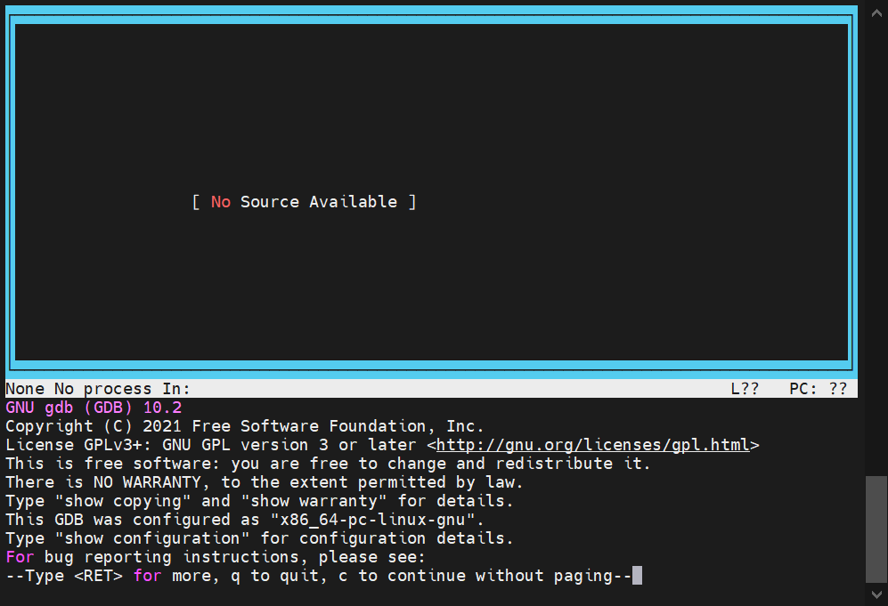

<!--

 * @Author: JohnJeep
 * @Date: 2020-04-23 20:37:04
 * @LastEditTime: 2022-01-28 19:33:18
 * @LastEditors: DESKTOP-0S33AUT
 * @Description: GDB 用法笔记
--> 

<!-- TOC -->

- [1. 简介](#1-简介)
- [2. 安装 GDB](#2-安装-gdb)
  - [2.1. 在线安装](#21-在线安装)
  - [2.2. 源码安装](#22-源码安装)
- [3. Invoking GDB](#3-invoking-gdb)
- [4. Shell Commands](#4-shell-commands)
- [5. Logging Output](#5-logging-output)
- [6. 常用命令](#6-常用命令)
  - [6.1. run](#61-run)
    - [6.1.1. arguments](#611-arguments)
    - [6.1.2. environment](#612-environment)
    - [6.1.3. working directory](#613-working-directory)
    - [6.1.4. standard input and output](#614-standard-input-and-output)
  - [6.2. start](#62-start)
  - [6.3. starti](#63-starti)
  - [6.4. continue](#64-continue)
  - [6.5. quit](#65-quit)
  - [6.6. list](#66-list)
  - [6.7. break](#67-break)
  - [6.8. delete](#68-delete)
  - [6.9. next](#69-next)
  - [6.10. next into](#610-next-into)
  - [6.11. step](#611-step)
  - [6.12. step into](#612-step-into)
  - [6.13. finish](#613-finish)
  - [6.14. until](#614-until)
  - [6.15. print](#615-print)
  - [6.16. ptype](#616-ptype)
  - [6.17. display](#617-display)
  - [6.18. undisplay](#618-undisplay)
  - [6.19. set](#619-set)
  - [6.20. call](#620-call)
  - [6.21. clear](#621-clear)
  - [6.22. dir](#622-dir)
  - [6.23. info](#623-info)
  - [6.24. show](#624-show)
  - [6.25. help](#625-help)
  - [6.26. Others](#626-others)
- [7. TUI](#7-tui)
  - [7.1. TUI 中的断点](#71-tui-中的断点)
  - [7.2. 快捷键](#72-快捷键)
- [8. Examining Source Files](#8-examining-source-files)
  - [8.1. 查看源码](#81-查看源码)
  - [8.2. 编辑源码](#82-编辑源码)
  - [8.3. 改变源码路径](#83-改变源码路径)
- [9. 调试多进程](#9-调试多进程)
- [10. 调试多线程](#10-调试多线程)
- [11. 查看内存](#11-查看内存)
  - [11.1. backtrace](#111-backtrace)
  - [11.2. examine](#112-examine)
- [12. Watchpoints](#12-watchpoints)
- [13. Catchpoints](#13-catchpoints)
- [14. 调试正在运行的程序](#14-调试正在运行的程序)
- [15. 设置动态库](#15-设置动态库)
- [16. Reverse](#16-reverse)
- [17. 底层原理](#17-底层原理)
- [18. 参考](#18-参考)

<!-- /TOC -->

# 1. 简介

GDB 是什么？

GDB 全称“GNU symbolic debugger”，从名称上不难看出，它诞生于 GNU 计划（同时诞生的还有 GCC、Emacs 等），是 Linux 下常用的程序调试器。发展至今，GDB 已经迭代了诸多个版本，当下的 GDB 支持调试多种编程语言编写的程序，包括 C、C++、Go、Objective-C、OpenCL、Ada 等。实际场景中，GDB 更常用来调试 C 和 C++ 程序。一般来说，GDB主要帮助我们完成以下四个方面的功能：

1. 启动你的程序，可以按照你的自定义的要求随心所欲的运行程序。
2. 在某个指定的地方或条件下暂停程序。
3. 当程序被停住时，可以检查此时你的程序中所发生的事。
4. 在程序执行过程中修改程序中的变量或条件，将一个bug产生的影响修正从而测试其他bug。

**简单的讲，GDB 就是一个程序，只不过这个程序通过一些手段可以去调试其它的程序。** 


# 2. 安装 GDB

## 2.1. 在线安装

```
yum install gdb
```


## 2.2. 源码安装

```
1. 源码解压
  [root@KF-CFT-AP2 ~]# tar -zcvf gdb-10.2.tar.gz
2. 进入解压目录
  [root@KF-CFT-AP2 ~]# cd gdb-10.2
3. 设置配置，configure 后面可设置参数和安装路径，
  [root@KF-CFT-AP2 gdb-10.2]# ./configure
  
  配置参数项
  configure [--help]
            [--prefix=dir]  自定义配置路径
            [--exec-prefix=dir]
            [--srcdir=dirname]
            [--target=target]
            --enable-tui=yes  配置 TUI模式
            --with-ncurses    带 ncurses 库
            --with-python=yes 带 python 脚本
            
4. 编译，执行make
  [root@KF-CFT-AP2 gdb-10.2]# make
5. 安装
   [root@KF-CFT-AP2 gdb-10.2]# make install
6. 将编译生成的 gdb 可执行文件考到 /usr/bin/
   [root@KF-CFT-AP2 gdb-10.2]# cp gdb/gdb /usr/bin/gdb
6. 检查是否安装成功，终端下执行
  [root@KF-CFT-AP2 ~]$ gdb -v
  GNU gdb (GDB) 10.2
  Copyright (C) 2021 Free Software Foundation, Inc.
  License GPLv3+: GNU GPL version 3 or later <http://gnu.org/licenses/gpl.html>
  This is free software: you are free to change and redistribute it.
  There is NO WARRANTY, to the extent permitted by law.
```

# 3. Invoking GDB

GDB 是一个非常重要的调试工具，要用 GDB，首先要知道如何去启动 GDB。

通过运行 gdb 程序来调用 GDB，一旦开始了，GDB 读来自 terminal 的命令，直到你告诉它要退出，它才退出。

下面是几种启动 GDB 的方式：

启动前提：

```
使用 gdb 调试程序之前，必须使用 -g 或 –ggdb 编译选项编译源文件：gcc xxx.c -g -o xxx.out 
```

第一种：直接启动可执行文件，gdb 后面跟一个参数：可执行文件。其中 a.out 是带有调试信息的可执行文件

```sh
[root@KF-CFT-AP2 SrcCompile]$ gdb a.out
GNU gdb (GDB) 10.2
Copyright (C) 2021 Free Software Foundation, Inc.
License GPLv3+: GNU GPL version 3 or later <http://gnu.org/licenses/gpl.html>
This is free software: you are free to change and redistribute it.
There is NO WARRANTY, to the extent permitted by law.
Type "show copying" and "show warranty" for details.
This GDB was configured as "x86_64-pc-linux-gnu".
Type "show configuration" for configuration details.
For bug reporting instructions, please see:
<https://www.gnu.org/software/gdb/bugs/>.
Find the GDB manual and other documentation resources online at:
    <http://www.gnu.org/software/gdb/documentation/>.

For help, type "help".
Type "apropos word" to search for commands related to "word"...
Reading symbols from a.out...
```

gdb 后面不跟选项字段时，启动后默认会打印 gdb 的描述信息，比如：著作权、法律、证书等。每次启动都打印这些有点啰嗦，让启动时不打印这些信息，后面跟 `--silent` 或 `--quiet/-q` 等选项。

```sh
[root@KF-CFT-AP2 SrcCompile]$ gdb a.out  --silent
Reading symbols from a.out...
(gdb)

[root@KF-CFT-AP2 SrcCompile]$ gdb a.out  --quiet
Reading symbols from a.out...
(gdb)

[root@KF-CFT-AP2 SrcCompile]$ gdb a.out -q
Reading symbols from a.out...
(gdb)
```

第二种：启动调试程序名后带参数的程序

```
gdb --args a.out  ini/hello.ini
```

第三种：先启动可执行文件，后面不带参数，然后再 GDB 里面设置参数项

```sh
(gdb) gdb a.out
(gdb) set args  ini/hello.ini
```

第四种：启动可执行文件和指定一个 core 文件

```
(gdb) gdb a.out core.3256
```

# 4. Shell Commands  

在 GDB 调试的过程中，需要执行外部的 shell 命令，但同时又不想退出当前 GDB 或悬挂当前GDB 的情况下，要怎么去执行 Shell 命令。

有 2 种方式去实现。一种在命令前添加 shell 关键字即可；另一种在命令前加 `!`，表示去执行外部的 shell 命令。 

```
(gdb) shell pwd
/home/John/SrcCompile

(gdb) !pwd
/home/John/SrcCompile
```

make

GDB 程序中可以直接执行 make 命令，不需要用 `shell make` 这样的格式。

```
格式：
  make make-args   执行 make 程序，后面指定个参数，参数为可选项。
  
 (gdb) make
 gdb) make clean
```

# 5. Logging Output  

将 GDB的命令保存到文件中，可用 GDB 的 logging 命令。

```
// Enable or disable logging.
set logging enabled [on|off]

// Change the name of the current logfile. The default logfile is gdb.txt.
set logging file file

// By default, gdb will append to the logfile. Set overwrite if you want set logging enabled on to overwrite the logfile instead.
set logging overwrite [on|off]

// By default, gdb output will go to both the terminal and the logfile. Setredirect if you want output to go only to the log file.
set logging redirect [on|off]

// By default, gdb debug output will go to both the terminal and the logfile. Setdebugredirect if you want debug output to go only to the log file.
set logging debugredirect [on|off]

// Show the current values of the logging settings
show logging
```

# 6. 常用命令

## 6.1. run

`run` 命令表示启动程序，简写 `r`。若程序没有打断点，执行命令后程序运行完了就直接退出调试过程。

运行 `run` 的前提确：确保你的操作系统环境支持**进程的执行环境**，通常情况下，操作系统都支持，但也有特例。

GDB 程序中执行 `run` 命令，GDB 会创建一个子进程，让创建的子进程运行你的程序。

开始执行 `run` 命令之前，需要在 GDB 中加载你要调试的程序信息，这些信息也可在程序运行后进修改，但是修改后的信息只在下次程序开始后生效。因为你要调试程序的执行受到它从父进程（GDB程序）那里接收到的某些信息的影响。而这些信息被划分为下面的 4 大类：

### 6.1.1. arguments  

调试程序的参数。有些程序运行带有参数项，在执行 `run` 命令开始前，需要指定参数项才能让程序运行起来。

`set args` 命令用来设置被调试程序的参数。有三种方式来指定。

```
// 指定运行时的参数
(gdb) set args 参数
```

第一种：

```
在启动GDB时，程序后面直接参数。
 gdb --args a.out  ini/hello.ini
```

第二种

```
先启动可执行文件，后面不带参数，然后再 GDB 里面设置参数项
gdb b.out
(gdb) set args  ini/hello.ini
```

第三种

```
在运行程序时，直接指定
(gdb) run  ini/hello.ini
```

显示被调试程序设置的参数。

```
(gdb) show args
Argument list to give program being debugged when it is started is "ini/hello.ini".
(gdb)
```

### 6.1.2. environment

调试程序的环境变量。你要调试程序的环境通常继承自 GDB 程序。你也可以用 `set environmen `和 `unset environmen` 命令来改变你要调试程序的环境。

- path directory  

  将目录名 `directory` 添加到 PATH 环境变量（可执行文件的搜索路径）的前面，环境变量将值传递给你要调试的程序，而 gdb 程序使用的 PATH 值不会更改。你也可以同时指定多个目录名（directory  ），用空格或操作系统依赖的分隔符（‘:’ on Unix, ‘;’on MS-DOS and MS-Windows  ）分割开。 

- show paths  

  显示可执行文件的搜索路径列表。

  ```
  (gdb) show paths
  Executable and object file path: /usr/local/git/bin:/usr/local/gcc-4.9.4/bin:/usr/jdk1.8.0_102/bin:/usr/lib64/qt-3.3/bin:/usr/local/bin:/bin:/usr/bin:/usr/local/sbin:/usr/sbin:/sbin:/opt/puppetlabs/bin:/home/John/bin
  (gdb)
  ```

- show environment [varname]  

  打印你给调试程序设置的环境变量值`varname` 。若没有给设定的值 `varname`，将会打印你的调试程序中所有的环境变量和名字。`environment` 可简写为 `env`。

  ```
  (gdb) show env
  ```

- set environment varname [=value]  

  设置环境变量的名字等于某个值 `value`。这个值会改变你要调试程序的环境变量，但不会改变 GDB 程序自身的环境变量。若 `value` 值被忽略，则变量名将被设置为 `null`。

  ```
  // 告诉被调试的程序，当运行 run 命令时，环境变量 kk 的值为 foo
  (gdb) set env kk=foo
  ```

- unset environment varname  

  从被调试程序的环境变量表中移除环境变量 `varname`。

### 6.1.3. working directory

调试程序的工作目录。用 `set cwd` 命令设置你要调试程序的工作路径。没有设置工作路径，若用正向调试（native debugging），你调试的程序继承自 GDB 程序的工作路径；若用远程调试，你调试的程序继承自远程服务器的工作路径。

- set cwd [directory]  

  设置子程序的工作路径为 `directory`。若没有指定参数`directory`，该命令将重置以前设置的路径，并将路径设置一个空的状态。设置的路径不会影响 GDB 程序的工作路径，只会影响下次你启动的子进程（inferior）。

  > ~ 表示 `home` 目录。

- show cwd   

  current working directory，简写为 cwd。`show cwd` 命令表示显示子进程（inferior）的工作路径。若没有指定子进程的工作路径，子进程默认继承自 GDB 程序的工作路径。

  ```
  (gdb) set cwd ~
  (gdb) show cwd
  Current working directory that will be used when starting the inferior is "~".
  ```

- cd [directory]  

  设置 GDB 程序的工作路径为某个目录 `directory`。若没有指定参数 `directory` 值，则 `directory` 参数默认使用 `~` 路径。

  ```
  // gdb 中切换到 xxx 目录
  (gdb) pwd
  Working directory /home/John/SrcCompile.
  (gdb) cd
  Working directory /home/John.
  (gdb) pwd
  Working directory /home/John.
  (gdb) cd IOV/Server/
  Working directory /home/John/IOV/Server.
  (gdb)
  ```

- pwd  

  打印 GDB 程序的工作目录。

  ```
  // 显示当前所在目录
  (gdb) pwd
  Working directory /home/John/SrcCompile.
  ```

注意：调试的程序在 debug 的过程中，很难找到程序当前的工作路径，因为调试程序的工作路径在改变。若操作系统的 GDB 支持 `info proc` 命令，则用该命令去找到被调试者（debuggee）的当前工作路径。

```
(gdb) info proc
process 22593
cmdline = '/home/zhoush/SrcCompile/a.out'
cwd = '/home/zhoush/SrcCompile'
exe = '/home/zhoush/SrcCompile/a.out'
(gdb)
```


### 6.1.4. standard input and output

调试程序的 input/output。你要调试的程序通常用相同的标准输入和标准输出。你也可以在 `run` 命令行中重定向输入和输出，也可以使用 `tty` 命令为程序设置其他的设备。

执行 GDB 程序中执行 `run` 命令。

```sh
(gdb) run
```


## 6.2. start

`start` 命令表示启动程序时，在程序的 `main` 函数处设置一个临时断点，然后再调用 `run` 命令。

```bash
(gdb) start
Temporary breakpoint 1 at 0x400877: file test.cpp, line 10.
Starting program: /home/John/SrcCompile/a.out

Temporary breakpoint 1, main (argc=1, argv=0x7fffffffe4c8) at test.cpp:10
10          int a = 10;xxxxxxxxxx (gdb)  start (gdb) startTemporary breakpoint 1 at 0x400877: file test.cpp, line 10.Starting program: /home/John/SrcCompile/a.outTemporary breakpoint 1, main (argc=1, argv=0x7fffffffe4c8) at test.cpp:1010          int a = 10;
```

## 6.3. starti

`starti` 表示在程序开始执行的第一条指令处设置一个临时断点，然后调用 `run`命令。

```bash
(gdb) starti
Starting program: /home/John/SrcCompile/a.out

Program stopped.
0x000000304c001420 in _start () from /lib64/ld-linux-x86-64.so.2
(gdb)
```

## 6.4. continue

 继续执行程序，简写 `c`。

```
(gdb) continue
```

## 6.5. quit

`quit` 表示从 GDB 调试程序中退出，简写 `q`。执行快捷键 `Ctrl-d` 也能退出 GDB 程序。

```
(gdb) quit
```


## 6.6. list

`list` 查看源码中指定的行和函数，默认查看`10 行` 程序代码，缩写为 `l`。命令后面可跟参数，指定查看的范围。

```
list 从当前位置开始处，打印 10 行源码

list linenum   以 linenum 行为中心行，开始打印源码
  
list function  以 function 函数处为中心行，开始打印源码

list -  在上一次打印行的最后一行处，往前面开始打印源码，- 后面可跟行号或函数名

list +  在上次打印行之后开始打印源码，- 后面可跟行号或函数名

list num1,num2  指定位置，打印 num1 到 num2 之间的源码 
  
```

用 `set listsize` 命令改变默认打印源码的行数。

```
set listsize count      设置默认打印 count 行
		set listsize 20     改为默认打印 20 行
		
set listsize unlimited  默认打印的行数没有限制
```

```
show listsize   显示 list 命令默认打印的行数

(gdb) show listsize
Number of source lines gdb will list by default is 10.
```

指定行的具体位置去打印源码，源文件名与源码位置之间使用冒号（:）分隔

```
list -offset   参数 offset 为偏移量，表明是向前还是向后打印，从上一次打印的最后一行处开始算
list +offset  

list filename:function
	list xxx.c:func 查看 xxx.c 文件中的 func 函数
	
filename:linenum	
  list xxx.c:100 从第 100 行开始查看 xxx.c 文件中内容
```


## 6.7. break

break 命令用来设置断点，缩写为 `b` 。

在进行GDB调试之前需要先打断点。GDB中的断点分为：普通断点、观察断点、捕捉断点，一般使用 `break` 打的断点称为普通断点，使用 `watch` 打的断点称为硬件断点，使用 `catch` 打的断点称为捕捉断点。

```
// 示例
break mian 在 main 函数处设置断点。  
break 20   在 20行 处设置断点。

// 设置条件断点
b 22 if i==10   在22行处，当 i==10 时设置一个断点。可以直接在某个文件的某个函数打断点，然后运行查看，多文件可以设置断点。

```

注意: 有循环体的时候，断点应设置在循环体的内部。在循环体(for、while等语句)的时候程序不会停。

## 6.8. delete

删除指点的断点，参数必须是断点编号，若不指定编号，删除所有的断点。简写为 `del`。

```
// 删除当前编号为 N 的断点，N为数字
(gdb) del N
```

其它相关的命令

```
(gdb)disable 断点号n：暂停第n个断点
(gdb)enable 断点号n：开启第n个断点
```


## 6.9. next

单步执行命令，简写为 `n`。单步执行到有函数的位置时，**不进入到函数内部**，直接跳过去执行下条指令。

```sh
用法
  1. 单步执行一次：n 
  2. 单步执行多次，N表示重复的次数：n [N]
  
(gdb)
(gdb) l
1       #include <iostream>
2       #include <stdlib.h>
3
4       #include <unistd.h>
5
6       using namespace std;
7
8       int main(int argc, char *argv[])
9       {
10          int a = 10;
(gdb)
11          int b = 20;
12          int x = a + b;
13          cout << x << endl;
14
15          return 0;
16      }
(gdb)
Line number 17 out of range; test.cpp has 16 lines.
(gdb) b 10
Breakpoint 1 at 0x400877: file test.cpp, line 10.
(gdb) r
Starting program: /home/John/SrcCompile/a.out

Breakpoint 1, main (argc=1, argv=0x7fffffffe4c8) at test.cpp:10
10          int a = 10;
(gdb) p a
$1 = 0
(gdb) n
11          int b = 20;
(gdb) p a
$2 = 10
(gdb) n 2
13          cout << x << endl;
(gdb) p x
$3 = 30
```

## 6.10. next into

`nexti` 全名为 `next into` ，表示单步汇编调试指令，简写为 `ni`。单步执行到有函数的位置时，**跳过函数内部**，然后再继续一步一步的执行指令。

```
用法
  1. 单步执行一次汇编指令：ni
  2. 单步执行多次汇编指令：ni [N]
```


## 6.11. step

单步调试命令，简写为 `s`。单步执行到有函数的位置时，**进入函数内部**继续一步一步的执行指令。

```
用法：
  1. 单步执行一次：s
  2. 单步执行多次 N 条指令：s [N]
```

## 6.12. step into

`stepi` 全名为 `step into` ，表示单步汇编调试指令，简写为 `si`。单步执行到有函数的位置时，**进入函数内部**继续一步一步的执行指令。

```
用法
  1. 单步执行一次汇编指令：si
  2. 单步执行多次汇编指令：si [N]
```

## 6.13. finish

`finish` 表示从函数体内部跳出去，简写 `fin` 。如果该函数体内部打的有断点，首先需要把断点删除，然后再跳出函数体。

## 6.14. until

`until` 跳出单次循环，然后跳到循环后面的语句，简写 `u`。


## 6.15. print

查看指定变量值

```
print(p) 变量名 
```

查看和设置GDB中的显示项，查看用 `show` 命令，设置用 `set` 命令。

```
(gdb) set print object on   GDB会自动按照虚方法调用的规则显示输出
(gdb) set print vtbl on     GDB将用比较规整的格式来显示虚函数表时，默认是关闭的
(gdb) set print pretty on   每一行显示结构体


查看虚函数显示格式
(gdb) show print vtbl
Printing of C++ virtual function tables is on.

查看静态数据成员选项
(gdb) show print static-members
Printing of C++ static members is on.

查看联合体数据的显示方式
(gdb) show print union
Printing of unions interior to structures is on.

打开数组显示，打开后当数组显示时，每个元素占一行，如果不打开的话，每个元素则以逗号分隔。这个选项默认是关闭的。
(gdb) set print array on

显示数组显示方式
(gdb) show print array
Pretty formatting of arrays is off.

打开地址输出，GDB会显出函数的参数地址，系统默认为打开的
(gdb) set print address on

显示地址输出方式
(gdb) show print address
Printing of addresses is on.
```


## 6.16. ptype

查看变量的类型

```
  ptype 变量名 
```

## 6.17. display

`display 变量名` 在循环的时候实时追踪变量的值。 `display i` 追踪变量 `i` 的值

## 6.18. undisplay

`undisplay 变量名的编号`  不追踪某个变量的值。首先查看不需要追踪变量的编号 `i(info) display` ，然后使用 `undisplay 变量名的编号` 去掉不用追踪的变量。

## whatis

显示变量或函数类型


## 6.19. set

设置变量的值

```
set var=value 
```


## 6.20. call

调用和执行一个函数。

## 6.21. clear

清除断点。

```
(gdb)clear 行号n：清除第n行的断点
```


## 6.22. dir

使用`directory`（或`dir`)命令设置源文件的查找目录。如果希望在gdb启动时，加载code的位置，避免每次在gdb中再次输入命令，可以使用gdb的`-d` 参数

```
// -q 为 quiet 的缩写，-d 为 directory 的缩写
gdb -q a.out -d /search/code/some
```

## 6.23. info

显示正在调试程序的通用命令。info 是通用命令，简写为 `i` 后面还要跟具体要显示的子命令（subcommands），这些子命令可以是 `args`，`registers` 等等，描述当前程序的命令。

```
// 语法
info subcommands

// 示例
(gdb) info files
Symbols from "/home/John/IOV/Server/HttpClient".
Local exec file:
        `/home/John/IOV/Server/HttpClient', file type elf64-x86-64.
        Entry point: 0x400840
        0x0000000000400200 - 0x000000000040021c is .interp
        0x000000000040021c - 0x000000000040023c is .note.ABI-tag
        0x0000000000400240 - 0x0000000000400298 is .hash
        0x0000000000400298 - 0x0000000000400430 is .dynsym
        0x0000000000400430 - 0x0000000000400697 is .dynstr
        0x0000000000400698 - 0x00000000004006ba is .gnu.version

//  查看设置的断点信息内容
info break

// 查看程序的是否在运行，进程号，被暂停的原因。
(gdb)info program 

// 打印出当前函数中所有局部变量及其值
info locals
```

## 6.24. show

显示 GDB 本身内部的信息，像 `version`，`environment`，`user` 等等。语法同 `info` 命令一样。

```
// 语法
show subcommands

(gdb) show version
GNU gdb (GDB) Red Hat Enterprise Linux (7.2-60.el6)
Copyright (C) 2010 Free Software Foundation, Inc.
License GPLv3+: GNU GPL version 3 or later <http://gnu.org/licenses/gpl.html>
This is free software: you are free to change and redistribute it.
There is NO WARRANTY, to the extent permitted by law.  Type "show copying"
and "show warranty" for details.
This GDB was configured as "x86_64-redhat-linux-gnu".
For bug reporting instructions, please see:
<http://www.gnu.org/software/gdb/bugs/>.

// 查看程序运行路径
(gdb) show paths  
```

官方参考：https://sourceware.org/gdb/onlinedocs/gdb/Help.html

## command


## 6.25. help

help 命令查看 GDB 的帮助信息。 帮助手册是学习 GDB 最权威、最好的资料，需要仔细研磨，但是常常被大多数人给遗忘了，去网上搜索各种各样的资料。

1. `help`命令后面不加任何参数，得到 GDB 所有命令，而这些命令按照不同的功能分为几大类。

   ```
   (gdb) help
   List of classes of commands:
   
   aliases -- Aliases of other commands
   breakpoints -- Making program stop at certain points
   data -- Examining data
   files -- Specifying and examining files
   internals -- Maintenance commands
   obscure -- Obscure features
   running -- Running the program
   stack -- Examining the stack
   status -- Status inquiries
   support -- Support facilities
   tracepoints -- Tracing of program execution without stopping the program
   user-defined -- User-defined commands
   
   Type "help" followed by a class name for a list of commands in that class.
   Type "help all" for the list of all commands.
   Type "help" followed by command name for full documentation.
   Type "apropos word" to search for commands related to "word".
   Command name abbreviations are allowed if unambiguous.
   ```

2. 查看某个命令的具体用法，`help` 后面跟需要查询的命令。
   ```
   // 查看 break 命令帮助信息
   (gdb) help break
   Set breakpoint at specified line or function.
   break [LOCATION] [thread THREADNUM] [if CONDITION]
   LOCATION may be a line number, function name, or "*" and an address.
   If a line number is specified, break at start of code for that line.
   If a function is specified, break at start of code for that function.
   If an address is specified, break at that exact address.
   With no LOCATION, uses current execution address of the selected
   stack frame.  This is useful for breaking on return to a stack frame.
   
   THREADNUM is the number from "info threads".
   CONDITION is a boolean expression.
   
   Multiple breakpoints at one place are permitted, and useful if their
   conditions are different.
   
   Do "help breakpoints" for info on other commands dealing with breakpoints.
   
   ```

   官网地址：https://sourceware.org/gdb/onlinedocs/gdb/Help.html

## 6.26. Others

GDB 中特殊的命令。

- `enter` 键执行上一次输入过的命令

# 7. TUI 
TUI（Text User Interface）进行交互式的源码调试。进入图形界面的进行调试有下面两种方式。

第一种：终端下直接执行 `gdb program -tui`命令。

```
gdb program -tui
```

终端下执行上面这条命令后，利用图形的方式调试可执行程序 `program` 。



第二种：先进入 GDB 程序，然后再 GDB中执行　`layout xxx` 命令。

`layout` 命令用于分割窗口，可以一边查看代码，一边测试。TUI模式下，总共有 4 种窗口。

- command：
  gdb 命令窗口是带有 gdb 提示符和 gdb 输出的 。使用 `readline` 去管理 GDB 的输入。

- source：
  执行 `layout src` 命令显示源代码窗口，窗口中显示程序的源文件。可以使用 `PageUp`，`PageDown` 和4个方向键来查看源码。

- assembly：
  执行 `layout asm` 命令显示汇编窗口，窗口中显示程序的汇编代码。

- register：
  执行 `layout regs` 命令显示寄存器窗口，窗口中显示处理器的寄存器值。寄存器中的值发生改变，寄存器就会高亮。

其它 layout 相关指令
- layout split：分离窗口，用来显示多个窗口。
- layout next：显示下一个layout
- layout prev：显示上一个layout

## 7.1. TUI 中的断点

通过高亮当前行和在当前行开头设置 `>` 标记来显示当前程序在源文件和汇编文件中的位置。在交互式的窗口上面，设置断点后，断点通过两种标记来显示。第一个标记表明断点的类型，其类型如下：

- `B` 表示断点处代码已经运行至少一次。
- `b` 表示断点处代码还没有运行到
- `H` 表示观察断点（Hardware breakpoint）处代码已经运行至少一次。
- `h` 表示观察断点（Hardware breakpoint）处代码还没有运行到。

第二标记表示断点是否使能。
- `+` 表示断点处于enable状态。
- `-` 表示断点处于disable状态。

## 7.2. 快捷键

TUI 窗口绑定的快捷键。

- Ctrl + L：刷新窗口
- Ctrl + x，再按1：单窗口模式，显示一个窗口
- Ctrl + x，再按2：双窗口模式，显示两个窗口
- Ctrl + x，再按a：回到传统模式，即退出 layout，回到执行 layout 之前的调试窗口。
- Ctrl + p 查看上一个（prev）命令
- Ctrl + N 查看下一个（next）命令


# 8. Examining Source Files  

源文件检查包括查看源码、编辑源文件、搜索源文件、指定源码路径、源码和汇编代码、禁止读源码等内容。

## 8.1. 查看源码

源码的查看使用 `list` 命令，list 的用法请参考 “常用命令”中的 “list”用发。

## 8.2. 编辑源码

GDB 下对源码进行编辑，使用 `edit` 命令。有多种方式用 `edit` 打开源码文件，下面仅列出 2 种常用的方式。

```
edit number   编辑当前文件，并跳转到 number 行
edit file:number 编辑指定的 file 文件，并跳转到 number 行

edit function 编辑当前文件，并跳转到 function 函数处的下一行
edit file:function 编辑指定的 file 文件，并跳转到 function 函数处
```

GDB 默认使用的编辑器是 `/bin/ex`，然而你也可以让 GDB 编辑时打开使用你自定义的编辑器，改变环境变量中的 `EDITOR` 即可。

比如，配置 GDB 使用 vi 编辑器，在 shell 终端执行下面的命令即可。

```
EDITOR=/usr/bin/vi
export EDITOR
gdb ...
```


## 8.3. 改变源码路径

为什么要改变源文件的路径？

某些场景中代码编译与程序执行没有在相同的路径下运行，或者源文件被移动到了另外一个目录，甚至还有可能代码编译实在编译环境中操作，而程序运行则在开发环境下（另一台机器），此时你想要调试怎么办？这时就需要手动指定源路径表（source path）中的源码位置。

手动去指定 source path 的核心：保证 Debug 信息中要有源码的路径，这样你在调试时，才能一边看源码，一边看程序执行的信息。

 源路径（source path）：一个搜索源文件的目录列表（list）。

GDB 的 `source path` 默认包含两个特别的项 `$cwd`，`$cdir`， GDB 启动时会默认去搜索源路径 `$cdir:$cwd`

- `cwd(current working directory)`：GDB 当前工作路径，和 `.` 是不一样的。`cwd` 在 GDB 运行过程中是会改变的，可以通过 cd 命令来修改，要注意这个 cd 修改的是 GDB session 中的当前目录，不会影响启动 GDB 程序时的目录位置。
- `cdir(compilation directory)`：编译目录，是代码在编译时记录到 debug 信息中的目录。

若 Debug 信息中记录了编译路径，但 `source path` 中搜索不到源文件，这时，GDB 将会结合编译路径和文件名再一次去 `source path` 中找源文件。

有两种方式查看源代码文件名和编译目录。

第一种：GDB 程序中查看源代码文件名和编译目录

```
(gdb) i source
	Current source file is ../../Src/FrameWorkServer.cpp
  Compilation directory is /home/John/SrcCompile/Src/FrameWorkServer/Makefile/Debug
  Located in /home/John/SrcCompile/Src/FrameWorkServer/Src/FrameWorkServer.cpp
  Contains 65 lines.
  Source language is c++.
  Compiled with DWARF 2 debugging format.
  Does not include preprocessor macro info.

// 查看调试的程序中所有的源文件目录和编译目录
(gdb) i sources
```

第二种：外部终端下查看源码路径

```
$ readelf a.out -p .debug_str
```

在开始操作之前，需要弄清楚 GDB 中几个重要的概念。

- 编译路径（compilation directory）：编译源代码的路径。
- 源码路径（source path）：源码存放的位置。
- 可执行文件路径：编译完成的程序在哪个目录下运行。
- 可执行文件记录的源文件路径（the executable records the source file）：编译后的可执行程序中记录的编译时路径。
- GDB 当前工作路径（ current working directory）：在哪个目录下启动 GDB 程序。

例子：编译路径为 `/project/build`，源码路径为 `/mnt/cross:$cdir:$cwd`，可执行文件记录的源文件路径为 `/usr/src/foo-1.0/lib/foo.c`，GDB 当前工作路径为 `/home/user`，GDB　将会从下面的位置中搜索源文件的路径：

```
/usr/src/foo-1.0/lib/foo.c             
/mnt/cross/usr/src/foo-1.0/lib/foo.c   
/project/build/usr/src/foo-1.0/lib/foo.c
/home/user/usr/src/foo-1.0/lib/foo.c
/mnt/cross/project/build/usr/src/foo-1.0/lib/foo.c
/project/build/project/build/usr/src/foo-1.0/lib/foo.c
/home/user/project/build/usr/src/foo-1.0/lib/foo.c
/mnt/cross/foo.c
/project/build/foo.c
/home/user/foo.c
```

注意：可执行文件记录的源文件路径不能用来定位源文件（source files）。

若退出 GDB 后，重新启动，GDB 会清除它缓存的有关源文件的位置以及每行在源文件中的位置信息。重新开始 GDB 时，`source path` 只包含 `$cdir` 和 `$cwd`，若想要在源路径列表中添加新的源文件路径，用 `directory ` 或 `set substitute-path` 命令。

`set substitute-path` 命令可同时操作多个源文件，操作整个目录树，而 `directory` 命令每次只能改变一个源文件路径。比如之前源文件在 `/usr/src` 目录下，现在源文件被移到了 `/mnt/cross` 目录下。之前源文件中的 `foo-1.0` 目录中有多个文件，若用 `directory` 命令，需要对每个文件进行设置，太费时间了，而用 `set substitute-path` 命令，则需要替换目录名即可，不用对每个文件一一设置。

`substitute-path` 命令语法

```
// 替换源码目录，将原来路径下的 src 替换为 xxx/xxxx/dest
(gdb) set substitute-path src xxx/xxxx/dest

// 例如：将 /usr/src 替换为 /mnt/cross
(gdb) set substitute-path /usr/src /mnt/cross

// 当有多条 set substitute-path 设置的规则时，按顺序依次添加规则，则源路径列表中按添加的顺序去设置
// 将 /usr/src/include/defs.h 路径替换为 /mnt/include/defs.h
// 将 /usr/src/lib/foo.c 路径替换为 /mnt/src/lib/foo.c
(gdb) set substitute-path /usr/src/include /mnt/include
(gdb) set substitute-path /usr/src /mnt/src
```

```
// 从路径列表中删除指令的路径 path
// 若不指定 path 路径参数，则从 source path 中删除整个替换的规则
unset substitute-path [path]
```

```
// 打印源路径列表中的替换规则，如果有的话，它将重写该路径
// 若不指定 path 路径参数，从源路径列表中打印已存在的替换规则
show substitute-path [path]
```

`directory` 命令语法，其中 `directory` 缩写为 `dir`。

```
// 查看源路径列表中包含的目录
(gdb) show dir    
Source directories searched: $cdir:$cwd

// dir 后面不跟路径，Linux 系统下则默认设置为 $cdir:$cwd 
(gdb) dir

// 设置源码的路径为 xxxx
(gdb) dir   xxxx  

// 指定多个路径，linux 下每个路径名之间用冒号（:）分隔开，window下用分号（;）分隔开
(gdb) dir dirname1:dirname2:dirname3
```

若我每次启动 GDB 后都要去设置源码的路径，编写程序文件很少时没问题，但在大工程中用 Makefile 去编译的工程，编译在太机器上，程序运行在另外一台机器上，导致了编译路径、源码路径、可执行程序的路径都发生了变化，并且文件是非常多的。调试程序时，无论是用 `directory` 命令还是用 `substitute-path` 命令，都需要设置很多次，感觉很麻烦和费时，那有没有一种操作：将我要执行的命令放到一个文件中，然后 GDB 程序启动时去加载这个文件，然后再执行文件中的命令。

很幸运的告诉你，有这么一种操作，那就是在 GDB 程序启动时后面跟 `-x` 参数和要执行的文件 `file`。

man 手册中查看 GDB `-x` 参数说明。

```
man gdb
       -x file
               Execute GDB commands from file file.
```

示例：新建一个 `source-path-file` 文件，里面放入要执行的命令。

```
set substitute-path /usr/src/include /mnt/include
set substitute-path /usr/src /mnt/src
```

外部 shell  终端 GDB 程序启动要调试的文件，后面跟 `source-path-file` 文件。执行后的结果与在 GDB 程序里面执行 `set substitute-path` 命令是等价的。

```
$ gdb a.out -x source-path-file
```


# 9. 调试多进程

术语

- superior  上级的（父进程）
- inferior 下级的（子进程。GDB 将每一个被调试程序的执行状态记录在一个名为 inferior 的结构中。一般情况下一个 inferior 对应一个进程，每个不同的 inferior 有不同的地址空间。inferior 有时候会在进程没有启动的时候就存在。

gdb 追踪多个分支（父子进程）

- `set follow-fork-mode child`  追踪子进程
- `set follow-fork-mode parent` 追踪父进程


# 10. 调试多线程

GDB 多线程调试的术语

- all-stop mode      全停模式

- single-stepping    单步执行

- scheduler-locking  调度锁

- schedule-multiple  多进程调度

- record mode        记录模式

- replay mode        回放模式

  

使用 GDB 调试多线程程序时，默认的调试模式为：一个线程暂停运行，其它线程也随即暂停；一个线程启动运行，其它线程也随即启动。要知道，这种调试机制确实能帮我们更好地监控各个线程的“一举一动”，但并非适用于所有场景。

一些场景中，我们可能只想让某一特定线程运行，其它线程仍维持暂停状态。要想达到这样的效果，就需要借助 `set scheduler-locking` 命令。 帮我们将其它线程都“锁起来”，使后续执行的命令只对当前线程或者指定线程有效，而对其它线程无效。

set scheduler-locking 命令的语法格式如下：
```sh
(gdb) set scheduler-locking mode
```

其中，参数 mode 的值有 3 个，分别为 off、on 和 step，它们的含义分别是：
- off：不锁定线程，任何线程都可以随时执行，这是默认值；
- on：锁定线程，只有当前线程或指定线程可以运行；
- step：当单步执行某一线程时，其它线程不会执行，同时保证在调试过程中当前线程不会发生改变。但如果该模式下执行 continue、until、finish 命令，则其它线程也会执行，并且如果某一线程执行过程遇到断点，则 GDB 调试器会将该线程作为当前线程。


常用调试的命令
- `show scheduler-locking`     显示线程的scheduler-locking状态
- `set scheduler-locking on`    调试加锁当前线程，停止所有其他线程
- `gdb attach pid` 让进程号为 PID 的进程停止。
- `info thread` 查看当前进程的所有线程信息。
- `thread <ID> (或 t ID)` 切换到指定的线程 ID 号进行调试。


参考
- [GDB scheduler-locking 命令详解](https://www.cnblogs.com/pugang/p/7698772.html)


# 11. 查看内存

## 11.1. backtrace

查看函数调用堆栈信息，简写为 `bt`。

```
(gdb) bt
```

## 11.2. examine 

`examine` 查看内存地址中的值，简写 `x`。作用：在堆栈中从指定的哪个地址开始，以什么样的格式显示多长的数据。

```
// 格式
x/nfu addr
x addr 
```

参数 n，f，u，都是可选项。
- `n` 是一个十进制的整数，默认值为 `1`， 表示显示多大的内存，有后面的单位 `u` 来定。也就是说从当前地址向后显示多少地址的内容。 
- `f(format)` 显示的格式，默认是以 16 进制显示。  这些格式可以是：‘x’, ‘d’, ‘u’, ‘o’, ‘t’,‘a’, ‘c’, ‘f’, ‘s’  。
- `u` 表示单位大小 unit。从当前地址往后请求的字节数，如果不指定的话，GDB 默认是4个bytes。b 表示bytes，h表示Halfwords (two bytes)，w表示Words (four bytes)，g表示Giant words (eight bytes)。
- `addr` 表示显示的开始地址。

```
// 从 0x54320 地址开始显示 3 个 十进制无符号半字（Halfwords）大小的内容
(gdb) x/3uh 0x54320

(gdb) x/5i $pc-6
0x804837f <main+11>: mov %esp,%ebp
0x8048381 <main+13>: push %ecx
0x8048382 <main+14>: sub $0x4,%esp
=> 0x8048385 <main+17>: movl $0x8048460,(%esp)
0x804838c <main+24>: call 0x80482d4 <puts@plt>
```


# 12. Watchpoints

普通断点：需要程序运行到哪行，你就在哪行设置断点，然后等程序运行到断点处可以单步执行，查看内存变量，遇到多个位置修改同一个变量时，并且要查看是谁改变了变量的时候，就要设置多个断点来进行查看。

硬件断点（Hardware watchpoint）也叫观察断点（Watchpoints）。观察断点就是为了要监控某个变量或者表达式的值，通过值的变化情况来判断程序的执行过程是否存在异常或者Bug。只有某个变量或者表达式的值发生了改变，程序才会停止执行。相比普通断点，观察断点不需要我们预测变量（表达式）值发生改变的具体位置。

用法 
```
(gdb) watch var_name
```

> 在使用 `watch var_name` 命名之前，需要使用 `file a.out`，加载 a.out 中的 `symbol table`，只有符号表加载成功后，才能打硬件断点。


```c
#include <stdio.h>
#include <pthread.h>
#include <unistd.h>

int g_var = 0;

void* thread_func(void* args)
{
    sleep(5);
    g_var = 1;
}

int main()
{
    int i = 0;
    pthread_t tid = 0;

    pthread_create(&tid, NULL, thread_func, NULL);

    for(i=0; i<10; i++) {
        printf("g_var = %d, tid = %ld\n", g_var, tid);
        sleep(1);
    }
}

```

# 13. Catchpoints

Catchpoints 叫捕获断点。

# 14. 调试正在运行的程序

GDB 可以对正在执行的程序进行调度，它允许开发人员中断程序并查看其状态，之后还能让这个程序正常地继续执行。

1、 查看可执行程序的进程号 PID:  `ps aux | grep xxx.out`

2、 attach 可执行程序的进程 PID: `gdb attach process-id`

> 另一种方式：gdb -p pid或程序名。-p 表示 program

3、 当attach进程时，会停止进程的运行，这时使进程继续运行需要使用 continue/c 命令。

4、 当程序停止时，用其它的命令查看其它信息
  - `bt` 查看堆栈信息 
  - `b(break)` 设置断点 
  - `watch var` 监控变量 var 的值
  - `info thread` 查看当前进程的所有线程信息
  - `info proc` 显示进程信息
  - `info reg` 显示寄存器信息

# 15. 设置动态库

```
set solib-search-path  动态库路径
```

# 16. Reverse

GDB7.0 以上的平台开始支持反向调试需要开启记录，调试结束关闭记录，只有在开启记录之后才能完全正常的进行反向调试。

```sh
(gdb) record        开启记录
(gdb) record stop   关闭记录
(gdb) reverse-next  向上走一步
(gdb) reverse-continue 向上继续调试

set exec-direction [forward | reverse]   设置程序运行方向，能够像正常调试方式一样反向调试
```

# 17. 底层原理

ptrace 系统函数是 Linux 内核提供的一个用于进程跟踪的系统调用，通过它，一个进程(gdb)可以读写另外一个进程(test)的指令空间、数据空间、堆栈和寄存器的值。而且gdb 进程接管了test 进程的所有信号，也就是说系统向 test 进程发送的所有信号，都被 gdb 进程接收到，这样一来，test 进程的执行就被 gdb 控制了，从而达到调试的目的。

gdb底层的调试机制是怎样的？
> 系统首先会启动gdb进程，这个进程会调用系统函数fork()来创建一个子进程，这个子进程做两件事情：
> 1. 调用系统函数ptrace；
> 2. 通过execc来加载、执行可执行程序 test，那么test程序就在这个子进程中开始执行了。


# 18. 参考

- [GDB 官方英文文档](https://www.gnu.org/software/gdb/)：<font color=red>： 重点看 </font>
- [CS-MCU GDB tutorial](https://www.cs.cmu.edu/~gilpin/tutorial/)
- [用图文带你彻底弄懂GDB调试原理](https://mp.weixin.qq.com/s?__biz=MzA3MzAwODYyNQ==&mid=2247483895&idx=1&sn=ba35d1823c259a959b72a310e0a92068&scene=21#wechat_redirect)
- [100个gdb小技巧](https://wizardforcel.gitbooks.io/100-gdb-tips/content/set-watchpoint.html)
- [打印STL容器中的内容](https://wizardforcel.gitbooks.io/100-gdb-tips/content/print-STL-container.html)
- [线程的查看以及利用gdb调试多线程](https://blog.csdn.net/zhangye3017/article/details/80382496)
- [YouTube: MyGeekAdventures 临场演示如何使用GBD去调试代码](https://www.youtube.com/watch?v=xQ0ONbt-qPs&list=PL5Py8jKS3yHOco9op3r_6JN2IKmopTt7s) 
- [ Linux Tools Quick Tutorial](https://linuxtools-rst.readthedocs.io/zh_CN/latest/tool/gdb.html)
