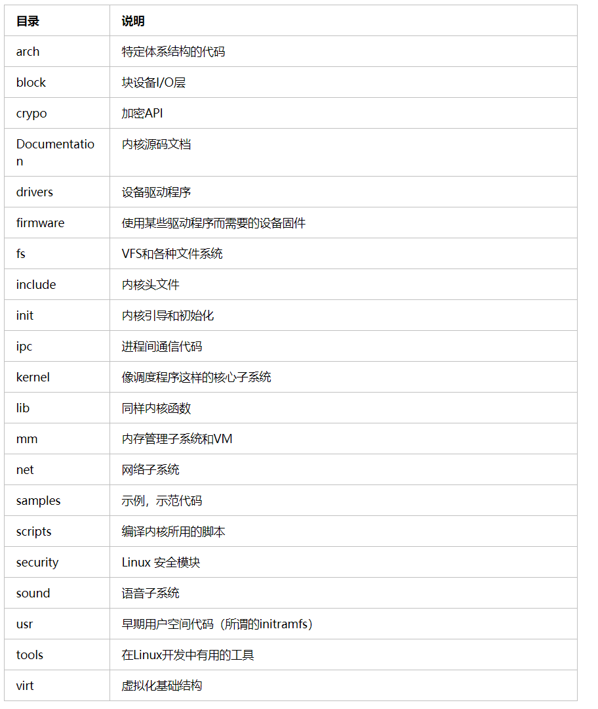
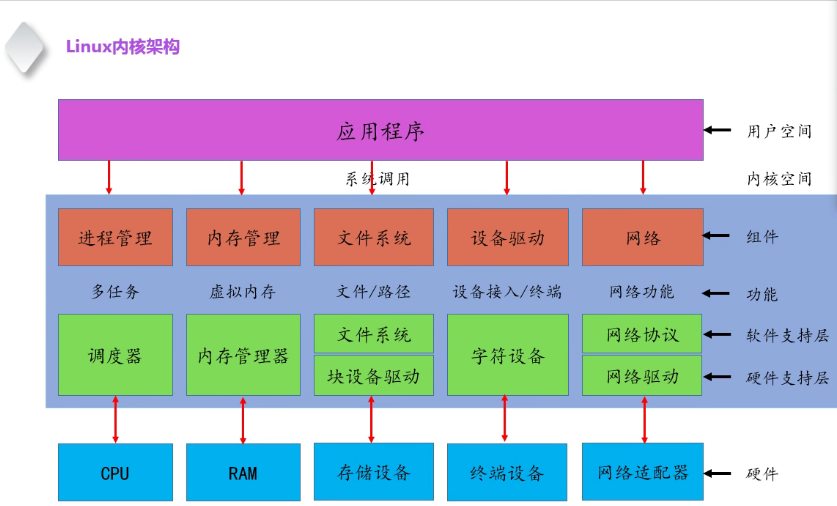

<!--
 * @Author: JohnJeep
 * @Date: 2020-08-19 19:37:29
 * @LastEditTime: 2021-11-20 20:54:59
 * @LastEditors: Windows10
 * @Description: Linux kernel学习
-->
<!-- TOC -->

- [1. 理解内核的秘籍](#1-%E7%90%86%E8%A7%A3%E5%86%85%E6%A0%B8%E7%9A%84%E7%A7%98%E7%B1%8D)
- [2. 如何学习内核](#2-%E5%A6%82%E4%BD%95%E5%AD%A6%E4%B9%A0%E5%86%85%E6%A0%B8)
    - [2.1. 核心的东西：最基础、最原始的概念。](#21-%E6%A0%B8%E5%BF%83%E7%9A%84%E4%B8%9C%E8%A5%BF%E6%9C%80%E5%9F%BA%E7%A1%80%E6%9C%80%E5%8E%9F%E5%A7%8B%E7%9A%84%E6%A6%82%E5%BF%B5)
- [3. Linux内核体系结构](#3-linux%E5%86%85%E6%A0%B8%E4%BD%93%E7%B3%BB%E7%BB%93%E6%9E%84)
    - [3.1. 内核模式与体系结构](#31-%E5%86%85%E6%A0%B8%E6%A8%A1%E5%BC%8F%E4%B8%8E%E4%BD%93%E7%B3%BB%E7%BB%93%E6%9E%84)
    - [3.2. struct](#32-struct)
    - [3.3. 内核中断](#33-%E5%86%85%E6%A0%B8%E4%B8%AD%E6%96%AD)
    - [3.4. 内核进程](#34-%E5%86%85%E6%A0%B8%E8%BF%9B%E7%A8%8B)
- [4. Linux内核源码结构](#4-linux%E5%86%85%E6%A0%B8%E6%BA%90%E7%A0%81%E7%BB%93%E6%9E%84)
    - [4.1. Linux内核源码宏观结构](#41-linux%E5%86%85%E6%A0%B8%E6%BA%90%E7%A0%81%E5%AE%8F%E8%A7%82%E7%BB%93%E6%9E%84)
    - [4.2. Linux内核源码各级源码分类](#42-linux%E5%86%85%E6%A0%B8%E6%BA%90%E7%A0%81%E5%90%84%E7%BA%A7%E6%BA%90%E7%A0%81%E5%88%86%E7%B1%BB)
    - [4.3. Linux内核源码解析第一刀](#43-linux%E5%86%85%E6%A0%B8%E6%BA%90%E7%A0%81%E8%A7%A3%E6%9E%90%E7%AC%AC%E4%B8%80%E5%88%80)
- [5. Linux内核引导程序](#5-linux%E5%86%85%E6%A0%B8%E5%BC%95%E5%AF%BC%E7%A8%8B%E5%BA%8F)
    - [5.1. Linux内核启动程序分析](#51-linux%E5%86%85%E6%A0%B8%E5%90%AF%E5%8A%A8%E7%A8%8B%E5%BA%8F%E5%88%86%E6%9E%90)
    - [5.2. Linux内核初始化程序分析](#52-linux%E5%86%85%E6%A0%B8%E5%88%9D%E5%A7%8B%E5%8C%96%E7%A8%8B%E5%BA%8F%E5%88%86%E6%9E%90)
    - [5.3. Linux第一个进程分析](#53-linux%E7%AC%AC%E4%B8%80%E4%B8%AA%E8%BF%9B%E7%A8%8B%E5%88%86%E6%9E%90)
- [6. Reference](#6-reference)

<!-- /TOC -->

# 1. 理解内核的秘籍

- 以一个设计者的角度来阅读内核
- 先框架再细节
- 低版本理解原理，高版本理解实现
- 动手总结，形成自己的智慧

# 2. 如何学习内核

- 了解 Linux 内核编译环境。下载一套源码，更换源码。
- 尝试 Linux 内核模块编写。
- 尝试 Linux 内核模块编译调试。

## 2.1. 核心的东西：最基础、最原始的概念。
-------------------
dmesg

menuconfig

# 3. Linux内核体系结构

- Linux是一个单内核，运行在单独的内核空间上。具有模块化设计、抢占式内核、支持内核线程、动态装载内核模块的能力，让所有事情都运行在内核态，直接调用函数，无须消息传递。

- 内核开发者通常把那些对时间要求比较高，而本身长度又比较短的函数定义成内联函数。若果一个函数较大，会被反复调用，且没有特别的时间上的限制，并赞成把它做成内联函数。

- 在内核中，为了类型的的安全和易读性，优先使用内联函数而不是复杂的宏。

- gcc内建了一条用于优化的的指令：`likely()和unlikely()`。编译器会根据这条指令对条件分支进行优化：判断该条件是经常出现还是很少出现。

- 内核中的内存都不分页，若你每用掉一个byte时，物理内存就会减少一个byte。
- 若果一个用户程序试图进行一次非法的内存访问，内核就会出现 `SIGSEGV` 信号，并结束整个进程。若内核自己非法访问了内存，则内核中会发生内存错误，导致oops。因此，在内核中，不应该去做访问非法的内存地址，引用空指针等，否则可能会死掉。

Linux 内核架构

## 3.1. 内核模式与体系结构

操作系统的工作方式
1. 操作系统从用户态态切换到内核态，即用户应用程序到内核程序。
2. 实现操作系统的系统调用。
3. 应用操作系统提供的底层函数，进行功能的实现。
4. 从内核态切换到用户态。

操作系统内核中各级模块之间的关系
- Linux内核模块整体分为：进程调度模块、内存管理模块、文件系统模块、进程间通信模块、驱动管理模块。
- 每个模块之间的关系
  1. 内存管理和驱动管理模块 。
  2. 虚拟内存的缓存和回存机制。
  3. 虚拟文件系统 (VFS) 把硬件当成文件来使用。

操作系统结构的独立性
- 为什么要把 Linux 内核分成管理层和实现层：易于代码的升级和维护。
- 高版本内核与低版本内核的区别
  1. 内核驱动的种类变多了，但内核驱动的管理模式并没有发生巨大的改变，比如：一段时间的三个跳段：零散型、分层型、设备树（Android操作系统）。
  2. 进程的调度算法发生了改变，但进程的管理方式没有发生巨大的改变。

## 3.2. struct 

内核中常见的 struct 结构体
- task_struct
- mm_task

## 3.3. 内核中断

## 3.4. 内核进程

- [task_struct(进程描述符)](https://blog.csdn.net/lf_2016/article/details/54347820)

每一个进程都有一个 task_struct。

# 4. Linux内核源码结构

## 4.1. Linux内核源码宏观结构

## 4.2. Linux内核源码各级源码分类

## 4.3. Linux内核源码解析第一刀

# 5. Linux内核引导程序

## 5.1. Linux内核启动程序分析

## 5.2. Linux内核初始化程序分析

## 5.3. Linux第一个进程分析

# 6. Reference

- [The Linux Kernel documentation](https://www.kernel.org/doc/html/latest/): 官方Linux kernel英文API手册。
- [Linux source code Bootlin](https://elixir.bootlin.com/linux/latest/source): 在线查看Linux kernel源码。
- [在线man-pages手册](https://man7.org/linux/man-pages/index.html) 由man-pages的维护者 Michael Kerrisk 维护的在线man-pages手册。其中除了man-pages手册外，还有许多丰富的内容，像 `The Linux Programming Interface` 等。值得日常重点查阅。
- [技术大牛--布伦丹·格雷格的网站](http://www.brendangregg.com/index.html)
- [Linux操作系统内核学习](https://ty-chen.github.io/categories/)：作者自己搭建的一个博客，里面记录了自己学习Linux内核方面的一些知识点。
- [Linux内核中双向链表的经典实现](https://www.cnblogs.com/skywang12345/p/3562146.html#a1)
- [What every programmer should know about memory](https://lwn.net/Articles/250967/)：博客写了关于Memory、CPU caches、Virtual memory、NUMA systems、cache optimization、multi-threaded optimizations、Memory performance tools等各个方面的知识，质量很高，需要细细的琢磨。
- [linux_kernel_wiki](https://github.com/0voice/linux_kernel_wiki): 非常丰富的 Linux 内核学习的方法，值得重点看。

