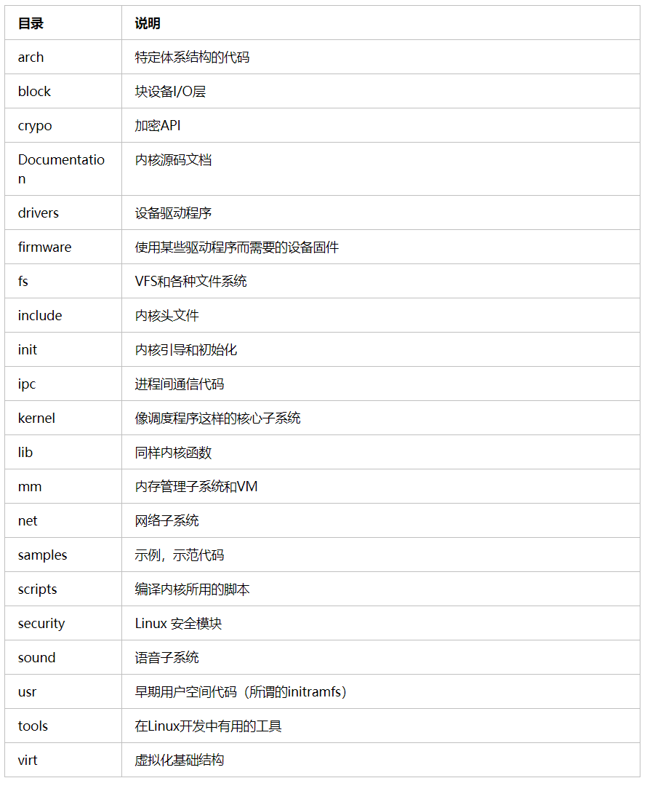

<!--
 * @Author: JohnJeep
 * @Date: 2020-08-19 19:37:29
 * @LastEditTime: 2020-11-23 17:22:23
 * @LastEditors: Please set LastEditors
 * @Description: Linux kernel学习
 * @FilePath: /linux_kernel.md
-->
## 理解内核的秘籍
- 以一个设计者的角度来阅读内核
- 先框架再细节
- 低版本理解原理，高版本理解实现
- 动手总结，形成自己的智慧

## 参考
- [Linux内核中双向链表的经典实现](https://www.cnblogs.com/skywang12345/p/3562146.html#a1)
- [The Linux Kernel documentation](https://www.kernel.org/doc/html/latest/): 官方Linux kernel英文API手册。
- [Linux source code Bootlin](https://elixir.bootlin.com/linux/latest/source): 在线查看Linux kernel源码。

## 基础概念
- Linux是一个单内核，运行在单独的内核空间上。具有模块化设计、抢占式内核、支持内核线程、动态装载内核模块的能力，让所有事情都运行在内核态，直接调用函数，无须消息传递。

- 内核开发者通常把那些对时间要求比较高，而本身长度又比较短的函数定义成内联函数。若果一个函数较大，会被反复调用，且没有特别的时间上的限制，并赞成把它做成内联函数。

- 在内核中，为了类型的的安全和易读性，优先使用内联函数而不是复杂的宏。

- gcc内建了一条用于优化的的指令：`likely()和unlikely()`。编译器会根据这条指令对条件分支进行优化：判断该条件是经常出现还是很少出现。

- 内核中的内存都不分页，若你每用掉一个byte时，物理内存就会减少一个byte。
- 若果一个用户程序试图进行一次非法的内存访问，内核就会出现 `SIGSEGV` 信号，并结束整个进程。若内核自己非法访问了内存，则内核中会发生内存错误，导致oops。因此，在内核中，不应该去做访问非法的内存地址，引用空指针等，否则可能会死掉。

## 进程
- [task_struct(进程描述符)](https://blog.csdn.net/lf_2016/article/details/54347820)

