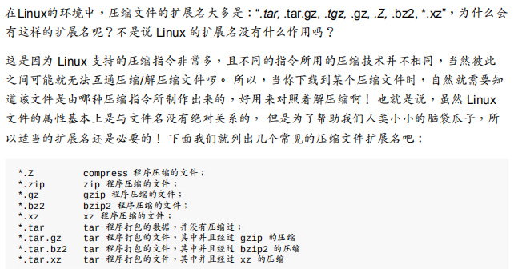
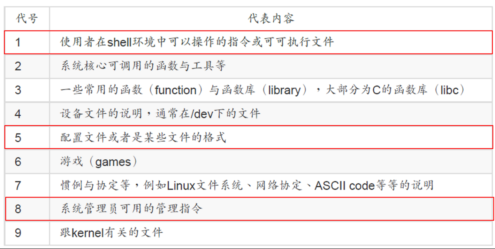

<!--

 * @Author: JohnJeep
 * @Date: 2020-04-04 09:46:51
 * @LastEditTime: 2021-12-07 01:17:41
 * @LastEditors: Windows10
 * @Description: Linux 基础用法笔记
--> 

<!-- TOC -->

- [1. Linux Basic](#1-linux-basic)
- [2. 硬件基础知识](#2-硬件基础知识)
  - [2.1. MBR](#21-mbr)
  - [2.2. GPT](#22-gpt)
  - [2.3. BIOS与UEFI](#23-bios与uefi)
  - [2.4. 分区](#24-分区)
- [3. 基础命令](#3-基础命令)
  - [3.1. touch](#31-touch)
  - [3.2. rm](#32-rm)
  - [3.3. mkdir](#33-mkdir)
  - [3.4. mv](#34-mv)
  - [3.5. cp](#35-cp)
  - [3.6. ls](#36-ls)
  - [3.7. stat](#37-stat)
  - [3.8. disk](#38-disk)
  - [3.9. fdisk](#39-fdisk)
  - [3.10. df](#310-df)
  - [3.11. umount](#311-umount)
  - [3.12. which](#312-which)
  - [3.13. whereis](#313-whereis)
  - [3.14. hostname](#314-hostname)
- [4. 系统相关](#4-系统相关)
- [5. 文件查看命令](#5-文件查看命令)
  - [5.1. cat](#51-cat)
  - [5.2. tac](#52-tac)
  - [5.3. nl](#53-nl)
  - [5.4. more](#54-more)
  - [5.5. less](#55-less)
  - [5.6. head 和 tail](#56-head-和-tail)
  - [5.7. uniq](#57-uniq)
- [6. 文件 I/O](#6-文件-io)
  - [6.1. 文件权限](#61-文件权限)
  - [6.2. umask](#62-umask)
  - [6.3. chattr](#63-chattr)
  - [6.4. 用户与用户组](#64-用户与用户组)
  - [6.5. 用户权限修改](#65-用户权限修改)
  - [6.6. 文件种类与扩展名](#66-文件种类与扩展名)
  - [6.7. Linux系统目录](#67-linux系统目录)
  - [6.8. 绝对路径与相对路径](#68-绝对路径与相对路径)
- [7. tar](#7-tar)
  - [7.1. 压缩文件类型](#71-压缩文件类型)
  - [7.2. tar文件打包](#72-tar文件打包)
  - [7.3. 打包文件或目录](#73-打包文件或目录)
  - [7.4. 解包文件或目录](#74-解包文件或目录)
  - [7.5. 解压缩文件](#75-解压缩文件)
  - [7.6. 打包压缩](#76-打包压缩)
  - [7.7. zcat zless](#77-zcat-zless)
  - [7.8. zip](#78-zip)
- [8. link](#8-link)
  - [8.1. hard links](#81-hard-links)
  - [8.2. symbolic links](#82-symbolic-links)
- [9. pipe](#9-pipe)
- [10. tee](#10-tee)
- [11. wc](#11-wc)
- [12. top](#12-top)
- [13. ps](#13-ps)
- [14. killall 与 pkill](#14-killall-与-pkill)
- [15. nohup](#15-nohup)
- [16. pstree](#16-pstree)
- [17. strace](#17-strace)
- [18. pstack](#18-pstack)
- [19. find](#19-find)
- [20. xargs](#20-xargs)
- [21. grep](#21-grep)
- [22. pgrep](#22-pgrep)
- [23. PID](#23-pid)
- [24. netstat](#24-netstat)
- [25. ss](#25-ss)
- [26. lsof](#26-lsof)
- [27. netcat](#27-netcat)
- [28. socat](#28-socat)
- [29. traceroute](#29-traceroute)
- [30. dmesg](#30-dmesg)
- [31. vmstat](#31-vmstat)
- [32. man](#32-man)
- [33. ntsysv](#33-ntsysv)
- [34. wget](#34-wget)
- [35. SHA](#35-sha)
- [36. md5](#36-md5)
- [37. ldconfig](#37-ldconfig)
- [38. ldd](#38-ldd)
- [39. chkconfig](#39-chkconfig)
- [40. scp](#40-scp)
- [41. rsync](#41-rsync)
- [42. 防火墙](#42-防火墙)
  - [42.1. ubuntu 下默认的防火墙](#421-ubuntu-下默认的防火墙)
  - [42.2. CentOS 下默认的防火墙](#422-centos-下默认的防火墙)
- [43. SELinux](#43-selinux)
- [44. 共性问题](#44-共性问题)
  - [44.1. Linux 与 Windows相差 8 小时处理](#441-linux-与-windows相差-8-小时处理)
- [45. ulimit 系统参数修改](#45-ulimit-系统参数修改)
  - [45.1. **root用户修改后其他用户不生效**](#451-root用户修改后其他用户不生效)
- [46. 参考](#46-参考)

<!-- /TOC -->


# 1. Linux Basic

介绍 Linux 系统的基础使用，包括计算机的硬件知识、Linux常见基础命令的用法。

----------------------------

每次查了就忘了，花费很多时间，找的东西良莠不齐，因此记下查的知识点。

# 2. 硬件基础知识

磁盘阵列（RAID）：利用硬件技术将数个硬盘整合成为一个大硬盘的方法， 操作系统只会看到最后被整合起来的大硬盘。 由于磁盘阵列是由多个硬盘组成， 所以可以达成速度性能、 备份等任务。 


## 2.1. MBR

MBR(Master Boot Record): 主引导记录

引导启动程序记录区与分区表通常放在磁盘的第一个扇区，这个扇区通常大小为 512 bytes。
- 446字节的**MBR**安装启动引导程序，64 字节的**分区表**记录整块硬盘分区的状态。
- 由于分区表所在区块仅有64 Bytes容量， 因此最多仅能有四组记录区，每组记录区记录了该区段的启始与结束的柱面号码。 
> 引导启动程序的作用：加载内核文件。
```
1. 其实所谓的“分区”只是针对那个64 Bytes的分区表进行设置而已！
2. 硬盘默认的分区表仅能写入四组分区信息
3. 这四组分区信息我们称为主要（ Primary） 或延伸（ Extended） 分区
4. 分区的最小单位“通常”为柱面（ cylinder）
5. 当系统要写入磁盘时， 一定会参考磁盘分区表， 才能针对某个分区进行数据的处理 
```

扩展分区
- 扩展分区并不是只占一个区块，而是会分布在每个分区的最前面几个扇区来记载分区信息的！
- 扩展分区的目的是使用额外的扇区来记录分区信息， 扩展分区本身并不能被拿来格式化。 然后我们可以通过扩展分区所指向的那个区块继续作分区的记录。

MBR 主要分区(Primary)、 扩展分区(Extend)与逻辑分区(logical) 三者的区别
- 主要分区与扩展分区最多可以有四个（ 硬盘的限制）
- 扩展分区最多只能有一个（ 操作系统的限制）
- 逻辑分区是由扩展分区持续切割出来的分区；
- 能够被格式化后作为数据存取的分区是：主要分区与逻辑分区，扩展分区无法格式化；
- 逻辑分区的数量依操作系统而不同，在Linux系统中 SATA 硬盘已经可以突破63个以上的分区限制；

MBR分区的缺点
- 操作系统无法抓取到 2T 以上的磁盘容量！
- MBR 仅有一个区块，若被破坏后，经常无法或很难救援。
- MBR 内存放的启动引导程序最大为 446Bytes， 无法容纳较多的程序码。


## 2.2. GPT

GPT: GUID Partition Table，源自EFI标准的一种较新的磁盘分区表结构的标准，支持64位的寻址。

LBA(Logical Block Address): 逻辑区块位址
- LBA0(MBR兼容区块)：储存了第一阶段的启动引导程序。
- LBA1(GPT表头记录)：记录了分区表本身的位置与大小， 同时记录了备份用的 GPT 分区（在最后 34 个 LBA 区块）放置的位置，同时放置了分区表的检验机制码（ CRC32），操作系统可以根据这个检验码来判断 GPT 是否正确。 
- LBA2-33（实际记录分区的信息地方）：从 LBA2 区块开始，每个 LBA 都可以记录 4 组分区记录，所以在默认的情况下，总共可以有 4*32 = 128 组分区记录。 因为每个 LBA 有 512Bytes， 因此每组记录用到 128Bytes 的空间， 除了每组记录所需要的识别码与相关的记录之外， GPT 在每组记录中分别提供了 64bits 来记载开始/结束的扇区号码。

GPT 分区已经没有所谓的主、 扩展、 逻辑分区的概念，既然每组纪录都可以独立存在，当然每个都可以视为是主分区， 每一个分区都可以拿来格式化使用。


## 2.3. BIOS与UEFI

BIOS：是一个写入到主板上的一个软件程序（仅有16位），采用汇编语言编写的。 

Boot loader的主要任务
- 提供加载项：用户可以选择不同的启动选项，这也是多重引导的重要功能。
- 加载内核文件：直接指向可使用的程序区段，来启动操作系统。
- 转交其它启动引导程序：将启动管理功能转交给其它引导程序负责。

  > 每个分区都有自己的启动扇区(boot sector)。启动引导程序只会认识自己的系统分区内的可开机核心文件， 以及其它启动引导程序而已；

如果要安装多重开机，为什么最好先安装Windows再安装Linux呢？
> 因为 Linux在安装的时候，你可以选择将启动引导程序安装在 MBR 或其它分区的启动扇区， 而且Linux的启动引导程序可以手动设置选项，所以你可以在Linux的启动引导程序里面加入Windows启动的选项；
>Windows在安装的时候， 它的安装程序会主动的覆盖掉 MBR 以及自己所在分区的启动扇区，你没有选择的机会， 而且它没有让我们自己选择选项的功能。因此，如果先安装Linux再安装Windows的话，那么 MBR 的启动引导程序就只会有Windows的选项， 而不会有Linux的选项（ 因为原本在MBR内的Linux的启动引导程序就会被覆盖掉） 。

UEFI(Unified Extensible Firmware Interface): 统一可扩展固件接口，采用C语言编写的。其中UEFI可以直接获取GPT的分区表。

为什么在安装系统时，需要将 UEFI 的 secure boot 关闭？ 

> 因为使用secure boot会使将要启动的操作系统，必须要被UEFI验证，否则就无法启动。


## 2.4. 分区

挂载：利用一个目录当成进入点，将磁盘分区的数据放置在该目录下。其中根目录（/）必须挂载到某个分区，其它的目录可以依据用户的的需求挂载到不同的分区。

操作系统开机的流程：BIOS--->MBR--->引导启动程序--->内核文件

swap 分区：磁盘模拟内存的交换分区，当有数据被存放在物理内存里面，但这些数据又不是常被CPU使用时，这些不常被使用的数据将会被扔到硬盘的交换分区当中去，而速度较快的物理内存将被释放出来给真正需要的程序使用。交换分区不会使用目录树的挂载，所有交换分区就不需要指定挂载点。

# 3. 基础命令

## 3.1. touch 

```sh
touch fileName: 文件不存在新建一个文本；文件存在时，修改文件创建的时间。
```

## 3.2. rm

```sh
rm fileName(remove): 删除一个文本
rm -rf: 删除一个目录下的所有文件；以下为两个常用的参数

参数
  -i(interactive)：让系统在执行前确认。
  -r(recursive)：递归
```

## 3.3. mkdir

```sh
mkdir(make directory): 新建一个目录。

创建多层的目录加参数 -p(--parents)

一次性创建很多个文件夹
    [root@CentOS7 ~]# mkdir test/bb{1..10}
    [root@CentOS7 ~]# ls test/
    bb1  bb10  bb2  bb3  bb4  bb5  bb6  bb7  bb8  bb9

rmdir: 移除一个目录
```

## 3.4. mv 

```sh
mv 命令用来将文件或目录改名或将文件由一个目录移入另一个目录中。
mv source dest 将文件源文件或目录 (source) 移到 目标文件或目录处 (dest)，并重名为 dest。

移动文件： mv a.txt /home/Desptop/ 将当前目录下的 a.txt 文件移动到 /home/Desktop/ 路径下
移动目录： mv /usr/lib/* /home 将 /usr/lib/ 路径下的所有文件都移动到 /home/ 路径下。

参数选项：
  -v(verbose)： 显示 move 命令执行的过程。
```

## 3.5. cp 

```sh
cp src dest  将文件src拷贝到当前目录下为dest文件

注意：拷贝目录时，要加参数 -r(recursive)
拷贝操作会复制执行者的属性和权限。
```


## 3.6. ls

```sh
ls 命令列出文件夹中的内容

参数
  -a  显示所有的文件，包含隐藏的
  -l  详细的输出文件夹中内容
  -h  以人类可读的形式输出文件的大小
  --full-time  以完整的时间格式输出
  -t  根据最后修改的时间排序，最新的在第一个
  -F  在不同的文件结尾输出不同的特殊符号
  -d  显示文件夹本生信息，不输出其中的内容
  -r(reverse)  逆序排序
  -S  默认按照从小到大对文件夹大小排序
  -i  显示文件的 inode 信息
  

例子：
    ls -al: 查看所有隐藏的文件  
    ls -l | grep "*-" | wc -l 查看当前目录下的文件夹目录个数（不包含子目录中的目录）。
    ls | wc -l 统计当前目录下总共有多少行
```

## 3.7. stat

```sh
stat 查看文件的详细信息，比 ls 查看的更多

例子：
[root@CentOS7 ~]# stat t.txt
  File: ‘t.txt’
  Size: 149             Blocks: 8          IO Block: 4096   regular file
Device: fd00h/64768d    Inode: 34955932    Links: 1
Access: (0644/-rw-r--r--)  Uid: (    0/    root)   Gid: (    0/    root)
Context: unconfined_u:object_r:admin_home_t:s0
Access: 2021-11-20 21:20:51.966004651 +0800
Modify: 2021-11-20 21:20:44.858014426 +0800
Change: 2021-11-20 21:20:44.858014426 +0800
 Birth: -
```


## 3.8. disk

```shell
du(disk usage): 显示指定的目录或文件所占用的磁盘空间大小。

参数
  -h(human)：以人类容易看懂的方式显示
  -M(megabytes): 以1MB为单位
  -s(summarize): 仅显示总计

示例：
du -sh 路径名 ：显示指定路径下文件的大小

统计 `~/` 路径下每个文件的大小
[root@localhost ~]# du -sh ~/*
4.0K    /root/anaconda-ks.cfg
0       /root/Desktop
0       /root/Documents
0       /root/Downloads
0       /root/Music
0       /root/Pictures
0       /root/Public
2.2M    /root/redis-6.0.16.tar.gz
0       /root/Templates
0       /root/Videos
```

## 3.9. fdisk

```sh
fdisk 操作磁盘分区表

参数：
  -l 查看硬盘的情况
```

## 3.10. df

```
df(disk free): 显示Linux 系统上文件系统的磁盘使用情况 

参数项：
  -h(human)：以人类容易看懂的方式显示
  -i(inodes): 列出 inode 信息，不列出已使用的 block
  -H: 很像 -h, 但是用 1000 为单位而不是用 1024
```

mount

```
mount 挂载命令

语法形式
  mount 设备名字 挂在目录  
  mount –t type dev dir

参数：
  –t type ：是需要挂载的文件系统类型，光盘文件系统类型是：iso9660；
  dev：挂载文件系统的设备名称，光盘驱动器的设备名称是/dev/cdrom; 
  dir：挂载点，即挂载到的文件目录路径

示例：
  mount -t iso9660 /dev/cdrom /media/drom

```

## 3.11. umount

```sh
umout 设备装载常用命令

示例：
  umount dir device […]
```


## 3.12. which

```sh
在 PATH 变量指定的路径中，搜索某个系统命令的位置，并且返回第一个搜索结果。

示例：`which gcc`
```

## 3.13. whereis

```sh
whereis: 查找系统中包含可以找到的所有文件

参数 -b : 只能用于搜索程序名和二进制文件
示例：whereis gcc
```

## 3.14. hostname

```
hostname 是 Linux 的主机名。而 Linux 的 hostname 位于 /etc/hostname 下，修改此路径下的文件是永久有效的。

若直接在终端使用命令 `hostname xxx` 修改，修改后仅仅是本次有效，重启后就失效了。 
```

# 4. 系统相关

- uname -a:  查看 Linux 版本
- `lscpu`: 查看系统 CPU 情况
- `locale -a`： 列出系统支持的所有语言环境
- `eject`: 将光盘驱动器中的光盘轻轻弹出和收回
- `nslookup 域名` 查看域名对应的IP地址

# 5. 文件查看命令

## 5.1. cat

```sh
cat(concatenate)：从第一行开始显示文件内容，将要显示的内容一次性的输出在屏幕上。

参数项
  - n 显示行号
  
示例：
  cat < hello.txt > hello2.txt   # 将 hello.txt 文件内容重定向输出到 hello.txt 文件中，相当于 cp 指令的一个副本。  
```

## 5.2. tac

```sh
tac：从最后一行开始显示文件内容。
```

## 5.3. nl 

```sh
nl ：查看文件时可以显示行号。
```


## 5.4. more

```
more：(-n：可以显示行号)一页一页的显示文件内容，只能往后翻。
```


## 5.5. less

```sh
less：(-n：可以显示行号)一页一页的显示文件内容，既可以往后翻又可以往前翻，一般用的最多。

参数：
    空格键：向下翻一页。一般使用上下箭头进行翻页。
    /字符串：向下查找字符串。
    ?字符串：向上查找字符串。
    n：重复前一个查找。
    N：反向重复前一个查找。
    g：进到这个数据的第一行。
    G：进到这个数据的最后一行。
    q：退出less程序。
```

od 

```sh
od(Octal Dump)：默认以二进制的方式读取文件内容。将指定文件内容以八进制、十进制、十六进制、浮点格式或 ASCII 编码字符方式显示，通常用于显示或查看文件中不能直接显示在终端的字符。

格式：`od -t TYPE` 文件

参数
    -A RADIX   --address-radix=RADIX   选择以何种基数表示地址偏移
    -j BYTES   --skip-bytes=BYTES      跳过指定数目的字节
    -N BYTES   --read-bytes=BYTES      输出指定字节数
    -S [BYTES] --strings[=BYTES]       输出长度不小于指定字节数的字符串，BYTES 缺省为 3
    -v         --output-duplicates     输出时不省略重复的数据
    -w [BYTES] --width[=BYTES]         设置每行显示的字节数，BYTES 缺省为 32 字节
    -t TYPE    --format=TYPE           指定输出格式，格式包括 a、c、d、f、o、u 和 x，各含义如下：
      a：利用默认的字符来输出。
      c：利用ASCII字符来输出。
      d[SIZE]：利用有符号的十进制(decimal)来输出数据。每个整数占用 SIZE bytes。
      f[SIZE]：利用浮点数(floating)来输出数据。每个浮点数占用 SIZE bytes。
      o[SIZE]：利用八进制(octal)来输出数据。每个整数占用 SIZE bytes。
      u[SIZE]：利用无符号的十进制(decimal)来输出数据。每个整数占用 SIZE bytes。
      x[SIZE]：利用十六进制(hexadecimal)来输出数据。每个整数占用 SIZE bytes。
      
      SIZE 可以为数字，也可以为大写字母。如果 TYPE 是 [doux] 中的一个，那么 SIZE 可以为
      	C  = sizeof(char)，S = sizeof(short)，I = sizeof(int)，L = sizeof(long)。
      	如果 TYPE 是 f，那么 SIZE 可以为 F = sizeof(float)，D = sizeof(double) ，L = sizeof(long double)
      
示例：
  od -t x testfile  # 以十六进制输出 testfile，默认以四字节为一组（一列）显示。
  echo abc | od -t dCc   # 查看字符的 ASCII 表
```


## 5.6. head 和 tail

```sh
head、tail：取出文件前几行或最后几行的数据。

示例：
  在屏幕上列出 /etc/man_db.conf 文件中的第11行到22行之间的内容，并且显示行号。 cat -n /etc/man_db.conf | head -n 20 | tail -n 10
```

## 5.7. uniq 

```sh
uniq 输出或忽略文件的重复行，常与 sort 排序命令结合使用

参数项
  -c, --count    每行前面显示重复出现的次数
  -d, --repeated 只显示重复的行
  -u, --unique   只显示出现过一次的行
```


# 6. 文件 I/O

## 6.1. 文件权限

CentOS使用的是 xfs 作为默认的文件系统。

文件权限分为
  - 可读（Read），可以读取文件的内容。
  - 可写（Write），可以编辑、新增、或修改该文件的内容，但不具备删除该文件的权限。
  - 可执行（eXecute），Linux下，文件是否能够执行，与文件的后缀名无关，仅由是否具备 `x` 这个权限来决定。

> 注意: X 代表这个文件具有可执行的能力，但能不能执行成功，需要由文件中的内容决定。

> 对于文件的rwx来说，主要都是针对“文件的内容”而言，与文件文件名的存在与否没有关系，因为文件记录的是实际的数据。文件是存放数据的所在，目录则主要记录文件名列表。因此文件名与目录有强烈的关联。


目录权限
  - r: 具有读取文件目录结构的权限
  - w: 具有改动该目录结构列表的权限。
  - x: 目录不能被执行，x 表示用户能否进入该目录并且成为工作目录。
  > 通常一个用户给其它的用户开放目录，至少要具备 `rx` 权限，其它的用户才能访问当前用户的目录。


## 6.2. umask

- umask: 指定目前用户在建立文件或目录时的默认权限值。
- 查看当前系统的umask值：`0002` ;第一个数值为特殊权限值，后面三个分别对应为 `rwx` 的值。
  > 一般文件通常用于记录数据，则用户建立的文件默认没有 `x` 可执行权限，只有 `rw` 权限，即 `-rw-rw-rw-`

  > 用户建立目录 时，默认的权限均开放，即 `drwxrwxrwx`

  > 使用 `ls -l` 查看的文件或目录权限值为：文件或目录的默认值减去 umask 的值。
  ```
  例如：umask值为 003
  文件：(-rw-rw-rw-)  - (-------wx)  = -rw-rw-r
  目录：(drwxrwxrwx)  - (-------wx)  = drwxrwx-r
  ```


## 6.3. chattr

修改文件的隐藏属性：`chattr [+-=] [ASacdistu]` 该命令一般用于对数据的安全性比较高的地方
```
选项与参数

+ ： 增加某一个特殊参数， 其他原本存在参数则不动。
- ： 移除某一个特殊参数， 其他原本存在参数则不动。
= ： 设置一定， 且仅有后面接的参数
A ： 当设置了 A 这个属性时， 若你有存取此文件（ 或目录） 时， 他的存取时间 atime 将不会被修改，可避免 I/O 较慢的机器过度的存取磁盘。（目前建议使用文件系统挂载参数处理这个项目）
S ： 一般文件是非同步写入磁盘的， 如果加上 S 这个属性时，当你进行任何文件的修改， 该更动会“同步”写入磁盘中。
a ： 当设置 a 之后， 这个文件将只能增加数据，而不能删除也不能修改数据， 只有root 才能设置这属性
c ： 这个属性设置之后， 将会自动的将此文件“压缩”， 在读取的时候将会自动解压缩，但是在储存的时候， 将会先进行压缩后再储存（ 看来对于大文件似乎蛮有用的！）
d ： 当 dump 程序被执行的时候， 设置 d 属性将可使该文件（ 或目录） 不会被 dump 备份
i ： 这个 i 可就很厉害了！ 他可以让一个文件“不能被删除、 改名、设置链接也无法写入或新增数据！”对于系统安全性有相当大的助益！ 只有 root 能设置此属性
s ： 当文件设置了 s 属性时， 如果这个文件被删除， 他将会被完全的移除出这个硬盘空间，所以如果误删了， 完全无法救回来了！
u ： 与 s 相反的， 当使用 u 来设置文件时， 如果该文件被删除了， 则数据内容其实还存在磁盘中，可以使用来救援该文件！

注意1： 属性设置常见的是 a 与 i 的设置值， 而且很多设置值必须要身为 root 才能设置
注意2： xfs 文件系统仅支持 AadiS 而已

范例： 请尝试到/tmp下面创建文件， 并加入 i 的参数， 尝试删除看看。
  [root@study ~]# cd /tmp
  [root@study tmp]# touch attrtest &lt;==创建一个空文件
  [root@study tmp]# chattr +i attrtest &lt;==给予 i 的属性
  [root@study tmp]# rm attrtest &lt;==尝试删除看看
  rm: remove regular empty file `attrtest'? y
  rm: cannot remove `attrtest': Operation not permitted
  // 看到了吗？连 root 也没有办法将这个文件删除呢！ 赶紧解除设置！

范例： 请将该文件的 i 属性取消！
[root@study tmp]# chattr -i attrtest

```

查看文件或目录的隐藏属性：`lsattr [-adR] 文件或目录`


## 6.4. 用户与用户组

说明 | 用户(owner) | 用户组(group) | 其它用户(other)
--- | --- | --- |---
权限 | 读  写  执行 | 读  写  执行| 读  写  执行
符号 | r  w  x | r  w  x | r  w  x
权值 | 4 2 1 | 4 2 1 | 4 2 1 


`ls -l`: 查看目录下文件属性的所有信息，每一栏说明如下：
  - 第1栏有10个字符，其中第1个字符描述类型，后边9个字符描述权限
  - 第2栏是硬链接数，删除文件其实是将链接数减1 ，减到0了就真正删除文件内容
  - 第3、4栏分别是文件的拥有者及所属群组。
  - 第5栏是文件大小，单位为字节（Byte）
  - 第6栏是最近访问（修改）时间
  - 第7栏是文件名，对于符号链接


## 6.5. 用户权限修改

- `chown`: 修改文件的拥有者（用户）
- `chgrp`: 修改文件的用户组
- `chmod`: 修改文件的模式权限，SUID、SGID、SBIT等特性
> sudo: do as su(super user)


特殊权限
- SUID(Set UID)，简写：s，数字：4
  - 对于一个文件的功能：
    - SUID 权限仅对二进制程序（ binary program）有效；
    - 执行者对于该程序需要具有 x 的可执行权限；
    - 本权限仅在执行该程序的过程中有效 （ run-time）；
    - 执行者将具有该程序拥有者 （ owner） 的权限。
    > 注意：SUID仅可用在二进制程序上，不能用在shell脚本上面，因为shell脚本只是将很多的二进制可执行文件调用执行。也不能用在目录上面。
    ```
    例如：
    1. steve 对于 /usr/bin/passwd 这个程序来说是具有 x 权限的， 表示 steve 能执行passwd；
    2. passwd 的拥有者是 root 这个帐号；
    3. steve 执行 passwd 的过程中， 会“暂时”获得 root 的权限；
    4. /etc/shadow 就可以被 steve 所执行的 passwd 所修改。
    
    对于具有SUID特殊权限的文件，可以临时的将该文件的权限由steve（执行者） 变为root（拥有者）。
    ```


- SGID(Set GID)，简写：s，数字：2
  - 当文件或目录中的用大 S 表示时，代表该文件或目录本身没有可执行的 x 权限，因此 S 或 T 表示当前操作的权限为空。
  - 可以针对文件或目录操作。
  - 对文件具备的功能
    - 仅对二进制程序有用。
    - 程序执行者对于该程序来说，需具备 x 的权限；
    - 执行者在执行的过程中将会获得该程序群组的支持！
  - 对目录的功能
    - 使用者若对于此目录具有 r 与 x 的权限时， 该使用者能够进入此目录；
    - 使用者在此目录下的有效群组（ effective group） 将会变成该目录的群组；
    - 用途： 若使用者在此目录下具有 w 的权限（ 可以新建文件） ， 则使用者所创建的新文件， 该新文件的群组与此目录的群组相同。 


- SBIT(Sticky BIT)：简写：t，数字：1
  - 仅仅只针对目录有作用，对文件没有作用。
  - 对目录的功能
    - 用户对目录具有 w、x 权限时，即具有写入的权限。
    - 当用户在该目录建立文件或目录时，仅有自己与root才有删除该文件，其他人如法操作。 

> 利用数字的方式修改文件权限：将一个文件的权限改为 `-rwsr-xr-x`，命令为：`chmod 4755 filename`

> 利用符号的方式修改文件权限：SUID为 u+s，SGID为 g+s，SBIT 为 o+t


## 6.6. 文件种类与扩展名

类型符号 | 文件类型                      | 分类
---    |---                           | ---
\-      | 一般文件(regular)             | 纯文本文件、二进制文件、数据文件
d      | 目录文件(directory)           | null
c      | 字符设备文件(character device) | null
l      | 符号链接文件(symbolic link)    | null
p, f   | 数据传输文件(pipe, FIFO)       | null
s      | 套接文件(socket)               | null


Linux下文件的最大长度：单一文件或目录的最大允许文件名为 255bytes，以一个ASCII英文占用一个字节来说，则可达255个字符长度，每个汉字占用 2个字节，则最大的文件名大约在 128 个汉字之间。


## 6.7. Linux系统目录

FHS(Filesystem Hierarchy Standard)：文件系统分层标准

- boot：开机启动配置文件。Linux kernel常用的文件名为：vmlinuz，如果使用的是grub2这个开机管理程序， 则还会存在/boot/grub2/这个目录。
- dev：存储外部设备文件。比要重要的文件有/dev/null, /dev/zero, /dev/tty, /dev/loop, /dev/sd等等。
-  etc：存储系统配置文件，只有root权限才可以修改
-  bin：放置系统的可执行文件
-  lib：存放开机时会用到的函数库， 以及在/bin或/sbin下面的指令会调用的函数库
-  media：放置媒体文件：软盘、光盘、DVD
-  mnt：挂载目录，这个目录的用途与/media相同，只是有了/media之后，这个目录就用来暂时挂载用了。
-  opt：第三方软件放置处
-  home：系统默认使用者的文件夹
-  root：系统管理员（root）的主文件夹。
-  sbin：放置为开机过程中所需要的，里面包括了开机、修复、还原系统所需要的指令。
-  srv：srv可以视为“service”的缩写，是一些网络服务启动之后存放的位置
-  proc：是一个虚拟文件系统，它放置的数据都在内存当中，例如系统核心、行程信息（process）、周边设备的状态及网络状态等等。这个文件本身不占任何的硬盘空间。
-  sys：这个目录其实跟/proc非常类似，也是一个虚拟的文件系统，主要也是记录内核(kernel)与系统硬件信息较相关的参数。包括目前已载入的内核模块与内核侦测到的硬件设备信息等等，这个目录同样不占硬盘容量。
-  tmp：让一般使用者或者是正在执行的程序暂时放置文件的地方，这个目录是任何人都能够存取的
-  run：早期的 FHS 规定系统开机后所产生的各项信息应该要放置到 /var/run 目录下，新版的 FHS 则规范到 /run 下面。
-  usr：是Unix Software Resource的缩写，是Unix操作系统软件资源所放置的目录，而不是使用者的数据。这个目录有点类似Windows 系统的C盘。
-  var：主要针对常态性变动（variable）的文件，包括高速缓存（cache）、登录文件（log file）以及某些软件运行所产生的文件， 包括程序文件（lock file, run file），或者例如MySQL数据库的文件等等。
-  lib64：支持 64 位的 /lib64 函数库
-  lost+found：是使用标准的ext2/ext3/ext4文件系统格式才会产生的一个目录，目的在于当文件系统发生错误时， 将一些遗失的片段放置到这个目录下。不过如果使用的是 xfs 文件系统的话，就不会存在这个目录了！
 - /usr/bin/：所有一般用户能够使用的指令都放在这里，使用链接文件的方式将 /bin 链接至此。也就是说， /usr/bin 与 /bin 是一模一样了！另外，FHS 要求在此目录下不应该有子目录。
- /usr/lib/：基本上，与 /lib 功能相同，所以 /lib 就是链接到此目录中的！
- /usr/local/：系统管理员在本机自行安装自己下载的软件，非distribution默认提供者的，建议安装到此目录， 这样会比较便于管理。
- /usr/sbin/：非系统正常运行所需要的系统指令。最常见的就是某些网络服务器软件的服务指令（daemon）！不过基本功能与 /sbin 也差不多， 因此目前 /sbin 就是链接到此目录中的。
- /usr/share/：共享数据目录，放置的数据几乎是不分硬件架构均可读取的。
- /usr/games/：与游戏相关的数据。
- /usr/include/：c/c++等程序语言的文件开始（header）与包含档（include）放置处。
- /usr/src/：Linux源代码源代码放置处。
- /usr/lib64/：与 /lib64/功能相同，因此目前 /lib64 就是链接到此目录中
- /var/cache/：应用程序本身运行过程中会产生的一些暂存盘。
- /var/lib/：程序本身执行的过程中，需要使用到的数据文件放置的目录。
- /var/lock/：设备锁存储的目录。目前此目录链接到 /run/lock 中！
- /var/log/：登录文件放置的目录！里面比较重要的文件，如/var/log/messages, /var/log/wtmp（记录登陆者的信息）等。
- /var/mail/：放置个人电子邮件信箱的目录，这个目录/var/spool/mail/链接到 /var/mail/ 目录。
- /var/run/：某些程序或者是服务启动后，会将他们的PID放置在这个目录下喔！ 与 /run 相同，这个目录链接到 /run去了！
- /var/spool/：这个目录通常放置一些伫列数据，所谓的“伫列”就是排队等待其他程序使用的数据啦！ 这些数据被使用后通常都会被删除。

```sh
一些链接文件之间的关系

/bin --> /usr/bin
/sbin --> /usr/sbin
/lib --> /usr/lib
/lib64 --> /usr/lib64
/var/lock --> /run/lock
/var/run --> /run
```


## 6.8. 绝对路径与相对路径

绝对路径：一定由跟目录(`/`)写起。例如：`/usr/share/doc`  在shell脚本中一般使用绝对路径，防止因为不同的工作环境导致一些问题的发生。

相对路径：不是由根目录(`/`)写起。例如：`../man`  相对路径只是相对于当前的工作路径。

# 7. tar

tar 命令用于的文件的打包和解压。


## 7.1. 压缩文件类型

- `gzip`: 压缩文件后缀(*.gz)
- `bzip2`: 压缩文件后缀(*.bz2)
- `xz`: 压缩文件后缀(*.xz)




## 7.2. tar文件打包    


```sh
参数项：

-c(Create): 打包文件
-t(lisT): 察看打包文件的内容含有哪些文件名
-x(eXtract): 解压打包文件 
  注意：-c, -t, -x 不可同时出现在一串命令行中。
-v(Verbose): 在压缩/解压缩的过程中，将正在处理的文件名显示出来
-f(Filename):  后面要立刻接要被处理的文件名！
-C(direCtory: 目录): 将文件解压在特定的目录
-p(小写):  保存原本文件的权限与属性，不包含根目录 /。
-P(大写)：保留绝对路径，即允许备份的数据中中包含根目录。解压后的数据直接从根目录 / 开始。
-z：通过 gzip 的支持进行压缩/解压，此时文件名最好为  *.tar.gz
-j：通过 bzip2 的支持进行压缩/解压，此时文件名最好为 *.tar.bz2
-J ：通过 xz 的支持进行压缩/解压缩：此时文件名最好为 *.tar.xz
  注意：-z, -j, -J 不可以同时出现在一串命令行中
```


## 7.3. 打包文件或目录

- 将当前目录下的  anaconda-ks.cfg 文件打包成 A.tar：`tar -cvf A.tar anaconda-ks.cfg `
- 打包多个文件或目录，中间需要用空格分开：`tar -cvf B.tar anaconda-ks.cfg /tmp/`


## 7.4. 解包文件或目录

-  格式：`tar -xvf 解压的文件  -C 文件解压后的路径`
-  注意：若后面不跟 `-C 文件解压后的路径` ，则会默认解包到当前路径下
-  `tar -xvf test.tar -C /tmp` ：将test.tar打包的文件解包到 /tmp 路径下


## 7.5. 解压缩文件

- 解多个文件
  - `tar -zxvf etc.tar.gz -C ~/Exercise_Linux/tmp`       将etc.tar.gz文件解压到~/Exercise_Linux/tmp目录下，不加 `-C ~/Exercise_Linux/tmp ` 则只是解压到当前目录下。
  
  - 注意：指定解压的目录必须要首先存在，否则会出错，tar命令不会自动创建不存在的文件夹。


- 解压单一文件
  - `tar -zxvf etc.tar.gz etc/gdb`   将 etc.tar.gz压缩包中gdb文件夹解压 到当前目录下。


## 7.6. 打包压缩

- 打包压缩所有文件
  
  >  `tar -zcvf 自己创建的文件名(xxx.tar.gz)  要打包压缩的路径(/etc/)`: 这样压缩的文件连要压缩文件的目录也一起给压缩了。
  
- 打包压缩所有文件不包含打包文件的路径
  
  > `tar -zcvf tmp4.tar.gz -C etc/ .`    将etc下所有文件打包为tmp4.tar.gz 不包含etc包的路径。
  
- 打包并压缩一个目录，但不含该目录下的某些文件
  > `tar -zcvf bb.tar.gz --exclude=etc/apt etc`   将etc目录下除去apt文件的所有文件打包压缩为 bb.tar.gz，打包压缩时包含etc的路径。
	
    1.  一定要注意排除目录的最后不要带"/", 否则exclude目录将不起作用
    2.  压缩目录和排除目录都需要采用同样的格式，如都采用绝对路径或者相对路径


## 7.7. zcat zless 

zcat、zless 命令直接查看压缩文件中的内容。

```sh
john@ubuntu:~$ zcat test.gz
hello word

john@ubuntu:~$ zless test.gz
hello word
```


## 7.8. zip

zip是压缩指令,unzip是解压指令。zip指令既可以压缩文件，也可以压缩目录。压缩会自动保留源文件，解压会自动保留压缩文件。

- zip -r yasuo.zip demo.txt mydir  // 将demo.txt文件和目录mydir压缩成压缩文件yasuo.zip，选项-r表示递归
- zip -r  mydir.zip  mydir         // 压缩当前目录下的子目录mydir
- unzip   yasuo.zip                // 解压yasuo.zip文件到当前目录
- unzip -d /mydir yasuo.zip        // 把压缩文件解压到指定的mydir目录
- unzip -t  yasuo.zip              // 检查压缩文件是否损坏
- unzip  -l  demo.zip              // 显示demo.zip压缩包中有哪些文件，不进行解压
- unzip  -n  demo.zip              // 解压时不覆盖已存在的文件

> 注意：直接使用unzip指令（不带选项）解压文件时，如果解压文件中包含有文件与当前目录下的某个文件重名，那么会询问是否要覆盖这个文件。

# 8. link

Linux 下用 `ln` 来执行链接。`ln` 后面不加 `-s` 参数表示进行硬链接操作，加参数表示软连接操作。


## 8.1. hard links

硬链接: 指向磁盘中文件的节点(inode),只有文件才能创建硬链接，目录不能创建。

硬链接会创建独立的虚拟文件，其中包含了原始文件的信息及位置。但是它们从根本上而言是同一个文件。引用硬链接文件等同于引用了源文件。要创建硬链接，原始文件也必须事先存在，只不过这次使用ln命令时不再需要加入额外的参数了。

> 建立硬链接: `ln 原文件 新文件` 


## 8.2. symbolic links

符号链接就是一个实实在在的文件，它指向存放在虚拟目录结构中某个地方的另一个文件。这两个通过符号链接在一起的文件，彼此的内容并不相同。

要为一个文件创建符号链接，原始文件必须事先存在。然后可以使用 `ln` 命令以及 `-s`选项来创建符号链接。

> 建立软连接: `ln -s source  destination` 

# 9. pipe

pipe 中文翻译过来是管道的意思，用 `|` 表示。

定义：将一个命令的输出传送给另一个命令，作为另一个命令的输入，常用 `|` 表示。管道常与grep命令组合使用：`grep 命令1|命令2|命令3|·····|命令n`

& 和 &&  | 和 || 四者区别
- `& `: 表示将当前任务放在后台执行，如要在后台运行 redis-server，则有  redis-server &
- `&&`: 表示前一条命令执行成功时，才执行后一条命令，如 echo 'hello‘ && echo 'world'    
- `| `: 表示管道，上一条命令的输出，作为下一条命令参数，如 echo 'hello' | wc -l
- `||`: 表示上一条命令执行失败后，才执行下一条命令，如 cat nofile || echo "failed"

# 10. tee

man手册英文原意：`tee - read from standard input and write to standard output and files`

- 功能：从标准输入读数据，写到标准输出和文件中。
- 用法：`echo hello | tee file` 将 hello 字符写到file文件中并显示在标准输出上。

# 11. wc

作用：print newline, word, and byte counts for each file. (用来统计一个文件或者指定的多个文件中的行数，单词数和字符数)

```sh
格式
  wc [OPTION]... [FILE]...
  
选项参数
  -c --bytes 打印字节数
  -l --lines 打印行数
  -w --words 打印单词数
  -m --chars 打印字符数
  -L --max-line-length 打印最长行的长度
```


# 12. top

动态查看进程的变化，默认按照CPU使用率为排序的依据。可以在系统的后台执行，得到进程的全部信息。

```sh
参数项：
    %us 用户空间程序的 cpu 使用率（没有通过 nice 调度）
    %sy 系统空间的 cpu 使用率，主要是内核程序。
    %ni 用户空间且通过 nice 调度过的程序的 cpu 使用率。
    %id 空闲cpu
    %wa cpu运行时在等待io的时间
    %hi cpu处理硬中断的数量
    %si cpu处理软中断的数量
    %st 被虚拟机偷走的cpu 
    
例子：
	top -bn 1 -i -c
```


# 13. ps

ps 是 process status 的缩写。

```sh

[root@CentOS7 INSTALL]# ps aux
USER        PID %CPU %MEM    VSZ   RSS TTY      STAT START   TIME COMMAND
root          1  0.0  0.3 128324  6960 ?        Ss   13:58   0:02 /usr/lib/systemd/systemd --switched-root --system --deserialize 22
root          2  0.0  0.0      0     0 ?        S    13:58   0:00 [kthreadd]
root          4  0.0  0.0      0     0 ?        S<   13:58   0:00 [kworker/0:0H]
root          5  0.0  0.0      0     0 ?        S    13:58   0:00 [kworker/u256:0]
root          6  0.0  0.0      0     0 ?        S    13:58   0:00 [ksoftirqd/0]
root          7  0.0  0.0      0     0 ?        S    13:58   0:01 [migration/0]
root          8  0.0  0.0      0     0 ?        S    13:58   0:00 [rcu_bh]
root          9  0.0  0.0      0     0 ?        S    13:58   0:25 [rcu_sched]

```

显示格式参数

```sh
USER：用户名
%CPU：该进程用掉的CPU百分比
%MEM：进程占用内存的百分比
VSZ：该进程使用的虚拟內存量（KB）
RSS：该进程占用的固定內存量（KB）（驻留中页的数量）
TTY：表示该进程在那个终端上运行，若与终端无关，则显示? 若为pts/n，则表示由网络连接进入主机的进程，tty1-tty6 表示是本机上面的登录进程。
STAT：进程当前的状态
    D(uninterruptible sleep) 无法中断的休眠状态（通常 IO 相关的进程）；
    R(running)               正在运行可中在队列中可过行的；
    S(大写：sleep)            处于休眠状态；
    T(stop)                  停止状态（stopped by job control signal）；
    W                        进入内存交换 （从内核2.6开始无效）；
    X(dead)                  死掉的进程 （基本很少看见）；
    Z(zombie)                僵尸状态，进程已被终止，但无法被删除；
    <                        高优先级进程
    N                        低优先级的进程
    L                        有些页被锁进内存；
    s                        该进程含有子进程；
    l                        多线程，克隆线程（使用 CLONE_THREAD, 类似 NPTL pthreads）；
    +                        位于前台的进程组；
    
START：该进程被触发启动的时间
TIME：该进程实际使用CPU运行的时间
CMD(command)：执行此进程触发的命令是什么
UID：用户ID、但输出的是用户名
PID：进程的ID
PPID：父进程ID
C：CPU使用率，单位为百分比
STIME：进程启动到现在的时间
PRI(priority)：进程被CPU执行的优先级，数值越小，代表该进程被CPU执行的越快。这个值由内核动态调整，用户无法直接调整PRI的值。
NI(nice)：调整进程的优先级。
    nice值的可调整的范围在 -20~19 之间。
    root用户可以随意调整自己或其它用户进程的 nice值，且范围范围在 -20~19 之间。
    一般用户只能调整自己进程的nice值，范围仅为 0-19，避免一般用户去抢占系统的资源。
    PRI与NI之间的关系：PRI(new) = PRI(old) + nice
    nice值有正负，当nice值为负数时，那么该进程会降低PRI的值，会变得较优先处理。
    如何调整nice值？
      1. 进程刚开始时就给指定一个特定的nice值。nice -n -5 vim & 启动vim时，给定一个nice值，并将vim放在后台执行。
      2. 调整已存在的进程的nice值，需要用 renice 命令：renice 4 2366 将PID=2366 进程的nice值调整为4

ADDR：是内核函数，指出该进程在内存中的哪个部分；如果是个running的进程，一般用 - 表示
SZ：此进程用掉多少内存
WCHAN：目前进程是否在运行，如果为 -，则表示正在运行。

```


常见参数命令组合
- `ps –ef|grep 程序名称`：查看一个程序是否运行 
- `ps -Lf 端口号|wc -l `：查看线程个数  
- `ps -l`：查看当前用户的 bash 进程
- `ps aux`：查看系统运行的所有进程，默认按照 PID 的顺序排序。
- `ps axjf`：查看系统运行的所有进程，并带有 PPID 项


```sh
# 查看某个进程已运行的时间
john@ubuntu:~$ ps -p 3578 -o lstart,etime
                STARTED     ELAPSED
Thu Jun 10 08:33:04 2021       33:48
```


# 14. killall 与 pkill

根据进程的名称去杀死进程，而不需要知道进程的 ID 号。

```sh
killall bash

pkill bash
```

# 15. nohup

```sh
nohup 命令让程序在后台执行，一般常与 & 符号结合使用。

示例：
  nohup ping www.baidu.com    让执行 ping 命令的进程在后台运行。
```

# 16. pstree 

- 查找各个进程之间的相关性。
- Linux系统中内核调用的第一个进程为 `systemd`，该进程的PID为 `1`


# 17. strace

strace指令跟踪程序使用的底层系统调用，可输出系统调用被执行的时间点以及各个调用耗时间时(strace  - trace system calls and signals)；

- 监控用户进程与内核进程的交互
- 追踪进程的系统调用、信号传递、状态变化。


# 18. pstack
pstack 打印正在运行的进程的堆栈信息。


# 19. find
find：按照文件属性查找 

```sh
格式
  find [-H] [-L] [-P] [-D debugopts] [-Olevel] [path...] [expression]
  find /opt -name "*"

选项参数
-name
  例子：find /usr/src -name filename.txt
-type：类型包括：f(file), d(directory), l(link), c(char), d(device), s(socket), b(block)
  例子：find /usr/src -type filename.txt
-size: 默认单位为512byte，一个扇区的大小
  例子：find /usr/src -size +10M -size -20M 查找大于10M小于20M的文件
  例子：find /usr/src -size +10k -size -20k
-maxdepth: 
  例子： find /usr -maxdepth 2 -type d | wc -l  统计 /usr 目录下深度为2的所有目录文件
        find /usr -maxdepth 2 ! -type d 查找 /usr 路径下深度为 2 除开类型为目录的所有文件
-exec: 
  例子： find ./ -name "*.sh" -exec ls -l {} \;  列出当前目录下所有的 .sh 文件，并执行ls -l 命令
-print: 将文件或目录名称列出到标准输出。格式为每列一个名称，每个名称前皆有 ./ 字符串；
- print0: 就将文件或目录名称列出到标准输出。格式为全部的名称皆在同一行；  
-atime(access time): 访问时间， +7 超过七天被访问的文件；-7 七天以内访问过的文件  7 恰好在七天前被访问的文件（那个时间点）
  find . atime -7 
-amin: 访问时间（按照分钟）
-mtime: 上次修改的时间（按照天数）
-mmin(modified minute): 修改时间（按照分钟）
-ctime(change time): 最近文件的状态被改变的时间
-cmin(change minute): 最近文件的状态被改变的时间（按照分钟）
-prune: 忽略指定的文件查找
   find . -path "./test" -prune -o -name "*.txt" -print  忽略 test 文件夹去查找当前路径下以 txt 结尾的所有文件
-ok 执行的命令：输出的结果确定是否要执行指定的命令
  [root@CentOS7 ~]# find .  -path "./LY" -prune -o -name "*.gz" -ok ls -l {} \;
  < ls ... ./redis-6.0.16.tar.gz > ? y
  -rw-r--r--. 1 root root 2288647 Nov  1 20:26 ./redis-6.0.16.tar.gz
 < ls ... ./LY.tar.gz > ? y
-rw-r--r--. 1 root root 506827845 Nov 11 20:23 ./LY.tar.gz

-iname
例子：
  find . -iname '*.log' | xargs grep 'open files'  查找当前路径下所有 .log 文件中包含的 open files 字段

```

# 20. xargs

xargs 又称管道命令。是给命令传递参数的一个过滤器，也是组合多个命令的一个工具，它把一个数据流分割成一些足够小的快，方便过滤器和命令进行处理。

```sh
参数项
  -d 指定一个特定的分隔符显示，默认分隔符为空格
  -i 使用 {} 替代传递的参数
  -n 限制单个命令行的参数个数
  -t 显示详情
  -p 交互模式
  -0 --null，使用 null 分割，而不是空白，禁用引号和反斜杠处理

例子：
  多行输入变单行
    [root@CentOS7 ~]# cat a.txt
    123

    456

    789
    [root@CentOS7 ~]# xargs < a.txt
    123 456 789
  -n 参数的使用
    [root@CentOS7 ~]# cat a.txt
    123 111 222 333

    456 444 555 666

    789 777 888 999
    [root@CentOS7 ~]# xargs -n 2 < a.txt
    123 111
    222 333
    456 444
    555 666
    789 777
    888 999
  -d 参数使用
    [root@CentOS7 ~]#  echo "helo,AI,DB,CJ,KK"
    helo,AI,DB,CJ,KK
    [root@CentOS7 ~]#  echo "helo,AI,DB,CJ,KK" | xargs -d ","
    helo AI DB CJ KK
    [root@CentOS7 ~]#  echo "helo,AI,DB,CJ,KK" | xargs -d "," -n 2
    helo AI
    DB CJ
    KK
    
 -i参数使用；将当前目录下深度为 1 的所有 .txt 文件移动到当前已存在的 temp 目录下；xargs -i 作为参数传递
    [root@CentOS7 ~]# find . -maxdepth 1 -name "*.txt" | xargs -i mv {} ./temp
    [root@CentOS7 ~]# ls temp/
    a.txt  b.txt
    
  -I参数使用；将当前目录下所有为 .txt 的文件移出到上一级已存在的 txt 目录下
    [root@CentOS7 temp]# find . -name "*.txt" | xargs -I aa mv aa ../txt
    [root@CentOS7 ~]# ls txt/
    a.txt  b.txt

```

# 21. grep

`grep(global search regular expression and print out the line)` 全面搜索正则表达式和打印输出行 

三种形式的 grep 命令

- gerp 是标准格式
- egrep 是扩展grep命令，其实和grep -E等价，支持基本和扩展的正则表达式。
- fgrep 是快速grep命令，其实和grep -F等价，不支持正则表达式，按照字符串表面意思进行匹配。

```sh
选项参数
-n：列出所有的匹配行，显示行号
-r: 递归搜索
-i: 搜索时，忽略大小写
-c: 只输出匹配行的数量
-l: 只列出符合匹配的文件名，不列出具体的匹配行
-h: 查询多文件时不显示文件名
-s: 不显示不存在、没有匹配文本的错误信息
-v: 显示不包含匹配文本的所有行
-w: 匹配整个单词
-x: 匹配整行
-q: 禁止输出任何结果，已退出状态表示搜索是否成功
-b: 打印匹配行距文件头部的偏移量，以字节为单位
-o: 与-b结合使用，打印匹配的词据文件头部的偏移量，以字节为单位

示例：
  grep -r  "task_struct {" /usr/src/  -n       # 搜索 /usr/src/ 目录下包含 task_struct { 的字符，并显示字符所在的行号
  grep '[^0-6]'  helo.txt
```

# 22. pgrep

```sh
根据进程的名称查找并返回进程的 ID 号到标准输出。与 pidof 功能一样。

pgrep -l program_name  只显示某个进程的PID
pidof program_name  找出某个正在执行的进程的PID

pgrep bash
3528

pidof bash 
3528
```

# 23. PID

- `ps aux | grep xxx(程序名称)`  显示某个进程的全部信息，包括PID
- `ps ajx` 显示进程组ID
- `ulimit -a` 查看资源的上限大小 

# 24. netstat

```sh
netstat 是一个查看系统中端口使用情况的一个命令。侦听端口：应用程序或进程侦听的网络端口，充当通信端点。注意：同一个 IP 地址上不能用两个不同的服务去侦听同一端口

语法格式
  netstat 检查端口

参数项
    -t  显示 TCP 端口。
    -u  显示 UDP 端口。
    -n  显示数字地址而不是主机名。
    -l  仅显示侦听端口。
    -p  显示进程的 PID 和名称

示例：
  netstat -tunlp    # 列出正在侦听的所有TCP或UDP端口
  netstat -apn | grep 端口号  # 查看指定端口号的所有进程在TCP、UDP传输中的所有状态
```

# 25. ss 

ss 是用于调查套接字的另一个实用程序。

```sh
ss 检查端口： 

示例：
  ss -tunlp
```


# 26. lsof 

```sh
lsof(list open files) 列出整个 Linux 系统打开的所有文件描述符。

参数
  -p：指定进程ID（ PID）。
  -d：允许指定要显示的文件描述符编号。
  
示例：
  lsof -nP -iTCP -sTCP:LISTEN 获取所有侦听 TCP 端口的列表 
```


# 27. netcat

netcat（通常缩写为nc）是一种计算机联网实用程序，用于使用TCP或UDP读写网络连接。 该命令被设计为可靠的后端，可以直接使用或由其他程序和脚本轻松驱动。 同时，它是功能丰富的网络调试和调查工具，因为它可以产生用户可能需要的几乎任何类型的连接，并具有许多内置功能。netcat被称为网络工具中的瑞士军刀，体积小巧，但功能强大。


# 28. socat

Socat 是 Linux 下的一个多功能的网络工具，名字来由是 「Socket CAT」。其功能与有瑞士军刀之称的 Netcat 类似，可以看做是 Netcat 的加强版。socat的官方网站：http://www.dest-unreach.org/socat/ 

Socat 的主要特点就是在两个数据流之间建立通道，且支持众多协议和链接方式。如 IP、TCP、 UDP、IPv6、PIPE、EXEC、System、Open、Proxy、Openssl、Socket等。


# 29. traceroute

追踪从出发地（源主机）到目的地（目标主机）之间经过了哪些路由器，以及到达各个路由器之间的消耗的时间。默认发送的数据包大小是40字节。


# 30. dmesg 

dmesg 是分析内核产生的一些信息。

系统在启动的时候，内核会去检测系统的硬件，你的某些硬件到底有没有被识别，就与这个时候的侦测有关。 但是这些侦测的过程要不是没有显示在屏幕上，就是很飞快的在屏幕上一闪而逝。能不能把内核检测的信息识别出来看看？ 可以使用 dmesg 。所有内核检测的信息，不管是启动时候还是系统运行过程中，反正只要是内核产生的信息，都会被记录到内存中的某个保护区段。 dmesg 这个指令就能够将该区段的信息读出来。


# 31. vmstat

可以检测系统资源（CPU、内存、磁盘、IO状态）的变化。


# 32. man

man是 POSIX(Portable Operating System Interface) 规定的帮助手册程序。

```sh
语法格式：man -n 命令参数

其中 n 为数字，不同的数字表示如下：
    1：普通应用程序或shell命令
    2：系统调用
    3：库函数
    4：设备文件
    5：文件格式、或相关协议
    6：游戏设备
    7：其它设备
    8：root管理命令
    9：非标准的内核程序
    
示例：
  查找 socket 文档： man 2 socket
```




  ```sh
  man -k keyword    # 按照关键字搜索与之匹配的相似命令。
  
  john@ubuntu:~$ man -k what
  git-blame (1)        - Show what revision and author last modified each line of a file
  git-receive-pack (1) - Receive what is pushed into the repository
  git-whatchanged (1)  - Show logs with difference each commit introduces
  imgtoppm (1)         - convert an Img-whatnot file into a portable pixmap
  lwp-dump (1p)        - See what headers and content is returned for a URL
  w (1)                - Show who is logged on and what they are doing.
  w.procps (1)         - Show who is logged on and what they are doing.
  whatis (1)           - display one-line manual page descriptions
  ```

man手册中的一些关键字

```
NAME - 命令名
SYNOPSIS - 使用方法大纲
CONFIGURATION - 配置
DESCRIPTION - 功能说明
OPTIONS - 可选参数说明
EXIT STATUS - 退出状态, 这是一个返回给父进程的值
RETURN VALUE - 返回值
ERRORS - 可能出现的错误类型
ENVIRONMENT - 环境变量
FILES - 相关配置文件
VERSIONS - 版本
CONFORMING TO - 符合的规范
NOTES - 使用注意事项
BUGS - 已经发现的bug
EXAMPLE - 一些例子
AUTHORS - 作者
SEE ALSO - 功能或操作对象相近的其它命令
```


man 中的快捷操作:

名称    | 用法
---     |---
/string |	向“下”搜寻string这个字串
?string |	向“上”搜寻string这个字串
n       |	继续下一个搜寻
N       |	反向查询 

与 man 相似的命令是 info，而`info` 手册页按照节点（node）组织的，每个手册页文件是一个节点，手册页内支持链接到其它节点，如此组织犹如一张网，和网页类似。

自定义软件安装路径配置 man page。

```sh
自定义的软件没有安装在 /usr/local/ 路径时，需手动配置 man page，否则使用 man  去查找软件相关的手册时，会找不到。例如：你安装的软件放置到
/usr/local/software/， 那么 man page 搜寻的设置中， 可能就得要在 /etc/man_db.conf 内的 40~50 行左右处， 写入 MANPATH_MAP /usr/local/software/bin /usr/local/software/man，这样才可以使用 man 来查询该软件的在线文件。 
```


# 33. ntsysv

ntsysv 是 CentOS 下图形界面查看系统中有哪些启动的项。


# 34. wget

支持断点下载功能，同时支持FTP和HTTP下载方式，支持代理服务器设置。wget 下载单个文件下载。下载的过程中会显示进度条，包含（下载完成百分比，已经下载的字节，当前下载速度，剩余下载时间）。


参考: [wget命令详解](https://www.cnblogs.com/zhoul/p/9939601.html)


# 35. SHA
- SHA 是安全散列算法（英语：Secure Hash Algorithm，缩写为SHA），它是一个密码散列函数家族，是FIPS所认证的安全散列算法。能计算出一个数字消息所对应到的，长度固定的字符串（又称消息摘要）的算法。且若输入的消息不同，它们对应到不同字符串的机率很高。

- SHA家族的五个算法，分别是SHA-1、SHA-224、SHA-256、SHA-384，和SHA-512，由美国国家安全局（NSA）所设计，并由美国国家标准与技术研究院（NIST）发布，是美国的政府标准。后四者有时并称为SHA-2。SHA-1在许多安全协定中广为使用，包括TLS和SSL、PGP、SSH、S/MIME和IPsec，曾被视为是MD5（更早之前被广为使用的杂凑函数）的后继者。

- 生成 hash 校验: `sha1sum filename`
  ```bash
  #  直接生成 hash 校验后的结果
  Tim@computer:~/Downloads$ sha1sum feeds-master.zip 
  751420b576570fcbfb24e80e47e18168342541e0  feeds-master.zip
  ```
  feeds-master.zip 文件生成的 hash1 校验码为 `751420b576570fcbfb24e80e47e18168342541e0`。

- 为了检验 hash 结果的值是否真确，需要对 hash 结果进行校验。可以将生成 hash 的校验值存入到一个文件中，方便校验，对生成的结果进行校验时，需要加 `-c(check)` 参数。
  ```bash
  Tim@computer:~/Downloads$ sha1sum feeds-master.zip > a.txt
  Tim@computer:~/Downloads$ sha1sum -c a.txt 
  feeds-master.zip: OK
  ```

# 36. md5

md5 是 消息摘要算法（英语：MD5 Message-Digest Algorithm），一种被广泛使用的密码散列函数，可以产生出一个128位（16字节）的散列值（hash value），用于确保信息传输完整一致。MD5由美国密码学家罗纳德·李维斯特（Ronald Linn Rivest）设计，于1992年公开，用以取代MD4算法。

MD5 校验的用法与 SHA 校验的用法一样。下面是 MD5 校验的用法
```
Tim@computer:~/Downloads$ md5sum feeds-master.zip > md.txt
Tim@computer:~/Downloads$ cat md.txt 
f273a8295e2c28e598764ed04898a742  feeds-master.zip
Tim@computer:~/Downloads$ md5sum -c md.txt 
feeds-master.zip: OK
```


# 37. ldconfig

ldconfig是一个动态链接库管理命令，其目的为了让动态链接库为系统所共享。

主要是在默认搜寻目录 `/lib` 和 `/usr/lib` 以及动态库配置文件 `/etc/ld.so.conf` 内所列的目录下，搜索出可共享的动态链接库（格式如 `lib*.so*`），进而创建出动态装入程序(`ld.so`)所需的连接和缓存文件，缓存文件默认为 `/etc/ld.so.cache`，此文件保存已排好序的动态链接库名字列表。linux下的共享库机制采用了类似高速缓存机制，将库信息保存在 `/etc/ld.so.cache`，程序链接的时候首先从这个文件里查找，然后再到 `ld.so.conf` 的路径中查找。为了让动态链接库为系统所共享，需运行动态链接库的管理命令 `ldconfig`，此执行程序存放在 `/sbin` 目录下。


# 38. ldd

作用：判断某个可执行的二进制文件含有什么动态库。

```sh
[root@zk_190 etc]# ldd -v /usr/bin/cat
        linux-vdso.so.1 =>  (0x00007ffe11572000)
        libc.so.6 => /lib64/libc.so.6 (0x00007f8996748000)
        /lib64/ld-linux-x86-64.so.2 (0x00007f8996b16000)

        Version information:
        /usr/bin/cat:
                libc.so.6 (GLIBC_2.3) => /lib64/libc.so.6
                libc.so.6 (GLIBC_2.3.4) => /lib64/libc.so.6
                libc.so.6 (GLIBC_2.14) => /lib64/libc.so.6
                libc.so.6 (GLIBC_2.4) => /lib64/libc.so.6
                libc.so.6 (GLIBC_2.2.5) => /lib64/libc.so.6
        /lib64/libc.so.6:
                ld-linux-x86-64.so.2 (GLIBC_2.3) => /lib64/ld-linux-x86-64.so.2
                ld-linux-x86-64.so.2 (GLIBC_PRIVATE) => /lib64/ld-linux-x86-64.so.2
        /lib64/ld-linux-x86-64.so.2 (0x00007faf69eef000)

      # 参数 -v 表示该函数来自于哪一个软件
```

# 39. chkconfig

chkconfig 命令用来更新（启动或停止）和查询系统服务的运行级信息。谨记chkconfig不是立即自动禁止或激活一个服务，它只是简单的改变了符号连接。


# LD_LIBRARY_PATH

`LD_LIBRARY_PATH` 是 Linux 下用来处理环境变量的，告诉j加载器（loader）在什么路径下去查找非标准库中的共享库。

Linux 运行的时候，是如何管理共享库(*.so)的？

​	在 Linux 下面，共享库的寻找和加载是由 /lib/ld.so 实现的。 ld.so 在标准路经(/lib, /usr/lib) 中寻找应用程序用到的共享库。但是，如果需要用到的共享库在非标准路经，ld.so 怎么找到它呢？

目前，Linux 通用的做法是将非标准路经加入 /etc/ld.so.conf，然后运行 ldconfig 生成 /etc/ld.so.cache。 ld.so 加载共享库的时候，会从 ld.so.cache 查找。传统上，Linux 的先辈 Unix 还有一个环境变量：LD_LIBRARY_PATH 来处理非标准路经的共享库。ld.so 加载共享库的时候，也会查找这个变量所设置的路经。

LD_LIBRARY_PATH 的设置方法：用 `export` 命令来设置值

```sh
 // 将 /home/John/IOV/Libs 中的共享库路径添加到环境变量中
 export LD_LIBRARY_PATH=$LD_LIBRARY_PATH:/home/John/IOV/Libs
```


参考

- [LD_LIBRARY_PATH](http://www.cppblog.com/toMyself/archive/2010/08/02/121971.html)
- https://www.csdndocs.com/article/2589063
- [linux 添加动态链接库路径](https://blog.csdn.net/liu0808/article/details/79012187)


# 40. scp 

SCP(secure copy) 是基于ssh协议的安全拷贝，用于将文件/目录安全地从本地主机传输到远程主机。

一般情况下Linux服务器都有scp命令，如果没有，可通过如下方式安装：

```sh
yum -y install openssh-clients # centos
apt-get install openssh-client # Ubuntu
```

- 复制文件/目录到远程主机

```sh
scp source_file_name user@destination_host:destination_folder # 复制文件
scp -r source_directory user@destination_host:destination_folder # 复制目录 

[root@Client ~]# scp text.txt root@192.168.20.40:/root
```

- 从远程主机复制文件/目录

```sh
scp user@source_host:source_file_name local_destination_folder # 复制文件
scp -r user@source_host:source_file_name local_destination_folder # 复制目录

[root@Client ~]# scp root@192.168.20.40:/root/test40.txt /root
root@192.168.20.40's password: 
test40.txt                                                                                                                   100%   12     4.2KB/s   00:00    
[root@Client ~]# ll | grep test40.txt
-rw-r--r--   1 root    root          12 7月   6 09:41 test40.txt
```


# 41. rsync

Rsync (remote synchronize) 实现同步本地主机和远程主机的文件/目录，和 SCP 不同之处在于，首次复制时，Rsync 会复制整个目录，在后面的复制中，不会复制相同的内容，只对差异文件做更新，scp 是把所有文件都复制过去。Rsync 广泛用于备份和镜像。

安装 Rsync

```sh
yum install rsync      # centos
apt-get install rsync  # Ubuntu
```

参数项

| 参数        | 功能                                                         |
| ----------- | ------------------------------------------------------------ |
| -t          | 将源文件的修改时间(modify time)同步到目标机器                |
| -I          | --ignore-times，不跳过时间和大小都匹配的文件，也就是不检查是否有改动，直接复制 |
| -r          | 递归，用于目录复制                                           |
| -a(archive) | 存档模式，保存所有的元数据，比如修改时间（modification time）、权限、所有者等，并且软链接也会同步过去。 |
| -v          | 打印复制过程                                                 |
| -l          | 拷贝符号连接                                                 |
| --delete    | 删除目标目录中多余的文件，也就是保持两个目录相同，使得目标目录成为源目录的镜像副本 |

- 复制文件/目录到远程主机。如果复制的目标目录不存在，会自动创建，语法格式和SCP一样：

```sh
rsync source_file_name/ user@destination_host:destination_folder # 复制文件
rsync -r source_file_name/ user@destination_host:destination_folder # 复制目录

[root@Client ~]# rsync test.txt root@192.168.20.40:/root
root@192.168.20.40's password: 
[root@Client ~]# 
[root@Client ~]# rsync -rvl test/ root@192.168.20.40:/root/test222
root@192.168.20.40's password: 
sending incremental file list
created directory /root/test222
./
test2.txt
test40.txt

sent 187 bytes  received 93 bytes  62.22 bytes/sec
total size is 12  speedup is 0.04
```

- 从远程主机复制文件/目录

```sh
rsync user@source_host:source_file_name local_destination_folder # 复制文件
rsync -r user@source_host:source_file_name local_destination_folder # 复制目录

[root@Client ~]# rsync root@192.168.20.40:/root/test40.txt /root
root@192.168.20.30's password: 
[root@Client ~]# ll test40.txt
-rw-r--r-- 1 root root 12 7月   8 11:11 test40.txt
```

- 排除多个文件或目录

  ```sh
  rsync -avP --exclude={del_file1, del_file2, ...} source_dir dest_dir
  
  rsync -avp --exclude={log,*.so} * root@192.168.153.222:/home/zhoushuhui/IOV/Server
  ```

参考
- [使用SCP或Rsync实现Linux主机之间文件、目录的复制 | HiYong (hiyongz.github.io)](https://hiyongz.github.io/posts/linux-copying-files-using-scp-or-rsync/)


# 42. 防火墙

## 42.1. ubuntu 下默认的防火墙

- `sudo ufw status` 查看防火墙当前状态
- `sudo ufw enable` 开启防火墙
- `sudo ufw disable` 关闭防火墙
- `sudo ufw version` 查看防火墙版本
- `sudo ufw default allow` 默认允许外部访问本机
- `sudo ufw default deny` 默认拒绝外部访问主机
- `sudo ufw allow 53` 允许外部访问53端口
- `sudo ufw deny 53` 拒绝外部访问53端口
- `sudo ufw allow from 192.168.0.1` 允许某个IP地址访问本机所有端口


## 42.2. CentOS 下默认的防火墙

CentOS7下默认的防火墙为 `firewalld` 
```sh
firwall-cmd：是 Linux 提供的操作 firewall 的一个工具

参数项：
  –-permanent：表示设置为持久；
  –-add-port：标识添加的端口
```

- 启动： systemctl start firewalld
- 关闭： systemctl stop firewalld
- 查看系统防火墙状态： systemctl status firewalld
- 开机禁用 ： systemctl disable firewalld
- 开机启用 ： systemctl enable firewalld
- 查看firewall状态：firewall-cmd --state
- 重启防火墙：firewall-cmd --reload
- 查看版本： firewall-cmd --version
- 查看帮助： firewall-cmd --help
- 查看区域信息: firewall-cmd --get-active-zones
- 查看指定接口所属区域： firewall-cmd --get-zone-of-interface=eth0
- 拒绝所有包：firewall-cmd --panic-on
- 取消拒绝状态： firewall-cmd --panic-off
- 查看是否拒绝： firewall-cmd --query-panic
- 查看开放的端口：firewall-cmd --list-ports
- 查询 `8080` 端口是否开放  firewall-cmd --query-port=8080/tcp
- 开放 `8080` 端口 firewall-cmd --permanent --add-port=8080/tcp
- 移除 `8080` 端口 firewall-cmd --permanent --remove-port=8080/tcp


# 43. SELinux

SELinux 是 Security Enhanced Linux 的缩写，设计的目的是避免资源的利用。SELinux 是在进行进程、文件等详细权限配置时依据的一个核心模块。由于启动网络服务的也是进程，因此刚好也是能够控制网络服务能否存取系统资源的一道关卡。

SELinux 是通过 MAC(Mandatory Access Control：强制访问控制)的方式来管理进程的，它控制的 subject 是进程，object 是该进程能否读取的文件资源。


# 44. 共性问题

## 44.1. Linux 与 Windows相差 8 小时处理

新版本的Ubuntu使用systemd启动之后，时间也改成了由timedatectl来管理，此方法就不适用了。
`$sudo timedatectl set-local-rtc 1`

重启完成将硬件时间UTC改为CST，双系统时间保持一致。

先在ubuntu下更新一下时间，确保时间无误：
```bash
$sudo apt-get install utpdate
$sudo ntpdate time.windows.com
```
然后将时间更新到硬件上：`$sudo hwclock --localtime --systohc`


# 45. ulimit 系统参数修改

为什么要修改系统的参数？


查看系统参数

```sh

[root@KF-CFT-AP2 ~]# ulimit -a
core file size          (blocks, -c) 0          # 设定core文件的最大值，单位为 block。
data seg size           (kbytes, -d) unlimited
scheduling priority             (-e) 0
file size               (blocks, -f) unlimited
pending signals                 (-i) 62795
max locked memory       (kbytes, -l) 64
max memory size         (kbytes, -m) unlimited
open files                      (-n) 1024      # 一个进程可以打开文件描述符的数量的最大值
pipe size            (512 bytes, -p) 8
POSIX message queues     (bytes, -q) 819200
real-time priority              (-r) 0
stack size              (kbytes, -s) 10240
cpu time               (seconds, -t) unlimited
max user processes              (-u) 62795
virtual memory          (kbytes, -v) unlimited
file locks                      (-x) unlimited
```


## 45.1. **root用户修改后其他用户不生效**

在root用户修改为65536后，用其他用户登录服务器检测`ulimit -n` 还是1024。那么就是该用户未生效。

修改 `/etc/ssh/sshd_config` 中配置，将 UsePAM 项值设置为 yes，表示使用 PAM 模块来加载。 

```
# UsePAM no
UsePAM yes
```

修改完后，重启服务

```sh
service sshd restart
```


系统参数修改临时有效

```sh
直接在 shell 中修改参数值，比如
1. 修改 core 文件大小
	[root@KF-CFT-AP2 ~]# ulimit -c unlimited
2. 修改文件打开的个数 open files
	[root@KF-CFT-AP2 ~]# ulimit -n 2000

其它的参数同理修改
```

系统参数修永久有效

```sh
修改 /etc/security/limits.conf 文件，直接在文件后面追加自己要添加的内容，完成后，登出当前用户，然后再登录，查看改变的值。

[root@KF-CFT-AP2 limits.d]# vim /etc/security/limits.conf
#        - core - limits the core file size (KB)
#        - data - max data size (KB)
#        - fsize - maximum filesize (KB)
#        - memlock - max locked-in-memory address space (KB)
#        - nofile - max number of open files
#        - rss - max resident set size (KB)
#        - stack - max stack size (KB)
#        - cpu - max CPU time (MIN)
#        - nproc - max number of processes
#        - as - address space limit (KB)
#        - maxlogins - max number of logins for this user
#        - maxsyslogins - max number of logins on the system
#        - priority - the priority to run user process with
#        - locks - max number of file locks the user can hold
#        - sigpending - max number of pending signals
#        - msgqueue - max memory used by POSIX message queues (bytes)
#        - nice - max nice priority allowed to raise to values: [-20, 19]
#        - rtprio - max realtime priority
#
#<domain>      <type>  <item>         <value>
#

#*               soft    core            0
#*               hard    rss             10000
#@student        hard    nproc           20
#@faculty        soft    nproc           20
#@faculty        hard    nproc           50
#ftp             hard    nproc           0
#@student        -       maxlogins       4

# End of file

# 修改打开文件数
* hard nofile 3000
* soft nofile 3000
```

*：表示所有的用户。


注意：有时修改了 `/etc/security/limits.conf` 文件并没有达到自己所预期的内容，感觉是没有生效。可能的原因：

1. 加载了系统中 `/etc/profile` 文件中对系统参数的修改。优先级第二高
2. 加载了系统中 `/etc/security/limits.d/` 目录下文件的修改，比如：`90-nproc.conf` 或者 `20-nproc.conf`文件。优先级第三高

hard limit 只是作为 soft limit 的上限，soft limit 才是你设置的系统当前限制。当你设置 hard limit 后，soft limit 的值就只能小于 hard limit 。普通用户可以降低 hard limit 的值，但是不能提高它，只有 root 用户才能提高 hard limit。


-------------------

于nproc配置信息的扩展说明:

对`max user processes`的配置, Linux系统默认先读取`/etc/security/limits.conf` 中的信息, 如果`/etc/security/limits.d/`目录下还有配置文件的话, 也会依次遍历读取, 最终, `/etc/security/limits.d/`中的配置会覆盖`/etc/security/limits.conf` 中的配置.

另外, `max open files`和`max user processes`是不能配置`unlimited`的 —— 极不安全的设置, 此时系统会使用默认的配置值. 对`nproc`而言, 默认值的计算方法为:

```sh
# 查看系统的 max user processes
[kf@ZHCS-AP1 ~]$ cat /proc/sys/kernel/threads-max
128108

# 计算公式为: 
default_nproc = max_threads / 2;
# 其中, max_threads = mempages / (8 * THREAD_SIZE / PAGE_SIZE);
# mempages是机器的物理页面个数, THREAD_SIZE=8K, 所以, 计算公式为: 
default_nproc = max_threads / 2 
              = (mempages * PAGE_SIZE) / ( 2 * 8 *THREAD_SIZE ) 
              = total_memory / 128K;
              
# 计算本机默认nproc配置: 
cat /proc/meminfo | grep MemTotal
MemTotal:       115571480 kB

echo "115571480 / 128" | bc
902902

ulimit -u
902682
# 算出来default_nproc = 902902, 和实际的902682很接近, 
# 因为物理页面会存储一些关键数据, 所以实际的比计算出来的要小一些.
```

------------------

用户登录的时候执行sh脚本的顺序： 
    /etc/profile.d/file 
    /etc/profile 
    /etc/bashrc 
    /mingjie/.bashrc 
    /mingjie/.bash_profile 

    由于ulimit -n的脚本命令加载在第二部分，用户登录时由于权限原因在第二步还不能完成ulimit的修改，所以ulimit的值还是系统默认的1024。


参考：

[/etc/security/limits.conf 详解与配置](https://www.cnblogs.com/operationhome/p/11966041.html)

[Linux-PAM 官方文档](http://www.linux-pam.org/)

[Linux下PAM模块学习总结](https://www.cnblogs.com/kevingrace/p/8671964.html)

[Linux下设置最大文件打开数nofile及nr_open、file-max](https://www.cnblogs.com/zengkefu/p/5635153.html)

[Linux - 修改系统的max open files、max user processes ](https://www.cnblogs.com/shoufeng/p/10620480.html)

# 46. 参考

- [Github上Linux工具快速教程](https://github.com/me115/linuxtools_rst) ：这本书专注于Linux工具的最常用用法，以便读者能以最快时间掌握，并在工作中应用
- [如何在centos上安装clang-tidy](https://developers.redhat.com/blog/2017/11/01/getting-started-llvm-toolset/)
- [CentOS 8发布下载，附新功能/新特性介绍](https://ywnz.com/linuxxz/5941.html) 
- [linux ldconfig命令,环境变量文件配置详解](https://blog.csdn.net/winycg/article/details/80572735)
