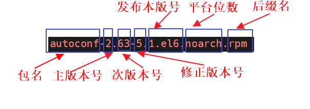

# 1. 包管理

[RedHat/CentOS8 【国内/本地/私有 Yum 源】制作和使用](https://www.jianshu.com/p/68db74388600)

Debian/Ubuntu 采用 `dpkg` 进行软件包的管理，使用 `apt` 进行在线软件的升级。

CentOS/Red Hat/Fedora 采用 `rpm` 进行软件包的管理，使用 `yum` 进行在线软件的升级。

## 1.1. 软件仓库

Windows

- 常有文件程序自解压、选定安装组件和安装路径（个别不让选择路径）、添加注册表项等等，完成以后双击启动运行，卸载时找安装路径下的uninstall或者控制面板里卸载

Linux 或 Unix

- 软件包组织方式上，是将可执行程序、程序库、手册页等多种类型文件打包压缩提供，内容上一般分为预先编译好的二进制包和程序源码包两种；
- 软件包管理方式上，不同开发者开发的软件，被打包集中统一存放在官方维护的软件仓库中，这个软件仓库就是一个软件源，和iOS/Android系统上的AppStore/应用市场等概念很像，Windows也开始使用“Windows Store”；除此外，第三方在遵守相关协议的前提下镜像（mirror）官方软件仓库成为镜像源，系统提供专门的软件包管理器用于从软件源下载、安装和卸载软件包。


## 1.2. RPM
rpm（RPM Package Manager）叫RPM包管理器。

**rpm包**：把二进制程序文件、配置文件以和帮助文档等程序资源打包在一起形成的文件。安装软件需要手动解决依赖关系。

仓库源位置：`/etc/yum.repos.d/`，查看中重点关注是基础的 `CentOS-Base.repo`

RPM 包安装包的格式，下面以 `autoconf-2.63-5.1.el6.noarch.rpm` 安装包为例子。



```sh
# 参数项
-q|--query  
-V|--verify
-i|--install
-U|--upgrade
-e|--erase


# 常见命令
rpm -ql  列出软件中安装的软件包
rpm -e xxx 卸载 xxx 包
rpm -qa xxx 查询安装包
rpm -ivh --force --nodeps *rpm  一次性安装多个软件包
```

## 1.3. Epel

EPEL (Extra Packages for Enterprise Linux), 是由 Fedora Special Interest Group 维护的 Enterprise Linux（RHEL、CentOS）中经常用到的包。

- 官方主页：https://fedoraproject.org/wiki/EPEL
- [阿里云 epel 镜像配置](https://developer.aliyun.com/mirror/epel?spm=a2c6h.13651102.0.0.540e1b11JdpQPV)

## 1.4. Yum

**yum源（rpm软件仓库）**：集中存储rpm包的服务器，通常以http、nfs、ftp、file等协议提供rpm包下载安装服务。互联网中的yum源一般分为发行方和第三方提供。CentOS默认使用发行方yum源。安装软件时会自动解决依赖关系。

**yum配置文件**：CentOS中用于定义yum源位置和使用协议的配置文件，存放在 `/etc/yum.repo.d`目录下的 `*.repo` 文件，为所有仓库提供公共配置。

CentOS8默认开启的yum配置文件有：CentOS-AppStream.repo、CentOS-Base.repo、CentOS-Extras.repo；

CentOS7及以下版本默认开启的yum配置文件有：CentOS-Base.repo、CentOS-Extras.repo、CentOS-Updates.repo。

- **dnf/yum命令**：CentOS中用于从yum源下载rpm包、自动处理包依赖关系，并且能够一次安装所有所依赖rpm包的命令工具。CentOS8建议使用dnf工具，CentOS7及以下只能使用yum工具。两个工具的用法、参数一致。
- **reposync**：用于同步互联网yum源的rpm包到本地磁盘中的命令工具。通过yum源下载yum-utils安装。
- **createrepo**：用于扫描本地磁盘中的rpm包并生成元数据文件，建立本地yum源的命令工具。建成本地yum源后，服务器可以通过file协议使用本地yum源。
- **modifyrepo：**用于导入yum源模块文件的命令工具。

```sh
参数项
repolist

grouplist   可用组
```

## 1.5. apt

### 1.5.1. apt-cache

- `apt-cache search` 搜索包
- `apt-cache show`  获取包的相关信息，如说明、大小、版本等
- `apt-cache depends` 查看软件包的依赖关系
- `apt-cache rdepends` 了解某个具体的依赖,当是查看该包被哪些包依赖吧


### 1.5.2. apt-get

- `apt-get install`  安装xxxx包

  ```bash
  // 离线安装或下载包缓存
  sudo apt-get --download-only install <packagename>
  
  // 下载的包存在 /var/cache/apt/archives 目录下，然后将下载的包移动到指定目录下，打包并发送到离线环境的机器上
  
  // 使用 sudo apt clean 清除缓存
  ```

- `apt-get reinstall`   重新安装包
- `apt-get -f install`  强制安装，"-f = --fix-missing"
- `apt-get remove` 删除包
- `apt-get remove --purge` 删除包，包括删除配置文件等
- `apt-get autoremove --purge` 删除包及其依赖的软件包、配置文件等
- `apt-get update`  更新源(软件列表)
- `apt-get upgrade` 升级已安装的包
- `apt-get clean && apt-get autoclean`  清理下载文件的缓存和只清理过时的包
- `apt-get dist-upgrade` 升级系统
- `apt-get dselect-upgrade` 使用 dselect 升级
- `apt-get build-dep` 安装相关的编译环境
- `apt-get source`  下载该包的源代码
- `apt-get check` 检查是否有损坏的依赖
- `apt-get remove softname1 softname2`  卸载软件
- `apt-get purge sofname1 softname2`      卸载软件同时清除配置文件


### 1.5.3. apt-file
- `apt-file search filename` 查找filename属于哪个软件包
- `apt-file list packagename` 列出软件包的内容
- `apt-file update` 更新apt-file的数据库


## 1.6. dpkg
- `dpkg --info soft_name`  列出软件包解包后的包名称.
- `dpkg -l`  列出当前系统中所有的包.可以和参数less一起使用在分屏查看. (类似于rpm -qa)
- dpkg -l |grep -i "软件包名" --查看系统中与"软件包名"相关联的包.
- dpkg -s 查询已安装的包的详细信息.
- dpkg -L 查询系统中已安装的软件包所安装的位置. (类似于rpm -ql)
- dpkg -S 查询系统中某个文件属于哪个软件包. (类似于rpm -qf)
- dpkg -I 查询deb包的详细信息,在一个软件包下载到本地之后看看用不用安装(看一下呗).
- dpkg -i 手动安装软件包(这个命令并不能解决软件包之前的依赖性问题),如果在安装某一个软件包的时候遇到了软件依- 赖的问题,可以用apt-get -f install在解决信赖性这个问题.
- dpkg -r 卸载软件包.不是完全的卸载,它的配置文件还存在.
- dpkg -P 全部卸载(但是还是不能解决软件包的依赖性的问题)
- dpkg -reconfigure 重新配置
- `dpkg -S filename` -----查找filename属于哪个软件包
- 找到安装的软件
  - `dpkg -S softwarename` 显示包含此软件包的所有位置
  - `dpkg -L softwarename` 显示安装路径
  - `dpkg -l softwarename` 查看软件版本
  - 用 `find` 或 `whereis` 命令查找文件位置


## 1.7. packages repository
1. Ubuntu offical nginx: https://nginx.org/packages/ubuntu/pool/nginx/n/
2. Packages for Linux and Unix: https://pkgs.org/
3. CentOS旧版本软件包的镜像站点: https://vault.centos.org/
4. 阿里云CentSO7镜像: https://mirrors.aliyun.com/centos/7/os/x86_64/Packages/
5. Docker repository: https://download.docker.com/linux/
6. CentOS Vault Mirror: https://vault.centos.org/7.9.2009/
7. Centos Linux 更换源，原官方源已经不再提供服务: https://www.cnblogs.com/007sx/p/18351813
8. Devtoolset 安装与使用: https://weiyan.cc/yuque/%E5%BC%80%E5%8F%91%E8%BF%90%E7%BB%B4/%E7%B3%BB%E7%BB%9F%E4%B8%8E%E7%BC%96%E8%AF%91/2021-09-02-scl-devtoolset-note/
