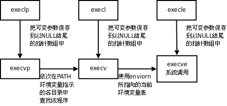
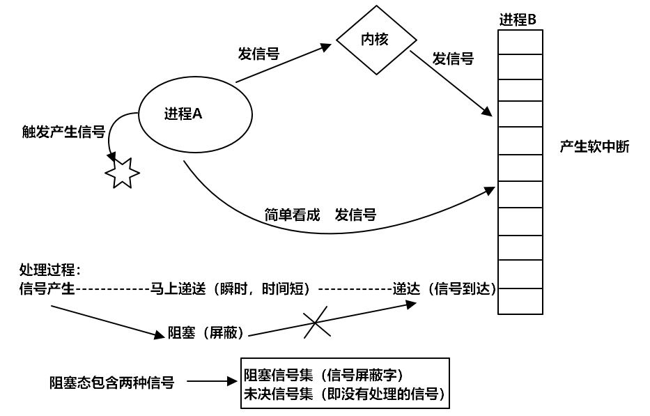
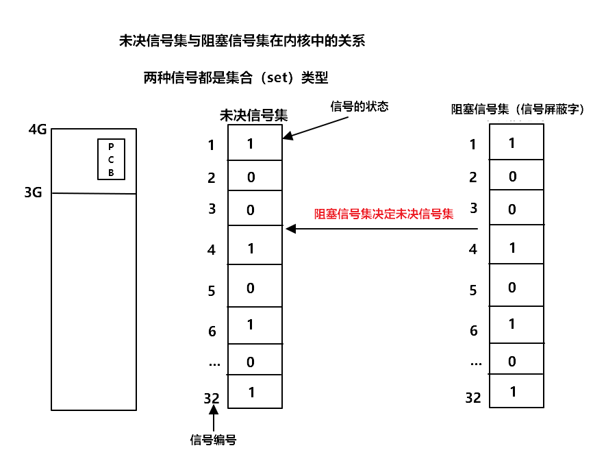

<!--
 * @Author: JohnJeep
 * @Date: 2020-05-23 23:12:17
 * @LastEditTime: 2021-08-17 23:15:39
 * @LastEditors: Windows10
 * @Description: Linux环境编程基础知识
--> 

<!-- TOC -->

- [1. System function](#1-system-function)
  - [1.1. Core concept(概念)](#11-core-concept概念)
  - [1.2. Carriage Return && Line Feed(终端换行)](#12-carriage-return--line-feed终端换行)
  - [1.3. File I/O(文件 I/O)](#13-file-io文件-io)
  - [1.4. Environment variables(环境变量)](#14-environment-variables环境变量)
- [2. Process(进程)](#2-process进程)
  - [2.1. fork()](#21-fork)
  - [2.2. exec()家族](#22-exec家族)
  - [2.3. wait()](#23-wait)
  - [2.4. IPC(Inter Process Communication: 进程间通信)](#24-ipcinter-process-communication-进程间通信)
    - [2.4.1. 参考](#241-参考)
    - [2.4.2. Pipe(管道)](#242-pipe管道)
      - [2.4.2.1. Named pipe](#2421-named-pipe)
      - [2.4.2.2. Unnamed pipe](#2422-unnamed-pipe)
    - [2.4.3. Mmap(shared memory map: 共享映射区)()](#243-mmapshared-memory-map-共享映射区)
    - [2.4.4. Signal(信号)](#244-signal信号)
    - [2.4.5. Semaphore(信号量)](#245-semaphore信号量)
    - [2.4.6. Message queues(消息队列)](#246-message-queues消息队列)
    - [2.4.7. Socket(套接字)](#247-socket套接字)
  - [2.5. Race condition(时序竞态)](#25-race-condition时序竞态)
  - [2.6. Terminal(终端)](#26-terminal终端)
  - [2.7. Process group(进程组)](#27-process-group进程组)
  - [2.8. Daemon(守护进程)](#28-daemon守护进程)
- [3. Thread(线程)](#3-thread线程)
  - [3.1. Core concepts(基础概念)](#31-core-concepts基础概念)
  - [3.2. Function(线程相关函数)](#32-function线程相关函数)
  - [3.3. 线程属性设置](#33-线程属性设置)
  - [3.4. 注意事项](#34-注意事项)
  - [3.5. 线程同步](#35-线程同步)
  - [3.6. 线程之间死锁的原因](#36-线程之间死锁的原因)
  - [3.7. Mutex(线程互斥)](#37-mutex线程互斥)

<!-- /TOC -->

# 1. System function

## 1.1. Core concept(概念)
- 文件函数包括三部分内容
  - `file descriptor`  文件描述符
  - `file pointer(fp)` 文件指针
  - `file buffer`     文件数据缓冲区 

- 文件描述符返回值
  - `0` 标准输入
  - `1` 标准输出
  - `2` 错误
  - `3` 文件指针

- 全部的错误变量 `errno` 在Linux中存放的位置： `/usr/include`
- `perror()`:  打印错误的信息
- 文件的实际权限 = 用户给定的权限和本地的掩码取反做位与（&）操作


## 1.2. Carriage Return && Line Feed(终端换行)
- 关于打印
  > 在机械打字机时代，打字机上有个“打印头（print head）”的零部件，打印时从左往右自动移动，满一行时需要手动推到最左边，这个动作叫“回车（Carriage Return）”，同时卷轴需要向上卷使纸张上移一行，打印头相对于纸张就是下移一行，这个动作叫做“移行（Line Feed）”。
  - ANSI标准规定，转义字符“\r”指代CR，“\n”指代LF，计算机系统早期广泛采用` CR+LF`指示换行。
  - UNIX系统时代存储资源很贵，仅采用1个字符“\n”指示换行，而MS-DOS出于兼容性采用“\r\n”指示换行，后来搬到了Windows上，而Mac系统则采用“\r”指示换行，Linux、Cygwin照搬了“\n”
  - “\r\n”换行的文本文件在Windows显示正常，在UNIX、Linux、Cygwin中行末多出1个“^M”，“^M”指真实的Ctrl-M组合字符；“\n”换行的文本文件在UNIX、Linux、Cygwin显示正常，在Windows中整个文件显示为一行。


- C语言换行符
  > C语言中虽然也有转义字符‘\r’、‘\n’，但并不保证与ASCII码CR、LF等价，在文本模式下，写入‘\n’由系统底层翻译成换行符，读入文本时换行符再由系统底层翻译为‘\n’。UNIX系统正是C语言写出来的，系统底层就使用LF作换行符，系统内外表示一致不需翻译；而MS-DOS、Windows系统底层，则在系统内外需要进行‘\n’与CR+LF的转换工作。


## 1.3. File I/O(文件 I/O)
- `open()` 函数
  - 创建：`O_CREAT` 或采用 `截断为0的方式创建 O_TRUNC`
  - 读写：`O_RDWR`
  - 只读：`O_RDONLY`
  - 只写：`O_WRONLY`
  - 文件是否存在：`O_EXCL`

- `read()/write()` 函数
  - `-1` 读/写文件失败
  - `0`  文件读完了或文件写成完了
  - `>0` 读/写文件的字节数

- `lseek()` 函数 
  - 获取文件的长度
  - 移动文件指针
  - 文件拓展（只能向文件的中间或尾部扩展，不能向前端扩展）

- `stat()`: 查看文件的所有状态信息。进行追踪或穿透，显示追踪到的文件或软连接指定的文件信息。
- `lstat()`: 查看文件的状态信息。不进行追踪或穿透，直接显示当前文件或软连接的信息。
- `access()`: 测试指定文件是否拥有某种权限。 
- `chmod()`: 改变文件的权限

- `truncate()` 将指定文件的大小由指定参数 `length` 长度确定，
  - `length` 长度大于当前文件，文件将被拓展
  - `length` 长度小于当前文件，文件截取，截取值为 `length` 值

- `readlink()`: 读一个软链接的值

- `unlink()` 
  - 删除一个硬链接数
  - 可以读取临时文件的内容。先创建文件，向文件写，然后读文件中写的内容并将读出的数据写到另外的一个文件中。

- `opendir()`: 打开一个目录
- `readdir()`: 读一个目录
- `closedir()`: 关闭一个目录

- `dup()` 或 `dup2()` 复制文件描述符
  ```
  int dup(int fd);  //复制fd对应的文件表指针，返回下一个可用的文件描述符
  int dup2(int fd1, int fd2); //将fd2对应的文件表指针修改为fd1对应的文件表指针
  ```

- `fcntl` 改变已经打开文件的属性，即获取或设置文件的状态标记。
  - `F_GETFL` 获取文件状态参数
  - `F_SETFL` 设置文件状态参数
   

## 1.4. Environment variables(环境变量)
- 常见的环境变量
  - `PATH ` 指定可执行文件搜索路径
  - `SHELL` 指定当前所使用的命令解析器
  - `TERM ` 当前终端类型
  - `LANG ` 指定语言环境
  - `HOME ` 用户主目录

- 常见的环境变量函数 
  - `getenv()` 获取环境变量值
  - `setenv()` 设置环境变量值
	  - 3个参数
			- `1`  覆盖原值
			- `0`  不覆盖
			- `-1` 出错
  - `unsetenv()` 删除环境变量


# 2. Process(进程)
- 什么是进程？
  > 在计算中，进程是由一个或多个线程执行的计算机程序的实例。它包含程序代码（code）和运行指令（activity）。取决于操作系统（OS），一个进程可能由多个并行执行指令的执行线程组成。程序本身只是指令、数据及其组织形式的描述，相当于一个名词，进程才是程序（那些指令和数据）的真正运行实例。 


## 2.1. fork()
- 创建一个子进程。一个进程调用 `fork()` 函数，变为两个进程，各自的进程都有一个返回值。父进程返回值为子进程的 `PID`（返回值大于0），子进程的返回值为 `0`，进程创建成功。
- 父子进程之间遵循原则：`读时共享写时复制`。例如：一个全局变量，子进程只读时，则父子进程共享变量；若子进程对全局变量写操作时，则不共享全局变量。
- 父子进程共享
  - 共享文件描述符。
  - 共享 `mmap` 建立的映射区。
- 执行 `fork` 操作之后，是父进程先执行还是子进程先执行，是不确定的，取决于系统内的调度算法。
- 子进程与父进程异同点
  - 相同
    - 全局变量 
    - .data
    - .text
    - 栈、堆
    - 环境变量
    - 用户 ID
    - 宿主目录
    - 进程工作目录
    - 信号处理方式
  - 不同
    - 进程控制块(当前进程的父进程ID)
    - PID
    - fork返回值
    - 定时器
    - 未决信号集
    - 进程运行时间 


- 可能用到的函数
  - `getpid()`  获取子进程PID号
  - `getppid()` 获取父进程PID号
  - `getuid()`  获取当前进程实际用户ID号
  - `geteuid()` 获取当前进程有效用户ID号
  - `getgid()`  获取当前进程实际用户组ID号
  - `getegid()` 获取当前进程有效用户组ID号


## 2.2. exec()家族
- 执行 `exec()` 家族的函数后，将当前进程的内存空间数据替换为要执行函数的内存空间数据。
- exec()家族函数只有失败时才返回，返回值为 -1，程序执行成功时，含食宿不会返回。
  ```
  l (list)			   命令行参数列表
  p (path)			   搜素file时使用path变量
  v (vector)			 使用命令行参数数组
  e (environment)	使用环境变量数组,不使用进程原有的环境变量，设置新加载程序运行的环境变量
  ```
  
- `execlp()`: 加载一个进程，通过环境变量加载。
- `execl()`: 加载一个进程，通过路径 + 程序名称来加载。
- `execle()`: 加载一个进程，通过路径 + 程序名称来加载，使用自定义环境变量env。
- `execv()`: 加载一个进程，使用命令行参数数组。
- `execvp()`: 加载一个进程，使用自定义环境变量env
- `execvpe()`: 加载一个进程，使用命令行参数数组，并加上自定义环境变量env。


## 2.3. wait()
- 什么是孤儿进程？
  > 父进程先与子进程死亡，子进程就成为了孤儿进程，此时子进程的父进程的变为 `init` 进程，`init` 进程也称为init进程领养孤儿进程。

- 什么是僵尸进程
  > 子进程结束了，父进程没有回收子进程的内存空间，而子进程的进程控制块（PCB）还存留于操作系统的内核之中，此时的子进程称为僵尸进程（zombie）。

- `wait()` 函数作用
  - 阻塞等待子进程退出
  - 回收子进程的PCB内存空间资源
  - 获取子进程死亡的原因 
  ```c
  // 子进程退出的几种常见的宏

  if (WIFEXITED(wstatus))         // 进程正常结束
  {
      printf("exited, status=%d\n", WEXITSTATUS(wstatus));
  } 
  else if (WIFSIGNALED(wstatus))  // 进程异常终止
  {
      printf("killed by signal %d\n", WTERMSIG(wstatus));
  }
  else if (WIFSTOPPED(wstatus))   // 进程处于暂停状态
  {
      printf("stopped by signal %d\n", WSTOPSIG(wstatus));
  } 
  else if (WIFCONTINUED(wstatus)) 
  {
      printf("continued\n");
  }
  ```

- 一个 `waitpid()` 或`wait()` 函数只能回收一个僵尸进程。回收多个僵尸进程需要循环调用 `waitpid()` 或`wait()` 函数。

- `waitpid()` 函数
  - 函数原型 `pid_t waitpid(pid_t pid, int *wstatus, int options);`
  - 参数
    - `pid` 指定特定的进程PID，
      - 当 `pid=-1` 时，传入的是任意进程的PID
      - 当 `pid=0` 时，回收当前进程组内（group）的所有子进程；
      - 当 `pid=-进程组id` 时，回收指定进程组内的任意子进程。
    - `*wstatus` 子进程退出的状态
    - `options` 可以将进程设置为阻塞态（设置为 0）或运行态（设置为 WNOHAGN）
  - 函数返回值
    - 正常运行：pid
    - 失败：-1
    - 当 `options=WNOHAGN`时，子进程为非阻塞状态且子进程尚未结束时，返回值为 0
  - 函数作用：指定特定的进程PID 进行僵尸进程的回收。子进程的状态可以设置为不阻塞，使用宏 `WNOHAGN`


## 2.4. IPC(Inter Process Communication: 进程间通信)
- Linux中七种文件类型
  - 非伪文件：占用磁盘的存储空间
    - `-` 普通文件
    - `d(directory)` 目录
    - `l(link)` 链接
  
  - 伪文件：不占用磁盘的存储空间
    - `s(socket)` 套接字
    - `b(block) ` 块设备
    - `c(char)  `字符设备
    - `p(pipe)  `管道


- 6种方式
  - Pipe(管道：最简单)
  - Signal(信号：开销最小)
  - Mmap(共享映射区：无血缘关系)
  - Socket(本地套接字：最稳定) 
  - Message queue(消息队列)
  - Semaphore(信号量)

### 2.4.1. 参考
- [进程间的通信方式——pipe（管道）](https://blog.csdn.net/skyroben/article/details/71513385)
- [进程间通信--管道](http://blog.chinaunix.net/uid-26833883-id-3227144.html)
- [基于Internet的Linux客户机/服务器系统通讯设计与实现](https://blog.csdn.net/violet_echo_0908/article/details/50277537)
- [Linux进程间套接字（Socket）通信](https://blog.csdn.net/violet_echo_0908/article/details/49670901)
- [Linux下socket编程实现客户机服务器通信的例子](https://blog.csdn.net/violet_echo_0908/article/details/49539593)
- [信号量与互斥锁](https://www.cnblogs.com/diyingyun/archive/2011/12/04/2275229.html)
- [信号量](http://blog.chinaunix.net/uid-23193900-id-3194924.html)
- [Linux进程间通信——使用共享内存](https://blog.csdn.net/ljianhui/article/details/10253345)
- [Linux进程间通信(四) - 共享内存](https://www.cnblogs.com/linuxbug/p/4882776.html)
- [UNIX/Linux进程间通信IPC系列（四）消息队列](https://blog.csdn.net/yang_yulei/article/details/19772649)
- [进程间通信的方式——信号、管道、消息队列、共享内存](https://www.cnblogs.com/luo77/p/5816326.html)


### 2.4.2. Pipe(管道)
- 分类
  - 匿名管道(named pipe)
  - 有名管道(unnamed pipe) 
  
- 管道本质：是一个伪文件，从内核创建的一个缓冲区。有两个文件描述符引用，一个表示Read(读端)，一个表示Write(写端)。
  - `fd[0]`---------------管道的 read 端
  - `fd[1]`---------------管道的 write 端


#### 2.4.2.1. Named pipe
- pipe 匿名管道：用于非血缘关系之间的进程通信。

- 原理
  - 通过环形队列，借助内核缓冲区（4k大小）来实现的，数据从写端流入管道，从读端流出，这样就实现了进程间通信。 
- 局限性
  - 数据不能自己读写
  - 数据一旦被读走，管道中就没有了，不能反复读取。
  - 管道采用半双工通信方式，数据只能在一个方向上流动。
  - 只能在有 `公共祖先` 的进程间使用管道。

- 管道中数据的读与写
  - 人为的规定：子进程从管道中 `read`，父进程从管道中 `write`。 
  - 读管道
    - 管道中有数据
      - `read()` 返回实际读到的字节数。
    - 管道中无数据
      - 管道 `写端` 被全部关闭: `read()` 返回皇子为 0
      - 管道 `写端` 没有被全部关闭: `read()` 阻塞等待。
  - 写管道 
    - 管道读端全部关闭
      -  进程异常终止。可用 `SIGPIPE` 来捕捉信号。 
    - 管道读端没有全部关闭
      - 管道已满，write阻塞。
      - 管道未满，write将数据写入，并返回实际写入的字节数。


#### 2.4.2.2. Unnamed pipe
有名管道中 `FIFO`是典型的有名管道。


### 2.4.3. Mmap(shared memory map: 共享映射区)()
- 参考
  - [认真分析mmap：是什么 为什么 怎么用](https://www.cnblogs.com/huxiao-tee/p/4660352.html) 

  
- 当标志位flags等于 `MAP_SHARED` 时，创建映射区的权限要小于等于打开文件的权限。
- 当标志位flags等于 `MAP_PRIVATE` 时，对映射区的权限没有要求，因为 mmap中的权限是对内存的限制。
- 创建映射区的过程中隐含的有对映射区的 `读操作权限`。
- 映射的文件大小为 `0` 时，不能再创建映射区。因此，用于映射的文件必须要有实际的大小。
- 打开或创建的文件偏移量必须为 `4k的正数倍`。因为MMU创建的页大小为 4K。
- mmap 使用的过程中常常出现 `总线错误`，通常是由于共享文件存储空间大小导致的。
- `munmap` 函数传入的地址一定是 `mmap` 函数的返回地址。
- 映射区的返回值一定需要检查，防止出错。

文件映射到磁盘的内存区域，可以简单的把映射的区域看做一个的类似的数组，即一个指针指向数组的首地址。


- 父子间进程通信
  - 共享打开的文件
  - 当标志位 `flags=MAP_SHARED` 时，共享建立的映射区 。当 `flags=MAP_PRIVATE` 时，父子进程的内核映射区相互独立的，各占一个映射区。


- 匿名映射
  - 采用宏 `MAP_ANONYMOUS` 的方式，不需要再使用文件的方法去操作 mmap
  - 注意：只适用于类Linux操作系统中，对其它的操作系统（freeBSD）不适用。 


- 通用的方法
  - 通过 `/dev/zero` 目录中系统自带的伪文件 `zero`，去操作 mmap，实现内存映射。


- 非血缘关系之间的进程通信，即不同的文件之间通信。
  - 创建映射区的文件只有一个
  - 可以多端读和多端写 
  


### 2.4.4. Signal(信号)
- `man 7 signal` 查看信号的帮助文档
- `信号`：只能携带固定大小量的信息。

- 进程控制块(PCB)信息
  - 进程pid
  - 进程状态
  - 工作目录
  - 用户id
  - 组id
  - 文件描述符表
  - 信号相关的信息，主要指阻塞信号集和未决信号集。

- 产生信号的机制
  - 通过软件的方式实现的，有一定的延迟性（对CPU而言），对用户来说，延时很短，不易察觉。
  - 每个进程收到的所有信号，都是由内核负责发送，内核进行处理。

- 产生信号的几种方式
  - 按键产生，如：`Ctrl+c(SIGINT信号)`、`Ctrl+z(SIGTSTP信号)`、`Ctrl+\(SIGQUIT信号)`
  - 系统调用产生，如：`kill`、`raise`、`abort`
  - 软件条件产生，如：定时器 `alarm`
  - 硬件异常产生，如：非法访问内存(段错误)、除0(浮点数例外)、内存对齐出错(总线错误)
  - 命令产生，如：`kill` 命令

- 信号的处理方式
  - 执行默认动作 
    - 终止进程 
    - 终止进程并产生core文件，方便调试
    - 忽略信号
    - 暂停（stop）
    - 继续（continue） 
  - 忽略(丢弃) ，并不是不处理信号，而是将信号处理后再进行忽略或丢弃。
  - 捕捉(调用户处理函数)


- 阻塞信号集(信号屏蔽字)： 
  - 将某些信号加入集合，对他们设置屏蔽，当屏蔽x信号后，再收到该信号，该信号的处理将推后(解除屏蔽后)
- 未决信号集
  - 信号产生，未决信号集中描述该信号的位立刻翻转为1，表信号处于未决状态。当信号被处理对应位翻转回为0。这一时刻往往非常短暂。 
  - 信号产生后由于某些原因(主要是阻塞)不能抵达。这类信号的集合称之为未决信号集。在屏蔽解除前，信号一直处于未决状态。 



- 信号的四要素
  - 信号的名字
  - 信号的编号
  - 事件
  - 默认处理动作

- 两个特殊的信号（9----SIGKILL，19----SIGSTOP）不允许信号的忽略和捕捉，只能允许执行默认动作。
- 查看系统的进程运行的时间 `time` 命。进程实际运行的时间 = 系统态运行时间 + 用户态运行时间 + 系统等待事件

- 向进程发送信号的函数
  - `kill()` 给指定的进程发送指定的信号。
  - `raise()` 给当前进程发送指定的信号。 
  - `abort()` 给当前进程发送异常终止信号 `6)SIGABRT`，并产生core文件。

- `alarm()` 函数
  - 定时精度为 ms 级别 
  - 函数的返回值为：上一次闹钟定时剩余的次数。 
  - 每个进程有且只有一个定时器 

- `setitimer()`函数
  - 定时器的精度为 us 级别
  - 可以设置周期性的定时 

- 信号集合
  - 信号集设定
    - `int sigemptyset(sigset_t *set);` 将信号位清空（置0）
    - `int sigfillset(sigset_t *set);`  将某个信号集置1
    - `int sigaddset(sigset_t *set, int signum);`  将某个信号加入信号集
    - `int sigdelset(sigset_t *set, int signum);` 将某个信号清出信号集
    - `int sigismember(const sigset_t *set, int signum);` 判断某个信号是否在信号集中
  - `sigprocmask()函数` 屏蔽信号或解除屏蔽
  - `sigpending()函数` 读取当前进程的 `未决信号集`


- 信号的捕捉
  - `signal()`：注册一个信号捕捉函数
  - `sigaction()`： 检测或修改信号处理动作，即注册一个信号捕捉函数。
    - `sigaction()` 函数默认使系统调用中断后不再重新启动。
    - `sa_handler` 指定信号捕捉后的处理函数名(即注册函数)。也可赋值为 `SIG_IGN` 表忽略 或 `SIG_DFL` 表执行默认动作
    - `sa_mask` 一个信号集在调用信号捕捉函数之前，要将这个信号集加到进程的信号屏蔽字中，仅当从信号捕捉函数返回时，再将进程的信号屏蔽字恢复为原先值。这样，在调用信号处理程序时就能阻塞某些信号。
      > 注意：仅在处理函数被调用期间屏蔽生效，是临时性设置。
    - `sa_flags` 通常设置为0，表使用默认属性，信号捕捉函数执行期间自动屏蔽本信号。
    - `sa_flags` 参数
      - `SA_INTERRURT` 不重启
      - `SA_RESTART` 重启    
      - `SA_NODEFER` 不希望自动阻塞捕捉到的信号。
   

- 函数
  - `pthread_sigmask()` :每个线程均有自己的信号屏蔽集（信号掩码），可以使用 `pthread_sigmask` 函数来屏蔽某个线程对某些信号的响应处理，仅留下需要处理该信号的线程来处理指定的信号。
  - `sigwait()`: sigwait是同步的等待信号的到来，而不是像进程中那样是异步的等待信号的到来。


### 2.4.5. Semaphore(信号量)
- 是互斥量的加强版。
- 信号量的初值，决定了信号量占用的线程个数。
- 信号量相关函数
  -	`sem_init` 函数
	- `sem_destroy`函数
	- `sem_wait` 函数
	- `sem_trywait` 函数	
	- `sem_timedwait` 函数	
	- `sem_post` 函数


### 2.4.6. Message queues(消息队列)
- 什么是消息队列？
  > 维基百科解释：在计算机科学中，消息队列（英语：Message queue）是一种进程间通信或同一进程的不同线程间的通信方式，软件的贮列用来处理一系列的输入，通常是来自用户。消息队列提供了异步的通信协议，每一个贮列中的纪录包含详细说明的资料，包含发生的时间，输入设备的种类，以及特定的输入参数，也就是说：消息的发送者和接收者不需要同时与消息队列交互。消息会保存在队列中，直到接收者取回它。
  

- 消息队列特点
  1. 消息队列是消息的链表，具有特定的格式，存放在内存中并由消息队列标识符标识。
  2. 消息队列允许一个或多个进程向它写入与读取消息。
  3. 管道和消息队列的通信数据都是先进先出的原则。
  4. 消息队列可以实现消息的随机查询，消息不一定要以先进先出的次序读取，也可以按消息的类型读取。比 FIFO 更有优势。
  5. 消息队列克服了信号承载信息量少，管道只能承载无格式字节流以及缓冲区大小受限等缺。
  6. 消息队列常常保存在链表结构中，拥有权限的进程可以向消息队列中写入或读取消息。

分类
- 目前主要有两种类型的消息队列：POSIX 消息队列以及 System V 消息队列。
- System V 消息队列目前被大量使用，系统V消息队列是随内核持续的，只有在内核重起或者人工删除时，该消息队列才会被删除。

两种模式
- 点对点模式
- 发布与订阅者模式


- 用途
  - 异步处理：处理如短信下发、状态推送、用户注册、数据同步等功能，提高系统的并发能力，集中力量处理重要的部分（同步处理），将非核心功能丢给MQ。
  - 系统解耦：可在模块、服务、接口等不同粒度上实现解耦。
  - 重试补偿：在跨机器数据传输的整个过程中，只要任意一个环节出错，都会导致问题的产生。可以通过MQ的重试补偿机制去尽可能的处理掉这些异常。
  - 流量削锋：对于秒杀场景下的下单处理。服务器收到消息后，首先写入消息队列，然后按照自己的消息处理能力做处理。
  - 日志处理：可以定时将日志写入MQ，并且主动订阅日志记录。


### 2.4.7. Socket(套接字)


## 2.5. Race condition(时序竞态)
> 时序竞态也叫竞态条件。

- `pause()` 函数
  - 作用：将进程主动挂起，等待信号唤醒。调用该函数的进程将被阻塞，直到有信号递达将其唤醒。
- `sigsuspend()` 函数
  - 作用：通过传递的参数mask进程信号屏蔽字解决使用 `pause()` 函数导致的时序竞争的问题。

- 多个进程之间使用 `全局变量` 时，可能会导致进程卡死的情况，尽量少使用全局变量或者在访问之前需要加锁。

- 可重入函数
  - 定义：函数内不能含有 `static`变量和 `全局变量`。反之就是不可重入函数。
  - 信号捕捉函数应设置为可重入函数。
- 不可重入函数特征、
  - 含有静态的数据结构
  - 调用了`malloc`和`free`函数
  - 是标准的I/O函数

- `SIGCHLD` 信号回收子进程
  - 子进程接收到 `SIGSTOP` 信号停止，子进程处在停止态时，接受到 `SIGCONT` 后唤醒


## 2.6. Terminal(终端)
- 分类
  - 字符终端
  - 网络终端
  - 伪终端(Pseudo Terminal) 

- linux系统启动流程
  ```
  init--->fork--->exec--->getty--->用户输入账号--->login--->输入密码--->exec--->bash
  ```


## 2.7. Process group(进程组)
- 每个进程都有一个进程组，当父进程，创建子进程的时候，默认子进程与父进程属于同一进程组。
- 进程组生存期：进程组创建到最后一个进程离开(终止或转移到另一个进程组)。
- 相关函数
  - `getpgrp()` 获取当前进程的进程组ID
  - `getpgid()` 获取指定进程的进程组的ID 
  - `setpgid()` 改变进程默认所属的进程组


## 2.8. Daemon(守护进程)
- 通常独立于控制终端并且周期性地执行某种任务或等待处理某些发生的事件。
- 创建守护进程模型
  - 创建子进程，父进程退出。所有工作在子进程中进行形式上脱离了控制终端
  - 子进程中创建新会话。`setsid()` 函数，使子进程完全独立出来，脱离控制
  - 改变当前目录为根目录。`chdir()`函数,　防止占用可卸载的文件系统
  - 重设文件权限掩码。`umask()` 函数，防止继承的文件创建屏蔽字拒绝某些权限，增加守护进程灵活性
  - 关闭文件描述符。即重定向 `0/1/2` 到 `/dev/null`，采用函数 `dup2()`
  - 开始执行守护进程核心工作。
  - 守护进程退出处理程序模型。
- 守护进程不会随用户的注销而退出，会一直在后台运行。

- 安装man posix page `sudo apt-get install manpages-posix-dev`


# 3. Thread(线程)

## 3.1. Core concepts(基础概念)
 
- 进程与线程的区别？
  - 根本区别：`进程` 是操作系统资源分配的最小单元，`线程` 是任务调度和执行的最小单元。
  - 在性能开销方面：每个进程独享一块地址空间，有属于自己的进程控制块(PCB)，但子进程与父进程共享进程地址空间，进程之间的切换会有较大的开销；线程可以看做轻量级的进程，同一类线程共享代码和数据空间，每个线程都有自己独立的运行栈和程序计数器（PC），线程之间切换的开销小。
  - 所处环境：在操作系统中能同时运行多个进程（程序）；而在同一个进程（程序）中有多个线程同时执行，通过CPU调度，在每个时间片中只有一个线程执行。
  - 内存分配方面：系统在运行的时候会为每个进程分配不同的内存空间；而对线程而言，除了CPU外，系统不会为线程分配内存（线程所使用的资源来自其所属进程的资源），线程组之间只能共享资源。
  - 包含关系：没有线程的进程可以看做是单线程的，如果一个进程内有多个线程，则执行过程不是一条线的，而是多条线程共同完成的；线程是进程的一部分，线程是轻量级的进程(LWP: light weight process)，可以看做是寄存器和栈的集合。


- 查看指定的线程号LWP: `ps -Lf pid(进程)` 。
  - `线程号` 是CPU分配时间轮片的依据。
  - `线程ID` 是在进程内区分不同的线程

- 线程共享哪些资源？
  - 共享文件描述符
  - 共享当前线程的工作路径
  - 共享信号的处理方式。（信号与线程混合在一起比较复杂，尽量将两者分开，单独实现）
  - 共享用户ID和组ID
  - 共享内存空间（.text/.data/.bss/heap/共享库，唯独不共享栈空间）。线程之间共享全局变量，进程之间不共享全局变量。


- 线程哪些资源不是共享的？
  - 线程ID
  - 处理器现场（寄存器的值）和栈指针
  - 用户栈空间（函数运行占用的空间）
  - error变量（是.data段中一个全局的变量，但每个线程独享error变量） 
  - 信号屏蔽字
  - 线程调度的优先级


## 3.2. Function(线程相关函数)
- `pthread_self()`    获得调用线程的线程ID号
- `pthread_create()`  创建一个线程 
- 线程退出相关的函数
  - `pthread_exit()`  将单个线程退出
  - `exit()`          将进程退出
  - `return语句`      函数返回到调用者处 


- `pthread_join()` 将子线程回收，回收的是线程的资源。线程没有结束，会一直阻塞等待。 
- `pthread_detach()` 实现线程的分离。
  - 返回值：成功返回 `0`，失败返回失败的错误码。 
  - 一般情况下，线程终止后，它的终止状态一直保留到其它线程调用 `pthread_join()` 获取它的状态为止。
  - 不能对已经处于 `detach` 状态的线程调用 `pthread_join()` 函数，因为处于 `detach` 状态的线程终止后，就会立刻回收它占用的资源，而不是保留终止的状态。
  - 作用：线程结束时自动清理进程控制块PCB资源。

- `pthread_cannel()` 杀死或取消线程。
  - 线程的取消并不是实时的，有一定的延时性，需要等待线程达到某个取消点。若子线程中没有使用系统调用，`pthread_cannel()` 函数无法到达取消点，则 `pthread_cannel()` 不会执行，需要手动添加一个取消点函数 `pthread_testcancel()`。
  - 取消点：粗略的理解为是一个系统调用。


## 3.3. 线程属性设置
- 主要用的属性
  - `pthread_attr_init()` : 线程属性的初始化
  - `pthread_attr_destory()` : 线程属性的销毁
  - `pthread_attr_setdetachstate()` : 修改线程的属性分离
  - `pthread_attr_setstack()` : 修改线程的栈空间地址和大小
  - `pthread_attr_setstacksize()` : 只修改线程的栈空间大小


## 3.4. 注意事项
- 查看当前线程库版本（NPTL） `getconf GNU_LIBPTHREAD_VERSION`
- 主线程退出而子线程不退，则主线程调用 `pthread_exit()`
- 避免僵尸线程的方法
  - 调用 `pthread_join()`
  - 直接将线程设置为分离态 `pthread_detach()`
  - 在创建子线程之前，将线程的属性设置为分离属性，即创建线程时就指定其属性。
- 应该避免在多线程中使用 `fork()` 函数。因为使用 `fork()` 函数会创建一个新的进程，而在新创建的进程中，只有采用 `fork()` 函数创建进程的线程会存在，其它的线程都会调用 `pthread_exit()` 函数而直接退出。
- 应尽量少将线程和信号结合在一起使用，否则会变得非常复杂。
- 采用 `malloc()` 和 `mmap()` 函数申请的空间，可以在多个线程中进行释放。


## 3.5. 线程同步
- 多个线程访问同一个资源，导致数据混乱的原因
  - 共享数据
  - 竞争
  - 多个线程之间没有统一的调度（竞争）机制。 

- 互斥
  - 产生的原因：解决多个线程之间没有统一的调度（竞争）机制。 
 

## 3.6. 线程之间死锁的原因
- 导致线程死锁的原因
  > 多个线程同时被阻塞，它们中的一个或者全部都在等待某个资源被释放，而该资源又被其他线程锁定，从而导致每一个线程都得等其它线程释放其锁定的资源，造成了所有线程都无法正常结束。这是从网上其他文档看到的死锁产生的四个必要条件：
  - 1、互斥使用，即当资源被一个线程使用(占有)时，别的线程不能使用。
  - 2、不可抢占，资源请求者不能强制从资源占有者手中夺取资源，资源只能由资源占有者主动释放。
  - 3、请求和保持，即当资源请求者在请求其他的资源的同时保持对原有资源的占有。
  - 4、循环等待，即存在一个等待队列：P1占有P2的资源，P2占有P3的资源，P3占有P1的资源。这样就形成了一个等待环路。
  
  > 当上述四个条件都成立的时候，便形成死锁。当然，死锁的情况下如果打破上述任何一个条件，便可让死锁消失。


- 锁机制
  - 互斥锁：确保同一时间只能有一个线程访问共享资源。当锁被占用时试图对其加锁的线程都进入阻塞状态(释放CPU资源使其由运行状态进入等待状态)。当锁释放时哪个等待线程能获得该锁取决于内核的调度。
  - 读写锁：当以写模式加锁而处于写状态时任何试图加锁的线程(不论是读或写)都阻塞，当以读状态模式加锁而处于读状态时“读”线程不阻塞，“写”线程阻塞。读模式共享，写模式互斥。
  - 条件变量：可以以原子的方式阻塞进程，直到某个特定条件为真为止。对条件的测试是在互斥锁的保护下进行的。条件变量始终与互斥锁一起使用。
  - 自旋锁：上锁受阻时线程不阻塞而是在循环中轮询查看能否获得该锁，没有线程的切换因而没有切换开销，不过对CPU的霸占会导致CPU资源的浪费。 所以自旋锁适用于并行结构(多个处理器)或者适用于锁被持有时间短而不希望在线程切换产生开销的情况。


## 3.7. Mutex(线程互斥)
- 线程访问共享数据之前需加锁，访问共享数据之后应立即解锁，不能有延迟时间，即锁的 `粒度` 应越小越好。
- 互斥量(mutex)常见函数
  - `pthread_mutex_init()`
  - `pthread_mutex_destroy()`
  - `pthread_mutex_lock()`
  - `pthread_mutex_trylock()`
  - `pthread_mutex_unlock()`


- 读写锁(read-write lock)常见函数
  - `pthread_rwlock_init()`
  - `pthread_rwlock_destroy()`
  - `pthread_rwlock_rdlock()`  
  - `pthread_rwlock_wrlock()`
  - `pthread_rwlock_tryrdlock()`
  - `pthread_rwlock_trywrlock()`
  - `pthread_rwlock_unlock()`


- 条件变量(condition)常见函数
  - `pthread_cond_init()`
  - `pthread_cond_destroy()`
  - `pthread_cond_wait()`
    - 阻塞一个条件变量
    - 释放已经获得的互斥锁
    - 当线程被唤醒时，`pthread_cond_wait()` 会返回并解除阻塞，重新申请获得互斥锁。
  - `pthread_cond_timedwait()`
    - 限时等待一个条件变量 
  - `pthread_cond_signal()`
    - 唤醒至少一个阻塞在条件变量上的线程 
  - `pthread_cond_broadcast()`
    - 唤醒全部阻塞在条件变量上的线程 


- Linux绝对时间是相对于 `1970:00:00:00` 这个时间的；如何操作？
  ```c
  time_t cur = time(NULL);                     // 获取当前时间
  struct timespec t;
  t.tv_sec = cur + 10;                         // 在1970:00:00:00这个时间点上偏移10秒
  pthread_cond_timedwait(&cond, &mutex, &t)    // 调用pthread_cond_timedwait()函数
  ```
