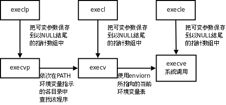

<!--
 * @Author: JohnJeep
 * @Date: 2020-05-23 23:12:17
 * @LastEditTime: 2020-06-21 12:12:48
 * @LastEditors: Please set LastEditors
 * @Description: 系统函数的使用
--> 

<!-- TOC -->

- [1. System function](#1-system-function)
  - [1.1. 概念](#11-概念)
  - [1.2. 函数](#12-函数)
  - [1.3. 环境变量](#13-环境变量)
- [2. 进程](#2-进程)
  - [2.1. fork函数](#21-fork函数)
  - [2.2. exec函数家族](#22-exec函数家族)
  - [2.3. wait函数](#23-wait函数)
  - [2.4. 进程间通信（IPC）](#24-进程间通信ipc)
    - [2.4.1. 管道](#241-管道)
    - [2.4.2. 共享映射区(mmap)](#242-共享映射区mmap)
    - [2.4.3. 信号](#243-信号)
  - [2.5. 时序竞态](#25-时序竞态)
  - [2.6. 终端](#26-终端)
  - [2.7. 进程组](#27-进程组)
  - [2.8. 守护进程（daemon）](#28-守护进程daemon)
- [3. 线程](#3-线程)
  - [3.1. 基础概念](#31-基础概念)
  - [3.2. 线程相关函数](#32-线程相关函数)
  - [3.3. 线程属性设置](#33-线程属性设置)
  - [3.4. 注意事项](#34-注意事项)
  - [3.5. 线程同步](#35-线程同步)
  - [3.6. 线程互斥](#36-线程互斥)
  - [3.7. 信号量](#37-信号量)

<!-- /TOC -->

# 1. System function
## 1.1. 概念
- 文件函数包括三部分内容
  - `file descriptor`  文件描述符
  - `file pointer(fp)` 文件指针
  - `file buffer`     文件数据缓冲区 
- 全部变量 `errno` 在Linux中存放位置 `/usr/include`
- 可以使用 `perror()` 打印错误的信息
- 文件的实际权限 = 用户给定的权限和本地的掩码取反做位与（&）操作
- 文件描述符返回值
  - `0` 标准输入
  - `1` 标准输出
  - `2` 错误
  - `3` 文件指针


## 1.2. 函数
- `open()` 函数
  - 创建：`O_CREAT` 或采用 `截断为0的方式创建 O_TRUNC`
  - 读写：`O_RDWR`
  - 只读：`O_RDONLY`
  - 只写：`O_WRONLY`
  - 文件是否存在：`O_EXCL`

- `read()/write()` 函数
  - `-1` 读/写文件失败
  - `0`  文件读完了或文件写成完了
  - `>0` 读/写文件的字节数

- `lseek()` 函数 
  - 获取文件的长度
  - 移动文件指针
  - 文件拓展（只能向文件的中间或尾部扩展，不能向前端扩展）

- `stat()` 查看文件的所有状态信息。进行追踪或穿透，显示追踪到的文件或软连接指定的文件信息。
- `lstat()` 查看文件的状态信息。不进行追踪或穿透，直接显示当前文件或软连接的信息。
- `access()` 测试指定文件是否拥有某种权限。 
- `chmod()` 改变文件的权限

- `truncate()` 将指定文件的大小由指定参数 `length` 长度确定，
  - `length` 长度大于当前文件，文件将被拓展
  - `length` 长度小于当前文件，文件截取，截取值为 `length` 值

- `readlink()` 读一个软链接的值

- `unlink()` 
  - 删除一个硬链接数
  - 可以读取临时文件的内容。先创建文件，向文件写，然后读文件中写的内容并将读出的数据写到另外的一个文件中。

- `opendir()` 打开一个目录
- `readdir()` 读一个目录
- `closedir()` 关闭一个目录

- `dup()` 或 `dup2()` 复制文件描述符
  ```
  int dup(int fd);  //复制fd对应的文件表指针，返回下一个可用的文件描述符
  int dup2(int fd1, int fd2); //将fd2对应的文件表指针修改为fd1对应的文件表指针
  ```

- `fcntl` 改变已经打开文件的属性，即获取或设置文件的状态标记。
  - `F_GETFL` 获取文件状态参数
  - `F_SETFL` 设置文件状态参数
   

## 1.3. 环境变量
- 常见的环境变量
  - `PATH ` 指定可执行文件搜索路径
  - `SHELL` 指定当前所使用的命令解析器
  - `TERM ` 当前终端类型
  - `LANG ` 指定语言环境
  - `HOME ` 用户主目录

- 常见的环境变量函数 
  - `getenv()` 获取环境变量值
  - `setenv()` 设置环境变量值
	  - 3个参数
			- `1`  覆盖原值
			- `0`  不覆盖
			- `-1` 出错
  - `unsetenv()` 删除环境变量


# 2. 进程
## 2.1. fork函数
- 创建一个子进程。一个进程调用 `fork()` 函数，变为两个进程，各自的进程都有一个返回值。父进程返回值为子进程的 `PID`（返回值大于0），子进程的返回值为 `0`，进程创建成功。
- 父子进程之间遵循原则：`读时共享写时复制`。例如：一个全局变量，子进程只读时，则父子进程共享变量；若子进程对全局变量写操作时，则不共享全局变量。
- 父子进程共享
  - 共享文件描述符。
  - 共享 `mmap` 建立的映射区。
- 执行 `fork` 操作之后，是父进程先执行还是子进程先执行，是不确定的，取决于系统内的调度算法。
- 子进程与父进程异同点
  - 相同
    - 全局变量 
    - .data
    - .text
    - 栈、堆
    - 环境变量
    - 用户 ID
    - 宿主目录
    - 进程工作目录
    - 信号处理方式
  - 不同
    - 进程控制块(当前进程的父进程ID)
    - PID
    - fork返回值
    - 定时器
    - 未决信号集
    - 进程运行时间 


- 可能用到的函数
  - `getpid()`  获取子进程PID号
  - `getppid()` 获取父进程PID号
  - `getuid()`  获取当前进程实际用户ID号
  - `geteuid()` 获取当前进程有效用户ID号
  - `getgid()`  获取当前进程实际用户组ID号
  - `getegid()` 获取当前进程有效用户组ID号


## 2.2. exec函数家族
- 执行exec()家族的函数后，将当前进程的内存空间数据替换为要执行函数的内存空间数据。
- exec()家族函数只有失败时才返回，返回值为 -1，程序执行成功时，含食宿不会返回。

```
  l (list)			   命令行参数列表
  p (path)			   搜素file时使用path变量
  v (vector)			 使用命令行参数数组
  e (environment)	使用环境变量数组,不使用进程原有的环境变量，设置新加载程序运行的环境变量
```
- `execlp` 加载一个进程，通过环境变量加载。
- `execl` 加载一个进程，通过路径 + 程序名称来加载。
- `execle` 加载一个进程，通过路径 + 程序名称来加载，使用自定义环境变量env。
- `execv` 加载一个进程，使用命令行参数数组。
- `execvp` 加载一个进程，使用自定义环境变量env
- `execvpe` 加载一个进程，使用命令行参数数组，并加上自定义环境变量env。




## 2.3. wait函数
- 什么是孤儿进程？
  > 父进程先与子进程死亡，子进程就成为了孤儿进程，此时子进程的父进程的变为 `init` 进程，`init` 进程也称为init进程领养孤儿进程。
- 什么是僵尸进程
  > 子进程结束了，父进程没有回收子进程的内存空间，而子进程的进程控制块（PCB）还存留于操作系统的内核之中，此时的子进程称为僵尸进程（zombie）。

- `wait()` 函数作用
  - 阻塞等待子进程退出
  - 回收子进程的PCB内存空间资源
  - 获取子进程死亡的原因 
```
// 子进程退出的几种常见的宏

if (WIFEXITED(wstatus))         // 进程正常结束
{
    printf("exited, status=%d\n", WEXITSTATUS(wstatus));
} 
else if (WIFSIGNALED(wstatus))  // 进程异常终止
{
    printf("killed by signal %d\n", WTERMSIG(wstatus));
}
else if (WIFSTOPPED(wstatus))   // 进程处于暂停状态
{
    printf("stopped by signal %d\n", WSTOPSIG(wstatus));
} 
else if (WIFCONTINUED(wstatus)) 
{
    printf("continued\n");
}
```
- 一个 `waitpid()` 或`wait()` 函数只能回收一个僵尸进程。回收多个僵尸进程需要循环调用 `waitpid()` 或`wait()` 函数。


- `waitpid()` 函数
  - 函数原型 `pid_t waitpid(pid_t pid, int *wstatus, int options);`
  - 参数
    - `pid` 指定特定的进程PID，
      - 当 `pid=-1` 时，传入的是任意进程的PID
      - 当 `pid=0` 时，回收当前进程组内（group）的所有子进程；
      - 当 `pid=-进程组id` 时，回收指定进程组内的任意子进程。
    - `*wstatus` 子进程退出的状态
    - `options` 可以将进程设置为阻塞态（设置为 0）或运行态（设置为 WNOHAGN）
  - 函数返回值
    - 正常运行：pid
    - 失败：-1
    - 当 `options=WNOHAGN`时，子进程为非阻塞状态且子进程尚未结束时，返回值为 0

  - 函数作用：指定特定的进程PID 进行僵尸进程的回收。子进程的状态可以设置为不阻塞，使用宏 `WNOHAGN`


## 2.4. 进程间通信（IPC）
- 四种方式
  - 管道（最简单）
  - 信号（开销最小）
  - 共享映射区（无血缘关系）
  - 本地套接字（最稳定） 

- Linux中七种文件类型
  - 非伪文件：占用磁盘的存储空间
    - `-` 普通文件
    - `d(directory)` 目录
    - `l(link)` 链接
  
  - 伪文件：不占用磁盘的存储空间
    - `s(socket)` 套接字
    - `b(block) ` 块设备
    - `c(char)  `字符设备
    - `p(pipe)  `管道


### 2.4.1. 管道
- 本质：是一个伪文件，内核创建的缓冲区
- 由两个文件描述符引用，一个表示读端，一个表示写端。
  - `fd[0]`---------------管道的 read 端
  - `fd[1]`---------------管道的 write 端
- pipe 匿名管道：用于非血缘关系之间的进程通信
- 原理
  - 通过环形队列，借助内核缓冲区（4k大小）来实现的，数据从写端流入管道，从读端流出，这样就实现了进程间通信。 
- 局限性
  - 数据不能自己读写
  - 数据一旦被读走，管道中就没有了，不能反复读取。
  - 管道采用半双工通信方式，数据只能在一个方向上流动。
  - 只能在有 `公共祖先` 的进程间使用管道。

- 管道中数据的读与写
  - 人为的规定：子进程从管道中 `read`，父进程从管道中 `write`。 
  - 读管道
    - 管道中有数据
      - `read()` 返回实际读到的字节数。
    - 管道中无数据
      - 管道 `写端` 被全部关闭: `read()` 返回皇子为 0
      - 管道 `写端` 没有被全部关闭: `read()` 阻塞等待。
  - 写管道 
    - 管道读端全部关闭
      -  进程异常终止。可用 `SIGPIPE` 来捕捉信号。 
    - 管道读端没有全部关闭
      - 管道已满，write阻塞。
      - 管道未满，write将数据写入，并返回实际写入的字节数。
   

- FIFO 有名管道


### 2.4.2. 共享映射区(mmap)
- 当标志位flags等于 `MAP_SHARED` 时，创建映射区的权限要小于等于打开文件的权限。
- 当标志位flags等于 `MAP_PRIVATE` 时，对映射区的权限没有要求，因为 mmap中的权限是对内存的限制。
- 创建映射区的过程中隐含的有对映射区的 `读操作权限`。
- 映射的文件大小为 `0` 时，不能再创建映射区。因此，用于映射的文件必须要有实际的大小。
- 打开或创建的文件偏移量必须为 `4k的正数倍`。因为MMU创建的页大小为 4K。
- mmap 使用的过程中常常出现 `总线错误`，通常是由于共享文件存储空间大小导致的。
- `munmap` 函数传入的地址一定是 `mmap` 函数的返回地址。
- 映射区的返回值一定需要检查，防止出错。

文件映射到磁盘的内存区域，可以简单的把映射的区域看做一个的类似的数组，即一个指针指向数组的首地址。


- 父子间进程通信
  - 共享打开的文件
  - 当标志位 `flags=MAP_SHARED` 时，共享建立的映射区 。当 `flags=MAP_PRIVATE` 时，父子进程的内核映射区相互独立的，各占一个映射区。

- 匿名映射
  - 采用宏 `MAP_ANONYMOUS` 的方式，不需要再使用文件的方法去操作 mmap
  - 注意：只适用于类Linux操作系统中，对其它的操作系统（freeBSD）不适用。 

- 通用的方法
  - 通过 `/dev/zero` 目录中系统自带的伪文件 `zero`，去操作 mmap，实现内存映射。


- 非血缘关系之间的进程通信，即不同的文件之间通信。
  - 创建映射区的文件只有一个
  - 可以多端读和多端写 
  


### 2.4.3. 信号
- `man 7 signal` 查看信号的帮助文档
- `信号`：只能携带固定大小量的信息。

- 进程控制块(PCB)信息
  - 进程pid
  - 进程状态
  - 工作目录
  - 用户id
  - 组id
  - 文件描述符表
  - 信号相关的信息，主要指阻塞信号集和未决信号集。

- 产生信号的机制
  - 通过软件的方式实现的，有一定的延迟性（对CPU而言），对用户来说，延时很短，不易察觉。
  - 每个进程收到的所有信号，都是由内核负责发送，内核进行处理。

- 产生信号的几种方式
  - 按键产生，如：`Ctrl+c(SIGINT信号)`、`Ctrl+z(SIGTSTP信号)`、`Ctrl+\(SIGQUIT信号)`
  - 系统调用产生，如：`kill`、`raise`、`abort`
  - 软件条件产生，如：定时器 `alarm`
  - 硬件异常产生，如：非法访问内存(段错误)、除0(浮点数例外)、内存对齐出错(总线错误)
  - 命令产生，如：`kill` 命令

- 信号的处理方式
  - 执行默认动作 
    - 终止进程 
    - 终止进程并产生core文件，方便调试
    - 忽略信号
    - 暂停（stop）
    - 继续（continue） 
  - 忽略(丢弃) ，并不是不处理信号，而是将信号处理后再进行忽略或丢弃。
  - 捕捉(调用户处理函数)


- 阻塞信号集(信号屏蔽字)： 
  - 将某些信号加入集合，对他们设置屏蔽，当屏蔽x信号后，再收到该信号，该信号的处理将推后(解除屏蔽后)
- 未决信号集
  - 信号产生，未决信号集中描述该信号的位立刻翻转为1，表信号处于未决状态。当信号被处理对应位翻转回为0。这一时刻往往非常短暂。 
  - 信号产生后由于某些原因(主要是阻塞)不能抵达。这类信号的集合称之为未决信号集。在屏蔽解除前，信号一直处于未决状态。 


- 信号的四要素
  - 信号的名字
  - 信号的编号
  - 事件
  - 默认处理动作

- 两个特殊的信号（9----SIGKILL，19----SIGSTOP）不允许信号的忽略和捕捉，只能允许执行默认动作。
- 向进程发送信号的函数
  - `kill()` 给指定的进程发送指定的信号。
  - `raise()` 给当前进程发送指定的信号。 
  - `abort()` 给当前进程发送异常终止信号 `6)SIGABRT`，并产生core文件。


- `alarm()` 函数
  - 定时精度为 ms 级别 
  - 函数的返回值为：上一次闹钟定时剩余的次数。 
  - 每个进程有且只有一个定时器 
- 查看系统的进程运行的时间 `time` 命令
- 进行实际运行的时间 = 系统态运行时间 + 用户态运行时间 + 系统等待事件

- `setitimer()`函数
  - 定时器的精度为 us 级别
  - 可以设置周期性的定时 

- 信号集合
  - 信号集设定
    - `int sigemptyset(sigset_t *set);` 将信号位清空（置0）
    - `int sigfillset(sigset_t *set);`  将某个信号集置1
    - `int sigaddset(sigset_t *set, int signum);`  将某个信号加入信号集
    - `int sigdelset(sigset_t *set, int signum);` 将某个信号清出信号集
    - `int sigismember(const sigset_t *set, int signum);` 判断某个信号是否在信号集中
  - `sigprocmask()函数` 屏蔽信号或解除屏蔽
  - `sigpending()函数` 读取当前进程的 `未决信号集`


- 信号的捕捉
  - `signal()函数`  注册一个信号捕捉函数
  - `sigaction()`  检测或修改信号处理动作，即注册一个信号捕捉函数。
    - `sigaction()` 函数默认使系统调用中断后不再重新启动。
    - `sa_handler` 指定信号捕捉后的处理函数名(即注册函数)。也可赋值为 `SIG_IGN` 表忽略 或 `SIG_DFL` 表执行默认动作
    - `sa_mask` 一个信号集在调用信号捕捉函数之前，要将这个信号集加到进程的信号屏蔽字中，仅当从信号捕捉函数返回时，再将进程的信号屏蔽字恢复为原先值。这样，在调用信号处理程序时就能阻塞某些信号。
      > 注意：仅在处理函数被调用期间屏蔽生效，是临时性设置。
    - `sa_flags` 通常设置为0，表使用默认属性，信号捕捉函数执行期间自动屏蔽本信号。
    - `sa_flags` 参数
      - `SA_INTERRURT` 不重启
      - `SA_RESTART` 重启    
      - `SA_NODEFER` 不希望自动阻塞捕捉到的信号。
   

- 函数
  - `pthread_sigmask()` :每个线程均有自己的信号屏蔽集（信号掩码），可以使用 `pthread_sigmask` 函数来屏蔽某个线程对某些信号的响应处理，仅留下需要处理该信号的线程来处理指定的信号。
  - `sigwait()`: sigwait是同步的等待信号的到来，而不是像进程中那样是异步的等待信号的到来。


## 2.5. 时序竞态 
- `pause()` 函数
  - 作用：将进程主动挂起，等待信号唤醒。调用该函数的进程将被阻塞，直到有信号递达将其唤醒。
- `sigsuspend()` 函数
  - 作用：通过传递的参数mask进程信号屏蔽字解决使用 `pause()` 函数导致的时序竞争的问题。

- 多个进程之间使用 `全局变量` 时，可能会导致进程卡死的情况，尽量少使用全局变量或者在访问之前需要加锁。

- 可重入函数
  - 定义：函数内不能含有 `static`变量和 `全局变量`。反之就是不可重入函数。
  - 信号捕捉函数应设置为可重入函数。
- 不可重入函数特征、
  - 含有静态的数据结构
  - 调用了`malloc`和`free`函数
  - 是标准的I/O函数

- `SIGCHLD` 信号回收子进程
  - 子进程接收到 `SIGSTOP` 信号停止，子进程处在停止态时，接受到 `SIGCONT` 后唤醒


## 2.6. 终端
- 分类
  - 字符终端
  - 网络终端
  - 伪终端(Pseudo Terminal) 
- linux系统启动流程
`init--->fork--->exec--->getty--->用户输入账号--->login--->输入密码--->exec--->bash`


## 2.7. 进程组
- 每个进程都有一个进程组，当父进程，创建子进程的时候，默认子进程与父进程属于同一进程组。
- 进程组生存期：进程组创建到最后一个进程离开(终止或转移到另一个进程组)。
- 相关函数
  - `getpgrp()` 获取当前进程的进程组ID
  - `getpgid()` 获取指定进程的进程组的ID 
  - `setpgid()` 改变进程默认所属的进程组


## 2.8. 守护进程（daemon）
- 通常独立于控制终端并且周期性地执行某种任务或等待处理某些发生的事件。
- 创建守护进程模型
  - 创建子进程，父进程退出。所有工作在子进程中进行形式上脱离了控制终端
  - 子进程中创建新会话。`setsid()` 函数，使子进程完全独立出来，脱离控制
  - 改变当前目录为根目录。`chdir()`函数,　防止占用可卸载的文件系统
  - 重设文件权限掩码。`umask()` 函数，防止继承的文件创建屏蔽字拒绝某些权限，增加守护进程灵活性
  - 关闭文件描述符。即重定向 `0/1/2` 到 `/dev/null`，采用函数 `dup2()`
  - 开始执行守护进程核心工作。
  - 守护进程退出处理程序模型。
- 守护进程不会随用户的注销而退出，会一直在后台运行。

- 安装man posix page `sudo apt-get install manpages-posix-dev`


# 3. 线程
## 3.1. 基础概念

- 进程：独享一块地址空间，有属于自己的PCB，与父进程共享进程地址空间。
- 线程：共享地址空间。在Linux中，线程是轻量级的进程(LWP: light weight process)，可以看做是寄存器和栈的集合。
- 在Linux下，`进程` 是最小的资源分配单元，`线程` 是最小的执行单元。
- 查看指定的线程号LWP: `ps -Lf pid(进程)` 。
  - `线程号` 是CPU分配时间轮片的依据。
  - `线程ID` 是在进程内区分不同的线程

- 线程共享哪些资源？
  - 共享文件描述符
  - 共享当前线程的工作路径
  - 共享信号的处理方式。（信号与线程混合在一起比较复杂，尽量将两者分开，单独实现）
  - 共享用户ID和组ID
  - 共享内存空间（.text/.data/.bss/heap/共享库，唯独不共享栈空间）。线程之间共享全局变量，进程之间不共享全局变量。


- 线程哪些资源不是共享的？
  - 线程ID
  - 处理器现场（寄存器的值）和栈指针
  - 用户栈空间（函数运行占用的空间）
  - error变量（是.data段中一个全局的变量，但每个线程独享error变量） 
  - 信号屏蔽字
  - 线程调度的优先级

## 3.2. 线程相关函数
  - `pthread_self()`    获得调用线程的ID号
  - `pthread_create()`  创建一个线程 
  - `pthread_exit()`   将单个线程退出
    - `exit()` 将进程退出
    - `return语句` 函数返回到调用者处 
  - `pthread_join()` 将子线程回收，回收的是线程的资源。线程没有结束，会一直阻塞等待。 

  - `pthread_detach()` 实现线程的分离。
    - 返回值：成功返回 `0`，失败返回失败的错误码。 
    - 一般情况下，线程终止后，它的终止状态一直保留到其它线程调用 `pthread_join()` 获取它的状态为止。
    - 不能对已经处于 `detach` 状态的线程调用 `pthread_join()` 函数，因为处于 `detach` 状态的线程终止后，就会立刻回收它占用的资源，而不是保留终止的状态。
    - 作用：线程结束时自动清理进程控制块PCB资源。

  - `pthread_cannel()` 杀死或取消线程。
    - 线程的取消并不是实时的，有一定的延时性，需要等待线程达到某个取消点。若子线程中没有使用系统调用，`pthread_cannel()` 函数无法到达取消点，则 `pthread_cannel()` 不会执行，需要手动添加一个取消点函数 `pthread_testcancel()`。
    - 取消点：粗略的理解为是一个系统调用。


## 3.3. 线程属性设置
- 主要用的属性
  - 线程属性的初始化 `pthread_attr_init()`
  - 线程属性的销毁   `pthread_attr_destory()`
  - 修改线程的属性分离 `pthread_attr_setdetachstate()`
  - 修改线程的栈空间地址和大小 `pthread_attr_setstack() `
  - 只修改线程的栈空间大小 `pthread_attr_setstacksize()`

  
## 3.4. 注意事项
- 查看当前线程库版本（NPTL） `getconf GNU_LIBPTHREAD_VERSION`
- 主线程退出而子线程不退，则主线程调用 `pthread_exit()`
- 避免僵尸线程的方法
  - 调用 `pthread_join()`
  - 直接将线程设置为分离态 `pthread_detach()`
  - 在创建子线程之前，将线程的属性设置为分离属性，即创建线程时就指定其属性。
- 应该避免在多线程中使用 `fork()` 函数。因为使用 `fork()` 函数会创建一个新的进程，而在新创建的进程中，只有采用 `fork()` 函数创建进程的线程会存在，其它的线程都会调用 `pthread_exit()` 函数而直接退出。
- 应尽量少将线程和信号结合在一起使用，否则会变得非常复杂。
- 采用 `malloc()` 和 `mmap()` 函数申请的空间，可以在多个线程中进行释放。


## 3.5. 线程同步
- 多个线程访问同一个资源，导致数据混乱的原因
  - 共享数据
  - 竞争
  - 多个线程之间没有统一的调度（竞争）机制。 

- 互斥
  - 产生的原因：解决多个线程之间没有统一的调度（竞争）机制。 
 

## 3.6. 线程互斥
- 线程访问共享数据之前需加锁，访问共享数据之后应立即解锁，不能有延迟时间，即锁的 `粒度` 应越小越好。
- 常见函数
  - `pthread_mutex_init` 函数
  - `pthread_mutex_destroy` 函数
  - `pthread_mutex_lock` 函数
  - `pthread_mutex_trylock` 函数
  - `pthread_mutex_unlock` 函数


- 读写锁常见函数
  - `pthread_rwlock_init` 函数
  - `pthread_rwlock_destroy` 函数
  - `pthread_rwlock_rdlock` 函数  
  - `pthread_rwlock_wrlock` 函数
  - `pthread_rwlock_tryrdlock` 函数
  - `pthread_rwlock_trywrlock` 函数
  - `pthread_rwlock_unlock` 函数


- 条件变量常见函数
  - `pthread_cond_init` 函数
  - `pthread_cond_destroy` 函数
  - `pthread_cond_wait` 函数
    - 阻塞一个条件变量
    - 释放已经获得的互斥锁
    - 当线程被唤醒时，`pthread_cond_wait` 会返回并解除阻塞，重新申请获得互斥锁。
  - `pthread_cond_timedwait` 函数
    - 限时等待一个条件变量 
  - `pthread_cond_signal` 函数
    - 唤醒至少一个阻塞在条件变量上的线程 
  - `pthread_cond_broadcast` 函数
    - 唤醒全部阻塞在条件变量上的线程 


- Linux绝对时间相对于1970:00:00:00
- 如何操作？
  ```
  time_t cur = time(NULL);                     // 获取当前时间
  struct timespec t;
  t.tv_sec = cur + 10;                         // 在1970:00:00:00这个时间点上偏移10秒
  pthread_cond_timedwait(&cond, &mutex, &t)    // 调用pthread_cond_timedwait()函数
  ```

## 3.7. 信号量
- 是互斥量的加强版
- 信号量的初值，决定了信号量占用的线程个数。
- 信号量相关函数
  -	`sem_init` 函数
	- `sem_destroy`函数
	- `sem_wait` 函数
	- `sem_trywait` 函数	
	- `sem_timedwait` 函数	
	- `sem_post` 函数
