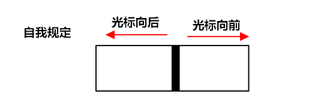

<!--
 * @Author: JohnJeep
 * @Date: 2020-05-11 22:06:09
 * @LastEditTime: 2021-01-22 23:13:37
 * @LastEditors: Please set LastEditors
 * @Description: Vim编辑器使用
--> 

<!-- TOC -->

- [0.1. Vim基础用法](#01-vim基础用法)
  - [0.1.1. 参考](#011-参考)
  - [0.1.2. 三种模式](#012-三种模式)
  - [0.1.3. 命令行模式](#013-命令行模式)
    - [0.1.3.1. 光标移动(命令行模式)](#0131-光标移动命令行模式)
    - [0.1.3.2. 复制操作(命令模式)](#0132-复制操作命令模式)
    - [0.1.3.3. 粘贴(命令模式)](#0133-粘贴命令模式)
    - [0.1.3.4. 删除操作(命令模式)](#0134-删除操作命令模式)
    - [0.1.3.5. 撤销操作(命令模式)](#0135-撤销操作命令模式)
    - [0.1.3.6. visual模式(命令模式)](#0136-visual模式命令模式)
    - [0.1.3.7. block模式(命令模式)](#0137-block模式命令模式)
    - [0.1.3.8. 查找与替换(命令模式)](#0138-查找与替换命令模式)
  - [0.1.4. 插入（编辑）模式](#014-插入编辑模式)
    - [0.1.4.1. 编辑切换(插入模式)](#0141-编辑切换插入模式)
  - [0.1.5. 底行命令模式](#015-底行命令模式)
    - [0.1.5.1. 文件操作(Last line mode)](#0151-文件操作last-line-mode)
    - [0.1.5.2. 替换](#0152-替换)
    - [0.1.5.3. 窗口](#0153-窗口)
    - [0.1.5.4. shell](#0154-shell)
    - [0.1.5.5. 帮助](#0155-帮助)
    - [0.1.5.6. 注释](#0156-注释)
  - [0.1.6. vim配置文件](#016-vim配置文件)
  - [0.1.7. 恢复文件](#017-恢复文件)

<!-- /TOC -->

## 0.1. Vim基础用法

### 0.1.1. 参考
- [vim学习手册](https://linux.cn/article-8144-1.html)
- [Linux命令大全--vim学习](https://ipcmen.com/)
- [Vim的哲学](https://segmentfault.com/a/1190000000458565)
- [vim常用命令总结](https://www.cnblogs.com/yangjig/p/6014198.html)
- [vim-adventures](https://vim-adventures.com/) 通过玩游戏的方式来学习Vim。


### 0.1.2. 三种模式
- 命令模式（command mode）
  > 控制屏幕光标的移动，字符、字或行的删除，移动复制某区段及进入Insert mode下，或者到 last line mode
- 插入模式（Insert mode）
  > 在Insert mode下，才可以做文字输入，按「ESC」键可回到命令行模式
- 底行模式(last line mode)
  > 按下(英文冒号:)就进入了底行命令模式，按「ESC」键可随时退出底行命令模式。
  
<div align="center"></div>
<div align="center"> </div>


### 0.1.3. 命令行模式
#### 0.1.3.1. 光标移动(命令行模式)
- `k` 向上移动光标
- `h` 向左移动光标
- `l` 向右移动光标
- `j` 向下移动光标
- `Ctrl d`	屏幕『向下』移动半页
- `Ctrl u`	屏幕『向上』移动半页
- `+`	光标移动到非空格符的下一行；等价于 `↓`
- `–`	光标移动到非空格符的上一行；等价于 `↑`
- `n<space>`  按下数字后再按空格键，光标会向右移动这一行的 n 个字符
- `0`   或功能键[Home]	这是数字『 0 』：光标移动到这一行的开头字符处
- `$`   或功能键[End]	光标移动到这一行的最后面字符处
- `^`	  移动光标至本行第一个非空字符处
- `w`	  向前（往右）移动一个词 （上一个字母和数字组成的词之后）
- `5w`  向前移动五个词
- `b`   从当前光标处 `向后(向左)` 跳到每个单词的开头，遇见 `,` 会停止
- `e`   从当前光标处 `向前(向右)` 跳到每个单词的末尾
- `B`	  从当前光标处 `向后(向左)` 跳到每个单词的开头，只认以空格分隔的词。
- `5b`  向后移动五个词
- `H`	  光标移动到这个屏幕的最上方那一行的第一个字符
- `M`	  光标移动到这个屏幕的中央那一行的第一个字符
- `L`	  光标移动到这个屏幕的最下方那一行的第一个字符
- `G`	  移动到这个文件的最后一行(常用)
- `ctrl g` 列出光标所在行的行号。
- `nG`	   n 为数字。移动到文件的第 n 行。例如 `20G` 则光标会移动到文件的第 20 行(可配合 :set nu)
- `gg`	移动到这个文件的第一行，相当于 1G 啊！ (常用)
- `n <Enter>`	n 为数字。光标向下移动 n 行(常用)
- `shift + k` 进入帮助模式
- `>>`向右缩进
- `<<`向左缩进
- `%` 匹配括号，如果光标在"(" 上，它移动到对应的 ")" 上，反之，如果它在 ")"上，它移动到对应的"(" 上。


#### 0.1.3.2. 复制操作(命令模式)
- 字符操作
  - `yw`  复制当前光标所在位置到单词尾字符的内容到 vi 缓存区，相当于复制一个单词
  - `y$`  复制光标所在位置到行尾内容到缓存区
  - `y^`  复制光标所在位置到行首内容到缓存区
- 行操作
  - `yy`  命令复制当前整行的内容到 vi 缓冲区
  - `5yy` 例如：`5yy` 就是复制 5 行
  - `2yw` 例如：`2yw` 就是复制 2 个单词
  - 复制第 m 行到第 n 行之间的内容，在命令行模式中输入`m，ny` 例如：3，5y 复制第三行到第五行内容到缓存区。


#### 0.1.3.3. 粘贴(命令模式)
- `p(小写)` 将缓冲区内容粘贴光到标所在行的下面一行 
  > 目前光标在第 20 行，且已经复制了 10 行数据。则按下 p 后， 那 10 行数据会贴在原本的 20 行之后，亦即由 21 行开始贴
- `P(大写)` 将缓冲区内容粘贴到光标所在行的上面一行
- `J`	将光标所在行与下一行的数据结合成同一行
- `ddp` 交换当前行和其下一行
- `xp` 交换当前字符和其后一个字符


#### 0.1.3.4. 删除操作(命令模式)
- 字符操作
  - `x`   从当前光标处向 `前` 每次删除一个字符，包括当前光标。
  - `X`   从当前光标处向 `后` 每次删除一个字符，不包括当前光标。
  - `nx`  例如3x 删除包括当前光标处向后的三个字符
  - `dw`  从当前光标处（包括当前光标）向 `前` 删除字符或单词（包括空格），一直到下一个单词开头处。
  - `cw(小写)` 从当前光标处向 `前`删除字符或单词，直到遇见空格时停止，执行后进入`insert` 模式。
  - `d$`	删除光标所在处，到该行的最后一个字符；或 `D`
  - `c(小写)`	重复删除多个数据，例如向下删除 10 行，`10cj`
  - `c0(小写)` 修改当前光标所在的位置至本行首部，执行后进入`insert` 模式。
  - `cc(小写)` 替换一行，执行后进入`insert` 模式。
  - `c3w`     表示删除3个字符
  - `C(大写)`  修改当前光标所在字符至本行末尾，执行后进入`insert` 模式。
  - `s(小写)`  删除一个字母，执行后进入`insert` 模式。
  - `S(大写)`  删除当前光标所在的一整行，执行后进入`insert` 模式。
  - `数字(n) s` 删除n个字符，从当前光标开始算起，执行后进入`insert` 模式。
  - `d0(数字0)` 删除光标所在处，到该行的最前面一个字符


- 行操作
  - `dd`  删除光标所在行
  - `ndd` 删除光标所在的向下 n 行。例如3dd 删除包括当前行开始向下的三行文本
  - `d1G`	删除光标所在到第一行的所有数据
  - `dG`	删除光标所在到最后一行的所有数据
  - `:1,10d` 将1-10行剪切


#### 0.1.3.5. 撤销操作(命令模式)
- `u(小写)` 命撤销最近一次的操作，可以使用多次来恢复原有的操作
- `U(大写)` 撤销对整行的操作
- `Ctrl+R` 可以恢复对撤消 `u(小写)` 命令的操作
- `. (小数点)` 重复前一个动作的意思


#### 0.1.3.6. visual模式(命令模式)
> 可视模式下可以选选性的进行复制、粘贴、删除
- `v(小写)` 进入逐块（block）可视模式
- `V(大写)`	进入逐行（line）可视模式
- `d` 删除 
- `y` 复制
- `p` 从当前光标处粘贴，但不会换行。
- `h, j, k, l` 移动光标。一般常配合 `d、y` 操作进行字符的复制遇与删除。       
- `%` 括号匹配


#### 0.1.3.7. block模式(命令模式)
  - 光标定位到要操作的地方
  - `Ctrl+v` 进入【– 可视 块 –】模式，通过h（左），j（下），k（上），l（右）选取行和列
  - `Shift+i` 输入要插入的内容。
  - `Esc`连按两次，就会在每行选定的区域插入内容
  - `d` 删除所选中的字符
  - `y` 复制所选中的字符
  - `p` 粘贴所选中的字符


#### 0.1.3.8. 查找与替换(命令模式)
- 查找
  - `/word`	向光标之下寻找一个名称为 word 的字符串
  - `?word`	向光标之上寻找一个字符串名称为 word 的字符串
  - 在 `/` 或 `?` 之后，使用 `n` 向下查找，`N` 从当前字符向上查找。
  - `#` 光标移到到单词上面，可以选中整个文本中相同的单词
  - `:nohlsearch或(noh)` 关闭搜索后的高亮文本
  - `*` 查某个变量在哪里被用到，选中需要查的变量，按下 `*` 后，相同的变量高亮，再用 `n或N` 遍历查找。
  - `/str\>` 查找以str结尾的单词
  - `/\<str\>` 查找以str结尾又以str开始的单词


- 替换
  - `r(小写)` 替换一个字符，执行后还是在命令行模式。
  - `R` 在命令行模式下，替换无限多个字符，执行后进入`insert` 模式。
  - `~` 大小写字母转换，执行后还是在命令行模式。


### 0.1.4. 插入（编辑）模式
#### 0.1.4.1. 编辑切换(插入模式)
- `a` 从当前光标所在的下一个字符处开始插入
- `A` 从光标所在行的最后一个字符处开始插入
- `I` 在当前所在行的第一个非空格符处开始插入
- `i` 从当前光标所在处插入
- `o` 目前光标所在的下一行处插入新的一行
- `O(大写字母)` 在目前光标所在处上一行插入新的一行


### 0.1.5. 底行命令模式
#### 0.1.5.1. 文件操作(Last line mode)
- `:w [filename]`	将编辑的数据储存成另一个档案（类似另存新档）
- `:r [filename]`	在编辑的数据中，读入另一个档案的数据。将 `filename` 这个档案内容加到光标所在行后面
- `:n1,n2 w [filename]`	将 n1 到 n2 的内容储存成 filename 这个档案。
- `:w`	将编辑的数据写入硬盘档案中
- `:w!`	若文件属性为『只读』时，强制写入该档案。不过，到底能不能写入，还是跟你对该档案的档案权限有关啊！
- `:q	` 离开 vim
- `:q!`	若曾修改过档案，又不想储存，使用 ! 为强制离开不储存档案。
- `:wq`	储存后离开，若为 :wq! 则为强制储存后离开
- `:e!` 放弃所有修改，并打开原来文件
- `:e ftp://192.168.10.76/abc.txt`  打开远程文件，比如ftp或者share folder
- `Esc Esc` 连续按两次Esc退出底行模式


#### 0.1.5.2. 替换
  - `:s/old/new` 用new 替换行中首次出现的old
  - `:s/old/new/g` 用new 替换行中所有出现的old
  - `:n1,n2 s/old/new/g` 用new 替换从第n1行到第n2行中出现的old
  - `:% s/old/new/g` 用new 替换整篇中出现的old; (g:global)


#### 0.1.5.3. 窗口
- `:open file`  在窗口中打开一个新的文件，会关闭之前的窗口。
- `:new` 打开一个新窗口，光标停在顶层的窗口上，不会关闭之前的窗口。
- `:close` 最后一个窗口不能使用此命令，可以防止意外退出vim。
- `:q` 文件没有修改会退出，文件有修改则不会退出。


- `:sp` 或 `:split` 将当前文件水平分屏为两个文件
- `Ctrl w w` 在打开的两个窗口之间进行切换(用的多)
- `Ctrl w j` 移动到下方的窗口(用的少)
- `Ctrl w k` 移动到上方的窗口(用的少)


- `:vsp` 将当前文件垂直分屏为两个文件
- `:vsp file`将当前文件与 file 文件两个垂直分屏


#### 0.1.5.4. shell
> 使用 `!` 可以执行命令行的操作，暂时离开 vim, 显示执行命令行的内容。
`:!ls` 列出当前目录下文件
`:!perl -c script.pl` 检查perl脚本语法，可以不用退出vim，非常方便。
`:!perl script.pl` 执行perl脚本，可以不用退出vim，非常方便。
`:suspend` 或 `Ctrl - Z` 挂起vim，回到shell，按fg可以返回vim。


#### 0.1.5.5. 帮助
- `:help` or `F1` 显示整个帮助
- `:help xxx` 显示xxx的帮助，比如 `:help i`, `:help CTRL-[`（即Ctrl+[的帮助）。
- `:help 'number'` Vim选项的帮助用单引号括起
- `:help <Esc>` 特殊键的帮助用<>扩起
- `:help -t` Vim启动参数的帮助用-
- `:help i_<Esc>` 插入模式下Esc的帮助，某个模式下的帮助用模式_主题的模式帮助文件中位于||之间的内容是超链接，可以用Ctrl+]进入链接，Ctrl+o（Ctrl + t）返回


#### 0.1.5.6. 注释
> perl程序中`#` 开始的行为注释，所以要注释某些行，只需在行首加入 `#`
- `:3,5 s/^/#/g` 注释第3-5行
- `:3,5 s/^#//g` 解除3-5行的注释
- `:1,$ s/^/#/g` 注释整个文档。
- `:%s/^/#/g` 注释整个文档，此法更快。


### 0.1.6. vim配置文件
- 系统级配置文件目录：`/etc/vim/vimrc`
- 用户级配置文件目录：`~/.vim/vimrc`
- 设置Tab的大小 
  ```
  set tabstop=4      # 表示一个 tab 显示出来是多少个空格的长度，默认 8。
  set softtabstop=4  # 表示在编辑模式的时候按退格键的时候退回缩进的长度。
  set shiftwidth=4   # 表示每一级缩进的长度，一般设置成跟softtabstop一样。
  set expandtab      # 当设置成expandtab时，缩进用空格来表示
  # set noexpandtab  # noexpandtab是用制表符表示一个缩进
  set autoindent     # 按换行键，让代码自动缩进一个Tab，设置自动缩进
  ```


### 0.1.7. 恢复文件
- `O` 只读打开，不改变文件内容
- `E` 继续编辑文件，不恢复.swp 文件保存的内容
- `R` 将恢复上次编辑以后未保存文件内容
- `Q` 退出vi
- `D` 删除.swp 文件或者使用vi －r 文件名来恢复未保存的内容


