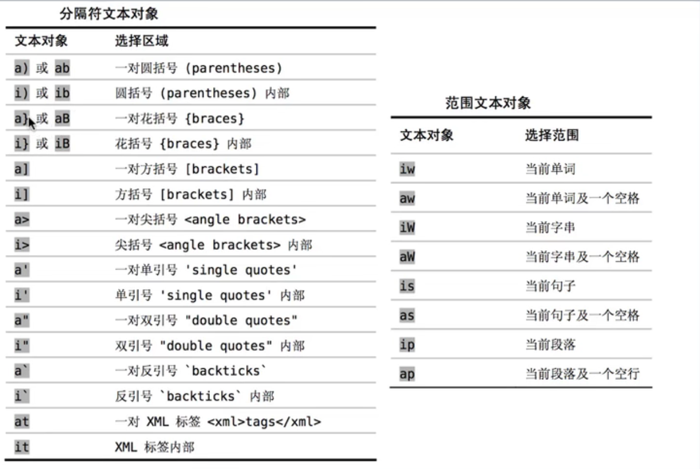
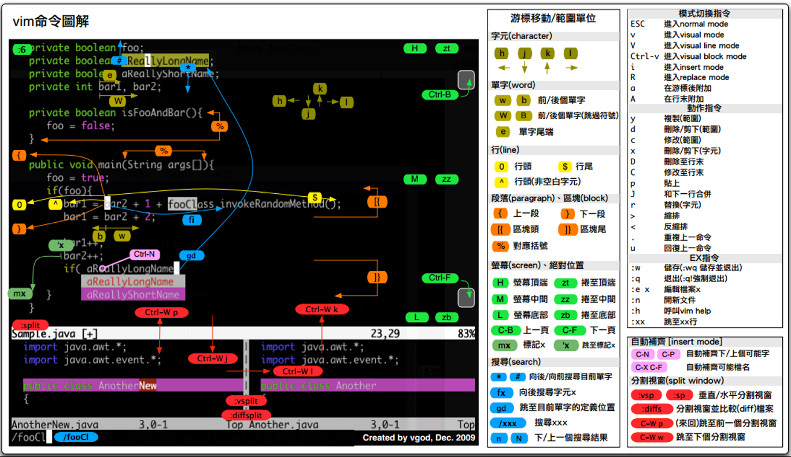

<!--
 * @Author: JohnJeep
 * @Date: 2020-05-11 22:06:09
 * @LastEditors: JohnJeep
 * @LastEditTime: 2025-04-04 19:12:26
 * @Description: How to use VIM
 * Copyright (c) 2023 by John Jeep, All Rights Reserved. 
-->

# 1. Philosophy

vim 可以看成是一种编程语言。其中，各种按键任意的组合，可以看成是不同程序的接口。

--------------------------------------------

我们思考的有多快，这个工具使用的就有多快！（编程的速度跟上思考的速度！！！或以思维的速度来编辑文本。）

使用它就是为了偷懒儿，编程时减少按键按下的次数，因为使用鼠标很费时，影响编程的效率，不使用鼠标，完全用键盘去编程。

技巧感悟：每一次在按键上敲击时，想一想能否有更简单的方法去替代当前的操作。

诀窍：学会偷懒。其核心在于 “懒”，键盘上能按一次就能完成的工作，绝不按两次。
> 懒惰（Laziness）这个特点位于程序员的三大美德之首：唯有懒惰才会驱动程序员尽可能的将日常工作自动化起来，解放自己的双手，节省自己的时间。

--------------------------------------------


# 2. Normal Mode

普通模式（Normal Mode）。控制屏幕光标的移动，字符、字或行的删除，移动复制某区段及进入 Insert Mode 或者到 command Line Mode 下。


## 2.1. Cursor

Vim 有实际行和**屏幕行**。以行号开头的行对应着一个**实际行**，它们会占据着屏幕上的一行或几行。当一行文本为适应窗口宽度而**回绕**时，回绕行的前面则不会显示行号，这个就是**屏幕行**。  在**实际行**前面添加 `g` 命令，则是对屏幕行操作。

光标移动操作：
| 命令           | 功能                                                         |
| -------------- | ------------------------------------------------------------ |
| h              | 向左移动光标                                                 |
| j              | 向下移动光标                                                 |
| k              | 向上移动光标                                                 |
| l              | 向右移动光标                                                 |
| +              | 光标移动到非空格符的下一行；等价于 `↓`                       |
| -              | 光标移动到非空格符的上一行；等价于 `↑`                       |
| n<space>       | 按下数字后再按空格键，光标会向右移动这一行的 n 个字符        |
| 0              | 光标移动到这一行的开头字符处，等价于功能键 [Home]             |
| $              | 光标移动到这一行的最后面字符处，等价与功能键 [End]            |
| ^              | 移动光标至本行第一个非空字符处                               |
| ~              | 字符大小写转换                                                             |
| w(word)        | 向右移动一个词，光标停在下一个单词的**开头**，它会跳过空格和标点符号。 |
| W（大写）        | 向右移动到下一个以空格分隔的单词的**开头**。                 |
| b(back)        | 从当前光标处 `向左` 跳到上一个单词的**开头**。符号也被当做一个单词。 |
| B              | 从当前光标处 `向左` 跳到上一个以空格分隔的单词的**开头**。   |
| e(end of word) | 从当前光标处 `向右` 跳到每个单词的**末尾**，它会停在单词的最后一个字符上。 |
| E              | 向右移动到下一个以空格分隔的单词的结尾。                     |
|                |                                                              |
| H(Highest)     | 光标移动到这个屏幕的最上方那一行的第一个字符                 |
| M(Middle)      | 光标移动到这个屏幕的中央那一行的第一个字符                   |
| L(Lowest)      | 光标移动到这个屏幕的最下方那一行的第一个字符                 |
| ge             | 从当前光标处 `向左` 跳到每个单词的末尾，忽略空格             |
|                |                                                              |
| G              | 移动到这个文件的最后一行（常用）                               |
| nG             | n 为数字。移动到文件的第 n 行。例如 `20G` 则光标会移动到文件的第 20 行（可配合 :set nu） |
| gg             | 移动到这个文件的第一行，相当于 1G 啊！ （常用）                |
| ctrl g         | 列出光标所在行的行号                                         |
| n <Enter>      | n 为数字。光标向下移动 n 行（常用）                            |
| shift  k       | 进入帮助模式                                                 |
| >>             | 向右缩进                                                     |
| <<             | 向左缩进                                                     |
| %              | 匹配括号，如果光标在"(" 上，它移动到对应的 ")" 上，反之，如果它在 ")" 上，它移动到对应的 "(" 上 |
| .              | 重复上次 `Normal Mode` 下的操作                              |


翻页
| 命令             | 功能                 |
| ---------------- | -------------------- |
| Ctrl d(down)     | 屏幕向下滚动半个屏幕 |
| Ctrl u(up)       | 屏幕向上滚动半个屏幕 |
| Ctrl f(forward)  | 屏幕向下滚动整个屏幕 |
| Ctrl b(backward) | 屏幕向上滚动整个屏幕 |
| Ctrl y           | 屏幕向上滚动一行     |
| Ctrl e(extra)    | 屏幕向下滚动一行     |


用次数做简单的算术运算

`<Ctrl a` 和 `Ctrl x` 命令分别对数字执行加和减操作。在不带次数执行时，它们会逐个加减，但如果带一个次数前缀，那么就可以用它们加减任意整数。例如，如果我们把光标移到字符 5 上，执行 `10 Ctrl a` 就会把它变成 15。(5+10=15)
  
> 如果光标不在数字上，那么 `Ctrl a` 命令将在当前行正向查找一个数字，如果找到了，它就径直跳到那里。


## 2.2. Yank

Yanking 是 Vim 中拷贝命令的名字。由于"c"己经被用于表示 change 了，所以拷贝 (copy) 就不能再用"c"了。但"y"还是可用的。把这个命令称为 "yanking" 是为了更容易记住 "y" 这个键。

要把文本从一个地方拷贝到另一个地方，你可以先删除它，然后用 "u" 命令恢复，再用 "p" 拷到另一个地方。可以使用更简单的方式进行拷贝，用 "y" 命令可以把文字拷贝到寄存器（register）中。然后用 "p" 命令粘贴到别处。

- 字符操作
  - `yw`  复制当前光标所在位置到单词尾字符的内容到 vi 缓存区，相当于复制一个单词
  - `y$`  复制光标所在位置到行尾内容到缓存区
  - `y^`  复制光标所在位置到行首内容到缓存区
- 行操作
  - `yy`  命令复制当前整行的内容到 vi 缓冲区
  - `5yy` 例如：`5yy` 就是复制 5 行
  - `2yw` 例如：`2yw` 就是复制 2 个单词
  - 复制第 m 行到第 n 行之间的内容，在命令行模式中输入`m，ny` 例如：3，5y 复制第三行到第五行内容到缓存区。


## 2.3. Paste
- `p（小写）` 将缓冲区内容粘贴光到标所在行的下面一行。
  > 目前光标在第 20 行，且已经复制了 10 行数据。则按下 p 后， 那 10 行数据会贴在原本的 20 行之后，亦即由 21 行开始贴
- `P（大写）` 将缓冲区内 (buffer) 容粘贴到光标所在行的上面一行( Pastes content before the current cursor position)。
- `J`	将光标所在行与下一行的数据结合成同一行
- `ddp` 交换当前行和其下一行
- `xp` 交换当前字符和其后一个字符


## 2.4. Delete

Delete 为 Vim 的删除命令，等价于 copy 操作，delete 拷贝当前的文本到 register，然后从当前文档中移除当前的文本。

- 字符操作 (word)
  - `x（等价与 dl)`   删除当前光标下的字符。
  - `X（大写，等价与 dh)`   删除当前光标左边的字符，不包括当前光标。
  - `c(change 小写）`	修改数据，例如向下删除 10 行，`10cj`
  - `C（大写，等价与 c$)`  修改当前光标所在字符至本行末尾，执行后进入`insert` 模式。
  - `s（小写，等价与 cl)`  修改一个字符，执行后进入`insert` 模式。
  - `S（大写，等价与 cc)`  修改当前光标所在的一整行，执行后进入`insert` 模式。
  - `D（等价与 d$)`	删除当前光标到行尾的所有字符。
  - `nx`  例如 3x 删除包括当前光标处向左的三个字符
  - `dw`  从当前光标处（包括当前光标）向 `前` 删除字符或单词（包括空格），一直到下一个单词开头处。
  - `cw（小写）` 从当前光标处向 `前`删除字符或单词，直到遇见空格时停止，执行后进入`insert` 模式。
  - `c0（小写）` 修改当前光标所在的位置至本行首部，执行后进入`insert` 模式。
  - `cc（小写）` 替换一行，执行后进入`insert` 模式。
  - `c3w`     从当前光标处向左删除 3 个 word，并进入 `insert` 模式。
  - `数字 (n) s` 删除 n 个字符，从当前光标开始算起，执行后进入`insert` 模式。
  - `d0（数字 0)` 删除光标所在处，到该行的最前面一个字符

- 行操作 (Line)
  - `dd`  删除光标所在行
  - `ndd` 删除光标所在的向下 n 行。例如 3dd 删除包括当前行开始向下的三行文本
  - `d1G`	删除光标所在到第一行的所有数据
  - `dG`	删除光标所在到最后一行的所有数据
  - `:1,10d` 将 1-10 行剪切
  - `J` 将光标所在行与下一行的数据结合成一行


## 2.5. Undo

- `u(undo 小写）` 撤销最近一次的操作，可以使用多次来恢复原有的操作
- `U（大写）` 撤销对整行的操作
- `Ctrl+R(Redo)` 可以恢复对撤消 `u（小写）` 命令的操作
- `. （小数点）` 重复前一个动作的意思


## 2.6. Find

- `/word`	向光标之下寻找一个名称为 word 的字符串
- `?word`	向光标之上寻找一个字符串名称为 word 的字符串
- 在 `/` 或 `?` 之后，使用 `n` 向下查找，`N` 从当前字符向上查找。
- `#` 光标移到到单词上面，可以选中整个文本中相同的单词
- `:nohlsearch 或 (noh)` 关闭搜索后的高亮文本
- `*` 查某个变量在哪里被用到，选中需要查的变量，按下 `*` 后，相同的变量高亮，再用 `n` 或 `N` 遍历查找。
- `/str\>` 查找以 `str` 结尾的单词
- `/\<str\>` 查找以 `str` 结尾又以 `str` 开始的单词
- `f(find)`: 查找。`fw`：查找以 w 开头的字符。  
- `t(to)`: 跳至。`tw`：跳转到 w 字符处的前一个字符上。


## 2.7. Mark

- `m{mark}` 设置标记
- \`{mark} 返回标记
> Mark 是自己定义标记的字母，可以设置的任意按键。


## 2.8. Motions

介绍几种修正和移动文本（Making corrections and moving text）的方法，包括 3 中基本修改文本的方法：
1. operator-motion（操作符-动作）
2. Visual Mode（可视模式） 
3. text objects（文本对象）


### 2.8.1. operator-motion

Vim 的强大很大程度上源自操作符与动作命令相结合，`Operator + Motion = Action`。
- `4dw` 就是操作符-动作的模式，`d` 是删除操作符，`4w` 是一个执行命令，表示删除 4 个单词。
- `5dk`：向上删除 5 行，并包括当前行。

SYNOPSIS
```shell
# []: 可选
# |: 选择列出的其中一个

# Command: A generic term used to group/contain the following items
# Count:  An optional numerical value to indicate number of executions
# Operate: The command to be executed
# Motion: The direction the operator should be applied
# Text Object: The area the operator should be applied to

[count] {operator} {[count] motion|text object}
```

Abbreviation
```shell
c: change
a: around
i: inside
b: brackets
w: word
f: find
y: yank
p: paragraph
t: HTML tag
```


常见 VIM 操作符命令（Vim's operator commands）

| 命令 | 用途                               |
| ---- | ---------------------------------- |
| c    | Change                             |
| d    | Delete                             |
| y    | Yank into register                 |
| g~   | Swap case （大小写转换）           |
| gu   | Make lowercase（转为小写）         |
| gU   | （Make uppercase）转为大写         |
| >    | （Shift right）增加缩进            |
| <    | （Shift left）减小缩进             |
| =    | （Autoindent）自动缩进             |
| !    | 使用外部程序过滤 {motion} 所跨越的行 |


### 2.8.2. text objects

- 使用 operator text objects 来修改文本。
- 例如 `da)` 表示：Normal 模式下，将光标放在 `(` 处，按下 `da)` 组合键后，一对圆括号中的内容就删除了。


文本对象包括分隔符文本对象和范围文本对象，下面图片中分别列出了通用的文本对象。



## 2.9. Fold

vim 中代码折叠。按照折叠所依据的规则，可以分为 Manual（手工折叠）、Indent（缩进折叠）、Marker（标记折叠）和 Syntax（语法折叠）等。

查看折叠的帮助信息
```sh
:help folding     查看折叠的帮助信息
:help fold-marker 查看标记折叠帮助信息
:help fold-syntax 查看语法折叠帮助信息
:help fold-indent 查看缩进折叠帮助信息
:help fold-manual 查看手动折叠帮助信息
```

折叠快捷键
```sh
za 打开/关闭当前的折叠
zo 打开一个折叠
zc 关闭一个折叠
zo、zc、za 对应 zO、zC 和 zA：以递归形式改变折叠状态。

zR 打开所有的折叠及其嵌套的折叠
zr 打开所有的折叠
zM 关闭所有的折叠及其嵌套的折叠
zm 关闭所有的折叠
zd 删除当前折叠
zE 删除所有折叠
zj 移动至下一个折叠
zk 移动至上一个折叠
zn 禁用折叠
zN 启动折叠
```


### 2.9.1. Manual Fold

启用手工折叠
```sh
:set foldmethod=manual
```


### 2.9.2. Indent Fold

启用缩进折叠，所有文本将按照（选项* shiftwidth* 定义的）缩进层次自动折叠。
```sh
:set foldmethod=indent
```


### 2.9.3. Syntax Fold

启用语法折叠。所有文本将按照语法结构自动折叠。
```sh
:set foldmethod=syntax
```


### 2.9.4. Marker Fold

启用标记折叠，所有文本将按照特定标记（默认为{{{和}}}）自动折叠。
```sh
:set foldmethod=marker
```


# 3. Visual Mode

`Normal Mode` 下按 `V（小写）` 键进入到 `Visual Mode`，再根据需要进行复制、粘贴、删除、多光标等不同的操作。
- `d` 删除 
- `y` 复制
- `p` 从当前光标处粘贴，但不会换行。
- `h, j, k, l` 移动光标。一般常配合 `d、y` 操作进行字符的复制遇与删除。       
- `%` 在匹配到的括号之间上来回跳。
- `o` 切换所选区域的开始与结束位置。


# 4. Visual Line Mode

`Normal Mode` 下按 `Shift + v` 组合键或者 `V（大写）` 键进入到 `Visual Line Mode`，再根据需要对行 (Line) 进行复制、粘贴、删除、多光标等不同的操作。

- `gv` 重选上次的高亮选区 。


# 5. Visual Block Mode

`Normal Mode` 下按 `Ctrl + v` 组合键进入到 `Visual Block Mode`，再根据需要进行复制、粘贴、删除、多光标等不同的操作。

- `d` 删除所选中的字符
- `y` 复制所选中的字符
- `p` 粘贴所选中的字符
- 如何一次性改变多行的内容 (Multi cursor)？
  > 光标定位到要操作的地方，按下 `Ctrl+v` 组合键进入 `VISUAL BLOCK` 模式，通过 h（左），j（下），k（上），l（右）选取行和列，按下 `Shift+i` 组合键后，进入 `Insert Mode` 下的 `Multi cursor` 操作，输入要插入的内容，此时你发现在 `Insert Mode` 下只有一行改变了，而不是多行同时改变了，此时需要你连续按两次 `Esc` 键，你会看到多行改变后的内容，并回到 `Normal Mode` 。 


# 6. Replace Mode

Normal Mode 下进行替换操作。
- `R` 在命令行模式下，替换无限多个字符，执行后进入`insert Mode`。
- `r（小写）` 替换一个字符，执行后还是在 `Normal Mode`。
- `~` 将光标下的字母进行大小写转换，执行后还是在 `Normal Mode`。
- `3~`      将光标位置开始的 3 个字母改变其大小写
- `g~~`     改变当前行字母的大小写
- `U`       将可视模式下选择的字母全改成大写字母
- `u`       将可视模式下选择的字母全改成小写
- `gUU`     将当前行的字母改成大写
- `3gUU`    将从光标开始到下面 3 行字母改成大写
- `guu`     将当前行的字母全改成小写
- `gUw`     将光标下的单词改成大写。
- `guw`     将光标下的单词改成小写。


# 7. Insert Mode

插入模式 (Insert Mode) 下，可以做文本操作，按「ESC」键或按 `Ctrl [` 键可回到  `normal` 模式。

- `a(append)` 从当前光标所在的下一个字符处插入文本。
- `A(append after a line)` 从光标所在行的最后一个字符处插入文本。
- `I(insert before line)` 在当前所在行的第一个非空格处插入文本。
- `i(insert after line)` 当前光标所在位置之前插入。
- `o(open a line below)` 当前光标所在的下一行处插入新的一行。
- `O(大写字母：open a line above)` 当前光标所在处上一行插入新的一行。


# 8. Command Line Mode

Normal Mode 模式下按下 `:` 键后进入 Command Line Mode 模式，进行对文件、窗口以及字符的替换等一系列的操作。


## 8.1. File

Command Line Mode 下对文件进行操作。

- `:w [file]`	将当前文件另存为另一个名为 file 的文件。
- `:r [file]`	在编辑的数据中，读入另一个文件的数据，并将另一个文件 `file` 中的内容加到光标所在行后面。
- `:n1,n2 w [filename]`	将 n1 到 n2 的内容保存为成 filename 文件。
- `:w`   将编辑的数据写入 (write) 磁盘文件中。
- `:w!` 若文件属性为『只读』时，强制写入该文件。不过，到底能不能写入，还是跟你对该文件的权限有关！
- `:q`   文件没有修改会退出，文件有修改则不会退出。
- `:q!`  若曾修改过该文件，又不想保存，使用 ! 为强制离开不保存当前文件。
- `:wq`(write quit) 保存并退出，等同于 `:x`（小写）。
- `:wq!` 强制保存后离开。
- `:e!` 放弃所有修改，并打开原来文件。
- `:e ftp://192.168.10.76/abc.txt`  打开远程文件，比如 ftp 或者 share folder。

Vim 会记录跳转前后的位置，并提供了一些命令让我们能够沿原路返回。Vim 可以同时维护多份跳转列表。实际上，每个单独的窗口都拥有一份自己的跳 转列表。如果你正在使用分割窗口或多标签页，那么 <C-o> 和 <C-i> 命令会始终在当前活动窗口的跳转列表范围内进行跳转。  

跳转
- `Ctrl o(older)` 后退到上一个位置
- `Ctrl i(newer)` 前进到上一个位置


## 8.2. Command

Command Line Mode 下一些常见的命令操作。

- `:normal` 执行任意的普通模式命令。
- `@:` 重复 Command Line Mode 下上次的命令。

Command Line Mode 下也支持 `Tab` 键的自动补全。例如：输入`:col` 并按下 `Ctrl d` 按键后，会在命令行模式下面显示可用的补全列表。要想反向遍历补全列表，可以按 `Shift-Tab`。  


## 8.3. Replace

Command Line Mode 下对字符的替换。

- `:s/old/new` 用 new 替换行中首次出现的 old
- `:s/old/new/g` 用 new 替换行中所有出现的 old
- `:n1,n2 s/old/new/g` 用 new 替换从第 n1 行到第 n2 行中出现的 old
- `:% s/old/new/g` 用 new 替换整篇中出现的 old; (g:global, s: substitute)
  > 判断每个替换的字符是不是确定被替换，可在最后添加控制标志位 `c` 来操作。例如：`:%s/content/copy/gc`


## 8.4. Window

- `:open file`  在窗口中打开一个新的文件，会关闭之前的窗口。
- `:new` 打开一个新窗口，光标停在顶层的窗口上，不会关闭之前的窗口。
- `:close` 关闭窗口，最后一个窗口不能使用此命令，可以防止意外退出 vim。
- `:tabnew` 从前窗口创建新标签页，但不会丢弃原来的文件，退出新建窗口后，会回到上次的窗口处。
- `:sp` 或 `:split` 将当前文件水平分屏为两个文件
- `Ctrl w w` 在打开的两个窗口之间进行切换（用的多）
- `Ctrl w j` 移动到下方的窗口（用的少）
- `Ctrl w k` 移动到上方的窗口（用的少）
- `:vsp` 将当前文件垂直分屏为两个文件
- `:vsp file`将当前文件与 file 文件两个垂直分屏


## 8.5. Shell

使用 `!` 可以执行 shell 的操作，暂时离开 vim, 显示执行 shell 的内容。

- `:shell` 启动一个交互的 shell 会话。
- `:!{cmd}` 在 shell 中执行 {cmd} 命令。例如 `:!ls` 列出当前目录下文件。
- `:read !{cmd}  ` 在 shell 中执行 {cmd} ，并把其标准输出插入到光标下方 。
- `:suspend` 或 `Ctrl - Z` 挂起 vim，回到 shell，按 `fg` 可以返回 vim。


## 8.6. Help

- `:help` or `F1` 显示整个帮助
- `:help xxx` 显示 xxx 的帮助，比如 `:help i`, `:help CTRL-[`（即 Ctrl+[的帮助）。
- `:help 'number'` Vim 选项的帮助用单引号括起
- `:help <Esc>` 特殊键的帮助用<>扩起
- `:help -t` Vim 启动参数的帮助用-
- `:help i_<Esc>` 插入模式下 Esc 的帮助，某个模式下的帮助用模式_主题的模式帮助文件中位于||之间的内容是超链接，可以用 Ctrl+] 进入链接，Ctrl+o（Ctrl + t）返回


## 8.7. Comment

程序中以 `#` 开始的行表示为注释，所以要注释某些行，只需在行首加入 `#`。
- `:3,5 s/^/#/g` 注释第 3-5 行
- `:3,5 s/^#//g` 解除 3-5 行的注释
- `:1,$ s/^/#/g` 注释整个文档。
- `:%s/^/#/g` 注释整个文档，此法更快。


# 9. Registers

Vim 的寄存器是一组用于保存文本的简单容器。它们既可像剪贴板那样，剪切、复制和粘
贴文本；也可以记录一系列按键操作，把它们录制成宏。 可用 `Ctrl r {register} ` 命令来调用 Vim 的 register。


## 9.1. The expression register

- **The expression register（表达式寄存器）** 在 **Insert Mode** 和 **Command Line Mode** 中均可以使用，只需要输入 `Ctrl r =` 键就可
  以访问这一寄存器。这个寄存器主要用于数值运算。
- 在插入模式中使用
	```sh
	A 6 chairs, each costing $35, totals $
	<C-r>=6*35<CR> 6 chairs, each costing $35, totals $210
	```


# 10. Vim Config

- 系统级配置文件目录：`/etc/vim/vimrc`
- 用户级配置文件目录：`~/.vim/vimrc`
- 设置 Tab 的大小 
  ```sh
  set tabstop=4      " 表示一个 tab 显示出来是多少个空格的长度，默认 8
  set softtabstop=4  " 表示在编辑模式的时候按退格键的时候退回缩进的长度
  set shiftwidth=4   " 表示每一级缩进的长度，一般设置成跟 softtabstop 一样
  set expandtab      " 当设置成 expandtab 时，缩进用空格来表示
  # set noexpandtab  " noexpandtab 是用制表符表示一个缩进
  set autoindent     " 按换行键，让代码自动缩进一个 Tab，设置自动缩进
  ```
- 设置文件编码
  ```sh
  set fileencoding=utf-8
  ```
- 高亮指定的列：num
  ```sh
  set colorcolumn=num
  ```

  
## 10.1. Key Mapping

nnoremap(normal not recursively map)：表示普通模式下对按键进行非递归映射。

```bash
# 按下 <F2> 取消搜索高亮
nnoremap <silent> <F2>      :nohlsearch<CR>
inoremap <silent> <F2> <C-O>:nohlsearch<CR>
```


# 11. Recover Swap File

- `O(open)` 只读打开，不改变文件内容
- `E(edit)` 继续编辑文件，不恢复。swp 文件保存的内容
- `R` 将恢复上次编辑以后未保存文件内容
- `Q(quit)` 退出 vi
- `D(delete)` 删除。swp 文件或者使用 `vi -r 文件名` 来恢复未保存的内容。


# 12. Vim Sheet

Vim 命令手抄




# 13. Vscodevim tricks

vscode 中安装 vim 模拟插件。记录一些实用的技巧。

注释
- `gc` 触发行注释。例如：`gcc` 触发当前行注释；`gc2j` 触发当前行和下两行注释。（一般结合点号 `.` 操作会很香）
- `gC` 触发块注释。例如：`gCi)` 从 `(` 开始注释到 `)` 结尾处。
- `gd` 跳转到定义。
- `gh` 等同于鼠标悬停显示 types and error messages。
- `gb` 光标高亮显示找到的相同单词，每按一次 `gb` 就高亮显示一次。


# 14. References

- 官方 vim 在线帮助手册: https://vimhelp.org
- 英文版 Vim Cheat Sheet: https://vim.rtorr.com
- Vim Cheat Sheet for Programmers: https://michael.peopleofhonoronly.com/vim
- MIT 2020 年 missing-semester lectures vim section: https://missing.csail.mit.edu/2020/editors
- vim 学习手册: https://linux.cn/article-8144-1.html
- Linux 命令大全--vim 学习: https://ipcmen.com
- Vim 的哲学: https://segmentfault.com/a/1190000000458565
- vim 常用命令总结: https://www.cnblogs.com/yangjig/p/6014198.html
- vim-adventures: https://vim-adventures.com
- Vim 快捷键大全: https://www.cnblogs.com/codehome/p/10214801.html
- ctags 使用详解: https://blog.csdn.net/foreverling/article/details/80329586
- VimScript 五分钟入门（翻译）: https://skywind.me/blog/archives/2193
- Github sdaschner dotfiles: https://github.com/sdaschner/dotfiles/blob/master/.vimrc

