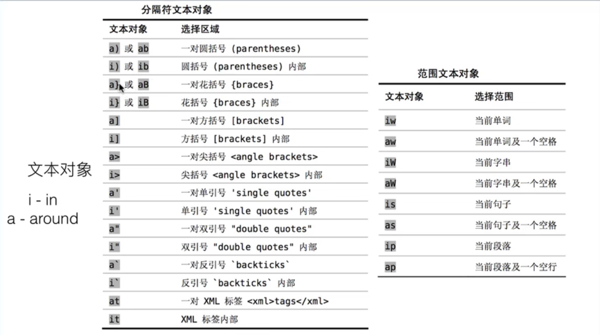
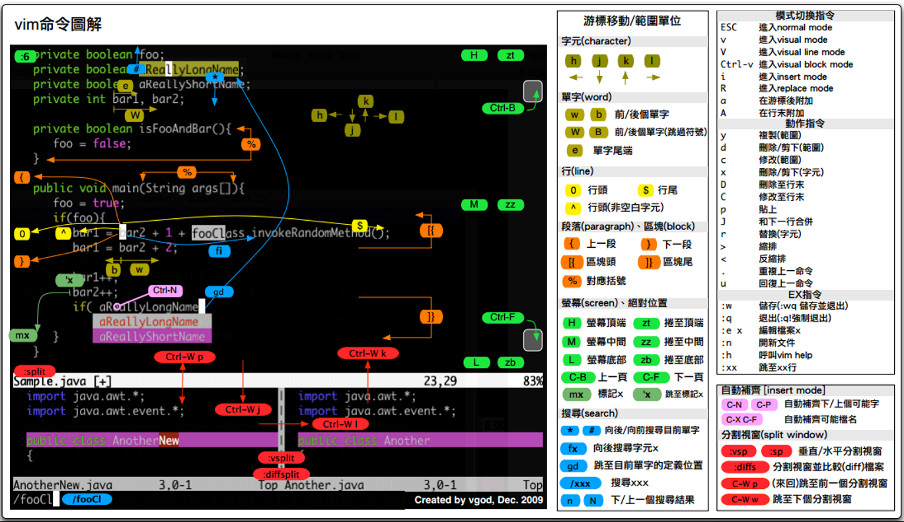

<!--
 * @Author: JohnJeep
 * @Date: 2020-05-11 22:06:09
 * @LastEditTime: 2021-08-27 09:27:53
 * @LastEditors: Please set LastEditors
 * @Description: Vim编辑器使用
--> 

<!-- TOC -->

- [1. Basics(基础)](#1-basics基础)
	- [1.1. Normal mode](#11-normal-mode)
		- [1.1.1. Cursor move(光标移动)](#111-cursor-move光标移动)
		- [1.1.2. Yank(复制)](#112-yank复制)
		- [1.1.3. Paste(粘贴)](#113-paste粘贴)
		- [1.1.4. Delete(删除)](#114-delete删除)
		- [1.1.5. Undo(撤销)](#115-undo撤销)
		- [1.1.6. Find(查找)](#116-find查找)
		- [1.1.7. Mark(标记)](#117-mark标记)
		- [1.1.8. Making corrections and moving text(修正和移动文本)](#118-making-corrections-and-moving-text修正和移动文本)
	- [1.2. Visual mode](#12-visual-mode)
	- [1.3. Visual line mode](#13-visual-line-mode)
	- [1.4. Visual block mode](#14-visual-block-mode)
	- [1.5. Replace mode](#15-replace-mode)
	- [1.6. Insert mode](#16-insert-mode)
	- [1.7. Command line mode](#17-command-line-mode)
		- [1.7.1. File](#171-file)
		- [1.7.2. Replace(替换)](#172-replace替换)
		- [1.7.3. Window(窗口)](#173-window窗口)
		- [1.7.4. Shell](#174-shell)
		- [1.7.5. Help(帮助)](#175-help帮助)
		- [1.7.6. Comment(注释)](#176-comment注释)
	- [1.8. Vim配置文件](#18-vim配置文件)
	- [1.9. 恢复文件](#19-恢复文件)
	- [1.10. Vim 命令缩图](#110-vim-命令缩图)
	- [1.11. Reference](#111-reference)

<!-- /TOC -->

# 1. Basics(基础)

vim 可以看成是一种编程语言。其中，各种按键任意的组合，可以看成是不同程序的接口。

--------------------------------------------
我们思考的有多快，这个工具使用的就有多快！（编程的速度跟上思考的速度！！！）

使用它就是为了偷懒儿，编程时减少按键按下的次数，因为使用鼠标很费时，影响编程的效率，不使用鼠标，完全用键盘去编程。

技巧感悟：每一次在按键上敲击时，想一想能否有更简单的方法去替代当前的操作。

诀窍：学会偷懒。其核心在于 “懒”，键盘上能按一次就能完成的工作，绝不按两次。

--------------------------------------------

## 1.1. Normal mode

普通模式(Normal mode)。控制屏幕光标的移动，字符、字或行的删除，移动复制某区段及进入Insert mode或者到 command line mode下。


### 1.1.1. Cursor move(光标移动)

- `h` 向左移动光标
- `j` 向下移动光标
- `k` 向上移动光标
- `l` 向右移动光标
- `+`	光标移动到非空格符的下一行；等价于 `↓`
- `–`	光标移动到非空格符的上一行；等价于 `↑`
- `n<space>`  按下数字后再按空格键，光标会向右移动这一行的 n 个字符
- `0`   或功能键[Home]	这是数字『 0 』：光标移动到这一行的开头字符处
- `$`   或功能键[End]	光标移动到这一行的最后面字符处
- `^`	  移动光标至本行第一个非空字符处
- `w(word)`	  向右移动一个词，光标停在下一个单词的开头。注意：单词与单词中间有空格时，会跳过空格，到下一个单词的开头。例如：`5w`  向右移动五个词
- `W(大写)` 移动到下一个单词开头，但忽略一些标点符号。
- `b(back)`   从当前光标处 `向左` 跳到每个单词的开头，遇见 `,` 会停止。例如： `5b`  向左移动五个词
- `B`	  从当前光标处 `向左` 跳到每个单词的开头，只认以空格分隔的词。
- `e(end of word)`   从当前光标处 `向右` 跳到每个单词的末尾，只认以空格分隔的词。
- `H(Hightest)`	  光标移动到这个屏幕的最上方那一行的第一个字符
- `M(Middle)`	  光标移动到这个屏幕的中央那一行的第一个字符
- `L(Lowest)`	  光标移动到这个屏幕的最下方那一行的第一个字符
- `G`	  移动到这个文件的最后一行(常用)
- `nG`	   n 为数字。移动到文件的第 n 行。例如 `20G` 则光标会移动到文件的第 20 行(可配合 :set nu)
- `gg`	移动到这个文件的第一行，相当于 1G 啊！ (常用)
- `ctrl g` 列出光标所在行的行号。
- `n <Enter>`	n 为数字。光标向下移动 n 行(常用)
- `shift + k` 进入帮助模式
- `>>`向右缩进
- `<<`向左缩进
- `%` 匹配括号，如果光标在"(" 上，它移动到对应的 ")" 上，反之，如果它在 ")"上，它移动到对应的"(" 上。


翻页
- `Ctrl d(down)`	屏幕向下翻半页
- `Ctrl u(up)`	屏幕向上翻半页
- `Ctrl f(front)`	屏幕向下翻一页
- `Ctrl b(back)`	屏幕向上翻一页

跳转
- `Ctrl o(older)` 后退到上一个位置
- `Ctrl i` 前进到上一个位置

### 1.1.2. Yank(复制)

Yanking 是 Vim 中拷贝命令的名字。由于"c"己经被用于表示 change了，所以拷贝(copy)就不能再用"c"了。
但"y"还是可用的。把这个命令称为 "yanking" 是为了更容易记住 "y" 这个键。

要把文本从一个地方拷贝到另一个地方，你可以先删除它，然后用 "u" 命令恢复，再用 "p" 拷到另一个地方。
可以使用更简单的方式进行拷贝，用 "y" 命令可以把文字拷贝到寄存器（register）中。然后用 "p" 命令粘贴到别处。


- 字符操作
  - `yw`  复制当前光标所在位置到单词尾字符的内容到 vi 缓存区，相当于复制一个单词
  - `y$`  复制光标所在位置到行尾内容到缓存区
  - `y^`  复制光标所在位置到行首内容到缓存区
- 行操作
  - `yy`  命令复制当前整行的内容到 vi 缓冲区
  - `5yy` 例如：`5yy` 就是复制 5 行
  - `2yw` 例如：`2yw` 就是复制 2 个单词
  - 复制第 m 行到第 n 行之间的内容，在命令行模式中输入`m，ny` 例如：3，5y 复制第三行到第五行内容到缓存区。


### 1.1.3. Paste(粘贴)

- `p(小写)` 将缓冲区内容粘贴光到标所在行的下面一行。
  > 目前光标在第 20 行，且已经复制了 10 行数据。则按下 p 后， 那 10 行数据会贴在原本的 20 行之后，亦即由 21 行开始贴
- `P(大写)` 将缓冲区内(buffer)容粘贴到光标所在行的上面一行
- `J`	将光标所在行与下一行的数据结合成同一行
- `ddp` 交换当前行和其下一行
- `xp` 交换当前字符和其后一个字符


### 1.1.4. Delete(删除)

- 字符操作(word)
  - `x(等价与 dl)`   删除当前光标下的字符。
  - `X(大写，等价与 dh)`   删除当前光标左边的字符，不包括当前光标。
  - `c(change 小写)`	修改数据，例如向下删除 10 行，`10cj`
  - `C(大写，等价与 c$)`  修改当前光标所在字符至本行末尾，执行后进入`insert` 模式。
  - `s(小写，等价与 cl)`  修改一个字符，执行后进入`insert` 模式。
  - `S(大写，等价与 cc)`  修改当前光标所在的一整行，执行后进入`insert` 模式。
  - `D(等价与 d$)`	删除当前光标到行尾的所有字符。
  - `nx`  例如3x 删除包括当前光标处向左的三个字符
  - `dw`  从当前光标处（包括当前光标）向 `前` 删除字符或单词（包括空格），一直到下一个单词开头处。
  - `cw(小写)` 从当前光标处向 `前`删除字符或单词，直到遇见空格时停止，执行后进入`insert` 模式。
  - `c0(小写)` 修改当前光标所在的位置至本行首部，执行后进入`insert` 模式。
  - `cc(小写)` 替换一行，执行后进入`insert` 模式。
  - `c3w`     从当前光标处向左删除 3 个 word，并进入 `insert` 模式。
  - `数字(n) s` 删除n个字符，从当前光标开始算起，执行后进入`insert` 模式。
  - `d0(数字0)` 删除光标所在处，到该行的最前面一个字符


- 行操作(line)
  - `dd`  删除光标所在行
  - `ndd` 删除光标所在的向下 n 行。例如3dd 删除包括当前行开始向下的三行文本
  - `d1G`	删除光标所在到第一行的所有数据
  - `dG`	删除光标所在到最后一行的所有数据
  - `:1,10d` 将1-10行剪切


### 1.1.5. Undo(撤销)

- `u(undo 小写)` 撤销最近一次的操作，可以使用多次来恢复原有的操作
- `U(大写)` 撤销对整行的操作
- `Ctrl+R(Redo)` 可以恢复对撤消 `u(小写)` 命令的操作
- `. (小数点)` 重复前一个动作的意思


### 1.1.6. Find(查找)

- `/word`	向光标之下寻找一个名称为 word 的字符串
- `?word`	向光标之上寻找一个字符串名称为 word 的字符串
- 在 `/` 或 `?` 之后，使用 `n` 向下查找，`N` 从当前字符向上查找。
- `#` 光标移到到单词上面，可以选中整个文本中相同的单词
- `:nohlsearch或(noh)` 关闭搜索后的高亮文本
- `*` 查某个变量在哪里被用到，选中需要查的变量，按下 `*` 后，相同的变量高亮，再用 `n或N` 遍历查找。
- `/str\>` 查找以str结尾的单词
- `/\<str\>` 查找以str结尾又以str开始的单词
- `f(find)`: 查找。fw: 查找以 w 开头的单词。  
- `t(to)`: 跳至。tw: 跳转到以 w 开头的单词。


### 1.1.7. Mark(标记)

- `m{mark}` 设置标记
- \`{mark} 返回标记

> Mark 是自己定义标记的字母，可以设置的任意按键。


### 1.1.8. Making corrections and moving text(修正和移动文本)

介绍几种修正和移动文本的方法，包括 3 中基本修改文本的方法：operator-motion(操作符-动作), Visual mode(可视模式) and text objects(文本对象)。

operator-motion(操作符-动作)
- `d4w` 就是操作符-动作的模式，`d` 是删除操作符，`4w` 是一个执行命令。

text-objects(文本对象)
- 使用 operator text objects 来修改文本。
- 例如 `daw`

> a 表示 around; i 表示 in。




## 1.2. Visual mode

`Normal mode` 下按 `V(小写)` 键进入到 `Visual mode`，再根据需要进行复制、粘贴、删除、多光标等不同的操作。

- `d` 删除 
- `y` 复制
- `p` 从当前光标处粘贴，但不会换行。
- `h, j, k, l` 移动光标。一般常配合 `d、y` 操作进行字符的复制遇与删除。       
- `%` 在匹配到的括号之间上来回跳


## 1.3. Visual line mode

`Normal mode` 下按 `Shift + v` 组合键或者 `V(大写)` 键进入到 `Visual line mode`，再根据需要对行(line)进行复制、粘贴、删除、多光标等不同的操作。


## 1.4. Visual block mode

`Normal mode` 下按 `Ctrl + v` 组合键进入到 `Visual block mode`，再根据需要进行复制、粘贴、删除、多光标等不同的操作。

- `d` 删除所选中的字符
- `y` 复制所选中的字符
- `p` 粘贴所选中的字符

- 如何一次性改变多行的内容(Multi cursor)？
  > 光标定位到要操作的地方，按下 `Ctrl+v` 组合键进入 `VISUAL BLOCK` 模式，通过h（左），j（下），k（上），l（右）选取行和列，按下 `Shift+i` 组合键后，进入 `Insert mode` 下的 `Multi cursor` 操作，输入要插入的内容，此时你发现在 `Insert mode` 下只有一行改变了，而不是多行同时改变了，此时需要你连续按两次 `Esc` 键，你会看到多行改变后的内容，并回到 `Normal mode` 。 


## 1.5. Replace mode

Normal mode 下进行替换操作。

- `R` 在命令行模式下，替换无限多个字符，执行后进入`insert mode`。
- `r(小写)` 替换一个字符，执行后还是在 `Normal mode`。
- `~` 将光标下的字母进行大小写转换，执行后还是在 `Normal mode`。
- `3~`      将光标位置开始的3个字母改变其大小写
- `g~~`     改变当前行字母的大小写
- `U`       将可视模式下选择的字母全改成大写字母
- `u`       将可视模式下选择的字母全改成小写
- `gUU`     将当前行的字母改成大写
- `3gUU`    将从光标开始到下面3行字母改成大写
- `guu`     将当前行的字母全改成小写
- `gUw`     将光标下的单词改成大写。
- `guw`     将光标下的单词改成小写。


## 1.6. Insert mode

插入模式(Insert mode)下，可以做文本操作，按「ESC」键可回到 `normal` 模式。

- `a(append)` 从当前光标所在的下一个字符处插入文本。
- `A(append after a line)` 从光标所在行的最后一个字符处插入文本。
- `I(insert before line)` 在当前所在行的第一个非空格处插入文本。
- `i(insert after line)` 当前光标所在位置之前插入。
- `o(open a line below)` 当前光标所在的下一行处插入新的一行。
- `O(大写字母: open a line above)` 当前光标所在处上一行插入新的一行。


## 1.7. Command line mode

Normal mode 模式下按下 `:` 键后进入 command line mode 模式，进行对文件、窗口以及字符的替换等一系列的操作。


### 1.7.1. File

Command line mode 下对文件进行操作。

- `:w [filename]`	将编辑的数据储存成另一个档案（类似另存新档）
- `:r [filename]`	在编辑的数据中，读入另一个档案的数据。将 `filename` 这个档案内容加到光标所在行后面
- `:n1,n2 w [filename]`	将 n1 到 n2 的内容储存成 filename 这个档案。
- `:w`	将编辑的数据写入(write)磁盘文件中。
- `:w!`	若文件属性为『只读』时，强制写入该档案。不过，到底能不能写入，还是跟你对该档案的档案权限有关啊！
- `:q` 文件没有修改会退出，文件有修改则不会退出。
- `:q!`	若曾修改过档案，又不想储存，使用 ! 为强制离开不储存档案。
- `:wq`(write quit) 保存并退出，等同于 `:x`(小写)。
- `:wq!` 强制保存后离开。
- `:e!` 放弃所有修改，并打开原来文件
- `:e ftp://192.168.10.76/abc.txt`  打开远程文件，比如ftp或者share folder


### 1.7.2. Replace(替换)

- `:s/old/new` 用new 替换行中首次出现的old
- `:s/old/new/g` 用new 替换行中所有出现的old
- `:n1,n2 s/old/new/g` 用new 替换从第n1行到第n2行中出现的old
- `:% s/old/new/g` 用new 替换整篇中出现的old; (g:global, s: substitute)


### 1.7.3. Window(窗口)

- `:open file`  在窗口中打开一个新的文件，会关闭之前的窗口。
- `:new` 打开一个新窗口，光标停在顶层的窗口上，不会关闭之前的窗口。
- `:close` 最后一个窗口不能使用此命令，可以防止意外退出vim。
- `:sp` 或 `:split` 将当前文件水平分屏为两个文件
- `Ctrl w w` 在打开的两个窗口之间进行切换(用的多)
- `Ctrl w j` 移动到下方的窗口(用的少)
- `Ctrl w k` 移动到上方的窗口(用的少)
- `:vsp` 将当前文件垂直分屏为两个文件
- `:vsp file`将当前文件与 file 文件两个垂直分屏


### 1.7.4. Shell

使用 `!` 可以执行命令行的操作，暂时离开 vim, 显示执行命令行的内容。

- `:!ls` 列出当前目录下文件
- `:!perl -c script.pl` 检查perl脚本语法，可以不用退出vim，非常方便。
- `:!perl script.pl` 执行perl脚本，可以不用退出vim，非常方便。
- `:suspend` 或 `Ctrl - Z` 挂起vim，回到shell，按fg可以返回vim。


### 1.7.5. Help(帮助)

- `:help` or `F1` 显示整个帮助
- `:help xxx` 显示xxx的帮助，比如 `:help i`, `:help CTRL-[`（即Ctrl+[的帮助）。
- `:help 'number'` Vim选项的帮助用单引号括起
- `:help <Esc>` 特殊键的帮助用<>扩起
- `:help -t` Vim启动参数的帮助用-
- `:help i_<Esc>` 插入模式下Esc的帮助，某个模式下的帮助用模式_主题的模式帮助文件中位于||之间的内容是超链接，可以用Ctrl+]进入链接，Ctrl+o（Ctrl + t）返回


### 1.7.6. Comment(注释)

程序中以 `#` 开始的行表示为注释，所以要注释某些行，只需在行首加入 `#`。

- `:3,5 s/^/#/g` 注释第3-5行
- `:3,5 s/^#//g` 解除3-5行的注释
- `:1,$ s/^/#/g` 注释整个文档。
- `:%s/^/#/g` 注释整个文档，此法更快。


## 1.8. Vim配置文件

- 系统级配置文件目录：`/etc/vim/vimrc`
- 用户级配置文件目录：`~/.vim/vimrc`
- 设置Tab的大小 
  ```sh
  set tabstop=4      # 表示一个 tab 显示出来是多少个空格的长度，默认 8。
  set softtabstop=4  # 表示在编辑模式的时候按退格键的时候退回缩进的长度。
  set shiftwidth=4   # 表示每一级缩进的长度，一般设置成跟softtabstop一样。
  set expandtab      # 当设置成expandtab时，缩进用空格来表示
  # set noexpandtab  # noexpandtab是用制表符表示一个缩进
  set autoindent     # 按换行键，让代码自动缩进一个Tab，设置自动缩进
  ```


## 1.9. 恢复文件

- `O(open)` 只读打开，不改变文件内容
- `E(edit)` 继续编辑文件，不恢复.swp 文件保存的内容
- `R` 将恢复上次编辑以后未保存文件内容
- `Q(quit)` 退出vi
- `D(delete)` 删除.swp 文件或者使用 `vi -r 文件名` 来恢复未保存的内容。


## 1.10. Vim 命令缩图




## 1.11. Reference

- [官方vim在线帮助手册](https://vimhelp.org/): 非常重要，值得阅读。
- [MIT2020年missing-semester lectures vim section](https://missing.csail.mit.edu/2020/editors/)
- [vim学习手册](https://linux.cn/article-8144-1.html)
- [Linux命令大全--vim学习](https://ipcmen.com/)
- [Vim的哲学](https://segmentfault.com/a/1190000000458565)
- [vim常用命令总结](https://www.cnblogs.com/yangjig/p/6014198.html)
- [vim-adventures](https://vim-adventures.com/) 通过玩游戏的方式来学习Vim。
- [Vim 快捷键大全](https://www.cnblogs.com/codehome/p/10214801.html)
- [ctags使用详解](https://blog.csdn.net/foreverling/article/details/80329586)
