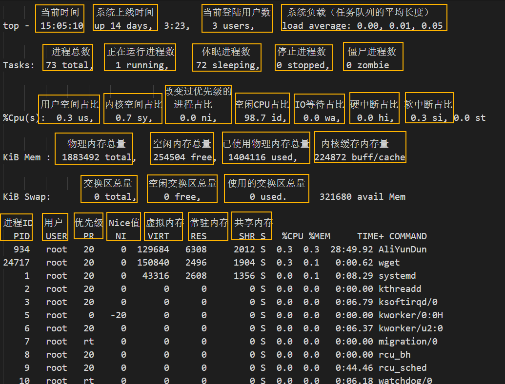

<!-- TOC -->

- [1. 性能优化](#1-性能优化)
  - [1.1. 怎样做性能优化？](#11-怎样做性能优化)
  - [1.2. 如何去分析](#12-如何去分析)
    - [1.2.1. 工具](#121-工具)
      - [1.2.1.1. gprof](#1211-gprof)
      - [1.2.1.2. oprofile](#1212-oprofile)
      - [1.2.1.3. gperftools](#1213-gperftools)
      - [1.2.1.4. mpstat](#1214-mpstat)
      - [1.2.1.5. pidstat](#1215-pidstat)
      - [1.2.1.6. iostat](#1216-iostat)
      - [1.2.1.7. vmstat](#1217-vmstat)
        - [虚拟内存原理](#虚拟内存原理)
        - [命令格式](#命令格式)
        - [命令参数](#命令参数)
      - [1.2.1.8. netstat](#1218-netstat)
      - [1.2.1.9. stress](#1219-stress)
      - [1.2.1.10. uptime](#12110-uptime)
      - [1.2.1.11. dmesg](#12111-dmesg)
      - [1.2.1.12. sar](#12112-sar)
      - [1.2.1.13. top](#12113-top)
      - [1.2.1.14. htop](#12114-htop)
      - [1.2.1.15. iftop](#12115-iftop)
      - [1.2.1.16. iotop](#12116-iotop)
    - [1.2.2. 代码编写](#122-代码编写)
  - [1.3. 优化到多少？](#13-优化到多少)
  - [1.4. 其它](#14-其它)
- [2. CPU Performance](#2-cpu-performance)
- [3. Memory Performance](#3-memory-performance)
- [4. I/O Performance](#4-io-performance)
- [5. Network Performance](#5-network-performance)
- [6. 参考](#6-参考)

<!-- /TOC -->

# 1. 性能优化

## 1.1. 怎样做性能优化？

在做性能优化之前，需要了解性能**优化指标**。从应用负载的视角来看，有两个核心指标：**吞吐量和延时**，这两个指标直接影响了产品终端的用户体验。从系统资源的角度看，有**资源利用率、饱和度**等指标。

性能问题的本质，就是系统资源已经达到瓶颈，但请求的处理却还不够快，无法支撑更多的请求。而性能分析，就是找出应用或系统的瓶颈，并设法去避免或者缓解它们，从而更高效地利用系统资源处理更多的请求。

从运行时性能的开销和编译时性能的开销角度思考

消除运行期的开销？

## 1.2. 如何去分析

如何去思考去分析性能，该从哪些方面入手？

1. 当前应用程序或系统有哪些指标可以衡量性能？
2. 怎么样去设置应用程序或系统的性能指标？
3. 使用什么样的性能工具来观察指标？
4. 导致这些指标变化的因素是什么？
5. 怎样进行性能基准测试？
6. 怎样进行性能分析定位瓶颈？
7. 性能监控和告警是怎样的？

学习的黄金准则

1. 勤思考
2. 多反思
3. 善总结
4. 多问为什么

**1 分钟之内在命令行模式下用已有的 Linux 标准工具进行性能优化检测。**

在 1 分钟之内只需要通过运行下面的 10 个命令就可以对系统资源使用和运行进程有一个很高程度的了解，寻找错误信息和饱和度指标，显示为请求队列的长度，或者等待时长、显示资源利用率。

> 饱和度是指一个资源已经超过了它自己的负荷能力。

```
uptime
dmesg | tail
vmstat 1
mpstat -P ALL 1
pidstat 1
iostat -xz 1
free -m
sar -n DEV 1
sar -n TCP,ETCP 1
top
```

有些命令需要安装 `sysstat` 工具包。这些命令展示的指标会帮助你完成一些 USE（Utilization，Saturation，Errors） 方法：定位性能瓶颈的方法论。包括了检查使用率（Utilization），饱和度（Saturation），所有资源（比如 CPU，内存，磁盘等）的错误指标（Errors）。同样也要关注你什么时候检查和排除一个资源问题，因为通过排除可以缩小分析范围，同时也指导了任何后续的检查。

### 1.2.1. 工具

**性能工具选择的黄金准则：一个正确的选择胜过千百次的努力。** 选用合适的性能工具，可以大大简化整个性能优化的过程。

性能分析可以用哪些工具来衡量？

下图是常见的性能分析工具，来自性能领域的大师布伦丹·格雷格（Brendan Gregg）绘制，这个图是 Linux 性能分析最重要的参考资料之一，它告诉你，在 Linux 不同子系统出现性能问题后，应该用什么样的工具来观测和分析。


#### 1.2.1.1. gprof

gprof 是 GNU 工具链之一，编译的时候，它在每个函数的出入口加入了 profiling 的代码，运行时统计程序在用户态的执行信息，可以得到每个函数的调用次数，执行时间，调用关系等信息，简单易懂。适合于查找用户级程序的性能瓶颈，然而对于很多耗时在内核态执行的程序，gprof 不适合。

#### 1.2.1.2. oprofile

oprofile 是一个开源的 profiling 分析工具，它使用硬件调试寄存器来统计信息，进行 profiling 的开销比较小，而且可以对内核进行 profiling。它统计的信息非常多，可以得到 cache 的缺失率，memory 的访存信息，分支预测错误率等等，这些信息 gprof 得不到，但是对于函数调用次数，它无能为力。

#### 1.2.1.3. gperftools

Google 开发的一款性能分析工具，提供整个程序的热点分布图，找到性能瓶颈，然后可以针对性的进行性能优化。

#### 1.2.1.4. mpstat

mpstat 是多核 CPU 性能分析工具，用来实时查看每个 CPU 的性能指标，以及所有 CPU 的平均指标。

```sh
参数项
    -P: 输出哪个处理器的数据，后面跟 CPU 的数字号码或者是 ON 或 ALL；ON 表示输出统计每个在运行的处理器；ALL 表示输出统计所有的处理器

// 监控所有 CPU，每隔5秒输出一组数据
[root@CentOS7 ~]# mpstat -P ALL 5
Linux 3.10.0-1160.49.1.el7.x86_64 (CentOS7)     12/15/2021      _x86_64_        (2 CPU)
10:55:54 PM  CPU    %usr   %nice    %sys %iowait    %irq   %soft  %steal  %guest  %gnice   %idle
10:55:59 PM  all   50.10    0.00    0.00    0.00    0.00    0.00    0.00    0.00    0.00   49.90
10:55:59 PM    0    0.00    0.00    0.20    0.00    0.00    0.00    0.00    0.00    0.00   99.80
10:55:59 PM    1  100.00    0.00    0.00    0.00    0.00    0.00    0.00    0.00    0.00    0.00
```

#### 1.2.1.5. pidstat

pidstat 是进程性能分析工具，监视当前被 Linux 内核管理的单个任务，用来实时查看进程的 CPU、内存、I/O 以及上下文切换等性能指标。

```sh
参数项
    -u 输出 CPU 的利用率，utilization 缩写为 u
    -t 显示所选线程的统计信息，很常用，thread 缩写为 t
    -r 显示缺页错误（page faults）和内存利用信息
    -w 任务活动切换的信息，只有在 Linux kernels 大于等于 2.6.23 才有效

// 每隔 5 秒输出一组数据
[root@CentOS7 ~]# pidstat -u 5 1
Linux 3.10.0-1160.49.1.el7.x86_64 (CentOS7)     12/15/2021      _x86_64_        (2 CPU)
10:57:36 PM   UID       PID    %usr %system  %guest    %CPU   CPU  Command
10:57:41 PM     0         3    0.00    0.20    0.00    0.20     0  kworker/0:0
10:57:41 PM     0       745    0.00    0.20    0.00    0.20     0  vmtoolsd
10:57:41 PM     0      6791  100.00    0.00    0.00  100.00     1  stress
10:57:41 PM     0      6914    0.00    0.20    0.00    0.20     0  pidstat

Average:      UID       PID    %usr %system  %guest    %CPU   CPU  Command
Average:        0         3    0.00    0.20    0.00    0.20     -  kworker/0:0
Average:        0       745    0.00    0.20    0.00    0.20     -  vmtoolsd
Average:        0      6791  100.00    0.00    0.00  100.00     -  stress
Average:        0      6914    0.00    0.20    0.00    0.20     -  pidstat
```

#### 1.2.1.6. iostat

iostat 工具用于通过观察设备相对于其平均传输速率的活动时间来监视系统输入/输出设备负载。

```
// 每隔 1 秒中显示I/O设备信息
$ iostat -xz 1
Linux 2.6.32-358.el6.x86_64 (KF-CFT-AP2)        2022年01月27日  _x86_64_        (4 CPU)

avg-cpu:  %user   %nice %system %iowait  %steal   %idle
           1.34    0.00    0.79    0.02    0.00   97.86

Device:         rrqm/s   wrqm/s     r/s     w/s   rsec/s   wsec/s avgrq-sz avgqu-sz   await  svctm  %util
sda               0.02     2.91    0.13    1.49     6.62    35.20    25.74     0.00    2.22   0.69   0.11
sdb               0.01     0.69    0.09    0.40     2.59     8.75    23.19     0.00    2.96   0.67   0.03
dm-0              0.00     0.00    0.24    5.49     9.06    43.93     9.24     0.05    8.85   0.23   0.13
dm-1              0.00     0.00    0.00    0.00     0.00     0.01     8.00     0.00    3.74   0.28   0.00

avg-cpu:  %user   %nice %system %iowait  %steal   %idle
           3.31    0.00    2.54    0.00    0.00   94.15

Device:         rrqm/s   wrqm/s     r/s     w/s   rsec/s   wsec/s avgrq-sz avgqu-sz   await  svctm  %util
sdb               0.00     0.00    0.00    3.00     0.00    24.00     8.00     0.01    4.00   4.00   1.20
dm-0              0.00     0.00    0.00    3.00     0.00    24.00     8.00     0.01    4.00   4.00   1.20
```

输出结果各个字段说明

1. r/s, w/s, rkB/s, wkB/s：这些表示设备上每秒钟的读写次数和读写的字节数（单位是k字节）。这些可以看出设备的负载情况。性能问题可能就是简单的因为大量的文件加载请求。

2. await(r_await、w_await)：平均每次设备 I/O 请求操作的等待时间(ms)，包含请求排列在队列中和被调度服务的时间之和；过大的平均等待时间就预示着设备超负荷了或者说设备有问题了。

3. avgqu-sz：发送给设备 I/O 请求的等待队列平均长度，对于单个磁盘如果值>1表明设备饱和，对于多个磁盘阵列的逻辑磁盘情况除外

4. %util：设备的使用率，表明每秒中用于 I/O 工作时间的占比，单个磁盘当 %util>60% 的时候性能就会下降(体现在 await 也会增加)，当接近100%时候就设备饱和了，但对于有多个磁盘阵列的逻辑磁盘情况除外

5. svctm：发送给设备 I/O 请求的平均服务时间(ms)，如果 svctm 与 await 很接近，表示几乎没有 I/O 等待，磁盘性能很好，否则磁盘队列等待时间较长，磁盘响应较差；

#### 1.2.1.7. vmstat

vmstat是 Virtual Meomory Statistics（虚拟内存统计）的缩写，可对操作系统的processes、 memory、paging、 block IO、 traps、CPU等活动进行监控。他是对系统的整体情况进行统计，不足之处是无法对某个进程进行深入分析。vmstat 工具提供了一种低开销的系统性能观察方式。因为 vmstat 本身就是低开销工具，在非常高负荷的服务器上，你需要查看并监控系统的健康情况,在控制窗口还是能够使用vmstat 输出结果。

##### 虚拟内存原理

在系统中运行的每个进程都需要使用到内存，但不是每个进程都需要每时每刻使用系统分配的内存空间。当系统运行所需内存超过实际的物理内存，内核会释放某些进程所占用但未使用的部分或所有物理内存，将这部分资料存储在磁盘上直到进程下一次调用，并将释放出的内存提供给有需要的进程使用。

在Linux内存管理中，主要是通过“调页Paging”和“交换Swapping”来完成上述的内存调度。调页算法是将内存中最近不常使用的页面换到磁盘上，把活动页面保留在内存中供进程使用。交换技术是将整个进程，而不是部分页面，全部交换到磁盘上。

分页(Page)写入磁盘的过程被称作Page-Out，分页(Page)从磁盘重新回到内存的过程被称作Page-In。当内核需要一个分页时，但发现此分页不在物理内存中(因为已经被Page-Out了)，此时就发生了分页错误（Page Fault）。

当系统内核发现可运行内存变少时，就会通过Page-Out来释放一部分物理内存。尽管Page-Out不是经常发生，但是如果Page-out频繁不断的发生，直到当内核管理分页的时间超过运行程式的时间时，系统效能会急剧下降。这时的系统已经运行非常慢或进入暂停状态，这种状态亦被称作thrashing(颠簸)。

##### 命令格式

```shell
vmstat [-a] [-n] [-S unit] [delay [ count]]
vmstat [-s] [-n] [-S unit]
vmstat [-m] [-n] [delay [ count]]
vmstat [-d] [-n] [delay [ count]]
vmstat [-p disk partition] [-n] [delay [ count]]
vmstat [-f]
vmstat [-V]
```

##### 命令参数

```shell
-m：显示slabinfo
  
-n：只在开始时显示一次各字段名称。
  
-s：显示内存相关统计信息及多种系统活动数量。
  
delay：刷新时间间隔。如果不指定，只显示一条结果。
  
count：刷新次数。如果不指定刷新次数，但指定了刷新时间间隔，这时刷新次数为无穷。
  
-d：显示磁盘相关统计信息。
  
-p：显示指定磁盘分区统计信息
  
-S：使用指定单位显示。参数有 k 、K 、m 、M ，分别代表1000、1024、1000000、1048576字节（byte）。默认单位为K（1024 bytes）
  
-V：显示vmstat版本信息。
```

示例：每隔 1 秒打印一条统计信息

```
$ vmstat 1
procs -----------memory---------- ---swap-- -----io---- --system-- -----cpu-----
 r  b   swpd   free   buff  cache   si   so    bi    bo   in   cs us sy id wa st
10  0   8320 3822308 427996 2263180    0    0     1     6    0    3  1  1 98  0  0
 0  0   8320 3822176 427996 2263184    0    0     0     0 5889 20478  2  1 97  0  0
 1  0   8320 3822176 427996 2263184    0    0     0     0 6126 20785  3  1 97  0  0
 3  0   8320 3822176 427996 2263184    0    0     0    48 6459 21076  2  1 96  0  0
```

虚拟内存模式（VM mode）下，显示结果中各个字段的含义

- procs
  
  - r：CPU 上的等待运行时（run time）的进程数。这个指标提供了判断 CPU 饱和度的数据，因为它不包含 I/O 等待的进程。
  - b：不可中断睡眠状态（uninterruptible sleep）的进程数；

- Memory
  
  - swpd 表示使用到的虚拟内存数量
  - free：空闲内存，单位是 k。如果这个数比较大，就说明你还有充足的空闲内存。“free -m” 和下面第 7 个命令，可以更详细的分析空闲内存的状态。

- swap
  
  - si：从磁盘交换进来和交换出去的内存数。
  - so：从磁盘交换出去的内存数。

- IO： 
  
  - bo： 每秒钟发送到块设备的块数目，单位：blocks/s。
  - bi  每秒钟从块设备收到的块数目，单位：blocks/s。

- system 
  
  - in：每秒钟的系统中断数，包括时钟中断（clock）。
  - cs：每秒钟上下文切换的数。

- cpu
  
  下面这些是占总 CPU 时间的百分比。
  
  - us：运行非内核代码花费的时间，用户空间的时间，包括 nice time。（user time）
  
  - sy：运行内核代码花费的时间。（system time）
  
  - id：空闲 CPU 花费的时间。在 Linux 内核版本 2.5.41 之前，还包括 IO-wait 时间。（idle）
  
  - wa：等待 IO 花费的时间。（waitting）
  
  - st：从虚拟机器偷走的时间，在 Linux 内核 2.6.11之前，为unknown。（stolen）
    
    有虚拟机的情景下才有意义，因为虚拟机下 CPU 也是共享物理 CPU 的，所以这段时间表明虚拟机等待 hypervisor 调度 CPU 的时间，也意味着这段时间 hypervisor 将 CPU 调度给别的 CPU 执行，这个时段的 CPU 资源被“stolen”了。
  
  
  
  参考： https://www.apim.cn/html/5375

#### 1.2.1.8. netstat

netstat 是一个查看系统中端口使用情况的一个命令，显示自从系统启动以来，各个协议的总体数据信息。侦听端口：应用程序或进程侦听的网络端口，充当通信端点。注意：同一个 IP 地址上不能用两个不同的服务去侦听同一端口

```sh
语法格式
  netstat 检查端口

参数项
  -a --all       显示监听和非监听的 sockets
  -t --tcp       显示 TCP 端口。
  -u --udp       显示 UDP 端口。
  -n --numeric   显示数字地址而不是主机名（host）、port、user names。
  -l --listening 仅显示侦听的 sockets。
  -p --program   显示每个 sockets 所属程序的 PID 和 name。

示例：
  netstat -tunlp | grep 端口号   # 列出正在侦听的所有TCP或UDP端口，
                                # 显示程序的PID和name，同时以数字形式显示IP，最常用
[root@KF]# netstat -tunlp | grep 22
tcp        0      0 0.0.0.0:22          0.0.0.0:*         LISTEN      1919/sshd
tcp        0      0 :::22               :::*              LISTEN      1919/sshd

  netstat -apn | grep 端口号     # 查看指定端口号的所有进程在TCP、UDP传输中的所有状态
  netstat -antp                 # 列出所有TCP的连接
  netstat -nltp                 # 列出本地所有TCP侦听套接字
```

#### 1.2.1.9. stress

stress 是linux 下的压力测试小工具，可以用来模拟 CPU、IO、内存、磁盘等资源耗尽的问题，但这也仅仅只是用来模拟进行简单的资源耗尽问题，用它模拟产生的结果和业务真实场景差别还是很大的，真实业务场景下不建议使用。

```sh
参数项
    -t: 等同于 --timeout N，在 N 秒后超时
    -c: 等同于 --cpu N，产生 N 个 CPU 工作
    -i: 等同于 --io N，产生 N 个 IO 工作

// 模拟 CPU1 使用率为 100% 的情况
[root@CentOS7 ~]# stress --cpu 1 --timeout 600
stress: info: [6790] dispatching hogs: 1 cpu, 0 io, 0 vm, 0 hdd
```

#### 1.2.1.10. uptime

`uptime` 命令显示当前系统运行了多长时间，当前有多少个用户登录，系统在过去 1分钟、5分钟、15分钟的负载均衡信息，是一种快速展示系统平均负载的手段。

```shell
$ uptime
 10:32:25 up 21 days, 22:36,  5 users,  load average: 0.00, 0.00, 0.00
```

#### 1.2.1.11. dmesg

dmesg 工具被用来检查和控制内核的环形缓冲区（ring buffer），分析内核产生的一些信息，该程序帮助用户打印出启动消息。

系统在启动的时候，内核会去检测系统的硬件，你的某些硬件到底有没有被识别，就与这个时候的侦测有关。 但是这些侦测的过程要不是没有显示在屏幕上，就是很飞快的在屏幕上一闪而逝。能不能把内核检测的信息识别出来看看？ 可以使用 dmesg 。所有内核检测的信息，不管是启动时候还是系统运行过程中，反正只要是内核产生的信息，都会被记录到内存中的某个保护区段。 dmesg 这个指令就能够将该区段的信息读出来。

```shell
// 打印启动消息日志中的最后 10 信息
$ dmesg | tail
[1880957.563150] perl invoked oom-killer: gfp_mask=0x280da, order=0, oom_score_adj=0
[...]
[1880957.563400] Out of memory: Kill process 18694 (perl) score 246 or sacrifice child
[1880957.563408] Killed process 18694 (perl) total-vm:1972392kB, anon-rss:1953348kB, file-rss:0kB
[2320864.954447] TCP: Possible SYN flooding on port 7001. Dropping request.  Check SNMP counters.
```

#### 1.2.1.12. sar

sar 工具用来检测网络接口的吞吐：`rxkB/s` 和 `txkB/s`，作为收发数据负载的度量，也是检测是否达到收发极限。

```shell
参数项
  -n 主要用来分析网络活动，虽然网络中它还给细分了 NFS、IP、ICMP、SOCK 等各种层次各种协议的数据信息。

// 每隔1秒中显示网络接口的吞吐量，
$ sar -n DEV 1
Linux 2.6.32-358.el6.x86_64 (KF-CFT-AP2)        2022年01月27日  _x86_64_        (4 CPU)

11时24分52秒     IFACE   rxpck/s   txpck/s    rxkB/s    txkB/s   rxcmp/s   txcmp/s  rxmcst/s
11时24分53秒        lo      0.00      0.00      0.00      0.00      0.00      0.00      0.00
11时24分53秒      eth1      3.06      0.00      0.18      0.00      0.00      0.00      0.00

11时24分53秒     IFACE   rxpck/s   txpck/s    rxkB/s    txkB/s   rxcmp/s   txcmp/s  rxmcst/s
11时24分54秒        lo      2.04      2.04      0.11      0.11      0.00      0.00      0.00
11时24分54秒      eth1      8.16      6.12      0.51      0.75      0.00      0.00      0.00

// 示例2：每隔1秒显示tcp统计的信息
$ sar -n TCP,ETCP 1
Linux 2.6.32-358.el6.x86_64 (KF-CFT-AP2)        2022年01月27日  _x86_64_        (4 CPU)

11时30分03秒  active/s passive/s    iseg/s    oseg/s
11时30分04秒      0.00      0.00      3.09      3.09

11时30分03秒  atmptf/s  estres/s retrans/s isegerr/s   orsts/s
11时30分04秒      0.00      0.00      0.00      0.00      0.00
```

显示结果解释

- TCP
  
  - active/s：本地发起的 TCP 连接，比如通过 connect()，TCP 的状态从CLOSED -> SYN-SENT
  - passive/s：由远程发起的 TCP 连接，比如通过 accept()，TCP 的状态从LISTEN -> SYN-RCVD
  - retrans/s(tcpRetransSegs)：每秒钟 TCP 重传数目，通常在网络质量差，或者服务器过载后丢包的情况下，根据 TCP 的确认重传机制会发生重传操作
  - isegerr/s(tcpInErrs)：每秒钟接收到出错的数据包(比如 checksum 失败)

- UDP
  
  - noport/s(udpNoPorts)：每秒钟接收到的但是却没有应用程序在指定目的端口的数据报个
  - idgmerr/s(udpInErrors)：除了上面原因之外的本机接收到但却无法派发的数据报个数

#### 1.2.1.13. top

Top 是 linux 下动态监控各个进程资源占用状况的工具，默认按照CPU使用率为排序的依据，类似于 Windows 中的任务管理器。

```sh
参数项：
    %us 用户空间程序的 cpu 使用率（没有通过 nice 调度）
    %sy 系统空间的 cpu 使用率，主要是内核程序。
    %ni 用户空间且通过 nice 调度过的程序的 cpu 使用率。
    %id 空闲cpu
    %wa cpu运行时在等待io的时间
    %hi cpu处理硬中断的数量
    %si cpu处理软中断的数量
    %st 被虚拟机偷走的cpu 

例子：
    top -bn 1 -i -c
```

利用一张图来解释各个参数的用法。



CPU 占用率高很多情况下意味着一些东西，这也给服务器 CPU 使用率过高情况下指明了相应地排查思路：

1. 当 user 占用率过高的时候，通常是某些个别的进程占用了大量的 CPU，这时候很容易通过 top 找到该程序；此时如果怀疑程序异常，可以通过 perf 等思路找出热点调用函数来进一步排查；
2. 当 system 占用率过高的时候，如果 IO 操作(包括终端 IO)比较多，可能会造成这部分的 CPU 占用率高，比如在 file server、database server 等类型的服务器上，否则(比如>20%)很可能有些部分的内核、驱动模块有问题；
3. 当 nice 占用率过高的时候，通常是有意行为，当进程的发起者知道某些进程占用较高的 CPU，会设置其 nice 值确保不会淹没其他进程对 CPU 的使用请求；
4. 当 iowait 占用率过高的时候，通常意味着某些程序的 IO 操作效率很低，或者 IO 对应设备的性能很低以至于读写操作需要很长的时间来完成；
5. 当 irq/softirq 占用率过高的时候，很可能某些外设出现问题，导致产生大量的irq请求，这时候通过检查 /proc/interrupts 文件来深究问题所在；
6. 当 steal 占用率过高的时候，黑心厂商虚拟机超售了吧！

Buffers 与 Cached 对比说明

- Buffers 是针对 raw disk 的块缓存，主要是以 raw block 的方式缓存文件系统的元数据(比如超级块信息等)，这个值一般比较小(20M左右)；
- Cached 是针对于某些具体的文件进行读缓存，以增加文件的访问效率而使用的，可以说是用于文件系统中文件缓存使用。

#### 1.2.1.14. htop

`htop`是 `top`工具命令的“进化版本”，它的一大特色在于可视化交互方面做得很优秀。它不是 Linux 系统默认自带的，使用它需要额外的安装。它也是Linux系统下的一个交互式进程浏览器，可以替代上面的`top`命令，与`top`命令对比，`htop`有如下优点：

- 支持鼠标点按交互
- 画面可以水平/垂直滚动，更像一个窗口
- 可以跟踪进程，显示进程打开的文件等
- 支持进程的树状图显示
- 支持按名称查找进程
- ...等等

#### 1.2.1.15. iftop

`iftop`是 Linux 系统上的网络流量和带宽监控工具，可用于查看（监控）实时的网络流量、网络TCP/IP连接等等，它不是 Linux 系统默认自带的，使用它需要额外的安装。

```
常用参数项
-i 指定网卡，如：iftop -i eth0
-B 以bytes为单位显示，如：iftop -B
-n host信息显示IP，如：iftop -n
-N 端口信息显示端口号，如: iftop -N
-F 指定网段，如iftop -F 10.10.1.0/24
-h 帮助信息
```

#### 1.2.1.16. iotop

`iotop` 是 Linux 系统默认自带的一个用来监控磁盘 I/O 使用情况的工具。

### 1.2.2. 代码编写

优化编写的代码。

## 1.3. 优化到多少？

## 1.4. 其它

```cpp
打印行和文件：stream(__FILE__, __LINE__)
```

判断是运行时变量还是编译时变量？

​    使用 static_assert()

应用：

​    替换宏（为什么要替换宏？）

​    宏运行在什么时候？（编译？运行？）

# 2. CPU Performance

load average（平均负载）：单位时间内，系统处于可运行状态（runnable state）或不可中断状态（uninterruptable state）的平均进程数，与 CPU 使用率并没有直接关系。

可运行状态的进程：正在使用 CPU 或正在等待 CPU 的进程。也就是我们常用 ps 命令看到的，处于 R 状态（Running 或 Runnable）的进程。

不可中断状态的进程：正处于内核态关键流程中的进程，并且这些流程是不可打断的。比如最常见的是正在等待磁盘（disk），也就是我们在 ps 命令中看到的 D 状态（Uninterruptible Sleep，也称为 Disk Sleep）的进程。

比如，当一个进程向磁盘读写数据时，为了保证数据的一致性，在得到磁盘回复前，它是不能被其他进程或者中断打断的，这个时候的进程就处于不可中断状态。如果此时的进程被打断了，就容易出现磁盘数据与进程数据不一致的问题。所以，不可中断状态实际上是系统对进程和硬件设备的一种保护机制。

正确区分平均负载和 CPU 使用率

CPU 使用率指单位时间内 CPU 繁忙情况的统计，跟平均负载并不一定完全对应。比如下面的情况：

- CPU 密集型进程，使用大量 CPU 会导致平均负载升高，此时这两者是一致的；
- I/O 密集型进程，等待 I/O 也会导致平均负载升高，但 CPU 使用率不一定很高；
- 大量等待 CPU 的进程调度也会导致平均负载升高，此时的 CPU 使用率也会比较高。

# 3. Memory Performance

# 4. I/O Performance

# 5. Network Performance

# 6. 参考

- [Linux Performance](http://www.brendangregg.com/linuxperf.html)

- [如何 60 秒内进行 Linux 性能分析](https://mp.weixin.qq.com/s?__biz=MzI0OTA3OTM4MA==&mid=2455110627&idx=1&sn=6452b61a1aa9126cd6874b6f731f03a1&chksm=fe3450d8c943d9ce389372f9da4e5a1c54d6419b98144cc346ccfafa175758901fe68cf99a73&mpshare=1&scene=24&srcid=&sharer_sharetime=1590076651796&sharer_shareid=1813da429599d3785585eac965f1aa77&key=1cb409b1e6845731cbb675abe3379f22acb3e7524678737985c9ea500376d57bbcc18d4b8e7489b2d6893af87959cedd648921fdf755fdf7e84cfa01839bda54e39dc3385f15d8a5536bd178abf3d05aa09fe562f4c63c6aa8caf0cd6d98656ffe9f1bb3464f30260a244d566cf1059e19ef198ee743d49e80051e78a222434d&ascene=14&uin=MTE2MDU5MjIzNA%3D%3D&devicetype=Windows+10+x64&version=6300002f&lang=zh_CN&exportkey=A6Io2cPWUakbyRI7AlfF3dA%3D&pass_ticket=aUFZUParu2js4nQ7AaFdbqYXSULD4Aap4Fv2P64VAtlM%2FsR52EPLWAmjVTjvWw97&wx_header=0)

- [CodeSheep 列出常用监控工具](https://mp.weixin.qq.com/s?__biz=MzU4ODI1MjA3NQ==&mid=2247495793&idx=1&sn=a46b6570280594552e5d711942f72eb0&chksm=fddd26b5caaaafa303b282a258b712a461f7a453af9d9c6737515f8edc8cf74d5c57a6a2e94d&scene=126&&sessionid=1643247338#rd)

- [如何查看 Linux 服务器性能参数指标？](https://mp.weixin.qq.com/s/8PShiKil_rOiIZbH4C95HA)


- [面试官：如何优化你的程序](https://mp.weixin.qq.com/s/S46POYxx4QQQuubpGwMaxg)