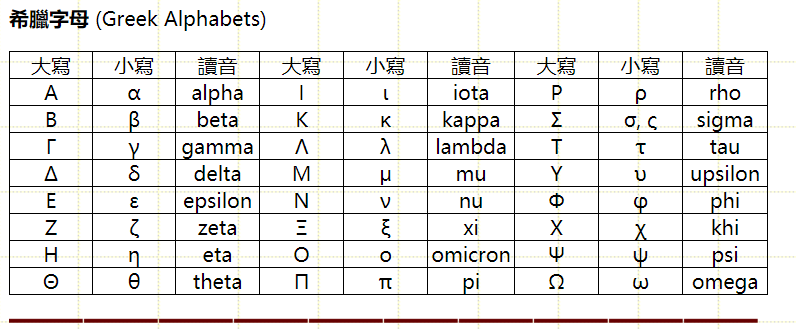

<!--
 * @Author: JohnJeep
 * @Date: 2021-01-11 22:14:21
 * @LastEditTime: 2023-08-04 14:52:34
 * @LastEditors: JohnJeep
 * @Description: In User Settings Edit
-->
# 希腊字母表

## 小写希腊字母

$\alpha$  \alpha

$\beta$  \beta

$\gamma$  \gamma

$\delta$  \delta

$\epsilon$  \epsilon

$\zeta$  \zeta

$\eta$  \eta

$\theta$  \theta

$\iota$  \iota

$\kappa$ \kappa

$\lambda$  \lambda

$\mu$  \mu

$\nu$  \nu

$\xi$  \xi

$\omicron$  \omicro

$\pi$  \pi

$\rho$  \rho

$\sigma$  \sigma

$\tau$  \tau

$\upsilon$  \upsilon

$\phi$  \phi

$\chi$  \chi

$\psi$  \psi

$\omega$  \omega

## 大写希腊字母
$\Alpha$  \Alpha

$\Beta$  \Beta

$\Gamma$  \Gamma

$\Delta$  \Delta

$\Epsilon$  \Epsilon

$\Zeta$  \Zeta

$\Eta$  \Eta

$\Theta$  \Theta

$\Iota$  \Iota

$\Kappa$ \Kappa

$\Lambda$  \Lambda

$\Mu$  \Mu

$\Nu$  \Nu

$\Xi$  \Xi

$\Omicron$  \Omicro

$\Pi$  \Pi

$\Rho$  \Rho

$\Sigma$  \Sigma

$\Tau$  \Tau

$\Upsilon$  \Upsilon

$\Phi$  \Phi

$\Chi$  \Chi

$\Psi$  \Psi

$\Omega$  \Omega

# References
- [维基百科希腊字母表](https://zh.wikipedia.org/wiki/%E5%B8%8C%E8%85%8A%E5%AD%97%E6%AF%8D)

