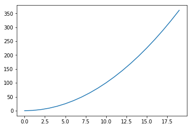

<!--
 * @Author: JohnJeep
 * @Date: 2022-01-27 17:21:57
 * @LastEditors: JohnJeep
 * @LastEditTime: 2023-08-04 11:29:23
 * @Description: Jupyter 基础语法
 * Copyright (c) 2023 by John Jeep, All Rights Reserved. 
-->

# 1. jupyter 基础
 

## 1.1. 命令模式下的单元格操作
1. L: 显示代码的行号
2. m: 将单元格变为 markdown 类型，在 markdown 类型的单元格内可以编写文档
3. y: 将单元格变为代码类型，在代码类型的单元格中输入 Python 代码
4. d: 按两下 d 按键删除单元格（删除当前的 cell：dd）
5. z: 撤销最后删除单元格操作
6. a: 在当前单元格之上创建一个新的单元格
7. b: 在当前单元格之下创建一个新的单元格
8. x: 剪切当前单元格
9. c: 复制当前单元格
10. v: 在当前单元格之下粘贴剪切板中的单元格
11. shift+k: 将当前单元格上移
12. shift+j: 将当前单元格下移
13. shift+m: 与下面的单元合并
14. 将当前的 cell 转化为具有一级标题的 maskdown：数字键 1
15. 将当前的 cell 转化为具有二级标题的 maskdown：数字键 2
16. 将当前的 cell 转化为具有三级标题的 maskdown：数字键 3


## 1.2. 编辑和运行
1. 执行当前 cell，并自动跳到下一个 cell：Shift Enter
2. 执行当前 cell，执行后不自动调转到下一个 cell：Ctrl-Enter  （Ctrl+Enter：结束编辑，对于代码单元将运行其中的代码，对于标题单元和 markdown 单元将格格式化显示）
3. 当前 cell 进入编辑模式：Enter
4. 退出当前 cell 的编辑模式：Esc
5. Alt+Enter：运行当前的代码并在下面插入新的单元
6. 为一行或者多行添加/取消注释：Crtl /
7. 撤销对某个 cell 的删除：z
8. 浏览器的各个 Tab 之间切换：Crtl PgUp 和 Crtl PgDn
9. 快速跳转到首个 cell：Crtl Home
10. 快速跳转到最后一个 cell：Crtl End
11. 在命令模式下按 Enter 键进入编辑模式即可查看本段文字的 Markdown 代码
12. 编辑模式下单元使用绿色边框显示，在命令模式时按 Enter 即可进入编辑模式
13. 在行内的数学公式使用单个 ` $ ` 括起
14. 单独占一行的数学公式使用  ` $$ `括起


## 1.3. 操作运算核   
1. 如果进入了 Python 的死循环，可以在命令模式下按两下 **i** 按键终止循环。
2. 如果 i 按键不能终止编译代码中的死循环，可以按两次** 0**（是零不是 o）按键重新启动运算核心，当前运行环境中的所有对象都将消失

注意：**右上角图标从空心圈变为实心圈，表示运算核正在工作，无法执行新的代码。请按两下 **i** 按键终止循环，注意右上角的图标变回空心圈**


# 2. jupyter notebook 命令


## 2.1. 无序列表
- 1
- 2
- 3


## 2.2. 有序列表
1. ok
2. ok
3. ok


## 2.3. 链接的使用
[百度](https://www.baidu.com)


## 2.4. 字体
*斜体*

**粗体**


## 2.5. 图片的引用
插入图片不需要其他按钮，你只需要使用  这样的语法即可


## 2.6. 引用
> 种豆南山下
> 草盛豆苗稀


## 2.7. 代码引用
需要引用代码时，如果引用的语句只有一段，不分行，可以用 ` 将语句包起来。
如果引用的语句为多行，可以将 ``` 置于这段代码的首行和末行。

`print(work)`

```
print(work)
```


## 2.8. Multicursor support（支持多光标）
按住 **Alt** 进行点击和拖拽鼠标即可


# 3. 导入 python 代码


## 3.1. 本地导入 python 代
- %load+文件路径（文件的路径可以是相对地址也可以是绝对地址） 


`%load 蟒蛇图形绘制。py`

```
# %load 蟒蛇图形绘制.py
#蟒蛇图形绘制.py
import turtle
turtle.setup(650,350,200,200)        #窗体的绘制
turtle.penup()                  #画笔控制函数
turtle.fd(-250)
turtle.pendown()
turtle.pensize(25)
turtle.pencolor("green")
turtle.seth(-40)                #改变海龟（面对方向）的行进方向，但不行进
for i in range(4):
    turtle.circle(40,80)
    turtle.circle(-40,80)

turtle.circle(40,80/2)
turtle.fd(40)
turtle.circle(16,180)
turtle.fd(40*2/3)
turtle.done
```


## 3.2. 网络导入代码
从网络中导入 python 代码，使用`%load` 网址   


# 4. jupyter 中运行 python 文件
1. `%run + python 文件`
   - 直接在 cell 中输入：`%run xxx.py` 按 **Ctrl+Enter** 后，执行结果直接在这个 cell 的下面显示如下图所示
   - `%run 温度转换.py`
    ```python
    %run 温度转换.py
    ```
1. `！ + Python 文件`
   - 在 command 前面加入一个感叹号` ! ` 。 例如：` ! 蟒蛇图形绘制.py`
    ```python
    ! 蟒蛇图形绘制.py
    ```


# 5. matplotlib 绘图
当在程序中使用了 matplotlib 绘图，不能直接显示时，需要加` %matplotlib inline `

```python
# %matplotlib inline
import matplotlib.pylab as plt
import numpy as np

x = np.arange(20)
y = x**2
plt.plot(x,y)
```
[<matplotlib.lines.Line2D at 0x213fd214cc0>]




# 6. magic 命令


## 6.1. magic 命令用法
1. 魔法命令都以 **%** 或者 **%%** 开头，以 **%** 开头的成为**行命令**，**%%** 开头的称为**单元命令**。行命令只对命令所在的行有效，而单元命令则必须出现在单元的第一行，对整个单元的代码进行处理。
2. 在 Jupyter 中执行 **%lsmagic** 可以列举所有的魔法命令；
3. **%magic** 可以查看关于各个命令的说明，
4. 在%命令之后添加 **?** 可以查看该命令的详细说明（例如：%magic?）


## 6.2. 常用的魔术命令有
- %quickref	显示 IPython 快速参考
- %magic	显示所有魔术命令的详细文档
- %debug	从最新的异常跟踪的底部进入交互式调试器
- %pdb	在异常发生后自动进入调试器
- %reset	删除 interactive 命名空间中的全部变量
- %run script.py	执行 script.py
- %prun statement	通过 cProfile 执行对 statement 的逐行性能分析
- %time statement	测试 statement 的执行时间
- %timeit statement	多次测试 statement 的执行时间并计算平均值
- %who、%who_ls、%whos	显示 interactive 命名空间中定义的变量，信息级别/冗余度可变
- %xdel variable	删除 variable，并尝试清除其在 IPython 中的对象上的一切引用
- !cmd	在系统 shell 执行 cmd
- output=!cmd args	执行 cmd 并赋值
- %bookmark	使用 IPython 的目录书签系统
- %cd direcrory	切换工作目录
- %pwd	返回当前工作目录（字符串形式）
- %env	返回当前系统变量（以字典形式）

```python
%lsmagic
```
    Available line magics:
    %alias  %alias_magic  %autocall  %automagic  %autosave  %bookmark  %cd  %clear  %cls  %colors  %config  %connect_info  %copy  %ddir  %debug  %dhist  %dirs  %doctest_mode  %echo  %ed  %edit  %env  %gui  %hist  %history  %killbgscripts  %ldir  %less  %load  %load_ext  %loadpy  %logoff  %logon  %logstart  %logstate  %logstop  %ls  %lsmagic  %macro  %magic  %matplotlib  %mkdir  %more  %notebook  %page  %pastebin  %pdb  %pdef  %pdoc  %pfile  %pinfo  %pinfo2  %popd  %pprint  %precision  %profile  %prun  %psearch  %psource  %pushd  %pwd  %pycat  %pylab  %qtconsole  %quickref  %recall  %rehashx  %reload_ext  %ren  %rep  %rerun  %reset  %reset_selective  %rmdir  %run  %save  %sc  %set_env  %store  %sx  %system  %tb  %time  %timeit  %unalias  %unload_ext  %who  %who_ls  %whos  %xdel  %xmode
    
    Available cell magics:
    %%!  %%HTML  %%SVG  %%bash  %%capture  %%cmd  %%debug  %%file  %%html  %%javascript  %%js  %%latex  %%markdown  %%perl  %%prun  %%pypy  %%python  %%python2  %%python3  %%ruby  %%script  %%sh  %%svg  %%sx  %%system  %%time  %%timeit  %%writefile
    
    Automagic is ON, % prefix IS NOT needed for line magics.

```python
%magic
```

```python
%magic?
```

```python
%pwd
```

    'C:\\Users\\Jhon\\Desktop\\Python\\MachineLearning'


# 7. 调试与异常


## 7.1. 错误异常与代码调试
1. 执行 `%xmode Plain` 可以设置为当异常发生时只展示简单的异常信息
2. 执行 `%xmode Verbose` 来还原显示详细异常信息的模式
3. 使用 `%debug` 进入调试模式，输入** quit **退出调试模，调试模式下，我们也可以通过输入** up **来对外层函数进行调试，查看其中的变量情况。
4. 执行 `%pdb on` 可以设置为当异常发生时自动进入调试式 2


## 7.2. 使用 pdb 进行调试
**pdb** 是 python 自带的一个包，为 python 程序提供了一种交互的源代码调试功能，主要特性包括设置断点、单步调试、进入函数调试、查看当前代码、查看栈片段、动态改变变量的值等

pdb 常用的调试命令

| 命令          | 解释                       |
| ------------- | -------------------------- |
| break 或 b    | 设置断点                   |
| continue 或 c | 继续执行程序               |
| list 或 l     | 查看当前行的代码段         |
| step 或 s     | 进入函数                   |
| return 或 r   | 执行代码直到从当前函数返回 |
| exit 或 q     | 中止并退出                 |
| next 或 n     | 执行下一行                 |
| pp            | 打印变量的值               |
| help          | 帮助                       |


# 8. 在线帮助和自动完成
Notebook 支持显示函数和方法的文档和源代码，以及自动完成对象的属性。
- 输入代码时，按 **[TAB]** 键可以显示自动完成提示框。自动完成支持当前执行环境中已知的模块名、变量名、对象的属性名，以及文件和目录名
- 对于当前环境中已知的对象，可以在其后面添加问号 **?** 查看相应的说明信息和文档，添加两个问号 **??** 可以查看对象对应的源程序。按 **Ctrl+Enter** 显示文档的内容
- 调用函数时，按 **[shift+tab]** 组合键可以显示函数的调用参数和说明文档，按 **一次** 组合键显示基本信息，**两次** 显示详细信息，**三次** 延时停留信息框，**四次** 则将信息显示在下方的滑动窗口中。

```python
list?
```

```python
get_ipython??
```

```python
import numpy as np
np.add
```

# 9. Jupyter notebook 其它工具结合
- [IPython 与 Jupyter notebook 安装与配置，插件扩展，主题，PDF 输出](http://www.cnblogs.com/McKean/p/6249112.html)
- [jupyter notebook 转化为 pdf](http://blog.juliusschulz.de/blog/ultimate-ipython-notebook) 


# 10. References
- [jupyter notebook 的安装与使用](https://blog.csdn.net/lee_j_r/article/details/52791228)
- 来自 DataQuest 博客分享： [Jupyter Notebook tips, tricks, and shortcuts 快捷键](https://www.dataquest.io/blog/jupyter-notebook-tips-tricks-shortcuts/)
- [Jupyter notebook 小技巧](http://liuchengxu.org/pelican-blog/jupyter-notebook-tips.html)
- MarkDown 参考学习：[w3cshool](https://www.w3cschool.cn/markdownyfsm/markdownyfsm-odm6256r.html)
- 关于 jupyter notebook 编程的书籍 [nbviewer](http://nbviewer.jupyter.org/)
- 有趣的 notebook [A gallery of interesting Jupyter Notebooks](https://github.com/jupyter/jupyter/wiki/A-gallery-of-interesting-Jupyter-Notebooks)
- [如何优雅地使用 Jupyter](https://www.zhihu.com/question/59392251)
- [Python 代码调试技巧](https://www.ibm.com/developerworks/cn/linux/l-cn-pythondebugger/index.html)
