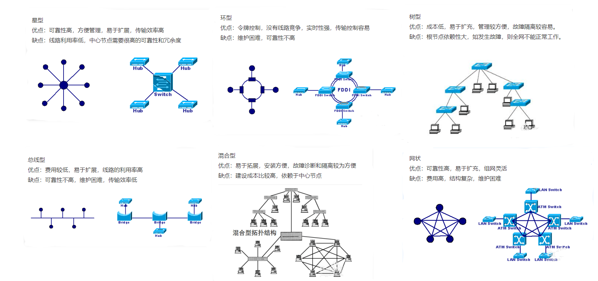

<!--
 * @Author: JohnJeep
 * @Date: 2025-05-11 17:49:17
 * @Date: 2020-07-06 22:22:11
 * @LastEditors: JohnJeep
 * @LastEditTime: 2026-05-31 19:43:37
 * @Description: HTTP protocol
 * Copyright (c) 2026 by John Jeep, All Rights Reserved. 
-->

# 1. http

- http 协议下 cookie 是明文传递的，https 协议下 cookie 是密文传递的。
- 总线拓扑结构采用一个信道作为传输媒体,所有站点都通过相应的硬件接口直接连到这一公共传输媒体上,该公共传输媒体即称为总线
  。任何一个站发送的信号都沿着传输媒体传播,而且能被所有其它站所接收。

## 1.1. GET 和 POST 的区别

1、概括
> 对于 GET 方式的请求，浏览器会把 http header 和 data 一并发送出去，服务器响应 200（返回数据）；而对于
> POST，浏览器先发送 header，服务器响应 100 continue，浏览器再发送
> data，服务器响应 200 ok（返回数据）

2、区别：
- 1、get 参数通过 url 传递，post 放在 request body 中。
- 2、get 请求在 url 中传递的参数是有长度限制的，而 post 没有。
- 3、get 比 post 更不安全，因为参数直接暴露在 url 中，所以不能用来传递敏感信息。
- 4、get 请求只能进行 url 编码，而 post 支持多种编码方式。
- 5、get 请求会浏览器主动***，而 post 支持多种编码方式。
- 6、get 请求参数会被完整保留在浏览历史记录里，而 post 中的参数不会被保留。
- 7、GET 和 POST 本质上就是 TCP 链接，并无差别。但是由于 HTTP
  的规定和浏览器/服务器的限制，导致他们在应用过程中体现出一些不同。
- 8、GET 产生一个 TCP 数据包；POST 产生两个 TCP 数据包。

## 1.2. cookie 和 session 的区别

- 1、cookie 数据存放在客户的浏览器上，session 数据放在服务器上。
- 2、cookie 不是很安全，别人可以分析存放在本地的 COOKIE 并进行 COOKIE 欺骗，考虑到安全应当使用 session。
- 3、session 会在一定时间内保存在服务器上。当访问增多，会比较占用你服务器的性能，考虑到减轻服务器性能方面，应当使用
  COOKIE。
- 4、单个 cookie 保存的数据不能超过 4K，很多浏览器都限制一个站点最多保存 20 个 cookie。
- 5、所以个人建议：
  - 将登陆信息等重要信息存放为 SESSION
  - 其他信息如果需要保留，可以放在 COOKIE 中
- 6、cookie 依赖于 session