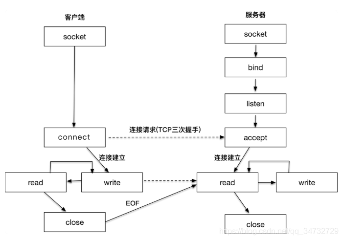

# TCP

## Server

客户端与服务端实现流程图

**服务器端程序实现步骤**

-  创建套接字（socket）
- 将套接字绑定到一个本地地址和端口上（bind）:目的是为了告诉客户端，服务器准备在哪个ip地址哪个端口接受请求。
- 将套接字设置为监听模式，准备接收客户端请求（listen）
- 等待客户端请求到来；当请求到来后，接受连接请求，返回一个新的对应于此次连接的套接字（accept）。接收客户端请求后，就保存了客户端的IP和端口号。
- 用返回的套接字 ，与客户端进行通信（send/recv）
- 当不需要的时候，关闭套接字（closesocket）

**客户端程序实现步骤**

- 创建套接字（socket）
- 向服务器发出连接请求（connect）
- 和服务器端进行通信（send/recv）
- 关闭套接字（closesocket）

TCP连接断网自动重连和自动心跳设计思路和实现方法：

### 自动重连

1. **重连策略**：
   - **指数退避（Exponential Backoff）**：每次重连失败后，等待的时间成指数增长，以避免频繁重连对网络和服务器造成压力。
   - **固定间隔重连**：每次重连尝试之间保持固定的时间间隔。
   - **随机化间隔重连**：在固定间隔的基础上增加一些随机化，避免多个客户端同时重连。
2. **重连次数限制**：设定最大重连次数或最大重连时间，防止无限重连导致资源浪费。
3. **状态管理**：使用状态机管理连接状态（例如：连接中、已连接、断开连接、重连中），根据不同状态执行不同的逻辑。

### 自动心跳

1. **心跳包设计**：
   - **定时发送心跳包**：客户端和服务器之间定时互相发送心跳包，保持连接活跃。
   - **心跳包内容**：可以是简单的PING/PONG消息，或者包含更多的状态信息。
2. **心跳检测**：
   - **超时检测**：如果在设定时间内没有收到心跳包响应，认为连接已经断开，触发重连逻辑。
   - **重试机制**：在一次心跳失败后，可以尝试多次发送心跳包，以排除短暂的网络抖动。

# UDP

基于UDP（面向无连接）的socket编程
服务器端（接收端）程序：

- 创建套接字（socket）
- 将套接字绑定到一个本地地址和端口上（bind）：告诉客户端，服务器端在哪个端口哪个IP上等待数据。
- 等待接收数据（recvfrom/sendto）
- 关闭套接字（closescoket）

客户端（发送端）程序：

- 创建套接字（socket）
- 向服务器发送数据（sendto/recvfrom）
- 关闭套接字（closesocket）

# References
- https://blog.csdn.net/qq_44443986/article/details/115613417： 网络 UDP协议(C++|代码通过udp协议实现客户端与服务端之间的通信)
- https://blog.csdn.net/qq_44443986/article/details/115678954： 网络 TCP协议(C++代码|通过tcp协议实现客户端与服务端之间的通信)
- https://blog.csdn.net/weixin_37895339/article/details/72716774： linux下C++实现UDP通信
