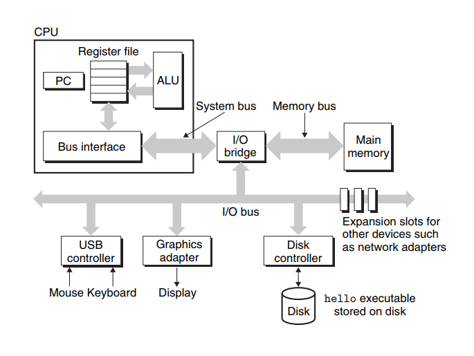
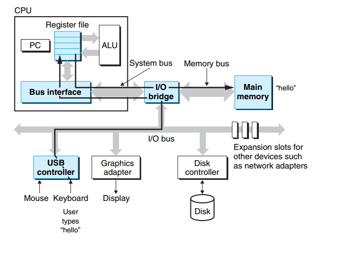
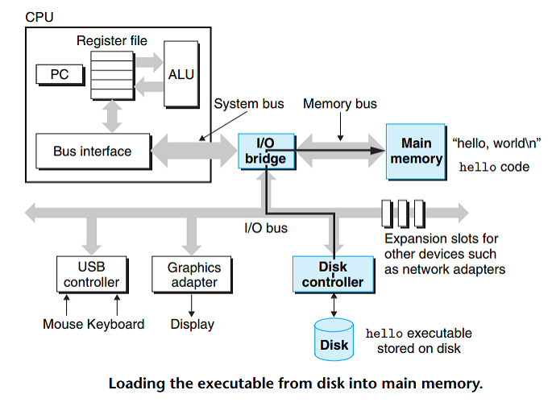
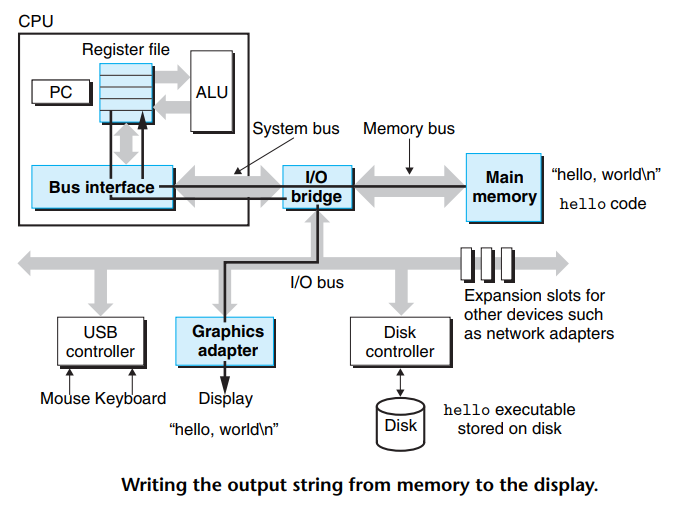
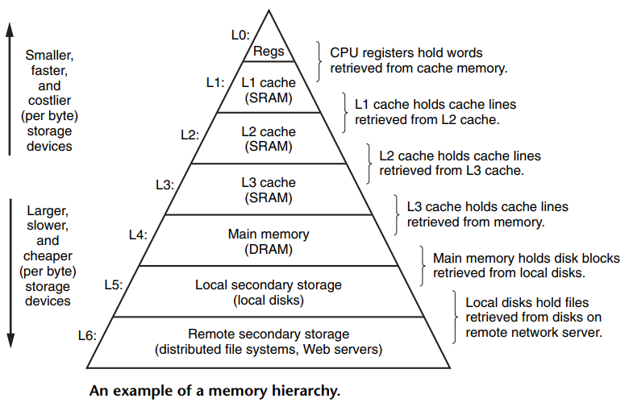
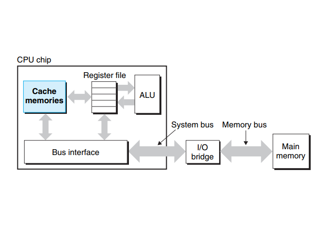

<!--
 * @Author: JohnJeep
 * @Date: 2020-09-10 20:56:34
 * @LastEditTime: 2021-08-15 16:02:56
 * @LastEditors: Windows10
 * @Description: 深入理解计算机系统学习笔记
-->

# 1. Computer System: A Programmer's Perspective

每一章节的内容至少阅读三遍，达到熟悉的程度。

## 1.1. Program Structure & Execution

- Northbridge(北桥)：为了协调CPU、内存和高速的图形设备，人们设计了一个高速的北桥芯片，使它们之间高速的交换数据。
- Southbridge(南桥)：为了解决北桥既要处理高速设备又要处理低速的设备，人们设计了专门处理低速设备的南桥芯片，磁盘、USB、键盘、鼠标等设备都连接在南桥上。

- Relocation(重定位)：重新计算各个目标地址的的过程。

### 1.1.1. 典型的计算机底层硬件组织架构
- CPU: central processing unit
- ALU: arithmetic/logic unit
- PC: program counter
- USB:Universal Serial Bus
- DRAM: dynamic random access memory
- register file： a small storage device that consists of a collection of word-size registers, each with its own unique name. 

 

1. buses(总线)
   - 总线是贯穿整个系统的一组电子导管，携带字节信息并负责在各个部件间传递。 
   - 被设计用来传输固定大小的字节块(fixed-size chunks of bytes)，也就是字(word)。
   - word: 32 bit的机器中为 `4 bytes`，64 bit的机器中为 `8 bytes`

2. I/O Devices 
   - I/O设备是系统与外部世界联系的通道。每一个I/O设备都通过一个控制器或适配器与I/O总线先连。
   - 适配器(adapter): 是一块插在主板插槽上的卡。
   - 控制器(controller)：是I/O设备本身或系统的主控电路板上的芯片组。
3. Main Memory(主存)
   - 主存是一个临时存储设备，在处理器执行程序时，用来存放程序和程序处理的数据。
   - 物理上， 主存是由一组动态随机存储(DRAM)芯片组成的；
   - 逻辑上来讲，存储器是一个线性的字节数组，每个地址都有其唯一的地址（数组索引）。

4. Processor(处理器)
   - central processing unit (CPU)，简称处理器，是执行存储在主存中指令的引擎。
   - 处理器的核心是一个大小为字(word-size)的寄存器，称为 program counter (PC)。任何时刻，PC都指向主存中的某条机器语言指令。
    > 从系统通电开始，直到系统断电，处理器一直在不断地执行程序计数器指向的指令，再更新程序计数器，使其指向下一条指令。处理器看上去是按照一个非常简单的指令执行模型来操作的，这个模型是由指令集架构决定的。在这个模型中，指令按照严格的顺序执行，而执行一条指令包含执行一系列的步骤。处理器从程序计数器指向的内存处读取指令，解释指令中的位(bit)，执行该指令指示的简单操作，然后更新程序计数器(PC)，使其指向下一条指令，而这条指令并不一定和在内存中刚刚执行的指令相邻。

   - Load: Copy a byte or a word from main memory into a register, overwriting the previous contents of the register.
  - Store: Copy a byte or a word from a register to a location in main memory, overwriting the previous contents of that location.
  - Operate: Copy the contents of two registers to the ALU, perform an arithmeti coperation on the two words, and store the result in a register, overwriting the previous contents of that register.
  - Jump: Extract a word from the instruction itself and copy that word into the program counter (PC), overwriting the previous value of the PC.

### 1.1.2. 一个 `hello` 可执行程序的底层调用过程
1. 初始时，shell程序执行它的指令，等待我们输人一个命令。在键盘上输人字符串 `./hello` 后，shell程序将字符逐一读入register，再把它存放到memory中。
   

 

   
2. 当在键盘上敲 `enter` 键时，shell程序就知道我们已经结束了命令的输人。然后shell执行一系列指令来加载可执行的 `hello` 文件，这些指令将 `hello` 目标文件中的代码和数据从磁盘(disk)复制到主存(main memory)。数据包括最终会被输出的 `hello,world \n` 字符串。利用直接存储器存取(direct memory access : DMA)技术，数据可以不通过处理器(processor)而直接从磁盘(disk)到达主存(main memory)。
   

 

   
3. 一旦目标文件hello中的代码和数据被加载到主存(main memory)，处理器就开始执行hello程序的main程序中的机器语言指令。这些指令将 `hello,world \n` 字符串中的 `bytes` 从主存复制到寄存器文件(register file)，再从寄存器文件中复制到显示设备，最终显示在屏幕上。
   
   
 

### 1.1.3. cache(缓存)

 

 

- context switching: 操作系统通过处理器在进程间切换，来实现在同一时间上执行多个程序。
  
  > The operating system performs this interleaving with a mechanism known as context switching. 
- context: 操作系统会跟踪进程运行时所需的所有状态信息，叫做上下文。包括的信息有以下部分：
  - the current values of the PC
  - the register file
  - the contents of main memory

> 当操作系统决定要把控制权从当前进程转移到某个新的进程时，就会进行上下文切换，即保存当前进程的上下文、恢复新进程的上下文，然后将控制权传递到新的进程，新进程就会从它上次停止的地方开始。

## 1.2. 参考
- [Computer Systems: A Programmer's Perspective, 3/E (CS:APP3e)](https://csapp.cs.cmu.edu/): 官方英文书籍网站。
- [Lab Assignments](http://csapp.cs.cmu.edu/3e/labs.html): 书籍中实验的部分。
- [18-613/14-513: Computer Systems, Summer 2020](https://www.andrew.cmu.edu/course/18-613/schedule.html) 2020学期新版讲义的网站，在2016学期的基础上增添了一些内容。
- [15-213: Intro to Computer Systems, Spring 2016](http://www.cs.cmu.edu/afs/cs/academic/class/15213-s16/www/schedule.html): CMU(卡耐基梅隆大学) 2016 年的 CS:APP 课程资源。包括在线视频、课件，资源不是最新的。
- [15-213: Intro to Computer Systems, Spring 2016-video](https://www.youtube.com/watch?v=hs3wRnQUh0o&list=PLbY-cFJNzq7z_tQGq-rxtq_n2QQDf5vnM&index=3):  YouTube上一个UP主上传的课程视频。
- [2015 CMU 15-213 CSAPP 深入理解计算机系统 课程视频](https://www.bilibili.com/video/BV1iW411d7hd): B站对该课程的翻译。
- [深入理解计算机系统（英文版·第3版）](https://book.douban.com/subject/27000879/): 豆瓣网对该书籍的评价。
- CSAPP 重点解读：https://fengmuzi2003.gitbook.io/csapp3e/

