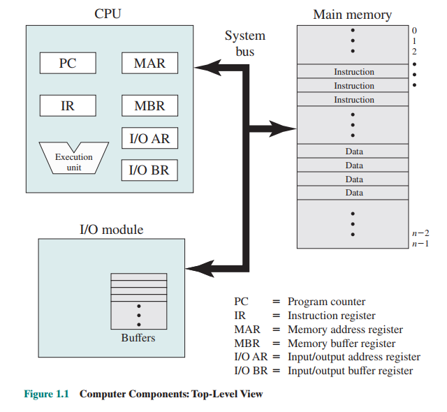
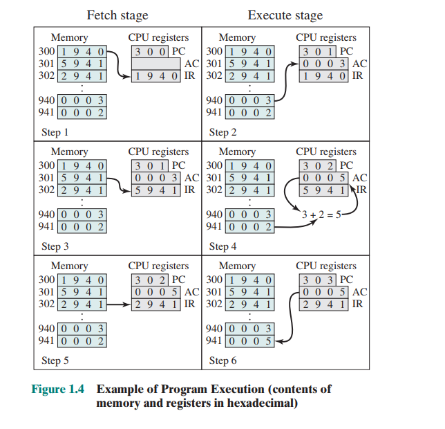
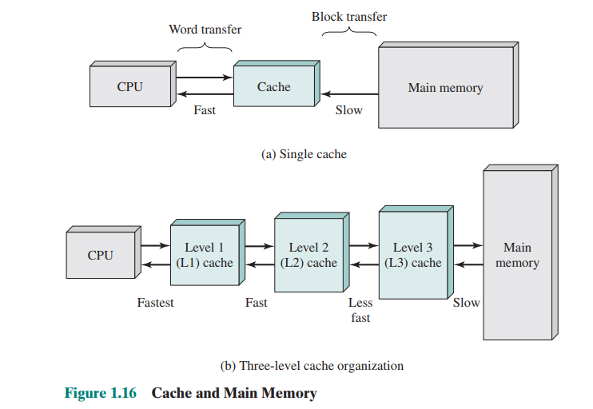
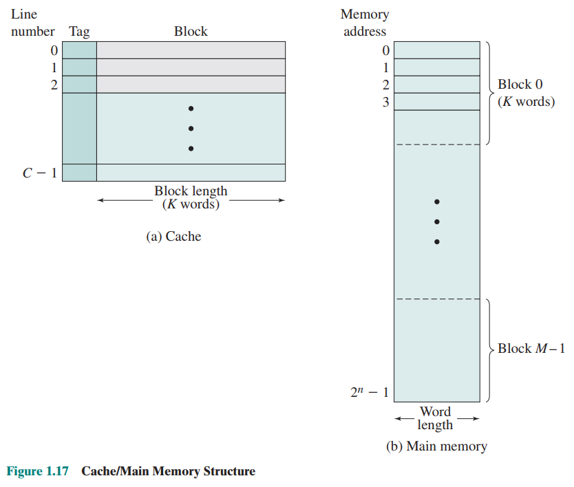
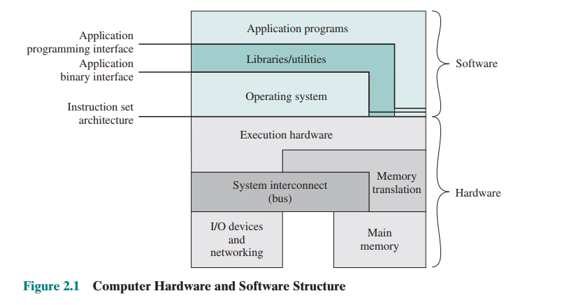

<!--
 * @Author: JohnJeep
 * @Date: 2020-03-18 16:25:51
 * @LastEditors: JohnJeep
 * @LastEditTime: 2025-04-04 20:06:56
 * @Description: operation system learning
 * Copyright (c) 2025 by John Jeep, All Rights Reserved. 
-->

# 1. Architecture

计算机组成的整体架构入下

- **Processor：** 控制计算机的操作、执行数据处理功能。Processor 的一种功能：与存储器(memory) 交换数据。各个部分的功能如下：  
  - Memory Address Register (存储器地址寄存器： MAR )：用于确定下一次读/写的内存地址。
  - Memory Buffer Register(存储器缓冲寄存器： MBR )：存放要写入内存的数据或从内存中读取的数据。
  - I/O Address Register (输入输出地址寄存器：I/OAR)：用于确定一个特定的输入输出设备。
  - I/O Buffer Register (输出输出缓冲寄存器：I/OBR)：用于在输入、输出模块和处理器间交换数据。
  - **PC(Program Counter：程序计数器)：保存下一次要取的指令地址。**
  - **IR(Instruction Register：指令寄存器)：令存放的是处理器取到的指令。**而这些**指令**中包含确定处理器将要执行操作的位，处理器解释指令并执行对应的操作。这些操作大体上可分为 4 类：
  - Processor-memory:  数据可以从 processor 到 memory 或者 从 memory 到 processor 之间转移。
    - Processor-I/O:   数据可以从处理器到外围设备或从外围设备到处理器之间转移。
    - Data processing: 处理器可以执行很多与数据相关的算法和逻辑运算。  
    - Control:   指令可以指定更改执行顺序。例如：处理器从地址为 149的位置取指令，下条指令从指定地址为 182的位置处取指令，而不是地址为 150 的位置处，此时处理器将程序计数器设置为 182。
  - base register(基址寄存器)：保存该内存区域的开始地址。
  - limit register(界限寄存器)：保存该区域的大小，单位：bytes 或 word
  - process index register(进程索引寄存器)：当前正在控制处理器的进程在 process list 中的 索引(index)。
  
- **Main memory：** Stores data and programs.   This memory is typically volatile; 计算机关机时，内存中内容会丢失；对比磁盘内存时，计算机关机时，磁盘中保存的内容不会丢失。Main memory 也叫  **real memory or primary
  memory**  。

  >内存模块由一系列被定义为有顺序号的地址块组成。每个地址块包含一个二进制数，表示是指令或数据。

- **I/O modules:** 在计算机与外部环境之间移动移动数据。外部环境由很多设备组成：包括二级存储设备(secondary
  memory devices : disk)、通信设备、终端。

  > 模块中还包含内存缓冲区(buffers)，用于临时保存数据，直到它们被发送出去。

- **System bus:** 系统总线为处理器、主存和 I/O 模块之间提供通信。

# 2. Instruction execution

一个程序被处理器执行由一系列存储在 memory 中的指令组成。最简单的指令包括两步：处理器从 memory 中取(fetches)一条指令，然后执行(Execute)指令。

程序执行是由不断重复的**取指令**和**执行指令**的过程组成的。指令执行涉及很多操作，具体取决于指令本身。

> 指令周期：单个指令所需要的处理为一个指令周期。

在单个指令周期开始，处理器从内存中取一条指令。每次取指令后，PC 值增加，以便能按照顺序取下一条指令。例如：程序计数器(PC) 的地址为 300，处理器下一次将在地址为 300 处取指令，而在后面的指令周期中，处理器将在地址为 301,302,303处取指令。

**AC(Accumulator ：累加器)：指令与数据都为 16 bits ，作为临时存储。**

> 操作码(pcode)：定义了处理器执行的操作。

下面是一个简单程序执行的例子：将地址为 940 处内容和地址为 941 处内容相加，并将结果保存在后一个地址中。

上面图中程序执行的步骤：

1. PC 中包含第一条指令的地址 300，该指令(指令中内容为 16 进制的 1940)被加载到 IR 寄存器中，PC 值增加 1。
2. IR 寄存器中第一个 16 进制数表示需要加载的  AC，后三位 16 进制的数表示地址，且为 940。
3. 从地址为 301 处取下一条指令(5941)，同时 PC 值增加 1。
4. AC 寄存器中原来的值加上地址为 941 处的值，得到的结果存在 AC 寄存器中。
5. 从地址为 302 处取下一条指令(2941)，同时 PC 值增加 1.
6. AC 寄存器中的值存储在地址为 941 的内存中。

# 3. Interrupt

中断分类(Classes of Interrupts  )

- Program(程序中断)：在某些情况下由指令执行的结果产生。入：算术溢出(arithmetic overflow)、除数为 0(division by zero)、试图执行一些非法机器指令、访问用户不允许访问的内存空间。
- Timer(定时器中断)：由处理器内部的计数器产生，允许操作系统以一定的规律执行函数。
- I/O(I/O中断)：由 I/O 控制器产生，用于信号通知一个操作的正常完成后各种错误条件。
- Hardware failure(硬件失效中断)：由掉电或内存奇偶校验出错产生。

**Interrupt handler(中断处理)：**外部设备准备好从处理器接收更多的的数据时，外部设备的 I/O 模块给处理器发送一个中断请求信号，这时处理器会做出响应，暂停当前程序的运行，转去处理服务于特定 I/O 设备的程序，这种程序称为 中断处理。

# 4. Memory Hierarchy

**nonvolatile memory：**非易失性存储也称为**二级存储器(secondary memory  )**或**辅助存储器(auxiliary memory  )**。用于存储程序和数据文件，其表现形式是程序员看到的是文件(file) 和 记录(record)，而不是独立的 bytes 和 words。硬盘还可以作为内存的扩展，即虚拟存储器(virtual memory  )。

> memory: 一般指易失性的RAM和非易失性的磁盘。
> 非易失性存储器通常是 硬盘(hard disk)和可移动的存储介质(removable media：可移动磁盘、磁盘、光盘) 。 

Buffer(缓冲区)：用于临时保存从磁盘中读出的数据。也叫磁盘高速缓存(disk cache)。

## 4.1. Cache

**局部性原理(principle of locality )：** 在处理器和内存之间提供一个容量小且速度快的存储器，称为高速缓存(CaChe)。

**Cache：** 高速缓存用于 main memory 和  processer registers 之间分段移动数据，以提高数据访问的性能。通常对程序员是不可见的，对处理器也是不可见。

**目的：** 是的访问速度接近现有的最快存储器，同时支持价格较低的大存储器。

现代处理器Cache的设计为多级结构。一般分为 L1级(cache最接近处理器)、L2级、L3级，其中 Cache 与 Main Memory 的分布情况如下

Cache/Main-memory 之间结构分布

高速缓存设计考虑的问题
1. Cache size
2. block size(块大小)：Cache 与 main memory 之间数据交换的单位。
3. Mapping function (映射函数)：确定这个 block 将占据 Cache的哪个位置。
4. Replacement algorithm (置换算法)：选择替换在不久的将来被访问可能性最小的 block。
   > LRU(Least Recently Used 最近最少使用)：需要硬件机制来识别最近使用最少的块。
5. Write policy(写策略)：表明什么时候发生内存写操作。
6. Number of cache levels (高速缓存的级数)

