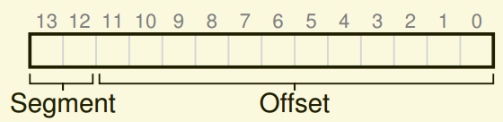

<!--
 * @Author: JohnJeep
 * @Date: 2020-05-13 10:25:24
 * @LastEditTime: 2021-02-23 23:23:36
 * @LastEditors: Please set LastEditors
 * @Description: 分段问题
--> 

# 分段(segmentation)

## 思考？
- 为什么要使用分段？
  > 使用动态重定向，导致在堆和栈之间有一大块“空闲”空间没有被进程使用，但却依然占据了物理内存空间，致使了内存浪费。另外，如果剩余的的物理内存空间无法提供连续区域去放置完整的地址空间（进程的地址空间），那么进程变无法运行。因此，需要支持更大的地址空间，便有了分段的概念。

## 概念
- 段：只是地址空间里的一个连续定长的区域。
- 稀疏地址空间(sparse address spaces)：内存中大量未使用的地址空间。
- 段错误(segmentation fault)：在支持分段的机器上发生非法的内存访问。也称为段违规(segmentation violation) 。
- 保护位(protection bit): 为每个段增加了几个位，标识程序是否能够读写该段，或者能否执行该段的代码。
- 细粒度(fine-grained): 将地址空间划分为大量较小的块。
- 粗粒度(coarse-grained): 将地址空间分成较大的、粗粒的块。
- 外部碎片(external fragmentation): 物理内存中充满了许多空闲空间的小洞，很难分配给新的段。

## 分段处理
- 硬件在地址转换是使用段寄存器，是如何知道段内偏移量？虚拟地址引用了哪几个段？
  - 显式方法(explicit approach): 用虚拟地址的开头几位来标识不同的段。
   前两位告诉硬件引用了哪个段，后12位表示段内偏移。
  - 隐式方法( implicit approach)：硬件通过地址产生的方式来确定段。例如：地址由程序计数器产生，那么地址在代码段。

- 分段的基本原理：系统运行时，地址空间中的不同段被重定位到物理空间中。即堆和栈之间没有使用的区域就不需要分配物理内存，从而能够将更多的地址空间放进物理地址。

- 操作系统在上下文切换时应该做什么？
  - 各个段寄存器中的内容必须保存和恢复。
  - 管理物理内存的空闲空间。
　
 
- 使用分段的方式会产生外部碎片，怎样去解决这个难题？
  - 方案一：紧凑物理内存(compact physical memory)，重新安排原有的段。但是，使内存紧凑的成本很高，拷贝段是内存密集型的，会占用大量的处理器时间。
  - 方案二：利用空闲列表管理算法(free-list management algorithm)。
     - 最优匹配(best-fit)
     - 最坏匹配(worst-fit)
     - 伙伴算法(buddy algorithm)
  > 上面采取的两种方案都无法完全消除外部碎片，只是尝试减小外部碎片。最好的方案是：**永远不要分配不同大小的内存块。**

- 分段的优缺点
  - 优点
     - 要求的算法很容易
     - 很适合硬件完成，地址转换的开销小。
     - 代码共享。
  - 缺点
     - 产生外部碎片
     - 不足以支持更一般化的稀疏空间。
