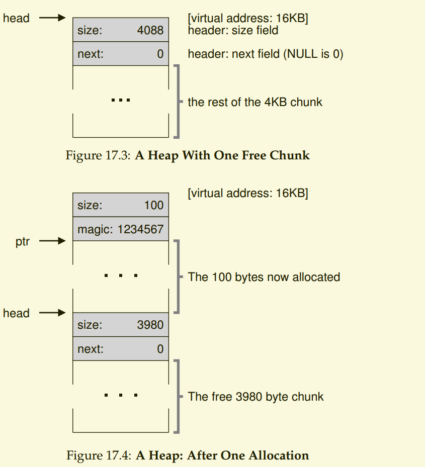
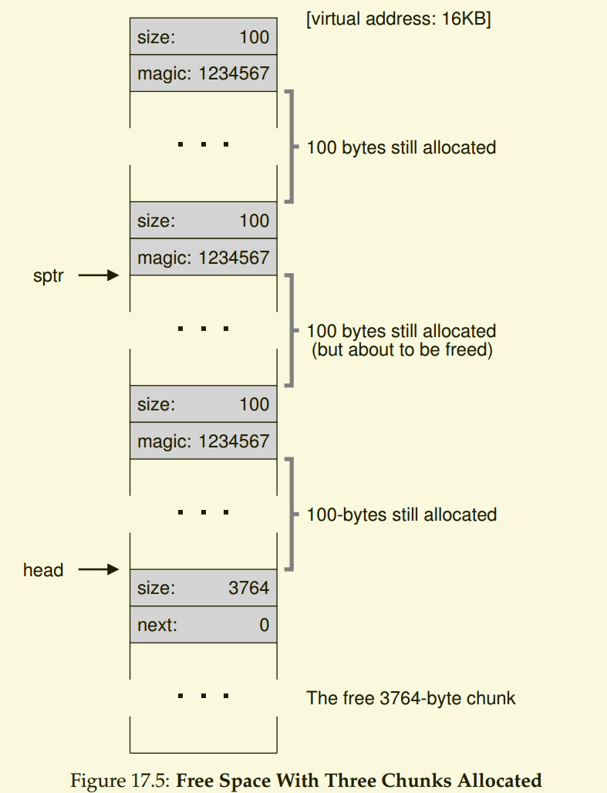
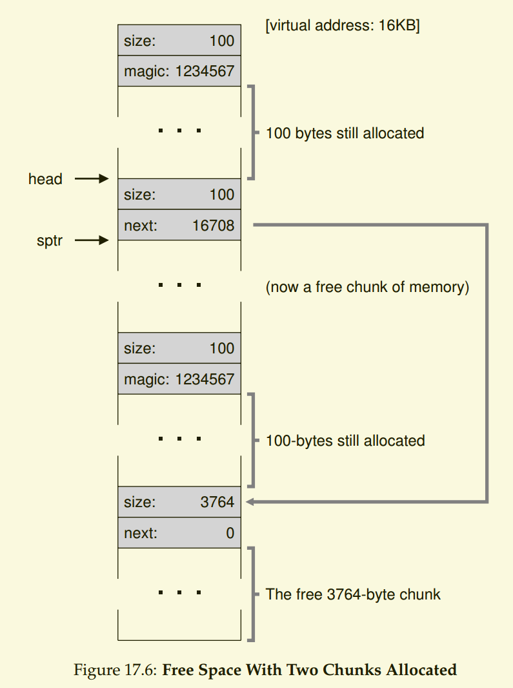
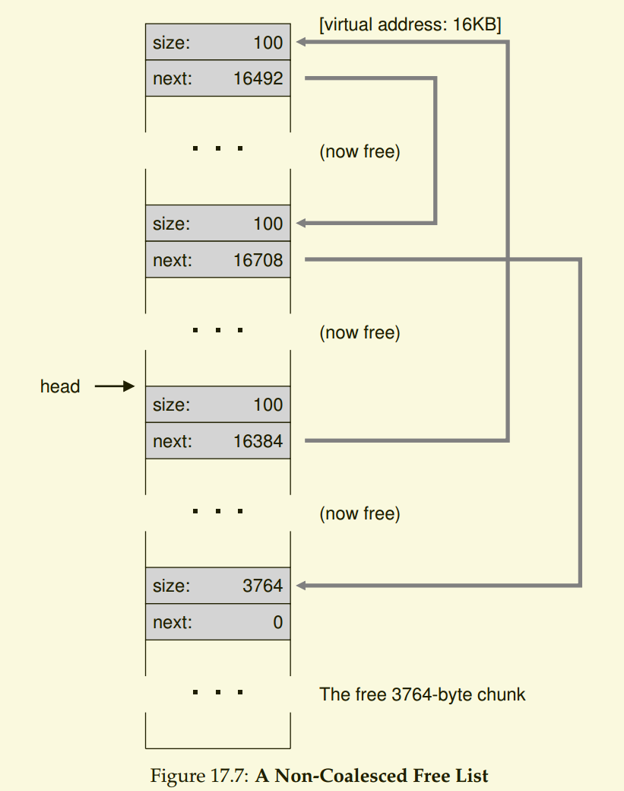

<!--
 * @Author: JohnJeep
 * @Date: 2020-05-13 10:25:24
 * @LastEditTime: 2020-08-11 20:14:31
 * @LastEditors: Please set LastEditors
 * @Description: 空闲空间管理
--> 

# 空闲空间管理(free space management)
## 问题？
1. 如果空闲空间是由大小不同的单元构成，如何管理空间？
2. 什么策略可以让碎片最小化?
3. 不同的方法在时间和空间上的开销如何？

## 底层机制
- 空间分割与合并(basics of splitting and coalescing)
  - 空闲的空间可以被分割成许多空闲的小块，但是遇到申请大于内存中剩余空闲的块时，则不会成功，虽然有空闲的块空间。
  - 将内存中散碎的剩余空间结合在一起，因此有了合并机制。在归还一块内存时，查看要归还的内存地址以及邻近的空闲空间块，如果新归还的空间与一个原有空间块相邻，它们就合并为一个较大的空闲空间。

- 追踪已分配空间的大小(track the size of allocated regions)
  - 内存用完后，实际释放的空间为：头块的大小加上分配给用户空间的大小。

- 如何利用空闲的内部空间维护一个简单的列表，来追踪空闲和已分配的空间(build a simple list inside the free space to keep track of what is free and what isn’t)
  - 嵌入一个空闲列表(free list)
  - 在堆的空闲空间中建立一个列表，将空闲的内存合并。采用遍历列表，合并相邻块。(go through the list and merge　neighboring chunks)
  

  

  

  

- 让堆增长(growing the heap)
  - 堆中的内存耗尽了怎么办？
   - 最简单的是返回NULL
   - 另一个是申请更大的堆。分配程序从很小的堆开始，当空间耗尽时，再向操作系统中申请更大的空间。在大多数UNIX系统中，执行 `sbrk` 系统调用，找到空闲的内存页，将他们映射到请求进程的地址空间中去，并返回新的堆的末尾地址。

## 管理空间的基本策略(Basic Strategies)
1. 最优匹配(best fit)
   - 原理：遍历整个空闲列表，找到和请求一样大小或最大的空闲块，然后返回该组候选组中最小的块
   - 优点：避免了空间的浪费。
   - 缺点：遍历整个列表，开销较大。
2. 最差匹配(worst fit)
   - 原理：尝试找到最大的空闲块，分割满足用户的需求后，将剩余中很大块加入空闲列表。
   - 缺点：遍历整个列表，开销较大，导致过量碎片。
3. 首次匹配(first fit)
   - 原理：找到第一个足够大的块，将请求的空间返回给用户，将剩余的空闲空间留给后续的请求。
   - 优点：速度很快，不需要遍历整个列表。
   - 缺点：让空闲列表的开头部分有很多的小块。
4. 下次匹配(next fit)
   - 原理：将指针指向上一次查找结束的位置。
   - 优点：速度很快，不需要遍历整个列表，避免了对列表头部的频繁分割。
5. 分离空闲列表(Segregated Lists)
   - 应用程序经常申请一种或几种大小的内存空间，用一个独立的列表，管理这样的对象，其它大小的请求都交给更通用的内存分配程序。
   - 典型应用：厚块分配程序(slab allocator)，它避免了频繁的对数据结构的初始化和销毁，显著的降低了开销。
6. Buddy Allocation
   - 核心思想采用二分法去分割与合并。