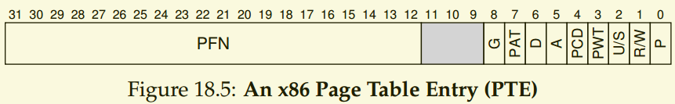
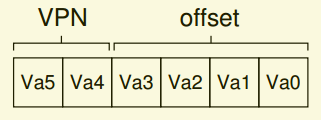
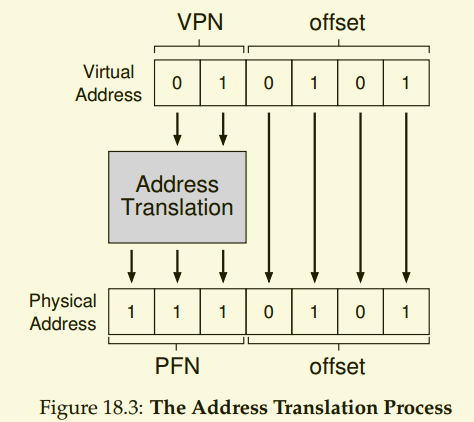

<!--
 * @Author: JohnJeep
 * @Date: 2020-05-12 20:41:26
 * @LastEditTime: 2020-06-01 13:47:55
 * @LastEditors: Please set LastEditors
 * @Description: 分页介绍
--> 

## 分页介绍

### 问题(THE CRUX)？
   - 如何通过分页来实现虚拟内存，避免分段产生的问题？
   - 基本技术是什么？
   - 如何让这些技术运行良好，尽可能减少时间和空间的开销？
   - 页表在哪里存储？
   - 页表的典型内容是什么？
   - 表有多大？
   - 分页是否会使系统变慢？

### 基础
2. 页表(page table)
   - 为什么要用页表？
     - 为了记录地址空间的每个虚拟地址页放在物理内存中的位置，操作系统为每个进程保存一个数据结构，称为页。
   - 作用
     - 为虚拟地址空间的每个虚拟页保存地址转换(adderss translation)，让我们知道每个页在物理内存中的位置。
   - 一般来讲，系统中的每个进程都有一个页表，页表的确切结构要么由硬件决定 (older systems)，要么由操作系统灵活的管理 (modern systems)。


3. 重要概念
   -　swap(交换): 允许操作系统将很少使用的页面转移到磁盘上，从而释放物理内存。
   - 虚拟页号(VPN: virtual page number):检索页表
   - 物理帧号(PFN: physical page number)，也称为物理页号(PPN: physical page number)
   - 页表项(PTE: page table entry)。由许多重要的位(bits)构成。
     - 有效位(vaid bit): 用于指示特定地址转换是否有效。对于支持稀疏地址空间很重要。
     - 保护位(protection bit): 表明页是否可以读取(read)、写入(write)或执行(execute).
     - 存在位(present bit)：表明该页是在物理存储器上还是在磁盘上。
     - 脏位(dirty bit)：表明page被带进内存后是否被修改。
     - 参考位(reference bit)也被称为访问位(accessed bit):有时用于追踪页是否被访问，也用于确定哪些页应该保存子在内存中。
      <p align="center"> </p>
  
  
4. 分页很慢(Paging: Also Too Slow)

   对于每个内存引用，分页都需要我们执行一个额外的内存引用，以便首先从页表中获取地址转换。


5. 地址转过程

```
例如一个64bytes进程的虚拟地址空间在访问内存的过程。
movl <virtual address>, %eax
```
- 需要将虚拟地址划分为两个部分：VPN和页内偏移量(offset)
<div align="center"></div>

- 通过PFN替换VPN来转换虚拟地址，然后将载入发给物理内存。注意：偏移量保持不变，它只是告诉我们页面中的那个字节使我们想要的。
<div align="center"></div>


1. 分页的优缺点
   - 优点
     - 灵活性：支持稀疏地址空间。通过完善的分页方法，操作系统能高效的提供地址空间的抽象，不管进程怎样使用虚拟地址空间。
     - 不会导致外部碎片。因为分页将内存划分为固定大小的单元。
   - 缺点
     - 会导致机器变慢（有许多额外的内存来访问页表）和内存浪费（内存被页表塞满，而不是有用的应用程序）。
