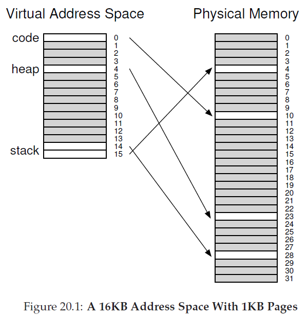
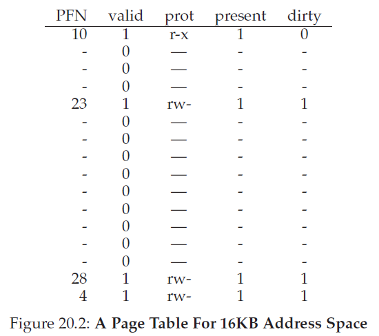
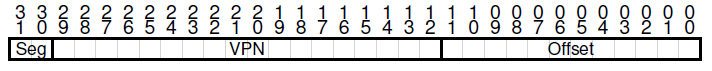
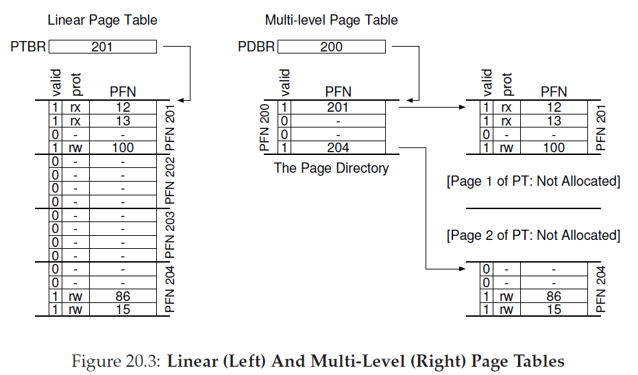
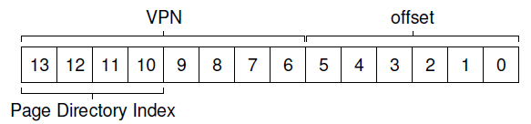
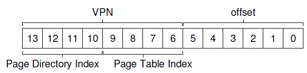
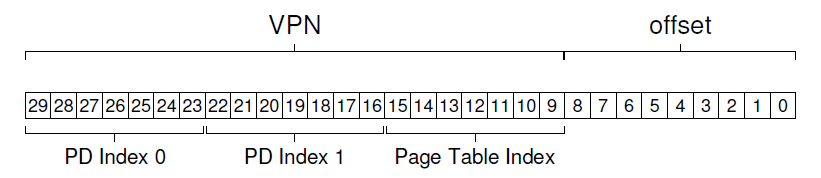

<!--
 * @Author: JohnJeep
 * @Date: 2020-04-22 21:33:13 
 * @LastEditTime: 2021-08-15 23:42:22
 * @LastEditors: Windows10
 * @Description: 让页表更小
--> 
# Paging: Smaller Tables
## 问题
- 如何让页表更小？关键思路是什么？
- 使用新的数据结构，会导致哪些效率低下？


## 解决方案
- 为什么要提出用较小的页表？
  - 基于简单的线性页表太大，消耗的内存太多，系统负担大。


### bigger pages
  - 大内存会导致每页的内部浪费，产生内部碎片(internal fragmentation)。
  - 产生的结果：应用程序会分配页，但只使用每页的一小部分，而内存很快就被占满。因此。大多数系统在常见的情况下使用相对较小的页大小(page sizes)。 
   

- Hybrid Approach: Paging and Segments
<p align="center"></p>
<p align="center"></p>

  - 采用更大的页，这种方法并没有解决问题。
  - 分段与分页结合的方法：是为每个逻辑分段提供一个页表(page table)，不是为进程的整个虚拟地址空间提供单个页表。
  
  - 采用混合的方式，在MMU结构中，base register不是只向段本身，而是保存该段页表的物理地址；bounds register指示页表的结尾，即它有多少有效pages。在Segmentation中,base register告诉我们每个段在物理内存中的位置。
  
  - 优点：每个分段都有bounds register，每个bounds register保留了段中最大有效位的值。栈和堆之间未分配的页不在占用page table中的空间，仅将其标记为无效。
  - 缺点：因为使用分段，会导致外部碎片(external fragmentation)。尽管大部分内存是以page-sized为单元进行管理，但是现在页表是任意大小，因此，在内存中为它们寻找内存空间更为复杂。
  
  - 简单实例
    > 32位虚拟地址空间包含4KB pages
    <br>地址空间分为4个segments，但只使用 3 个segments</br>
    <br>结果：硬件负责处理的TLB未命(miss)中时,硬件使用segment bits (SN)来确定要用哪个基址和界限对，然后硬件将其中的物理地址与VPN结合起来，构成page table entry (PTE)的地址。<br>
    ```
      SN = (VirtualAddress & SEG_MASK) >> SN_SHIFT
      VPN = (VirtualAddress & VPN_MASK) >> VPN_SHIFT
      AddressOfPTE = Base[SN] + (VPN * sizeof(PTE))  
    ```
    <p align="center"></p>

 
### Multi-level Page Tables(多级页表)
- 为什么要用多级页表？
  - 去掉页表中的所有无效区域，而不是将它们全部保存在内存中。
- 原理
  - 将page table分成page-sized的单元
  - 如果整页的page-table entries (PTEs)无效，就不完全分配该页的page table。
  <p align="center"></p>
  
    
- 多级页表的工作方式：它只是让线性页表的一部分消失，并用page directory来记录page table的哪些page被分配。
- 页目录(page directory): 为了追踪page table的页是否有效。page directory可以告诉你page table的page在哪里？或者page table的整个page不包含有效页。
- 页目录项(page directory entries: PDE): PDE至少要有valid bit 和 page frame number(PFN)
  - 在PDE所指向的page中，至少一个PTE，其有效位被设置为1；如果PDE无效（即等于零），则PDE的剩下部分没有定义。
  - 优点
    - 多级页表分配的page table空间，与你正在使用的地址空间内存量成正比。
    - 页表的每个部分都可以整齐的放入一页中，更容易管理内存。
    - 与线性页表(linear page table)相比,linear page table仅仅是按照VPN索引的PTE数组，整个线性页表必须连续驻留在内存中，对内存的开销占用很大。
  - 缺点
    - 在TLB未命中时，需要从内存加载两次，才能从页表中获取正确的地址信息（一次用于page directory，另一次用于PTE本身）。而线性页表只需要加载一次。多级页表是一个空间换时间的例子。
    - 比较复杂。
    
  
- 多级页表例子
  - 页目录索引(page-directory index: PDIndex)
  - 页目录项(page-directory entry: PDE)
    > 页目录项地址：`PDEAddr = PageDirBase + (PDIndex * sizeof(PDE))`
     
  
  - 页表索引(page-table index: PTIndex)：用来索引页表本身
    > 页表项(PTE)地址：`PTEAddr = (PDE.PFN << SHIFT) + (PTIndex * sizeof(PTE))`
    <p align="center"></p>

## 超过两级页表
- 理想的多级页表：页表的每一部分都能放入一个page。两级页表没能满足情况。因此采用别的方法。

- 实现方法：给tree在加一层，将page directory本身拆成多个页，然后在page上添加另一个page directory，指向page directory的page。虚拟地址分割如下：
  <p align="center"></p>

- PD Index 0 用于从顶级page directory中获取page directory entry(PDE)。如果有效，通过合并顶级PDE的物理帧号和VPN的下一部分(PD Index 1)来查询page directory的第二级；最后，如果有效，通过将page-table index与第二级PDE中的地址结合使用，可以形成PTE地址。


- The Translation Process: Remember the TLB
  > 在任何复杂的多级页表访问发生之前，硬件首先要检查TLB，在命中时，物理地址直接形成，不用访问页表；只有在TLB为命中时（miss），硬件才需要执行完整的多级查找。


- 反向页表（Inverted Page Tables）
  - 页表项代表系统中的每个physical page，而不是许多的page tables。
  - page table entry告诉我们哪个进程正在使用该page，以及该进程的哪个virtual page映射到该physical page。 
  - 要找到正确的page table entry，需要使用hash table。
  
  
- Swapping the Page Tables to Disk（将页表交换到磁盘）
  - 为了解决有些页表太大，无法一次装入内存。
