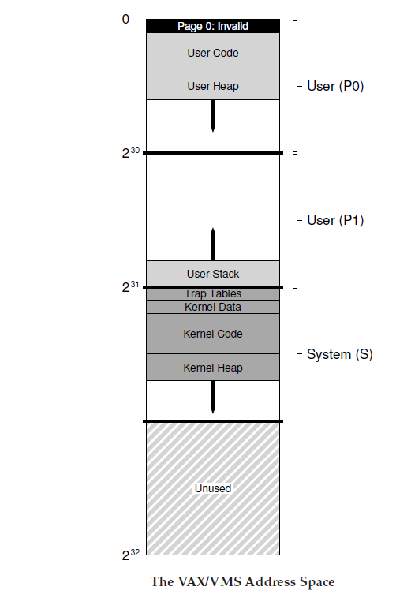
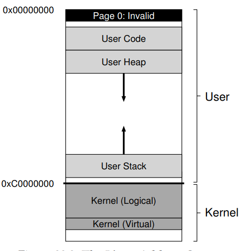
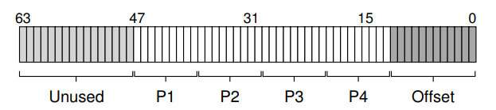

<!--
 * @Author: JohnJeep
 * @Date: 2020-05-19 08:16:21
 * @LastEditTime: 2020-08-11 20:35:10
 * @LastEditors: Please set LastEditors
 * @Description:  VAX/VMS 虚拟内存系统
--> 
# Virtual-Memory-Systems
## VMS(virtual Memory System)
- RSS(res-ident set size): 驻留集大小
- demand zeroing：按需置零
- COW(copy-on-write): 写时赋值
- 一个真实的VAX/VMS地址空间

  

- virtual address space: 由用户部分和内核部分
  - user portion: user program code, stack, heap, and other parts reside
  - kernel portion: kernel code, stacks, heap, and other parts reside

- kernel memory allocate(内核内存分配) 
  -  内核空间中，从3G到`vmalloc_start` 这段地址是物理内存映射区域（该区域中包含了内核镜像、物理页框表mem_map等等）；`vmalloc` 区域位于物理内存映射区之后;`vmalloc_end` 的位置接近 4G(最后位置系统会保留一片128k大小的区域用于专用页面映射)。
  - `kmalloc` 
    - 保证分配的内存在物理上是连续的
    - 能分配的大小有限
    - `kmalloc` 和`get_free_page` 申请的内存位于物理内存映射区域，而且在物理上也是连续的，它们与真实的物理地址只有一个固定的偏移，因此它们之间存在较简单的转换关系。
  - `vmalloc` 
    - 保证分配的内存在虚拟地址空间上是连续的
    - 能分配的大小相对较大
    - `vmalloc` 比`kmalloc` 要慢
    - `vmalloc` 申请的内存则位于`vmalloc_start～vmalloc_end` 之间，与物理地址没有简单的转换关系。

- 只有被DMA访问的内存是需要物理内存是连续的

- user memory allocate(用户内存分配)
  - `malloc`

- 32-bit linux system用户部分和内核部分的虚拟地址空间分配为：`0~0xBFFFFFFF`为user portion；`0xC0000000~0xFFFFFFFF`为kernel portion

  

- 64-bit system: use a four-level table. 64-bit的空间没有完全使用，仅仅只用了底部的 48-bit
  - 底部12-bit作为偏移量，因为`x86`标准的page size为`4KB`
  - 顶部16-bit在TLB转换时没有用 

  

## The Page Cache
- 三个主要来源
  - memory-mapped files(内存映射文件)
  - file data(来自设备的文件数据)
  - metadata(来自设备的元数据)

- 文件系统调用的读read()和写write()，以及每个进程的堆(heap)和栈(stack)页都保存在`page cache hash
table`(页缓存哈希表)中,一边在需要数据的时候快速的访问。
- mmap():  memory-mapped files(内存映射文件)函数。可以使用`pmap`命令查看。
- ASLR(address space layout randomization)：地址空间布局随机化。物理地址与虚拟地址之间的映射地址，在以前的系统中，是固定的地址，但现代操作系统中不是固定的，保证了系统的安全。每次运行，地址会不一样。
- Meltdown And Spectre(熔断和幽灵)
  - `meltdownattack.com`
  - `spectreattack.com`
- `KPTI`(kernel page table isolation): 内核页表隔离