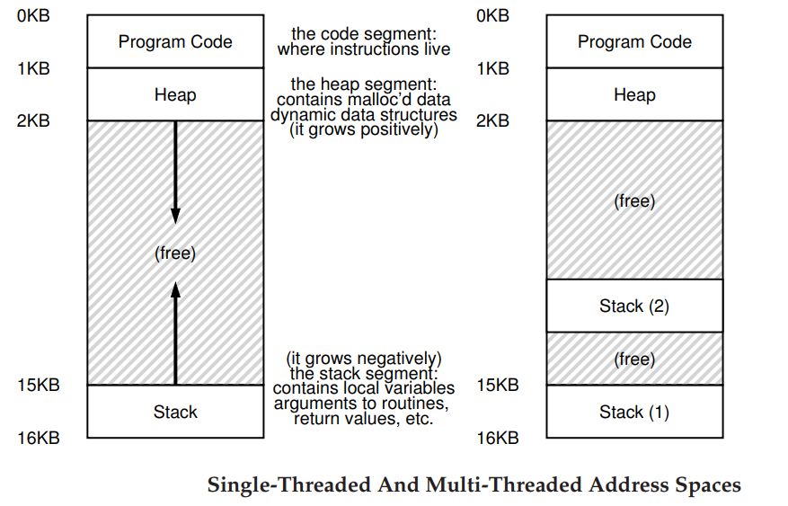

<!--
 * @Author: your name
 * @Date: 2020-05-18 18:49:26
 * @LastEditTime: 2020-06-01 13:38:21
 * @LastEditors: Please set LastEditors
 * @Description: Concurrency: 并发问题
--> 

### 为什么要使用线程（Thread)？
- 实现并发性(parallelism)。多个CPU处理多个线程.
- 避免由于慢速的I/O阻塞(block)程序的运行。

### 关键概念
- 临界区(critical section): 是访问共享资源( shared resource)的一段代码，一定不能有多个进程同时进行。通常共享资源是一个变量或数据结构。
- 竞态条件(race condition或data race)：多个执行的线程同时进入临界区时，它们都试图尝试更新共享资源的数据结构，会导致一些不希望的结果。
- 不确定性(indeterminate): 程序由一个或多个竞态条件组成，程序的输出因运行而异，取决于线程在什么时候运行，导致的结果是不确定的。通常我们希望计算机系统给我们输出的结果是确定的。
- 互斥(mutual exclusion)：保证了一个线程在临界区内执行，那么其它线程将被阻止进入临界区。

### 其它点
- 每个线程都有自己专用的用于计算的寄存器。
- 线程之间进行上下文切换(context switch): 不需要切换当前使用的page table，即地址空间保持不变。
- 线程之间的交互
  - 访问共享变量。需要为临界区支持原子性。
  - 一个线程在继续运行之前，必须等待另一个线程完成一些操作。

