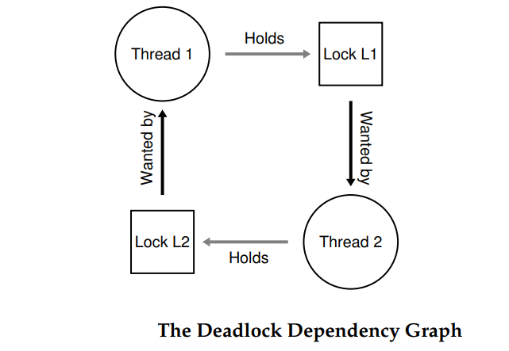

<!--
 * @Author: JohnJeep
 * @Date: 2020-06-01 08:42:34
 * @LastEditTime: 2021-04-08 23:28:53
 * @LastEditors: Please set LastEditors
 * @Description: 讨论并发中常见的死锁问题
--> 

<!-- TOC -->

- [1. 并发编程中出现的缺陷(What Types Of Bugs Exist?)](#1-并发编程中出现的缺陷what-types-of-bugs-exist)
  - [1.1. Non-Deadlock Bugs(非死锁缺陷)](#11-non-deadlock-bugs非死锁缺陷)
    - [1.1.1. Atomicity-Violation Bugs(违反原子性缺陷)](#111-atomicity-violation-bugs违反原子性缺陷)
    - [1.1.2. Order-Violation Bugs(违反顺序性缺陷)](#112-order-violation-bugs违反顺序性缺陷)
  - [1.2. Deadlock(死锁)](#12-deadlock死锁)
    - [1.2.1. What is Deadlock(什么是死锁？)](#121-what-is-deadlock什么是死锁)
    - [1.2.2. Why Do Deadlocks Occur?(为什么会发什么死锁？)](#122-why-do-deadlocks-occur为什么会发什么死锁)
    - [1.2.3. Conditions for Deadlock(产生死锁的条件)](#123-conditions-for-deadlock产生死锁的条件)
    - [1.2.4. Prevention(怎样阻止死锁的发生？)](#124-prevention怎样阻止死锁的发生)

<!-- /TOC -->

# 1. 并发编程中出现的缺陷(What Types Of Bugs Exist?)

## 1.1. Non-Deadlock Bugs(非死锁缺陷)
非死锁问题占了并发问题的大多数。它们是怎样发生的？如何去修复它？下面我们主要讨论其中的两种：违反原子性缺陷和违反顺序性缺陷。

### 1.1.1. Atomicity-Violation Bugs(违反原子性缺陷)
所谓违反原子性就是 应该一起执行的指令序列没有一起执行。

- 违反了多个内存之间访问所需的可串行性(serializability)。
- 解决方案：给共享变量(shared variable)的访问加锁

  
### 1.1.2. Order-Violation Bugs(违反顺序性缺陷)
所谓违反顺序就是 两个线程所需的顺序没有强制保证。

- 两个内存访问的预期的预期顺序被打破。
- 解决方案：利用条件变量的方式。添加锁（lock）、条件变量（condition variables）、状态变量（state variable）。

## 1.2. Deadlock(死锁)

### 1.2.1. What is Deadlock(什么是死锁？)
线程1持有锁 L1，等待另外一个锁 L2释放；线程2持有锁 L2，正在等待锁 L1 释放，因此产生了死锁，即两个线程彼此互相等待。

### 1.2.2. Why Do Deadlocks Occur?(为什么会发什么死锁？)
 
### 1.2.3. Conditions for Deadlock(产生死锁的条件)
死锁的产生需要下面 4 个条件。
- 互斥(Mutual exclusion)：线程对需要的资源进行互斥的访问。
- 持有和等待(Hold-and-wait)：线程持有资源（持有得到的锁），同时又在等待其它资源（希望获得锁）
- 非抢占(No preemption)：线程获得的资源（锁）不能被抢占。
- 循环等待(Circular wait)：线程之间存在一个环路，环路上每个线程都持有一个或多个资源（locks），而这个资源又是下一个线程要申请的（requested）。

> 上述 4 个条件中的任何一个没有满足，死锁（deadlock）都不会发生。 

### 1.2.4. Prevention(怎样阻止死锁的发生？)
- 不产生循环等待（ never induce a circular wait）。
  - 简单的系统中采取 `全序（total ordering）` 方式解决。
  - 复杂的系统采取 `偏序（partial ordering ）` 方式解决。
  > 技巧：可以通过获取锁的地址来获取锁的顺序（lock ordering）。
  
- 锁在持有和等待时，通过原子性的方式避免。
  - 这种方式不能适用与封装（encapsulation），需要准确的知道要持有（held）哪些琐，并且要提前获得（acquire）。 采取这种方式降低了并发。
  
- 其它的线程获得锁之前，先释放之前得到的锁。
  - 实现过程中可能会产生活锁（livelock）问题
    - 两个线程可能一直重复地释放锁，又同时都获得锁失败，系统一直的在运行，但不会有任何的进展。
  - 如何解决活锁问题？
    - 在循环结束的时候，先随机等待一个时间，再次重复整个过程，这样可以降低线程之间重复干扰的几率。

- 完全避免互斥。代码存放在临界区（critical sections），通常很难避免互斥。需要结合硬件指令，构造出不要锁的数据结构。

- 通过检查和恢复（Detect and Recover）的方法。允许死锁偶尔发生，检查到死锁时再采取行动。

