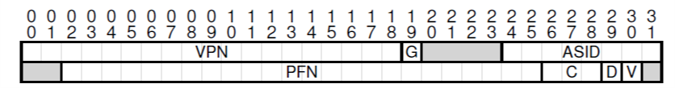

<!--
 * @Author: JohnJeep
 * @Date: 2020-05-12 20:41:26
 * @LastEditors: JohnJeep
 * @LastEditTime: 2026-05-31 20:01:01
 * @Description: Translation Lookaside Buffers
 * Copyright (c) 2026 by John Jeep, All Rights Reserved. 
-->

## 问题(crux)

1. 如何加速虚拟地址转换，避免额外的内存引用？
2. 需要什么硬件支持？
3. 需要什么操作系统参与? 

## 基础

- 为什么要用快速地址转换？
  > 使用分页作为虚拟内存的核心机制，可能会导致很高的性能开销。
  > 通过将地址空间分割成大量固定大小的单元(units),分页需要大量的映射信息。因为这些映射信息通常存储在物理内存中，所以在
  > 转换虚拟地址时，分页逻辑需要对程序生成的每个虚
  > 拟地址进行额外的内存查找。 在每条指令获取或显式加载或存储之前，在内存中存储转换信息是非常慢的。

- 后备缓冲区(translation-lookaside buffer: TLB)也可以称为地址转换缓存。它是虚拟地址到物理地址转换的一个硬件缓存。
- TLB miss: CPU 没有在 TLB 中找到转换映射。

- cache(高速缓存)原理：利用指令和数据引用中的局部性(locality)。常用的局部性有两种。
  - 时间局部性(temporal locality)：最近访问过的指令或数据项在将来可能很快就会被再次访问。
  - 空间局部性(spatial locality)：如果一个程序访问地址 x 处的内存，它可能很快就会访问地址 x 附近的内存。
  - Hardware caches：无论是指令、数据还是地址转换(在我们的 TLB
    中)，都通过将内存副本保存在小而快速的片上内存中来利用局部性。处理器可以首先检查附近的副本是否存在于缓存中，而不必
    使用(慢速)内存来满足请求;
    如果是，处理器可以快速访问它，避免花费昂贵的时间来访问内存(许多纳秒)。

##  Who Handles The TLB Miss?

- CISC(复杂指令计算机: complex-instruction set computers)
- RISC(精简指令计算机:reduced-instruction set computers)
- X86 架构：硬件必须准确地知道 page tables 在内存中的位置(通过页表基寄存器(page table base register))，以及 page
  table 的确切格式; 如果没有命中，硬件将“遍历”页表，找到正确
  page-table entry，并提取想要的转换映射，使用 translation 更新 TLB，然后重试该指令。
- 现代计算机架构：采用 software-managed TLB。在 TLB miss 时，hardware 抛出一个异常，pauses the current instruction
  stream，将特权级别提升到内核模式，跳转至
  trap handler（它是 OS 的一段代码，目的是：handling TLB misses）。

- 采用软件处理 TLB miss 的优点
  - flexibility(灵活性)：OS 可以使用任何的数据结构实现 page table。不需要改变硬件。
  - implicity(简单性)：硬件不需要做太多对 TLB miss 的处理，只需抛出一个异常，然后让 OS
    未命中的程序去处理完成其余的工作。
  

## TLB Contents: What’s In There?

- 一条地址映射可能存在 TLB 中的任意位置，硬件会并行(parallel)的进行查找 TLB，找到期望的转换映射。
`TLB VALID BIT ≠  PAGE TABLE VALID BIT`   
  ① page table 有效位：标记为无效时：the page has not been allocated by the process，正常运行的程序不应该访问该地址
  
  ② TLB 有效位：只是指出 TLB entry 是不是有效地地址映射。TLB 的有效位在 performing a context switch
  中是很重要的。系统可以确保将要运行的 process 不会错误的使用
  previous process 虚拟地址到物理地址转换的映射。

##  TLB Issue: Context Switches

- 进程切换时面临的新问题：TLB 包含的 virtual-to-physical translations 仅仅只是对当前正在运行的 process
  有效，对其它的进程无效。
- 因此，在从一个进程切换到另一个进程时，硬件或操作系统(或两者)必须确保将要运行的进程不会意外地使用之前进程的地址转换。

- **进程切换时如何管理 TLB 的内容**
  - 当 context-switching 发生在两个进程之间时，上一个进程在 TLB 中的 translations 对于即将运行的进程时无意义的。
  - hardware or OS 应该怎样解决这个问题？
    - simply flush(清空) the TLB on context switches，这样在下一个进程运行之前，TLB 就为空了。
      - 清空操作只是简单的把所有的 valid bits 设置为 0，本质上清空了 TLB。
      - 缺点：有一定的开销，:每次进程运行时，当它访问数据和代码页时，都会触发 TLB miss。
        如果操作系统频繁地在进程之间切换，开销可能很高。
    - 增加硬件支持，实现跨 context switches 的 TLB 共享。

## Issue: Replacement Policy

如何设计 TLB 的替换策略（ 即：cache replacement）？
- 向 TLB 中插入新的 entry 时，会替换一个 old entry。
- typical policies(典型的策略)
  - 替换最近最少使用(least-recently-used: LRU)：LRU 尝试利用内存引用流中的局部性。
  - random policy(随机策略)：随机选择一个替换出去。

*实际系统中的 TLB Entry*

## 结论

- 通过增加一个小的、专用的片上 TLB 作为地址转换缓存，大多数 memory references 就不用访问主内存中的页表。
- TLB 不能满足所有程序的需求。例如：如果程序在短时间内访问的页数超过了 TLB 中的页数，则程序将生成大量 TLB
  未命中，因此运行速度会变慢，这种现象称为 TLB coverage，可能会对某些程序产生相当严重的问题。
  - 解决的方案：支持 larger page sizes。将关键数据结构映射到程序地址空间的某些区域，这些区域被映射到更大的页，是 TLB
    的有效覆盖率增加。
  -  对大页面的支持通常被数据库管理系统(DBMS)之类的程序所利用。
- TLB 访问很容易成为 CPU 管道(pipeline)中的瓶颈，特别是所谓的物理索引缓存。
