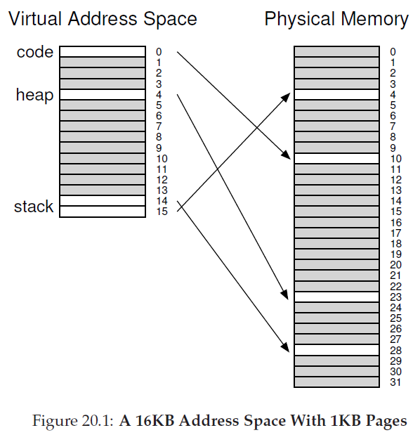
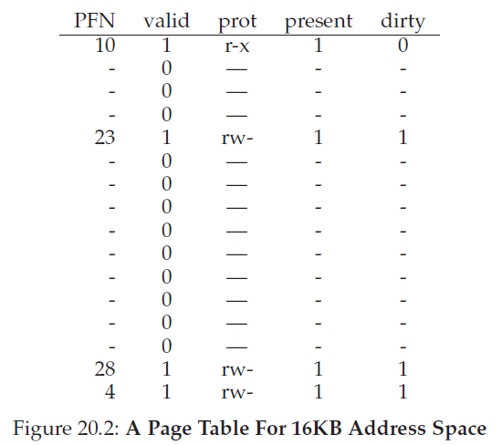
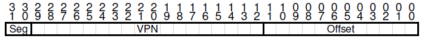
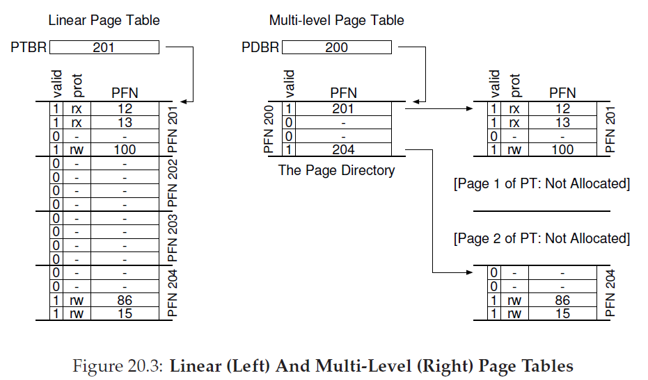
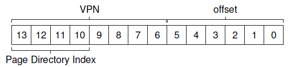
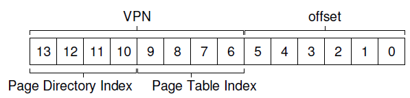
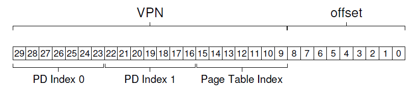

<!--
 * @Author: JohnJeep
 * @Date: 2020-04-22 21:33:13 
 * @LastEditors: JohnJeep
 * @LastEditTime: 2026-05-31 19:59:56
 * @Description: Paging: Smaller Tables
 * Copyright (c) 2026 by John Jeep, All Rights Reserved. 
-->

## 问题

- 如何让页表更小？关键思路是什么？
- 使用新的数据结构，会导致哪些效率低下？


## 解决方案

- 为什么要提出用较小的页表？
  - 基于简单的线性页表太大，消耗的内存太多，系统负担大。


### bigger pages

- 大内存会导致每页的内部浪费，产生内部碎片(internal fragmentation)。
- 产生的结果：应用程序会分配页，但只使用每页的一小部分，而内存很快就被占满。因此。大多数系统在常见的情况下使用相对较小
  的页大小(page sizes)。 


- Hybrid Approach: Paging and Segments
<p align="center"></p>
<p align="center"></p>

  - 采用更大的页，这种方法并没有解决问题。
  - 分段与分页结合的方法：是为每个逻辑分段提供一个页表(page table)，不是为进程的整个虚拟地址空间提供单个页表。
  
  - 采用混合的方式，在 MMU 结构中，base register 不是只向段本身，而是保存该段页表的物理地址；bounds register
    指示页表的结尾，即它有多少有效 pages。在 Segmentation 中,base
    register 告诉我们每个段在物理内存中的位置。
  
  - 优点：每个分段都有 bounds register，每个 bounds register 保留了段中最大有效位的值。栈和堆之间未分配的页不在占用
    page table 中的空间，仅将其标记为无效。
  - 缺点：因为使用分段，会导致外部碎片(external fragmentation)。尽管大部分内存是以 page-sized
    为单元进行管理，但是现在页表是任意大小，因此，在内存中为它们寻找内存空间更为复杂。
  
  - 简单实例
    > 32 位虚拟地址空间包含 4KB pages
    <br>地址空间分为 4 个 segments，但只使用 3 个 segments</br>
    <br>结果：硬件负责处理的 TLB 未命(miss)中时,硬件使用 segment bits
    (SN)来确定要用哪个基址和界限对，然后硬件将其中的物理地址与 VPN 结合起来，构成 page table entry
    (PTE)的地址。<br>
    ```
      SN = (VirtualAddress & SEG_MASK) >> SN_SHIFT
      VPN = (VirtualAddress & VPN_MASK) >> VPN_SHIFT
      AddressOfPTE = Base[SN] + (VPN * sizeof(PTE))  
    ```
    <p align="center"></p>

 
### Multi-level Page Tables(多级页表)

- 为什么要用多级页表？
  - 去掉页表中的所有无效区域，而不是将它们全部保存在内存中。
- 原理
  - 将 page table 分成 page-sized 的单元
  - 如果整页的 page-table entries (PTEs)无效，就不完全分配该页的 page table。
  <p align="center"></p>
  
    
- 多级页表的工作方式：它只是让线性页表的一部分消失，并用 page directory 来记录 page table 的哪些 page 被分配。
- 页目录(page directory): 为了追踪 page table 的页是否有效。page directory 可以告诉你 page table 的 page 在哪里？或者
  page table 的整个 page
  不包含有效页。
- 页目录项(page directory entries: PDE): PDE 至少要有 valid bit 和 page frame number(PFN)
  - 在 PDE 所指向的 page 中，至少一个 PTE，其有效位被设置为 1；如果 PDE 无效（即等于零），则 PDE 的剩下部分没有定义。
  - 优点
    - 多级页表分配的 page table 空间，与你正在使用的地址空间内存量成正比。
    - 页表的每个部分都可以整齐的放入一页中，更容易管理内存。
    - 与线性页表(linear page table)相比,linear page table 仅仅是按照 VPN 索引的 PTE
      数组，整个线性页表必须连续驻留在内存中，对内存的开销占用很大。
  - 缺点
    - 在 TLB 未命中时，需要从内存加载两次，才能从页表中获取正确的地址信息（一次用于 page directory，另一次用于 PTE
      本身）。而线性页表只需要加载一次。多级页表是一个空间换时间的例子。
    - 比较复杂。
    
  
- 多级页表例子
  - 页目录索引(page-directory index: PDIndex)
  - 页目录项(page-directory entry: PDE)
    > 页目录项地址：`PDEAddr = PageDirBase + (PDIndex * sizeof(PDE))`
     
  
  - 页表索引(page-table index: PTIndex)：用来索引页表本身
    > 页表项(PTE)地址：`PTEAddr = (PDE.PFN << SHIFT) + (PTIndex * sizeof(PTE))`
    <p align="center"></p>


## 超过两级页表

- 理想的多级页表：页表的每一部分都能放入一个 page。两级页表没能满足情况。因此采用别的方法。

- 实现方法：给 tree 在加一层，将 page directory 本身拆成多个页，然后在 page 上添加另一个 page directory，指向 page
  directory 的 page。虚拟地址分割如下：
  <p align="center"></p>

- PD Index 0 用于从顶级 page directory 中获取 page directory entry(PDE)。如果有效，通过合并顶级 PDE 的物理帧号和 VPN
  的下一部分(PD Index 1)来查询 page
  directory 的第二级；最后，如果有效，通过将 page-table index 与第二级 PDE 中的地址结合使用，可以形成 PTE 地址。


- The Translation Process: Remember the TLB
  > 在任何复杂的多级页表访问发生之前，硬件首先要检查 TLB，在命中时，物理地址直接形成，不用访问页表；只有在 TLB
  > 为命中时（miss），硬件才需要执行完整的多级查找。


- 反向页表（Inverted Page Tables）
  - 页表项代表系统中的每个 physical page，而不是许多的 page tables。
  - page table entry 告诉我们哪个进程正在使用该 page，以及该进程的哪个 virtual page 映射到该 physical page。 
  - 要找到正确的 page table entry，需要使用 hash table。
  
  
- Swapping the Page Tables to Disk（将页表交换到磁盘）
  - 为了解决有些页表太大，无法一次装入内存。
