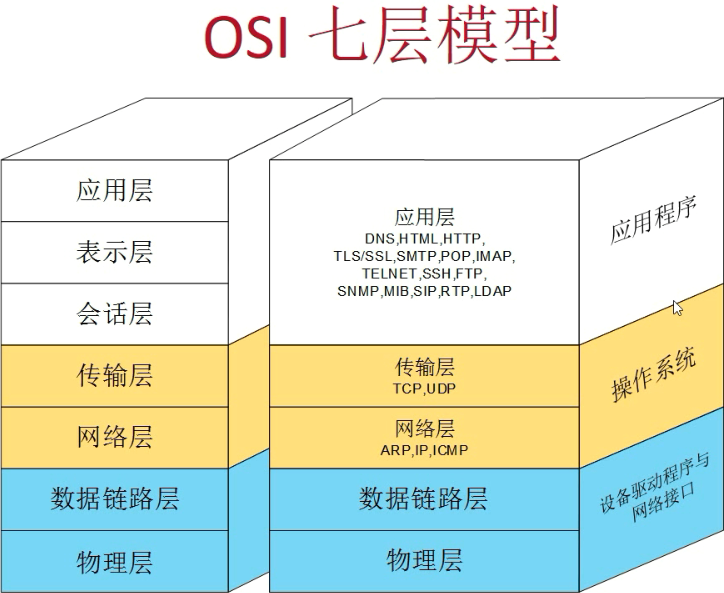

# Protocol Terms

- pattern
- ethernet
- transport
- chunk
- bulk

Network Topology 
- host
- links
- router
- driver
- socket
- iptable
- network interface
- layer
- source
- destination
- MTU: Maximium Transmission Unit
- TCP: Transmission Control Protocol
- UDP: user Datagram Protocol

# OSI

1. Physical
    - bit
    - symbol
2. Data link
    - frame
    - ID
    - offset
    - flag
    - payload
    - data link
    - sequence
    - field
3. Network
    - datagram
    - packet
4. Transport
    - segment
5. Session
    - session
6. presentation
7. Application

