<!--
 * @Author: JohnJeep
 * @Date: 2020-04-04 09:46:51
 * @LastEditTime: 2021-09-29 11:34:36
 * @LastEditors: Please set LastEditors
 * @Description: In User Settings Edit
-->

# 1. Learning Computer Science Journey

本项目是记录本人学习计算机科学这类学科知识点的历程。从计算机底层硬件到应用层软件等知识点。包括最底层的汇编语言（Assemble）、高级的C、C++、Go语言、计算机网络基础（ComputerNetwork）、操数据结构与算法（DataStructure）、设计模式（DesignPattern）、操作系统（OS）、Linux基础与Linux环境编程（Linux）、数据库（MySQL、Redis）、脚本语言（Shell）、界面编程（Qt）、轻量级的Web服务器（Nginx）、GitHub和Git及SVN代码管理工具使用（Git-SVN）、剑指offer及LeetCode刷题经验（Interview）、嵌入式系统中STM系列芯片模板工程的创建（Embedded）、常用的学习工具和学习网站之谈（StudyTool）、Markdown和Jupyter Notebook基本语法（markdown）、基本的一些哲学思想和英语美句（Philosophy）。

# 2. C 语言
C 语言是自己接触的第一门语言，基本的语法在大学时就已经学过，这里不再讲基础的语法，仅仅只是记录自己在工作中对 C 语言知识点的补充，常用常更新。包括底层的一些知识点，字符编码、指针、函数指针、结构体、内存分配等常见的点。

[字符编码](C/2-字符编码.md)

[内存存放顺序](C/3-内存存放顺序.md)

[断点调试](C/4-断点调试.md)

[变量与数据类型](C/5-变量与数据类型.md)

[Volatile 关键字用法解释](C/6-volatile.md)

[为什么会出现段错误](C/7-segment-fault.md)

[C 语言中常见的基础语法的补充](C/8-基础知识补充.md)

[C 语言中精髓之一：指针函数和函数指针](C/9-指针函数和函数指针.md)

[Const 关键字](C/10-const.md)

[restrict 关键字](C/11-restrict.md)

[exteren 关键字](C/12-extern.md)

[最常见得 void 含义和用法](C/13-void.md)

[内存初始化函数 memset](C/14-memset.md)

[memcpy 与 strcpy 函数的区别及用法](C/15-strncpy与memcpy.md)

[memcmp 与 strcmp 函数的区别及用法](C/16-memcmp与strcmp.md)

[typedef 用法剖析](C/17-typedef.md)

[C 语言中精髓之一：结构体和字节对齐](C/18-struct和字节对齐.md)

[word, half word, double word用法及区别](C/20-字、半字、双字.md)

[C 语言中精髓之一：指针](C/21-指针.md)

[枚举类型](C/22-枚举类型(Enumerations).md)

[C 语言中的状态机](C/23-状态机.md)

[C 语言中精髓之一：数组与指针的结合](C/24-数组与指针组合.md)

用到的比较生僻的库函数：[atoi()](C/25-atoi().md)、 [fprintf()](C/26-fprintf().md)、[snprintf()](C/35-snprintf.md)

[常见的转义字符和ASCII码](C/29-转义字符与ASCII码.md)

[C 语言中最重要的部分：内存分布](C/30-内存.md)

[sizeof() 与 strlen() 的区别](C/31-sizeof与strlen区别.md)

[程序入口函数 main() 分析](C/32_main().md)

[提高效率之一的 do{...}(false) 用法](C/34-do-while(false).md)

[容易的混淆的 * 和 ++ 的优先级使用](C/36-星号和++优先级.md)

[C 语言中精髓之一：回调函数](C/37-回调函数.md)

[static 关键字](C/38-static.md)

[细谈 C 语言中的字符串](C/39-字符串.md)

[编写 C 程序时需遵循的编码规范](C/C语言编程规范.md)

# 3. C++
C++ 语言是一门非常复杂的语言，虽然是 C+ 语言是对 C 语言的的强化，但是现代的 C++ 已经与 C 相差很大了，几乎是另一种语言。学习 C++ 需要花费的很长时间，它的知识点不仅广泛还很细粒、灵活性很高。自己在学习时，学习知识点时，学习的快，忘记的也快，因此，自己就把学习过程中的一些理解、笔记和体会记录下来。

----------------------------------------
[C++ 基础板块](C++/01-C++基础.md)： 这部分主要是 C++ 的基础知识点，常用的语法，该板块涉及的内容比较多。
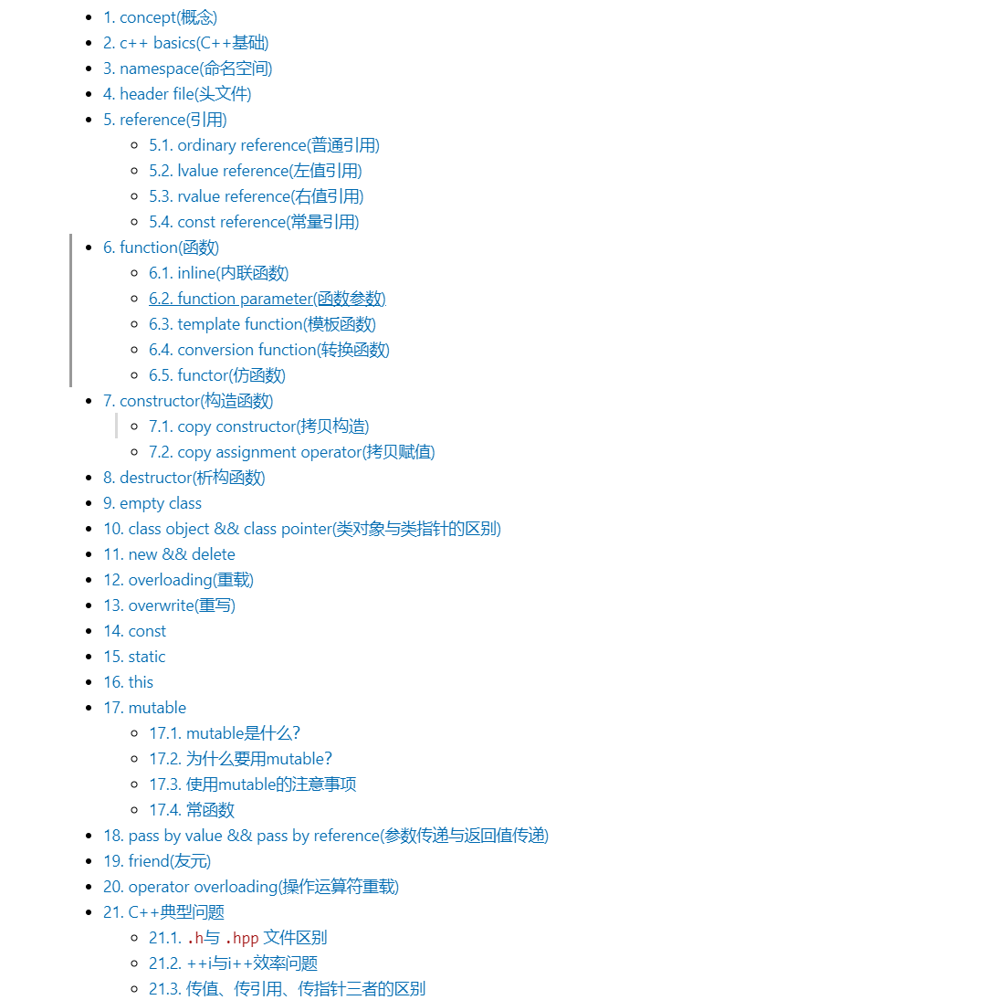
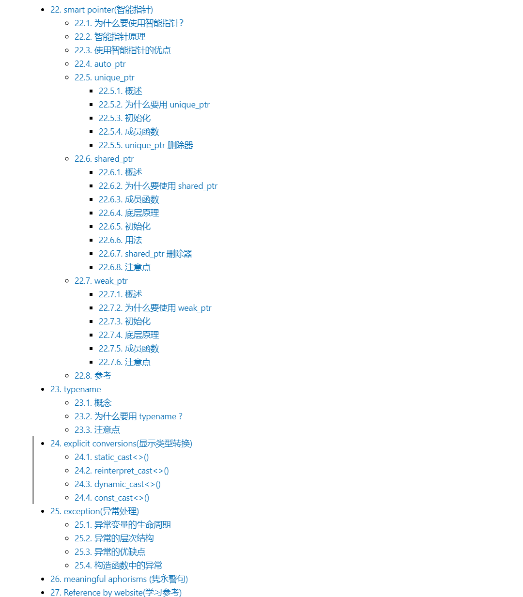

----------------------------------------
[C++ 高级板块](C++/02-C++高级.md)：C++ 的核心思想是面向对象，这个板块包含了 C++ 面向对象的内容：封装、继承、多态；泛型编程、输入输出流、元编程等。

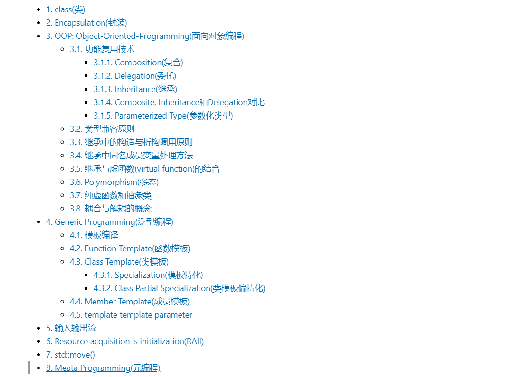

----------------------------------------
[C++ 新特性](C++/03-C++新特性.md)
目前主要是介绍了 C++11 的特性，高于 C++11 的特性暂时还没有写，计划后面在陆续完善。

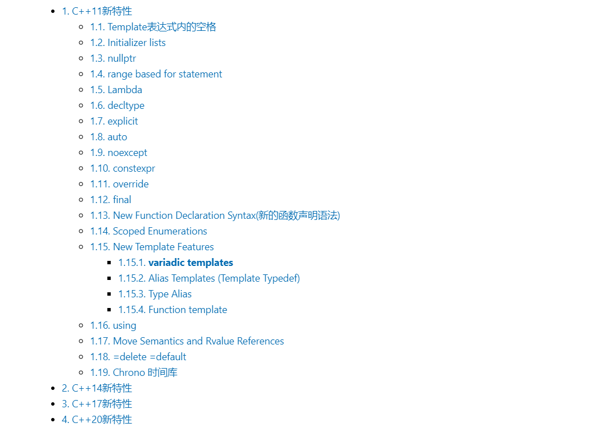

----------------------------------------
[C++STL](C++/04-STL.md)
标准库是非常重要的，熟练地使用并知道其内部的原理对自己的编码是非常有帮助的。STL 是编写 C++ 的大牛们创造的一个非常优秀的作品，里面有很多的东西值得学习和探讨。

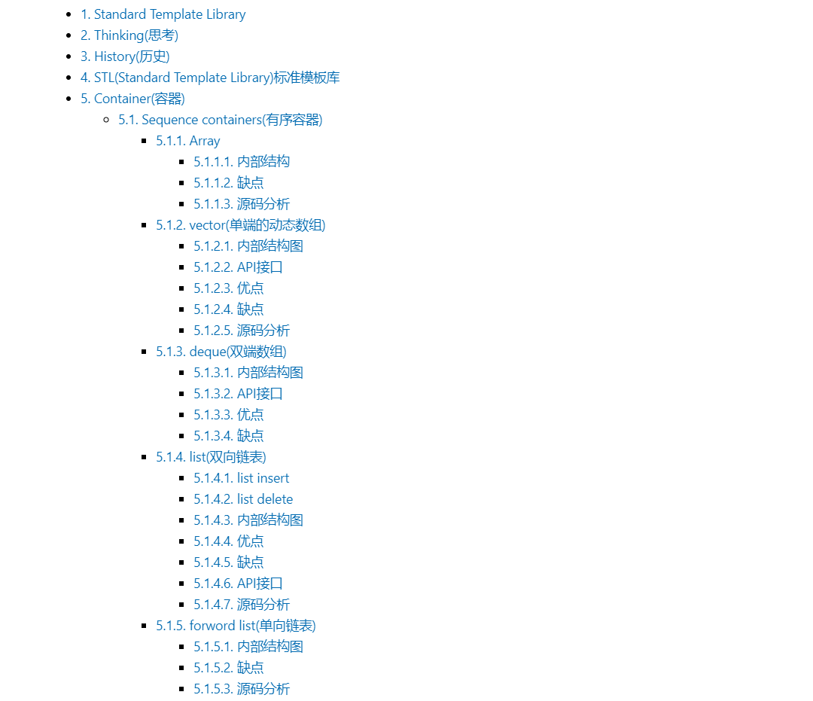
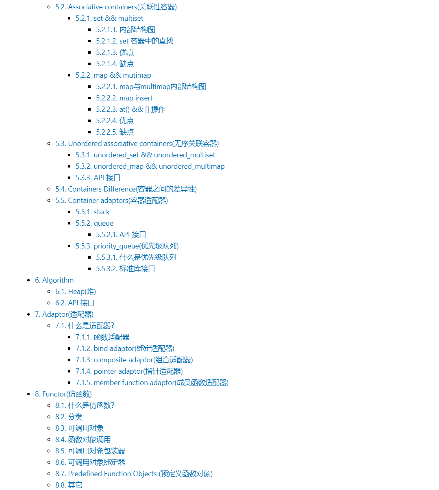
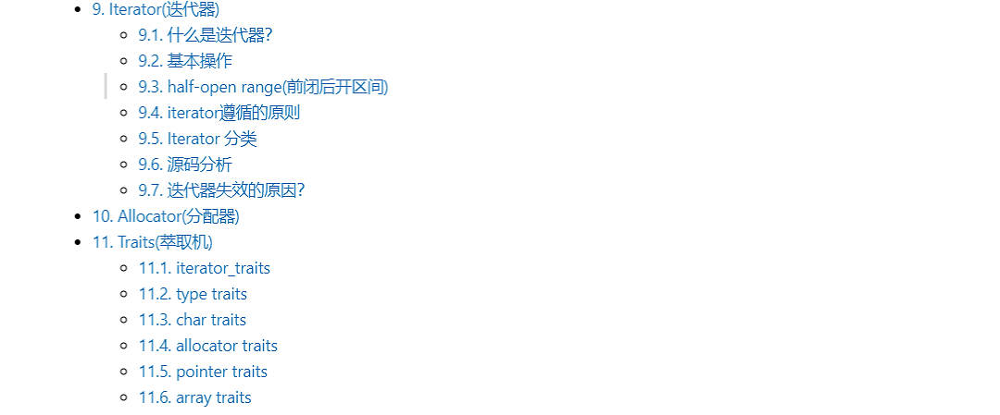

----------------------------------------
[C++ 内存管理](./C++/05-内存管理.md)：C++ 不同Java、Python、GO 等，C++ 没有垃圾回收机制，内存的分配和释放都需自己手动管理，因此真真理解 C++ 编译器中的内存管理机制是非常重要的。这部分的内容，目前只写了部分，后面的内容，以后在完善。

----------------------------------------
[C++ 中 enable_shared_from_this 用法](C++/enable_shared_from_this.md)

----------------------------------------
[Core dump 调试用法](./C++/Core-dump.md)

----------------------------------------
[Valgrind内存泄漏检查的利器](C++/Valgrind.md)

----------------------------------------
[C++ 编程规范](./C++/编程规范.md)

----------------------------------------
[C++ 中的并发处理](C++/concurrency.md) 

----------------------------------------
[多线程时线程池的使用](C++/ThreadPool.md)

----------------------------------------
[非常值得学习的 C/C++、服务端的开源库](C++/OpenSourceProject.md)

# 4. 内功修炼

[计算机底层知识的加深理解](OS/ComputerSystemAProgramm'sPerspective.md)

书籍
- 《程序员的自我修养—链接、装载与库》 
- 《深入理解计算机系统 第3版》，对应的英文版:《Computer Systems. A Programmer’s Perspective [3rd ed]》
- 《老码识途 从机器码到框架的系统观逆向修炼之路》

视频
- [B站：卡内基·梅隆大学-CSAPP](https://www.bilibili.com/video/BV1iW411d7hd)

# 5. 操作系统

操作系统是一门与底层硬件结合比较紧密的课程，掌握好操作系统，对自己的软件体系有很好的帮助。一般我是通过看视频和看书来增强这方便的知识。

## 5.1. MIT 6.828 & 6.S081

课程
- [MIT CS8.828, Operating System Engineering](https://pdos.csail.mit.edu/6.828/2018/schedule.html) 2018年秋季学科大纲。

视频
- YouTube：[6.828](https://www.youtube.com/playlist?list=PLfciLKR3SgqNJKKIKUliWoNBBH1VHL3AP)
- B站：[6.828](https://www.bilibili.com/video/av15896196/)
- B站：[6.S081](https://www.bilibili.com/video/BV19k4y1C7kA?from=search&seid=8656595108283984685) 

> NOte: 6.828 and 6.S081 will be offered as two separate classes. 6.S081 (Introduction to Operating Systems) will be taught as a stand-alone AUS subject for undergraduates, and will provide an introduction to operating systems. 6.828 will be offered as a graduate-level seminar-style class focused on research in operating systems. 6.828 will assume you have taken 6.S081 or an equivalent class. See the [6.828 web site](https://abelay.github.io/6828seminar/schedule.html) for more detail about 6.828.

参考
- [知乎：MIT6.828-神级OS课程-要是早遇到，我还会是这种 five 系列](https://zhuanlan.zhihu.com/p/74028717) 
- [二十八画生征友：一起来通关6.S081/6.828吧](https://zhuanlan.zhihu.com/p/251366985)
- [MIT6.S081 肖宏辉翻译的课程](https://mit-public-courses-cn-translatio.gitbook.io/mit6-s081/)
- [胡津铭 Github计算机基础学习笔记](https://github.com/conanhujinming/comments-for-awesome-courses)

## 5.2. Operating Systems: Three Easy Pieces

[操作系统导论(Operating Systems: Three Easy Pieces)](http://pages.cs.wisc.edu/~remzi/OSTEP/) 一本非常好的书籍，并且电子版本是免费的。这是自己操作系统的启蒙之书，通过阅读这本书，自己加深了对操作系统的认识和理解，以下是自己在学习过程中整理出来的一些笔记。

--------------------------------------
Virtualization(虚拟化)
- [CPU 的虚拟化](OS/Operating-System-Three-Easy-Pieces/01-Virtualization/01-12-CPU-Virtualization.md)
- [抽象的地址空间](OS/Operating-System-Three-Easy-Pieces/01-Virtualization/13-Abstraction-Address-Space.md)
- [对内存操作的 API 接口调用分析](OS/Operating-System-Three-Easy-Pieces/01-Virtualization/14-Interlude-Memory-API.md)
- [地址转换](os/Operating-System-Three-Easy-Pieces/01-Virtualization/15-Address-Translation.md)
- [分段](os/Operating-System-Three-Easy-Pieces/01-Virtualization/16-Segmentation.md)
- [操作系统对空闲空间的管理](OS/Operating-System-Three-Easy-Pieces/01-Virtualization/17-Free-Space-Management.md)
- [分页机制](OS/Operating-System-Three-Easy-Pieces/01-Virtualization/18-Introduction-to-Paging.md)
- [快速地址转换](OS/Operating-System-Three-Easy-Pieces/01-Virtualization/19-Translation-Lookaside-Buffers.md)
- [页表机制](OS/Operating-System-Three-Easy-Pieces/01-Virtualization/20-Advanced-Page-Tables.md)
- [交换机制](OS/Operating-System-Three-Easy-Pieces/01-Virtualization/21-Swapping-Mechanisms.md)
- [交换策略](OS/Operating-System-Three-Easy-Pieces/01-Virtualization/22-Swapping-Policies.md)
 

----------------------------
Currency(并发)
- [并发的概念与线程的概念](OS/Operating-System-Three-Easy-Pieces/02-Concurrency/26-Concurrency-and-Threads.md)
- [线程操作的 API 接口](OS/Operating-System-Three-Easy-Pieces/02-Concurrency/27-Thread-API.md)
- [线程中锁的机制](OS/Operating-System-Three-Easy-Pieces/02-Concurrency/28-Thread-Lock.md)
- [条件变量](OS/Operating-System-Three-Easy-Pieces/02-Concurrency/29-30-Condition-Variables.md)
- [信号量](OS/Operating-System-Three-Easy-Pieces/02-Concurrency/31-Semaphore.md)
- [多线程并发过程中导致线程死锁问题的讨论](OS/Operating-System-Three-Easy-Pieces/02-Concurrency/32-Common-Concurrency-Problems.md)
- [基于事件的并发问题](OS/Operating-System-Three-Easy-Pieces/02-Concurrency/33-Event-based-Concurrency.md)

----------------------------
[很多经典的论点引证](OS/Operating-System-Three-Easy-Pieces/reference.md)

## 5.3. 清华大学OS
- [清华大学操作系统课程(2019)](https://chyyuu.gitbooks.io/os_course_info/content/)：Gitbook上清华大学操作系统课程(2019)。
- [操作系统(Operating Systems) (2019)](http://os.cs.tsinghua.edu.cn/oscourse/OS2019spring): 清华大学2019学期操作系统课程主页。
- [操作系统(Operating Systems) (2020)](http://os.cs.tsinghua.edu.cn/oscourse/OS2020spring): 清华大学2020学期操作系统课程主页。
- [uCore OS 实验指导书和源码网址 (2020)](https://learningos.github.io/ucore_os_webdocs/):清华大学2020学期uCore OS 实验指导书。
- [Operating System Concepts Ninth Edition](https://www.os-book.com/OS9/): 操作系统概念第九版英文版在线主页。

# 6. 计算机网络

[计算机网络基础知识](ComputerNetwork/网络基础.md)

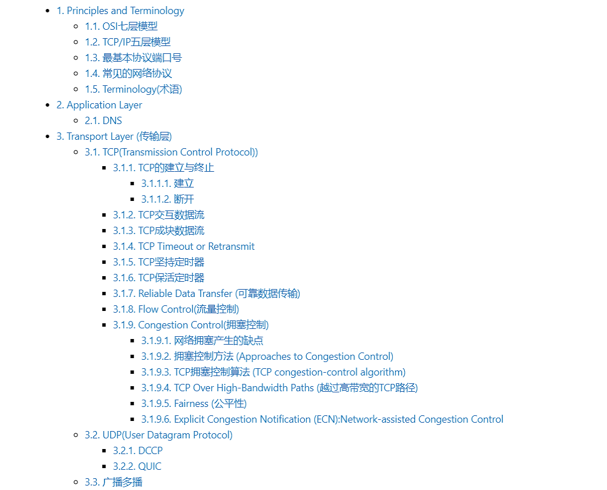
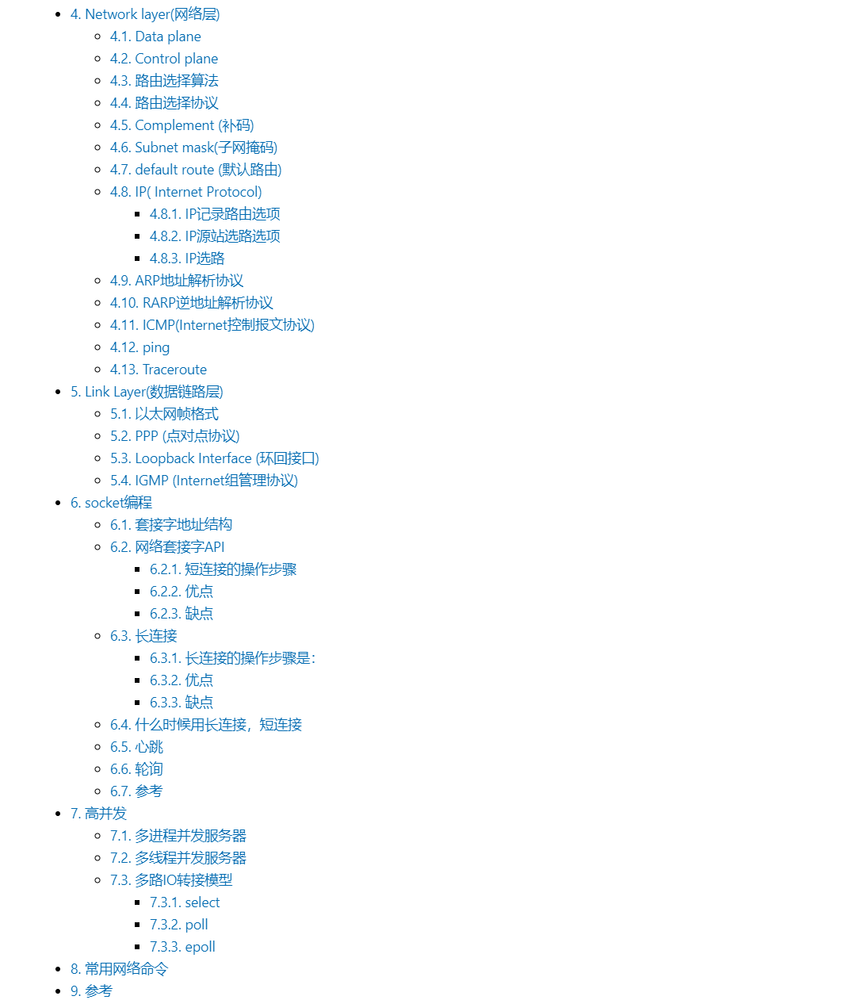

----------------------------------------------------------
[计算机网络常用网络术语缩写](ComputerNetwork/网络术语缩写.md)

----------------------------------------------------------
[HTTP 基础](ComputerNetwork/HTTP基础.md)

----------------------------------------------------------
[Wireshark 网络抓包工具使用分析](ComputerNetwork/Wireshark.md)

## 6.1. 斯坦福大学CS144
课程官方网站  
- [CS 144: Introduction to Computer Networking, Fall 2020](https://cs144.github.io/)：为主。
- [CS144: Introduction to Computer Networking, Fall 2010](https://www.scs.stanford.edu/10au-cs144/): 可选。

书籍
- 《计算机网络：自顶向下方法》
- [Computer Networking: a Top Down Approach 8th edition](http://gaia.cs.umass.edu/kurose_ross/):《计算机网络：自顶向下方法》原书的英文版，最新版本为第八版。
- [Wireshark Labs](http://gaia.cs.umass.edu/kurose_ross/wireshark.htm): 书籍配套的 Wireshark 实验
- [Instructor Resources](http://gaia.cs.umass.edu/kurose_ross/instructor.htm): 与该书籍配套的一些重要学习指导资源。
- [Online presentations Video](http://gaia.cs.umass.edu/kurose_ross/online_lectures.htm): 由于新冠病毒的影响，原书作者之一 Jim Kurose 通过在线学习的方式，给学生授课。每章节不仅包含了授课的PPT、视频，还有知识点检测以及授课中问题的汇总，总之，质量是非常的好。
- [Computer-Networking-A-Top-Down-Approach-8th-Edtion](https://github.com/PEGASUS1993/Computer-Networking-A-Top-Down-Approach-8th-Edtion) Github上一位学习者收集的这本书的一些资料，非常的好。

视频
- [B站：斯坦福大学 Introduction to Computer Networking (CS 144)](https://www.bilibili.com/video/BV137411Z7LR) 

他人笔记
- [知乎：CS144: 什么，你学不会TCP？那就来自己写一个吧！](https://zhuanlan.zhihu.com/p/175998415)  
- [返回主页康宇PL's Blog](https://www.cnblogs.com/kangyupl/p/stanford_cs144_labs.html) 笔记很好，需要深入挖掘。 
- Lab
- [Github: huangrt01TCP-Lab](https://github.com/huangrt01/TCP-Lab) 
- [Github: CS144 sponge](https://github.com/cs144/sponge): 重点推荐。

# 7. 数据结构与算法

数据结构与算法分为数据和算法两个大类。复杂的算法都是由基本的数据结构组合而成的。

[数据结构与算法笔记](DataStructure/DataStructure.md)

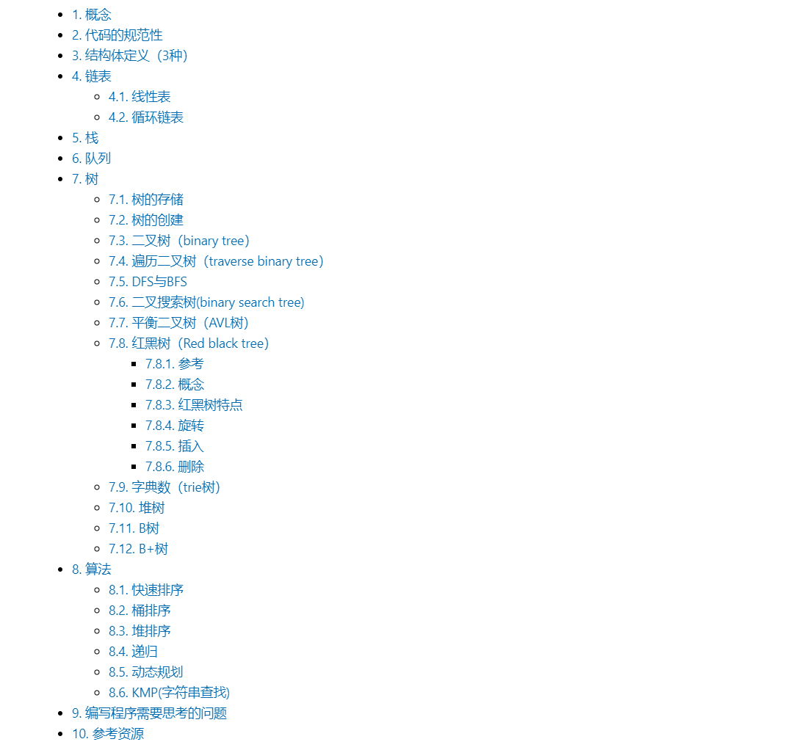

# 8. 设计模式

[C++ 语言实现的的 23 中设计模式](DesignPattern/DesignPattern.md)

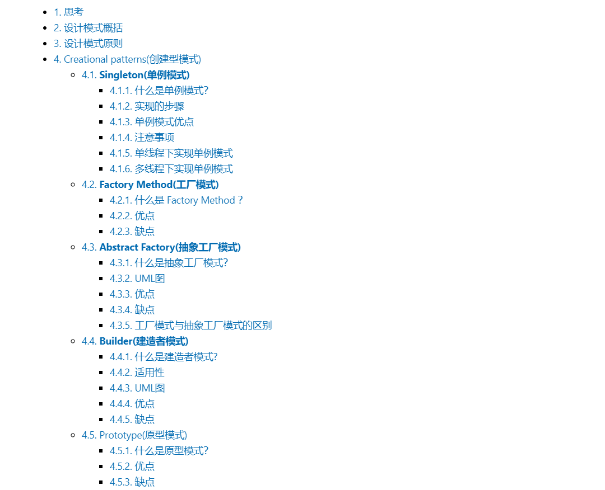
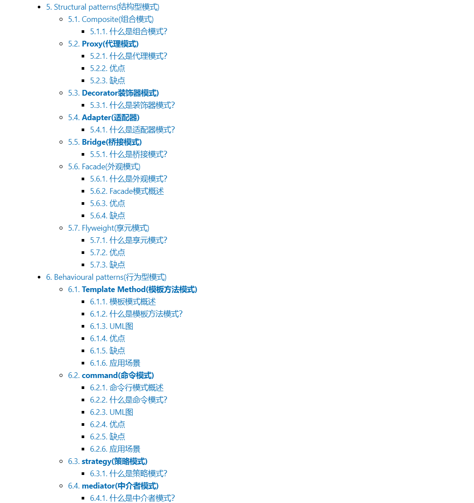
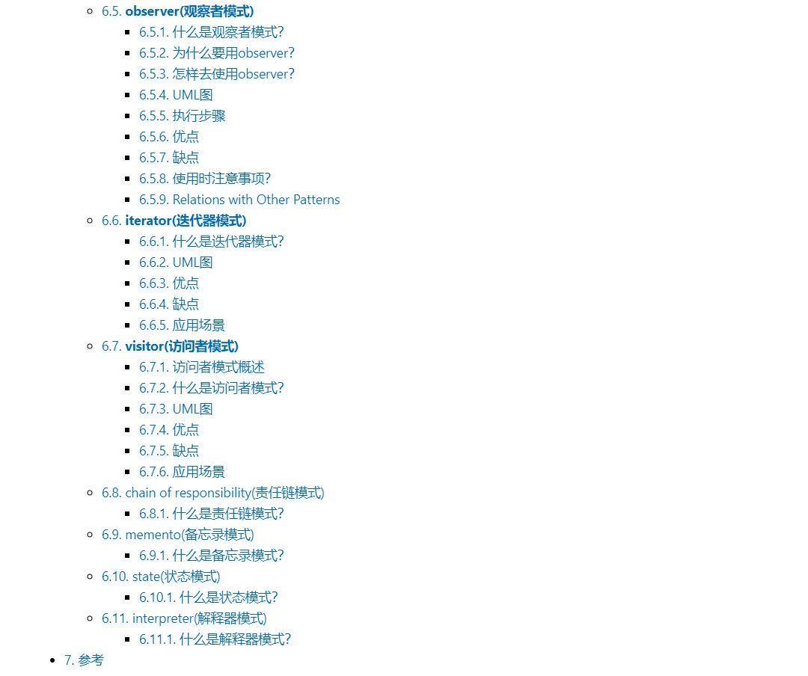

# 9. 数据库

[MySQL 数据库基础板块](MySQL/MySQL.md)

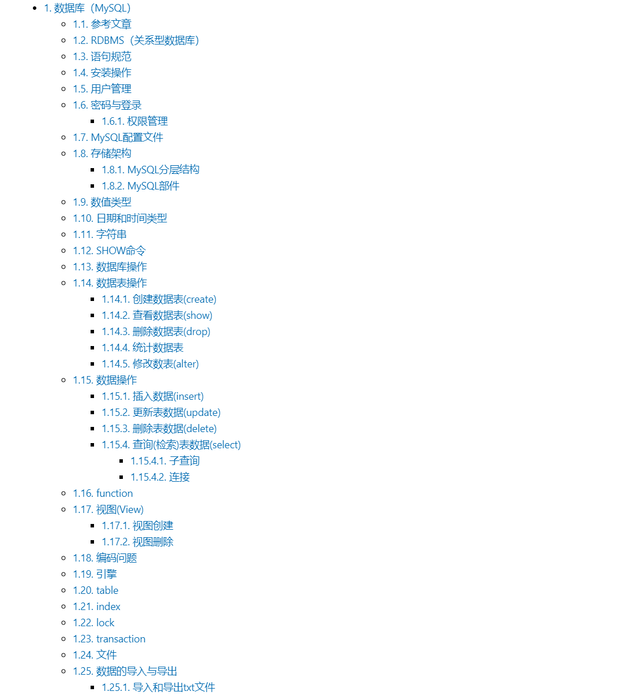

# 10. Git-SVN

[从最简单的 Git 使用，到 Git 内部原理，一步步带你窥探其的奥秘](Git-SVN/Git.md)

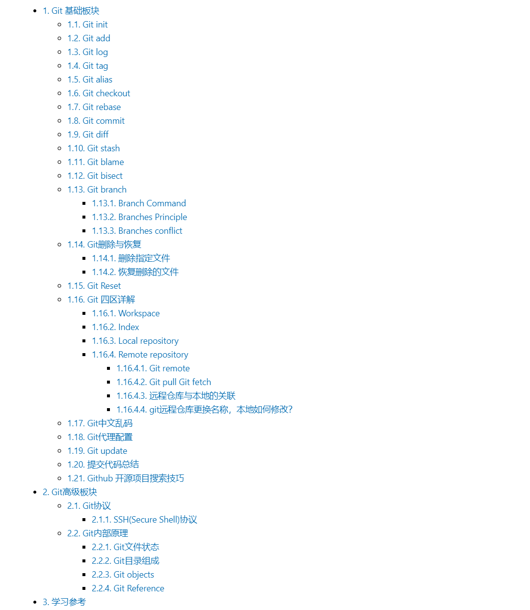

[SVN 工具](Git-SVN/SVN.md)
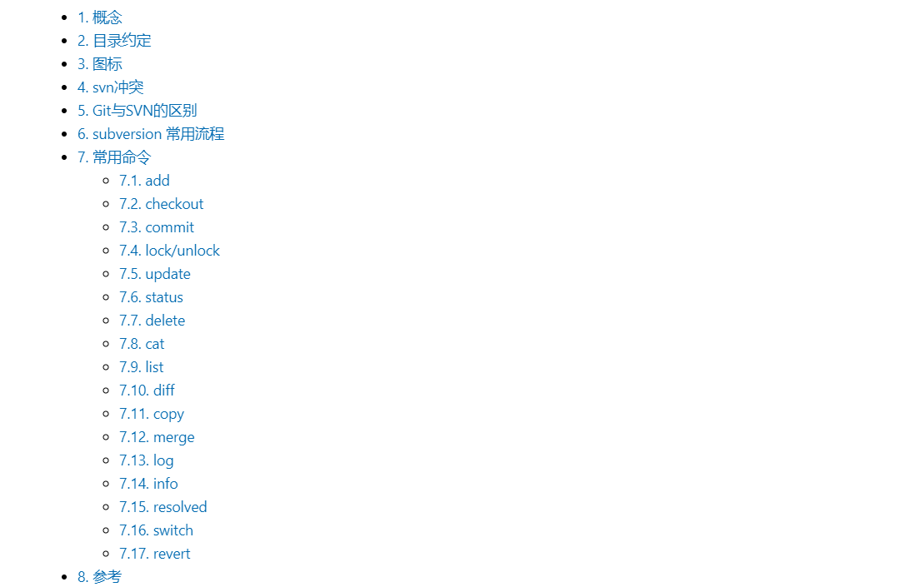

# 11. Go

[Go 语言基础语法](Go/Go.md)

# 12. Linux

[Linux 基础：常用命令和基础知识点](Linux/linux-basics.md)

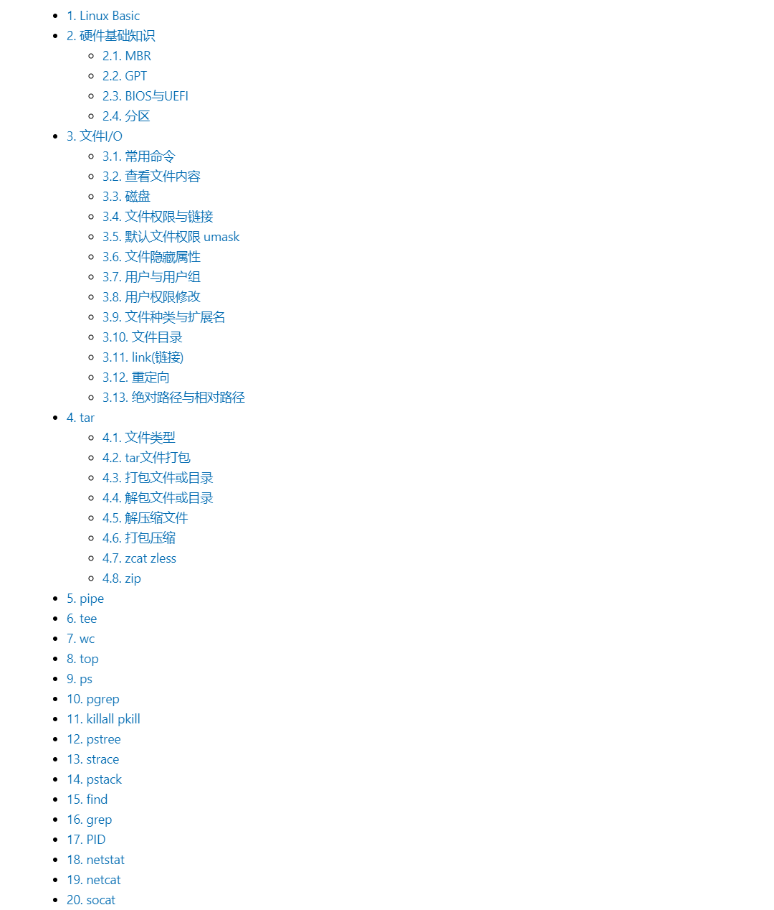
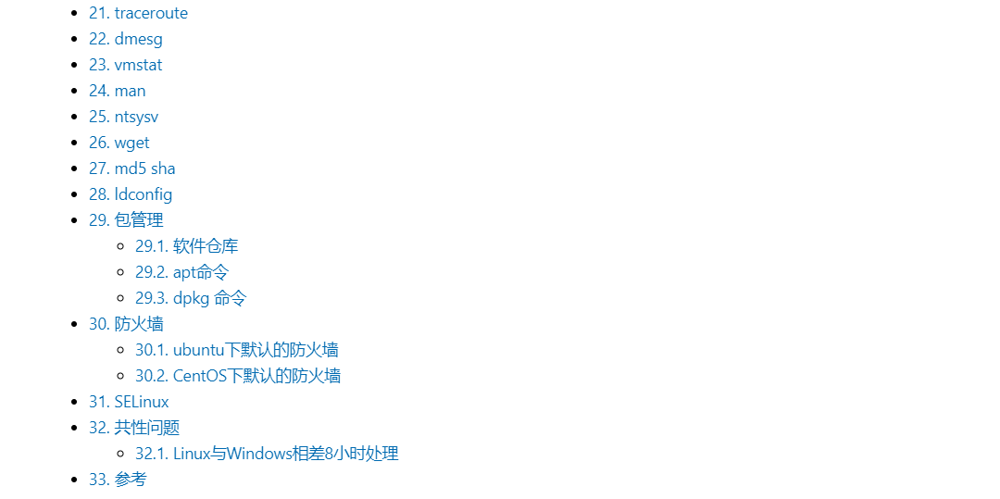

-------------------------------------------------
[编译链接原理及过程分析](Linux/compile-link.md)

[GDB 调试常用命令及底层原理探讨](Linux/gdb.md)

[具有编辑器之神称为的 VIM 用法探讨](Linux/vim/vim.md)

[CMAKE 原理及其语法探讨](Linux/CMake/Make.md)

[Linux 下索引节点 inode 分析](Linux/inode.md)

[Linux 下常用工具集汇总](Linux/linux-tools.md)

[正则表达式的用法](Linux/regexp.md)

[Linux 下服务器端的开发](Linux/linux-server.md)

[Linux 下重点之一：Linux环境系统编程](Linux/system-program.md)

# 13. Shell

[Shell 基础语法分析](Shell/shell.md)

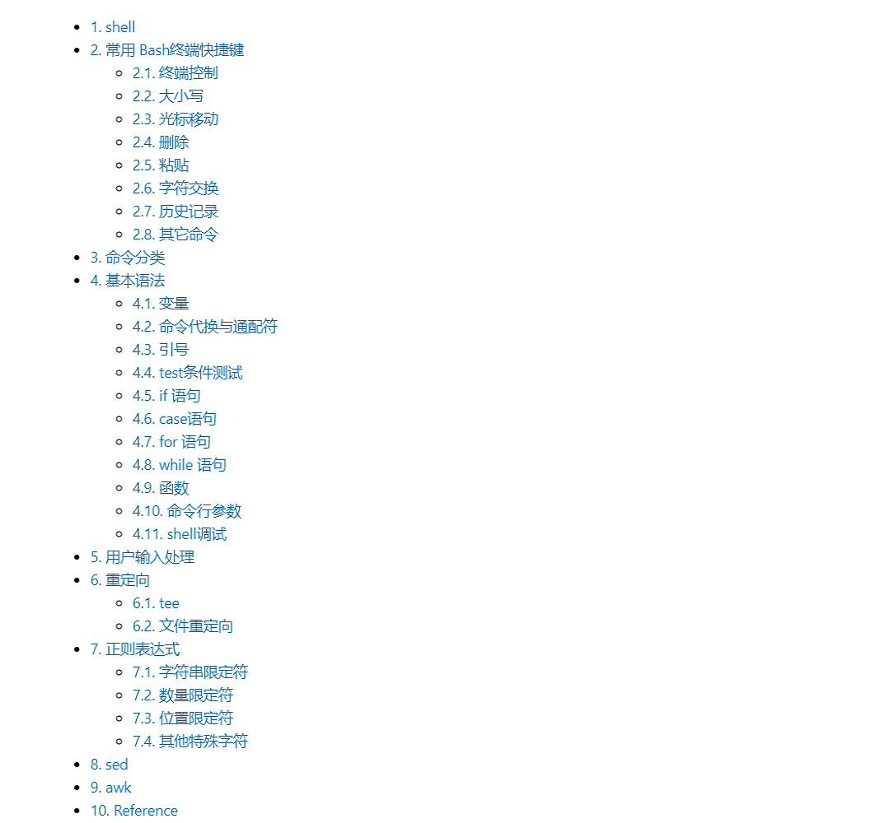

# 14. Redis

[Redis 基础用法](Redis/Redis.md)

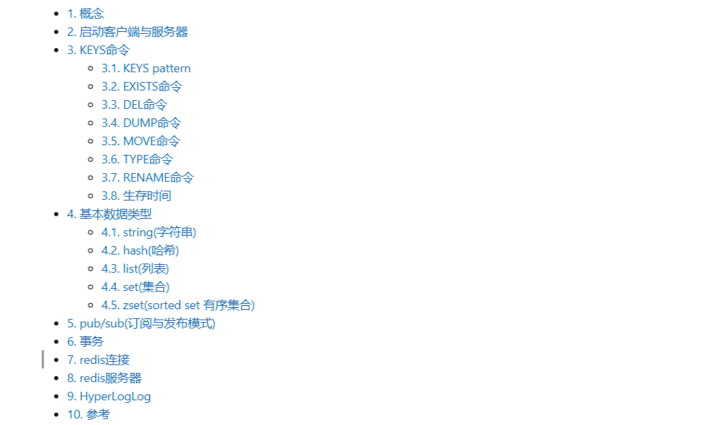

# 15. Nginx

[Nginx 常用基础用法解释](Nginx/Nginx.md)

[XML 基础语法](Nginx/xml.md)

# 16. 分布式

视频
- [B站：MIT 6.824](https://www.bilibili.com/video/BV1qk4y197bB)

书籍
- 《数据密集型应用系统设计》

# 17. Qt

[Qt 常见基础组件用法](Qt/Qt.md)

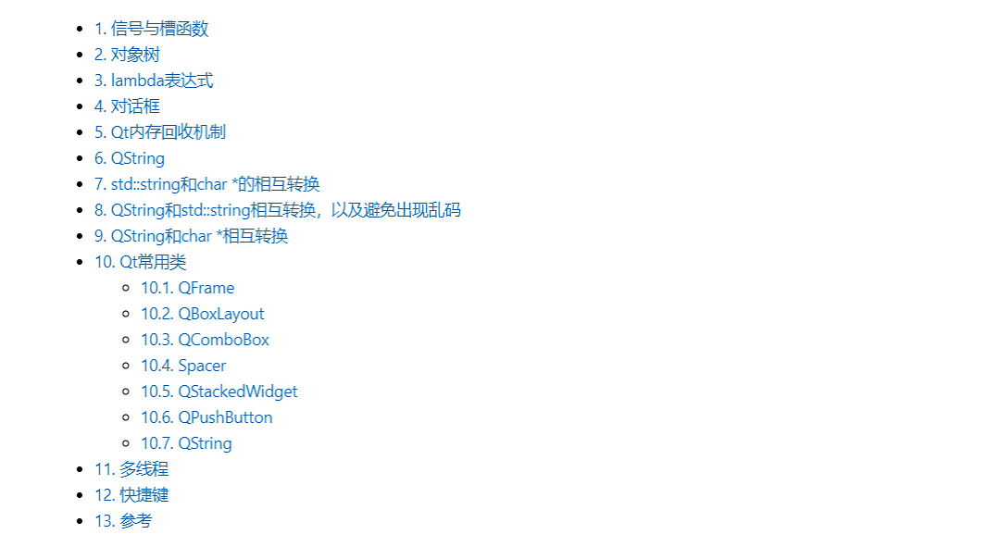

# 18. 汇编语言

[基础的汇编指令解释](Assemble/UniversalRegister.md)

# 19. Markdown

[Markdown 基础语法讲解](Markdown/MarkdownLatex.ipynb)

[LaTeX 数学公式编写的利器](Markdown/LaTex语法.md)

[希腊字母表](Markdown/希腊字母表.md)

[编写 Markdown 文档的 typora 软件常用使用说明](Markdown/Typora使用手册.md)

# 20. 工具

[draw.io 绘图工具常用快捷键](StudyTool/draw.io.md)

[Jetbrains 系列软件使用技巧](StudyTool/JetbrainsPlugins.md)

[VSCode 常用快捷键](StudyTool/VSCode-ShortCuts.md)

[掌握这些 windows10 系统快捷键，大幅度提高日常工作效率](StudyTool/Windows10-Shortcuts.md)

[积累了许多常用的习学习网站](StudyTool/learning-website.md)

[IPAD 比较好的收费的软件](StudyTool/iPad-tools.md)

# 21. 哲学
自己本身对哲学十分感兴趣，记下自己平时生活中的一些哲学思想。

如何把明面做好，相当于是做一个宣传，需要好好的的规划。

如何把复杂的东西描绘成最简单的东西？让一个门外汉也能看懂自己写的文章。

学习知识形成体系结构，脑海里有概念，对计算机专业学科的一些专业术语要有了解，这样看英文源文档，才看得懂，看的速度才快。

# 22. 自学指导
- [cs_study_plan](https://github.com/spring2go/cs_study_plan): Github上一份硬核计算机科学CS自学计划
- [TeachYourselfCS-CN](https://github.com/keithnull/TeachYourselfCS-CN/blob/master/TeachYourselfCS-CN.md): 自学计算机科学课程，推荐一些比较好的书籍和课程。
