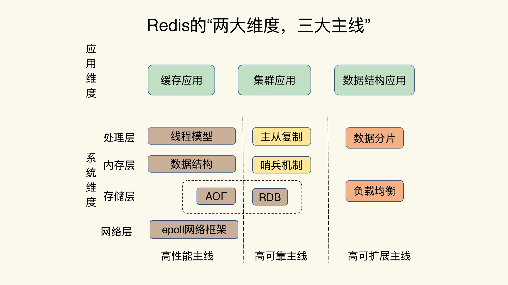
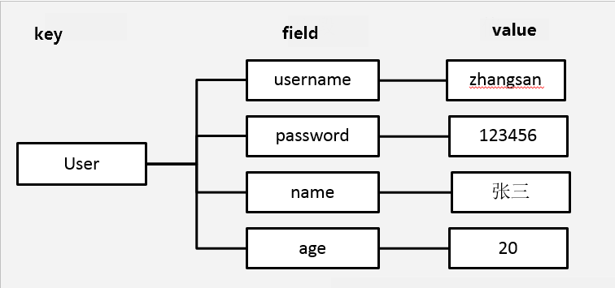
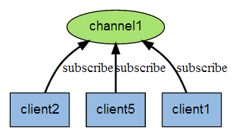
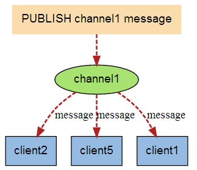
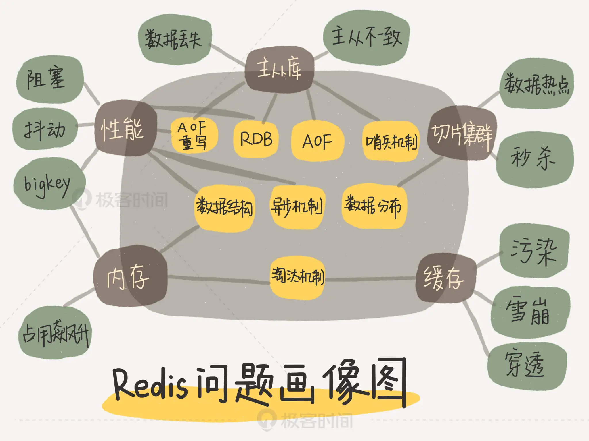

<!--
 * @Author: JohnJeep
 * @Date: 2020-09-05 23:51:27
 * @LastEditTime: 2022-03-30 18:00:36
 * @LastEditors: DESKTOP-0S33AUT
 * @Description: redis学习
-->

<!-- TOC -->

- [1. 如何学 Redis](#1-如何学-redis)
- [2. 概念](#2-概念)
- [3. 配置](#3-配置)
- [4. 启动](#4-启动)
- [5. 命令](#5-命令)
  - [5.1. 通用命令](#51-通用命令)
  - [5.2. KEYS](#52-keys)
  - [5.3. EXISTS](#53-exists)
  - [5.4. DEL](#54-del)
  - [5.5. DUMP](#55-dump)
  - [5.6. MOVE](#56-move)
  - [5.7. TYPE](#57-type)
  - [5.8. RENAME](#58-rename)
  - [5.9. 生存时间](#59-生存时间)
- [6. 基本数据类型](#6-基本数据类型)
  - [6.1. string(字符串)](#61-string字符串)
  - [6.2. hash(哈希)](#62-hash哈希)
  - [6.3. list(列表)](#63-list列表)
  - [6.4. set(集合)](#64-set集合)
  - [6.5. zset(sorted set 有序集合)](#65-zsetsorted-set-有序集合)
- [7. 持久化](#7-持久化)
  - [7.1. RDB](#71-rdb)
  - [7.2. AOF](#72-aof)
- [8. 事务](#8-事务)
- [9. pub/sub](#9-pubsub)
- [10. Master/Slave replication](#10-masterslave-replication)
- [11. Redis 连接](#11-redis-连接)
- [12. Redis Server](#12-redis-server)
- [13. HyperLogLog](#13-hyperloglog)
- [14. 集群(cluster)](#14-集群cluster)
- [15. 集群方案优化](#15-集群方案优化)
- [16. 数据一致性](#16-数据一致性)
- [17. 高并发访问](#17-高并发访问)
- [18. 分布式锁](#18-分布式锁)
- [19. 典型问题](#19-典型问题)
  - [19.1. Redis 上踩过的坑](#191-redis-上踩过的坑)
  - [19.2. 缓存基本原理](#192-缓存基本原理)
  - [19.3. 缓存淘汰策略](#193-缓存淘汰策略)
  - [19.4. 缓存穿透](#194-缓存穿透)
  - [19.5. 缓存击穿](#195-缓存击穿)
  - [19.6. 缓存雪崩](#196-缓存雪崩)
- [20. 参考](#20-参考)

<!-- /TOC -->

# 1. 如何学 Redis

如何花费很少的时间掌握 Redis 的知识和使用经验，去解决更多的问题。需要自己抓住主线，在自己的脑海中绘制一幅 Redis 全景知识图，从整体上去看 Redis，建立一套完整的体系架构。下面这幅图概述了 Redis 学习的“两大维度，三大主线”。

“两大维度”：指系统维度和应用维度，“三大主线”：是指高性能、高可靠和高可扩展。

从系统维度上说，需要了解 Redis 的各项关键技术的设计原理，这些能够为你判断和推理问题打下坚实的基础，而且，你还能从中掌握一些优雅的系统设计规范，例如 run-to-complete 模型、epoll 网络模型，这些可以应用到你后续的系统开发实践中。

从应用维度上，按照两种方式学习: “应用场景驱动”和“典型案例驱动”，一个是“面”的梳理，一个是“点”的掌握。比如，缓存和集群是 Redis 的两大广泛的应用场景，而提到缓存场景，需要想到缓存机制、缓存替换、缓存异常等一连串的问题。

三大主线：

- 高性能主线，包括线程模型、数据结构、持久化、网络框架；
- 高可靠主线，包括主从复制、哨兵机制；
- 高可扩展主线，包括数据分片、负载均衡。



# 2. 概念

NoSQL 数据库
- NoSQL = Not Only SQL(不仅仅是 SQL) ，泛指 non-relational(非关系型数据库)。今天随着互联网 web2.0 网站的兴起，比如谷歌或 Facebook 每天为他们的用户收集万亿比特的数据， 这些类型的数据存储不需要固定的模式，无需多余操作就可以横向扩展，就是一个数据量超大。传统的 SQL 语句库不再适应这些应用了。 NoSQL 数据库是为了解决大规模数据集合多重数据种类带来的挑战，特别是超大规模数据的存储。
-  NoSQL 数据库特点：采用聚合数据结构存储数据，去掉了关系数据库的关系型特性，数据之间一旦没有关系，使得扩展性、读写性能都大大提高。

什么是 redis？

- Redis 全名叫 Remote Dictionary Server，即远程字典服务，是一个开源的用 C 语言编写、遵守 BSD 协议、基于内存运行并支持持久化的日志型、key-Value 的数据库、并提供多种语言的API。为了保证效率，Redis 将数据缓存在内存（memory）中，周期性的将数据写入磁盘。
- redis 是 Nosql 数据库中使用较为广泛的非关系型内存数据库，redis 内部是一个key-value 存储系统。它支持存储的 value 类型相对更多，包括 string（字符串）、list（链表）、se（集合）、zset（sorted set –有序集合）、 hash（哈希类型）、位图，hyperloglogs等数据类型。Redis 基于内存运行并支持持久化的 NoSQL 数据库，是当前最热门的NoSql数据库之一，也被人们称为数据结构存储服务器。

Redis 的主要优点
- Redis 支持数据的持久化，可以将内存（memory）中的数据保持在磁盘（disk）中，重启的时候可以再次加载进行使用。
- Redis 不仅仅支持简单的 `key-value` 类型的数据，同时还提供 `list`，`set`，`zset`，`hash` 等数据结构的存储。
- Redis 支持数据的备份，即主从（master-slave） 模式的数据备份。

Redis 应用场景

- 用作缓存数据：将经常需要查询的数据存储在内存（memory） 而不是磁盘中，来提高效率。
- 用作消息队列：相当于消息订阅系统，只能用于对数据一致性不高的业务中，对数据一致性要求较高时，建议用消息中间件，比如ActiveMQ、RocketMQ。
- 计数器：比如统计点击率、点赞率，可以快速实现计数和查询的功能。redis 具有原子性，可以避免并发问题。
- 电商网站信息：大型电商平台初始化页面数据的缓存。比如去哪儿网购买机票的时候首页的价格和你点进去的价格会有差异。
- 热点数据：比如新闻网站实时热点、微博热搜等，需要频繁更新。总数据量比较大的时候直接从数据库查询会影响性能。


# 3. 配置

Redis/src/ 目录相关文件功能描述

- redis-server  : redis 服务器
- redis-cli  : redis 命令行客户端
- redis-benchmark : redis 性能测试工具
- redis-check-aof : aof 文件修复工具
- redis-check-rdb : 文件检查工具 


/usr/lib/systemd/system/ 目录下存放的都是开机自启动服务。

- loglevel: 日志级别。开发阶段可以设置成 debug，生产阶段通常设置为 notice 或者 warning。
- logfile: 日志文件保存路径，默认下没有配置。
- requirepass： 配置 Redis 的访问密码。默认不配置密码，即访问不需要密码验证。 此配置项需要在
`protected-mode=yes` 时起作用。 


# 4. 启动

Redis 客户端与服务器的启动。

- `redis-cli`：启动 Redis 客户端
- `redis-cli -h host -p port -a password`：远程机器上启动Redis 客户端
- `redis-server`：启动 Redis 服务器

```sh
// 后台启动 server
[root@redis_181 redis-6.0.16]# redis-server &
[1] 1796
[root@redis_181 redis-6.0.16]# 1796:C 23 Nov 2021 06:59:05.276 # oO0OoO0OoO0Oo Redis is starting oO0OoO0OoO0Oo
1796:C 23 Nov 2021 06:59:05.276 # Redis version=6.0.16, bits=64, commit=00000000, modified=0, pid=1796, just started
1796:C 23 Nov 2021 06:59:05.276 # Warning: no config file specified, using the default config. In order to specify a config file use redis-server /path/to/redis.conf
1796:M 23 Nov 2021 06:59:05.277 * Increased maximum number of open files to 10032 (it was originally set to 1024).
                _._
           _.-``__ ''-._
      _.-``    `.  `_.  ''-._           Redis 6.0.16 (00000000/0) 64 bit
  .-`` .-```.  ```\/    _.,_ ''-._
 (    '      ,       .-`  | `,    )     Running in standalone mode
 |`-._`-...-` __...-.``-._|'` _.-'|     Port: 6379
 |    `-._   `._    /     _.-'    |     PID: 1796
  `-._    `-._  `-./  _.-'    _.-'
 |`-._`-._    `-.__.-'    _.-'_.-'|
 |    `-._`-._        _.-'_.-'    |           http://redis.io
  `-._    `-._`-.__.-'_.-'    _.-'
 |`-._`-._    `-.__.-'    _.-'_.-'|
 |    `-._`-._        _.-'_.-'    |
  `-._    `-._`-.__.-'_.-'    _.-'
      `-._    `-.__.-'    _.-'
          `-._        _.-'
              `-.__.-'

// 启动 client
$redis-cli -h 127.0.0.1 -p 6379 -a "mypass"
redis 127.0.0.1:6379>
redis 127.0.0.1:6379> PING   // 检测 redis 服务是否启动
PONG
```

# 5. 命令

## 5.1. 通用命令

- `info`: 查看 Redis 的所有统计信息。
- `select index`: 切换数据库。
- `dbsize`: 查看当前数据库中 key 的数目。
- `flushdb`: 清空当前库。
- `flushall`: 清空所有数据库。
- `config get *`: 查看 Redis 中的配置信息。


## 5.2. KEYS 

Redis 键（key）命令用于管理 redis 的键。

- `key pattern`: 查找所有匹配给定模式的键。示例：`keys *` : 查询数据库中所有的键。
- 常用的符号
  - `？`: 匹配一个字符 
  - `*`: 匹配任意个字符（包括0个字符）
  - `[]`: 匹配括号间的任一字符
  - `\*` : 匹配字符x,用于转义符号；若要匹配 ？，则使用 `\?`

```sh
127.0.0.1:6379> keys *
1) "wang"
2) "my_set"
3) "deng"
4) "my_zset"
5) "my_table"
6) "name"
7) "key2"
8) "s_set"
9) "key1"
```

## 5.3. EXISTS

`exists key`：判断一个按键是否存在，如果按键存在，则返回整数类型1，否则返回0

```sh
127.0.0.1:6379> exists li
(integer) 0
127.0.0.1:6379> exists wang
(integer) 1
```


## 5.4. DEL

`del key1, key2 ...` 删除一个或多个按键，返回值是删除的键的个数。

```sh
127.0.0.1:6379> del match_rank s_set
(integer) 2
```


## 5.5. DUMP

`dump key`：序列化给定的key ，如果 key 不存在，那么返回 nil； 否则，返回序列化之后的值。

序列化生成的值有以下几个特点：
- 它带有 64 位的校验和，用于检测错误，RESTORE 在进行反序列化之前会先检查校验和。
- 值的编码格式和 RDB 文件保持一致。
- RDB 版本会被编码在序列化值当中，如果因为 Redis 的版本不同造成 RDB 格式不兼容，那么 Redis 会拒绝对这个值进行反序列化操作。
- 序列化的值不包括任何生存时间信息。

```sh
127.0.0.1:6379> get name
"jackpeter"
127.0.0.1:6379> dump name
"\x00\tjackpeter\x06\x00\x94\\\xe0\xa8>\x0ef\xf8"
127.0.0.1:6379> dump na
(nil)
```


## 5.6. MOVE

`move key db`：将当前数据库的键值 key 移动到给定的数据库 db 当中，移动成功返回 1，失败则返回 0。

如果当前数据库(源数据库)和给定数据库(目标数据库)有相同名字的给定 key ，或者 key 不存在于当前数据库，那么 MOVE 没有任何效果。


## 5.7. TYPE
`type key1, key2, ...`: 获取按键的数据类型。数据类型可以是 string、hash、list、set、zset。

```sh
127.0.0.1:6379> type name
string
```


## 5.8. RENAME

- `rename key key1`：将键值key修改为key1

- `renamenx key key1`：仅当键值key1不存在当前数据库中时，才可以将key修改为key1

- `randomkey`：从当前数据库中随机返回一个 key 。

  ```sh
  127.0.0.1:6379> rename name my_name
  OK
  127.0.0.1:6379> renamenx my_name age   // 数据库中已存在age键
  (integer) 0
  127.0.0.1:6379> get my_name
  "jackpeter"
  127.0.0.1:6379> renamenx my_name tt
  (integer) 1
  127.0.0.1:6379> randomkey
  "key2"
  127.0.0.1:6379> randomkey
  "age"
  ```


## 5.9. 生存时间

redis 在实际使用过程中一般用作缓存，然而缓存的数据一般都需要设置生存时间，也就是到期后销毁数据。

- `expire key seconds`：键值对的生存时间为 seconds，时间到后，销毁键值对中的数据
- `TTL key`：以秒为单位，返回给定 key 的剩余生存时间(TTL, time to live)。
  - TTL返回值：
    - 大于0的数字：剩余生存时间，单位为秒
    - -1 ： 没有生存时间，永久存储
    - -2 ： 数据已经被删除
- `pttl key`：以毫秒为单位返回 key 的剩余的过期时间。
- `persist key` 清除键值对的生存时间，key将永久保持。注意：重新设置值也会清除生存时间。


```sh
127.0.0.1:6379> set my_live time
OK
127.0.0.1:6379> get my_live
"time"
127.0.0.1:6379> ttl my_live
(integer) -1
127.0.0.1:6379> expire my_live 20
(integer) 1
127.0.0.1:6379> ttl my_live
(integer) 18
127.0.0.1:6379> ttl my_live
(integer) 14
127.0.0.1:6379> ttl my_live
(integer) 1
127.0.0.1:6379> ttl my_live
(integer) -2
127.0.0.1:6379> get my_live
(nil)

127.0.0.1:6379> set my_live time
OK
127.0.0.1:6379> ttl my_live
(integer) -1
127.0.0.1:6379> expire my_live 2000
(integer) 1
127.0.0.1:6379> ttl my_live
(integer) 1996
127.0.0.1:6379> ttl my_live
(integer) 1993
127.0.0.1:6379> get my_live
"time"
127.0.0.1:6379> persist my_live
(integer) 1
127.0.0.1:6379> ttl my_live
(integer) -1
127.0.0.1:6379> get my_live
"time"
```

# 6. 基本数据类型

## 6.1. string(字符串)

string类型是 Redis 最基本的数据类型，一个 `key`对应一个 `value` ，一个键最大能存储 512MB。

基础命令
- `set key value`：设置key对应的value 
- `mset key value [key value]`：设置多个key对应的value 
- `get key`：获取key对应的value
- `mget key`：获取多个key对应的value
- `incr key`：当 value 值为整数时，将当前 key 对应的键值每次加一，并返回递增后的值。
- `incrby key num`：当value值为整数时，将当前key对应的键值每次加 num，并返回递增后的值。
- `incrbyfloat key num`：当value值为浮点数时，将当前key对应的键值每次加 num，并返回递增后的值。
- `decr key`：将当前key对应的键值每次减一，并返回递减后的值。
- `decrby key num`：将当前key对应的键值每次减 num，并返回递减后的值。
- `append key value`：向原来key对应的value 末尾添加value，返回追加后字符串的总长度。
- `strlen key`：获取key对应的value的长度。 若键值不存在则返回0
- `getrange key start end`：获取key对应的value中的子字符串，start和end为value的索引下标，从0开始。
- `getbit key offset`：返回key对应的value在字符串中offset偏移位置处的bit值（存在为1，不存在为0）。


  ```shell
  redis 127.0.0.1:6379> SET name "Jack"
  OK
  redis 127.0.0.1:6379> GET name
  "Jack"
  127.0.0.1:6379> type name
  string
  127.0.0.1:6379> mset age 20 sex man  score 100
  OK
  127.0.0.1:6379> mget age sex score
  1) "20"
  2) "man"
  3) "100"

  127.0.0.1:6379> get wang
  "700"
  127.0.0.1:6379> incr wang
  (integer) 701
  127.0.0.1:6379> get wang
  "701"

  127.0.0.1:6379> incrby wang 10
  (integer) 713
  127.0.0.1:6379> incrby wang 12
  (integer) 725
  127.0.0.1:6379> decr wang
  (integer) 724
  127.0.0.1:6379> decr wang
  (integer) 723
  127.0.0.1:6379> decrby wang 5
  (integer) 718
  127.0.0.1:6379> decrby wang 3
  (integer) 715

  127.0.0.1:6379> append score 10
  (integer) 5
  127.0.0.1:6379> get score
  "10010"
  127.0.0.1:6379> strlen score
  (integer) 5

  127.0.0.1:6379> get name
  "jack"
  127.0.0.1:6379> append name peter
  (integer) 9
  127.0.0.1:6379> get name
  "jackpeter"
  127.0.0.1:6379> getrange name 0 3
  "jack"

  ```


## 6.2. hash(哈希)

Redis hash是一个string类型的 `field` 和 `value` 的映射表，是一个键值对集合，hash特别适合用于存储对象。


基础命令
- `hset key field value`：向键值为key的hash中添加字段为field，值为value的数据。
- `hsetnx key field value`：向键值为key的hash中添加字段为field，值为value的数据，只有当这个字段不存在时才有效。
  - 返回1：如果字段是个新的字段，并成功赋值
  - 返回0：如果哈希集中已存在该字段，没有操作被执行  
- `hget key field`：从hash表中返回键值为key，字段为field的value值。
- `hmset key field value [field value]`  向键值为key的hash中添加多个字段为field，值为value的数据。
- `hmget key field [field]`：从hash表中返回键值为key，多个字段为field的value值。
- `hgetall key`：得到hash集合中所有的键值key和值value。
- `hkeys key`：获取hash中所有的field值。
- `hvals key`：获取hash中所有的value值。
- `hlen key`：获取hash中所有field的数量。
- `hexists key field`： 判断键值为key的hash表中是否存在字段field。
> 注意：hset命令不区分插入和更新操作，当执行插入操作时，hset返回结果为1，当执行更新操作时，返回结果为0

- `hincrby key field num`：每次向键值为key，字段为field的hash中添加 num
- `hincrbyfloat key field num`：每次向键值为key，字段为field的hash中添加浮点数 num
- `hdel key field [field ...]`：删除hash表中键值为key中的一个或多个字段field，返回的结果为被删除字段field的个数。
- `hscan key cursor  [MATCH pattern] [COUNT count]`：迭代哈希表中的键值对。

  ```sh
  // 往hash表中插入数据，user是一个键值key
  127.0.0.1:6379> hset user username zhangsan
  (integer) 1
  127.0.0.1:6379> hget user username
  "zhangsan"
  127.0.0.1:6379> hmset user password 123
  OK
  127.0.0.1:6379> hmset user name ZS age 23
  OK
  127.0.0.1:6379> hgetall user
  1) "username"
  2) "zhangsan"
  3) "password"
  4) "123"
  5) "name"
  6) "ZS"
  7) "age"
  8) "23"
  127.0.0.1:6379> hmget user age name
  1) "23"
  2) "ZS"
  127.0.0.1:6379> hkeys user
  1) "username"
  2) "password"
  3) "name"
  4) "age"
  
  127.0.0.1:6379> hexists user age
  (integer) 1
  127.0.0.1:6379> hexists user sex
  (integer) 0
  127.0.0.1:6379>
  
  127.0.0.1:6379> hlen user
  (integer) 4
  127.0.0.1:6379> hvals user
  1) "zhangsan"
  2) "123"
  3) "ZS"
  4) "23"
  
  127.0.0.1:6379> hsetnx user name jock
  (integer) 0
  127.0.0.1:6379> hsetnx user sex woman
  (integer) 1
  
  127.0.0.1:6379> hscan user 2
  1) "0"
  2)  1) "username"
      2) "zhangsan"
      3) "password"
      4) "123"
      5) "name"
      6) "ZS"
      7) "age"
      8) "23"
      9) "sex"
    10) "woman"
  ```


## 6.3. list(列表)

Redis 列表是简单的字符串列表，按照插入顺序排序。你可以添加一个元素到列表的头部（左边）或者尾部（右边）。列表最多可存储 $2^{32} - 1$ 元素 (4294967295, 每个列表可存储40多亿)。

基础命令
- `lpush key value1 [value2, value3 ...]`： 往list列表头部中添加一个或多个数据。
- `rpush key value1 []value2, ...`：往list列表尾部中添加一个或多个数据。
- `linsert key before | after pivot value`：把value值插入在key列表的基准值 pivot 的前面或后面。


- `lrange key start stop`：获取列表指定范围内的元素
- `lindex key index`：通过索引获取列表中index处的元素
- `llen key`：获取列表长度
- `lrem key count value`：移除列表中出现count次，值为value的元素
  - count > 0: 从头往尾移除值为 value 的元素。
  - count < 0: 从尾往头移除值为 value 的元素。
  - count = 0: 移除所有值为 value 的元素。


  - `lpop key`：移出并获取列表的第一个元素
  - `rpop key`：移出并获取列表的最后一个元素
  - `blpop key1 [key2] timeout`：移出并获取列表的第一个元素， 如果列表没有元素，会阻塞列表直到等待超时或发现可弹出元素为止。
  - `brpop key1 [key2] timeout`：移除列表中的最后一个元素，返回一个双元素的多批量值，其中第一个元素是弹出元素的 key，第二个元素是 value。如果列表没有元素，会阻塞列表直到等待超时或发现可弹出元素为止。
  - `brpoplpush source destination timeout`：从source列表中弹出最右边的值，将弹出的元素从最左边插入到另外一个destination列表中并返回它；如果列表没有元素，会阻塞列表直到等待超时或发现可弹出元素为止。
  - `rpoplpush source destination`：从source列表中弹出最右边的值，将弹出的元素从最左边插入到另外一个destination列表中并返回它；

  - `lset key index value`：通过index去改变list中的值
  - `ltrim key start stop`：让列表只保留指定区间内的元素，不在指定区间之内的元素都将被删除。  


  ```sh
  127.0.0.1:6379> type my_list
  list
  127.0.0.1:6379> llen my_list
  (integer) 4
  127.0.0.1:6379> lrange my_list 0 3
  1) "peach"
  2) "pear"
  3) "banana"
  4) "apple"
  127.0.0.1:6379> lindex my_list 2
  "banana"

  127.0.0.1:6379> lpush my_list  aa aa bb aa bb
  (integer) 9
  127.0.0.1:6379> lrange my_list 0 8
  1) "bb"
  2) "aa"
  3) "bb"
  4) "aa"
  5) "aa"
  6) "peach"
  7) "pear"
  8) "banana"
  9) "apple"
  127.0.0.1:6379> lrem my_list 2 aa
  (integer) 2
  127.0.0.1:6379> lrange my_list 0 6
  1) "bb"
  2) "bb"
  3) "aa"
  4) "peach"
  5) "pear"
  6) "banana"
  127.0.0.1:6379> llen my_list
  (integer) 7

  127.0.0.1:6379> blpop my_list 3
  1) "my_list"
  2) "bb"
  127.0.0.1:6379> lrange my_list 0 5
  1) "bb"
  2) "aa"
  3) "peach"
  4) "pear"
  5) "banana"
  6) "apple"
  127.0.0.1:6379> brpop my_list 3
  1) "my_list"
  2) "apple"

  127.0.0.1:6379> brpoplpush my_list temp_list 5
  "banana"
  127.0.0.1:6379> lrange my_list 0 5
  1) "bb"
  2) "aa"
  3) "peach"
  4) "pear"
  127.0.0.1:6379> lrange temp_list 0 5
  1) "banana"

  127.0.0.1:6379> lset my_list 1 hello
  OK
  127.0.0.1:6379> lrange my_list 0 5
  1) "bb"
  2) "hello"
  3) "bb"
  4) "aa"
  5) "peach"
  6) "pear"

  127.0.0.1:6379> rpush my_list gg
  (integer) 5
  127.0.0.1:6379> lrange my_list 0 5
  1) "bb"
  2) "hello"
  3) "bb"
  4) "aa"
  5) "gg"

  127.0.0.1:6379> lrange my_list 0 5
  1) "bb"
  2) "hello"
  3) "bb"
  4) "aa"
  5) "peach"
  6) "pear"
  127.0.0.1:6379> rpop my_list
  "pear"
  127.0.0.1:6379> rpoplpush my_list temp_list
  "peach"
  ```

通过Redis 1.0就引入的list结构我们就能实现一个分布式的消息队列，满足一些简单的业务需求。但list结构作为消息队列服务有一个很致命的问题，它没有广播功能，一个消息只能被消费一次。而在大型系统中，通常一个消息会被下游多个应用同时订阅和消费，例如当用户完成一个订单的支付操作时，需要通知商家发货，要更新物流状态，可能还会提高用户的积分和等级，这些都是不同的下游子系统，他们全部会订阅支付完成的操作，而list一个消息只能被消费一次在这样复杂的大型系统面前就捉襟见肘了。

可能你会说那弄多个list，生产者向每个list中都投递消息，每个消费者处理自己的list不就行了吗。这样第一是性能不会太好，因为同一个消息需要被重复的投递，第二是这样的设计违反了生产者和消费者解耦的原则，这个设计下生产者需要知道下游有哪些消费者，如果业务发生变化，需要额外增加一个消费者，生产者的代码也需要修改。


## 6.4. set(集合)

Redis Set 是 string 类型的无序集合。集合是通过哈希表实现的，所以添加，删除，查找的复杂度都是 O(1)。 在 Redis 可以添加，删除和测试成员存在的时间复杂度为 O（1）。集合中最大的成员数为 $2^{32} - 1$ (4294967295, 每个集合可存储40多亿个成员)。

Redis 非常人性化的为集合提供了 求交集、并集、差集等操作, 那么就可以非常方便的实现如共同关注、共同喜好、二度好友等功能, 对上面的所有集合操作,你还可以使用不同的命令选择将结果返回给客户端还是存集到一个新的集合中。

命令
- `sadd my_set member [...]`: 向my_set集合中添加一个或多个member元素
- `sdiff key1 key2`: 返回ke1集合中除去与key2集合中共有的元素
- `sinter key1 key2`: 返回key1集合与key2集合的交集的元素
- `smembers my_set`: 查看my_set集合中所有的元素
- `scard my_set`: 查看my_set集合中的元素的数量
- `sismember my_set "one"`: 判断my_set 集合中是否有 one 成员值
- `smove source destination member`: 将source集合中的member成员移动到destination集合中
- `spop my_set [count]` 从my_set集合中随机删除元素并返回返回一个或多个随机元素。
  - count参数将在更高版本中提供，但是在2.6、2.8、3.0中不可用。
- `srandmember my_set [count]` 从my_set集合中随机获取一个元素值
  - 不使用count 参数的情况下该命令返回随机的元素，如果key不存在则返回nil。
  - 使用count参数,则返回一个随机的元素数组，如果key不存在则返回一个空的数组。
    - Redis 2.6开始，可以接受 count 参数，如果count是整数且小于元素的个数，返回含有 count 个不同的元素的数组，
    - 如果count是个整数且大于集合中元素的个数时，仅返回整个集合的所有元素，
    - 当count是负数，则会返回一个包含 count 绝对值的个数元素的数组；如果count的绝对值大于元素的个数，则返回的结果集里会出现一个元素出现多次的情况。

  - `srem my_set member [...]` 从my_set集合中删除指定的一个或多个元素。
  - `sunion my_set1 my_set2` 返回my_set1集合与my_set2集合中所有元素的并集。
  - `sunionstore set_key set_key1 set_key2` 返回set_key1集合与set_key2集合中所有元素的并集，并将结果存储在新的集合set_key中。
  - `sscan my_set ` 迭代当前数据库中my_key集合的元素

  ```sh
  127.0.0.1:6379> sadd my_set one
  (integer) 1
  127.0.0.1:6379> sadd my_set two
  (integer) 1
  127.0.0.1:6379> sadd my_set three
  (integer) 1
  127.0.0.1:6379> smembers my_set
  1) "three"
  2) "two"
  3) "one"
  
  127.0.0.1:6379> scard my_set
  (integer) 3
  127.0.0.1:6379> smembers my_set
  1) "two"
  2) "one"
  3) "three"
  4) "four"
  127.0.0.1:6379> srandmember my_set
  "four"
  127.0.0.1:6379> srandmember my_set
  "one"
  127.0.0.1:6379> srandmember my_set 2
  1) "two"
  2) "three"
  127.0.0.1:6379> srandmember my_set 3
  1) "two"
  2) "one"
  3) "three"
  127.0.0.1:6379> srandmember my_set 5
  1) "two"
  2) "one"
  3) "three"
  4) "four"
  127.0.0.1:6379> srandmember my_set -1
  1) "four"
  127.0.0.1:6379> srandmember my_set -2
  1) "two"
  2) "four"
  127.0.0.1:6379> srandmember my_set -5
  1) "three"
  2) "two"
  3) "two"
  4) "four"
  5) "one"
  ```

应用场景
- 1.共同好友、二度好友
- 2.利用唯一性,可以统计访问网站的所有独立 IP
- 3.好友推荐的时候,根据 tag 求交集,大于某个 临界值 就可以推荐


## 6.5. zset(sorted set 有序集合)

Redis 有序集合和集合一样也是 string 类型元素的集合，且不允许重复的成员。redis 通过 `score` 来为集合中的成员进行从小到大的排序。有序集合的成员(member) 是唯一的,但分数 (score) 却可以重复。

命令
- `zadd key score member`：将指定成员添加到键值为key的有序集合里面
- `zcard key`: 返回key集合中的成员数量。
- `zcount key min max`：返回key集合中分数在最小和最大值之间的成员数据的个数。
- `zincrby key increment member`:  在有序集合key中的成员数据member的score值加上增量increment值。
- `zrevrange key start stop [withscores]`: 按照逆序排序返回有序集合key中在start和stop区间范围内的元素。
- `zrange key start stop [withscores]`: 返回有序集合key中在start和stop区间范围内的元素。start和stop都是全包含的区间。
  - 分数值是一个双精度的浮点型数字字符串。+inf和-inf都是有效值。 
  - 加上 `withscores` 选项时，将元素的分数与元素一起返回。

```sh
127.0.0.1:6379> zcard my_zset
(integer) 3
127.0.0.1:6379> zrange my_zset 0 2 withscores
1) "first"
2) "1"
3) "second"
4) "2"
5) "third"
6) "2"
127.0.0.1:6379> zcount my_zset 1 3
(integer) 3
127.0.0.1:6379> zcount my_zset (1 3
(integer) 2
127.0.0.1:6379> zincrby my_zset 5 first
"6"
127.0.0.1:6379> zrange my_zset 0 2 withscores
1) "second"
2) "2"
3) "third"
4) "2"
5) "first"
6) "6"
```

应用场景
- 1.带有权重的元素,LOL游戏大区最强王者
- 2 排行榜


rpush

## rpoplpush

功能：原子性的将源列表（source list） 中的元素从尾部移除，从目的列表（destination list）的头部依次添加元素到到  list 中。

应用程序可以通过2个list组和来完成消息的消费和确认功能，使用rpoplpush从list A中消费消息并移入list B，等消息处理完毕后在从list B中删除消息，如果在处理消息过程中应用异常宕机，恢复后应用可以重新从list B中读取未处理的消息并处理。这种方式为消息的消费增加了ack机制。

brpoplpush


# 7. 持久化

Redis 的持久化策略分为两种，一种为 RDB，另一中为 AOF。

## 7.1. RDB

RDB（Redis DataBase） 是 Redis 默认的持久化方案。在指定的时间间隔内，执行指定次数的写操作，将内存中的数据写入到磁盘中。即在指定目录下生成一个 dump.rdb 文件， Redis 重启通过加载 dump.rdb 文件来恢复数据。

Redis 单独创建（fork）一个子进程来进行持久化，将数据写到一个临时文件中，待持久化过程结束后，再用这个临时文件替换上次持久化好的文件。整个过程中，主进程不进行任何 I/O 操作，确保了极高的性能。如果需要进行大规模数据的恢复，且对于数据恢复的完整性不是非常敏感，那么 RDB 方式要比 AOF 方式更加高效。

优点：

- 适合大规模的数据恢复；
- 对数据的完整性和一致性要求不高。

缺点：

- 在一定时间间隔内做一次备份，若Redis 意外挂掉，最后一次持久化后的数据可能丢失。
- Fork 时，内存中的数据被克隆了一份，会花费 2 倍的内存空间。

生成 dump.rdb  文件可通过 save 或 bgsave 命令操作。

- save：只管保存，其他不管，操作时全部阻塞。
- bgsave：在后台异步执行快照操作，同时还可以响应客户端的请求。
- lastsave：获取最后一次成功执行快照的时间。 

```
save 秒 写操作次数

默认配置
save 60 10000     1分钟内改了 1万次
save 300 10       5分钟内改了 1次
save 900 1        15分钟内改了 1次
```

动态停止 RDB 保存的规则：配置文件中设置为空，`redis-cli config set save ""`

rdbcompression：对于存储到磁盘中的快照，可以设置是否进行压缩存储．如果是的话，redis 会采用 LZF 算法进行压缩；如果你不想消耗 CPU 来进行压缩的话，可以关闭此功能。

## 7.2. AOF

AOF(Append Only File) 以日志的形式来记录每个写操作，将 Redis 执行过的所有写指令记录下来（读操作不记录），只追加文件但不可以改文件，Redis 启动时，会读取文件来重新构建数据。换言之，redis 重启后就根据日志文件中的内容将写指令从前到后执行一次，来完成数据的恢复工作。

Rewrite

AOF 采用文件追加方式，使文件会越来越大，为避免出现此种情况，新增了重写机制，当 AOF 文件的大小超过所设定的阈值时，Redis 就会启动 AOF 文件的内容压缩，只保留可以恢复数搌的最小指令集，可以使用命令 `bgrewriteaof`

重写原理：AOF 文件持续增长而过大时，会fork出一条新进程来将文件重写（也是先写临时文件最后再rename），遍历新进程的内存中数据，每条记录有一条 Set 语句。重写 aof 文件的操作，并没有读取旧的 aof 文件，而是将整个内存中的数据库内容用命令的方式重写到了一个新的 aof 文件中，这点和快照有点类似。

触发机制：Redis 会记录上次重写的 AOF 大小，默认配置：AOF 文件大小是上次 rewrite 后大小的一倍，且文件大于 64M 时触发。

优势

- 每秒同步。命令：`appendfsync always`，同步持久化，每次发生数据变更就会被立即记录到磁盘，性能较差，但数据完整性较好。
- 每次修改就同步。命令：`appendfsync everysec`，异步操作，每秒记录，若果一秒内宕机，有数据丢失。
- 不同步。命令：`appendfsync no`

缺点

- 对相同数据集的数据而言，aof 文件要远大于 rdb 文件，恢复速度慢与 rdb。
- aof 运行效率要慢与 rdb，每秒同步策略效率较好，不同步效率和 rdb 相同。

小建议

- 如果只希望服务器在运行的时候存在，可以不使用任何的持久化。 

Redis 能否开启两种持久化？

```
能，Redis 重启时会优先载入 AOF 文件来恢复原始的数据，通常情况下 AOF 文件保存的数据集要比 RDB 文件保存的数据集完整。RDB 的数据不实时，若同时使用两者时，服务器重启也只会找 AOF 文件。那要不要只使用 AOF呢？作者建议不要，因为 RDB 更适合用于备份数据库（AOF 在不断变化不好备份）。
```

关于性能的建议：

```
1、 因为 RDB 文件只用作后备用途，建议只在 slave上 持久化 RDB 文件，而且只要15分钟备份一次就够了，只保留 save 900 1 这条规则。

2、如果 Enalbe AOF，好处是在最恶劣情况下也只会丢失不超过两秒数据，启动脚本较简单，只需要加载自己的 AOF 文件就可以了；代价是带来了持续的 I/O，二是AOF rewrite 是将 rewrite 过程中产生的新数据写到新文件，这个过程造成的阻塞几乎是不可避免的。只要硬盘许可，应该尽量减少 AOF rewrite 的频率，AOF 重写的大小默认值 64M 太小了，可以设到 5G 以上：默认超过原大小 100％ 大小时重写可以改到适当的数值。

3、如果不 Enable AOF，仅靠 Master-Slave Replication 实现高可用性也可以。能省掉一大笔 I/O 也减少了 rewrite 时带来的系统波动。代价是如果 Master/slave 同时挂掉，会丢失十几分钟的数据，启动脚本也要比较两个 Master/slave 中载入较新的那个的 RDB 文件。
```

 

# 8. 事务

Redis 事务可以一次性执行多个命令，本质是一组命令的集合。事务具有的特性
- 事务是一个单独的隔离操作：事务中的所有命令都会被序列化、按顺序地执行。事务在执行的过程中，不会被其他客户端发送来的命令请求所打断。
- Redis 事务具有部分原子性：Redis 同一个事务中如果有一条命令执行失败，后面的命令仍然被执行，没有回滚。
- 没有隔离级别的概念：队列中的命令没有提交之前都不会被实际的执行，因为事务还没有提交。事务开启后，在事务没有提交之前任何的命令都不会被执行。

Redis 事务命令

- `multi`：标记一个事务块的开始。
- `discard`: 取消事务，丢弃所有 multi 之后发的命令，所有返回都是 OK。
- `exec`：执行所有 multi 之后发的命令。
- `watch key [...]`: 锁定键值key，直到执行列 multi、exec 命令。如果 WATCH 命令在事务执行之前，监控了一个或多个 key，若在 WATCH 之后有任何的 key 值被改动了，那么 EXEC 命令执行的事务都被抛弃，同时返回 Nullmulti-bulk 应答，便于通知调用者事务执行失败。 
- `unwatch` : 取消 WATCH 命令对所有键值 key 的监视。 


一个事物从开始到执行经历三个阶段：开始事务（multi）、命令入队（queued）、执行事务（exec）

```sh
// 案例：邓某人给王某人转账500元

127.0.0.1:6379> set deng 1000
OK
127.0.0.1:6379> set wang 200
OK
127.0.0.1:6379> multi
OK
127.0.0.1:6379> incrby deng -500
QUEUED
127.0.0.1:6379> incrby wang 500
QUEUED
127.0.0.1:6379> exec
1) (integer) 500
2) (integer) 700
```

乐观锁策略：提交版本必须大于记录当前版本才能执行更新。


# 9. pub/sub

list作为消息队列应用场景受到限制很重要的原因在于没有广播，所以Redis 2.0中引入了一个新的数据结构pubsub。pubsub虽然不能算作是list的替代品，但它确实能解决一些list不能解决的问题。

pubsub引入一个概念叫channel，生产者通过publish接口投递消息时会指定channel，消费者通过subscribe接口订阅它关心的channel，调用subscribe后这条连接会进入一个特殊的状态，通常不能在发送其他请求，当有消息投递到这个channel时Redis服务端会立刻通过该连接将消息推送到消费者。这里一个channel可以被多个应用订阅，消息会同时投递到每个订阅者，做到了消息的广播。

另一方面，消费者可以会订阅一批channel，例如一个用户订阅了浙江的新闻的推送，但浙江新闻还会进行细分，例如“浙江杭州xx”、“浙江温州xx”，这里订阅者不需要获取浙江的所有子类在挨个订阅，只需要调用psubscribe“浙江*”就能订阅所有以浙江开头的新闻推送了，这里psubscribe传入一个通配符表达的channel，Redis服务端按照规则推送所有匹配channel的消息给对应的客户端。

Redis 发布订阅(pub/sub)是一种进程间的消息通信模式：发送者(publish)发送消息，订阅者(subscribe)接收消息。 Redis 客户端可以订阅任意数量的频道。

Redis 发布订阅命令

- `subscribe channel [channel ...]`: 订阅给定的一个或多个频道的信息。
- `psubscribe pattern [pattern ...]`: 订阅一个或多个频道，返回接收到的信息，但频道名支持通配符。
- `unsubscribe [channel [channel] ...]`: 退订指定的频道。
- `punsubsrcibe [pattern [pattern] ...]`: 停止发布到指定模式的频道。
- `publish channel message`: 给频道channel发布一条消息，返回收到消息的客户端数量。 
- `pubsub subcommand [argument [argument ...]]`: 查看订阅与发布系统状态。

> 一般实际工作中使用的很少，用的第三方消息中间件。例如RabbitMQ、RocketMQ 等。

消息订阅者(client2 、 client5 和 client1)订阅频道 channel1：


消息发布者发布消息到频道channel1，会被发送到三个订阅者：


##  pubsub的不足之处

pubsub的消息数据是瞬时的，它在Redis服务端不做保存，publish发送到Redis的消息会立刻推送到所有当时subscribe连接的客户端，如果当时客户端因为网络问题断连，那么就会错过这条消息，当客户端重连后，它没法重新获取之前那条消息，甚至无法判断是否有消息丢失。

pubsub中消费者获取消息是一个推送模型，这意味着Redis会按消息生产的速度给所有的消费者推送消息，不管消费者处理能力如何，如果消费者应用处理能力不足，消息就会在Redis的client buf中堆积，当堆积数据超过一个阈值后会断开这条连接，这意味着这些消息全部丢失了，在也找不回来了。如果同时有多个消费者的client buf堆积数据但又还没达到断开连接的阈值，那么Redis服务端的内存会膨胀，进程可能因为oom而被杀掉，这导致了整个服务中断。

## 优缺点

优势

- 消息具备广播能力

- psubscribe能按字符串通配符匹配，给予了业务逻辑的灵活性

- 能订阅特定key或特定命令的系统消息

不足

- Redis异常、客户端断连都会导致消息丢失

- 消息缺乏堆积能力，不能削峰填谷。推送的方式缺乏背压机制，没有考虑消费者处理能力，推送的消息超过消费者处理能力后可能导致消息丢失或服务异常

## 用途

Redis 用作消息队列的原因：高吞吐量、低延时、需要一个消息服务但又不想额外引入一堆依赖。

- 高吞吐量：通过优化持久内存版的持久化流程，让吞吐接近内存版甚至超过内存版吞吐。
- 低延时：通过rdma在多副本间同步数据，降低半同步下写入数据的延时。

## 消息队列出现解决的问题

消息队列主要是为了解决3类问题，应用模块的解耦、消息的异步化、削峰填谷。目前主流的消息队列都能满足这些需求，所以在实际选型时还会考虑一些特殊的功能是否满足，产品的性能如何，具体业务场景下的成本怎么样，开发的复杂度等。


# stream

消息丢失、消息服务不稳定的问题严重限制了pubsub的应用场景，所以Redis需要重新设计一套机制，来解决这些问题，这就有了后来的stream结构。

## 特性

一个稳定的消息服务需要具备几个要点，要保证消息不会丢失，至少被消费一次，要具备削峰填谷的能力，来匹配生产者和消费者吞吐的差异。在2018年Redis 5.0加入了stream结构，这次考虑了list、pubsub在应用场景下的缺陷，对标kafka的模型重新设计全内存消息队列结构，从这时开始Redis消息队列功能算是能和主流消息队列产品pk一把了。

## 改进点

stream的改进分为多个方面：

- 存储空间：存储message数据使用了listpack结构，这是一个紧凑型的数据结构，不同于list的双向链表每个节点都要额外占用2个指针的存储空间，这使得小msg情况下stream的空间利用率更高。

- 功能

  - stream引入了消费者组的概念，一个消费者组内可以有多个消费者，同一个组内的消费者共享一个消息位点（last_delivered_id），这使得消费者能够水平的扩容，可以在一个组内加入多个消费者来线性的提升吞吐，对于一个消费者组，每条msg只会被其中一个消费者获取和处理，这是pubsub的广播模型不具备的。

  - 不同消费者组之前是相互隔离的，他们各自维护自己的位点，这使得一条msg能被多个不同的消费者组重复消费，做到了消息广播的能力。

  - stream中消费者采用拉取的方式，并能设置timeout在没有消息时阻塞，通过这种长轮询机制保证了消息的实时性，而且消费速率是和消费者自身吞吐相匹配。

- 消息不丢失

  - stream的数据会存储在aof和rdb文件中，这使Redis重启后能够恢复stream的数据。而pubsub的数据是瞬时的，Redis重启意味着消息全部丢失。

  - stream中每个消费者组会存储一个last_delivered_id来标识已经读取到的位点，客户端连接断开后重连还是能从该位点继续读取，消息不会丢失。

  - stream引入了ack机制保证消息至少被处理一次。考虑一种场景，如果消费者应用已经读取了消息，但还没来得及处理应用就宕机了，对于这种已经读取但没有ack的消息，stream会标示这条消息的状态为pending，等客户端重连后通过xpending命令可以重新读取到pengind状态的消息，继续处理。如果这个应用永久宕机了，那么该消费者组内的其他消费者应用也能读取到这条消息，并通过xclaim命令将它归属到自己下面继续处理。

Redis stream保证了消息至少被处理一次，但如果想做到每条消息仅被处理一次还需要应用逻辑的介入。

消息被重复处理要么是生产者重复投递，要么是消费者重复消费。

- 对于生产者重复投递问题，Redis stream为每个消息都设置了一个唯一递增的id，通过参数可以让Redis自动生成id或者应用自己指定id，应用可以根据业务逻辑为每个msg生成id，当xadd超时后应用并不能确定消息是否投递成功，可以通过xread查询该id的消息是否存在，存在就说明已经投递成功，不存在则重新投递，而且stream限制了id必须递增，这意味了已经存在的消息重复投递会被拒绝。这套机制保证了每个消息可以仅被投递一次。

- 对于消费者重复消费的问题，考虑一个场景，消费者读取消息后业务处理完毕，但还没来得及ack就发生了异常，应用恢复后对于这条没有ack的消息进行了重复消费。这个问题因为ack和消费消息的业务逻辑发生在2个系统，没法做到事务性，需要业务来改造，保证消息处理的幂等性。

## stream的不足

stream的模型做到了消息的高效分发，而且保证了消息至少被处理一次，通过应用逻辑的改造能做到消息仅被处理一次，它的能力对标kafka，但吞吐高于kafka，在高吞吐场景下成本比kafka低，那它又有哪些不足了。

首先消息队列很重要的一个功能就是削峰填谷，来匹配生产者和消费者吞吐的差异，生产者和消费者吞吐差异越大，持续时间越长，就意味着steam中需要堆积更多的消息，而Redis作为一个全内存的产品，数据堆积的成本比磁盘高。

其次stream通过ack机制保证了消息至少被消费一次，但这有个前提就是存储在Redis中的消息本身不会丢失。Redis数据的持久化依赖aof和rdb文件，aof落盘方式有几种，通过配置appendfsync决定，通常我们不会配置为always来让每条命令执行完后都做一次fsync，线上配置一般为everysec，每秒做一次fsync，而rdb是全量备份时生成，这意味了宕机恢复可能会丢掉最近一秒的数据。另一方面线上生产环境的Redis都是高可用架构，当主节点宕机后通常不会走恢复逻辑，而是直接切换到备节点继续提供服务，而Redis的同步方式是异步同步，这意味着主节点上新写入的数据可能还没同步到备节点，在切换后这部分数据就丢失了。所以在故障恢复中Redis中的数据可能会丢失一部分，在这样的背景下无论stream的接口设计的多么完善，都不能保证消息至少被消费一次。


# tair

Redis stream的不足也是内存型数据库特性带来的，它拥有高吞吐、低延时，但大容量下成本会比较高，而应用的场景也不完全是绝对的大容量低吞吐或小容量高吞吐，有时应用的场景会介于二者之间，需要平衡容量和吞吐的关系，所以需要一个产品它的存储成本低于Redis stream，但它的性能又高于磁盘型消息队列。

另一方面Redis stream在Redis故障场景下不能保证消息的不丢失，这导致业务需要自己实现一些复杂的机制来回补这段数据，同时也限制了它应用在一些对一致性要求较高的场景。为了让业务逻辑更简单，stream应用范围更广，需要保证故障场景下的消息持久化。

兼顾成本、性能、持久化，这就有了Tair持久内存版。

## Tair持久内存版特性

Tair持久内存版引入了Intel傲腾持久内存（下面称作AEP），它的性能略低于内存，但相同容量下成本低于内存。Tair持久内存版将主要数据存储在AEP上，使得相同容量下，成本更低，这使同样单价下stream能堆积更多的消息。


参考：[阿里开发：Redis消息队列发展历程](https://mp.weixin.qq.com/s/gCUT5TcCQRAxYkTJfTRjJw)


# 10. Master/Slave replication

Master/Slave replication(主从复制) master 以 write 为主，slave 以 read 为主。

原理

```
Slave 启动成功后连接 master时，会发送一个 sync 命令，master 接受到命令后，启动后台的存盘进程，同时收集所有接受到的哦用于修改数据集命令，后台进程执行完毕后，master 将传送整个数据文件到 slave，完成一次完全同步。
```

全量复制：slave 服务在接受到数据库文件的数据后，将其存盘并加载到内存中。

增量复制：master 继续将新收集到的所有修改命令依次传递给 slave，完成同步，但是只要是重新连接 master，一次完全同步将被自动执行。

作用

- 读写分离
- 容灾恢复

```
pidfile 
port
logfile
dbdumpfile
```

```sh
命令
  slaveof IP port     从机连接主机：slaveof 192.168.58.39 6379 
  info replication

```

哨兵模式（sentinel）

master 挂掉后，有哨兵进程在运行，在 slave 中自动投票选出一台机器作为 master，其余的为仍为 slave；若之前挂掉的 master 机器重新连接，此时这台机器不能再为 master 了，通过哨兵自动转化为 slave。


# 11. Redis 连接

Redis中，一共有16个数据库，分别是0~15，一般情况下，进入数据库默认编号是0

- `select index`：切换到指定的index数据库
- `quit`：关闭当前连接
- `ping`：查看服务是否运行
- `echo msg`：打印字符串
- `auth psd`：验证密码是否正确
- `swapdb index1 index2`：交换同一Redis服务器上两个数据库的数据，执行成功返回OK 。


# 12. Redis Server

- `dbsize`：返回当前数据库中所有key的数目

- `flushdb`：删除当前数据库中的所有key

- `flushall`：清空所有数据库中的所有key

- `bgsave`：在后台异步保存当前数据库的数据到磁盘，会立即返回 OK 状态码。edis forks, 父进程继续提供服务以供客户端调用，子进程将DB数据保存到磁盘然后退出。如果操作成功，可以通过客户端命令 `lastsave` 来检查操作结果。

- `client list`：列出所有已连接客户端信息和统计数据。
  
  ```sh
  id: 唯一的64位的客户端ID(Redis 2.8.12加入)。
  addr: 客户端的地址和端口
  fd: 套接字所使用的文件描述符
    r: 客户端套接字（在事件 loop 中）是可读的（readable）
    w: 客户端套接字（在事件 loop 中）是可写的（writeable） 
  age: 以秒计算的已连接时长
  idle: 以秒计算的空闲时长
  flags: 客户端 flag。
      O: 客户端是 MONITOR 模式下的附属节点（slave）
      S: 客户端是一般模式下（normal）的附属节点
      M: 客户端是主节点（master）
      x: 客户端正在执行事务
      b: 客户端正在等待阻塞事件
      i: 客户端正在等待 VM I/O 操作（已废弃）
      d: 一个受监视（watched）的键已被修改， EXEC 命令将失败
      c: 在将回复完整地写出之后，关闭链接
      u: 客户端未被阻塞（unblocked）
      U: 通过Unix套接字连接的客户端
      r: 客户端是只读模式的集群节点
      A: 尽可能快地关闭连接
      N: 未设置任何 flag
      
  db: 该客户端正在使用的数据库 ID
  sub: 已订阅频道的数量
  psub: 已订阅模式的数量
  multi: 在事务中被执行的命令数量
  qbuf: 查询缓冲区的长度（字节为单位， 0 表示没有分配查询缓冲区）
  qbuf-free: 查询缓冲区剩余空间的长度（字节为单位， 0 表示没有剩余空间）
  obl: 输出缓冲区的长度（字节为单位， 0 表示没有分配输出缓冲区）
  oll: 输出列表包含的对象数量（当输出缓冲区没有剩余空间时，命令回复会以字符串对象的形式被入队到这个队列里）
  omem: 输出缓冲区和输出列表占用的内存总量
  events: 文件描述符事件
  cmd: 最近一次执行的命令
  ```

- `client id`：返回当前连接的ID；Redis 5 新增的命令。

- `client setname connection-name`：为当前连接分配一个名字connection-name，这个名字会显示在CLIENT LIST命令的结果中，用于识别当前正在与服务器进行连接的客户端。

- `client getname`：返回当前连接由 CLIENT SETNAME设置的名字。如果没有用CLIENT SETNAME设置名字，将返回一个空的值。

- `client kill addr:port`：关闭指定地址和端口号的客户端

- `client pause timeout`：将所有客户端的访问暂停给定的毫秒数

  > 可以在MULTI/EXEC中一起使用CLIENT PAUSE 和INFO replication以在阻塞的同时获取当前master的偏移量。用这种方法，可以让slaves处理至给定的复制偏移节点。

- `info [section]`：返回关于Redis服务器的各种信息和统计数值。通过给定可选的参数 section ，可以让命令只返回某一部分的信息:

  ```sh
  server: Redis服务器的一般信息
  clients: 客户端的连接部分
  memory: 内存消耗相关信息
  persistence: RDB和AOF相关信息
  stats: 一般统计
  replication: 主/从复制信息
  cpu: 统计CPU的消耗
  commandstats: Redis命令统计
  cluster: Redis集群信息
  keyspace: 数据库的相关统计
  ```

- `save`：执行一个同步操作，以RDB文件的方式保存所有数据的快照 很少在生产环境直接使用SAVE 命令，因为它会阻塞所有的客户端的请求，可以使用BGSAVE 命令代替。

- `lastsave`：获得租后一次磁盘同步的时间。执行成功时返回UNIX时间戳。客户端执行 BGSAVE 命令时，可以通过每N秒发送一个 LASTSAVE 命令来查看BGSAVE 命令执行的结果，由 LASTSAVE 返回结果的变化可以判断执行结果。

- `shutsown [nosave] [save]`：关闭服务器

- 恢复数据：只需将备份文件 (dump.rdb) 移动到 redis 安装目录并启动服务即可。获取 redis 目录可以使用 `CONFIG` 命令。
  ```sh
  127.0.0.1:6379> save
  OK
  127.0.0.1:6379> config get dir
  1) "dir"
  2) "D:\\Redis-x64-3.0.504"
  127.0.0.1:6379> bgsave
  Background saving started
  ```

- `command`：以数组的形式返回有关所有 Redis命令 的详细信息。

- `command count`：返回 Redis 服务器命令的总数。

# 13. HyperLogLog

Redis HyperLogLog 是用来做基数统计的算法，HyperLogLog 的优点是，在输入元素的数量或者体积非常非常大时，计算基数所需的空间总是固定 的、并且是很小的。

在 Redis 里面，每个 HyperLogLog 键只需要花费 12 KB 内存，就可以计算接近 $2^{64}$ 个不同元素的基 数。这和计算基数时，元素越多耗费内存就越多的集合形成鲜明对比。但是，因为 HyperLogLog 只会根据输入元素来计算基数，而不会储存输入元素本身，所以 HyperLogLog 不能像集合那样，返回输入的各个元素。

什么是基数?

> 比如数据集 {1, 3, 5, 7, 5, 7, 8}， 那么这个数据集的基数集为 {1, 3, 5 ,7, 8}, 基数(不重复元素)为5。 基数估计就是在误差可接受的范围内，快速计算基数。 

Redis HyperLogLog 命令
- `pfadd key element [elelment ..]`： 添加指定元素到 HyperLogLog 中。
- `pfcount key [key ..]`：返回给定 HyperLogLog 的基数估算值。
- `pfmerge destkey sourcekey [sourcekey]`： 将多个 HyperLogLog 合并（merge）为一个 HyperLogLog ， 合并后的 HyperLogLog 的基数接近于所有输入 HyperLogLog 的可见集合（observed set）的并集.

```sh
127.0.0.1:6379> pfadd my_log 11 22 33 44
(integer) 1
127.0.0.1:6379> pfadd you_log 99 88 77 66
(integer) 1
127.0.0.1:6379> pfcount my_log you_log
(integer) 8
127.0.0.1:6379> pfcount my_log
(integer) 4
127.0.0.1:6379> pfmerge all_log you_log my_log
OK
127.0.0.1:6379> pfcount all_log
(integer) 8
```

# 14. 集群(cluster)

# 15. 集群方案优化

# 16. 数据一致性

# 17. 高并发访问

# 18. 分布式锁

# 19. 典型问题

Redis 使用中会遇见很多的问题，下面一幅图，列出了 Redis 中常见的问题。



## 19.1. Redis 上踩过的坑

- CPU 使用上的“坑”：数据结构的复杂度、跨 CPU 核的访问；
- 内存使用上的“坑”：主从同步和 AOF 的内存竞争；
- 存储持久化上的“坑”，在 SSD 上做快照的性能抖动；
- 网络通信上的“坑”：多实例时的异常网络丢包。

## 19.2. 缓存基本原理

## 19.3. 缓存淘汰策略


## 19.4. 缓存穿透


## 19.5. 缓存击穿


## 19.6. 缓存雪崩


# 20. 参考

- [redis.io](https://redis.io/) : Redis 英文官方网站
- [redis.cn-commands](http://redis.cn/commands.html)：redis 中文版相关命令用法
- [Redis 命令参考](http://redisdoc.com/)
- [Redis学习教程](https://piaosanlang.gitbooks.io/redis/content/index.html)：比较全面的介绍了有关redis的使用。
- [Redis 开机自启动脚本](https://www.jianshu.com/p/a73e0565e2a1)
- 工具手册：《Redis 使用手册》
- 原理书：《Redis 设计与实现》
- 实战书：《Redis 开发与运维》
- [Redis Github  官方源码](https://github.com/redis/redis)

``
