<!--
 * @Author: JohnJeep
 * @Date: 2020-09-05 23:51:27
 * @LastEditors: JohnJeep
 * @LastEditTime: 2025-04-04 20:02:55
 * @Description: redis cluster learning
 * Copyright (c) 2025 by John Jeep, All Rights Reserved. 
-->

# 构建一个稳定、高性能Redis集群

1️⃣数据怕丢失 -> 持久化（RDB/AOF）

2️⃣恢复时间久 -> 主从副本（副本随时可切）

3️⃣故障手动切换慢 -> 哨兵集群（自动切换）

4️⃣读存在压力 -> 扩容副本（读写分离）

5️⃣写存在压力/容量瓶颈 -> 分片集群

6️⃣分片集群社区方案 -> Twemproxy、Codis（Redis 节点之间无通信，需要部署哨兵，可横向扩容）

7️⃣分片集群官方方案 -> Redis Cluster （Redis 节点之间 Gossip 协议，无需部署哨兵，可横向扩容）

8️⃣业务侧升级困难 -> Proxy + Redis Cluster（不侵入业务侧）

Redis 架构演化之路

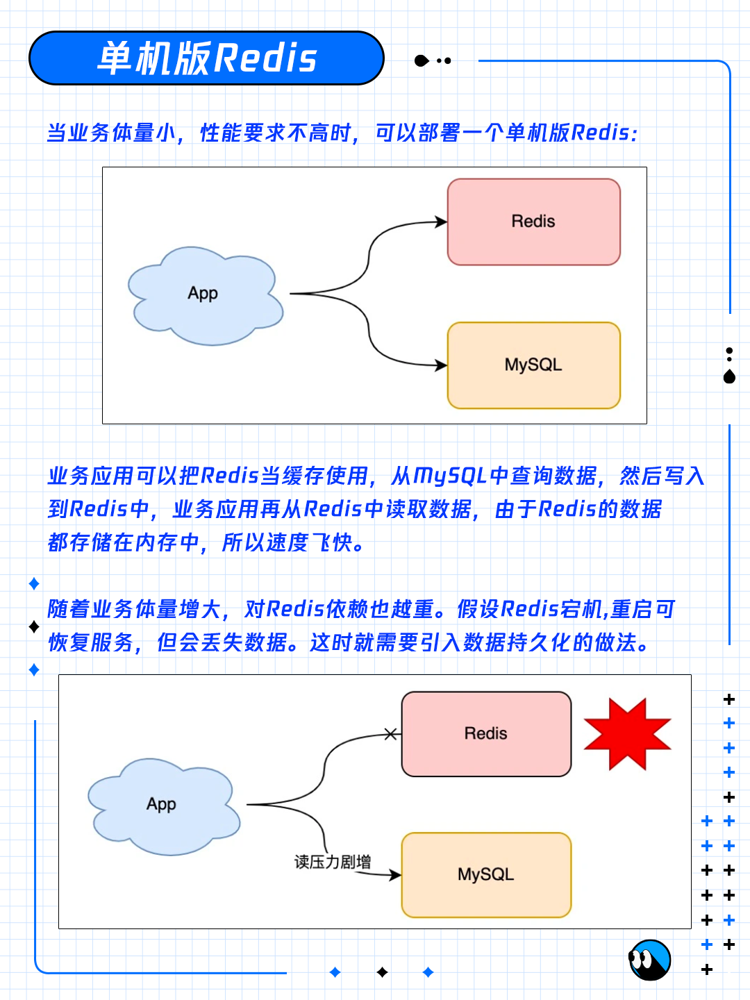

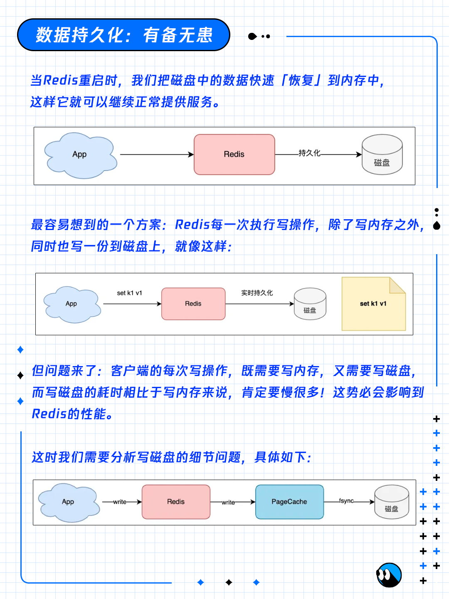

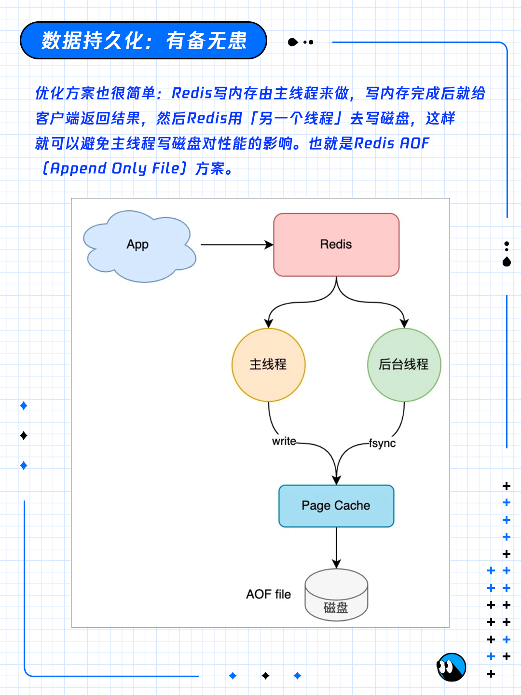

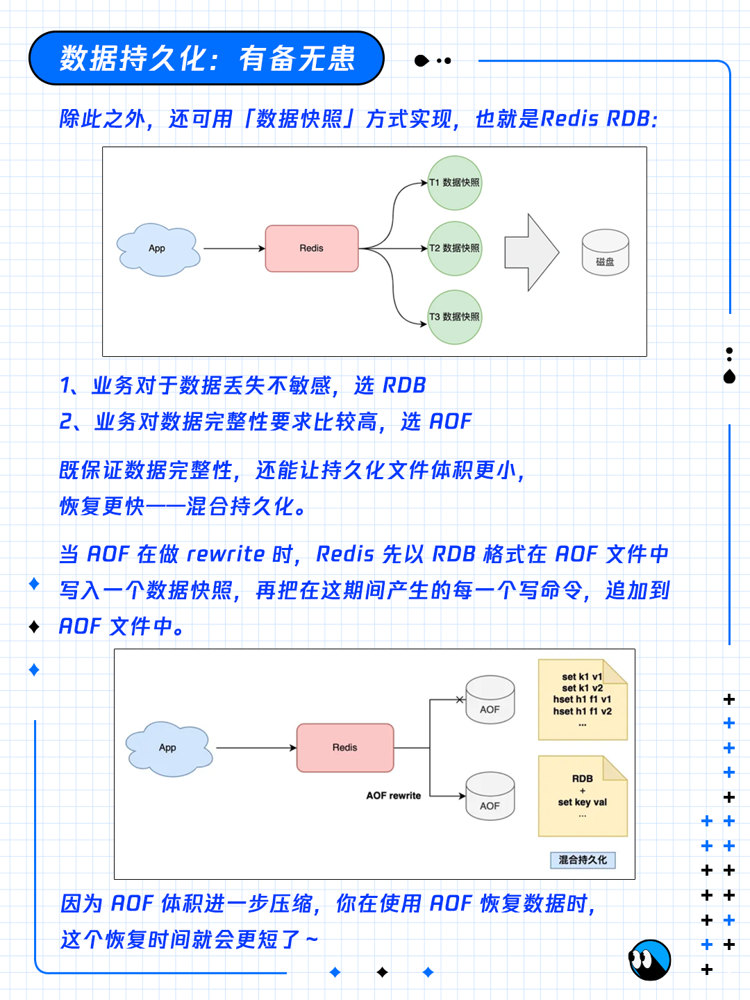

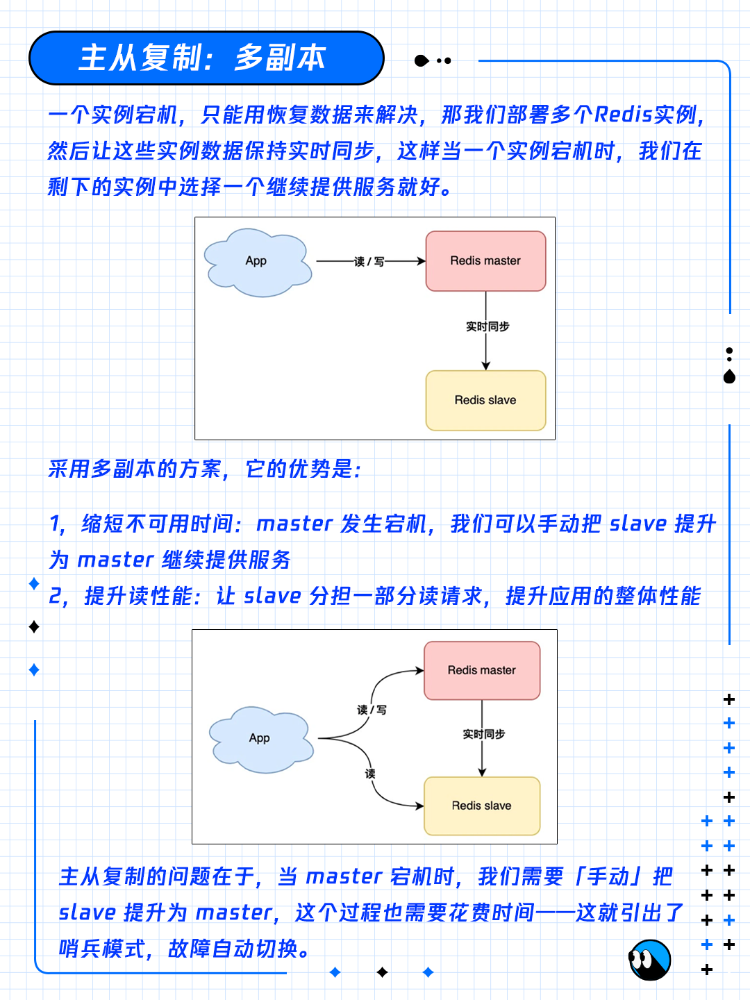

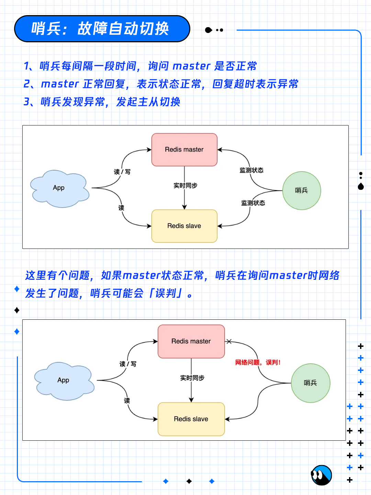

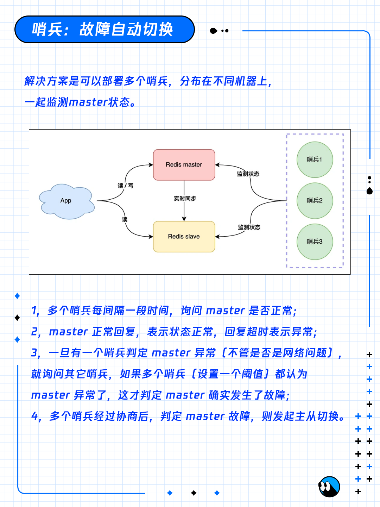

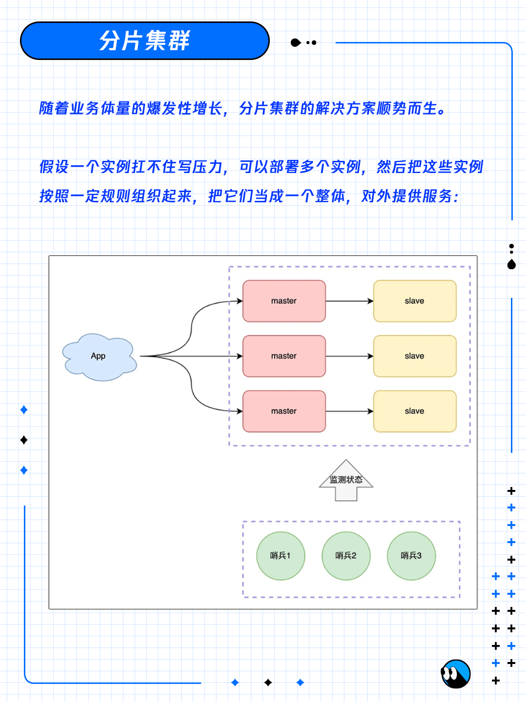

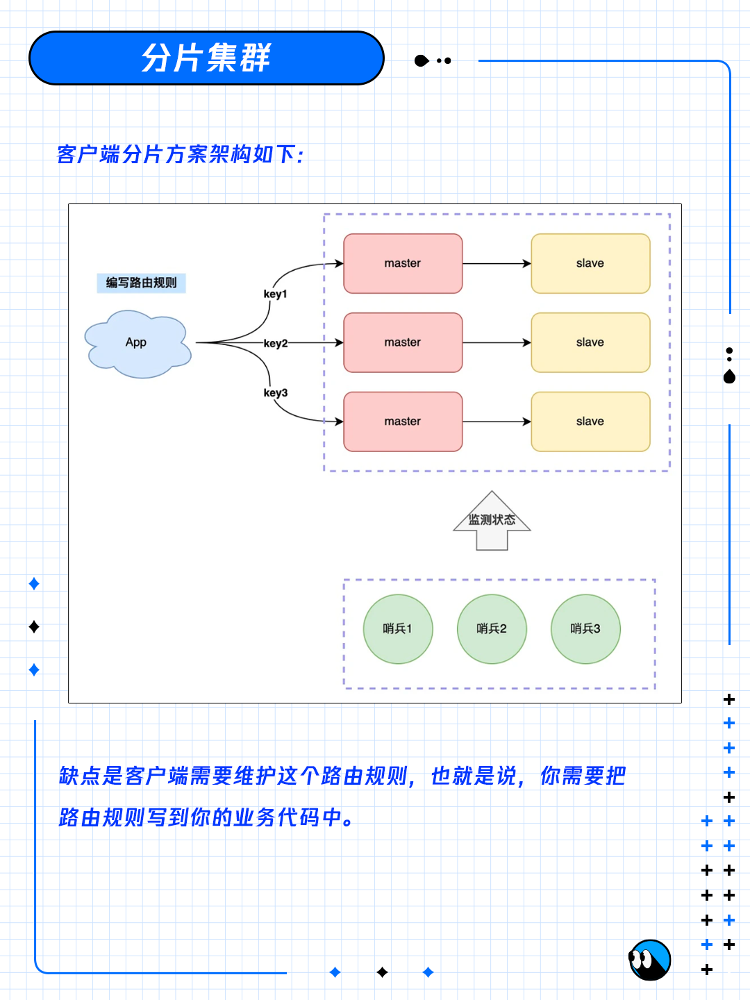

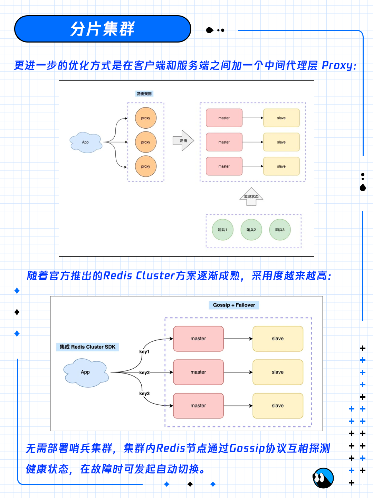

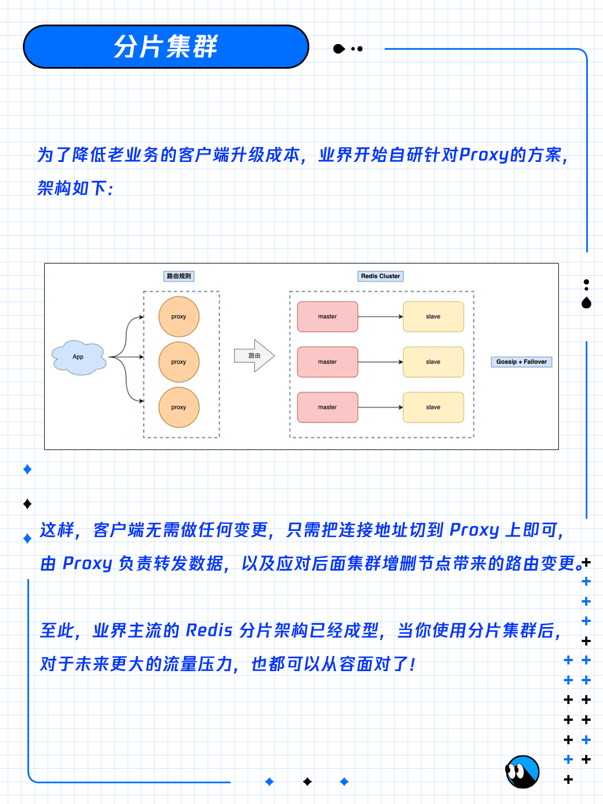