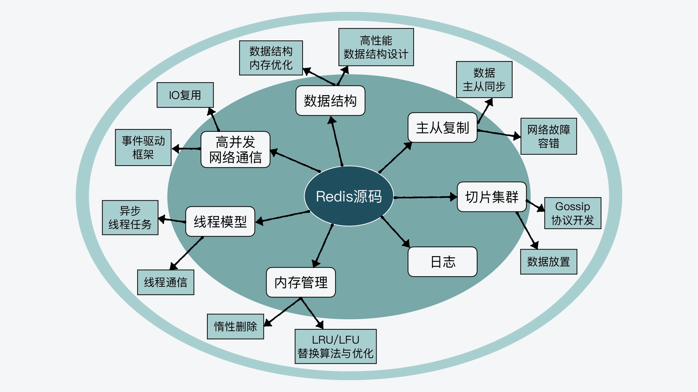

<!--
 * @Author: JohnJeep
 * @Date: 2020-09-05 23:51:27
 * @LastEditors: JohnJeep
 * @LastEditTime: 2025-04-04 20:03:23
 * @Description: redis source code learning
 * Copyright (c) 2025 by John Jeep, All Rights Reserved. 
-->
# Redis 源码

自己学习知识，一般先从整体上了解知识点的整个架构，然后再对每个知识点做具体的学习，这样自己感觉学习的知识才成体系，不会觉得很杂乱无章。本部分主要是对 Redis 源码的解读，结合实际开发中踩过的坑，然后深入去看源码，学习源码，学习源码中优秀的设计思想和理念以及编程技巧，从而来加深自己对 Redis 的理解。

下面这张图从整体上概括了 Redis 源码的结构的分布

其中 Redis 源码目录结构如下图

