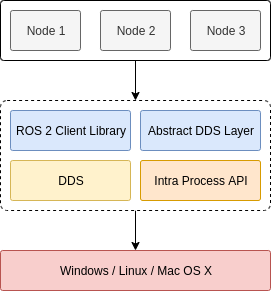

<!--

 * @Author: JohnJeep
 * @Date: 2025-10-17 16:20:49
 * @LastEditors: JohnJeep
 * @LastEditTime: 2026-07-05 14:54:42
 * @Description: ROS2 Usage
 * Copyright (c) 2026 by John Jeep, All Rights Reserved. 
-->

# 1. ROS2 Introduction

机器人已经广泛应用于各种领域，例如自动驾驶、移动机器人、操作机器人、信息机器人等。

机器人系统是很多复杂算法模块的集合，如障碍物检测、行为决策、智能控制、环境识别等。
任何机器人平台的软件堆栈都需要多种软件工具，如硬件驱动程序、网络模块、通信架构和多种机器人算法。

ROS 就是一个强大的机器人编程框架，可以简化机器人应用开发。 ROS
不仅仅是一个中间件，而且用于机器人导航，感知，控制，运动规划，模拟等的无数解决方案和软件包的可用性使 ROS 无法消除。

ROS 目前推出了 ROS1 和 ROS2 两个版本。ROS 具有如下局限性
• ROS 不支持具有相同主节点的多个机器人。
• ROS 本身不支持实时操作，因此不适合时间关键型应用程序。
• ROS 需要高计算资源和板载网络连接才能获得最佳性能。
• 已部署机器人的包管理是有限的。
• 在商业环境中，多个机器人的监控、记录、分析和维护任务非常困难。
• 多机器人 / 车队管理和交互是不可能的。

由于这些原因， ROS 2 被引入改进的架构和增强的功能，并正在迅速被机器人社区采用。

如下是 ROS2 的架构概览图：




# 2. Terms

- IDL: Interface Definition Language
- QoS: Quality of Service
- DDS: Data Distribution Service
- RMW: ROS Middleware
- RCL: ROS Client Library
- RCLCPP: ROS Client Library for C++
- RCLPY: ROS Client Library for Python
- URDF: Unified Robot Description Format
- TF: Transform
- RViz: ROS Visualization
- Gazebo: ROS Simulation


# 3. ROS1 ROS2 Compare

ROS 1 和 ROS 2 的特性对比如下：

| ROS 1                                                         | ROS 2                                                        |
| ------------------------------------------------------------ | ------------------------------------------------------------ |
| 使用 TCPROS （ TCP/IP 的自定义版本）通信协议                 | 使用 DDS （数据分发系统）进行通信                            |
| 使用 ROS Master 进行集中式发现和注册。如果主节点发生故障，完整的通信管道容易发生故障 | 使用 DDS 分布式发现机制。 ROS 2 提供了一个自定义 API 来获取有关节点和主题的所有信息 |
| ROS 只能在 Ubuntu OS 上运行                                  | ROS 2 与 Ubuntu 、 Windows 10 和 OS X 兼容                   |
| 使用 C++ 03 和 Python2                                       | 使用 C++ 11 （可能可升级）和 Python3                         |
| ROS 仅使用 CMake 构建系统                                    | ROS 2 提供了使用其他构建系统的选项                           |
| 是否具有使用单个 CMakeLists 调用的多个包的组合生成 .txt      | 支持包的独立构建，以更好地处理包间依赖关系                   |
| 消息文件中的数据类型不支持默认值                             | 消息文件中的数据类型现在可以在初始化时具有默认值             |
| roslaunch 文件是用 XML 编写的，但功能有限                    | roslaunch 文件是用 Python 编写的，以支持更可配置和有条件的执行 |
| 即使使用实时操作系统，也无法确定性地支持实时行为             | 支持通过 RTPREEMPT 等                                        |

ROS2 相较 ROS1 运行更可靠，持续性更好，更节省资源，消息传递实时性更佳，因此 ROS2 更适合应用在工业生产环境。
基于 ROS2 的以上特点，该框架被广泛应用与工厂 AGV 作业机器人、智能立体仓库、送餐及快递等服务机器人、自动驾驶、机械手智
能控制等新兴智能机器人领域。


## 3.1. 通信架构：中心化 vs 去中心化

**ROS1**：依赖一个中心节点 `roscm master`。所有节点启动时向 master 注册，通过它做名字解析和发现。这意味着 master 是单点故障——它一挂，整个系统的节点发现机制就瘫痪了（虽然已建立的连接还能跑）。

**ROS2**：完全去中心化，底层用 **DDS**（Data Distribution Service，一种工业级的发布订阅中间件标准，比如常见实现有 Fast DDS、Cyclone DDS）。节点之间通过 DDS 的自动发现机制直接找到彼此，没有 master 这个概念。

## 3.2. 实时性与嵌入式支持

- **ROS1** 通信基于 TCP（TCPROS），延迟和抖动都不太可控，本质上不是为硬实时设计的。
- **ROS2** 通过 DDS 支持 QoS（服务质量）策略配置，比如可靠性（reliable/best-effort）、历史深度、超时等，这让它更适合对时序敏感的机器人控制场景。同时 ROS2 有 **micro-ROS**，专门面向资源受限的 MCU（比如你做的 aarch64/嵌入式栈），可以直接跑在裸机或 RTOS 上。

##  3.3. 平台与语言支持

- **ROS1**：主要为 Ubuntu/Linux 设计，官方对 Windows、实时系统、macOS 的支持有限。
- **ROS2**：跨平台设计之初就考虑了 Linux、Windows、macOS，也更好地支持了实时内核。

## 3.4. 生命周期管理

**ROS2** 引入了"托管节点"（managed/lifecycle nodes）的概念，节点有明确的状态机（unconfigured → inactive → active → finalized）。

## 3.5. 安全性

ROS1 基本没有内建安全机制。ROS2 借助 DDS-Security 规范，支持身份认证、访问控制和数据加密，这对工业/商用部署更友好。

## 3.6. 构建系统

- ROS1：`catkin`
- ROS2：`ament` + `colcon`，更接近现代 CMake 的最佳实践，包之间的隔离和依赖管理更清晰（这点如果你在处理 CI 里 `cv_task_msgs` 这类 CMake 依赖问题，会有直接体感）。


# 4. Basic Concepts

## 4.1. Node

节点是 ROS2 中的基本执行单元。每个节点通常负责一个单一的、模块化的功能。
例如，一个节点可以控制激光雷达，另一个节点可以处理激光雷达的数据，第三个节点可以负责运动规划。


讲清楚节点是做什么的？

>  每个节点都是一个可以**独立运行的可执行文件**，执行某些具体的任务。

节点与节点是怎样通信的？

> 通过 topic、service、action 来通信。


特点

1. 每个节点的名称具有唯一性。
2. 节点是独立的，可以运行在同一台机器上，也可以分布在不同的机器上。
3. 一个可执行文件中包含一个或多个节点
4. 每个节点都可以发布或订阅话题，也可以提供或使用服务(service)。


## 4.2. Parameter

Parameter 是 ROS 2 中用于动态配置节点(node)的键值对。它们可以在节点运行时动态修改，而不需要重新编译代码。

实际例子

```ini
节点启动时读取参数：
- 最大速度：1.0 m/s
- 机器人名称："my_robot"
- 使用模拟器：True

在运行时，用户可以通过命令行或图形界面工具动态修改这些参数。
```

**特点：**

- ✅ **动态配置**：可以在节点运行时改变参数值。比如：PID 增益、速度限制
- ✅ **类型安全**：参数有明确的类型（整数、浮点数、字符串、布尔等）。
- ✅ **可动态重新配置**：节点可以响应参数变化并调整行为。
- ✅ **支持多种来源**：可以从 YAML 文件、命令行或参数服务器设置。

**参数使用方式**

1. **声明参数**：节点在启动时声明它需要哪些参数。
2. **设置参数**：用户通过命令行或配置文件设置参数值。
3. **读取参数**：节点在运行过程中读取参数值。
4. **监视参数变化**：节点可以设置回调函数来响应参数变化。

总结：**Topic 用于数据流，Service 用于即时操作，Action 用于长期任务，Parameter 用于配置。** 


## 4.3. Executor

**执行器（Executor）** 它负责让节点“活”起来，并决定节点如何响应外部世界。

### 4.3.1. 核心思想：事件循环

在 ROS2 中，节点可以通过订阅者、计时器、服务服务器、动作服务器等与外部通信。这些组件在创建后，并不会自动运行。它们只是
在等待，就像一堆待办事项清单。

**执行器** 就是一个不断循环的进程，它的工作就是不停地检查这个“待办事项清单”，看看有没有新的事情需要处理。例如：

- 有没有收到新的消息？（订阅者）
- 定时器的时间到了吗？（计时器）
- 有没有收到服务请求？（服务服务器）
- 有没有收到新的动作目标？（动作服务器）

一旦执行器发现某个事件就绪了，它就会调用相应的回调函数来处理它。这个循环过程就是 **事件循环**。

------


### 4.3.2. 为什么需要执行器？

没有执行器，你的节点代码会像下面这样，什么也做不了：

```python
# 伪代码：没有执行器的情况
rospy.init_node('my_node')
sub = rospy.Subscriber('chatter', String, callback_function)
timer = rospy.Timer(rospy.Duration(1.0), timer_callback)

# 程序执行到这里就结束了，永远不会调用callback_function或timer_callback
print("Node created, but doing nothing. Exiting.")
```

执行器的作用就是让程序**停留**在事件循环中，保持节点的活性，使其能够持续响应。

```python
# 伪代码：有执行器的情况
rospy.init_node('my_node')
sub = rospy.Subscriber('chatter', String, callback_function)
timer = rospy.Timer(rospy.Duration(1.0), timer_callback)

executor = SingleThreadedExecutor()
executor.add_node(my_node)
executor.spin() # 程序在这里进入无限循环，处理事件，永远不会退出（除非被中断）
```

## 4.4. Callback Group

当使用 `MultiThreadedExecutor` 时，你可以通过 **回调组（Callback Group）**
来更精细地控制回调的执行策略。主要有两种类型：

- **Mutually Exclusive**：组内的回调**不能**同时执行。即使有多个线程，这个组也像是一个“小单线程”，用于保护共享资源。
- **Reentrant**：组内的回调**可以**同时执行。这是默认行为。

通过将不同的回调分配到不同的组，你可以实现复杂的并发控制，而无需在回调函数内部手动加锁。


# 5. ROS2 Communication

ROS2 提供了多种通信机制，主要包括：**Topic**、**Service** 和 **Action**。每种机制适用于不同的通信场景。

- topic 适用于持续的数据流，例如传感器数据、状态信息等。
- service 适用于需要即时响应的请求-响应场景，例如控制命令、参数查询等。不能用于长时间运行的任务，因为它是同步的。
- action 适用于需要长时间运行、可抢占、有反馈的任务，例如导航、路径规划等。


message 定义文件格式
```
# fieldtype fieldname
```

built-in message types supported 

| ype name | [C++](https://design.ros2.org/articles/generated_interfaces_cpp.html) | [Python](https://design.ros2.org/articles/generated_interfaces_python.html) | [DDS type](https://design.ros2.org/articles/mapping_dds_types.html) |
| -------- | ------------------------------------------------------------ | ------------------------------------------------------------ | ------------------------------------------------------------ |
| bool     | bool                                                         | builtins.bool                                                | boolean                                                      |
| byte     | uint8_t                                                      | builtins.bytes*                                              | octet                                                        |
| char     | char                                                         | builtins.int*                                                | char                                                         |
| float32  | float                                                        | builtins.float*                                              | float                                                        |
| float64  | double                                                       | builtins.float*                                              | double                                                       |
| int8     | int8_t                                                       | builtins.int*                                                | octet                                                        |
| uint8    | uint8_t                                                      | builtins.int*                                                | octet                                                        |
| int16    | int16_t                                                      | builtins.int*                                                | short                                                        |
| uint16   | uint16_t                                                     | builtins.int*                                                | unsigned short                                               |
| int32    | int32_t                                                      | builtins.int*                                                | long                                                         |
| uint32   | uint32_t                                                     | builtins.int*                                                | unsigned long                                                |
| int64    | int64_t                                                      | builtins.int*                                                | long long                                                    |
| uint64   | uint64_t                                                     | builtins.int*                                                | unsigned long long                                           |
| string   | std::string                                                  | builtins.str                                                 | string                                                       |
| wstring  | std::u16string                                               | builtins.str                                                 | wstring                                                      |


每个 built-in-type 可用于定义 array

| Type name               | [C++](https://design.ros2.org/articles/generated_interfaces_cpp.html) | [Python](https://design.ros2.org/articles/generated_interfaces_python.html) | [DDS type](https://design.ros2.org/articles/mapping_dds_types.html) |
| ----------------------- | ------------------------------------------------------------ | ------------------------------------------------------------ | ------------------------------------------------------------ |
| static array            | std::array<T, N>                                             | builtins.list*                                               | T[N]                                                         |
| unbounded dynamic array | std::vector                                                  | builtins.list                                                | sequence                                                     |
| bounded dynamic array   | custom_class<T, N>                                           | builtins.list*                                               | sequence<T, N>                                               |
| bounded string          | std::string                                                  | builtins.str*                                                | string                                                       |


## 5.1. Topic

topic 是节点之间交换信息的一种通信机制。这种通信是单向的、异步的。发布者（Publisher）node 将消息发布到
topic，订阅者（Subscriber）node 从 topic 订阅消息。

特点
- 单向通信：数据从发布者流向订阅者。
- 异步：发布者和订阅者不需要同时运行，也不需要知道彼此的存在。
- 多对多：多个发布者和多个订阅者可以同时使用同一个话题。

topic 通信接口的定义使用的是 `.msg`文件，由于是单向传输，只需要描述传输的每一帧数据是什么就行。

`xxx.msg`
```ini
# text
# fieldtype fieldname

int32 x
int32 y
```

应用场景
- 传感器数据：例如激光雷达、摄像头等传感器的数据流。
- 状态信息：例如机器人的位置、速度、电池状态等。
- 需要持续更新的数据流，例如传感器数据、状态信息等。
- 不适合需要即时响应的操作，因为它是异步的，订阅者可能会有延迟，无法保证及时处理发布者的消息。


## 5.2. Service

service 是节点之间另一种通信机制，这种通信是双向的、同步的。它采用请求(reruest-reponse)-响应模型：一个客户端（Client）
节点发送请求，然后等待服务器（Server）节点处理请求并返回响应。

- client 是 requester
- server 是 responder


特点
- 双向通信：包括请求和响应。
- 同步：客户端发送请求后会阻塞，直到收到响应（当然，ROS2 也支持异步服务调用）。
- 一对多：一个 service server 可以接受多个客户端的请求，但每个请求是串行处理的（除非服务器内部实现多线程）。

service 通信接口的定义使用的是 `.srv` 文件，包含请求和应答两部分定义，通过中间的“---”区分。

`xxx.srv`
```ini
# request
int64 a
int64 b

---
# response
int64 sum
```

应用场景
- 参数查询：客户端请求服务器返回当前参数值。
- 控制命令：客户端发送控制命令，服务器执行并返回结果。
- 数据处理：客户端发送数据请求服务器处理并返回结果。
- 需要即时响应的操作，例如启动或停止某个功能。
- 需要请求-响应模式的交互，例如查询状态、执行命令等。
- 不适合长时间运行的任务，因为它是同步的，客户端会被阻塞直到服务器处理完成并返回响应。


## 5.3. Action

Action 是 ROS 2 中用于处理 **长时间运行(long-running)、可抢占(preempt)、有反馈(feedback)** 的任务的通信机制。它采用
**客户端-服务器** 模式，但比 Service 更复杂。

Action 允许 action client 发送一个目标（Goal）给 action server，action server
在执行过程中可以定期发送反馈（Feedback）给 action
client，最后在任务完成后发送结果（Result）给 action client。

Action 由三部分组成：
1. **Goal（目标）**：客户端发送给服务端的任务目标（例如：移动到某个位置）。
2. **Feedback（反馈）**：服务端在执行过程中定期发送的进度更新（例如：已移动 50%）。
3. **Result（结果）**：任务完成后发送的最终结果（例如：成功到达或失败原因）。

action 用于描述机器人的运动过程。比如：

客户端发送一个运动的目标，想让机器人动起来，服务器端收到之后，就开始控制机器人运动，一边运动，一边反馈当前的状态，如果
是一个导航动作，这个反馈可能是当前所处的坐标，如果是机械臂抓取，这个反馈可能又是机械臂的实时姿态。当运动执行结束后，服
务器再反馈一个动作结束的信息。整个通信过程就此结束。

**特点**
- ✅ **长时间运行**：任务可能需要几秒、几分钟甚至更长时间。
- ✅ **可抢占(preempt)**：客户端可以随时取消正在执行的任务。
- ✅ **有进度反馈**：服务端定期向客户端发送进度更新。
- ✅ **双向通信**：客户端发送目标，服务端返回结果和反馈。
- ✅ Action 可保存 goal 的状态，允许客户端查询当前 goal 的状态（如是否正在执行、是否已完成、是否被取消等）。这使得
  Action 非常适合需要监控和管理的复杂任务。


`action`通信接口的定义使用的是 `.action` 文件。

`xxx.action`

action definition
```ini
<request_type> <request_fieldname>
---
<response_type> <response_fieldname>
---
<feedback_type> <feedback_fieldname>
```

```ini
# goal
bool enable

---
# result
bool finish

---
# feedback
int state
```

使用场景
- 导航：机器人需要从当前位置移动到目标位置，可能需要几秒钟或更长时间。导航过程将走了多远的数据反馈给机器人的控制系统，
  以便调整路径，并在完成后返回结果。导航过程中，机器人可能会遇到障碍物或其他问题，客户端可以随时取消或者抢占导航任务。
- 机械臂控制：机器人需要执行一个复杂的抓取动作，可能需要几秒钟或更长时间。
- 任务执行：机器人需要执行一个复杂的任务，例如清扫房间，可能需要几分钟或更长时间。
- 需要数秒才能终止的慢速感知程序(Slow perception routines)。
- 启动底层控制模式(initiating a lower-level control mode)。
- 更复杂的非阻塞后台处理任务。


## 5.4. QoS Policy

QoS（Quality of Service，服务质量）是 ROS2 通过 DDS 提供的通信质量控制机制。发布者和订阅者需要 QoS 兼容才能建立连接。

### 5.4.1. 核心策略

| 策略 | 选项 | 说明 |
|---|---|---|
| **Reliability** | `RELIABLE` | 保证消息必达，有重传机制 |
| | `BEST_EFFORT` | 尽力投递，允许丢包，延迟更低 |
| **Durability** | `VOLATILE` | 只有订阅者已连接时才投递消息 |
| | `TRANSIENT_LOCAL` | 新订阅者加入时，发布者会重发历史消息 |
| **History** | `KEEP_LAST(N)` | 只保留最近 N 条消息（默认 N=10） |
| | `KEEP_ALL` | 保留所有消息（受系统资源限制） |
| **Deadline** | 时间间隔 | 发布者必须在此间隔内至少发送一条消息 |
| **Liveliness** | `AUTOMATIC` / `MANUAL` | 检测发布者是否仍然存活 |
| **Lifespan** | 时间间隔 | 消息超过此时间未被订阅则丢弃 |

兼容性规则（发布者与订阅者 QoS 必须兼容）：
- Reliability：发布者 `RELIABLE` 兼容订阅者 `RELIABLE` 或 `BEST_EFFORT`；发布者 `BEST_EFFORT` 只兼容订阅者 `BEST_EFFORT`
- Durability：发布者 `TRANSIENT_LOCAL` 兼容任何订阅者；发布者 `VOLATILE` 只兼容订阅者 `VOLATILE`

### 5.4.2. 常用预定义 QoS Profile

ROS2 内置了几种常用 QoS 配置：

| Profile | Reliability | Durability | History | 典型用途 |
|---|---|---|---|---|
| `SensorDataQoS` | BEST_EFFORT | VOLATILE | KEEP_LAST(5) | 激光雷达、IMU 等传感器 |
| `ServicesQoS` | RELIABLE | VOLATILE | KEEP_LAST(10) | Service 通信（默认） |
| `ParametersQoS` | RELIABLE | VOLATILE | KEEP_LAST(1000) | 参数服务器 |
| `ClockQoS` | BEST_EFFORT | VOLATILE | KEEP_LAST(1) | 时钟话题 |
| `SystemDefaultsQoS` | RELIABLE | VOLATILE | KEEP_LAST(10) | 默认配置 |

### 5.4.3. 使用示例

**C++**

```cpp
#include "rclcpp/rclcpp.hpp"
#include "sensor_msgs/msg/laser_scan.hpp"

// 使用预定义 profile
auto qos = rclcpp::SensorDataQoS();
auto pub = node->create_publisher<sensor_msgs::msg::LaserScan>("/scan", qos);

// 自定义 QoS
rclcpp::QoS custom_qos(10);  // history depth = 10
custom_qos.reliability(RMW_QOS_POLICY_RELIABILITY_RELIABLE);
custom_qos.durability(RMW_QOS_POLICY_DURABILITY_TRANSIENT_LOCAL);
auto sub = node->create_subscription<std_msgs::msg::String>(
    "/topic", custom_qos, callback);
```

**Python**

```python
from rclpy.qos import QoSProfile, ReliabilityPolicy, DurabilityPolicy, HistoryPolicy
from rclpy.qos import qos_profile_sensor_data

# 使用预定义 profile
self.pub = self.create_publisher(LaserScan, '/scan', qos_profile_sensor_data)

# 自定义 QoS
qos = QoSProfile(
    reliability=ReliabilityPolicy.RELIABLE,
    durability=DurabilityPolicy.TRANSIENT_LOCAL,
    history=HistoryPolicy.KEEP_LAST,
    depth=10,
)
self.sub = self.create_subscription(String, '/topic', self.callback, qos)
```


# 6. Workflow

## 6.1. Workspace 结构

ROS2 使用**工作空间（workspace）**来组织和构建代码。工作空间的标准目录结构如下：

```
ros2_ws/
├── src/       # 所有源码包放在这里，手动管理
├── build/     # colcon 构建的中间文件（自动生成，不提交 git）
├── install/   # 安装产物，source 此目录即可激活工作空间
└── log/       # 构建日志（自动生成）
```

初始化工作空间：

```bash
mkdir -p ~/ros2_ws/src
cd ~/ros2_ws
colcon build
```

激活工作空间（每次打开新终端都需要执行，或写入 `~/.bashrc`）：

```bash
source ~/ros2_ws/install/setup.bash
```

叠加激活多个工作空间时，后 source 的优先级更高，会覆盖前一个工作空间中的同名包。


## 6.2. 开发流程

1. 设置 ROS2 工作空间
2. 用 `ros2 create` 创建一个 ROS2 包。
   ```bash
   # 创建ROS2包
   ros2 pkg create --build-type ament_cmake --node-name hello_world cpp_hello_world
   ```
3. 编写一个发布者节点
4. 修改`CMakeLists.txt` 和 `package.xml`
   ```cmake
   cmake_minimum_required(VERSION 3.8)
   project(cpp_hello_world)
   
   # 查找依赖
   find_package(ament_cmake REQUIRED)
   find_package(rclcpp REQUIRED)
   
   # 创建可执行文件
   add_executable(hello_world src/hello_world.cpp)
   # 添加依赖
   ament_target_dependencies(hello_world rclcpp)
   
   # 安装可执行文件
   install(TARGETS
     hello_world
     DESTINATION lib/${PROJECT_NAME}
   )
   
   # 导出依赖
   ament_export_dependencies(rclcpp)
   
   # 生成包配置
   ament_package()
   ```
5. 编译包
   ```bash
   cd ~/ros2_ws
   
   # 安装依赖（首次需要）
   rosdep install -i --from-path src --rosdistro humble -y
   
   # 编译包
   colcon build --packages-select cpp_hello_world
   
   # 加载工作空间环境
   source install/setup.bash
   ```
6. 运行节点
   ```bash
   # 方法1：直接运行
   ros2 run cpp_hello_world hello_world
   
   # 方法2：启动并在后台运行
   ros2 run cpp_hello_world hello_world &
   ```
7. 验证节点运行
   ```bash
   # 查看运行的节点
   ros2 node list
   
   # 查看节点信息
   ros2 node info /hello_world_node
   
   # 查看节点输出
   ros2 topic echo /rosout
   ```


# 7. Tools


## 7.1. ament

ament 是 ROS2 的构建系统和包管理工具。它类似于 ROS1 中的 catkin，但针对 ROS2 进行了优化和改进。

ament 的主要功能包括：
- 构建和编译 ROS2 包
- 管理包的依赖关系
- 生成包的安装文件
- 支持多种编译系统（如 CMake、Python setuptools 等）

ament 的使用通常通过 colcon 工具来实现，colcon 是一个通用的构建工具，可以同时处理多个包和工作空间。
```bash
# 使用 colcon 构建工作空间
colcon build
```

colcon 会自动调用 ament 来处理 ROS2 包的构建和安装。

colcon 的详细用法：[colcon](./Colcon.md)


## 7.2. launch

ROS2 系统中用于同时启动多个节点、设置参数、配置命名空间和话题重映射的脚本机制。ROS2 的 launch 文件使用 **Python** 编写（ROS1 用 XML），拥有完整的编程能力。

launch 文件通常放在包的 `launch/` 目录下，命名约定为 `xxx_launch.py`。

### 7.2.1. 基本结构

每个 launch 文件必须实现 `generate_launch_description()` 函数，返回一个 `LaunchDescription` 对象：

```python
from launch import LaunchDescription
from launch_ros.actions import Node

def generate_launch_description():
    return LaunchDescription([
        # 在这里放节点、参数声明、包含其他 launch 文件等
    ])
```

### 7.2.2. 启动节点

```python
from launch import LaunchDescription
from launch_ros.actions import Node

def generate_launch_description():
    return LaunchDescription([
        Node(
            package='my_pkg',           # 包名
            executable='my_node',       # 可执行文件名
            name='custom_node_name',    # 节点名（可选，默认用可执行文件名）
            namespace='my_ns',          # 命名空间（可选）
            output='screen',            # 输出到终端
            parameters=[                # 参数（列表，每项为字典或 yaml 文件路径）
                {'max_speed': 1.0, 'use_sim_time': False}
            ],
            remappings=[                # 话题重映射 [(原名, 新名)]
                ('/cmd_vel', '/robot/cmd_vel'),
            ],
        ),
    ])
```

### 7.2.3. 传递 Launch 参数

通过 `DeclareLaunchArgument` 声明参数，`LaunchConfiguration` 读取参数值，实现 launch 文件的可配置化：

```python
from launch import LaunchDescription
from launch.actions import DeclareLaunchArgument
from launch.substitutions import LaunchConfiguration
from launch_ros.actions import Node

def generate_launch_description():
    use_sim_time_arg = DeclareLaunchArgument(
        'use_sim_time',
        default_value='false',
        description='Use simulation (Gazebo) clock if true',
    )

    return LaunchDescription([
        use_sim_time_arg,
        Node(
            package='my_pkg',
            executable='my_node',
            parameters=[{'use_sim_time': LaunchConfiguration('use_sim_time')}],
        ),
    ])
```

命令行传入参数：

```bash
ros2 launch my_pkg my_launch.py use_sim_time:=true
```

### 7.2.4. 引入其他 Launch 文件

```python
from launch import LaunchDescription
from launch.actions import IncludeLaunchDescription
from launch.launch_description_sources import PythonLaunchDescriptionSource
from ament_index_python.packages import get_package_share_directory
import os

def generate_launch_description():
    nav2_launch = IncludeLaunchDescription(
        PythonLaunchDescriptionSource(
            os.path.join(
                get_package_share_directory('nav2_bringup'),
                'launch', 'navigation_launch.py',
            )
        ),
        launch_arguments={'use_sim_time': 'true'}.items(),
    )

    return LaunchDescription([nav2_launch])
```

### 7.2.5. 条件启动

```python
from launch.actions import DeclareLaunchArgument
from launch.conditions import IfCondition, UnlessCondition
from launch.substitutions import LaunchConfiguration

enable_rviz_arg = DeclareLaunchArgument('enable_rviz', default_value='true')

rviz_node = Node(
    package='rviz2',
    executable='rviz2',
    condition=IfCondition(LaunchConfiguration('enable_rviz')),  # 仅在 enable_rviz=true 时启动
)
```

### 7.2.6. CMakeLists.txt 安装 launch 文件

launch 文件需要通过 CMake 安装才能被 `ros2 launch` 找到：

```cmake
install(DIRECTORY launch/
  DESTINATION share/${PROJECT_NAME}/launch
)
```


# 8. ROS2 Command

## 8.1. run

```bash
ros2 run <package_name> <executable_name>
```


## 8.2. package

创建指令
```bash
# 创建包含依赖的包
ros2 pkg create --build-type ament_cmake \
                --node-name my_node \
                --dependencies rclcpp std_msgs geometry_msgs \
                my_advanced_pkg

# 创建库包（无节点）
ros2 pkg create --build-type ament_cmake my_library_pkg

# 创建包含特定许可证的包
ros2 pkg create --build-type ament_cmake \
                --node-name my_node \
                --license Apache-2.0 \
                my_licensed_pkg
```

## 8.3. node

```bash
# 列出当前所有运行的节点
ros2 node list

# 查看节点详情（发布的话题、订阅的话题、服务、参数等）
ros2 node info /node_name
```


## 8.4. topic

```bash
# 列出当前所有话题
ros2 topic list

# 列出话题并显示消息类型
ros2 topic list -t

# 查看话题详情（类型、发布者数量、订阅者数量）
ros2 topic info /topic_name

# 实时打印话题消息
ros2 topic echo /topic_name

# 查看话题发布频率（Hz）
ros2 topic hz /topic_name

# 手动发布一条消息（一次性）
ros2 topic pub --once /topic_name std_msgs/msg/String '{"data": "hello"}'

# 以指定频率持续发布
ros2 topic pub --rate 10 /cmd_vel geometry_msgs/msg/Twist \
  '{"linear": {"x": 0.5}, "angular": {"z": 0.0}}'
```


## 8.5. service

```bash
# 列出当前所有服务
ros2 service list

# 查看服务的消息类型
ros2 service type /service_name

# 列出服务并显示类型
ros2 service list -t

# 调用服务
ros2 service call /service_name srv_type '{"field": value}'

# 示例：调用加法服务
ros2 service call /add_two_ints example_interfaces/srv/AddTwoInts \
  '{"a": 1, "b": 2}'
```


## 8.6. action

```bash
# 列出当前所有 action
ros2 action list

# 列出 action 并显示类型
ros2 action list -t

# 查看 action 详情
ros2 action info /action_name

# 发送 goal
ros2 action send_goal /action_name action_type '{"goal_field": value}'

# 发送 goal 并打印反馈
ros2 action send_goal --feedback /action_name action_type '{"goal_field": value}'
```


## 8.7. param

```bash
# 列出节点的所有参数
ros2 param list /node_name

# 获取参数值
ros2 param get /node_name param_name

# 设置参数值（运行时动态修改）
ros2 param set /node_name param_name value

# 将节点参数导出到 yaml 文件
ros2 param dump /node_name --output-dir ./

# 从 yaml 文件加载参数
ros2 param load /node_name params.yaml
```


## 8.8. interface

```bash
# 列出所有可用接口（msg/srv/action）
ros2 interface list

# 查看消息定义
ros2 interface show std_msgs/msg/String

# 查看服务定义
ros2 interface show example_interfaces/srv/AddTwoInts

# 查看 action 定义
ros2 interface show nav2_msgs/action/NavigateToPose

# 列出某个包的所有接口
ros2 interface packages
ros2 interface package std_msgs
```


## 8.9. launch

```bash
# 启动 launch 文件
ros2 launch <package_name> <launch_file.py>

# 示例
ros2 launch my_robot bringup_launch.py

# 传入参数
ros2 launch my_robot bringup_launch.py use_sim_time:=true

# 查看 launch 文件支持的参数（不实际启动）
ros2 launch my_robot bringup_launch.py --show-args
```


# 9. Hardware

1. 应用处理器。用层可能只要毫秒级响应

   一块像**树莓派**、**英伟达 Jetson** 或者普通**电脑主板**一样的东西。运行 Linux 系统。

   1. 多核 CPU：一般是 ARM 架构。
   2. GPU
   3. RAM
   4. Memory

2. 运动控制器。运动控制需要微秒级的响应

   一块嵌入在机器人身体里的**专用电路板**，比如基于 **STM32**、**DSP** 或 **FPGA** 的板卡。

   1. MCU：ST 系列
   2. Flash
   3. RAM：容量有限。

3. 底盘

   1. 编码器电机：PID 算法。
   2. 摄像头：USB 摄像头、
   3. 方向轮（可选）

4. 激光雷达

   一般观察指标：扫描频率、扫描角度、测距频率

5. 姿态传感器
   1. 加速度
   2. 陀螺仪
   3. 角度输出（带卡尔曼滤波）

6. 电池


# 10. TF2 Transform Framework

TF2 是 ROS2 中用于管理坐标系变换的核心库，涵盖坐标系树、静态/动态变换发布、坐标查询、坐标点转换等内容。

详细内容见：[TF.md](./TF.md)


# 11. References

- [Offical ROS2](https://ros.org/)
- [ROS2 Document with jazzy](https://docs.ros.org/en/jazzy/index.html)
- [ROS2 Design Articles](https://design.ros2.org/)

---
- [VSCode, Docker, and ROS2](https://www.allisonthackston.com/articles/vscode-docker-ros2.html)
- 清华大学自动化系学生科协 ROS 入门: https://thuasta.org/docs/summer_training/2025/ros2
- [古月居 图书资源](https://book.guyuehome.com/)
- [OriginBot 智能机器人开源套件](http://originbot.org/index.html)
- [动手学 ROS2](http://fishros.com/d2lros2/)
- [宇树具身智能](https://www.unifolm.com/)
- [Lumina 具身智能社区](https://lumina-embodied.ai/)
- [Github 开源的具身智能社区](https://github.com/TianxingChen/Embodied-AI-Guide)
