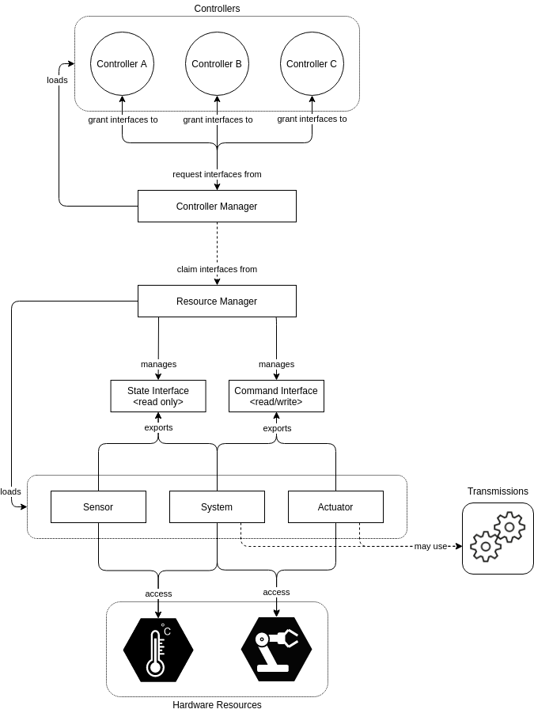
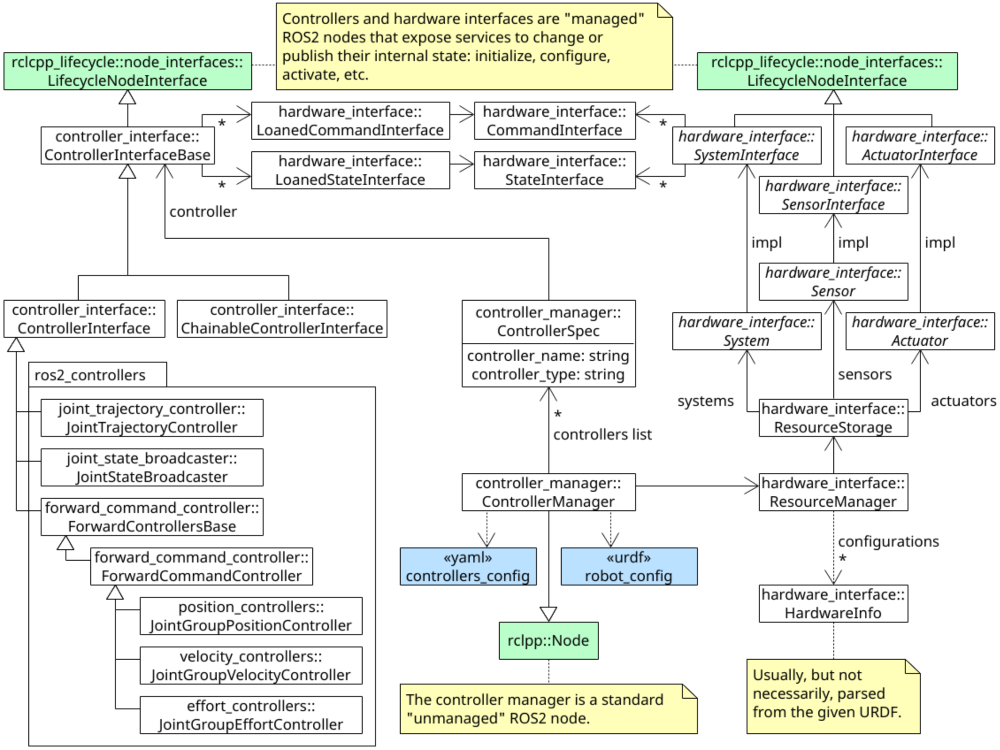

<!--
 * @Author: JohnJeep
 * @Date: 2025-11-01 16:46:49
 * @LastEditors: JohnJeep
 * @LastEditTime: 2026-03-07 15:25:52
 * @Description: ROS2 Control Usage
 * Copyright (c) 2026 by John Jeep, All Rights Reserved. 
-->

- [1. Thinking](#1-thinking)
  - [1.1. ROS2 Control 它是什么？要解决什么问题？](#11-ros2-control-它是什么要解决什么问题)
- [2. References](#2-references)


## 1. Thinking

避免盲目摸索，快速抓住重点，把理论应用到实际项目中。


### 1.1. ROS2 Control 它是什么？要解决什么问题？

想象一下，你要为一个六轴机械臂写控制程序。最直接的（也是最原始的）方式是：写一个 C++/Python 节点，在一个 `while` 循环里，通过某种库（比如 `libusb`、`socket`）直接读取电机编码器值，然后进行逆运动学计算，再通过同样的库把计算出的目标位置/力矩发送给电机。

这种方式有什么问题？

- **紧耦合**：你的核心控制算法（如逆运动学）和底层的硬件通信协议死死地绑在一起。
- **难以复用**：换一个机器人，或者哪怕只是换个电机型号，你的整个代码都需要大改。
- **生态系统割裂**：每个人都有自己的实现方式，无法利用社区共享的、高质量的控制器（比如 `joint_trajectory_controller`）。
- **实时性难保证**：在复杂的 ROS 通信和非实时操作系统（如 Ubuntu）上，很难保证控制循环的硬实时要求。

**ROS2 Control 就是为了解决这些问题而生的。** 它的核心思想是：**“控制器” 与 “硬件” 解耦**。


1. 如何在自己的项目里应用ROS2 Control？比如怎么集成现有硬件，或者调试控制器。

```bash
# Ubuntu deb package install
sudo apt install ros-jazzy-ros2-control ros-jazzy-ros2-controllers
```

1. Controllers(控制器)
2. Controller Manager(控制器管理器)
3. Resource Manager(资源管理器)
4. Hardware Resources(硬件资源)



 UML Class Diagram




## 2. References

- [ros2_control documentation - Jazzy!](https://control.ros.org/jazzy/index.html)
- [Github ROS2 Control](https://github.com/ros-controls/ros2_control)
- [Github ROS2 Controllers](https://github.com/ros-controls/ros2_controllers)
- [os2_control Concepts & Simulation](https://articulatedrobotics.xyz/tutorials/mobile-robot/applications/ros2_control-concepts/)
- [知乎：ros2-control系列教程](https://www.zhihu.com/column/c_1742342009845788672)
- ROS 2 官方 `ros2_control` 教程：https://control.ros.org/
- URDF + ros2_control 示例：[https://github.com/ros-controls/ros2_control_demos](https://github.com/ros-controls/ros2_control_demos?spm=5176.28103460.0.0.2d3c6308fzDXKK)


